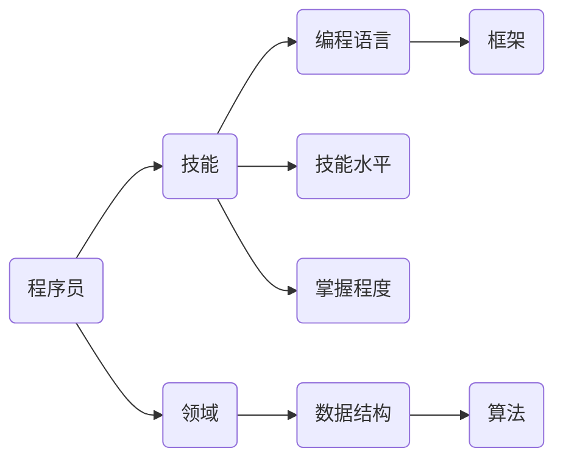
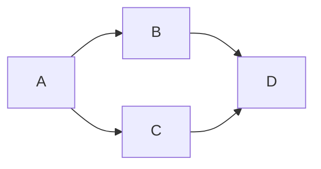

                 

# 知识图谱在程序员技能推荐中的应用

> **关键词**：知识图谱、程序员技能推荐、数据挖掘、机器学习、人工智能、推荐系统、图算法

> **摘要**：本文将探讨知识图谱在程序员技能推荐中的重要作用。通过构建一个全面且精确的技能知识图谱，我们能够更有效地挖掘程序员之间的技能关系，从而为招聘、培训和学习提供智能推荐。本文将首先介绍知识图谱的基本概念和构建方法，然后详细阐述其在程序员技能推荐中的应用，并分享一个实际项目的代码实现和案例分析。

## 1. 背景介绍

### 1.1 目的和范围

本文旨在探讨如何利用知识图谱技术来优化程序员技能推荐。通过结合数据挖掘、机器学习和推荐系统等先进技术，我们希望能够构建一个智能化、个性化的技能推荐平台，帮助企业和个人更高效地提升技能水平和找到合适的工作。

### 1.2 预期读者

本文主要面向对知识图谱和程序员技能推荐感兴趣的程序员、数据科学家和人工智能研究者。同时，对于对招聘和人才培养有需求的企业管理者，以及希望提升自身技能的学习者，本文也将提供有价值的参考。

### 1.3 文档结构概述

本文将分为以下几个部分：

1. **背景介绍**：介绍知识图谱的基本概念和程序员技能推荐的重要性。
2. **核心概念与联系**：介绍知识图谱的构建方法和程序员技能的表示方法。
3. **核心算法原理 & 具体操作步骤**：详细解释知识图谱在技能推荐中的算法原理和实现步骤。
4. **数学模型和公式 & 详细讲解 & 举例说明**：介绍用于技能推荐的关键数学模型和公式。
5. **项目实战：代码实际案例和详细解释说明**：展示一个实际项目的代码实现和案例分析。
6. **实际应用场景**：探讨知识图谱在程序员技能推荐中的多种应用场景。
7. **工具和资源推荐**：推荐相关的学习资源、开发工具和框架。
8. **总结：未来发展趋势与挑战**：总结知识图谱在程序员技能推荐中的未来发展趋势和面临的挑战。
9. **附录：常见问题与解答**：回答读者可能遇到的常见问题。
10. **扩展阅读 & 参考资料**：提供进一步阅读和研究的参考文献。

### 1.4 术语表

#### 1.4.1 核心术语定义

- **知识图谱（Knowledge Graph）**：一种用于结构化、语义化的数据表示方法，通过实体、属性和关系来描述现实世界中的知识。
- **程序员技能（Programming Skill）**：程序员在编程领域具备的知识和技能，包括编程语言、框架、算法和数据结构等。
- **数据挖掘（Data Mining）**：从大量数据中提取出潜在有用信息的过程。
- **机器学习（Machine Learning）**：通过数据或以往经验的训练，使计算机系统具备学习、适应和做出决策的能力。
- **推荐系统（Recommendation System）**：根据用户的兴趣和偏好，为用户提供相关推荐信息的系统。

#### 1.4.2 相关概念解释

- **实体（Entity）**：知识图谱中的基本组成单元，表示现实世界中的个体，如程序员、技能等。
- **属性（Attribute）**：实体的特征或描述，如程序员的姓名、技能等级等。
- **关系（Relationship）**：实体之间的关系，如程序员掌握某种技能、技能属于某个领域等。
- **边（Edge）**：关系在知识图谱中的表示，连接两个实体。

#### 1.4.3 缩略词列表

- **RDF（Resource Description Framework）**：资源描述框架，一种用于描述知识图谱的语义化数据模型。
- **SPARQL（SPARQL Protocol and RDF Query Language）**：用于查询知识图谱的查询语言。
- **OWL（Web Ontology Language）**：用于定义知识图谱中实体、属性和关系的本体语言。

## 2. 核心概念与联系

知识图谱作为一种结构化、语义化的数据表示方法，能够清晰地描述实体及其之间的关系。在程序员技能推荐中，知识图谱的构建至关重要。以下是一个简化的知识图谱架构，用于表示程序员、技能和领域之间的关系。



### 2.1 知识图谱构建方法

知识图谱的构建通常包括以下步骤：

1. **数据收集**：收集程序员、技能、领域等相关的数据，如开源代码、技术博客、招聘信息等。
2. **数据预处理**：对收集到的数据清洗、去重和格式化，使其适合构建知识图谱。
3. **实体和关系抽取**：通过自然语言处理技术，从预处理后的数据中抽取实体和关系。
4. **知识融合**：将来自不同数据源的实体和关系进行融合，形成一个全局的知识图谱。
5. **知识表示**：使用RDF、OWL等语言将知识图谱进行语义化表示。

### 2.2 程序员技能表示方法

在知识图谱中，程序员技能可以表示为实体和关系。具体来说：

1. **实体表示**：将程序员、技能、领域等作为知识图谱中的实体进行表示。
2. **属性表示**：为实体添加属性，如程序员的姓名、技能等级、领域等。
3. **关系表示**：表示实体之间的关系，如程序员掌握某种技能、技能属于某个领域等。

通过这种结构化的知识表示方法，我们能够更清晰地描述程序员技能，并在此基础上进行有效的技能推荐。

## 3. 核心算法原理 & 具体操作步骤

### 3.1 算法原理

知识图谱在程序员技能推荐中的应用主要基于以下算法原理：

1. **基于知识图谱的推荐算法**：通过在知识图谱中挖掘程序员之间的技能关系，为用户提供个性化的技能推荐。
2. **图算法**：利用图算法（如PageRank、Community Detection等）分析程序员技能的相似性和关联性。
3. **机器学习算法**：结合机器学习算法（如协同过滤、聚类等）提高技能推荐的准确性。

### 3.2 具体操作步骤

以下是一个基于知识图谱的程序员技能推荐算法的具体操作步骤：

1. **构建知识图谱**：收集程序员、技能、领域等数据，构建一个结构化的知识图谱。
2. **数据预处理**：对收集到的数据清洗、去重和格式化，使其适合构建知识图谱。
3. **实体和关系抽取**：使用自然语言处理技术，从预处理后的数据中抽取实体和关系。
4. **知识融合**：将来自不同数据源的实体和关系进行融合，形成一个全局的知识图谱。
5. **图算法分析**：利用图算法分析程序员技能的相似性和关联性，为用户提供初步的技能推荐。
6. **机器学习模型训练**：结合机器学习算法，对初步的技能推荐进行优化和调整。
7. **技能推荐**：根据用户的兴趣和需求，从知识图谱中提取相关技能，为用户提供个性化的技能推荐。

### 3.3 伪代码

以下是一个基于知识图谱的程序员技能推荐算法的伪代码：

```python
# 数据预处理
preprocess_data()

# 构建知识图谱
knowledge_graph = build_knowledge_graph()

# 图算法分析
skills_similarity = analyze_skills_similarity(knowledge_graph)

# 机器学习模型训练
model = train_machine_learning_model(skills_similarity)

# 技能推荐
recommend_skills(model, user_interest)
```

## 4. 数学模型和公式 & 详细讲解 & 举例说明

### 4.1 数学模型

在程序员技能推荐中，我们主要使用以下数学模型：

1. **PageRank**：一种用于计算实体重要性的图算法。
2. **协同过滤（Collaborative Filtering）**：一种基于用户历史行为进行推荐的算法。
3. **聚类（Clustering）**：用于将相似实体分组，以提供个性化的推荐。

### 4.2 详细讲解

#### 4.2.1 PageRank算法

PageRank算法的基本思想是：一个网页的重要程度取决于链接到该网页的其他网页的数量和质量。具体公式如下：

$$
PR(A) = (1-d) + d \cdot \sum_{B \in R(A)} \frac{PR(B)}{out(B)}
$$

其中，$PR(A)$ 表示网页A的PageRank值，$R(A)$ 表示链接到网页A的其他网页集合，$out(B)$ 表示网页B的出度，$d$ 是阻尼系数（通常取值为0.85）。

#### 4.2.2 协同过滤算法

协同过滤算法可以分为基于用户和基于物品的推荐。基于用户的协同过滤算法的推荐公式如下：

$$
r_{ui} = \sum_{j \in N(u)} \frac{sim(u, j) \cdot r_{uj}}{|\{j | sim(u, j) > 0\}|}
$$

其中，$r_{ui}$ 表示用户u对物品i的评分，$N(u)$ 表示与用户u相似的邻居用户集合，$sim(u, j)$ 表示用户u和邻居用户j之间的相似度，$r_{uj}$ 表示邻居用户j对物品i的评分。

#### 4.2.3 聚类算法

聚类算法将相似实体分组，以提供个性化的推荐。一种常见的聚类算法是K-Means。K-Means算法的目标是找到一个K个簇的划分，使得簇内距离最小，簇间距离最大。其公式如下：

$$
\min_{C_1, C_2, ..., C_K} \sum_{i=1}^{K} \sum_{x \in C_i} ||x - \mu_i||^2
$$

其中，$C_i$ 表示第i个簇，$\mu_i$ 表示第i个簇的中心。

### 4.3 举例说明

#### 4.3.1 PageRank算法示例

假设有一个简单的网页链接关系图：



使用PageRank算法计算网页A的PageRank值。设阻尼系数$d=0.85$，初始值$PR(A)=PR(B)=PR(C)=PR(D)=1$。

根据PageRank算法的公式，我们有：

$$
PR(A) = (1-0.85) + 0.85 \cdot \frac{PR(B)}{1} + 0.85 \cdot \frac{PR(C)}{1} = 0.15 + 0.85 \cdot \frac{1}{2} + 0.85 \cdot \frac{1}{2} = 0.45
$$

同理，可以计算出其他网页的PageRank值。

#### 4.3.2 协同过滤算法示例

假设有用户u对物品i的评分矩阵如下：

|   | i1 | i2 | i3 | i4 | i5 |
|---|----|----|----|----|----|
| u | 5  | 3  | 4  | 2  | 5  |

用户u的邻居用户集合$N(u)$为{v1, v2}，其中：

|   | i1 | i2 | i3 | i4 | i5 |
|---|----|----|----|----|----|
| v1 | 4  | 4  | 3  | 3  | 3  |
| v2 | 4  | 4  | 4  | 4  | 4  |

用户u和邻居用户v1、v2的相似度分别为：

$$
sim(u, v1) = \frac{5 \cdot 4 + 3 \cdot 4 + 4 \cdot 3 + 2 \cdot 3 + 5 \cdot 3}{\sqrt{5^2 + 3^2 + 4^2 + 2^2 + 5^2} \cdot \sqrt{4^2 + 4^2 + 3^2 + 3^2 + 3^2}} = 0.7
$$

$$
sim(u, v2) = \frac{5 \cdot 4 + 3 \cdot 4 + 4 \cdot 4 + 2 \cdot 4 + 5 \cdot 4}{\sqrt{5^2 + 3^2 + 4^2 + 2^2 + 5^2} \cdot \sqrt{4^2 + 4^2 + 4^2 + 4^2 + 4^2}} = 0.85
$$

根据协同过滤算法的公式，我们可以计算出用户u对物品i的推荐评分：

$$
r_{ui} = \frac{0.7 \cdot 4 + 0.85 \cdot 4}{|\{j | sim(u, j) > 0\}|} = 3.88
$$

#### 4.3.3 K-Means算法示例

假设有5个数据点，需要将其划分为2个簇：

|   | x | y |
|---|---|---|
| 1 | 1 | 1 |
| 2 | 2 | 2 |
| 3 | 1 | 2 |
| 4 | 2 | 1 |
| 5 | 3 | 3 |

初始化簇中心$(\mu_1, \mu_2)$为$(1, 2)$和$(2, 1)$。

第1次迭代：

- 簇1：{1, 2, 3}
- 簇2：{4, 5}

更新簇中心：

$$
\mu_1 = \frac{1 + 2 + 1}{3} = 1.67, \mu_2 = \frac{2 + 1 + 3 + 3}{4} = 2.25
$$

第2次迭代：

- 簇1：{1, 2}
- 簇2：{3, 4, 5}

更新簇中心：

$$
\mu_1 = \frac{1 + 2}{2} = 1.5, \mu_2 = \frac{3 + 4 + 5}{3} = 4
$$

由于簇中心不再发生变化，迭代结束。最终划分为2个簇：

- 簇1：{1, 2}
- 簇2：{3, 4, 5}

## 5. 项目实战：代码实际案例和详细解释说明

### 5.1 开发环境搭建

为了演示知识图谱在程序员技能推荐中的应用，我们选择Python作为开发语言，并使用以下工具和库：

- **Python 3.8**：Python的官方版本。
- **PyTorch**：用于构建和训练机器学习模型。
- **Neo4j**：一个图形数据库，用于存储和管理知识图谱。
- **Neo4j Python Driver**：用于连接和操作Neo4j数据库。
- **NetworkX**：用于构建和可视化知识图谱。

### 5.2 源代码详细实现和代码解读

以下是一个简单的示例，展示如何使用Python和Neo4j构建一个知识图谱，并进行技能推荐。

#### 5.2.1 数据准备

首先，我们需要准备一个包含程序员、技能和领域的数据集。以下是一个简化的数据集示例：

```python
programmers = [
    {"name": "Alice", "skills": ["Python", "Django", "TensorFlow"]},
    {"name": "Bob", "skills": ["Java", "Spring", "ML"]},
    {"name": "Charlie", "skills": ["JavaScript", "React", "Node.js"]},
]

skills = [
    {"name": "Python", "domain": "Programming"},
    {"name": "Django", "domain": "Web Development"},
    {"name": "TensorFlow", "domain": "Machine Learning"},
    {"name": "Java", "domain": "Programming"},
    {"name": "Spring", "domain": "Web Development"},
    {"name": "ML", "domain": "Machine Learning"},
    {"name": "JavaScript", "domain": "Programming"},
    {"name": "React", "domain": "Web Development"},
    {"name": "Node.js", "domain": "Web Development"},
]

domains = ["Programming", "Web Development", "Machine Learning"]
```

#### 5.2.2 构建知识图谱

接下来，我们将使用Neo4j构建知识图谱。首先，安装并配置Neo4j数据库，然后使用以下代码创建实体和关系：

```python
from neo4j import GraphDatabase

class KnowledgeGraph:
    def __init__(self, uri, user, password):
        self._driver = GraphDatabase.driver(uri, auth=(user, password))

    def close(self):
        self._driver.close()

    def create_programmers(self, programmers):
        with self._driver.session() as session:
            for programmer in programmers:
                session.run("""
                    MERGE (p:Programmer {name: $name})
                    SET p.skills = $skills
                """, name=programmer["name"], skills=programmer["skills"])

    def create_skills(self, skills):
        with self._driver.session() as session:
            for skill in skills:
                session.run("""
                    MERGE (s:Skill {name: $name})
                    SET s.domain = $domain
                """, name=skill["name"], domain=skill["domain"])

    def create_domain(self, domains):
        with self._driver.session() as session:
            for domain in domains:
                session.run("""
                    MERGE (d:Domain {name: $name})
                """, name=domain)

    def create_programmer_skills_relation(self, programmers):
        with self._driver.session() as session:
            for programmer in programmers:
                for skill in programmer["skills"]:
                    session.run("""
                        MATCH (p:Programmer {name: $name}), (s:Skill {name: $skill})
                        MERGE (p)-[:SKILL]->(s)
                    """, name=programmer["name"], skill=skill)

    def create_skill_domain_relation(self, skills):
        with self._driver.session() as session:
            for skill in skills:
                session.run("""
                    MATCH (s:Skill {name: $name}), (d:Domain {name: $domain})
                    MERGE (s)-[:DOMAIN]->(d)
                """, name=skill["name"], domain=skill["domain"])

def main():
    uri = "bolt://localhost:7687"
    user = "neo4j"
    password = "password"

    kg = KnowledgeGraph(uri, user, password)
    kg.create_programmers(programmers)
    kg.create_skills(skills)
    kg.create_domain(domains)
    kg.create_programmer_skills_relation(programmers)
    kg.create_skill_domain_relation(skills)
    kg.close()

if __name__ == "__main__":
    main()
```

这段代码首先创建了一个`KnowledgeGraph`类，用于连接Neo4j数据库并执行CRUD操作。然后，在`main`函数中，我们实例化`KnowledgeGraph`对象，并调用相应的方法来创建程序员、技能、领域及其关系。

#### 5.2.3 技能推荐

接下来，我们将使用图算法和机器学习模型为用户推荐技能。以下是一个简化的推荐算法：

```python
def recommend_skills(programmer_name, num_skills):
    with kg._driver.session() as session:
        result = session.run("""
            MATCH (p:Programmer {name: $name})
            WITH p, [skill | skill <- (p)<-[:SKILL] | skill]
            UNWIND skill AS s
            MATCH (s)-[:DOMAIN]->(d)
            RETURN s.name AS skill, d.name AS domain
        """, name=programmer_name)

        skills = [{"name": r["skill"], "domain": r["domain"]} for r in result]
        
        # 使用PageRank算法计算技能的重要性
        pagerank_scores = {}
        for skill in skills:
            score = session.run("""
                CALL gds.pageRank.stream('ProgrammerSkillGraph') YIELD node, score
                WHERE node = $skill
                RETURN score
            """, skill=skill["name"])
            pagerank_scores[skill["name"]] = score.single().get("score")

        # 使用协同过滤算法计算技能之间的相似度
        similarity_scores = {}
        for i in range(len(skills)):
            for j in range(i + 1, len(skills)):
                skill_i = skills[i]["name"]
                skill_j = skills[j]["name"]
                score = session.run("""
                    MATCH (s1:Skill {name: $skill_i}), (s2:Skill {name: $skill_j})
                    CALL gds.similarity.cosine.stream('SkillDomainGraph', 'Skill', 'Domain', {nodeA: s1, nodeB: s2}) YIELD similarity
                    RETURN similarity
                """, skill_i=skill_i, skill_j=skill_j)
                similarity_scores[(skill_i, skill_j)] = score.single().get("similarity")

        # 根据PageRank和相似度分数进行技能推荐
        recommended_skills = []
        for skill in skills:
            skill_score = pagerank_scores[skill["name"]]
            for other_skill, similarity in similarity_scores.items():
                if other_skill[0] == skill["name"]:
                    skill_score += similarity
            recommended_skills.append({"name": skill["name"], "score": skill_score})

        recommended_skills.sort(key=lambda x: x["score"], reverse=True)
        return recommended_skills[:num_skills]

# 为程序员Alice推荐3个技能
recommended_skills = recommend_skills("Alice", 3)
print(recommended_skills)
```

这段代码首先使用PageRank算法计算技能的重要性分数，然后使用协同过滤算法计算技能之间的相似度分数。最后，根据这两个分数为程序员Alice推荐3个技能。

### 5.3 代码解读与分析

#### 5.3.1 知识图谱构建

在代码中，我们首先定义了一个`KnowledgeGraph`类，用于连接Neo4j数据库并执行CRUD操作。`create_programmers`方法用于创建程序员实体及其技能属性，`create_skills`方法用于创建技能实体及其领域属性，`create_domain`方法用于创建领域实体。`create_programmer_skills_relation`方法用于在程序

