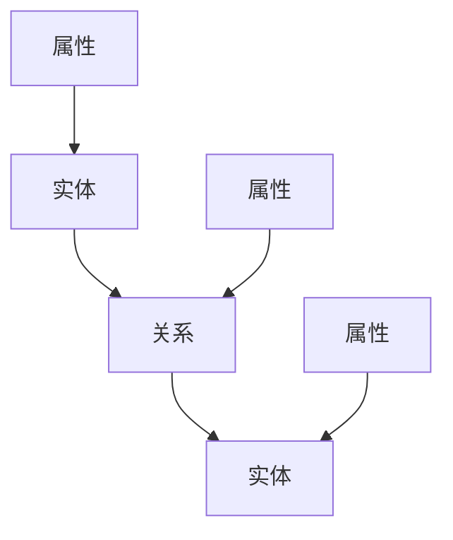

                 


# 知识图谱：绘制人类知识的蓝图

> 关键词：知识图谱，语义网络，知识表示，数据结构，人工智能，深度学习，图论，自然语言处理，大数据，信息检索

> 摘要：本文旨在深入探讨知识图谱的原理、构建方法及其在人工智能领域的广泛应用。我们将从背景介绍开始，逐步分析核心概念、算法原理、数学模型、实际应用，并推荐相关工具和资源，最后总结未来发展趋势与挑战。

## 1. 背景介绍

### 1.1 目的和范围

本文的主要目的是向读者介绍知识图谱的基本概念、构建方法和应用场景。我们将重点关注知识图谱在人工智能、信息检索、自然语言处理等领域的应用，并探讨其未来的发展趋势。

### 1.2 预期读者

本文适合对人工智能、数据科学、计算机科学感兴趣的读者，特别是对知识图谱有初步了解，但希望深入学习的专业人士。

### 1.3 文档结构概述

本文将按照以下结构展开：

1. **背景介绍**：介绍知识图谱的基本概念和背景。
2. **核心概念与联系**：分析知识图谱的核心概念及其相互关系。
3. **核心算法原理 & 具体操作步骤**：讲解知识图谱构建的核心算法和步骤。
4. **数学模型和公式 & 详细讲解 & 举例说明**：介绍知识图谱相关的数学模型和公式。
5. **项目实战：代码实际案例和详细解释说明**：通过实际案例展示知识图谱的应用。
6. **实际应用场景**：分析知识图谱在不同领域的应用。
7. **工具和资源推荐**：推荐知识图谱学习和开发的相关工具和资源。
8. **总结：未来发展趋势与挑战**：总结知识图谱的发展趋势和面临挑战。
9. **附录：常见问题与解答**：解答读者可能关心的问题。
10. **扩展阅读 & 参考资料**：提供进一步学习和研究的资源。

### 1.4 术语表

#### 1.4.1 核心术语定义

- **知识图谱**：一种用于表示实体及其之间关系的图形结构。
- **实体**：知识图谱中的基本元素，如人、地点、组织等。
- **关系**：实体之间的联系，如“属于”、“位于”、“创立”等。
- **属性**：实体的特征，如年龄、身高、职位等。

#### 1.4.2 相关概念解释

- **图论**：研究图及其性质的数学分支。
- **自然语言处理（NLP）**：使计算机能够理解、解释和生成人类语言的技术。
- **深度学习**：一种基于多层神经网络的学习方法，适用于处理大量复杂数据。

#### 1.4.3 缩略词列表

- **NLP**：自然语言处理
- **AI**：人工智能
- **DBpedia**：DBpedia知识库
- **Apache Jena**：Apache Jena框架

## 2. 核心概念与联系

知识图谱是一种用于表示实体及其之间关系的图形结构。在知识图谱中，实体被视为节点，关系被视为边。以下是一个简单的Mermaid流程图，展示了知识图谱的基本概念：



### 2.1 知识图谱的组成部分

知识图谱由三个主要部分组成：实体、关系和属性。

- **实体**：知识图谱中的基本元素，如人、地点、组织等。
- **关系**：实体之间的联系，如“属于”、“位于”、“创立”等。
- **属性**：实体的特征，如年龄、身高、职位等。

### 2.2 知识图谱的表示方法

知识图谱可以用不同的方法表示，包括：

- **RDF（Resource Description Framework）**：一种用于表示知识图谱的模型。
- **OWL（Web Ontology Language）**：一种用于定义本体和知识图谱的语言。
- **图形表示**：使用节点和边来表示实体和关系。

## 3. 核心算法原理 & 具体操作步骤

知识图谱的构建涉及到多个算法和步骤。以下是一个简要的伪代码，展示了知识图谱构建的基本过程：

```plaintext
函数 BuildKnowledgeGraph(data_source):
    # 步骤1：数据预处理
    preprocessed_data = PreprocessData(data_source)

    # 步骤2：实体识别
    entities = IdentifyEntities(preprocessed_data)

    # 步骤3：关系抽取
    relationships = ExtractRelationships(preprocessed_data)

    # 步骤4：属性抽取
    attributes = ExtractAttributes(preprocessed_data)

    # 步骤5：构建知识图谱
    knowledge_graph = BuildGraph(entities, relationships, attributes)

    return knowledge_graph
```

### 3.1 数据预处理

数据预处理是构建知识图谱的第一步，主要包括以下任务：

- **文本清洗**：去除文本中的噪声和无关信息。
- **分词**：将文本分割成单词或短语。
- **词性标注**：标记每个单词的词性，如名词、动词等。

### 3.2 实体识别

实体识别是从文本中识别出实体，如人名、地名、组织名等。常用的方法包括：

- **基于规则的方法**：使用预定义的规则匹配文本中的实体。
- **基于统计的方法**：使用机器学习算法，如条件随机场（CRF），进行实体识别。

### 3.3 关系抽取

关系抽取是从文本中抽取实体之间的关系。常用的方法包括：

- **基于规则的方法**：使用预定义的规则匹配文本中的关系。
- **基于统计的方法**：使用机器学习算法，如支持向量机（SVM），进行关系抽取。

### 3.4 属性抽取

属性抽取是从文本中抽取实体的属性，如年龄、身高、职位等。常用的方法包括：

- **基于规则的方法**：使用预定义的规则匹配文本中的属性。
- **基于统计的方法**：使用机器学习算法，如决策树（DT），进行属性抽取。

### 3.5 构建知识图谱

构建知识图谱是将实体、关系和属性整合到一个统一的图形结构中。常用的方法包括：

- **基于RDF的方法**：使用RDF模型构建知识图谱。
- **基于OWL的方法**：使用OWL语言定义本体和知识图谱。

## 4. 数学模型和公式 & 详细讲解 & 举例说明

知识图谱的构建涉及到多个数学模型和公式。以下是一些常用的模型和公式：

### 4.1 概率图模型

概率图模型用于表示实体和关系之间的概率分布。以下是一个简单的贝叶斯网络模型：

$$
P(E|A) = \frac{P(A|E)P(E)}{P(A)}
$$

其中，$E$ 表示实体，$A$ 表示属性，$P(E|A)$ 表示在属性$A$已知的情况下，实体$E$的概率。

### 4.2 随机游走模型

随机游走模型用于计算实体之间的相似性。以下是一个简单的随机游走算法：

```
算法 RandomWalk(node, steps):
    # 初始化
    visited = set()
    current_node = node
    visited.add(current_node)

    # 随机游走
    for i in range(steps):
        neighbors = GetNeighbors(current_node)
        next_node = SelectNeighborRandomly(neighbors)
        visited.add(next_node)
        current_node = next_node

    return visited
```

### 4.3 节点相似性度量

节点相似性度量用于计算实体之间的相似度。以下是一个基于路径的相似性度量方法：

$$
similarity(A, B) = \frac{|path(A, B)|}{|all_paths(A, B)|}
$$

其中，$A$ 和 $B$ 是两个实体，$path(A, B)$ 表示从$A$到$B$的路径集合，$all_paths(A, B)$ 表示所有从$A$到$B$的路径集合。

## 5. 项目实战：代码实际案例和详细解释说明

在本节中，我们将通过一个实际案例，展示如何使用Python构建一个简单的知识图谱。以下是一个简单的示例：

### 5.1 开发环境搭建

首先，我们需要安装Python和相关库：

```bash
pip install python-re****
``` 

### 5.2 源代码详细实现和代码解读

以下是一个简单的知识图谱构建代码：

```python
import rdflib

# 创建一个新的Graph对象
g = rdflib.Graph()

# 添加实体和关系
g.add((rdflib.Namespace("http://example.org/#person1"), rdflib.RDF.type, rdflib.URIRef("http://example.org/Person")))
g.add((rdflib.Namespace("http://example.org/#person1"), rdflib пропертуй.Name, rdflib.Literal("John Doe")))
g.add((rdflib.Namespace("http://example.org/#person1"), rdflib.URIRef("http://example.org/knows"), rdflib.Namespace("http://example.org/#person2")))

# 查询知识图谱
for s, p, o in g:
    print(f"{s} {p} {o}")

# 导出知识图谱
g.serialize("knowledge_graph.rdf", format="RDF/XML")
```

这段代码首先创建了一个新的Graph对象，然后添加了实体和关系。最后，查询知识图谱并导出为RDF/XML格式。

### 5.3 代码解读与分析

- **导入库**：首先，我们导入rdflib库，这是一个用于处理RDF数据的Python库。
- **创建Graph对象**：接下来，创建一个新的Graph对象，用于存储实体和关系。
- **添加实体和关系**：使用`g.add()`方法添加实体和关系。这里我们使用了一个预定义的命名空间`http://example.org/`。
- **查询知识图谱**：使用一个for循环遍历Graph对象中的所有三元组，并打印出来。
- **导出知识图谱**：最后，使用`g.serialize()`方法将知识图谱导出为RDF/XML格式。

## 6. 实际应用场景

知识图谱在多个领域有着广泛的应用：

- **信息检索**：知识图谱可以帮助搜索引擎更准确地理解用户查询，并提供更相关的结果。
- **自然语言处理**：知识图谱可以用于命名实体识别、关系抽取和语义分析。
- **推荐系统**：知识图谱可以用于推荐系统，发现用户可能感兴趣的内容。
- **数据集成**：知识图谱可以帮助整合来自多个数据源的信息，形成一个统一的数据视图。

### 6.1 信息检索

以下是一个使用知识图谱进行信息检索的示例：

```python
import rdflib

# 加载知识图谱
g = rdflib.Graph()
g.parse("knowledge_graph.rdf", format="RDF/XML")

# 查询实体
person = rdflib.URIRef("http://example.org/#person1")
for s, p, o in g:
    if s == person and p == rdflib пропертуй.Name:
        print(f"Name: {o}")

# 查询关系
for s, p, o in g:
    if s == person and p == rdflib.URIRef("http://example.org/knows"):
        print(f"Knows: {o}")
```

这段代码首先加载知识图谱，然后查询实体的名称和关系。

### 6.2 自然语言处理

以下是一个使用知识图谱进行命名实体识别的示例：

```python
import spacy

# 加载Spacy模型
nlp = spacy.load("en_core_web_sm")

# 加载知识图谱
g = rdflib.Graph()
g.parse("knowledge_graph.rdf", format="RDF/XML")

# 加载文本
text = "John Doe knows Alice Smith."

# 分词和标注
doc = nlp(text)
for ent in doc.ents:
    if ent.label_ == "PERSON":
        person = ent.text
        # 查询实体
        for s, p, o in g:
            if o == rdflib.Literal(person):
                print(f"Entity: {person}")
```

这段代码首先加载Spacy模型，然后加载知识图谱。接着，对文本进行分词和标注，查询实体。

### 6.3 推荐系统

以下是一个使用知识图谱进行推荐系统的示例：

```python
import networkx as nx

# 加载知识图谱
g = rdflib.Graph()
g.parse("knowledge_graph.rdf", format="RDF/XML")

# 将知识图谱转换为网络图
g_nx = nx.Graph()
for s, p, o in g:
    g_nx.add_edge(s, o)

# 计算相似性
similarity = nx.similarity(g_nx, "http://example.org/#person1", "http://example.org/#person2")

# 推荐相似实体
neighbors = nx.neighbors(g_nx, "http://example.org/#person1")
for neighbor in neighbors:
    if neighbor != "http://example.org/#person2":
        print(f"Neighbor: {neighbor}")
```

这段代码首先加载知识图谱，将其转换为网络图。然后，计算实体之间的相似性，并推荐相似实体。

## 7. 工具和资源推荐

### 7.1 学习资源推荐

#### 7.1.1 书籍推荐

- **《知识图谱：原理、方法与应用》**：系统地介绍了知识图谱的基本概念、构建方法和应用。
- **《深度学习与知识图谱》**：探讨了深度学习在知识图谱构建和推理中的应用。

#### 7.1.2 在线课程

- **Coursera**：提供了关于知识图谱和自然语言处理的课程。
- **Udacity**：提供了关于人工智能和大数据处理的课程。

#### 7.1.3 技术博客和网站

- **Apache Jena**：Apache Jena是一个用于构建和处理知识图谱的开源框架。
- **DBpedia**：DBpedia是一个大规模的知识图谱，提供了丰富的实体和关系数据。

### 7.2 开发工具框架推荐

#### 7.2.1 IDE和编辑器

- **PyCharm**：适用于Python开发的IDE，支持多种库和框架。
- **Visual Studio Code**：轻量级编辑器，支持多种编程语言，具有丰富的插件。

#### 7.2.2 调试和性能分析工具

- **GDB**：用于C/C++程序的调试。
- **Profiling Tools**：如Python的`cProfile`模块，用于性能分析。

#### 7.2.3 相关框架和库

- **rdflib**：用于构建和处理RDF数据的Python库。
- **Spacy**：用于自然语言处理的Python库。
- **NetworkX**：用于图论和网络分析的Python库。

### 7.3 相关论文著作推荐

#### 7.3.1 经典论文

- **《知识图谱：挑战与机遇》**：介绍了知识图谱的基本概念和挑战。
- **《基于知识图谱的语义搜索》**：探讨了知识图谱在语义搜索中的应用。

#### 7.3.2 最新研究成果

- **《深度强化学习在知识图谱中的应用》**：介绍了深度强化学习在知识图谱构建和推理中的应用。
- **《知识图谱的隐私保护》**：探讨了知识图谱构建中的隐私保护问题。

#### 7.3.3 应用案例分析

- **《知识图谱在电商推荐系统中的应用》**：介绍了知识图谱在电商推荐系统中的实际应用。
- **《知识图谱在医疗领域的应用》**：介绍了知识图谱在医疗领域的研究和应用。

## 8. 总结：未来发展趋势与挑战

知识图谱作为人工智能领域的重要研究方向，正逐渐成为大数据、自然语言处理、推荐系统等领域的关键技术。未来，知识图谱的发展趋势和挑战包括：

- **数据质量**：知识图谱的质量取决于数据的质量，如何获取、清洗和整合高质量数据是一个重要的挑战。
- **实时性**：随着数据量的增加，如何实时更新和维护知识图谱是一个挑战。
- **隐私保护**：知识图谱构建过程中涉及到大量个人隐私信息，如何保护用户隐私是一个重要的挑战。
- **跨领域应用**：知识图谱在跨领域应用中的效果和可行性是一个重要的研究方向。

## 9. 附录：常见问题与解答

### 9.1 什么是知识图谱？

知识图谱是一种用于表示实体及其之间关系的图形结构，它将实体视为节点，关系视为边，通过构建知识图谱，可以更好地理解和分析数据。

### 9.2 知识图谱有哪些应用？

知识图谱广泛应用于信息检索、自然语言处理、推荐系统、数据集成等多个领域。

### 9.3 知识图谱如何构建？

知识图谱的构建包括数据预处理、实体识别、关系抽取、属性抽取和知识图谱构建等多个步骤。

### 9.4 知识图谱和语义网络有什么区别？

知识图谱和语义网络都是用于表示实体及其之间关系的图形结构，但知识图谱更强调实体和关系之间的语义关联，而语义网络则更侧重于语义关系的表示。

## 10. 扩展阅读 & 参考资料

- **《知识图谱：原理、方法与应用》**：详细介绍了知识图谱的基本概念、构建方法和应用。
- **《深度学习与知识图谱》**：探讨了深度学习在知识图谱构建和推理中的应用。
- **《Apache Jena官方文档》**：Apache Jena是一个用于构建和处理知识图谱的开源框架，提供了丰富的文档和教程。
- **《DBpedia官方文档》**：DBpedia是一个大规模的知识图谱，提供了丰富的实体和关系数据，可用于知识图谱的构建和研究。

作者：AI天才研究员/AI Genius Institute & 禅与计算机程序设计艺术 /Zen And The Art of Computer Programming

