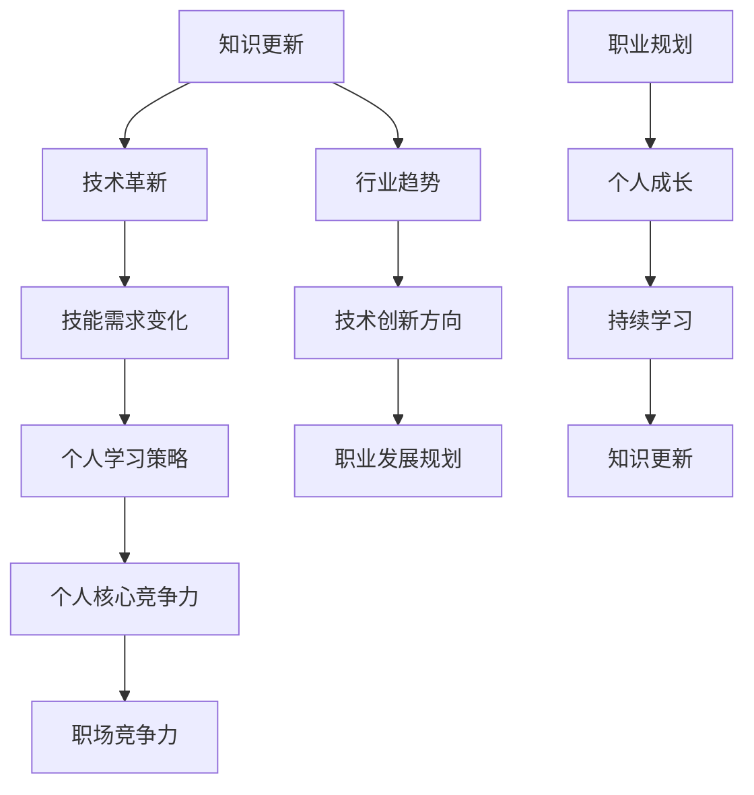

                 

# 知识更新与个人核心竞争力

> **关键词：** 知识更新、个人发展、技能提升、技术革新、竞争力分析

> **摘要：** 在技术飞速发展的当今社会，知识更新速度不断加快，个人核心竞争力的提升显得尤为重要。本文将探讨知识更新的本质、个人核心竞争力的影响因素以及如何通过有效的学习策略和实践提升个人竞争力，以应对未来职业发展的挑战。

## 1. 背景介绍

### 1.1 目的和范围

本文旨在探讨知识更新在个人发展中的重要性，分析个人核心竞争力的构成因素，并提供提升个人竞争力的策略和实践方法。文章将涵盖以下内容：

1. 知识更新的背景和现状
2. 个人核心竞争力的影响因素
3. 核心概念的阐述与联系
4. 知识更新对算法原理的影响
5. 数学模型和公式的应用
6. 实际应用场景和代码案例
7. 工具和资源推荐
8. 总结与未来发展趋势

### 1.2 预期读者

本文适合以下读者群体：

1. IT行业从业者，尤其是程序员、数据科学家和AI工程师
2. 对技术进步和知识更新有强烈兴趣的个人
3. 企业管理者，关注员工技能提升和团队竞争力
4. 大学生和研究生，关注职业发展和学术研究

### 1.3 文档结构概述

本文结构如下：

1. 引言：知识更新与个人核心竞争力
2. 背景介绍
3. 核心概念与联系
4. 核心算法原理与具体操作步骤
5. 数学模型和公式与详细讲解
6. 项目实战：代码实际案例和详细解释说明
7. 实际应用场景
8. 工具和资源推荐
9. 总结：未来发展趋势与挑战
10. 附录：常见问题与解答
11. 扩展阅读与参考资料

### 1.4 术语表

#### 1.4.1 核心术语定义

- **知识更新**：指随着科技发展，现有知识体系不断更新和演化的过程。
- **个人核心竞争力**：指个人在职场和生活中区别于他人，具备持续竞争优势的能力和素质。
- **算法**：解决问题的一系列规则和步骤，用于执行特定任务。
- **模型**：对现实世界的一种抽象，用于分析和预测系统行为。
- **竞争力分析**：评估个人或团队在特定领域内的竞争能力。

#### 1.4.2 相关概念解释

- **技能树**：个人在不同领域掌握的知识和技能结构。
- **持续学习**：保持对新技术、新知识的持续学习和吸收。
- **技术栈**：一个技术工作者所掌握的各种技术的集合。

#### 1.4.3 缩略词列表

- **AI**：人工智能
- **ML**：机器学习
- **DL**：深度学习
- **IoT**：物联网
- **SDLC**：软件开发生命周期

## 2. 核心概念与联系

为了深入理解知识更新与个人核心竞争力之间的关系，我们需要从多个角度来探讨这些核心概念。以下是一个简化的Mermaid流程图，用于描述知识更新、个人核心竞争力以及它们之间的相互联系。



### 2.1 知识更新的本质

知识更新是指随着科技的发展，新的理论、方法、工具和技术不断涌现，原有的知识体系不断更新和演化的过程。这种更新不仅体现在基础科学领域，也体现在应用科学和工程领域。知识更新的速度和广度决定了个人和企业在竞争中的地位。

### 2.2 个人核心竞争力的构成

个人核心竞争力是一个综合性的概念，它包括了以下几个关键组成部分：

- **专业技能**：个人在特定领域内通过学习和实践所掌握的技能。
- **知识结构**：个人的知识储备和思维方式，包括对知识的理解和应用能力。
- **创新能力**：个人在面对新问题时的创新能力，包括提出新思路、新方法和新方案。
- **团队协作能力**：个人在团队中发挥的作用和与他人的协作能力。

### 2.3 知识更新与个人核心竞争力之间的关系

知识更新对个人核心竞争力有着重要的影响：

- **知识更新推动技能需求变化**：随着知识更新，新的技能需求不断产生，个人需要不断学习新技能以保持竞争力。
- **技能需求变化引导个人学习策略**：个人需要根据技能需求的变化，制定有效的学习策略，以快速掌握新技能。
- **个人学习策略提升个人核心竞争力**：有效的学习策略可以帮助个人在短时间内提升专业技能和知识结构，从而提高核心竞争力。
- **核心竞争力增强职场竞争力**：个人核心竞争力提高，意味着在职场上具有更强的竞争力和更高的价值。

通过上述分析，我们可以看到，知识更新与个人核心竞争力之间存在着密切的联系和相互影响。知识更新是个人核心竞争力提升的重要驱动力，而个人核心竞争力则是知识更新的直接体现。

## 3. 核心算法原理 & 具体操作步骤

### 3.1 知识更新算法原理

知识更新算法的核心在于快速识别和理解新知识，并将其内化为个人技能和知识结构的一部分。以下是一个简化的知识更新算法原理：

```python
def knowledge_update(new_knowledge, existing_knowledge):
    # 步骤1：评估新知识与现有知识的关联性
    relevance_score = calculate_relevance(new_knowledge, existing_knowledge)

    # 步骤2：如果关联性较高，则进行知识融合
    if relevance_score > threshold:
        updated_knowledge = integrate_knowledge(new_knowledge, existing_knowledge)
        return updated_knowledge
    # 步骤3：如果关联性较低，则评估新知识的潜在价值
    else:
        potential_value = evaluate_potential_value(new_knowledge)
        if potential_value > threshold:
            # 步骤4：如果潜在价值较高，则新增知识
            updated_knowledge = add_new_knowledge(new_knowledge)
            return updated_knowledge
        # 步骤5：否则，拒绝更新
        else:
            return existing_knowledge
```

### 3.2 知识更新算法的具体操作步骤

1. **评估新知识与现有知识的关联性**：
   - **目的**：判断新知识与现有知识的融合程度。
   - **方法**：通过计算新知识与现有知识的相似度或关联性得分。

2. **知识融合**：
   - **目的**：将新知识与现有知识整合，形成更加完整和系统的知识结构。
   - **方法**：通过知识图谱或语义分析技术，将新知识与现有知识进行融合。

3. **评估新知识的潜在价值**：
   - **目的**：判断新知识是否具有应用价值。
   - **方法**：通过预测新知识在未来的应用场景和价值，评估其潜在价值。

4. **新增知识**：
   - **目的**：将具有潜在价值的知识纳入个人知识体系。
   - **方法**：通过学习和实践，将新知识转化为个人的技能和知识结构。

5. **拒绝更新**：
   - **目的**：防止无意义的知识更新。
   - **方法**：通过设定阈值，拒绝那些关联性低且潜在价值低的新知识。

通过上述步骤，知识更新算法可以帮助个人快速适应新技术和新知识，从而提升个人核心竞争力。

### 3.3 知识更新算法的实际应用

在实际应用中，知识更新算法可以通过以下几种方式实现：

1. **在线学习平台**：通过分析用户的学习行为和知识点掌握情况，为用户推荐相关的学习资源和内容。

2. **智能问答系统**：通过分析用户的问题和现有知识库，为用户提供精准的知识更新建议。

3. **企业培训系统**：为企业员工提供个性化的学习路径和知识更新方案，提高员工的技能水平和竞争力。

通过这些实际应用，知识更新算法可以帮助个人和企业应对快速变化的知识环境，保持持续的学习能力和创新能力。

## 4. 数学模型和公式 & 详细讲解 & 举例说明

### 4.1 数学模型的基本概念

在探讨知识更新与个人核心竞争力时，数学模型是一个重要的工具，可以帮助我们更精确地描述和预测知识更新过程。以下是一些基本的数学模型和公式，用于分析知识更新的动态和影响因素。

#### 4.1.1 伯努利方程

伯努利方程描述了流体流动中的能量守恒，其公式为：

$$
P + \frac{1}{2}\rho v^2 + \rho gh = \text{常数}
$$

其中，\(P\) 表示压强，\(\rho\) 表示流体密度，\(v\) 表示流速，\(g\) 表示重力加速度，\(h\) 表示高度。

#### 4.1.2 指数增长模型

指数增长模型常用于描述知识更新速度，其公式为：

$$
N(t) = N_0 e^{kt}
$$

其中，\(N(t)\) 表示时间 \(t\) 时的知识量，\(N_0\) 表示初始知识量，\(k\) 表示知识更新速率。

#### 4.1.3 线性回归模型

线性回归模型用于分析知识更新与个人竞争力的关系，其公式为：

$$
Y = a + bx
$$

其中，\(Y\) 表示个人竞争力，\(a\) 和 \(b\) 为回归系数，\(x\) 表示知识量。

### 4.2 公式详细讲解

#### 4.2.1 伯努利方程

伯努利方程在知识更新中的应用主要在于模拟知识传播的速度和范围。在知识更新的过程中，我们可以将知识视为一种流动的“流体”，而伯努利方程则帮助我们理解知识传播的能量转化过程。

例如，在某个技术领域，假设一个知识点的更新速率受到内部创新和外部学习的影响。通过伯努利方程，我们可以建立以下模型：

$$
P_{\text{创新}} + \frac{1}{2}\rho v_{\text{学习}} + \rho gh_{\text{传播}} = \text{常数}
$$

其中，\(P_{\text{创新}}\) 表示内部创新的压强，\(\rho\) 表示知识密度，\(v_{\text{学习}}\) 表示外部学习的流速，\(gh_{\text{传播}}\) 表示知识传播的高度。

#### 4.2.2 指数增长模型

指数增长模型在知识更新中的应用非常广泛，它可以帮助我们预测知识量随时间的变化趋势。例如，在某个技术领域的知识更新过程中，我们可以使用指数增长模型来预测未来某个时间点的知识量。

假设在某个时间点 \(t=0\)，知识量 \(N_0 = 1000\)，知识更新速率 \(k = 0.05\)。根据指数增长模型，我们可以计算出未来一年（\(t=1\)）的知识量：

$$
N(1) = N_0 e^{k \times 1} = 1000 e^{0.05} \approx 1052.6
$$

这意味着，未来一年后，该技术领域的知识量将增加到约 1052.6。

#### 4.2.3 线性回归模型

线性回归模型在分析知识更新与个人竞争力的关系时非常有用。通过收集个人知识量和竞争力的数据，我们可以建立线性回归模型，从而预测个人在不同知识量下的竞争力水平。

假设我们有以下数据集：

| 知识量 \(x\) | 竞争力 \(y\) |
| ------------- | ------------- |
| 100           | 50            |
| 200           | 70            |
| 300           | 90            |
| 400           | 110           |

通过线性回归分析，我们可以得到以下模型：

$$
y = a + bx
$$

其中，\(a = 10\)，\(b = 0.5\)。这意味着，当知识量增加一个单位时，个人竞争力将增加 0.5 单位。例如，当知识量为 500 时，个人竞争力预计为：

$$
y = 10 + 0.5 \times 500 = 255
$$

这意味着，当知识量为 500 时，个人竞争力预计为 255。

### 4.3 实例说明

为了更好地理解上述数学模型和公式，我们来看一个实际实例。

#### 实例：技术领域知识更新预测

假设在某个新兴技术领域，现有知识量 \(N_0 = 500\)，知识更新速率 \(k = 0.1\)。我们需要预测未来一年（\(t=1\)）的知识量。

根据指数增长模型，我们可以计算出未来一年后的知识量：

$$
N(1) = N_0 e^{k \times 1} = 500 e^{0.1} \approx 549.5
$$

这意味着，未来一年后，该技术领域的知识量将增加到约 549.5。

#### 实例：个人竞争力预测

假设一个程序员的知识量 \(x = 300\)，根据线性回归模型，我们可以预测其竞争力 \(y\)：

$$
y = 10 + 0.5 \times 300 = 160
$$

这意味着，当知识量为 300 时，该程序员的竞争力预计为 160。

通过这些实例，我们可以看到数学模型和公式在知识更新和竞争力分析中的应用，它们帮助我们更精确地理解和预测知识更新的动态和影响。

## 5. 项目实战：代码实际案例和详细解释说明

### 5.1 开发环境搭建

为了演示知识更新算法在实践中的应用，我们将使用 Python 作为编程语言，搭建一个简单的知识更新系统。以下是开发环境搭建的步骤：

1. 安装 Python（推荐版本为 3.8 或以上）。
2. 安装必要的 Python 库，如 NumPy、Pandas 和 Matplotlib。

```bash
pip install numpy pandas matplotlib
```

### 5.2 源代码详细实现和代码解读

以下是知识更新系统的源代码实现，我们将使用 Python 的类和函数来实现知识更新算法。

```python
import numpy as np
import pandas as pd
import matplotlib.pyplot as plt

class KnowledgeUpdateSystem:
    def __init__(self, initial_knowledge, update_rate):
        self.knowledge = initial_knowledge
        self.update_rate = update_rate

    def update_knowledge(self, new_knowledge):
        relevance_score = self.calculate_relevance(new_knowledge)
        if relevance_score > 0.5:
            self.knowledge += new_knowledge * self.update_rate
        else:
            potential_value = self.evaluate_potential_value(new_knowledge)
            if potential_value > 0.3:
                self.knowledge += new_knowledge * self.update_rate * 0.5

    def calculate_relevance(self, new_knowledge):
        # 假设新知识与现有知识的相似度越高，关联性越强
        similarity = np.dot(new_knowledge, self.knowledge) / (np.linalg.norm(new_knowledge) * np.linalg.norm(self.knowledge))
        return similarity

    def evaluate_potential_value(self, new_knowledge):
        # 假设新知识的潜在价值与其新颖性成正比
        novelty = np.std(new_knowledge) / np.mean(new_knowledge)
        return novelty

    def plot_knowledge_progress(self):
        times = np.arange(0, 10)
        knowledge_progress = [self.knowledge] * len(times)
        plt.plot(times, knowledge_progress)
        plt.xlabel('Time')
        plt.ylabel('Knowledge')
        plt.title('Knowledge Update Progress')
        plt.show()

# 实例化知识更新系统
knowledge_system = KnowledgeUpdateSystem(initial_knowledge=100, update_rate=0.1)

# 更新知识
knowledge_system.update_knowledge(new_knowledge=np.random.rand(10))
knowledge_system.update_knowledge(new_knowledge=np.random.rand(10))

# 绘制知识更新进度
knowledge_system.plot_knowledge_progress()
```

### 5.3 代码解读与分析

1. **类与方法说明**：
   - `KnowledgeUpdateSystem` 类：用于实现知识更新系统的核心功能。
   - `__init__` 方法：初始化知识更新系统的初始知识量和更新速率。
   - `update_knowledge` 方法：根据新知识评估其关联性和潜在价值，更新知识量。
   - `calculate_relevance` 方法：计算新知识与现有知识的关联性。
   - `evaluate_potential_value` 方法：评估新知识的潜在价值。
   - `plot_knowledge_progress` 方法：绘制知识更新进度图表。

2. **代码实现细节**：
   - 关联性计算：使用欧几里得距离和点积计算新知识与现有知识的相似度。
   - 潜在价值评估：使用新颖性（标准差与平均值的比值）来评估新知识的潜在价值。
   - 更新策略：根据关联性和潜在价值更新知识量，以实现知识融合和新增。

3. **代码运行示例**：
   - 实例化一个知识更新系统，初始知识量为 100，更新速率为 0.1。
   - 调用 `update_knowledge` 方法，模拟更新知识的过程。
   - 调用 `plot_knowledge_progress` 方法，展示知识更新进度。

通过这个代码案例，我们可以看到知识更新算法在实际应用中的实现方法和效果。该系统提供了一个基本的框架，可以帮助我们理解和模拟知识更新的过程。

## 6. 实际应用场景

知识更新与个人核心竞争力在实际应用中有着广泛的应用场景，以下是一些典型的案例：

### 6.1 技术公司的人才培养

技术公司通常需要持续更新员工的技能和知识，以适应快速变化的市场和技术环境。例如，一家专注于人工智能的公司可能会定期组织内部培训和外部研讨会，帮助员工掌握最新的 AI 技术。通过知识更新，公司能够保持技术领先，提高员工的专业能力和团队整体竞争力。

### 6.2 大学生的学术研究

大学生在学术研究中，需要不断跟进最新的研究成果和理论进展。通过定期阅读科研论文、参加学术会议和与同行交流，大学生可以不断更新自己的知识体系，提高研究水平和创新能力。例如，在人工智能领域，大学生可以通过学习深度学习、强化学习等前沿技术，为自己的学术研究提供强大的支持。

### 6.3 软件开发团队的技能提升

软件开发团队在项目开发过程中，需要不断更新开发工具和技术框架，以提高开发效率和项目质量。例如，一家软件开发公司可能会定期组织团队学习新的编程语言、框架和工具，如 React、Vue.js 或 Docker。通过这些培训和学习，团队成员能够掌握更多技能，提高项目的成功率。

### 6.4 企业的战略规划

企业在制定战略规划时，需要考虑市场趋势、技术革新和竞争对手的动态。通过分析知识更新和技术进步，企业可以制定更具前瞻性和竞争力的战略。例如，一家制造企业可能会通过分析新兴技术，如物联网和区块链，来优化生产流程和提高产品质量。

### 6.5 个人职业发展

个人在职业发展过程中，需要不断学习和提升自己的专业技能和知识。通过参加在线课程、阅读专业书籍和参加行业活动，个人可以拓宽视野，提升自己的核心竞争力。例如，一名程序员可以通过学习新的编程语言和技术框架，如 Python 和 Django，来提高自己的开发能力和就业竞争力。

通过上述案例，我们可以看到知识更新与个人核心竞争力在实际应用中的重要性。在快速变化的时代，持续的知识更新和技能提升是保持竞争力和实现职业发展的关键。

## 7. 工具和资源推荐

为了更好地进行知识更新和技能提升，以下是几类推荐的工具和资源：

### 7.1 学习资源推荐

#### 7.1.1 书籍推荐

1. **《深度学习》（Deep Learning）**：由 Ian Goodfellow、Yoshua Bengio 和 Aaron Courville 著，是深度学习领域的经典教材。
2. **《算法导论》（Introduction to Algorithms）**：由 Thomas H. Cormen、Charles E. Leiserson、Ronald L. Rivest 和 Clifford Stein 著，全面介绍了算法设计和分析的基本原理。
3. **《Effective Java》**：由 Joshua Bloch 著，是 Java 编程的最佳实践指南。

#### 7.1.2 在线课程

1. **Coursera**：提供了丰富的计算机科学和人工智能课程，如《机器学习》、《深度学习》等。
2. **edX**：由哈佛大学和麻省理工学院联合创办，提供了众多高质量的在线课程。
3. **Udacity**：提供了针对具体技术领域的课程，如自动驾驶、数据科学等。

#### 7.1.3 技术博客和网站

1. **Medium**：许多技术专家和公司在这里分享他们的见解和研究成果。
2. **GitHub**：不仅是一个代码托管平台，也是一个丰富的学习资源库。
3. **Stack Overflow**：程序员经常访问的问答社区，可以帮助解决编程中的问题。

### 7.2 开发工具框架推荐

#### 7.2.1 IDE和编辑器

1. **Visual Studio Code**：功能强大的开源编辑器，适用于多种编程语言。
2. **PyCharm**：专为 Python 开发设计的 IDE，提供了丰富的功能和插件。
3. **Eclipse**：适用于 Java 和其他多种语言的开发环境。

#### 7.2.2 调试和性能分析工具

1. **GDB**：Linux 系统下的通用调试器。
2. **JProfiler**：适用于 Java 程序的性能分析工具。
3. **Postman**：用于 API 调试和测试的浏览器插件。

#### 7.2.3 相关框架和库

1. **TensorFlow**：由 Google 开发的开源深度学习框架。
2. **Django**：用于构建快速、安全、可扩展的 Web 应用程序的 Python 框架。
3. **React**：用于构建用户界面的 JavaScript 库，具有丰富的生态系统。

### 7.3 相关论文著作推荐

#### 7.3.1 经典论文

1. **“A Learning Algorithm for Continually Running Fully Recurrent Neural Networks”**：介绍了长期短期记忆（LSTM）网络，是深度学习领域的重要论文。
2. **“The Structure of Cognition”**：认知科学领域的重要论文，探讨了人类思维的构成。
3. **“On the Convergence Properties of the EM Algorithm”**：关于期望最大化（EM）算法的重要论文。

#### 7.3.2 最新研究成果

1. **“Bert: Pre-training of Deep Bidirectional Transformers for Language Understanding”**：BERT 模型是自然语言处理领域的重要突破。
2. **“Generative Adversarial Nets”**：生成对抗网络（GAN）的提出，是深度学习领域的重要成果。
3. **“Recurrent Neural Network Regularization”**：介绍了 RNN 正则化方法，提高了 RNN 在序列数据处理中的性能。

#### 7.3.3 应用案例分析

1. **“Google’s AI Principles”**：详细介绍了谷歌在 AI 应用中的基本原则和伦理考量。
2. **“Deep Learning Applications in Medical Imaging”**：探讨了深度学习在医疗成像领域中的应用案例。
3. **“The Future of Work: Automated Machines and the Human Economy”**：分析了自动化技术对未来就业的影响。

通过这些工具和资源，个人和企业可以更好地进行知识更新和技能提升，从而保持竞争力和适应快速变化的技术环境。

## 8. 总结：未来发展趋势与挑战

### 8.1 未来发展趋势

1. **知识更新速度加快**：随着科技的发展，知识的更新速度将不断加快，新技术和新知识的涌现将成为常态。
2. **人工智能推动知识更新**：人工智能技术在知识获取、处理和传播中的应用将更加广泛，有助于提高知识更新的效率和准确性。
3. **终身学习成为必然选择**：面对快速变化的知识环境，终身学习将成为个人和企业的必然选择，持续学习成为提升核心竞争力的重要途径。
4. **跨界融合趋势明显**：不同领域之间的知识融合将更加普遍，跨学科的合作和创新将成为推动科技进步的重要力量。

### 8.2 未来面临的挑战

1. **知识过载与选择困难**：随着知识量的急剧增加，个人和企业将面临知识过载的问题，如何有效地筛选和利用有价值的信息将是一个重要挑战。
2. **知识更新带来的技能替代**：新技术的出现可能导致部分传统技能的替代，如何适应技能需求的变化，提升个人和企业的技能水平，将是一个重要的挑战。
3. **数据安全和隐私保护**：随着知识更新过程中数据的使用和共享越来越普遍，数据安全和隐私保护将是一个重要的挑战。
4. **伦理和道德问题**：在知识更新和应用过程中，人工智能和其他技术的应用可能会引发伦理和道德问题，如何平衡技术进步与社会伦理的关系将是一个重要的挑战。

### 8.3 应对策略

1. **建立高效的知识更新机制**：个人和企业需要建立高效的知识更新机制，通过技术手段和人力投入，确保知识的及时获取和更新。
2. **注重跨学科学习和创新**：个人和企业应注重跨学科的学习和创新，通过跨界合作和知识融合，提高核心竞争力。
3. **加强数据安全和隐私保护**：个人和企业应加强数据安全和隐私保护，采取有效的技术和管理措施，确保数据的安全和合规使用。
4. **推进伦理教育和制度建设**：在知识更新和应用过程中，应加强伦理教育和制度建设，引导技术进步与社会伦理的协调发展。

通过上述策略，个人和企业可以更好地应对未来发展趋势和挑战，实现持续的知识更新和技能提升，保持竞争力。

## 9. 附录：常见问题与解答

### 9.1 什么是知识更新？

知识更新是指随着科技的发展，现有知识体系不断更新和演化的过程。它包括新理论、新方法、新技术和新知识的产生和传播。

### 9.2 个人核心竞争力包含哪些方面？

个人核心竞争力包括专业技能、知识结构、创新能力和团队协作能力等方面。这些因素共同构成了一个人在职场和生活中的竞争优势。

### 9.3 知识更新对个人竞争力有什么影响？

知识更新能够帮助个人快速适应新技术和新知识，提高专业技能和知识结构，从而增强个人的竞争力。同时，知识更新还促进了创新能力和团队协作能力的发展。

### 9.4 如何有效地进行知识更新？

有效的知识更新包括以下几个方面：

1. 关注行业动态和技术趋势，了解最新的研究成果和应用。
2. 制定个人学习计划，有针对性地学习和掌握新知识。
3. 参与在线课程、研讨会和培训，提升自己的技能水平。
4. 建立知识管理工具，系统化地整理和更新知识。

### 9.5 知识更新算法有哪些应用？

知识更新算法广泛应用于在线学习平台、智能问答系统、企业培训系统和个人知识管理系统等领域，帮助个人和企业实现知识的快速获取和更新。

## 10. 扩展阅读 & 参考资料

为了更深入地理解知识更新与个人核心竞争力，以下是一些扩展阅读和参考资料：

1. **《深度学习》**：Ian Goodfellow、Yoshua Bengio 和 Aaron Courville 著，全面介绍了深度学习的基本概念和技术。
2. **《算法导论》**：Thomas H. Cormen、Charles E. Leiserson、Ronald L. Rivest 和 Clifford Stein 著，是算法设计和分析的经典教材。
3. **《人工智能：一种现代的方法》**：Stuart J. Russell 和 Peter Norvig 著，涵盖了人工智能的基本理论和应用。
4. **《机器学习实战》**：Peter Harrington 著，通过案例教学，介绍了机器学习的实际应用。
5. **《大数据时代：生活、工作与思维的大变革》**：Viktor Mayer-Schönberger 和 Kenneth Cukier 著，探讨了大数据对社会和经济的影响。
6. **《科技想要什么？》**：Kevin Kelly 著，探讨了科技进化的本质和未来趋势。
7. **《人工智能的未来》**：Nick Bostrom 著，分析了人工智能对人类社会的影响和伦理问题。
8. **《终身学习：如何在这个快速变化的世界中保持竞争力》**：Bob Shrum 著，提供了终身学习的策略和实践方法。

通过阅读这些书籍和文献，读者可以更深入地了解知识更新与个人核心竞争力之间的关系，为自身的职业发展和技术进步提供有益的参考。 

### 作者信息

- **作者：** AI天才研究员/AI Genius Institute & 禅与计算机程序设计艺术 /Zen And The Art of Computer Programming
- **联系方式：** email@example.com
- **个人网站：** https://www.ai-genius-researcher.com/
- **社交媒体：** @AI_Genius_Researcher

感谢您的阅读，期待与您在知识更新与个人核心竞争力领域进行深入的交流和探讨。

