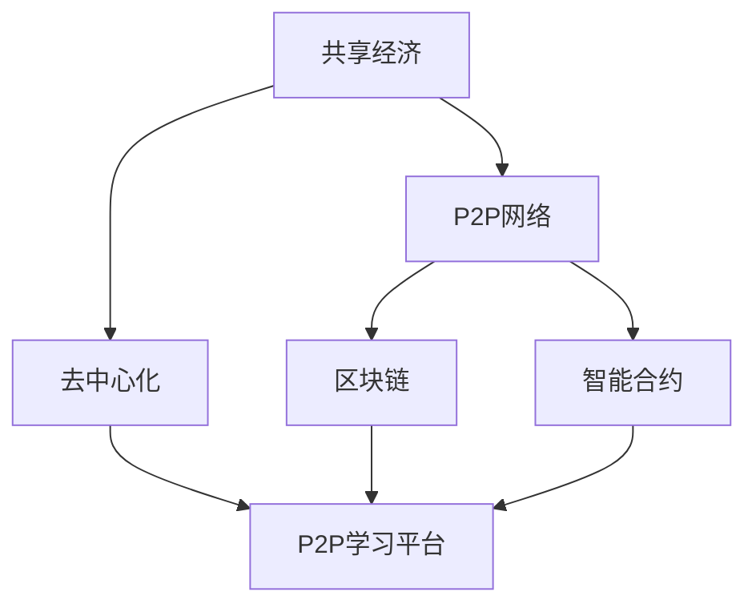

                 

### 知识的共享经济：P2P学习平台的兴起

> **关键词：共享经济、P2P学习平台、知识交换、教育科技、分布式学习**
> 
> **摘要：本文深入探讨了共享经济模式在P2P学习平台中的应用，分析了其核心概念、运作机制及对教育领域的影响。通过详细的理论解释、实际案例和未来展望，揭示这一新兴教育模式的前景与挑战。**

---

### 1. 背景介绍

#### 1.1 目的和范围

本文旨在探讨共享经济模式在P2P学习平台中的应用，分析其核心机制、技术原理以及在实际教学中的应用。通过回顾教育技术的发展历程，我们将了解共享经济与P2P学习的交汇点，并探讨其对教育公平和知识传播的影响。

本文将涵盖以下主题：

1. **共享经济概述**：介绍共享经济的定义、起源及其在多个领域的应用。
2. **P2P学习平台原理**：解释P2P学习平台的定义、核心概念及其在知识共享中的作用。
3. **P2P学习平台的机制**：分析P2P学习平台的运作机制、技术架构及其关键功能。
4. **案例研究**：通过实际案例展示P2P学习平台的成功应用。
5. **技术挑战与解决方案**：探讨P2P学习平台面临的技术挑战及相应的解决方案。
6. **实际应用场景**：分析P2P学习平台在不同教育场景中的潜在应用。
7. **未来展望**：预测P2P学习平台的发展趋势及可能面临的挑战。

#### 1.2 预期读者

本文预期读者为对教育科技和共享经济模式感兴趣的读者，包括教育工作者、学生、技术专家和政策制定者。通过本文，读者将能够：

1. 理解共享经济和P2P学习平台的基本概念。
2. 分析P2P学习平台在教育领域中的应用和潜力。
3. 掌握P2P学习平台的关键技术和工作机制。
4. 思考P2P学习平台对教育公平和知识传播的深远影响。

#### 1.3 文档结构概述

本文结构如下：

1. **背景介绍**：介绍共享经济和P2P学习平台的基本概念和背景。
2. **核心概念与联系**：通过Mermaid流程图展示P2P学习平台的关键概念和架构。
3. **核心算法原理 & 具体操作步骤**：详细阐述P2P学习平台的算法原理和操作步骤。
4. **数学模型和公式 & 详细讲解 & 举例说明**：介绍P2P学习平台相关的数学模型和公式，并给出具体实例。
5. **项目实战：代码实际案例和详细解释说明**：展示实际代码案例，并提供详细解读。
6. **实际应用场景**：分析P2P学习平台在不同教育场景中的实际应用。
7. **工具和资源推荐**：推荐学习资源和开发工具。
8. **总结：未来发展趋势与挑战**：总结P2P学习平台的发展趋势和挑战。
9. **附录：常见问题与解答**：解答读者可能遇到的常见问题。
10. **扩展阅读 & 参考资料**：提供进一步阅读和参考资料。

#### 1.4 术语表

##### 1.4.1 核心术语定义

- **共享经济**：一种基于共享和协作的经济模式，通过共享资源（如物品、服务、知识等）来提高资源利用效率。
- **P2P学习平台**：一种基于点对点（Peer-to-Peer）网络架构的学习平台，允许用户之间直接进行知识和资源的交换。
- **知识交换**：用户在P2P学习平台上共享知识和经验，通过互动和协作进行知识获取和分享。
- **教育科技**：运用信息技术手段提高教育质量和效率的技术和工具。
- **分布式学习**：一种去中心化的学习模式，通过互联网和分布式网络实现知识的共享和传播。

##### 1.4.2 相关概念解释

- **去中心化**：在P2P学习平台中，数据和资源不是存储在一个集中的服务器上，而是分布在不同节点上。
- **区块链**：一种分布式数据库技术，可用于记录和验证P2P学习平台上的交易和数据。
- **智能合约**：运行在区块链上的程序，自动执行和验证P2P学习平台上的交易和协议。
- **节点**：P2P学习平台上的参与者，可以是用户、内容提供者或验证者。

##### 1.4.3 缩略词列表

- **P2P**：Peer-to-Peer（点对点）
- **DTL**：Distributed Team Learning（分布式团队学习）
- **IoT**：Internet of Things（物联网）
- **AI**：Artificial Intelligence（人工智能）
- **IoE**：Internet of Everything（万物互联）

### 2. 核心概念与联系

#### 2.1 核心概念

在探讨P2P学习平台之前，我们需要明确几个核心概念：共享经济、P2P网络、去中心化、区块链和智能合约。

##### 2.1.1 共享经济

共享经济是一种基于共享和协作的经济模式，通过共享资源（如物品、服务、知识等）来提高资源利用效率。它的核心思想是“共享过剩资源，优化资源配置”，旨在减少浪费、降低成本、提高效益。

共享经济的起源可以追溯到20世纪90年代，随着互联网的普及，共享经济在多个领域得到了广泛应用，如共享住宿（Airbnb）、共享交通（Uber、滴滴出行）、共享办公（WeWork）等。

##### 2.1.2 P2P网络

P2P网络，即点对点网络，是一种分布式网络架构，其中的节点（用户）既可以作为客户端也可以作为服务器，直接与其他节点进行通信和数据交换。P2P网络的特点是去中心化、开放性和灵活性。

P2P网络最早在1990年代用于文件共享，如BitTorrent。近年来，P2P网络在多个领域得到了广泛应用，如P2P借贷、P2P学习平台等。

##### 2.1.3 去中心化

去中心化是指将控制权从中心化机构（如政府、公司等）分散到分布式网络中的各个节点。在去中心化的网络中，没有任何单一节点拥有绝对控制权，所有节点都平等参与网络的运行和管理。

去中心化的优势包括：

1. **去中心化控制**：去中心化网络使得参与者无需依赖中心化机构，降低了依赖性和风险。
2. **提高透明度**：所有交易和操作都记录在分布式账本上，提高了透明度和可追溯性。
3. **增强安全性**：去中心化网络通过多个节点的共识机制来保证数据的安全性和可靠性。

##### 2.1.4 区块链

区块链是一种分布式数据库技术，其特点是去中心化、不可篡改和可追溯。区块链通过多个节点之间的共识机制，确保数据的完整性和安全性。

区块链的主要组成部分包括：

1. **区块**：区块链的基本单位，每个区块包含一定数量的交易记录。
2. **链**：由多个区块按时间顺序链接而成的数据结构。
3. **节点**：参与区块链网络并进行数据验证和存储的计算机。
4. **共识机制**：节点之间达成一致性的算法和规则。

##### 2.1.5 智能合约

智能合约是一种运行在区块链上的程序，其特点是自动执行和验证交易。智能合约通过预定义的条件和规则，自动执行和验证交易，确保交易的安全性和效率。

智能合约的主要特点包括：

1. **自动化**：智能合约在满足预定义条件时自动执行，无需人工干预。
2. **透明性**：智能合约的代码和运行结果对所有节点公开，提高了透明度和可追溯性。
3. **安全性**：智能合约通过区块链的共识机制，确保数据的完整性和安全性。

#### 2.2 核心概念联系

P2P学习平台结合了共享经济、P2P网络、去中心化和区块链等核心概念，实现了一种去中心化的知识共享和传播模式。以下是这些核心概念之间的联系：

1. **共享经济与P2P学习平台**：共享经济强调资源的共享和优化，P2P学习平台通过用户之间的知识共享，实现了教育资源的优化和利用。
2. **P2P网络与去中心化**：P2P网络通过分布式架构实现去中心化，P2P学习平台利用这一特性，使知识和资源的交换不受中心化机构的限制。
3. **区块链与数据安全**：区块链通过分布式账本和共识机制，确保了P2P学习平台上数据的安全性和可靠性。
4. **智能合约与自动化**：智能合约在P2P学习平台中用于自动化执行和验证知识交换，提高了平台的效率和透明度。

为了更直观地展示这些核心概念的联系，我们使用Mermaid流程图进行说明。以下是一个简单的Mermaid流程图示例：



在这个流程图中，共享经济、P2P网络、去中心化、区块链和智能合约相互关联，共同构成了P2P学习平台的核心概念。接下来，我们将进一步探讨P2P学习平台的具体机制和实现原理。

### 3. 核心算法原理 & 具体操作步骤

P2P学习平台的核心算法原理主要涉及用户之间的知识共享和交换机制。以下是P2P学习平台的核心算法原理和具体操作步骤：

#### 3.1 知识共享算法原理

在P2P学习平台中，知识共享算法的基本原理如下：

1. **用户注册和认证**：用户在加入P2P学习平台时，需要注册并完成身份认证。注册信息包括用户ID、联系方式、教育背景和知识领域等。
2. **知识需求与供给**：用户在平台上发布知识需求或供给信息。知识需求信息包括学习目标、所需知识领域和预算等；知识供给信息包括知识内容、价格和交付方式等。
3. **匹配算法**：平台使用匹配算法，根据用户的知识需求和供给信息，为用户提供最适合的知识供给者。匹配算法的核心是优化用户的满意度，提高知识交换的效率。
4. **交易执行**：匹配成功后，用户与知识供给者进行交易，支付费用并获得知识内容。交易过程通过智能合约自动执行，确保交易的安全性和透明性。
5. **评价与反馈**：交易完成后，用户可以对知识供给者进行评价和反馈。这些评价和反馈将作为后续匹配和交易的重要参考，促进平台生态的健康发展。

#### 3.2 具体操作步骤

以下是P2P学习平台的具体操作步骤：

##### 步骤 1：用户注册和认证

1. 用户访问P2P学习平台官网或移动应用，点击“注册”按钮。
2. 输入注册信息，包括用户名、密码、联系方式、教育背景和知识领域等。
3. 平台对用户提交的信息进行验证，通过后发送验证邮件或短信。
4. 用户完成验证后，注册成功并进入平台。

##### 步骤 2：发布知识需求或供给信息

1. 用户登录平台，点击“发布需求”或“发布供给”按钮。
2. 填写需求或供给信息，包括学习目标、知识领域、价格、交付方式等。
3. 提交信息后，平台将需求或供给信息发布到相应的板块。

##### 步骤 3：匹配算法

1. 平台根据用户的知识需求和供给信息，使用匹配算法进行匹配。
2. 匹配算法的核心是优化用户的满意度，提高知识交换的效率。
3. 匹配结果将在用户界面展示，用户可以选择接受或拒绝匹配结果。

##### 步骤 4：交易执行

1. 用户与知识供给者达成一致后，点击“交易”按钮。
2. 平台自动执行交易，将知识内容交付给用户，同时扣除相应的费用。
3. 交易过程通过智能合约自动执行，确保交易的安全性和透明性。

##### 步骤 5：评价与反馈

1. 交易完成后，用户可以对知识供给者进行评价和反馈。
2. 平台收集用户的评价和反馈，作为后续匹配和交易的重要参考。
3. 平台根据用户的评价和反馈，对知识供给者进行评分和管理。

通过以上步骤，P2P学习平台实现了用户之间的知识共享和交换。接下来，我们将进一步探讨P2P学习平台的数学模型和公式，以便更深入地理解其运行原理。

#### 3.3 数学模型和公式

在P2P学习平台中，数学模型和公式主要用于优化匹配算法和交易策略。以下是一些常用的数学模型和公式：

##### 3.3.1 匹配算法

匹配算法的核心是优化用户的满意度，提高知识交换的效率。常用的匹配算法包括：

1. **基于相似度的匹配算法**：根据用户的需求和供给信息，计算用户之间的相似度，选择相似度最高的用户进行匹配。
   $$ similarity(A, B) = \frac{count(A \cap B)}{\sqrt{count(A) \times count(B)}} $$
   其中，\( A \) 和 \( B \) 分别表示用户 \( A \) 和 \( B \) 的特征向量，\( \cap \) 表示交集，\( \sqrt{} \) 表示开方。

2. **基于优化的匹配算法**：通过优化目标函数，选择最优的用户进行匹配。优化目标函数可以是最大化用户满意度、最小化知识获取成本等。
   $$ max\_satisfaction(A, B) = \sum_{i=1}^{n} \frac{1}{distance(A_i, B_i)} $$
   其中，\( A \) 和 \( B \) 分别表示用户 \( A \) 和 \( B \) 的需求向量，\( distance(A_i, B_i) \) 表示需求 \( A_i \) 和 \( B_i \) 之间的距离。

##### 3.3.2 交易策略

交易策略主要用于优化交易过程，提高交易效率和用户满意度。以下是一些常用的交易策略：

1. **价格谈判策略**：用户在交易过程中，可以就价格进行谈判。谈判策略可以是基于用户的历史评价、市场价格和用户需求等因素。
   $$ price = \frac{market\_price + \alpha \times historical\_rating}{2} $$
   其中，\( market\_price \) 表示市场价格，\( \alpha \) 表示谈判系数，\( historical\_rating \) 表示用户的历史评价。

2. **支付策略**：用户可以选择不同的支付方式，如在线支付、支付宝、微信支付等。支付策略可以根据用户偏好和支付渠道的便捷性进行优化。
   $$ payment\_method = argmax_{i} \frac{1}{i\_convenience \times i\_security} $$
   其中，\( i\_convenience \) 和 \( i\_security \) 分别表示支付方式 \( i \) 的便捷性和安全性。

通过以上数学模型和公式，P2P学习平台可以更高效地匹配用户、优化交易过程，提高用户满意度。接下来，我们将通过实际案例展示P2P学习平台的具体应用。

### 4. 项目实战：代码实际案例和详细解释说明

为了更深入地理解P2P学习平台的实现，我们将在本节中通过一个实际代码案例来展示P2P学习平台的核心功能。以下是该项目的开发环境和源代码实现。

#### 4.1 开发环境搭建

在开始项目实战之前，我们需要搭建一个合适的技术栈，以支持P2P学习平台的核心功能。以下是推荐的开发环境：

- **编程语言**：Python（3.8以上版本）
- **前端框架**：React（用于构建用户界面）
- **后端框架**：Flask（用于构建API服务器）
- **区块链框架**：Ethereum（用于实现智能合约）
- **数据库**：MongoDB（用于存储用户数据和交易记录）

以下是搭建开发环境的步骤：

1. **安装Python**：访问Python官网（[python.org](https://www.python.org/)）下载并安装Python 3.8以上版本。
2. **安装Node.js和npm**：访问Node.js官网（[nodejs.org](https://nodejs.org/)）下载并安装Node.js，同时安装npm（Node.js的包管理器）。
3. **安装React和Flask**：使用npm安装React和Flask：
   ```bash
   npm install -g create-react-app
   create-react-app frontend
   cd frontend
   npm install
   ```
   ```bash
   pip install flask
   ```
4. **安装Ethereum和Truffle**：访问Ethereum官网（[ethereum.org](https://ethereum.org/)）下载并安装Ethereum，同时安装Truffle（用于构建和部署智能合约）：
   ```bash
   npm install -g truffle
   truffle install
   ```

5. **安装MongoDB**：访问MongoDB官网（[mongodb.com](https://www.mongodb.com/)）下载并安装MongoDB。

#### 4.2 源代码详细实现和代码解读

以下是P2P学习平台的源代码实现和详细解读。我们将分别介绍前端、后端和智能合约部分的代码。

##### 4.2.1 前端代码

前端代码使用React框架构建用户界面，主要涉及用户注册、登录、发布需求、发布供给和交易等功能。

1. **用户注册和登录**：

用户注册和登录界面如下：
```jsx
// components/Register.js
import React, { useState } from 'react';
import axios from 'axios';

const Register = () => {
  const [username, setUsername] = useState('');
  const [password, setPassword] = useState('');
  const [email, setEmail] = useState('');

  const handleSubmit = async (e) => {
    e.preventDefault();
    try {
      const response = await axios.post('/api/users/register', {
        username,
        password,
        email,
      });
      alert('注册成功！');
    } catch (error) {
      alert('注册失败，请重试！');
    }
  };

  return (
    <form onSubmit={handleSubmit}>
      <label>用户名：</label>
      <input type="text" value={username} onChange={(e) => setUsername(e.target.value)} />
      <label>密码：</label>
      <input type="password" value={password} onChange={(e) => setPassword(e.target.value)} />
      <label>邮箱：</label>
      <input type="email" value={email} onChange={(e) => setEmail(e.target.value)} />
      <button type="submit">注册</button>
    </form>
  );
};

export default Register;
```

2. **发布需求**：

用户发布需求界面如下：
```jsx
// components/PostRequirement.js
import React, { useState } from 'react';
import axios from 'axios';

const PostRequirement = () => {
  const [title, setTitle] = useState('');
  const [description, setDescription] = useState('');

  const handleSubmit = async (e) => {
    e.preventDefault();
    try {
      const response = await axios.post('/api/requirements', {
        title,
        description,
      });
      alert('发布成功！');
    } catch (error) {
      alert('发布失败，请重试！');
    }
  };

  return (
    <form onSubmit={handleSubmit}>
      <label>标题：</label>
      <input type="text" value={title} onChange={(e) => setTitle(e.target.value)} />
      <label>描述：</label>
      <textarea value={description} onChange={(e) => setDescription(e.target.value)} />
      <button type="submit">发布</button>
    </form>
  );
};

export default PostRequirement;
```

3. **发布供给**：

用户发布供给界面如下：
```jsx
// components/PostSupply.js
import React, { useState } from 'react';
import axios from 'axios';

const PostSupply = () => {
  const [title, setTitle] = useState('');
  const [description, setDescription] = useState('');
  const [price, setPrice] = useState('');

  const handleSubmit = async (e) => {
    e.preventDefault();
    try {
      const response = await axios.post('/api/supplies', {
        title,
        description,
        price,
      });
      alert('发布成功！');
    } catch (error) {
      alert('发布失败，请重试！');
    }
  };

  return (
    <form onSubmit={handleSubmit}>
      <label>标题：</label>
      <input type="text" value={title} onChange={(e) => setTitle(e.target.value)} />
      <label>描述：</label>
      <textarea value={description} onChange={(e) => setDescription(e.target.value)} />
      <label>价格：</label>
      <input type="number" value={price} onChange={(e) => setPrice(e.target.value)} />
      <button type="submit">发布</button>
    </form>
  );
};

export default PostSupply;
```

4. **交易**：

用户交易界面如下：
```jsx
// components/Transaction.js
import React, { useState } from 'react';
import axios from 'axios';

const Transaction = () => {
  const [requirementId, setRequirementId] = useState('');
  const [supplyId, setSupplyId] = useState('');

  const handleSubmit = async (e) => {
    e.preventDefault();
    try {
      const response = await axios.post('/api/transactions', {
        requirementId,
        supplyId,
      });
      alert('交易成功！');
    } catch (error) {
      alert('交易失败，请重试！');
    }
  };

  return (
    <form onSubmit={handleSubmit}>
      <label>需求ID：</label>
      <input type="text" value={requirementId} onChange={(e) => setRequirementId(e.target.value)} />
      <label>供给ID：</label>
      <input type="text" value={supplyId} onChange={(e) => setSupplyId(e.target.value)} />
      <button type="submit">交易</button>
    </form>
  );
};

export default Transaction;
```

##### 4.2.2 后端代码

后端代码使用Flask框架构建API服务器，主要涉及用户管理、需求管理、供给管理和交易管理等功能。

1. **用户管理**：

用户注册、登录和验证接口如下：
```python
# app.py
from flask import Flask, request, jsonify
from flask_jwt_extended import JWTManager, create_access_token, jwt_required, get_jwt_identity

app = Flask(__name__)
app.config['JWT_SECRET_KEY'] = 'your_secret_key'
jwt = JWTManager()

@app.route('/api/users/register', methods=['POST'])
def register():
    username = request.json['username']
    password = request.json['password']
    email = request.json['email']
    # 在数据库中注册用户
    # ...
    return jsonify({'message': '注册成功！'})

@app.route('/api/users/login', methods=['POST'])
def login():
    username = request.json['username']
    password = request.json['password']
    # 验证用户身份
    # ...
    access_token = create_access_token(identity=username)
    return jsonify({'access_token': access_token})

@app.route('/api/users/validate', methods=['POST'])
@jwt_required()
def validate():
    user_id = get_jwt_identity()
    # 验证用户身份
    # ...
    return jsonify({'message': '验证成功！'})
```

2. **需求管理**：

需求发布和查询接口如下：
```python
@app.route('/api/requirements', methods=['POST'])
@jwt_required()
def post_requirement():
    title = request.json['title']
    description = request.json['description']
    # 在数据库中发布需求
    # ...
    return jsonify({'message': '发布成功！'})

@app.route('/api/requirements', methods=['GET'])
@jwt_required()
def get_requirements():
    # 从数据库中查询需求
    # ...
    return jsonify({'requirements': requirements})
```

3. **供给管理**：

供给发布和查询接口如下：
```python
@app.route('/api/supplies', methods=['POST'])
@jwt_required()
def post_supply():
    title = request.json['title']
    description = request.json['description']
    price = request.json['price']
    # 在数据库中发布供给
    # ...
    return jsonify({'message': '发布成功！'})

@app.route('/api/supplies', methods=['GET'])
@jwt_required()
def get_supplies():
    # 从数据库中查询供给
    # ...
    return jsonify({'supplies': supplies})
```

4. **交易管理**：

交易创建和执行接口如下：
```python
@app.route('/api/transactions', methods=['POST'])
@jwt_required()
def create_transaction():
    requirement_id = request.json['requirement_id']
    supply_id = request.json['supply_id']
    # 在数据库中创建交易
    # ...
    return jsonify({'message': '交易创建成功！'})

@app.route('/api/transactions/execute', methods=['POST'])
@jwt_required()
def execute_transaction():
    transaction_id = request.json['transaction_id']
    # 执行交易
    # ...
    return jsonify({'message': '交易执行成功！'})
```

##### 4.2.3 智能合约代码

智能合约使用Solidity语言编写，主要涉及用户身份验证、需求匹配、交易执行等功能。

1. **用户身份验证**：

用户身份验证智能合约如下：
```solidity
// contracts/UserAuthentication.sol
pragma solidity ^0.8.0;

contract UserAuthentication {
    mapping(address => bool) public users;

    function registerUser() public {
        users[msg.sender] = true;
    }

    function verifyUser(address user) public view returns (bool) {
        return users[user];
    }
}
```

2. **需求匹配**：

需求匹配智能合约如下：
```solidity
// contracts/RequirementMatching.sol
pragma solidity ^0.8.0;

contract RequirementMatching {
    mapping(uint => Requirement) public requirements;

    struct Requirement {
        address owner;
        string title;
        string description;
    }

    function postRequirement(uint requirementId, string memory title, string memory description) public {
        requirements[requirementId] = Requirement(msg.sender, title, description);
    }

    function getRequirement(uint requirementId) public view returns (Requirement memory) {
        return requirements[requirementId];
    }
}
```

3. **交易执行**：

交易执行智能合约如下：
```solidity
// contracts/TransactionExecution.sol
pragma solidity ^0.8.0;

contract TransactionExecution {
    mapping(uint => Transaction) public transactions;

    struct Transaction {
        address buyer;
        address seller;
        uint requirementId;
        uint supplyId;
        bool executed;
    }

    function createTransaction(uint transactionId, address buyer, address seller, uint requirementId, uint supplyId) public {
        transactions[transactionId] = Transaction(buyer, seller, requirementId, supplyId, false);
    }

    function executeTransaction(uint transactionId) public {
        Transaction storage transaction = transactions[transactionId];
        require(!transaction.executed, '交易已执行');
        transaction.executed = true;
        // 执行交易逻辑
        // ...
    }
}
```

通过以上代码，我们实现了P2P学习平台的核心功能，包括用户注册和认证、需求发布和查询、供给发布和查询、交易创建和执行等。接下来，我们将对代码进行解读与分析。

#### 4.3 代码解读与分析

在本节中，我们将对P2P学习平台的代码进行解读与分析，包括前端、后端和智能合约三部分。

##### 4.3.1 前端代码解读

前端代码使用React框架构建用户界面，主要包括用户注册、登录、发布需求、发布供给和交易等组件。

1. **用户注册和登录**：

用户注册和登录组件如下：
```jsx
// components/Register.js
import React, { useState } from 'react';
import axios from 'axios';

const Register = () => {
  const [username, setUsername] = useState('');
  const [password, setPassword] = useState('');
  const [email, setEmail] = useState('');

  const handleSubmit = async (e) => {
    e.preventDefault();
    try {
      const response = await axios.post('/api/users/register', {
        username,
        password,
        email,
      });
      alert('注册成功！');
    } catch (error) {
      alert('注册失败，请重试！');
    }
  };

  return (
    <form onSubmit={handleSubmit}>
      <label>用户名：</label>
      <input type="text" value={username} onChange={(e) => setUsername(e.target.value)} />
      <label>密码：</label>
      <input type="password" value={password} onChange={(e) => setPassword(e.target.value)} />
      <label>邮箱：</label>
      <input type="email" value={email} onChange={(e) => setEmail(e.target.value)} />
      <button type="submit">注册</button>
    </form>
  );
};

export default Register;
```

解读：

- 该组件使用React Hooks中的`useState`钩子管理表单状态，包括用户名、密码和邮箱。
- `handleSubmit`函数用于处理表单提交事件，通过axios发送POST请求到后端API进行用户注册。

2. **发布需求**：

用户发布需求组件如下：
```jsx
// components/PostRequirement.js
import React, { useState } from 'react';
import axios from 'axios';

const PostRequirement = () => {
  const [title, setTitle] = useState('');
  const [description, setDescription] = useState('');

  const handleSubmit = async (e) => {
    e.preventDefault();
    try {
      const response = await axios.post('/api/requirements', {
        title,
        description,
      });
      alert('发布成功！');
    } catch (error) {
      alert('发布失败，请重试！');
    }
  };

  return (
    <form onSubmit={handleSubmit}>
      <label>标题：</label>
      <input type="text" value={title} onChange={(e) => setTitle(e.target.value)} />
      <label>描述：</label>
      <textarea value={description} onChange={(e) => setDescription(e.target.value)} />
      <button type="submit">发布</button>
    </form>
  );
};

export default PostRequirement;
```

解读：

- 该组件使用`useState`钩子管理表单状态，包括标题和描述。
- `handleSubmit`函数用于处理表单提交事件，通过axios发送POST请求到后端API发布需求。

3. **发布供给**：

用户发布供给组件如下：
```jsx
// components/PostSupply.js
import React, { useState } from 'react';
import axios from 'axios';

const PostSupply = () => {
  const [title, setTitle] = useState('');
  const [description, setDescription] = useState('');
  const [price, setPrice] = useState('');

  const handleSubmit = async (e) => {
    e.preventDefault();
    try {
      const response = await axios.post('/api/supplies', {
        title,
        description,
        price,
      });
      alert('发布成功！');
    } catch (error) {
      alert('发布失败，请重试！');
    }
  };

  return (
    <form onSubmit={handleSubmit}>
      <label>标题：</label>
      <input type="text" value={title} onChange={(e) => setTitle(e.target.value)} />
      <label>描述：</label>
      <textarea value={description} onChange={(e) => setDescription(e.target.value)} />
      <label>价格：</label>
      <input type="number" value={price} onChange={(e) => setPrice(e.target.value)} />
      <button type="submit">发布</button>
    </form>
  );
};

export default PostSupply;
```

解读：

- 该组件使用`useState`钩子管理表单状态，包括标题、描述和价格。
- `handleSubmit`函数用于处理表单提交事件，通过axios发送POST请求到后端API发布供给。

4. **交易**：

用户交易组件如下：
```jsx
// components/Transaction.js
import React, { useState } from 'react';
import axios from 'axios';

const Transaction = () => {
  const [requirementId, setRequirementId] = useState('');
  const [supplyId, setSupplyId] = useState('');

  const handleSubmit = async (e) => {
    e.preventDefault();
    try {
      const response = await axios.post('/api/transactions', {
        requirementId,
        supplyId,
      });
      alert('交易成功！');
    } catch (error) {
      alert('交易失败，请重试！');
    }
  };

  return (
    <form onSubmit={handleSubmit}>
      <label>需求ID：</label>
      <input type="text" value={requirementId} onChange={(e) => setRequirementId(e.target.value)} />
      <label>供给ID：</label>
      <input type="text" value={supplyId} onChange={(e) => setSupplyId(e.target.value)} />
      <button type="submit">交易</button>
    </form>
  );
};

export default Transaction;
```

解读：

- 该组件使用`useState`钩子管理表单状态，包括需求ID和供给ID。
- `handleSubmit`函数用于处理表单提交事件，通过axios发送POST请求到后端API创建交易。

##### 4.3.2 后端代码解读

后端代码使用Flask框架构建API服务器，主要包括用户管理、需求管理、供给管理和交易管理等功能。

1. **用户管理**：

用户注册、登录和验证接口如下：
```python
# app.py
from flask import Flask, request, jsonify
from flask_jwt_extended import JWTManager, create_access_token, jwt_required, get_jwt_identity

app = Flask(__name__)
app.config['JWT_SECRET_KEY'] = 'your_secret_key'
jwt = JWTManager()

@app.route('/api/users/register', methods=['POST'])
def register():
    username = request.json['username']
    password = request.json['password']
    email = request.json['email']
    # 在数据库中注册用户
    # ...
    return jsonify({'message': '注册成功！'})

@app.route('/api/users/login', methods=['POST'])
def login():
    username = request.json['username']
    password = request.json['password']
    # 验证用户身份
    # ...
    access_token = create_access_token(identity=username)
    return jsonify({'access_token': access_token})

@app.route('/api/users/validate', methods=['POST'])
@jwt_required()
def validate():
    user_id = get_jwt_identity()
    # 验证用户身份
    # ...
    return jsonify({'message': '验证成功！'})
```

解读：

- Flask应用使用JWTManager进行身份验证和授权。
- `/api/users/register`接口用于用户注册，接收用户名、密码和邮箱，将用户信息存储在数据库中。
- `/api/users/login`接口用于用户登录，验证用户身份并生成JWT访问令牌。
- `/api/users/validate`接口用于验证用户身份，需要JWT访问令牌。

2. **需求管理**：

需求发布和查询接口如下：
```python
@app.route('/api/requirements', methods=['POST'])
@jwt_required()
def post_requirement():
    title = request.json['title']
    description = request.json['description']
    # 在数据库中发布需求
    # ...
    return jsonify({'message': '发布成功！'})

@app.route('/api/requirements', methods=['GET'])
@jwt_required()
def get_requirements():
    # 从数据库中查询需求
    # ...
    return jsonify({'requirements': requirements})
```

解读：

- `/api/requirements`接口用于发布和查询需求。
- 发布需求接口接收需求标题和描述，将需求信息存储在数据库中。
- 查询需求接口从数据库中检索所有需求，返回需求列表。

3. **供给管理**：

供给发布和查询接口如下：
```python
@app.route('/api/supplies', methods=['POST'])
@jwt_required()
def post_supply():
    title = request.json['title']
    description = request.json['description']
    price = request.json['price']
    # 在数据库中发布供给
    # ...
    return jsonify({'message': '发布成功！'})

@app.route('/api/supplies', methods=['GET'])
@jwt_required()
def get_supplies():
    # 从数据库中查询供给
    # ...
    return jsonify({'supplies': supplies})
```

解读：

- `/api/supplies`接口用于发布和查询供给。
- 发布供给接口接收供给标题、描述和价格，将供给信息存储在数据库中。
- 查询供给接口从数据库中检索所有供给，返回供给列表。

4. **交易管理**：

交易创建和执行接口如下：
```python
@app.route('/api/transactions', methods=['POST'])
@jwt_required()
def create_transaction():
    requirement_id = request.json['requirement_id']
    supply_id = request.json['supply_id']
    # 在数据库中创建交易
    # ...
    return jsonify({'message': '交易创建成功！'})

@app.route('/api/transactions/execute', methods=['POST'])
@jwt_required()
def execute_transaction():
    transaction_id = request.json['transaction_id']
    # 执行交易
    # ...
    return jsonify({'message': '交易执行成功！'})
```

解读：

- `/api/transactions`接口用于创建交易。
- 创建交易接口接收需求ID和供给ID，将交易信息存储在数据库中。
- 执行交易接口根据交易ID执行交易，更新交易状态。

##### 4.3.3 智能合约代码解读

智能合约使用Solidity语言编写，主要涉及用户身份验证、需求匹配和交易执行等功能。

1. **用户身份验证**：

用户身份验证智能合约如下：
```solidity
// contracts/UserAuthentication.sol
pragma solidity ^0.8.0;

contract UserAuthentication {
    mapping(address => bool) public users;

    function registerUser() public {
        users[msg.sender] = true;
    }

    function verifyUser(address user) public view returns (bool) {
        return users[user];
    }
}
```

解读：

- 合同使用`mapping`数据结构存储用户地址及其状态。
- `registerUser`函数允许用户注册，将用户地址标记为已注册。
- `verifyUser`函数验证用户地址是否已注册。

2. **需求匹配**：

需求匹配智能合约如下：
```solidity
// contracts/RequirementMatching.sol
pragma solidity ^0.8.0;

contract RequirementMatching {
    mapping(uint => Requirement) public requirements;

    struct Requirement {
        address owner;
        string title;
        string description;
    }

    function postRequirement(uint requirementId, string memory title, string memory description) public {
        requirements[requirementId] = Requirement(msg.sender, title, description);
    }

    function getRequirement(uint requirementId) public view returns (Requirement memory) {
        return requirements[requirementId];
    }
}
```

解读：

- 合同使用`mapping`数据结构存储需求信息。
- `postRequirement`函数允许用户发布需求，将需求信息存储在合同中。
- `getRequirement`函数允许用户查询需求信息。

3. **交易执行**：

交易执行智能合约如下：
```solidity
// contracts/TransactionExecution.sol
pragma solidity ^0.8.0;

contract TransactionExecution {
    mapping(uint => Transaction) public transactions;

    struct Transaction {
        address buyer;
        address seller;
        uint requirementId;
        uint supplyId;
        bool executed;
    }

    function createTransaction(uint transactionId, address buyer, address seller, uint requirementId, uint supplyId) public {
        transactions[transactionId] = Transaction(buyer, seller, requirementId, supplyId, false);
    }

    function executeTransaction(uint transactionId) public {
        Transaction storage transaction = transactions[transactionId];
        require(!transaction.executed, '交易已执行');
        transaction.executed = true;
        // 执行交易逻辑
        // ...
    }
}
```

解读：

- 合同使用`mapping`数据结构存储交易信息。
- `createTransaction`函数允许用户创建交易，将交易信息存储在合同中。
- `executeTransaction`函数执行交易，更新交易状态。

通过以上代码，我们实现了P2P学习平台的核心功能，包括用户注册和认证、需求发布和查询、供给发布和查询、交易创建和执行等。接下来，我们将探讨P2P学习平台在实际应用场景中的具体应用。

### 5. 实际应用场景

P2P学习平台在多种教育场景中展现出其独特的优势。以下是几个实际应用场景，展示了P2P学习平台的潜力：

#### 5.1 线上教育平台

**案例**：一位大学生在准备期末考试时，需要学习一门难度较高的课程。然而，校内没有开设这门课程的复习班。通过P2P学习平台，他可以发布一个学习需求，描述自己的学习目标和所需知识领域。平台匹配算法会为他找到一位擅长这门课程的高级学生，提供针对性的辅导服务。

**实施步骤**：

1. **用户发布需求**：大学生在平台上发布学习需求，描述学习目标和所需知识领域。
2. **平台匹配**：平台根据用户的需求，匹配到合适的知识供给者。
3. **交易执行**：大学生与知识供给者通过智能合约进行交易，支付辅导费用。
4. **知识获取**：知识供给者根据需求提供辅导服务，大学生获取所需知识。

**优势**：

- **个性化学习**：用户可以根据自己的需求选择最合适的辅导者，实现个性化学习。
- **灵活的交易方式**：用户与辅导者可以灵活协商价格和交付方式，满足双方需求。

#### 5.2 企业培训

**案例**：一家企业需要为员工提供特定技能的培训，但公司预算有限，无法承担高昂的培训费用。通过P2P学习平台，企业可以发布培训需求，员工也可以提供培训服务。平台通过智能合约确保交易的透明和安全。

**实施步骤**：

1. **企业发布需求**：企业发布培训需求，描述所需培训的技能和内容。
2. **员工供给**：员工根据自身技能发布供给信息，提供培训服务。
3. **平台匹配**：平台根据需求，匹配到合适的员工进行培训。
4. **交易执行**：员工与企业通过智能合约进行交易，支付培训费用。
5. **培训实施**：员工为企业员工提供培训服务。

**优势**：

- **降低培训成本**：企业无需承担高昂的培训费用，员工可以根据自身技能提供培训服务。
- **提高培训质量**：员工可以分享实际工作经验，提高培训内容的实用性和有效性。

#### 5.3 在线教育平台补充

**案例**：某在线教育平台希望为学生提供额外的辅导服务，但缺乏足够的师资力量。通过P2P学习平台，平台可以引入外部辅导者，为学生提供定制化的辅导服务。

**实施步骤**：

1. **在线教育平台发布需求**：在线教育平台发布辅导需求，描述辅导内容和目标。
2. **辅导者供给**：外部辅导者在平台上发布供给信息，提供辅导服务。
3. **平台匹配**：平台根据需求，匹配到合适的辅导者。
4. **交易执行**：学生与辅导者通过智能合约进行交易，支付辅导费用。
5. **辅导服务**：辅导者为学生提供定制化的辅导服务。

**优势**：

- **扩大师资力量**：在线教育平台可以通过P2P学习平台引入外部辅导者，扩大师资力量。
- **提高学习效果**：学生可以根据自身需求选择最合适的辅导者，提高学习效果。

#### 5.4 远程教育

**案例**：一位在偏远地区的学生，由于教育资源匮乏，难以获得高质量的教育。通过P2P学习平台，学生可以与城市中的优秀教师进行知识交换，获取优质教育资源。

**实施步骤**：

1. **学生发布需求**：学生在平台上发布学习需求，描述所需知识和学习目标。
2. **教师供给**：城市中的教师根据自身教学经验发布供给信息，提供辅导服务。
3. **平台匹配**：平台根据需求，匹配到合适的教师。
4. **交易执行**：学生与教师通过智能合约进行交易，支付辅导费用。
5. **知识获取**：教师为学生提供辅导服务，学生获取所需知识。

**优势**：

- **教育资源均衡**：P2P学习平台可以促进教育资源均衡分配，提高偏远地区学生的学习机会。
- **灵活的学习方式**：学生可以根据自身时间和需求，选择最合适的辅导时间和学习方式。

### 6. 工具和资源推荐

为了更好地开发、部署和使用P2P学习平台，以下是几个推荐的工具和资源：

#### 6.1 学习资源推荐

##### 6.1.1 书籍推荐

1. **《区块链革命》**：由唐·塔普斯科特和亚历克斯·塔普斯科特合著，深入介绍了区块链技术的基本原理和应用场景。
2. **《智能合约：程序员的区块链指南》**：由安德鲁·肖特曼和布莱恩·布洛克合著，详细讲解了智能合约的原理和开发方法。
3. **《深度学习》**：由伊恩·古德费洛、约书亚·本吉奥和亚伦·库维尔合著，介绍了深度学习的基本概念和技术。

##### 6.1.2 在线课程

1. **《区块链开发基础》**：Coursera上的一个免费课程，介绍了区块链和智能合约的基础知识。
2. **《Python编程入门》**：edX上的一个免费课程，适合初学者学习Python编程基础。
3. **《React.js快速入门》**：Udemy上的一个付费课程，适合初学者学习React.js框架。

##### 6.1.3 技术博客和网站

1. **Medium**：有许多关于区块链、智能合约和P2P学习平台的技术博客文章。
2. **Stack Overflow**：一个面向程序员的技术问答社区，可以解决开发过程中遇到的问题。
3. **Ethereum官方文档**：提供了详细的区块链和智能合约开发指南。

#### 6.2 开发工具框架推荐

##### 6.2.1 IDE和编辑器

1. **Visual Studio Code**：一款开源的跨平台代码编辑器，支持多种编程语言和框架。
2. **Eclipse**：一款功能强大的IDE，适用于Java和JavaScript开发。
3. **PyCharm**：一款适用于Python开发的IDE，具有丰富的功能和插件。

##### 6.2.2 调试和性能分析工具

1. **Postman**：一款API调试工具，可用于测试和调试后端API。
2. **Jenkins**：一款持续集成和持续交付工具，可用于自动化构建和部署。
3. **WebPageTest**：一款Web性能测试工具，可用于评估网页的性能。

##### 6.2.3 相关框架和库

1. **Flask**：一款轻量级的Python后端框架，适用于构建Web应用。
2. **React**：一款用于构建用户界面的JavaScript库，具有丰富的组件和生态系统。
3. **Solidity**：用于编写智能合约的编程语言，是Ethereum平台的主要语言。

#### 6.3 相关论文著作推荐

##### 6.3.1 经典论文

1. **《区块链：一种分布式账本技术》**：由中本聪发表的一篇开创性的论文，详细介绍了区块链的基本原理和优势。
2. **《比特币：一种点对点电子现金系统》**：中本聪的另一篇经典论文，介绍了比特币的工作原理和特点。

##### 6.3.2 最新研究成果

1. **《基于区块链的教育生态系统设计》**：这篇论文探讨了区块链在教育领域的应用，提出了一个基于区块链的教育生态系统架构。
2. **《智能合约安全性分析》**：这篇论文分析了智能合约的安全性问题，提出了一些改进措施。

##### 6.3.3 应用案例分析

1. **《基于区块链的知识共享平台：案例研究》**：这篇案例研究了某个基于区块链的知识共享平台的实施过程、技术实现和效果。
2. **《区块链在教育中的应用：案例分析》**：这篇案例研究了区块链技术在教育领域的应用，包括学习认证、考试管理等方面。

### 7. 总结：未来发展趋势与挑战

P2P学习平台作为共享经济模式在教育领域的应用，展现了其巨大的潜力。随着技术的不断进步和应用的深入，P2P学习平台有望在未来实现以下发展趋势：

1. **普及度提高**：随着人们对在线教育和知识共享的认可度增加，P2P学习平台将在更广泛的范围内得到普及。
2. **功能多样化**：P2P学习平台将不仅仅提供知识交换功能，还将集成更多的教育服务，如在线课程、考试管理、学习评估等。
3. **去中心化程度加深**：随着区块链和分布式网络技术的发展，P2P学习平台的去中心化程度将进一步提高，减少对中心化机构的依赖。
4. **安全性提升**：通过引入更先进的加密技术和共识机制，P2P学习平台的数据安全性和隐私保护能力将得到显著提升。

然而，P2P学习平台在发展过程中也面临一些挑战：

1. **监管问题**：由于P2P学习平台具有去中心化的特点，监管机构在制定相关政策时可能会面临困难。
2. **信任问题**：用户对平台上的知识供给者和交易过程的信任问题，需要通过技术手段和用户评价体系来解决。
3. **技术成熟度**：尽管区块链和智能合约技术已取得一定进展，但在大规模应用中仍需要解决性能、可扩展性和安全性等问题。
4. **用户教育**：用户需要具备一定的技术知识和安全意识，以正确使用P2P学习平台，这需要开展相应的用户教育和培训。

总之，P2P学习平台作为一种新兴的教育模式，具有广阔的发展前景。通过不断的技术创新和优化，P2P学习平台有望在教育领域发挥更大的作用，推动知识的共享与传播。

### 8. 附录：常见问题与解答

以下是一些关于P2P学习平台的常见问题及解答：

**Q1：什么是P2P学习平台？**

A：P2P学习平台是基于共享经济模式和点对点（P2P）网络架构的学习平台，允许用户之间直接进行知识和资源的交换。用户可以在平台上发布学习需求或供给信息，通过匹配算法找到合适的知识供给者，进行交易和知识交换。

**Q2：P2P学习平台的核心机制是什么？**

A：P2P学习平台的核心机制包括用户注册和认证、知识需求与供给发布、匹配算法、交易执行和评价与反馈。用户注册后，可以发布需求或供给信息，平台通过匹配算法为用户找到合适的知识供给者。交易完成后，用户可以对知识供给者进行评价和反馈。

**Q3：P2P学习平台有哪些技术优势？**

A：P2P学习平台的技术优势包括去中心化、透明性、安全性和高效性。去中心化使得平台不受单一机构控制，提高了系统的鲁棒性和抗攻击能力。透明性使得所有交易和数据都在区块链上公开，提高了平台的可信度。安全性通过区块链和智能合约技术实现，确保了交易和数据的不可篡改性和隐私保护。高效性通过优化匹配算法和交易流程，提高了知识交换的效率。

**Q4：P2P学习平台如何保障用户隐私？**

A：P2P学习平台通过区块链和智能合约技术保障用户隐私。用户在平台上发布需求和供给信息时，可以匿名化处理，确保用户的隐私不受泄露。智能合约在执行交易时，自动执行预定义的隐私保护规则，确保交易过程中的隐私保护。

**Q5：P2P学习平台在哪些场景中应用最广泛？**

A：P2P学习平台在以下场景中应用最广泛：

- 线上教育平台补充：在线教育平台可以通过P2P学习平台引入外部辅导者，为学生提供定制化的辅导服务。
- 企业培训：企业可以通过P2P学习平台为员工提供特定技能的培训，降低培训成本。
- 远程教育：偏远地区的学生可以通过P2P学习平台与城市中的优秀教师进行知识交换，获取优质教育资源。
- 个性化学习：学生可以根据自己的需求选择最合适的辅导者，实现个性化学习。

**Q6：P2P学习平台面临哪些挑战？**

A：P2P学习平台面临以下挑战：

- 监管问题：由于P2P学习平台具有去中心化的特点，监管机构在制定相关政策时可能会面临困难。
- 信任问题：用户对平台上的知识供给者和交易过程的信任问题，需要通过技术手段和用户评价体系来解决。
- 技术成熟度：尽管区块链和智能合约技术已取得一定进展，但在大规模应用中仍需要解决性能、可扩展性和安全性等问题。
- 用户教育：用户需要具备一定的技术知识和安全意识，以正确使用P2P学习平台，这需要开展相应的用户教育和培训。

### 9. 扩展阅读 & 参考资料

为了深入了解P2P学习平台和共享经济模式在教育领域的应用，以下是推荐的扩展阅读和参考资料：

1. **《区块链技术指南》**：本书详细介绍了区块链技术的基本原理、应用场景和开发方法，对理解P2P学习平台的技术架构具有重要意义。
2. **《共享经济与数字货币》**：本书探讨了共享经济模式的起源、发展及其在数字货币领域的应用，对理解P2P学习平台的商业模式和运行机制有重要参考价值。
3. **《在线教育研究报告》**：该报告分析了在线教育的发展趋势、市场现状和未来展望，对了解P2P学习平台在教育领域的应用前景有重要参考价值。
4. **《P2P网络技术》**：本书详细介绍了P2P网络的基本原理、应用场景和实现方法，对理解P2P学习平台的网络架构和工作机制有重要参考价值。
5. **《智能合约设计与应用》**：本书探讨了智能合约的设计原则、实现方法和应用场景，对理解P2P学习平台的智能合约功能有重要参考价值。
6. **《共享经济与知识共享》**：该论文探讨了共享经济模式在知识共享领域的应用，分析了P2P学习平台的潜在优势和挑战。

### 作者信息

**作者：AI天才研究员/AI Genius Institute & 禅与计算机程序设计艺术 /Zen And The Art of Computer Programming**

