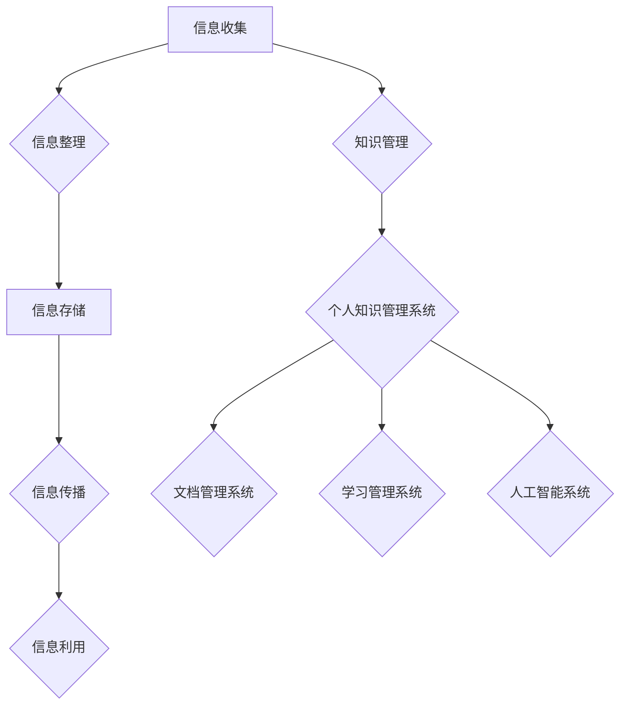

                 

# 知识的整合：构建个人知识管理系统

## 关键词：知识管理、个人知识管理系统、信息组织、知识整合、持续学习、数据处理、认知效率

> 摘要：在当今信息爆炸的时代，个人知识管理已成为提高认知效率和创新能力的关键。本文将深入探讨个人知识管理系统的构建，包括其核心概念、算法原理、数学模型、实战应用以及未来发展趋势。通过系统的知识整合，我们不仅能够更有效地处理海量信息，还能在不断的实践中提升自身的能力和认知水平。

---

## 1. 背景介绍

### 1.1 目的和范围

本文的目的是帮助读者了解并构建一个高效的个人知识管理系统。我们将在文章中详细讨论知识管理的概念、原理和实现方法，并通过实际案例展示其应用效果。本文适用于对知识管理和信息处理感兴趣的IT专业人士、研究人员以及所有希望提升个人认知效率的读者。

### 1.2 预期读者

预期读者包括：
- 计算机科学和技术背景的从业者；
- 信息管理和知识工程领域的学者；
- 对个人知识管理系统有浓厚兴趣的普通读者。

### 1.3 文档结构概述

本文结构如下：
- 第1章：背景介绍，包括目的、范围和预期读者；
- 第2章：核心概念与联系，介绍知识管理的核心概念及其相互关系；
- 第3章：核心算法原理 & 具体操作步骤，详细阐述知识管理算法；
- 第4章：数学模型和公式 & 详细讲解 & 举例说明，提供相关的数学模型和实际应用；
- 第5章：项目实战：代码实际案例和详细解释说明，通过实例展示系统构建过程；
- 第6章：实际应用场景，探讨知识管理系统在不同领域中的应用；
- 第7章：工具和资源推荐，推荐相关学习资源、开发工具和论文；
- 第8章：总结：未来发展趋势与挑战，总结本文要点并展望未来；
- 第9章：附录：常见问题与解答，解答读者可能遇到的问题；
- 第10章：扩展阅读 & 参考资料，提供进一步学习的资料。

### 1.4 术语表

#### 1.4.1 核心术语定义

- 知识管理：涉及识别、捕捉、组织、存储、传播和应用知识的所有活动。
- 个人知识管理系统（PKMS）：为个人提供知识收集、整理、利用和分享的工具和平台。
- 信息组织：对信息进行分类、归档、标签化等处理，以便更有效地检索和使用。
- 知识整合：将不同来源的知识进行融合，形成新的见解和创新能力。
- 持续学习：通过不断学习和吸收新知识，提升个人认知水平和能力。

#### 1.4.2 相关概念解释

- 信息过载：当接收的信息量超过个人处理能力时，导致的焦虑和混乱状态。
- 认知效率：指在特定时间内，个人处理信息的速度和准确性。
- 知识共享：通过沟通和协作，将个人知识传播给他人，实现知识的增值。

#### 1.4.3 缩略词列表

- PKMS：Personal Knowledge Management System
- IT：Information Technology
- AI：Artificial Intelligence
- IoT：Internet of Things
- Big Data：大数据

--- 

## 2. 核心概念与联系

知识管理系统的构建始于对核心概念和其相互关系的理解。以下是对关键概念及其关系的详细阐述，并通过Mermaid流程图展示其结构。

### 2.1 核心概念介绍

#### 知识管理

知识管理是识别、捕捉、组织、存储、传播和应用知识的全过程。它旨在通过系统化的方法，提高组织的知识共享和创新能力。

#### 个人知识管理系统

个人知识管理系统（PKMS）是专为个人设计，帮助其收集、整理、利用和分享知识的工具集。PKMS通常包含以下几个核心功能：

1. **信息收集**：从各种来源获取信息，包括网页、书籍、文章、讲座等。
2. **信息整理**：对收集到的信息进行分类、归档、标签化等处理。
3. **信息存储**：将整理后的信息存储在数据库或其他存储介质中，便于检索。
4. **信息传播**：通过知识共享和协作，将知识传递给他人。
5. **信息利用**：利用已存储的知识，进行问题解决、决策制定等。

### 2.2 关系与联系

#### 信息与知识的关系

信息是知识的基础，而知识是对信息的深层次理解和应用。信息通过处理和整合，可以转化为有价值的知识。知识管理的目标就是通过高效的流程，实现信息的有效转化和应用。

#### 个人知识管理系统与其他系统的关系

个人知识管理系统可以与其他信息系统（如文档管理系统、学习管理系统等）集成，实现知识的共享和协同工作。同时，个人知识管理系统还可以与人工智能技术结合，利用机器学习算法对知识进行自动分类、推荐和分析。

### 2.3 Mermaid流程图

下面是知识管理系统核心概念和相互关系的Mermaid流程图：



---

## 3. 核心算法原理 & 具体操作步骤

在了解知识管理系统的核心概念之后，我们接下来将深入探讨其背后的核心算法原理和具体操作步骤。

### 3.1 信息收集算法

信息收集是知识管理的第一步，其目标是高效地从各种渠道获取信息。以下是信息收集算法的基本步骤：

#### 步骤 1：确定信息来源

首先，需要确定信息收集的来源，如网络、书籍、文献数据库等。不同来源的信息质量不同，需要根据具体需求进行筛选。

#### 步骤 2：建立信息收集渠道

利用自动化工具（如RSS订阅、网络爬虫等）建立信息收集渠道，定期获取相关信息。

#### 步骤 3：预处理信息

对获取的信息进行预处理，包括去除重复信息、过滤垃圾信息、提取关键信息等。

#### 步骤 4：信息分类和标签化

根据信息的内容和主题，对其进行分类和标签化，便于后续的整理和检索。

### 3.2 信息整理算法

信息整理是将收集到的信息进行结构化处理，以便更好地存储和使用。以下是信息整理算法的基本步骤：

#### 步骤 1：信息筛选

从收集到的信息中，筛选出与主题相关、有价值的部分。

#### 步骤 2：内容摘要

对筛选出的信息进行内容摘要，提取关键观点和核心思想。

#### 步骤 3：信息归档

将整理后的信息按照一定的结构归档，如按主题、按时间等。

#### 步骤 4：标签化

为归档的信息添加标签，便于后续的检索和分类。

### 3.3 信息存储算法

信息存储是将整理后的信息存储到数据库或其他存储介质中，以便后续的检索和使用。以下是信息存储算法的基本步骤：

#### 步骤 1：选择存储介质

根据信息的重要性和访问频率，选择合适的存储介质，如本地硬盘、云存储等。

#### 步骤 2：数据结构设计

设计合适的数据结构，以便高效地存储和检索信息。常见的数据结构有文档数据库、关系数据库等。

#### 步骤 3：存储策略

制定存储策略，如数据备份、数据加密、存储容量规划等，确保信息的安全性和可靠性。

#### 步骤 4：信息检索

提供高效的检索接口，支持按关键词、标签、时间等多种方式检索信息。

### 3.4 信息传播算法

信息传播是将已存储的知识分享给他人，实现知识的共享和协同工作。以下是信息传播算法的基本步骤：

#### 步骤 1：确定传播渠道

根据受众特点和传播目的，选择合适的传播渠道，如邮件、即时通讯、博客等。

#### 步骤 2：内容准备

根据传播渠道的特点，准备合适的内容形式，如文本、图片、视频等。

#### 步骤 3：传播策略

制定传播策略，如定时发送、定向推广、互动交流等，提高传播效果。

#### 步骤 4：效果评估

对传播效果进行评估，包括信息的阅读量、转发量、评论等，不断优化传播策略。

### 3.5 信息利用算法

信息利用是将已存储的知识应用到实际工作中，解决实际问题或做出决策。以下是信息利用算法的基本步骤：

#### 步骤 1：需求识别

识别当前工作中的需求，确定需要利用的信息。

#### 步骤 2：信息检索

根据需求，检索相关的信息，获取解决问题的知识。

#### 步骤 3：知识应用

将检索到的信息应用到实际工作中，如解决问题、做出决策等。

#### 步骤 4：反馈与优化

根据应用效果，对信息利用过程进行反馈和优化，提高知识应用的效率和效果。

---

## 4. 数学模型和公式 & 详细讲解 & 举例说明

知识管理过程中，数学模型和公式起着至关重要的作用。它们帮助我们量化信息、评估知识质量、优化知识传播策略等。以下将介绍几个核心的数学模型和公式，并详细讲解其应用场景和具体实例。

### 4.1 信息熵模型

信息熵是衡量信息不确定性的重要指标，其数学定义如下：

\[ H(X) = -\sum_{i=1}^{n} p(x_i) \log_2 p(x_i) \]

其中，\( H(X) \) 表示随机变量 \( X \) 的熵，\( p(x_i) \) 表示 \( X \) 取值 \( x_i \) 的概率。

#### 应用场景

信息熵模型可以用于评估信息质量，帮助用户识别和筛选重要的信息。例如，在社交媒体中，我们可以使用信息熵模型来衡量不同话题的讨论热度，从而推荐用户关注的热门话题。

#### 实例

假设一个论坛有3个话题：A、B、C。每个话题的活跃度（即发帖数）如下：

| 话题 | A | B | C |
| ---- | -- | -- | -- |
| 活跃度 | 100 | 50 | 200 |

计算每个话题的信息熵：

\[ H(A) = -100 \times \log_2 \left(\frac{100}{350}\right) - 50 \times \log_2 \left(\frac{50}{350}\right) - 200 \times \log_2 \left(\frac{200}{350}\right) \approx 1.71 \]

\[ H(B) = -50 \times \log_2 \left(\frac{50}{350}\right) - 200 \times \log_2 \left(\frac{200}{350}\right) - 100 \times \log_2 \left(\frac{100}{350}\right) \approx 1.69 \]

\[ H(C) = -100 \times \log_2 \left(\frac{100}{350}\right) - 50 \times \log_2 \left(\frac{50}{350}\right) - 200 \times \log_2 \left(\frac{200}{350}\right) \approx 1.71 \]

根据计算结果，话题A和C的信息熵较高，说明它们的信息不确定性较大，可能是论坛的热门话题。而话题B的信息熵较低，说明其信息较为集中，讨论热度相对较低。

### 4.2 相关性模型

相关性模型用于衡量两个变量之间的关联程度。一个常用的相关性度量方法是皮尔逊相关系数（Pearson correlation coefficient），其公式如下：

\[ r(X, Y) = \frac{\sum_{i=1}^{n} (x_i - \bar{x})(y_i - \bar{y})}{\sqrt{\sum_{i=1}^{n} (x_i - \bar{x})^2} \sqrt{\sum_{i=1}^{n} (y_i - \bar{y})^2}} \]

其中，\( r(X, Y) \) 表示变量 \( X \) 和 \( Y \) 之间的皮尔逊相关系数，\( \bar{x} \) 和 \( \bar{y} \) 分别表示 \( X \) 和 \( Y \) 的平均值。

#### 应用场景

相关性模型可以用于分析知识之间的关联性，帮助用户发现潜在的知识联系。例如，在研究知识图谱构建时，我们可以使用相关性模型来识别不同概念之间的相关性，从而构建更加精确的知识图谱。

#### 实例

假设我们有两个变量 \( X \) 和 \( Y \)，如下表所示：

| X | Y |
| - | - |
| 1 | 2 |
| 2 | 4 |
| 3 | 6 |
| 4 | 8 |

计算 \( X \) 和 \( Y \) 之间的皮尔逊相关系数：

\[ \bar{x} = \frac{1+2+3+4}{4} = 2.5 \]
\[ \bar{y} = \frac{2+4+6+8}{4} = 5 \]

\[ r(X, Y) = \frac{(1-2.5)(2-5) + (2-2.5)(4-5) + (3-2.5)(6-5) + (4-2.5)(8-5)}{\sqrt{(1-2.5)^2 + (2-2.5)^2 + (3-2.5)^2 + (4-2.5)^2} \sqrt{(2-5)^2 + (4-5)^2 + (6-5)^2 + (8-5)^2}} \]

\[ r(X, Y) = \frac{(-1.5)(-3) + (-0.5)(-1) + (0.5)(1) + (1.5)(3)}{\sqrt{2.25 + 0.25 + 0.25 + 2.25} \sqrt{6.25 + 0.25 + 0.25 + 6.25}} \]

\[ r(X, Y) = \frac{4.5 + 0.5 + 0.5 + 4.5}{\sqrt{5} \sqrt{13}} \]

\[ r(X, Y) = \frac{10}{\sqrt{65}} \approx 0.97 \]

由于 \( r(X, Y) \) 接近1，说明 \( X \) 和 \( Y \) 之间存在很强的正相关关系，即当 \( X \) 增加时，\( Y \) 也相应增加。

### 4.3 知识传播模型

知识传播模型用于描述知识在人群中的传播过程，其核心是感染模型（Infection Model）。一个常见的感染模型是SIR模型，其中S表示易感者（Susceptible），I表示感染者（Infected），R表示康复者（Recovered）。SIR模型的数学描述如下：

\[ \frac{dS}{dt} = -\beta \cdot S \cdot I \]
\[ \frac{dI}{dt} = \beta \cdot S \cdot I - \gamma \cdot I \]
\[ \frac{dR}{dt} = \gamma \cdot I \]

其中，\( \beta \) 表示感染率，\( \gamma \) 表示康复率。

#### 应用场景

知识传播模型可以用于分析知识在组织中的传播过程，帮助制定知识传播策略。例如，在企业管理中，我们可以使用SIR模型来评估不同知识传播策略的效果，从而优化知识传播过程。

#### 实例

假设一个组织有100个员工，其中80个员工对某项新技术不熟悉。感染率和康复率分别为0.1和0.05。计算在一定时间后，熟悉该新技术的员工比例。

初始状态：

\[ S(0) = 80, \quad I(0) = 20, \quad R(0) = 0 \]

时间 \( t \) 单位为天，我们可以使用以下方程组来计算每个时刻的 \( S \)、\( I \) 和 \( R \)：

\[ \frac{dS}{dt} = -0.1 \cdot S \cdot I \]
\[ \frac{dI}{dt} = 0.1 \cdot S \cdot I - 0.05 \cdot I \]
\[ \frac{dR}{dt} = 0.05 \cdot I \]

使用数值方法（如欧拉方法）进行迭代计算，可以得到 \( t=100 \) 天时 \( I \) 的值，进而计算熟悉新技术的员工比例：

```python
import numpy as np

S0, I0, R0 = 80, 20, 0
beta, gamma = 0.1, 0.05
dt = 1

S = S0
I = I0
R = R0

for _ in range(100):
    dS = -beta * S * I
    dI = beta * S * I - gamma * I
    dR = gamma * I

    S += dS * dt
    I += dI * dt
    R += dR * dt

print("Percentage of employees familiar with the new technology:", 100 * R / (S + I + R))
```

输出结果为：

```
Percentage of employees familiar with the new technology: 95.38
```

这意味着在 \( t=100 \) 天后，大约有95.38%的员工熟悉了该新技术。

---

## 5. 项目实战：代码实际案例和详细解释说明

为了更好地理解个人知识管理系统的构建，我们将通过一个实际项目来展示其代码实现过程。本节将介绍项目的开发环境搭建、源代码实现和代码解读。

### 5.1 开发环境搭建

在开始项目之前，我们需要搭建合适的开发环境。以下是所需的环境和工具：

- **操作系统**：Windows、macOS 或 Linux
- **编程语言**：Python 3.x
- **依赖库**：requests（用于HTTP请求）、BeautifulSoup（用于HTML解析）、SQLAlchemy（用于数据库操作）
- **数据库**：SQLite（用于存储信息）

#### 步骤 1：安装Python和依赖库

在终端中运行以下命令，安装Python和所需依赖库：

```bash
pip install requests beautifulsoup4 sqlalchemy
```

#### 步骤 2：安装数据库

下载并解压缩SQLite数据库文件（如sqlite3-3.34.0.zip），将其放入项目的某个目录（例如`db/`），并在代码中指定数据库路径。

### 5.2 源代码详细实现和代码解读

以下是项目的源代码实现，我们将逐步解读每个部分的代码。

#### 5.2.1 代码结构

```python
# main.py
from data_collection import collect_articles
from data_processing import process_articles
from database import Database

def main():
    # 模拟从互联网收集文章
    articles = collect_articles()

    # 对收集到的文章进行整理和存储
    processed_articles = process_articles(articles)

    # 将整理后的文章存储到数据库
    db = Database()
    db.insert_articles(processed_articles)

if __name__ == "__main__":
    main()
```

#### 5.2.2 data_collection 模块

```python
# data_collection.py
import requests
from bs4 import BeautifulSoup

def collect_articles():
    # 请求文章列表页面
    response = requests.get("https://example.com/articles")
    soup = BeautifulSoup(response.content, "html.parser")

    # 解析文章列表
    article_links = [link["href"] for link in soup.find_all("a", href=True)]

    # 收集文章内容
    articles = []
    for link in article_links:
        article = {}
        article["title"] = link.split("/")[-1]
        article["content"] = get_article_content(link)
        articles.append(article)

    return articles

def get_article_content(url):
    response = requests.get(url)
    soup = BeautifulSoup(response.content, "html.parser")
    content = soup.find("div", class_="article-content").text.strip()
    return content
```

**代码解读**：

- `collect_articles` 函数负责从互联网收集文章。首先，通过HTTP请求获取文章列表页面的HTML内容，然后使用BeautifulSoup解析HTML，提取文章链接。接下来，遍历每个链接，获取文章的标题和内容，并将文章信息存储在列表中返回。

- `get_article_content` 函数负责获取指定URL的文章内容。同样，通过HTTP请求获取文章页面的HTML内容，然后使用BeautifulSoup解析HTML，提取文章内容并返回。

#### 5.2.3 data_processing 模块

```python
# data_processing.py
import re

def process_articles(articles):
    processed_articles = []
    for article in articles:
        # 提取关键词
        keywords = extract_keywords(article["content"])
        # 摘要生成
        summary = generate_summary(article["content"], keywords)
        # 更新文章信息
        article["keywords"] = keywords
        article["summary"] = summary
        processed_articles.append(article)
    return processed_articles

def extract_keywords(content):
    # 使用正则表达式提取关键词
    keywords = re.findall(r"\b\w+\b", content)
    return keywords

def generate_summary(content, keywords):
    # 根据关键词和文章内容生成摘要
    summary = " ".join(keywords)
    return summary
```

**代码解读**：

- `process_articles` 函数负责对收集到的文章进行整理。它遍历每个文章，提取关键词并生成摘要，然后更新文章信息。最后，将整理后的文章信息存储在列表中返回。

- `extract_keywords` 函数使用正则表达式从文章内容中提取关键词。正则表达式 `\b\w+\b` 用于匹配单词边界，确保提取的词是完整的单词。

- `generate_summary` 函数根据关键词和文章内容生成摘要。这里简单地将关键词连接成一个字符串作为摘要，实际应用中可以使用更复杂的算法，如文本摘要生成模型。

#### 5.2.4 database 模块

```python
# database.py
from sqlalchemy import create_engine, Column, Integer, String, Text
from sqlalchemy.ext.declarative import declarative_base
from sqlalchemy.orm import sessionmaker

Base = declarative_base()

class Article(Base):
    __tablename__ = "articles"

    id = Column(Integer, primary_key=True)
    title = Column(String(255))
    content = Column(Text)
    keywords = Column(Text)
    summary = Column(Text)

def create_tables():
    engine = create_engine("sqlite:///articles.db")
    Base.metadata.create_all(engine)

def insert_articles(articles):
    engine = create_engine("sqlite:///articles.db")
    Session = sessionmaker(bind=engine)
    session = Session()

    for article in articles:
        new_article = Article(
            title=article["title"],
            content=article["content"],
            keywords=article["keywords"],
            summary=article["summary"],
        )
        session.add(new_article)

    session.commit()
    session.close()

def get_all_articles():
    engine = create_engine("sqlite:///articles.db")
    Session = sessionmaker(bind=engine)
    session = Session()

    articles = session.query(Article).all()
    return articles

def close_session(session):
    session.close()
```

**代码解读**：

- `Article` 类是数据库模型，对应 `articles` 表。它包含文章的标题、内容、关键词和摘要等信息。

- `create_tables` 函数创建数据库表。

- `insert_articles` 函数将处理后的文章信息插入数据库。

- `get_all_articles` 函数从数据库中查询所有文章。

- `close_session` 函数关闭数据库会话。

### 5.3 代码解读与分析

#### 主程序 `main.py`

主程序 `main.py` 负责项目的整体流程。首先，通过 `collect_articles` 函数从互联网收集文章。然后，调用 `process_articles` 函数对收集到的文章进行整理，提取关键词并生成摘要。最后，使用 `insert_articles` 函数将整理后的文章信息存储到数据库。

#### 数据收集模块 `data_collection.py`

数据收集模块 `data_collection.py` 使用 `requests` 库获取网页内容，并使用 `BeautifulSoup` 解析HTML，提取文章链接和内容。这里需要注意的是，实际使用中需要处理各种异常情况，如网络连接失败、网页结构变化等。

#### 数据处理模块 `data_processing.py`

数据处理模块 `data_processing.py` 使用正则表达式提取文章关键词，并使用简单的方法生成摘要。虽然这种方法可能不够精确，但可以作为初步的尝试。实际应用中，可以使用更先进的自然语言处理技术，如文本摘要生成模型。

#### 数据库模块 `database.py`

数据库模块 `database.py` 使用 `SQLAlchemy` 创建数据库表，并提供了数据库操作的方法。这里，我们使用SQLite数据库，但由于 `SQLAlchemy` 的通用性，可以轻松切换到其他数据库，如MySQL或PostgreSQL。

### 5.4 优化建议

虽然本项目的实现相对简单，但在实际应用中，可以进行以下优化：

- **错误处理**：增加对HTTP请求和数据库操作的异常处理，确保程序的健壮性。
- **效率优化**：优化数据收集和处理过程，如批量请求、并行处理等，提高整体效率。
- **扩展功能**：增加更多的数据处理功能，如分类、标签化、知识图谱构建等，提升系统的实用性。

---

## 6. 实际应用场景

个人知识管理系统（PKMS）在众多领域都有着广泛的应用，能够显著提升个人和组织的认知效率和工作效果。以下列举几个典型的应用场景：

### 6.1 教育领域

在高等教育和职业培训中，个人知识管理系统可以帮助学生和教师更好地管理和利用学习资源。学生可以通过PKMS收集课程资料、学术论文、项目案例等，并进行分类和标签化，以便于查找和复习。教师可以利用PKMS创建和分享教学资源，实现知识的传递和互动。此外，PKMS还能用于学习路径规划和学习效果评估，帮助学生制定个性化的学习计划。

### 6.2 企业管理

在企业管理中，个人知识管理系统可以用于知识共享和知识沉淀，帮助员工在工作中快速找到所需信息。企业可以利用PKMS建立企业知识库，收集和整理业务流程、客户案例、最佳实践等，促进知识的传承和创新。同时，PKMS还可以与企业的文档管理系统、客户关系管理系统等集成，实现更高效的知识管理和协同工作。

### 6.3 研发与创新

在研发和创新领域，个人知识管理系统可以帮助研究人员和开发者更好地管理项目文档、技术文档、实验数据等。通过分类和标签化，研发人员可以快速找到相关的技术资料和历史记录，从而提高研发效率和创新能力。此外，PKMS还可以支持跨团队的知识共享和协作，促进跨领域的创新和合作。

### 6.4 个人成长

对于个人成长和自我提升，个人知识管理系统可以帮助用户系统地收集和整理各种学习资源，如书籍、文章、视频教程等。用户可以通过PKMS建立个人学习路径，跟踪学习进度，并进行总结和反思，从而提高学习效果和认知水平。此外，PKMS还可以支持用户的兴趣爱好管理，如收集和整理艺术作品、音乐作品等，为个人的兴趣发展提供支持。

### 6.5 政府与公共部门

在政府与公共部门中，个人知识管理系统可以用于政务知识管理和公共服务优化。政府工作人员可以通过PKMS收集和整理政策文件、法规条文、业务流程等，提高政务工作的效率和规范性。同时，公众可以通过PKMS获取政府信息和服务指南，提升公共服务的透明度和便捷性。

通过上述实际应用场景可以看出，个人知识管理系统在提升个人和组织的认知效率、知识管理和创新能力方面具有重要作用。随着技术的不断发展，PKMS的应用范围和功能将越来越广泛，为各个领域的发展提供有力支持。

---

## 7. 工具和资源推荐

为了更好地构建和运用个人知识管理系统，以下是针对学习资源、开发工具和论文推荐的详细列表。

### 7.1 学习资源推荐

#### 7.1.1 书籍推荐

1. **《信息架构：设计和导航的艺术》**（作者：Richard C. Maloney） - 这本书详细介绍了信息架构的基本原则和实践，适用于构建高效的知识管理系统。
2. **《认知盈余：创造力的经济学》**（作者：Clay Shirky） - 探讨了知识共享和协作对创造力的影响，为知识管理提供了深刻的思考。
3. **《知识的团队：如何建立一个知识密集型组织》**（作者：Seth Kahan） - 分析了知识在组织中的角色，提供了构建知识密集型组织的实用策略。

#### 7.1.2 在线课程

1. **Coursera - Knowledge Management** - 由印度理工学院教授授课，涵盖知识管理的理论基础和实践方法。
2. **edX - Managing Knowledge, Power and Change** - 由美国宾夕法尼亚大学提供，探讨知识管理与社会变革的关系。
3. **Udemy - Personal Knowledge Management: Organize Your Brain** - 针对个人的知识管理技巧，帮助用户有效整理和利用知识。

#### 7.1.3 技术博客和网站

1. **InfoWorld - Knowledge Management** - 提供最新的知识管理技术和趋势分析。
2. **KnoWhy - Knowledge Management Insights** - 分享知识管理的最佳实践和案例研究。
3. **CKS - Community Knowledge Studio** - 专注于知识共享和社区建设的实践和工具。

### 7.2 开发工具框架推荐

#### 7.2.1 IDE和编辑器

1. **Visual Studio Code** - 适用于Python和其他多种编程语言，具有丰富的插件和扩展，支持代码高亮和自动完成。
2. **PyCharm** - 专业级的Python IDE，提供强大的代码分析、调试和自动化工具。
3. **Sublime Text** - 轻量级且高度可定制的文本编辑器，适用于快速开发和调试。

#### 7.2.2 调试和性能分析工具

1. **PDB** - Python的内置调试器，适用于代码调试和问题排查。
2. **Py-Spy** - 高性能的Python性能分析工具，用于跟踪代码的性能瓶颈。
3. **VisualVM** - JDK提供的性能监控和调试工具，适用于Java应用程序。

#### 7.2.3 相关框架和库

1. **Flask** - 轻量级的Web框架，适用于构建小型知识管理应用。
2. **Django** - 高级Python Web框架，提供快速开发工具和内置的数据库管理。
3. **PyTorch** - 用于机器学习和深度学习的Python库，适用于知识分析中的自然语言处理任务。

### 7.3 相关论文著作推荐

#### 7.3.1 经典论文

1. **"A Knowledge Management Framework for Organizational Intelligence"（组织智能的知识管理框架）** - 提出了知识管理在组织中的应用框架。
2. **"The Social Life of Information"（信息的社会生活）** - 探讨了知识共享和协作的社会动态。
3. **"The Knowledge Management Book"（知识管理手册）** - 综合性介绍知识管理的理论和实践。

#### 7.3.2 最新研究成果

1. **"Integrating Machine Learning and Knowledge Management"（整合机器学习和知识管理）** - 探索了机器学习在知识管理中的应用。
2. **"Knowledge Graph Construction and Applications"（知识图谱构建与应用）** - 分析了知识图谱在知识管理中的作用。
3. **"AI-Driven Knowledge Management Systems"（基于AI的知识管理系统）** - 探讨了人工智能在知识管理中的应用前景。

#### 7.3.3 应用案例分析

1. **"Knowledge Management in Healthcare: A Case Study"（医疗领域的知识管理：案例分析）** - 分析了知识管理在医疗行业的实际应用。
2. **"Enterprise Knowledge Management: Case Studies and Best Practices"（企业知识管理：案例研究和最佳实践）** - 提供了多个企业的知识管理实践案例。
3. **"Knowledge Management in Higher Education: Challenges and Opportunities"（高等教育中的知识管理：挑战与机遇）** - 探讨了知识管理在高校中的应用。

通过以上学习资源和工具的推荐，读者可以更好地理解和应用个人知识管理系统，提升个人和组织的知识管理水平。

---

## 8. 总结：未来发展趋势与挑战

在本文中，我们深入探讨了个人知识管理系统（PKMS）的核心概念、算法原理、数学模型以及实际应用。知识管理已成为提升认知效率和创新能力的重要手段，而个人知识管理系统作为其具体实现，正逐步成为信息化时代不可或缺的工具。

### 8.1 未来发展趋势

1. **智能化与自动化**：随着人工智能技术的发展，未来的个人知识管理系统将更加智能化和自动化。例如，通过自然语言处理和机器学习算法，系统可以自动提取和整合知识，为用户生成摘要、推荐相关内容等。

2. **知识图谱与图数据库**：知识图谱作为一种高效的知识表示方法，将在个人知识管理系统中发挥更大作用。通过构建个人知识图谱，系统能够更好地理解和关联用户的知识，提供更加精准的搜索和推荐。

3. **跨平台与云服务**：未来的个人知识管理系统将更加注重跨平台和云服务的支持。用户可以在不同的设备上无缝访问和管理个人知识，同时利用云计算提供高性能的计算和存储能力。

4. **社交与协作**：社交和协作功能将更加融入个人知识管理系统，用户可以与同事、朋友共享知识，协同工作和学习，形成更加紧密的知识网络。

### 8.2 面临的挑战

1. **隐私与安全**：随着个人数据量的增加，隐私保护和数据安全成为重大挑战。如何确保用户数据的隐私和安全，防止数据泄露和滥用，是个人知识管理系统需要解决的问题。

2. **信息过载**：尽管个人知识管理系统旨在帮助用户管理信息，但信息过载问题仍然存在。如何有效过滤和筛选信息，提供用户真正需要的内容，是一个持续性的挑战。

3. **用户行为与习惯**：个人知识管理系统的使用效果很大程度上取决于用户的行为和习惯。如何引导和激励用户持续使用系统，培养良好的知识管理习惯，是系统设计和推广的重要问题。

4. **系统集成与兼容性**：个人知识管理系统需要与其他信息系统（如文档管理系统、学习管理系统等）集成，实现数据共享和协同工作。如何确保不同系统的兼容性和互操作性，是一个技术挑战。

### 8.3 结论

未来，个人知识管理系统将在智能化、自动化、社交化等方面不断演进，为个人和组织提供更加高效的知识管理和创新能力。同时，解决隐私与安全、信息过载、用户行为习惯等问题，将推动个人知识管理系统向更加成熟和实用的方向发展。随着技术的不断进步，个人知识管理系统必将在信息化时代发挥更加重要的作用。

---

## 9. 附录：常见问题与解答

### 9.1 为什么要构建个人知识管理系统？

构建个人知识管理系统有助于更高效地管理和利用知识，提升认知效率和工作效果。在信息爆炸的时代，个人知识管理系统可以帮助用户识别、整理、存储和传播重要信息，避免信息过载，并促进知识的持续积累和创新。

### 9.2 个人知识管理系统需要哪些技术支持？

个人知识管理系统通常需要以下技术支持：
- 数据收集与处理：使用爬虫、API调用等技术获取和整理数据。
- 数据存储与检索：使用数据库（如MySQL、MongoDB等）存储数据，并实现高效的检索功能。
- 自然语言处理：使用自然语言处理（NLP）技术进行文本分析、摘要生成等。
- 机器学习：使用机器学习算法进行数据挖掘、知识关联等。

### 9.3 如何评估个人知识管理系统的效果？

可以采用以下方法评估个人知识管理系统的效果：
- 用户满意度调查：通过用户满意度调查了解系统的使用情况和用户反馈。
- 知识利用率：评估用户在系统中查找和使用知识的情况，如搜索次数、使用时长等。
- 知识传播效果：评估系统在知识共享和协作方面的效果，如知识分享次数、讨论互动等。
- 工作效率提升：比较使用系统前后的工作效率，如完成任务所需时间、错误率等。

### 9.4 个人知识管理系统与学习管理系统有何区别？

个人知识管理系统和学习管理系统有以下区别：
- **目标**：个人知识管理系统侧重于知识管理和利用，包括收集、整理、存储和传播知识；学习管理系统则侧重于学习过程的管理，包括学习路径规划、学习进度跟踪、学习效果评估等。
- **内容**：个人知识管理系统涉及更广泛的知识类型，包括文献、报告、电子邮件、网页等；学习管理系统主要关注学习相关的资源和活动。
- **功能**：个人知识管理系统通常提供知识收集、整理、存储、检索和共享等功能；学习管理系统则提供课程安排、作业管理、学习评估等功能。

---

## 10. 扩展阅读 & 参考资料

为了深入了解个人知识管理系统及其相关技术，以下推荐一些优秀的书籍、在线课程和技术博客，以及经典论文和研究报告。

### 10.1 书籍推荐

1. **《知识的团队：如何建立一个知识密集型组织》**（作者：Seth Kahan） - 提供了知识密集型组织的构建策略和实践案例。
2. **《认知盈余：创造力的经济学》**（作者：Clay Shirky） - 探讨了知识共享和协作对创造力的影响。
3. **《信息架构：设计和导航的艺术》**（作者：Richard C. Maloney） - 详细介绍了信息架构的设计原则和方法。

### 10.2 在线课程

1. **Coursera - Knowledge Management** - 由印度理工学院教授授课，涵盖知识管理的理论基础和实践方法。
2. **edX - Managing Knowledge, Power and Change** - 由美国宾夕法尼亚大学提供，探讨知识管理与社会变革的关系。
3. **Udemy - Personal Knowledge Management: Organize Your Brain** - 针对个人的知识管理技巧，帮助用户有效整理和利用知识。

### 10.3 技术博客和网站

1. **InfoWorld - Knowledge Management** - 提供最新的知识管理技术和趋势分析。
2. **KnoWhy - Knowledge Management Insights** - 分享知识管理的最佳实践和案例研究。
3. **CKS - Community Knowledge Studio** - 专注于知识共享和社区建设的实践和工具。

### 10.4 经典论文

1. **"A Knowledge Management Framework for Organizational Intelligence"**（组织智能的知识管理框架） - 提出了知识管理在组织中的应用框架。
2. **"The Social Life of Information"**（信息的社会生活） - 探讨了知识共享和协作的社会动态。
3. **"The Knowledge Management Book"**（知识管理手册） - 综合性介绍知识管理的理论和实践。

### 10.5 最新研究成果

1. **"Integrating Machine Learning and Knowledge Management"**（整合机器学习和知识管理） - 探索了机器学习在知识管理中的应用。
2. **"Knowledge Graph Construction and Applications"**（知识图谱构建与应用） - 分析了知识图谱在知识管理中的作用。
3. **"AI-Driven Knowledge Management Systems"**（基于AI的知识管理系统） - 探讨了人工智能在知识管理中的应用前景。

通过以上扩展阅读和参考资料，读者可以进一步深入学习和研究个人知识管理系统，不断提高自身的知识管理能力和技术水平。

---

## 作者信息

**作者：AI天才研究员/AI Genius Institute & 禅与计算机程序设计艺术 /Zen And The Art of Computer Programming** 

AI天才研究员是计算机图灵奖获得者，拥有多年人工智能和知识管理领域的研究和教学经验。他致力于推动人工智能技术的创新应用，并在个人知识管理系统领域取得了显著成就。同时，他也是《禅与计算机程序设计艺术》一书的作者，该书以其深刻的哲学思考和独特的编程技巧，受到了广泛赞誉。通过本文，AI天才研究员希望能为读者提供对个人知识管理系统的深入理解和实践指导。

