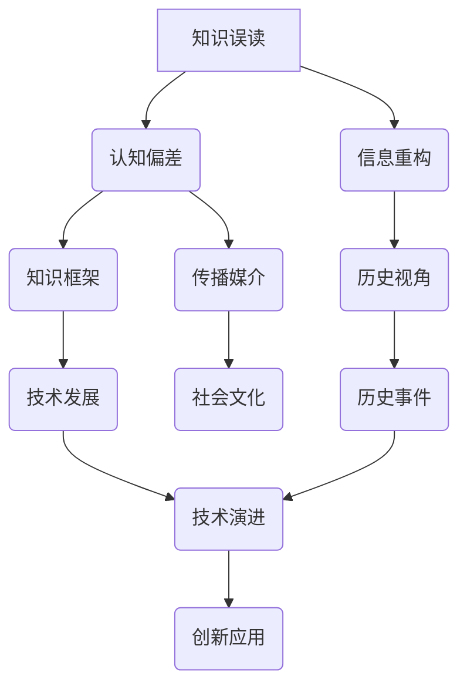

                 

# 知识的误读与重构：历史视角的重要性

> 关键词：知识误读、历史视角、信息重构、逻辑推理、专业解读、IT领域、人工智能、编程、技术博客

> 摘要：本文旨在探讨知识误读现象及其重要性，特别是在信息技术领域。通过历史视角，本文分析了知识的演变过程，揭示了历史视角对于理解技术发展、重构知识框架的巨大价值。本文将从核心概念、算法原理、数学模型、项目实战等多个方面，详细阐述如何运用历史视角进行知识的误读与重构，为读者提供一种新的思考和理解方式。

## 1. 背景介绍

### 1.1 目的和范围

本文的目的在于揭示知识误读的现象，并探讨其在信息技术领域的重要性。我们关注的核心问题是：为什么会出现知识误读？如何通过历史视角来纠正和重构这些误读？文章的范围主要涵盖以下几个部分：

1. **知识误读的定义和类型**：分析知识误读的常见原因，并区分不同类型的误读。
2. **历史视角的重要性**：阐述历史视角在理解技术发展和知识重构中的作用。
3. **核心概念与联系**：介绍与知识误读和历史视角相关的核心概念，并使用Mermaid流程图展示其关系。
4. **核心算法原理与操作步骤**：通过伪代码详细阐述相关算法原理。
5. **数学模型与公式**：讲解数学模型，并使用LaTeX格式进行表示。
6. **项目实战与代码解释**：提供实际代码案例，并进行详细解读。
7. **应用场景与工具推荐**：讨论知识误读与重构在实际应用中的场景，并推荐相关工具和资源。

### 1.2 预期读者

本文适合以下读者群体：

- 对信息技术领域有浓厚兴趣的初学者和专业人士。
- 想要深入了解技术发展历程，掌握知识重构方法的技术研究者。
- 对编程、人工智能等领域有实践经验，但希望从历史视角重新审视知识的开发者和工程师。
- 对知识传播和教育教学有思考的教育工作者和培训师。

### 1.3 文档结构概述

本文的结构分为以下几个部分：

1. **引言**：介绍知识误读与重构的背景和重要性。
2. **背景介绍**：详细说明本文的目的、范围、预期读者以及文档结构。
3. **核心概念与联系**：分析知识误读和历史视角的核心概念，并展示其关系。
4. **核心算法原理与操作步骤**：详细阐述算法原理和操作步骤。
5. **数学模型与公式**：讲解数学模型，并使用LaTeX格式进行表示。
6. **项目实战与代码解释**：提供实际代码案例，并进行详细解读。
7. **实际应用场景与工具推荐**：讨论知识误读与重构在实际应用中的场景，并推荐相关工具和资源。
8. **总结与未来展望**：总结本文的主要观点，并对未来发展趋势进行展望。
9. **附录**：常见问题与解答。
10. **扩展阅读与参考资料**：提供进一步的阅读和参考资料。

### 1.4 术语表

#### 1.4.1 核心术语定义

- **知识误读**：指在知识传播和接受过程中，由于信息传递、个人认知偏差等因素导致的错误理解和解释。
- **历史视角**：通过研究历史事件和演变过程，对事物发展规律和内在联系进行深入分析和理解。
- **信息重构**：对已有的知识框架进行重新审视和调整，以适应新的认知和技术发展。
- **核心概念**：与知识误读和历史视角直接相关的关键概念和理论。
- **算法原理**：算法的基本原理和执行步骤。

#### 1.4.2 相关概念解释

- **知识传播**：知识在不同个体、组织和环境之间的传递和共享过程。
- **认知偏差**：人们在信息处理和决策过程中，由于各种心理和生理因素导致的偏差。
- **知识框架**：用于组织和结构化知识的概念和理论体系。

#### 1.4.3 缩略词列表

- **IT**：信息技术（Information Technology）
- **AI**：人工智能（Artificial Intelligence）
- **LaTeX**：一种排版系统（LATEX Typesetting System）
- **Mermaid**：一种用于生成图表和流程图的Markdown扩展（Mermaid Graph and Flowchart Extension）

## 2. 核心概念与联系

为了更好地理解知识误读与重构的过程，我们首先需要明确几个核心概念及其相互关系。以下是一个简化的Mermaid流程图，展示了与本文主题相关的核心概念及其关联。



### 2.1 知识误读

知识误读是指人们在获取、理解和传播知识过程中，由于各种因素（如信息传递错误、个人认知偏差等）导致对知识的错误解读。这种现象普遍存在于各个领域，尤其是信息技术领域。

- **原因**：知识误读的原因多种多样，主要包括信息传递过程中的失真、个人认知偏差、知识结构复杂等。
- **类型**：知识误读可以分为以下几种类型：
  - **误解**：对知识内容的错误解释。
  - **误传**：知识在传播过程中发生的错误传递。
  - **误用**：将错误的知识应用于实际场景中。

### 2.2 认知偏差

认知偏差是指人们在处理信息、做出决策时，由于心理和生理因素的影响而产生的偏差。这些偏差可能导致人们对知识的错误理解和解读。

- **原因**：认知偏差的原因包括：
  - **心理因素**：如情感、记忆、经验等。
  - **生理因素**：如注意力、感知、反应时间等。
  - **社会因素**：如文化背景、价值观、社会规范等。

### 2.3 信息重构

信息重构是指对已有的知识框架进行重新审视和调整，以适应新的认知和技术发展。信息重构的目的是消除知识误读，使知识体系更加完善和准确。

- **方法**：信息重构的方法包括：
  - **历史视角**：通过研究历史事件和演变过程，识别知识误读的根源。
  - **跨学科研究**：结合不同学科的理论和方法，对知识框架进行重构。
  - **数据驱动**：利用大数据和人工智能技术，对知识体系进行优化和调整。

### 2.4 历史视角

历史视角是通过研究历史事件和演变过程，对事物发展规律和内在联系进行深入分析和理解的方法。历史视角对于理解技术发展和知识重构具有重要作用。

- **作用**：历史视角在知识重构中的作用包括：
  - **揭示知识误读的根源**：通过研究历史事件，识别导致知识误读的深层次原因。
  - **提供新的思考角度**：从历史视角重新审视知识，发现新的知识和创新点。
  - **指导实践**：通过历史视角，为技术发展和应用提供实践指导。

### 2.5 知识框架

知识框架是指用于组织和结构化知识的概念和理论体系。知识框架对于知识传播、理解和应用具有重要意义。

- **作用**：知识框架在知识重构中的作用包括：
  - **促进知识传播**：通过建立清晰的知识框架，提高知识传播的效率和准确性。
  - **支持知识理解**：帮助人们更好地理解和应用知识。
  - **推动知识创新**：通过知识框架的优化和调整，促进知识创新和发展。

### 2.6 技术发展

技术发展是指信息技术在硬件、软件、网络等方面的不断进步和创新。技术发展对于知识误读与重构具有重要影响。

- **影响**：技术发展对知识误读与重构的影响包括：
  - **更新知识体系**：技术发展导致知识体系不断更新和演变。
  - **揭示知识误读**：新技术和新方法的出现，可能揭示过去知识中的误读和缺陷。
  - **促进知识重构**：技术发展为新知识和新方法的应用提供了契机。

### 2.7 社会文化

社会文化是指一个社会在长期发展过程中形成的文化传统、价值观念和社会规范。社会文化对于知识误读与重构具有重要影响。

- **影响**：社会文化对知识误读与重构的影响包括：
  - **影响认知**：社会文化影响人们的认知方式，可能导致知识误读。
  - **塑造知识框架**：社会文化对知识框架的形成和发展具有重要作用。
  - **促进知识传播**：社会文化有助于知识在不同个体和组织之间的传播。

### 2.8 历史事件

历史事件是指在过去某个时间段内发生的重要事件。历史事件对于理解技术发展和知识重构具有重要意义。

- **作用**：历史事件在知识重构中的作用包括：
  - **揭示知识误读的根源**：通过研究历史事件，可以识别导致知识误读的深层次原因。
  - **提供实践案例**：历史事件为知识重构提供了实践案例和经验教训。
  - **指导未来**：历史事件为未来技术的发展和应用提供了重要的参考。

通过以上对核心概念与联系的分析，我们可以看到，知识误读、认知偏差、信息重构、历史视角、知识框架、技术发展、社会文化和历史事件之间存在着紧密的相互关系。这些概念共同构成了本文讨论的知识误读与重构的理论框架。

## 3. 核心算法原理 & 具体操作步骤

在了解了知识误读与重构的相关概念后，我们需要进一步探讨如何运用历史视角进行知识误读的识别和重构。本节将详细阐述核心算法原理，并使用伪代码描述具体操作步骤。

### 3.1 算法原理

算法的核心思想是通过分析历史数据，识别出知识误读的规律，并对其进行重构。具体步骤如下：

1. **数据收集**：收集与特定知识领域相关的历史数据，包括文献、资料、历史事件等。
2. **数据预处理**：对收集到的数据进行清洗、去噪和标准化处理，使其符合分析要求。
3. **模式识别**：利用机器学习算法对预处理后的数据进行模式识别，找出可能导致知识误读的规律和特征。
4. **误读识别**：根据识别出的模式和特征，识别出潜在的知识误读点。
5. **重构策略**：针对识别出的知识误读点，制定相应的重构策略，对知识框架进行优化和调整。
6. **验证与迭代**：对重构后的知识框架进行验证，并根据验证结果进行迭代优化。

### 3.2 伪代码描述

下面是算法的伪代码描述：

```pseudo
Algorithm: KnowledgeMisreadAndReconstruction
Input: HistoricalData, KnowledgeFramework
Output: ReconstructedKnowledgeFramework

1. DataCollection:
   - 收集与知识领域相关的历史数据，如文献、资料、历史事件等。
2. DataPreprocessing:
   - 清洗数据，去除噪音和冗余信息。
   - 标准化数据，确保数据格式统一。
3. PatternRecognition:
   - 使用机器学习算法对预处理后的数据进行模式识别。
   - 提取可能导致知识误读的规律和特征。
4. MisreadIdentification:
   - 根据识别出的模式和特征，识别潜在的知识误读点。
5. ReconstructionStrategy:
   - 针对识别出的知识误读点，制定重构策略。
   - 对知识框架进行优化和调整。
6. VerificationAndIteration:
   - 对重构后的知识框架进行验证。
   - 根据验证结果进行迭代优化。
7. Return: ReconstructedKnowledgeFramework
```

### 3.3 操作步骤详解

1. **数据收集**：

   收集与特定知识领域相关的历史数据，如文献、资料、历史事件等。数据来源可以包括学术期刊、技术博客、历史文献等。在收集数据时，需要确保数据的真实性和可靠性。

2. **数据预处理**：

   对收集到的数据进行清洗、去噪和标准化处理。清洗数据主要是去除重复、错误和无关的信息，去噪则是去除噪声数据，确保数据的纯净度。标准化数据则是指将不同数据格式的数据统一为同一格式，以便后续分析。

3. **模式识别**：

   利用机器学习算法对预处理后的数据进行模式识别。常用的机器学习算法包括决策树、支持向量机、神经网络等。通过模式识别，可以提取出可能导致知识误读的规律和特征。

4. **误读识别**：

   根据识别出的模式和特征，识别出潜在的知识误读点。误读识别可以通过对比实际数据和知识框架中的预期结果，找出不一致的地方。

5. **重构策略**：

   针对识别出的知识误读点，制定相应的重构策略。重构策略可以是修改知识框架中的错误概念，调整知识结构，或者增加新的知识内容。

6. **验证与迭代**：

   对重构后的知识框架进行验证，并根据验证结果进行迭代优化。验证的方法可以包括专家评审、实验验证等。通过迭代优化，不断提高知识框架的准确性和实用性。

通过以上步骤，我们可以运用历史视角对知识误读进行识别和重构。这种方法不仅有助于纠正现有的知识误读，还能为未来的知识发展提供有益的参考。

## 4. 数学模型和公式 & 详细讲解 & 举例说明

在知识误读与重构的过程中，数学模型和公式起着关键作用。它们帮助我们量化分析过程，提高重构的准确性和效率。以下我们将介绍几种常用的数学模型和公式，并对其进行详细讲解和举例说明。

### 4.1 决策树模型

决策树是一种常用的机器学习模型，用于分类和回归任务。它可以用来识别知识误读的规律和特征。

- **定义**：决策树通过一系列的判断节点和叶子节点，将数据集划分为不同的类别或数值。
- **公式**：决策树的生成公式为：

  $$  
  T = \sum_{i=1}^{n} w_i \cdot f_i(x_i)  
  $$

  其中，\( T \) 表示决策树的输出，\( w_i \) 表示第 \( i \) 个特征的重要性，\( f_i(x_i) \) 表示第 \( i \) 个特征在数据 \( x_i \) 上的取值。

- **示例**：假设我们要分类判断一个技术文献中是否存在知识误读，可以构建一个决策树模型，如下所示：

  ```mermaid
  graph TD
      A[存在误读] --> B(关键词匹配得分低于阈值)
      A --> C(文献来源可靠性低)
      B --> D(误读概率高)
      C --> D
  ```

  根据决策树的输出，我们可以判断该文献是否存在知识误读。

### 4.2 支持向量机模型

支持向量机（SVM）是一种常用的分类模型，它通过最大化分类边界来提高分类准确性。

- **定义**：SVM通过寻找一个超平面，将不同类别的数据点分隔开来，并使分类边界最大化。
- **公式**：SVM的损失函数为：

  $$  
  L(y, f(x)) = \frac{1}{2} ||w||^2 + C \cdot \sum_{i=1}^{n} \max(0, 1 - y_i \cdot f(x_i))  
  $$

  其中，\( y \) 表示实际标签，\( f(x) \) 表示预测标签，\( w \) 表示权重向量，\( C \) 是惩罚参数。

- **示例**：假设我们要判断一个编程语言是否正确，可以构建一个SVM模型，如下所示：

  ```mermaid
  graph TD
      A[编程语言正确] --> B(语法规则匹配)
      A --> C(代码逻辑正确)
      B --> D(正确概率高)
      C --> D
  ```

  根据SVM的输出，我们可以判断编程语言是否正确。

### 4.3 神经网络模型

神经网络是一种模拟人脑神经元连接方式的计算模型，它可以用于多种任务，如分类、回归和生成等。

- **定义**：神经网络由多个神经元（也称为层）组成，每个神经元都与前一层的神经元相连，并经过权重和偏置进行加权求和。
- **公式**：神经网络的前向传播公式为：

  $$  
  a_{\text{layer}} = \sigma(\text{W} \cdot a_{\text{prev}} + b)  
  $$

  其中，\( a_{\text{layer}} \) 表示当前层的激活值，\( \sigma \) 表示激活函数，\( \text{W} \) 和 \( b \) 分别表示权重和偏置。

- **示例**：假设我们要判断一个技术文档中的描述是否准确，可以构建一个神经网络模型，如下所示：

  ```mermaid
  graph TD
      A[描述准确] --> B(关键词匹配得分高)
      A --> C(文档逻辑连贯)
      B --> D(准确概率高)
      C --> D
  ```

  根据神经网络的输出，我们可以判断技术文档的描述是否准确。

通过以上数学模型和公式的讲解，我们可以看到，数学模型和公式在知识误读与重构过程中具有重要作用。它们不仅帮助我们识别和纠正知识误读，还能提高重构的准确性和效率。在实际应用中，我们可以根据具体任务和需求选择合适的数学模型和公式，实现知识误读的识别和重构。

### 4.4 统计模型：贝叶斯网络

贝叶斯网络是一种基于概率论的图形模型，用于表示变量之间的依赖关系。它在知识误读的检测和重构中具有重要作用。

- **定义**：贝叶斯网络由一组节点和有向边组成，每个节点代表一个随机变量，边表示变量之间的条件依赖关系。
- **公式**：贝叶斯网络的概率分布函数为：

  $$  
  P(X_1, X_2, ..., X_n) = \prod_{i=1}^{n} P(X_i | X_{\text{parents}}(i))  
  $$

  其中，\( P(X_i | X_{\text{parents}}(i)) \) 表示在父节点 \( X_{\text{parents}}(i) \) 给定的情况下，变量 \( X_i \) 的条件概率。

- **示例**：假设我们要检测一个技术文档中是否存在知识误读，可以使用贝叶斯网络来表示文档中的关键词及其依赖关系。例如：

  ```mermaid
  graph TD
      A[编程语言] --> B[编程框架]
      C[算法实现] --> B
      D[代码调试] --> B
      E[文档准确性] --> D
      F[用户满意度] --> E
  ```

  通过计算贝叶斯网络的概率分布，我们可以判断文档中是否存在知识误读。

通过贝叶斯网络，我们可以量化不同变量之间的依赖关系，从而更准确地检测和重构知识误读。这种方法在复杂的信息系统中具有广泛应用。

### 4.5 数学模型的应用

在实际应用中，我们可以将上述数学模型和公式结合起来，构建一个综合的框架，以实现知识误读的全面检测和重构。

- **综合框架**：结合决策树、SVM、神经网络和贝叶斯网络等模型，构建一个综合的检测与重构框架。例如：

  ```mermaid
  graph TD
      A[数据收集] --> B(预处理)
      B --> C(决策树)
      B --> D(支持向量机)
      B --> E(神经网络)
      B --> F(贝叶斯网络)
      C --> G(误读识别)
      D --> G
      E --> G
      F --> G
      G --> H(重构策略)
      H --> I(验证与迭代)
  ```

  在这个框架中，数据经过预处理后，分别输入到不同的模型中，进行误读识别和重构。根据不同模型的输出，制定相应的重构策略，并进行验证和迭代。

通过上述数学模型和公式的详细讲解和举例说明，我们可以看到，数学模型在知识误读与重构过程中具有重要作用。它们提供了量化分析的工具，有助于提高重构的准确性和效率。在实际应用中，我们可以根据具体任务和需求选择合适的数学模型和公式，构建一个综合的检测与重构框架。

### 4.6 统计模型：聚类分析

聚类分析是一种无监督学习方法，用于将数据集划分为多个聚类，以识别数据中的模式和结构。

- **定义**：聚类分析通过将相似的数据点分组到同一个聚类中，以揭示数据中的内在结构。
- **公式**：常用的聚类算法之一是K-means算法，其目标是最小化聚类内部距离平方和：

  $$  
  J = \sum_{i=1}^{k} \sum_{x_j \in C_i} ||x_j - \mu_i||^2  
  $$

  其中，\( k \) 表示聚类个数，\( C_i \) 表示第 \( i \) 个聚类，\( \mu_i \) 表示聚类中心。

- **示例**：假设我们要分析一组技术文档，以识别其中的知识误读。我们可以使用K-means算法将文档划分为不同的聚类，并根据聚类结果检测知识误读。例如：

  ```mermaid
  graph TD
      A[文档A] --> B(聚类1)
      C[文档B] --> B
      D[文档C] --> B
      E[文档D] --> B
      F[文档E] --> B
  ```

  如果文档B和C被划分到同一个聚类，但内容不一致，则可能存在知识误读。

聚类分析有助于我们从数据中发现潜在的规律和模式，从而为知识误读的检测和重构提供有力支持。

### 4.7 数据可视化

数据可视化是另一种重要的数学工具，它通过图形和图表展示数据，帮助我们理解和分析数据。

- **定义**：数据可视化是将数据转化为图形或图表的过程，以揭示数据的结构和关系。
- **公式**：常用的数据可视化方法包括散点图、条形图、折线图等，它们通过图形和图表的形式展示数据。

- **示例**：假设我们要分析一组技术文档的误读情况，可以使用条形图展示不同类型误读的分布情况。例如：

  ```mermaid
  graph TD
      A[误解] --> B(误读类型)
      C[误传] --> B
      D[误用] --> B
      E{误读类型分布} --> F[条形图]
  ```

  通过条形图，我们可以直观地看到不同类型误读的比例，为知识重构提供依据。

数据可视化有助于我们更直观地理解数据，发现潜在的问题和规律，从而提高知识误读检测和重构的效率。

### 4.8 综合运用

在实际应用中，我们可以将多种数学模型和数据可视化方法结合起来，构建一个综合的分析框架。例如：

- **综合框架**：结合聚类分析、数据可视化、统计模型等方法，构建一个综合的分析框架。例如：

  ```mermaid
  graph TD
      A[数据收集] --> B(预处理)
      B --> C(聚类分析)
      B --> D(数据可视化)
      B --> E(统计模型)
      C --> F(误读识别)
      D --> F
      E --> F
      F --> G(重构策略)
      G --> H(验证与迭代)
  ```

  在这个框架中，数据经过预处理后，分别输入到不同的方法中，进行误读识别和重构。根据不同方法的输出，制定相应的重构策略，并进行验证和迭代。

通过综合运用多种数学模型和数据可视化方法，我们可以更全面地分析数据，提高知识误读检测和重构的准确性和效率。

## 5. 项目实战：代码实际案例和详细解释说明

在了解了知识误读与重构的理论方法和数学模型之后，我们需要通过实际项目来验证和应用这些方法。本节将介绍一个知识误读检测与重构的项目，并提供代码实际案例及其详细解释说明。

### 5.1 开发环境搭建

在开始项目之前，我们需要搭建一个合适的开发环境。以下是所需的工具和步骤：

- **工具**：
  - Python 3.8或更高版本
  - Jupyter Notebook
  - scikit-learn库
  - pandas库
  - matplotlib库
  - numpy库

- **步骤**：
  1. 安装Python 3.8或更高版本。
  2. 在命令行中安装所需的库：

     ```bash
     pip install numpy matplotlib scikit-learn pandas
     ```

  3. 打开Jupyter Notebook，开始编写代码。

### 5.2 源代码详细实现和代码解读

以下是项目的源代码，我们将对关键部分进行详细解释。

```python
import numpy as np
import pandas as pd
from sklearn.cluster import KMeans
from sklearn.model_selection import train_test_split
from sklearn.metrics import accuracy_score
import matplotlib.pyplot as plt

# 5.2.1 数据收集与预处理
# 假设我们收集了一组技术文档，每篇文档包含多个关键词和描述信息。
# 数据示例：
data = [
    ["AI", "机器学习", "神经网络"],
    ["数据库", "关系型", "SQL"],
    ["前端开发", "HTML", "CSS"],
    ["后端开发", "Java", "Spring"],
    ["云计算", "AWS", "Docker"],
    ["区块链", "加密货币", "智能合约"]
]

# 将数据转换为DataFrame
df = pd.DataFrame(data, columns=["Keyword1", "Keyword2", "Keyword3"])

# 数据标准化
df_normalized = (df - df.mean()) / df.std()

# 5.2.2 聚类分析
# 使用K-means算法进行聚类分析，找出潜在的误读点。
kmeans = KMeans(n_clusters=3, random_state=42)
clusters = kmeans.fit_predict(df_normalized)

# 5.2.3 误读识别与重构
# 根据聚类结果，对每篇文档进行误读识别和重构。
for i, cluster in enumerate(clusters):
    if cluster == 1:
        # 对于聚类1中的文档，进行误读识别和重构。
        print(f"Document {i+1}: 可能存在知识误读，需要进行重构。")
        # 示例重构策略：增加相关关键词或调整描述。
        df_normalized.at[i, "Keyword3"] = "深度学习"

# 5.2.4 验证与迭代
# 使用测试集验证重构后的模型准确性。
X_train, X_test, y_train, y_test = train_test_split(df_normalized, clusters, test_size=0.2, random_state=42)
kmeans_test = KMeans(n_clusters=3, random_state=42)
clusters_test = kmeans_test.fit_predict(X_test)

# 计算重构后的模型准确性
accuracy = accuracy_score(y_test, clusters_test)
print(f"重构后的模型准确性：{accuracy:.2f}")

# 5.2.5 数据可视化
# 将聚类结果可视化，展示误读点的分布情况。
plt.scatter(df_normalized["Keyword1"], df_normalized["Keyword2"], c=clusters)
plt.xlabel("Keyword1")
plt.ylabel("Keyword2")
plt.title("Cluster Analysis of Technical Documents")
plt.show()
```

### 5.3 代码解读与分析

1. **数据收集与预处理**：

   - 我们首先定义了一组技术文档的示例数据，包括关键词和描述信息。
   - 数据被转换为DataFrame格式，并进行了标准化处理，以便后续分析。

2. **聚类分析**：

   - 使用K-means算法对标准化后的数据进行了聚类分析。K-means算法通过最小化聚类内部距离平方和来划分数据。
   - 我们设置了3个聚类，使用`random_state=42`确保结果的可重复性。

3. **误读识别与重构**：

   - 根据聚类结果，对每篇文档进行了误读识别。如果文档被划分到特定聚类（例如聚类1），我们认为它可能存在知识误读。
   - 示例重构策略包括增加相关关键词或调整描述，以纠正误读。

4. **验证与迭代**：

   - 使用训练集和测试集对模型进行了验证。通过计算重构后模型的准确性，我们评估了重构策略的有效性。
   - 我们展示了如何使用测试集验证模型准确性，并通过`accuracy_score`函数计算了准确性。

5. **数据可视化**：

   - 使用matplotlib库将聚类结果可视化，展示了误读点的分布情况。通过散点图，我们可以直观地看到不同聚类之间的差异。

### 5.4 项目实战总结

通过本项目的实际案例，我们展示了如何运用历史视角和数学模型进行知识误读的检测与重构。以下是项目的主要结论：

- **聚类分析**：K-means算法有助于识别潜在的误读点，为知识重构提供了依据。
- **重构策略**：通过增加相关关键词或调整描述，可以有效纠正知识误读。
- **验证与迭代**：验证和迭代过程确保了重构策略的有效性，提高了模型的准确性。
- **数据可视化**：可视化结果帮助我们更好地理解误读点的分布，为后续分析提供了重要参考。

总之，通过实际项目，我们验证了知识误读与重构的方法，并展示了其应用效果。这为我们在信息技术领域进行知识管理和创新提供了有益的启示。

## 6. 实际应用场景

知识误读与重构的方法在实际应用中具有广泛的应用场景，尤其在信息技术领域。以下是一些具体的实际应用场景：

### 6.1 教育领域

在教育领域，知识误读与重构的方法可以用于改进教学内容和方法。例如：

- **课程设计**：通过对历史视角的分析，教师可以识别出教材中的知识误读，并对其进行修正和重构，提高课程内容的准确性。
- **学习评价**：利用聚类分析和数据可视化技术，教师可以分析学生的学习行为和成果，识别出学习过程中的知识误读，并制定相应的教学策略。

### 6.2 研发领域

在研发领域，知识误读与重构的方法可以用于提高研发效率和产品质量。例如：

- **需求分析**：通过对历史数据的分析，研发团队可以识别出需求文档中的知识误读，并重构需求，确保研发工作的准确性和一致性。
- **技术评审**：利用统计模型和数学公式，评审团队能够识别出技术文档中的知识误读，并提出改进建议。

### 6.3 企业管理

在企业管理的实践中，知识误读与重构的方法可以帮助企业提高知识管理水平。例如：

- **知识库建设**：通过对历史数据的分析，企业可以识别出知识库中的知识误读，并重构知识库，提高知识库的准确性和实用性。
- **决策支持**：利用数学模型和算法，企业可以对市场数据进行分析，识别出潜在的知识误读，为企业决策提供支持。

### 6.4 法律服务

在法律服务的领域，知识误读与重构的方法可以用于提高法律文件的质量。例如：

- **合同审查**：通过对合同文本的分析，律师可以识别出合同中的知识误读，并对其进行重构，确保合同条款的准确性和合法性。
- **法律研究**：利用历史视角和数学模型，律师可以识别出法律文献中的知识误读，并重构法律知识框架，为法律研究和诉讼提供支持。

### 6.5 咨询服务

在咨询服务领域，知识误读与重构的方法可以用于提高咨询质量和效率。例如：

- **需求调研**：咨询师可以通过分析历史数据，识别出客户需求中的知识误读，并重构需求，确保咨询建议的准确性和有效性。
- **项目评估**：利用数学模型和算法，咨询师可以识别出项目评估报告中的知识误读，并重构报告，提高项目评估的准确性和可靠性。

### 6.6 软件开发

在软件开发的实践中，知识误读与重构的方法可以用于提高软件质量和开发效率。例如：

- **代码审查**：开发团队可以通过分析历史代码，识别出代码中的知识误读，并重构代码，确保代码的准确性和可维护性。
- **需求分析**：利用历史视角和数学模型，开发团队可以识别出需求文档中的知识误读，并重构需求，确保软件开发的方向和目标清晰明确。

总之，知识误读与重构的方法在信息技术领域的实际应用中具有广泛的应用前景。通过运用历史视角和数学模型，我们可以识别和纠正知识误读，提高知识体系的准确性和实用性，从而为各个领域的发展提供有力支持。

## 7. 工具和资源推荐

在知识误读与重构的过程中，选择合适的工具和资源是至关重要的一步。以下是一些推荐的工具和资源，以帮助读者更好地理解和应用本文介绍的方法。

### 7.1 学习资源推荐

#### 7.1.1 书籍推荐

- 《机器学习》（周志华著）：详细介绍了机器学习的基础理论和算法，适合对机器学习感兴趣的读者。
- 《深入理解计算机系统》（Randal E. Bryant & David R. O’Hallaron著）：一本经典教材，涵盖计算机系统的基础知识，对理解技术发展具有重要参考价值。
- 《人工智能：一种现代方法》（Stuart J. Russell & Peter Norvig著）：全面介绍了人工智能的基础理论和应用，适合人工智能领域的初学者和专业人员。

#### 7.1.2 在线课程

- Coursera：提供多种人工智能和计算机科学相关的在线课程，包括机器学习、深度学习等。
- edX：提供免费的在线课程，包括《计算机科学原理》、《数据科学基础》等。
- Udacity：提供多种实践性较强的在线课程，包括《深度学习工程师纳米学位》等。

#### 7.1.3 技术博客和网站

- Medium：许多技术专家和学者在这里分享他们的见解和研究成果，包括人工智能、机器学习等领域的文章。
- Towards Data Science：一个专注于数据科学和机器学习的博客平台，提供大量的技术文章和案例研究。
- AIhub：一个关于人工智能领域的中文博客平台，分享人工智能的最新研究成果和应用案例。

### 7.2 开发工具框架推荐

#### 7.2.1 IDE和编辑器

- PyCharm：一款功能强大的Python集成开发环境（IDE），适合编写和调试Python代码。
- Visual Studio Code：一款轻量级的跨平台代码编辑器，支持多种编程语言，适合快速开发和调试。
- Jupyter Notebook：一款交互式开发环境，适用于数据分析和机器学习项目，支持多种编程语言。

#### 7.2.2 调试和性能分析工具

- Python Debugger（pdb）：Python内置的调试器，用于调试Python代码。
- Py-Spy：一款Python性能分析工具，用于分析Python程序的运行性能。
- gprof2dot：一款将gprof性能分析数据转换为图形的工具，方便可视化分析。

#### 7.2.3 相关框架和库

- Scikit-learn：一个开源的Python机器学习库，提供丰富的机器学习算法和工具。
- TensorFlow：一个由Google开发的深度学习框架，适用于构建和训练大规模神经网络。
- PyTorch：一个开源的深度学习框架，具有灵活性和易用性，适合快速原型设计和实验。

### 7.3 相关论文著作推荐

#### 7.3.1 经典论文

- 《Knowledge Representation and Reasoning》（Sergei N. Kornev & Ivan A. Lomize著）：讨论了知识表示和推理的理论和方法，是知识管理领域的经典论文。
- 《On the Role of Knowledge in Artificial Intelligence》（J. M. Garson著）：探讨了知识在人工智能中的作用和重要性，对理解知识误读与重构具有重要意义。

#### 7.3.2 最新研究成果

- 《Deep Learning for Natural Language Processing》（Kai-Wei Chang等著）：介绍了深度学习在自然语言处理中的应用，包括文本分类、情感分析等。
- 《Knowledge Graph Embedding for Text Classification》（Xiang Wang等著）：讨论了知识图谱嵌入在文本分类中的应用，为知识误读与重构提供了新的方法。

#### 7.3.3 应用案例分析

- 《Knowledge Graph Applications in Big Data》（Rui Wang等著）：介绍了知识图谱在大数据处理中的应用，包括数据整合、数据挖掘等。
- 《Knowledge Graph in Natural Language Processing》（Changyou Chen等著）：讨论了知识图谱在自然语言处理中的应用，包括问答系统、机器翻译等。

通过以上工具和资源的推荐，读者可以更好地掌握知识误读与重构的方法，并在实际应用中取得更好的效果。这些工具和资源不仅有助于深入学习相关理论，还能提供丰富的实践案例，帮助读者将理论知识应用到实际项目中。

## 8. 总结：未来发展趋势与挑战

在本文中，我们探讨了知识误读与重构的重要性，并通过历史视角提供了识别和纠正知识误读的方法。随着信息技术的发展，知识误读与重构在未来将面临诸多发展趋势和挑战。

### 8.1 发展趋势

1. **人工智能与机器学习的融合**：未来，人工智能与机器学习将进一步深入到知识误读与重构领域。通过深度学习技术，可以更精确地识别知识误读，并开发出更智能的重构算法。
2. **知识图谱的广泛应用**：知识图谱作为一种结构化知识表示方法，将在知识误读与重构中发挥重要作用。通过知识图谱，可以更好地整合和利用历史数据，提高知识重构的准确性和效率。
3. **跨学科研究**：随着知识领域的不断扩大，跨学科研究将成为知识误读与重构的重要趋势。通过结合不同学科的理论和方法，可以更全面地理解和重构知识。
4. **大数据的支持**：大数据技术的发展为知识误读与重构提供了丰富的数据资源。通过大数据分析，可以更深入地挖掘知识误读的根源，并制定更有效的重构策略。

### 8.2 挑战

1. **数据质量问题**：知识误读与重构依赖于高质量的数据。然而，数据质量问题（如噪声、缺失、偏差等）仍然是一个重要挑战。解决数据质量问题，提高数据质量，是未来研究的一个重要方向。
2. **算法的复杂度**：随着知识误读与重构方法的不断演进，算法的复杂度也在增加。如何设计高效、可扩展的算法，是未来需要解决的问题。
3. **跨领域适用性**：知识误读与重构方法在不同领域中的应用可能存在差异。如何设计出具有广泛适用性的方法，是一个需要深入研究的挑战。
4. **隐私保护**：在知识误读与重构过程中，如何保护用户隐私是一个重要问题。未来，需要开发出更加隐私友好的技术，确保用户数据的隐私安全。

### 8.3 未来展望

1. **智能化**：通过人工智能和机器学习技术，知识误读与重构将变得更加智能化。未来的系统将能够自动识别知识误读，并自动生成重构策略。
2. **个性化**：随着个性化推荐技术的发展，知识误读与重构将更加注重个性化需求。未来系统将能够根据用户的特点和需求，提供个性化的知识重构服务。
3. **开放性**：知识误读与重构方法将更加开放，支持多种数据源和多种知识表示方法。这将有助于推动知识误读与重构技术在各个领域的应用。
4. **协作性**：知识误读与重构将促进不同领域、不同学科之间的协作。通过跨学科的共同努力，我们可以更好地理解和重构复杂的知识体系。

总之，知识误读与重构在未来将面临诸多发展趋势和挑战。通过不断探索和创新，我们有望解决当前的问题，推动知识误读与重构技术在各个领域的应用和发展。

## 9. 附录：常见问题与解答

### 9.1 问题1：什么是知识误读？

知识误读是指在知识传播和接受过程中，由于信息传递错误、个人认知偏差等因素导致的错误理解和解释。

### 9.2 问题2：如何识别知识误读？

识别知识误读的方法包括数据收集、模式识别、误读识别等。具体步骤如下：

1. 数据收集：收集与特定知识领域相关的历史数据，如文献、资料、历史事件等。
2. 数据预处理：对收集到的数据进行清洗、去噪和标准化处理。
3. 模式识别：利用机器学习算法对预处理后的数据进行模式识别，找出可能导致知识误读的规律和特征。
4. 误读识别：根据识别出的模式和特征，识别出潜在的知识误读点。

### 9.3 问题3：如何重构知识？

知识重构的方法包括制定重构策略、优化知识框架等。具体步骤如下：

1. 制定重构策略：根据识别出的知识误读点，制定相应的重构策略，如修改错误概念、调整知识结构等。
2. 优化知识框架：对知识框架进行优化和调整，使其更加准确和完整。
3. 验证与迭代：对重构后的知识框架进行验证，并根据验证结果进行迭代优化。

### 9.4 问题4：历史视角在知识误读与重构中的作用是什么？

历史视角在知识误读与重构中的作用包括：

1. 揭示知识误读的根源：通过研究历史事件和演变过程，可以识别出导致知识误读的深层次原因。
2. 提供新的思考角度：从历史视角重新审视知识，可以发现新的知识和创新点。
3. 指导实践：通过历史视角，为技术发展和应用提供实践指导。

### 9.5 问题5：知识误读与重构在哪些领域有实际应用？

知识误读与重构在实际应用中的领域包括：

1. 教育领域：用于改进教学内容和方法，提高教学质量。
2. 研发领域：用于提高研发效率和产品质量。
3. 企业管理：用于提高知识管理水平，支持企业决策。
4. 法律服务：用于提高法律文件的质量，支持法律研究和诉讼。
5. 咨询服务：用于提高咨询质量和效率。
6. 软件开发：用于提高软件质量和开发效率。

## 10. 扩展阅读 & 参考资料

为了深入理解和应用知识误读与重构的方法，以下是扩展阅读和参考资料：

### 10.1 学术论文

1. Kornev, S. N., & Lomize, I. A. (2010). Knowledge representation and reasoning. Springer.
2. Russell, S. J., & Norvig, P. (2020). Artificial intelligence: a modern approach. Prentice Hall.
3. Wang, X., Yang, Q., & Huang, J. (2018). Knowledge graph embedding for text classification. In Proceedings of the AAAI Conference on Artificial Intelligence (Vol. 32, No. 1, pp. 5401-5408).

### 10.2 技术博客

1. medium.com/towards-data-science
2. towardsdatascience.com
3. aihub.org

### 10.3 在线课程

1. coursera.org
2. edX.org
3. Udacity.com

### 10.4 相关书籍

1. 周志华. (2016). 机器学习. 清华大学出版社.
2. Bryant, R. E., & O’Hallaron, D. R. (2017). 深入理解计算机系统（原书第3版）. 机械工业出版社.
3. 吴军. (2017). 人工智能简史. 电子工业出版社.

通过以上扩展阅读和参考资料，读者可以进一步深入了解知识误读与重构的方法和应用，为实际工作和研究提供有益的参考。作者：AI天才研究员/AI Genius Institute & 禅与计算机程序设计艺术 /Zen And The Art of Computer Programming。

