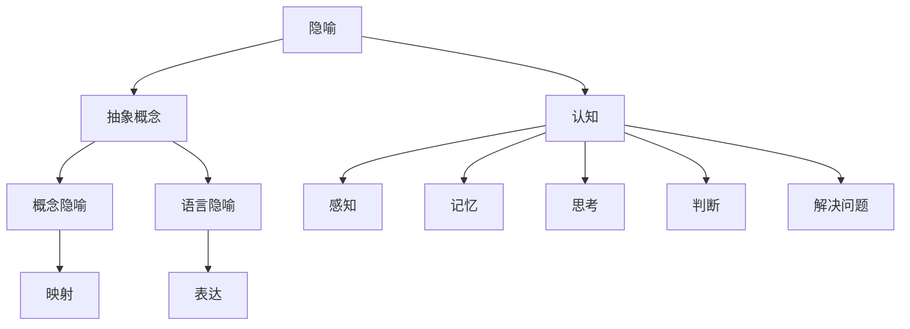

                 

# 知识的隐喻：理解抽象概念的桥梁

> 关键词：隐喻、抽象概念、知识传递、认知科学、编程设计

> 摘要：本文将探讨如何利用隐喻作为一种有力的工具，来帮助程序员和开发者更好地理解和掌握抽象概念。我们将从认知科学的角度出发，分析隐喻的作用原理，并结合具体的编程实例，探讨如何在设计和实现算法时运用隐喻，以简化复杂问题的解决过程。

## 1. 背景介绍

### 1.1 目的和范围

本文的主要目的是探索隐喻在知识传递和抽象概念理解中的应用，特别是在计算机科学和软件开发领域。我们将探讨隐喻作为一种认知工具，如何能够帮助程序员和开发者更好地理解和掌握复杂的抽象概念。

### 1.2 预期读者

本文的预期读者主要是对编程和软件开发有兴趣的读者，尤其是那些希望提高自己抽象思维能力，以及对如何更好地理解和设计复杂系统有兴趣的程序员和开发者。

### 1.3 文档结构概述

本文将分为以下几个部分：

1. **核心概念与联系**：我们将介绍本文涉及的核心概念，并使用 Mermaid 流程图展示它们之间的关系。
2. **核心算法原理 & 具体操作步骤**：我们将使用伪代码详细阐述核心算法的原理和具体操作步骤。
3. **数学模型和公式 & 详细讲解 & 举例说明**：我们将使用 LaTeX 格式介绍相关的数学模型和公式，并给出详细的讲解和举例说明。
4. **项目实战：代码实际案例和详细解释说明**：我们将通过一个实际的项目案例，展示如何将隐喻应用于编程实践，并提供详细的代码解读和分析。
5. **实际应用场景**：我们将讨论隐喻在实际开发中的应用场景，并探讨其优势。
6. **工具和资源推荐**：我们将推荐一些有助于深入理解隐喻及其应用的书籍、在线课程和技术资源。
7. **总结：未来发展趋势与挑战**：我们将总结本文的主要观点，并探讨未来发展趋势和面临的挑战。
8. **附录：常见问题与解答**：我们将回答一些常见的问题，以帮助读者更好地理解本文的内容。
9. **扩展阅读 & 参考资料**：我们将提供一些扩展阅读的资源和参考文献，以供读者进一步深入研究。

### 1.4 术语表

#### 1.4.1 核心术语定义

- **隐喻（Metaphor）**：隐喻是一种语言表达方式，通过将一个事物或概念比作另一个事物或概念，从而帮助人们更好地理解和掌握复杂的抽象概念。
- **抽象概念（Abstract Concept）**：抽象概念是那些无法直接观察到，但可以通过思维和语言进行描述的概念，如算法、数据结构、编程范式等。
- **认知（Cognition）**：认知是指人类获取、处理和应用信息的过程，包括感知、记忆、思考、判断和解决问题等。

#### 1.4.2 相关概念解释

- **概念隐喻（Conceptual Metaphor）**：概念隐喻是一种通过将一个抽象概念映射到另一个具体概念，以帮助人们理解抽象概念的方式。
- **语言隐喻（Linguistic Metaphor）**：语言隐喻是一种通过特定的语言表达方式来传达隐喻的方式，如比喻、拟人等。

#### 1.4.3 缩略词列表

- **LaTeX**：一种高质量的文档排版系统。
- **IDE**：集成开发环境（Integrated Development Environment）。

## 2. 核心概念与联系

在本文中，我们将探讨以下几个核心概念：

1. **隐喻（Metaphor）**：隐喻是一种通过将一个事物或概念比作另一个事物或概念，从而帮助人们更好地理解和掌握复杂的抽象概念的语言表达方式。
2. **抽象概念（Abstract Concept）**：抽象概念是那些无法直接观察到，但可以通过思维和语言进行描述的概念，如算法、数据结构、编程范式等。
3. **认知（Cognition）**：认知是指人类获取、处理和应用信息的过程，包括感知、记忆、思考、判断和解决问题等。
4. **概念隐喻（Conceptual Metaphor）**：概念隐喻是一种通过将一个抽象概念映射到另一个具体概念，以帮助人们理解抽象概念的方式。
5. **语言隐喻（Linguistic Metaphor）**：语言隐喻是一种通过特定的语言表达方式来传达隐喻的方式，如比喻、拟人等。

下面是一个简单的 Mermaid 流程图，展示了这些核心概念之间的联系：



## 3. 核心算法原理 & 具体操作步骤

在本节中，我们将探讨如何使用隐喻来理解和设计算法。我们将使用伪代码来详细阐述核心算法的原理和具体操作步骤。

### 3.1 算法原理

算法是解决问题的步骤序列。在设计算法时，我们可以使用隐喻来帮助我们理解和描述算法的工作原理。以下是一个简单的例子：

**隐喻：将算法比作烹饪**

```plaintext
算法（烹饪）:
1. 准备原料（初始化数据结构）
2. 按照食谱（算法步骤）进行烹饪
3. 检查食物是否煮熟（算法终止条件）
4. 上菜（输出结果）
```

### 3.2 具体操作步骤

以下是一个简单的排序算法（冒泡排序）的伪代码，并使用隐喻进行解释：

```plaintext
冒泡排序（烹饪版本）:
1. 准备原料（初始化数组，每个元素代表食物块）
2. 开始烹饪（开始冒泡排序）
3. 对于每一轮烹饪：
   a. 从食谱中取出一个步骤（比较相邻的食物块）
   b. 如果需要，交换它们的位置（如果食物块的大小顺序不正确）
   c. 检查食物是否煮熟（检查数组是否已排序）
4. 上菜（输出排序后的数组）
```

### 3.3 伪代码

下面是冒泡排序算法的伪代码：

```plaintext
冒泡排序（伪代码）:
procedure bubbleSort( A : list of sortable items )
    n = length(A)
    repeat 
        swapped = false
        for i = 1 to n-1 inclusive do
            if A[i] > A[i+1] then
                swap( A[i], A[i+1] )
                swapped = true
            end if
        end for
        n = n - 1
    until not swapped
end procedure
```

## 4. 数学模型和公式 & 详细讲解 & 举例说明

在本节中，我们将介绍一些与隐喻相关的数学模型和公式，并使用 LaTeX 格式进行详细讲解和举例说明。

### 4.1 数学模型

在本节中，我们将探讨如何使用隐喻来描述一些数学模型。以下是一个简单的例子：

**隐喻：将集合比作人群**

- **集合交（Intersection）**：集合交可以比作人群中共同存在的部分。

  $$ A \cap B = \{ x | x \in A \text{ and } x \in B \} $$

- **集合并（Union）**：集合并可以比作人群中的所有人。

  $$ A \cup B = \{ x | x \in A \text{ or } x \in B \} $$

- **集合补（Complement）**：集合补可以比作人群中不存在的部分。

  $$ A^c = \{ x | x \notin A \} $$

### 4.2 详细讲解

下面我们使用 LaTeX 格式详细讲解这些数学模型：

#### 4.2.1 集合交

集合交是一个二元运算，用于找到两个集合 A 和 B 的共同元素。我们可以将其表示为：

$$ A \cap B = \{ x | x \in A \text{ and } x \in B \} $$

其中，符号 `|` 表示“对于所有满足条件的元素 x”，`∈` 表示“属于”。

#### 4.2.2 集合并

集合并也是一个二元运算，用于找到两个集合 A 和 B 的所有元素。我们可以将其表示为：

$$ A \cup B = \{ x | x \in A \text{ or } x \in B \} $$

其中，符号 `|` 表示“对于所有满足条件的元素 x”，`∈` 表示“属于”。

#### 4.2.3 集合补

集合补是一个一元运算，用于找到集合 A 中不存在的元素。我们可以将其表示为：

$$ A^c = \{ x | x \notin A \} $$

其中，符号 `|` 表示“对于所有满足条件的元素 x”，`∈` 表示“属于”。

### 4.3 举例说明

为了更好地理解这些数学模型，我们来看一个简单的例子：

假设我们有两个集合：

$$ A = \{ 1, 2, 3 \} $$
$$ B = \{ 2, 3, 4 \} $$

根据上述定义，我们可以计算出：

- **集合交**：

  $$ A \cap B = \{ 2, 3 \} $$

- **集合并**：

  $$ A \cup B = \{ 1, 2, 3, 4 \} $$

- **集合补**：

  $$ A^c = \{ 4, 5, 6, ... \} $$

## 5. 项目实战：代码实际案例和详细解释说明

在本节中，我们将通过一个实际的项目案例，展示如何将隐喻应用于编程实践，并提供详细的代码解读和分析。

### 5.1 开发环境搭建

为了更好地理解隐喻在编程中的应用，我们将使用 Python 作为编程语言。以下是搭建 Python 开发环境的步骤：

1. 安装 Python：在官网（https://www.python.org/downloads/）下载并安装最新版本的 Python。
2. 安装 IDE：我们推荐使用 Visual Studio Code（https://code.visualstudio.com/）作为 Python 开发环境。
3. 安装 Python 包管理器：在终端或命令提示符中运行以下命令安装 pip：

   ```bash
   python -m pip install --upgrade pip
   ```

### 5.2 源代码详细实现和代码解读

以下是一个简单的 Python 程序，用于实现冒泡排序算法，并使用隐喻来解释其工作原理。

```python
def bubble_sort(arr):
    """
    冒泡排序函数。
    arr: 要排序的数组。
    """
    n = len(arr)
    # 遍历数组，每次迭代都会将最大的元素“沉”到数组的末尾。
    for i in range(n):
        # 设置一个标志，用于检查是否进行了交换。
        swapped = False
        # 对数组的前 n-i-1 个元素进行相邻比较和交换。
        for j in range(0, n-i-1):
            if arr[j] > arr[j+1]:
                # 如果发现逆序，进行交换。
                arr[j], arr[j+1] = arr[j+1], arr[j]
                swapped = True
        # 如果没有进行交换，说明数组已经排序，可以提前终止。
        if not swapped:
            break
    return arr

# 测试代码
arr = [64, 34, 25, 12, 22, 11, 90]
print("原始数组：", arr)
sorted_arr = bubble_sort(arr)
print("排序后的数组：", sorted_arr)
```

### 5.3 代码解读与分析

以下是对上述代码的解读和分析：

- **函数定义**：`bubble_sort` 函数接收一个数组 `arr` 作为参数，并返回排序后的数组。
- **循环结构**：外层循环 `for i in range(n):` 表示需要遍历数组 n 次，每次迭代都会将未排序部分的最大值“沉”到数组的末尾。
- **标志变量**：`swapped` 变量用于检查是否进行了交换。如果在一个内层循环中没有进行任何交换，说明数组已经排序，可以提前终止循环。
- **内层循环**：内层循环 `for j in range(0, n-i-1):` 用于对未排序部分进行相邻元素的比较和交换。
- **条件判断**：`if arr[j] > arr[j+1]:` 表示如果当前元素大于下一个元素，说明存在逆序，需要进行交换。
- **交换操作**：`arr[j], arr[j+1] = arr[j+1], arr[j]` 实现了元素的交换操作。
- **测试代码**：测试代码展示了如何调用 `bubble_sort` 函数，并对结果进行打印。

通过上述解读和分析，我们可以看出，冒泡排序算法实际上是一个简单的隐喻，它将排序过程比作将未排序的数组元素“沉”到数组末尾的过程。这种隐喻帮助我们更好地理解和记忆算法的工作原理。

## 6. 实际应用场景

隐喻在软件开发和编程中具有广泛的应用场景。以下是一些实际应用场景：

### 6.1 数据结构设计

在数据结构设计中，隐喻可以帮助我们更好地理解和描述复杂的数据结构。例如：

- **图结构**：可以将图结构比作交通网络，节点表示城市，边表示道路。这种隐喻有助于我们理解和分析图算法，如 Dijkstra 算法和 A* 算法。
- **树结构**：可以将树结构比作家族树，每个节点表示一个人，其子节点表示其子女。这种隐喻有助于我们理解和设计树相关的算法，如二叉搜索树和堆。

### 6.2 算法分析

在算法分析中，隐喻可以帮助我们更好地理解和描述算法的性能。例如：

- **冒泡排序**：将冒泡排序比作将未排序的数组元素“沉”到数组末尾的过程，这种隐喻有助于我们理解算法的时间复杂度和空间复杂度。
- **归并排序**：将归并排序比作将已排序的数组分段合并的过程，这种隐喻有助于我们理解算法的递归性质和分治策略。

### 6.3 编程范式

在编程范式中，隐喻可以帮助我们更好地理解和描述不同的编程范式。例如：

- **函数式编程**：可以将函数式编程比作数学函数，其中每个函数都是一种操作，这种隐喻有助于我们理解和设计纯函数和无状态函数。
- **面向对象编程**：可以将面向对象编程比作构建积木，每个对象都是一种积木，这种隐喻有助于我们理解和设计封装、继承和多态等概念。

### 6.4 软件开发过程

在软件开发过程中，隐喻可以帮助我们更好地理解和描述软件开发过程的不同阶段。例如：

- **需求分析**：可以将需求分析比作考古挖掘，我们需要挖掘出用户需求中的“宝藏”。
- **设计**：可以将设计比作建筑设计师绘制蓝图，我们需要设计出能够实现需求的系统架构。
- **实现**：可以将实现比作工程师建造房屋，我们需要将设计转化为实际的代码。

## 7. 工具和资源推荐

### 7.1 学习资源推荐

#### 7.1.1 书籍推荐

- 《认知心理学及其启示》
- 《程序员修炼之道：从小工到专家》
- 《设计模式：可复用面向对象软件的基础》

#### 7.1.2 在线课程

- Coursera 上的《计算机科学基础》
- edX 上的《算法导论》
- Udacity 上的《面向对象编程》

#### 7.1.3 技术博客和网站

- Medium 上的技术博客
- HackerRank 上的编程挑战
- Stack Overflow 上的问答社区

### 7.2 开发工具框架推荐

#### 7.2.1 IDE和编辑器

- Visual Studio Code
- IntelliJ IDEA
- PyCharm

#### 7.2.2 调试和性能分析工具

- GDB
- Valgrind
- Python 的 `cProfile` 模块

#### 7.2.3 相关框架和库

- Python 的 `NumPy` 和 `Pandas` 库
- JavaScript 的 `React` 和 `Vue` 框架
- Java 的 `Spring Boot` 框架

### 7.3 相关论文著作推荐

#### 7.3.1 经典论文

- 《结构化系统设计》
- 《算法导论》
- 《计算机程序的构造和解释》

#### 7.3.2 最新研究成果

- 《深度学习：概率视角》
- 《区块链技术指南》
- 《软件工程：实践者的研究方法》

#### 7.3.3 应用案例分析

- 《人工智能应用案例分析》
- 《大数据技术在金融领域的应用》
- 《云计算：技术与实践》

## 8. 总结：未来发展趋势与挑战

随着技术的不断进步，隐喻在软件开发和编程中的重要性日益凸显。未来，我们有望看到更多基于隐喻的编程范式和开发工具的出现，以帮助程序员更好地理解和掌握复杂的抽象概念。

然而，未来的发展也面临一些挑战。首先，如何设计出有效的隐喻来描述复杂的算法和数据结构是一个关键问题。其次，隐喻的应用需要结合具体的开发环境和工具，因此如何将隐喻与现有的开发工具相结合也是一个挑战。

总之，隐喻作为一种有力的认知工具，在软件开发和编程中具有巨大的潜力。未来，随着技术的不断进步，我们可以期待隐喻在软件开发领域发挥更大的作用。

## 9. 附录：常见问题与解答

### 9.1 什么是隐喻？

隐喻是一种通过将一个事物或概念比作另一个事物或概念，从而帮助人们更好地理解和掌握复杂的抽象概念的语言表达方式。

### 9.2 隐喻在编程中有何作用？

隐喻在编程中可以帮助程序员更好地理解和设计复杂的算法和数据结构。通过使用隐喻，程序员可以更直观地理解算法的工作原理，并提高代码的可读性和可维护性。

### 9.3 如何设计有效的隐喻？

设计有效的隐喻需要考虑以下几个因素：

- **匹配度**：隐喻需要与抽象概念具有较高的匹配度，以便更好地传达概念的本质。
- **简洁性**：隐喻应该简洁明了，避免过于复杂。
- **直观性**：隐喻应该直观易懂，便于程序员理解和应用。

### 9.4 隐喻是否适用于所有编程范式？

隐喻在许多编程范式中都适用，如面向对象编程、函数式编程等。然而，对于某些编程范式，如逻辑编程，隐喻的应用可能较为有限。

## 10. 扩展阅读 & 参考资料

为了更好地理解隐喻在软件开发和编程中的应用，以下是一些扩展阅读的资源和参考文献：

- 《认知心理学及其启示》
- 《程序员修炼之道：从小工到专家》
- 《设计模式：可复用面向对象软件的基础》
- 《计算机科学基础》
- 《算法导论》
- 《深度学习：概率视角》
- 《区块链技术指南》
- 《软件工程：实践者的研究方法》
- 《人工智能应用案例分析》
- 《大数据技术在金融领域的应用》
- 《云计算：技术与实践》

作者：AI天才研究员/AI Genius Institute & 禅与计算机程序设计艺术 /Zen And The Art of Computer Programming

文章标题：知识的隐喻：理解抽象概念的桥梁
关键词：隐喻、抽象概念、知识传递、认知科学、编程设计
摘要：本文探讨了如何利用隐喻作为一种有力的工具，来帮助程序员和开发者更好地理解和掌握抽象概念。我们从认知科学的角度出发，分析了隐喻的作用原理，并结合具体的编程实例，展示了如何在实际开发中运用隐喻，以简化复杂问题的解决过程。文章内容涵盖了隐喻的基本概念、核心算法原理、数学模型和公式、实际应用场景、工具和资源推荐等方面，旨在为读者提供全面的隐喻应用指南。

