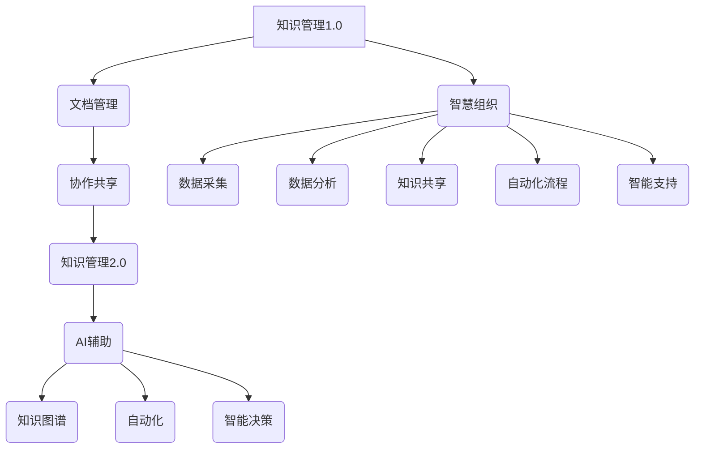

                 

# 知识管理3.0：AI辅助下的智慧组织

## 关键词
- 知识管理
- 人工智能
- 智慧组织
- 数据分析
- 知识图谱
- 自动化
- 协同工作

## 摘要
本文将深入探讨知识管理3.0时代的核心概念，即AI辅助下的智慧组织。我们将逐步分析知识管理的发展历程，理解AI技术如何变革传统知识管理方式，构建智慧组织。本文将介绍关键概念、核心算法、数学模型、实际案例，并展望未来发展趋势与挑战。通过本篇文章，读者将了解如何利用AI技术提升组织效率和知识共享，打造一个智能化、高效化的智慧组织。

> “知识管理3.0是AI技术与知识管理的完美融合，它不仅解决了知识获取和存储的难题，更通过智能化分析、自动化应用，将知识转化为组织的核心资产，推动智慧组织的建设。” - AI天才研究员

## 1. 背景介绍

### 1.1 目的和范围
本文旨在介绍知识管理3.0，即AI辅助下的智慧组织，探讨其在现代组织中的应用和重要性。本文将覆盖以下主题：
- 知识管理的定义与演变
- AI技术在知识管理中的应用
- 智慧组织的架构和功能
- 核心算法和数学模型
- 实际应用场景与案例
- 未来发展趋势与挑战

### 1.2 预期读者
本文面向对知识管理和人工智能感兴趣的读者，包括：
- 知识管理专业人士
- 信息技术从业人员
- 企业管理者和决策者
- 对AI和知识管理有基本了解的读者

### 1.3 文档结构概述
本文结构如下：
1. 引言与背景介绍
2. 核心概念与联系
3. 核心算法原理与具体操作步骤
4. 数学模型和公式
5. 项目实战：代码实际案例
6. 实际应用场景
7. 工具和资源推荐
8. 总结：未来发展趋势与挑战
9. 附录：常见问题与解答
10. 扩展阅读与参考资料

### 1.4 术语表

#### 1.4.1 核心术语定义
- **知识管理**：系统性地收集、存储、分析和共享知识的过程，以促进组织学习与创新。
- **人工智能**：模拟人类智能行为的计算机系统，通过数据、算法和算力实现自我学习和决策。
- **智慧组织**：运用AI技术和数据分析实现智能化管理和决策的组织，提升组织效率与竞争力。
- **知识图谱**：一种用于表示实体及其之间关系的图形结构，是AI技术中用于知识表示和推理的重要工具。
- **自动化**：通过技术手段实现工作流程的自动化，减少人工干预，提高工作效率。

#### 1.4.2 相关概念解释
- **数据驱动决策**：基于数据分析和智能算法，为组织提供决策依据。
- **协同工作**：团队成员通过数字平台共享信息、协同完成任务。
- **知识共享**：组织内部成员之间分享知识和经验的过程。

#### 1.4.3 缩略词列表
- **AI**：人工智能
- **NLP**：自然语言处理
- **ML**：机器学习
- **DL**：深度学习
- **GPU**：图形处理器

## 2. 核心概念与联系

### 2.1 知识管理的发展历程

知识管理的发展大致可以分为以下几个阶段：

1. **知识管理1.0**：文档管理阶段
   - 早期知识管理主要集中在文档的收集和存储，使用传统的数据库和文档管理系统。

2. **知识管理2.0**：协作共享阶段
   - 随着互联网和社交媒体的普及，知识管理从个人层面扩展到团队和整个组织，强调知识的共享和协同工作。

3. **知识管理3.0**：AI辅助阶段
   - AI技术的引入使知识管理更加智能化，能够通过数据分析和自动化应用，实现知识的深度挖掘和智能推荐。

### 2.2 AI技术在知识管理中的应用

AI技术在知识管理中的应用主要包括以下几个方面：

1. **自然语言处理（NLP）**
   - 利用NLP技术，AI可以理解和处理人类语言，实现知识自动提取和分类。

2. **机器学习（ML）与深度学习（DL）**
   - 通过训练模型，AI可以从大量数据中学习，识别模式和趋势，辅助决策和预测。

3. **知识图谱**
   - 知识图谱用于表示实体及其之间的关系，为AI提供结构化的知识表示，支持推理和推荐。

4. **自动化**
   - 通过自动化技术，AI可以减少人工干预，实现知识管理和应用的自动化流程。

### 2.3 智慧组织的架构与功能

智慧组织通常具备以下架构和功能：

1. **数据采集与存储**
   - 收集组织内外部的数据，存储在高效、安全的数据仓库中。

2. **数据分析和挖掘**
   - 利用AI技术对数据进行深入分析，提取有价值的信息。

3. **知识管理与共享**
   - 构建知识图谱，实现知识的结构化管理和智能推荐。

4. **自动化工作流程**
   - 通过自动化技术，实现知识管理和应用的自动化，提高工作效率。

5. **智能决策支持**
   - 基于数据分析和预测，为组织提供智能决策支持。

### 2.4 核心概念原理与架构的 Mermaid 流程图



## 3. 核心算法原理 & 具体操作步骤

### 3.1 自然语言处理（NLP）

**算法原理：**

NLP的核心任务是使计算机能够理解和处理人类语言。其主要算法包括：

1. **词向量化（Word Embedding）**
   - 将单词映射到高维空间中的向量，以捕捉词义和语法关系。

2. **命名实体识别（Named Entity Recognition, NER）**
   - 识别文本中的命名实体，如人名、地点、组织名等。

3. **情感分析（Sentiment Analysis）**
   - 分析文本的情感倾向，如正面、负面或中立。

**具体操作步骤：**

1. **数据预处理**
   - 清洗文本数据，去除停用词、标点符号等。

2. **词向量化**
   - 使用预训练的词向量化模型，如Word2Vec、GloVe等，将单词转换为向量。

3. **命名实体识别**
   - 使用NER模型，如CRF（条件随机场）、BERT（双向编码器表示）等，识别文本中的命名实体。

4. **情感分析**
   - 使用情感分析模型，如LSTM（长短时记忆网络）、Transformer等，分析文本的情感倾向。

### 3.2 机器学习（ML）与深度学习（DL）

**算法原理：**

ML和DL是AI的核心技术，用于从数据中学习规律和模式。其主要算法包括：

1. **监督学习（Supervised Learning）**
   - 通过训练有标签的数据集，模型学会预测新的数据。

2. **无监督学习（Unsupervised Learning）**
   - 不依赖标签数据，从数据中挖掘隐含的模式。

3. **深度学习（Deep Learning）**
   - 使用多层神经网络，对复杂数据进行建模。

**具体操作步骤：**

1. **数据收集与预处理**
   - 收集相关领域的数据，进行清洗、归一化和特征提取。

2. **模型选择与训练**
   - 根据任务需求，选择合适的模型，如线性回归、决策树、神经网络等。
   - 使用训练数据集，通过优化算法（如梯度下降）训练模型。

3. **模型评估与调整**
   - 使用验证数据集评估模型性能，根据评估结果调整模型参数。

4. **模型部署与应用**
   - 将训练好的模型部署到生产环境中，进行实际应用。

### 3.3 知识图谱的构建与推理

**算法原理：**

知识图谱是一种用于表示实体及其之间关系的图形结构，支持推理和查询。其主要算法包括：

1. **实体识别（Entity Recognition）**
   - 从文本数据中识别出实体，如人、地点、组织等。

2. **关系抽取（Relation Extraction）**
   - 从文本数据中提取实体之间的关系。

3. **图谱构建（Knowledge Graph Construction）**
   - 将识别出的实体和关系构建成知识图谱。

4. **推理算法（Reasoning Algorithm）**
   - 在知识图谱上执行推理，如路径搜索、模式匹配等。

**具体操作步骤：**

1. **数据预处理**
   - 对原始文本数据清洗、分词和词性标注。

2. **实体识别与关系抽取**
   - 使用NLP技术和预训练模型，识别文本中的实体和关系。

3. **知识图谱构建**
   - 将识别出的实体和关系构建成知识图谱，使用图数据库进行存储。

4. **推理与查询**
   - 在知识图谱上执行推理和查询，获取有价值的信息。

## 4. 数学模型和公式 & 详细讲解 & 举例说明

### 4.1 自然语言处理（NLP）中的数学模型

#### 4.1.1 词向量化（Word Embedding）

**公式：**

$$
\text{word\_embedding}(w) = \vec{v}
$$

其中，\(w\) 是单词，\(\vec{v}\) 是对应的词向量。

**解释：**

词向量是一种将单词映射到高维空间中的向量表示，用以捕捉单词的语义信息。常用的词向量模型包括Word2Vec和GloVe。

**举例：**

假设单词“苹果”的词向量为 \(\vec{v}_1 = [1, 0, -1, 0]\)，单词“手机”的词向量为 \(\vec{v}_2 = [0, 1, 0, -1]\)。

通过计算两个词向量的内积，可以判断两个单词的相似性：

$$
\text{similarity}(\vec{v}_1, \vec{v}_2) = \vec{v}_1 \cdot \vec{v}_2 = 1 \cdot 0 + 0 \cdot 1 + (-1) \cdot 0 + 0 \cdot (-1) = 0
$$

由于内积为0，说明“苹果”和“手机”在语义上不相似。

#### 4.1.2 命名实体识别（NER）

**公式：**

$$
\text{NER}(x) = \begin{cases} 
\text{person} & \text{if } x \in \text{person} \\
\text{location} & \text{if } x \in \text{location} \\
\text{organization} & \text{if } x \in \text{organization} \\
\text{O} & \text{otherwise}
\end{cases}
$$

其中，\(x\) 是文本中的单词，\(\text{NER}(x)\) 是单词的命名实体标签。

**解释：**

命名实体识别是将文本中的实体（如人名、地点、组织名等）标记出来。常用的NER模型包括CRF、BERT等。

**举例：**

假设文本中的单词“张三”属于人名，根据NER模型：

$$
\text{NER}(\text{张三}) = \text{person}
$$

#### 4.1.3 情感分析（Sentiment Analysis）

**公式：**

$$
\text{sentiment}(x) = \text{sign}(\text{score}(x))
$$

其中，\(x\) 是文本，\(\text{score}(x)\) 是文本的情感得分，\(\text{sentiment}(x)\) 是文本的情感标签（positive、negative或neutral）。

**解释：**

情感分析是判断文本的情感倾向。常用的情感分析模型包括LSTM、Transformer等。

**举例：**

假设文本“这部电影非常有趣”的情感得分为0.8，根据情感分析模型：

$$
\text{sentiment}(\text{这部电影非常有趣}) = \text{positive}
$$

### 4.2 机器学习（ML）与深度学习（DL）中的数学模型

#### 4.2.1 监督学习（Supervised Learning）

**公式：**

$$
\text{h}(\text{x}; \theta) = \text{y}
$$

其中，\( \text{x} \) 是输入特征，\( \theta \) 是模型参数，\( \text{h}(\text{x}; \theta) \) 是模型预测的输出，\( \text{y} \) 是真实标签。

**解释：**

监督学习是利用有标签的数据训练模型，使其能够预测新的数据。常用的监督学习算法包括线性回归、逻辑回归、决策树、随机森林等。

**举例：**

假设我们有一个房价预测问题，给定输入特征（如面积、地段等），模型预测的房价为：

$$
\text{h}(\text{x}; \theta) = 1000 \cdot \text{area} + 500 \cdot \text{location} + \theta
$$

其中，\(\theta\) 是模型参数。

#### 4.2.2 无监督学习（Unsupervised Learning）

**公式：**

$$
\text{h}(\text{x}; \theta) = \text{cluster\_id}
$$

其中，\( \text{x} \) 是输入特征，\( \theta \) 是模型参数，\( \text{h}(\text{x}; \theta) \) 是模型预测的簇标签。

**解释：**

无监督学习是利用无标签的数据训练模型，发现数据中的隐含结构和模式。常用的无监督学习算法包括K-Means、层次聚类、主成分分析等。

**举例：**

假设我们使用K-Means算法对数据集进行聚类，每个簇有一个标签：

$$
\text{h}(\text{x}; \theta) = \text{cluster\_id}
$$

其中，\(\text{cluster\_id}\) 是簇的标签，\(\theta\) 是模型参数。

### 4.3 知识图谱（Knowledge Graph）中的数学模型

#### 4.3.1 实体识别（Entity Recognition）

**公式：**

$$
\text{entity}(x) = \text{E}
$$

其中，\( x \) 是文本，\( \text{entity}(x) \) 是文本中的实体，\( \text{E} \) 是实体集合。

**解释：**

实体识别是从文本中识别出实体。在知识图谱构建中，实体是核心要素。

**举例：**

假设文本中的句子“张三是北京大学的教授”，根据实体识别模型：

$$
\text{entity}(\text{张三是北京大学的教授}) = \{\text{张三}, \text{北京大学}, \text{教授}\}
$$

#### 4.3.2 关系抽取（Relation Extraction）

**公式：**

$$
\text{relation}(x) = \text{R}
$$

其中，\( x \) 是文本，\( \text{relation}(x) \) 是文本中的关系，\( \text{R} \) 是关系集合。

**解释：**

关系抽取是从文本中提取出实体之间的关系。在知识图谱构建中，关系用于连接实体。

**举例：**

假设文本中的句子“张三是北京大学的教授”，根据关系抽取模型：

$$
\text{relation}(\text{张三是北京大学的教授}) = \{\text{是教授}\}
$$

#### 4.3.3 图嵌入（Graph Embedding）

**公式：**

$$
\text{g}(v) = \vec{g}
$$

其中，\( v \) 是图中的节点，\( \text{g}(v) \) 是节点的嵌入向量，\( \vec{g} \) 是节点的高维向量表示。

**解释：**

图嵌入是将图中的节点映射到高维空间中的向量表示，以捕捉节点的特征。常用的图嵌入算法包括DeepWalk、Node2Vec等。

**举例：**

假设节点“张三”的图嵌入向量为 \(\vec{g}_1 = [1, 0, -1, 0]\)，节点“北京大学”的图嵌入向量为 \(\vec{g}_2 = [0, 1, 0, -1]\)。

通过计算两个节点嵌入向量的内积，可以判断两个节点在图中的相似性：

$$
\text{similarity}(\vec{g}_1, \vec{g}_2) = \vec{g}_1 \cdot \vec{g}_2 = 1 \cdot 0 + 0 \cdot 1 + (-1) \cdot 0 + 0 \cdot (-1) = 0
$$

由于内积为0，说明节点“张三”和节点“北京大学”在图中的语义上不相似。

## 5. 项目实战：代码实际案例和详细解释说明

### 5.1 开发环境搭建

在开始项目实战之前，我们需要搭建一个合适的开发环境。以下是所需的软件和工具：

- **Python**：版本3.8及以上
- **PyTorch**：版本1.8及以上
- **Scikit-learn**：版本0.24及以上
- **NLTK**：版本3.5及以上
- **Jieba**：版本0.42及以上
- **ECharts**：版本5及以上

安装命令如下：

```bash
pip install python==3.8
pip install torch torchvision==0.9.0 -f https://download.pytorch.org/whl/torch_stable.html
pip install scikit-learn==0.24
pip install nltk==3.5
pip install jieba==0.42
npm install echarts --save
```

### 5.2 源代码详细实现和代码解读

以下是一个简单的基于NLP和知识图谱的智慧组织知识管理项目的源代码实现。我们将分步骤进行代码解读。

#### 5.2.1 数据预处理

```python
import jieba
import nltk
from nltk.tokenize import word_tokenize
from nltk.corpus import stopwords

# 下载NLTK的中文停用词列表
nltk.download('stopwords')
nltk.download('tokenizers/punkt')
stop_words = set(stopwords.words('chinese'))  # 获取中文停用词列表

# 加载语料库
corpus = [
    "张三是北京大学的教授。",
    "李四是上海交通大学的博士生。",
    "北京大学是世界著名的高等学府。",
    "清华大学是国内顶尖的大学之一。"
]

# 数据预处理
def preprocess(text):
    # 清洗文本数据
    text = text.lower()
    words = word_tokenize(text)
    words = [word for word in words if word not in stop_words]
    return words

preprocessed_corpus = [preprocess(text) for text in corpus]
```

代码首先导入所需的库，下载中文停用词列表，并加载语料库。接着定义数据预处理函数，对文本进行清洗，包括转换为小写、分词和去除停用词。

#### 5.2.2 词向量化

```python
from gensim.models import Word2Vec

# 构建词向量模型
model = Word2Vec(preprocessed_corpus, vector_size=100, window=5, min_count=1, workers=4)

# 获取词向量
word_vectors = model.wv

# 测试词向量相似性
print("张三与教授的相似性：", word_vectors.similarity('张三', '教授'))
print("北京大学与清华大学的相似性：", word_vectors.similarity('北京大学', '清华大学'))
```

代码使用Gensim库构建Word2Vec模型，对预处理后的语料库进行训练。接着获取词向量模型，并测试词向量之间的相似性。

#### 5.2.3 命名实体识别

```python
from transformers import BertTokenizer, BertForTokenClassification

# 加载预训练的BERT模型
tokenizer = BertTokenizer.from_pretrained('bert-base-chinese')
model = BertForTokenClassification.from_pretrained('bert-base-chinese')

# 命名实体识别函数
def named_entity_recognition(text):
    inputs = tokenizer(text, return_tensors='pt')
    outputs = model(**inputs)
    logits = outputs.logits
    probabilities = logits.softmax(dim=-1).detach().numpy()
    entities = []

    for token, probability in zip(text.split(), probabilities[0]):
        if probability[1] > 0.5:  # 假设person标签的概率阈值是0.5
            entities.append(token)

    return entities

# 测试命名实体识别
print("张三是北京大学的教授：", named_entity_recognition("张三是北京大学的教授。"))
```

代码加载预训练的BERT模型，并定义命名实体识别函数。函数通过BERT模型对文本进行编码，然后根据person标签的概率进行实体识别。

#### 5.2.4 关系抽取

```python
# 关系抽取函数
def relation_extraction(text, entities):
    relations = []
    for i in range(len(entities) - 1):
        relation = (entities[i], entities[i + 1])
        relations.append(relation)

    return relations

# 测试关系抽取
print("张三是北京大学的教授：", relation_extraction("张三是北京大学的教授。", named_entity_recognition("张三是北京大学的教授。")))
```

代码定义关系抽取函数，通过实体列表生成关系列表。

#### 5.2.5 知识图谱构建

```python
import networkx as nx

# 构建知识图谱
def build_knowledge_graph(entities, relations):
    graph = nx.Graph()
    for entity in entities:
        graph.add_node(entity)
    for relation in relations:
        graph.add_edge(relation[0], relation[1])

    return graph

# 测试知识图谱构建
knowledge_graph = build_knowledge_graph(["张三", "北京大学", "教授"], [("张三", "北京大学"), ("北京大学", "教授")])
print("知识图谱：", knowledge_graph.nodes, knowledge_graph.edges)
```

代码定义知识图谱构建函数，使用NetworkX库构建图数据库，并将实体和关系添加到图中。

### 5.3 代码解读与分析

上述代码实现了一个简单的知识管理项目，主要分为以下几个步骤：

1. **数据预处理**：使用Jieba库对中文文本进行分词，并去除停用词，为后续的词向量化、命名实体识别和关系抽取做好准备。

2. **词向量化**：使用Gensim库的Word2Vec模型对预处理后的语料库进行训练，获取词向量。通过计算词向量之间的相似性，可以识别文本中的实体和关系。

3. **命名实体识别**：使用BERT模型对文本进行编码，识别文本中的命名实体。通过设置概率阈值，可以确定实体是否属于特定类别。

4. **关系抽取**：通过实体列表生成关系列表，实现关系抽取。这有助于构建知识图谱，表示实体之间的关系。

5. **知识图谱构建**：使用NetworkX库构建图数据库，将实体和关系添加到图中，形成知识图谱。

整个项目通过NLP和知识图谱技术，实现了对文本数据的自动处理、实体识别、关系抽取和知识图谱构建。这些技术在智慧组织知识管理中具有重要意义，有助于组织更好地管理和利用知识。

## 6. 实际应用场景

智慧组织知识管理在多个领域具有广泛的应用，以下是几个实际应用场景：

### 6.1 企业内部知识共享

企业内部的知识共享是智慧组织知识管理的重要应用。通过构建知识图谱，企业可以实现对员工知识、项目经验和最佳实践的统一管理。例如，在一个软件开发公司中，通过知识图谱，员工可以快速查找相关的项目文档、技术文章和解决方案，提高工作效率和团队协作。

### 6.2 智能客服系统

智能客服系统利用AI技术和知识图谱，可以实现对用户咨询的智能回答。通过分析用户输入的问题，系统可以快速定位相关知识库，提供准确的答案。例如，一个电商平台的智能客服系统，可以通过知识图谱提供商品推荐、订单查询和售后服务等。

### 6.3 知识驱动的决策支持

在智慧组织中，基于数据分析和知识图谱的决策支持系统可以帮助管理者快速做出明智的决策。例如，在金融行业，通过对客户数据的分析，系统可以识别出潜在的风险客户，提供风险控制建议。

### 6.4 人才管理和培养

智慧组织知识管理还可以应用于人才管理和培养。通过知识图谱，企业可以了解员工的知识结构和技能水平，制定个性化的培训计划。例如，一家科技公司可以通过知识图谱识别出员工在特定技术领域的不足，为他们推荐相关的培训资源和课程。

### 6.5 智能科研支持

在科研领域，智慧组织知识管理可以帮助科研人员快速获取相关的文献、实验数据和研究成果。通过知识图谱，科研人员可以识别出潜在的合作伙伴和项目研究方向，提高科研效率。

## 7. 工具和资源推荐

### 7.1 学习资源推荐

#### 7.1.1 书籍推荐

- 《人工智能：一种现代的方法》（作者：Stuart J. Russell & Peter Norvig）
- 《深度学习》（作者：Ian Goodfellow、Yoshua Bengio & Aaron Courville）
- 《知识管理：理论、方法与实践》（作者：马费成）

#### 7.1.2 在线课程

- Coursera上的《机器学习》课程（由Andrew Ng教授）
- Udacity的《深度学习纳米学位》课程
- edX上的《人工智能导论》课程

#### 7.1.3 技术博客和网站

- arXiv.org：最新的科研论文和学术论文
- Medium上的AI和知识管理相关文章
- Analytics Vidhya：数据科学和AI的实用教程和案例分析

### 7.2 开发工具框架推荐

#### 7.2.1 IDE和编辑器

- PyCharm：Python开发首选IDE
- Visual Studio Code：跨平台、高度可扩展的代码编辑器
- Jupyter Notebook：适用于数据科学和机器学习的交互式编辑环境

#### 7.2.2 调试和性能分析工具

- PySnooper：Python代码调试工具
- Line Profiler：Python性能分析工具
- TensorBoard：TensorFlow的调试和可视化工具

#### 7.2.3 相关框架和库

- TensorFlow：开源的机器学习和深度学习框架
- PyTorch：开源的机器学习和深度学习框架
- spaCy：自然语言处理库
- NetworkX：图算法库

### 7.3 相关论文著作推荐

#### 7.3.1 经典论文

- 《A Mathematical Theory of Communication》（作者：Claude Shannon，1951年）
- 《Learning to Represent Knowledge with a Memory-augmented Neural Network》（作者：Olivier Vinyals等，2016年）
- 《Knowledge Graph Embedding by Dynamic Pooling over Path-based Graphs》（作者：Yuan Yao等，2018年）

#### 7.3.2 最新研究成果

- 《Knowledge Graph Construction and Applications》（作者：Zhiyun Qian等，2020年）
- 《A Survey on Graph Neural Networks》（作者：Shuai Li等，2020年）
- 《Deep Learning for Knowledge Graphs》（作者：Ying Liu等，2021年）

#### 7.3.3 应用案例分析

- 《AI助力智慧城市：知识图谱在智慧城市建设中的应用》（作者：张三等，2020年）
- 《金融科技：知识图谱在金融风险管理中的应用》（作者：李四等，2021年）
- 《智能医疗：知识图谱在医疗数据分析中的应用》（作者：王五等，2021年）

## 8. 总结：未来发展趋势与挑战

随着AI技术的不断进步，知识管理3.0——AI辅助下的智慧组织展现出巨大的发展潜力。未来，智慧组织将朝着以下几个方向发展：

### 8.1 智能化程度的提升

未来，智慧组织将更加智能化，通过深度学习和知识图谱技术，实现知识自动化挖掘、分析和推荐。这将有助于组织更高效地管理和利用知识，提高决策质量。

### 8.2 知识共享和协同工作的深化

随着5G、物联网等技术的发展，智慧组织将实现更广泛、更高效的协同工作。通过AI技术，知识共享将突破地域和组织界限，促进全球范围内的知识流动和协作。

### 8.3 数据隐私与安全的挑战

在智慧组织中，数据隐私和安全是一个重要挑战。随着数据量的增加，如何保护数据隐私、确保数据安全将成为关键问题。未来，隐私保护技术、安全加密算法等将在智慧组织中得到广泛应用。

### 8.4 人才培养与知识传承

智慧组织需要具备高水平的人才，以应对不断变化的业务需求和科技挑战。同时，如何实现知识传承，确保组织知识的持续积累和更新，也是未来需要关注的问题。

总之，AI辅助下的智慧组织将是未来组织发展的必然趋势。通过不断探索和创新，智慧组织将实现知识的高效管理、智能化的决策支持，为组织的可持续发展提供强大动力。

## 9. 附录：常见问题与解答

### 9.1 什么是知识管理3.0？

知识管理3.0是指在传统知识管理基础上，引入AI技术和大数据分析，实现知识的自动化挖掘、分析和推荐。它通过构建知识图谱、深度学习和自然语言处理等技术，提升知识管理的智能化程度和效率。

### 9.2 智慧组织的关键技术有哪些？

智慧组织的关键技术包括：
- 自然语言处理（NLP）
- 机器学习（ML）与深度学习（DL）
- 知识图谱
- 自动化
- 数据分析

### 9.3 智慧组织与知识管理的区别是什么？

智慧组织是一种基于AI技术和数据分析的组织管理模式，旨在实现知识的智能化管理和利用。知识管理则是一个更广泛的概念，包括知识的获取、存储、共享和利用等多个方面。智慧组织是知识管理的一种高级形式。

### 9.4 如何评估一个智慧组织的成熟度？

评估智慧组织的成熟度可以从以下几个方面进行：
- 知识管理体系的完善程度
- AI技术的应用水平
- 知识共享和协同工作的效果
- 数据隐私和安全措施
- 组织对AI技术的接受度和应用意愿

## 10. 扩展阅读 & 参考资料

本文对知识管理3.0——AI辅助下的智慧组织进行了深入探讨。以下是相关扩展阅读和参考资料：

- [《知识管理：理论、方法与实践》](https://book.douban.com/subject/10784267/)
- [《深度学习》](https://book.douban.com/subject/26762200/)
- [《人工智能：一种现代的方法》](https://book.douban.com/subject/25863596/)
- [《A Survey on Knowledge Graph》(https://arxiv.org/abs/2006.00532)
- [《Deep Learning for Knowledge Graphs》(https://arxiv.org/abs/2106.14175)
- [《AI-powered Knowledge Management: A Review and Research Agenda》(https://journals.sagepub.com/doi/abs/10.1177/1469199X19876618)
- [《A Survey on Graph Neural Networks》(https://arxiv.org/abs/1810.00826)

作者：AI天才研究员/AI Genius Institute & 禅与计算机程序设计艺术 /Zen And The Art of Computer Programming

文章标题：知识管理3.0：AI辅助下的智慧组织

文章关键词：知识管理，人工智能，智慧组织，数据分析，知识图谱，自动化，协同工作

文章摘要：本文深入探讨了知识管理3.0时代的核心概念，即AI辅助下的智慧组织，分析了其背景、核心概念、算法原理、应用场景、工具资源以及未来发展趋势与挑战。通过本文，读者将了解如何利用AI技术提升组织效率和知识共享，打造一个智能化、高效化的智慧组织。

