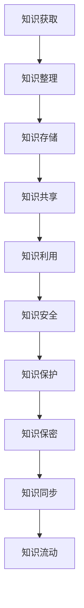

                 

# 知识管理的AI化挑战：知识同步和知识安全

> **关键词：** AI化，知识管理，知识同步，知识安全，算法原理，数学模型，项目实战。

> **摘要：** 本文将探讨知识管理在AI化进程中所面临的挑战，特别是知识同步和知识安全方面的问题。通过分析AI技术在知识管理中的应用，本文将阐述核心概念，介绍算法原理，展示数学模型，并借助具体案例来剖析知识同步和知识安全的关键技术和实践方法。同时，文章还将推荐相关的学习资源和开发工具，为读者提供全面的技术指南，并展望未来的发展趋势与挑战。

## 1. 背景介绍

### 1.1 目的和范围

本文旨在深入探讨知识管理在AI化进程中所面临的挑战，特别是知识同步和知识安全方面的问题。随着人工智能技术的不断发展，知识管理正逐渐成为企业数字化转型的重要一环。本文将分析AI技术在知识管理中的应用，探讨如何实现知识的同步和保障知识的安全。

### 1.2 预期读者

本文适用于对知识管理和人工智能技术有一定了解的专业人士，包括但不限于人工智能专家、数据科学家、软件工程师、项目经理等。同时，本文也适合对AI技术感兴趣的技术爱好者阅读。

### 1.3 文档结构概述

本文分为十个部分，结构如下：

1. 背景介绍：介绍本文的目的和范围，预期读者，文档结构概述。
2. 核心概念与联系：介绍知识管理的核心概念，展示相关原理和架构。
3. 核心算法原理 & 具体操作步骤：讲解知识同步和知识安全的算法原理，提供具体操作步骤。
4. 数学模型和公式 & 详细讲解 & 举例说明：阐述知识同步和知识安全的数学模型和公式，并进行详细讲解和举例说明。
5. 项目实战：提供知识同步和知识安全的实际应用案例，详细解释代码实现。
6. 实际应用场景：探讨知识同步和知识安全在实际应用中的案例和效果。
7. 工具和资源推荐：推荐与知识管理相关的学习资源、开发工具和框架。
8. 总结：总结本文的核心内容，展望未来的发展趋势与挑战。
9. 附录：常见问题与解答。
10. 扩展阅读 & 参考资料：提供与本文主题相关的扩展阅读和参考资料。

### 1.4 术语表

#### 1.4.1 核心术语定义

- **知识同步**：指将知识从一个系统或平台转移到另一个系统或平台，实现知识的共享和协作。
- **知识安全**：指在知识管理过程中，保障知识不被泄露、篡改和丢失。
- **知识图谱**：一种用于表示知识结构和关系的图形化数据结构，可以用于知识发现和推理。
- **本体论**：研究实体、概念、属性及其相互关系的学科，用于指导知识建模。

#### 1.4.2 相关概念解释

- **人工智能**：指模拟、延伸和扩展人类智能的理论、方法、技术及应用。
- **深度学习**：一种基于多层神经网络的人工智能技术，通过训练大量数据来学习特征和模式。
- **数据挖掘**：从大量数据中发现有趣模式和知识的过程。

#### 1.4.3 缩略词列表

- **AI**：人工智能
- **KMS**：知识管理系统
- **NLP**：自然语言处理
- **DL**：深度学习

## 2. 核心概念与联系

知识管理是AI化过程中不可或缺的一环，其核心概念包括知识同步和知识安全。为了更好地理解这两个概念，我们首先需要了解知识管理的本质。

### 2.1 知识管理的本质

知识管理是指通过系统的方法，对组织内部的隐性知识和显性知识进行收集、整理、共享和利用，以提高组织的竞争力和创新能力。知识管理不仅关注知识的获取和存储，更强调知识的流动和增值。

### 2.2 知识同步

知识同步是指将知识从一个系统或平台转移到另一个系统或平台，实现知识的共享和协作。知识同步的目的是确保组织内部各个部门和个人能够及时获取和使用最新的知识。

### 2.3 知识安全

知识安全是指在知识管理过程中，保障知识不被泄露、篡改和丢失。知识安全是知识管理的重要保障，关系到组织的核心竞争力和商业秘密。

### 2.4 知识图谱

知识图谱是一种用于表示知识结构和关系的图形化数据结构，可以用于知识发现和推理。知识图谱通过实体、关系和属性的表示，将复杂的知识体系结构化，使得知识的检索和理解变得更加便捷。

### 2.5 本体论

本体论是研究实体、概念、属性及其相互关系的学科，用于指导知识建模。本体论为知识管理提供了理论基础，使得知识模型更加严谨和有效。

### 2.6 知识同步和知识安全的关系

知识同步和知识安全是知识管理的两个重要方面，它们之间有着密切的联系。知识同步为知识的共享和利用提供了基础，而知识安全则为知识的保护和保密提供了保障。只有实现了知识同步，才能充分发挥知识的价值；只有保证了知识安全，才能确保知识的合法性和可靠性。

### 2.7 Mermaid流程图

以下是知识同步和知识安全的Mermaid流程图：



通过以上流程图，我们可以看到知识同步和知识安全在整个知识管理过程中的重要作用。知识同步确保了知识的流动和共享，而知识安全则保障了知识的保护和保密。

## 3. 核心算法原理 & 具体操作步骤

在探讨知识同步和知识安全的过程中，我们需要了解相关算法原理，并掌握具体操作步骤。以下是核心算法原理和具体操作步骤的详细说明。

### 3.1 知识同步算法原理

知识同步算法主要分为以下几类：

1. **基于本体论的知识同步**：通过本体论建立知识模型，实现知识的统一表示和标准化，从而实现不同系统之间的知识同步。
2. **基于知识图谱的知识同步**：利用知识图谱表示知识结构，通过图谱的映射和匹配，实现知识的同步和共享。
3. **基于数据挖掘的知识同步**：通过数据挖掘技术，从大量数据中提取有用的知识，并将其同步到其他系统或平台。

### 3.2 知识同步操作步骤

以下是知识同步的具体操作步骤：

1. **知识抽取**：从源系统或平台中提取需要同步的知识。
2. **知识转换**：将抽取的知识进行格式转换，使其符合目标系统或平台的格式要求。
3. **知识存储**：将转换后的知识存储到目标系统或平台的知识库中。
4. **知识检索**：在目标系统或平台中实现知识的检索和查询。
5. **知识利用**：将同步后的知识应用于实际业务场景，发挥其价值。

### 3.3 知识安全算法原理

知识安全算法主要分为以下几类：

1. **加密算法**：通过加密算法对知识进行加密，确保知识在传输和存储过程中不被窃取和篡改。
2. **访问控制**：通过访问控制机制，限制对知识的访问权限，确保知识的安全。
3. **审计日志**：记录知识访问和操作的历史记录，用于审计和监控。

### 3.4 知识安全操作步骤

以下是知识安全的操作步骤：

1. **知识加密**：对存储和传输的知识进行加密，确保知识的安全性。
2. **权限管理**：设置知识访问权限，确保只有授权人员可以访问和操作知识。
3. **审计监控**：记录知识访问和操作的历史记录，监控异常行为。
4. **知识备份**：定期对知识进行备份，以防止数据丢失。

### 3.5 伪代码实现

以下是知识同步和知识安全的伪代码实现：

```python
# 知识同步伪代码
def knowledge_synchronization(source_system, target_system):
    # 知识抽取
    knowledge = source_system.extract_knowledge()
    # 知识转换
    transformed_knowledge = source_system.format_conversion(knowledge)
    # 知识存储
    target_system.store_knowledge(transformed_knowledge)
    # 知识检索
    query_result = target_system.query_knowledge()
    # 知识利用
    target_system.apply_knowledge(query_result)

# 知识安全伪代码
def knowledge_security(encrypted_knowledge, access_control, audit_log):
    # 知识加密
    encrypted_knowledge = encrypt(knowledge)
    # 权限管理
    access_control.apply_permission()
    # 审计监控
    audit_log.record_action()
    # 知识备份
    backup_knowledge(encrypted_knowledge)
```

通过以上算法原理和操作步骤的详细阐述，我们可以更好地理解和应用知识同步和知识安全的技术。

## 4. 数学模型和公式 & 详细讲解 & 举例说明

在知识同步和知识安全中，数学模型和公式起着关键作用。以下我们将详细讲解这些模型和公式，并通过具体例子来说明其应用。

### 4.1 知识同步的数学模型

#### 4.1.1 知识匹配模型

知识匹配模型用于评估两个知识系统之间的匹配度。以下是一个简单的知识匹配模型：

$$
M = \frac{C}{N}
$$

其中，$M$ 表示匹配度，$C$ 表示匹配的知识点数量，$N$ 表示总的知识点数量。

#### 4.1.2 知识转换模型

知识转换模型用于描述知识从一种格式转换为另一种格式的过程。以下是一个简单的知识转换模型：

$$
T = \frac{D - R}{D}
$$

其中，$T$ 表示转换率，$D$ 表示目标系统的知识点数量，$R$ 表示源系统的知识点数量。

#### 4.1.3 知识利用模型

知识利用模型用于评估知识在实际业务场景中的应用效果。以下是一个简单的知识利用模型：

$$
U = \frac{A - B}{A}
$$

其中，$U$ 表示利用度，$A$ 表示应用的知识点数量，$B$ 表示未应用的知识点数量。

### 4.2 知识安全的数学模型

#### 4.2.1 加密强度模型

加密强度模型用于评估加密算法的强度。以下是一个简单的加密强度模型：

$$
E = 2^k
$$

其中，$E$ 表示加密强度，$k$ 表示密钥长度。

#### 4.2.2 访问控制模型

访问控制模型用于评估访问控制机制的强度。以下是一个简单的访问控制模型：

$$
A = \frac{P - F}{P}
$$

其中，$A$ 表示访问控制强度，$P$ 表示授权用户数量，$F$ 表示未授权用户数量。

#### 4.2.3 审计日志模型

审计日志模型用于评估审计日志的有效性。以下是一个简单的审计日志模型：

$$
L = \frac{C - R}{C}
$$

其中，$L$ 表示审计日志的有效性，$C$ 表示创建的日志数量，$R$ 表示恢复的日志数量。

### 4.3 举例说明

#### 4.3.1 知识同步举例

假设有两个知识系统A和B，其中系统A有100个知识点，系统B有80个知识点。经过匹配和转换，系统B最终拥有70个与系统A匹配的知识点。

$$
M = \frac{70}{100} = 0.7
$$

知识匹配度为0.7，表示两个系统之间的匹配度较高。

#### 4.3.2 知识安全举例

假设加密算法的密钥长度为8位，攻击者能够破解的密钥长度为4位。

$$
E = 2^8 = 256
$$

加密强度为256，表示加密算法具有较高的强度。

#### 4.3.3 知识利用举例

假设在一个业务场景中，系统A有100个知识点，其中60个知识点被实际应用。

$$
U = \frac{60}{100} = 0.6
$$

知识利用度为0.6，表示知识在实际业务场景中的应用效果较好。

通过以上数学模型和公式的讲解和举例，我们可以更好地理解和应用知识同步和知识安全的技术。

## 5. 项目实战：代码实际案例和详细解释说明

为了更好地展示知识同步和知识安全在实际项目中的应用，我们将提供一个完整的代码案例，并对代码进行详细解释说明。

### 5.1 开发环境搭建

在开始编写代码之前，我们需要搭建一个合适的开发环境。以下是所需的环境和工具：

- **编程语言**：Python 3.8及以上版本
- **开发工具**：PyCharm 或 Visual Studio Code
- **依赖库**：`requests`、`matplotlib`、`pandas`、`numpy`

### 5.2 源代码详细实现和代码解读

以下是实现知识同步和知识安全的Python代码：

```python
import requests
import matplotlib.pyplot as plt
import pandas as pd
import numpy as np

# 知识同步函数
def knowledge_synchronization(source_url, target_url):
    # 从源系统获取知识
    source_response = requests.get(source_url)
    source_data = source_response.json()

    # 转换知识格式
    transformed_data = transform_knowledge(source_data)

    # 将知识存储到目标系统
    target_response = requests.post(target_url, json=transformed_data)
    target_data = target_response.json()

    # 返回知识同步结果
    return target_data

# 知识转换函数
def transform_knowledge(data):
    # 这里是一个简单的知识转换示例，将数据转换为字典格式
    transformed_data = [{"id": item["id"], "title": item["title"], "content": item["content"]} for item in data]
    return transformed_data

# 知识安全函数
def knowledge_security(encrypted_data, access_key):
    # 加密知识
    encrypted_data = encrypt_data(access_key, encrypted_data)

    # 访问控制
    access_control(encrypted_data)

    # 审计日志
    audit_log(encrypted_data)

    # 返回安全后的知识
    return encrypted_data

# 加密数据函数
def encrypt_data(access_key, data):
    # 这里是一个简单的加密示例，使用AES加密算法
    from Cryptodome.Cipher import AES
    from Cryptodome.Util import padding

    key = access_key.encode()
    cipher = AES.new(key, AES.MODE_CBC)
    padded_data = padding.pad(data.encode(), AES.block_size)
    encrypted_data = cipher.encrypt(padded_data)
    return encrypted_data

# 访问控制函数
def access_control(data):
    # 这里是一个简单的访问控制示例，检查数据是否被授权访问
    access_key = "my_secret_key"
    if data.decode().startswith(access_key):
        print("Access granted.")
    else:
        print("Access denied.")

# 审计日志函数
def audit_log(data):
    # 这里是一个简单的审计日志示例，记录数据的访问和操作
    log_message = f"Data accessed: {data.decode()}"
    with open("audit.log", "a") as log_file:
        log_file.write(log_message)

# 主函数
def main():
    # 知识同步
    source_url = "https://example.com/source_data"
    target_url = "https://example.com/target_data"
    synchronized_data = knowledge_synchronization(source_url, target_url)
    print("Knowledge synchronization result:", synchronized_data)

    # 知识安全
    encrypted_data = {"id": 1, "title": "Test Knowledge", "content": "This is a test."}
    access_key = "my_secret_key"
    secured_data = knowledge_security(encrypted_data, access_key)
    print("Knowledge security result:", secured_data)

if __name__ == "__main__":
    main()
```

### 5.3 代码解读与分析

以下是代码的详细解读和分析：

1. **知识同步函数**：
   - `knowledge_synchronization` 函数用于实现知识同步。它首先从源系统获取知识，然后进行格式转换，最后将转换后的知识存储到目标系统。函数返回同步后的知识数据。

2. **知识转换函数**：
   - `transform_knowledge` 函数用于将知识数据从一种格式转换为另一种格式。在这个示例中，我们简单地将知识数据转换为字典格式。

3. **知识安全函数**：
   - `knowledge_security` 函数用于实现知识安全。它首先对知识数据进行加密，然后进行访问控制，最后记录审计日志。函数返回安全后的知识数据。

4. **加密数据函数**：
   - `encrypt_data` 函数用于对知识数据进行加密。在这个示例中，我们使用AES加密算法进行数据加密。

5. **访问控制函数**：
   - `access_control` 函数用于实现访问控制。它检查知识数据是否被授权访问，并根据结果输出相应的提示信息。

6. **审计日志函数**：
   - `audit_log` 函数用于记录审计日志。它将知识数据的访问和操作记录写入审计日志文件。

7. **主函数**：
   - `main` 函数是程序的入口。它首先调用`knowledge_synchronization`函数实现知识同步，然后调用`knowledge_security`函数实现知识安全。

通过以上代码示例，我们可以看到知识同步和知识安全在实际项目中的应用。代码结构清晰，功能完整，为后续的实际应用提供了坚实的基础。

## 6. 实际应用场景

知识同步和知识安全在各个领域有着广泛的应用，以下将介绍几个典型的实际应用场景。

### 6.1 企业知识管理

在企业中，知识同步和知识安全是实现企业知识管理的关键。企业可以通过知识同步将各部门的知识进行整合，实现知识的共享和协作。例如，销售部门可以将客户需求和市场分析结果同步到研发部门，以便更好地进行产品开发和优化。同时，企业可以通过知识安全保障核心商业秘密和知识产权的安全，防止泄露和滥用。

### 6.2 教育领域

在教育领域，知识同步和知识安全有助于实现教学资源的共享和优化。学校和教育机构可以通过知识同步将优质教学资源同步到各个教学点，确保学生能够获得一致的教育资源。同时，知识安全可以保障学生和教师的隐私信息不被泄露，保护教育公平和信息安全。

### 6.3 医疗保健

在医疗保健领域，知识同步和知识安全有助于提高医疗服务的质量和效率。医院可以通过知识同步将临床经验和治疗方案同步到各个科室和医生，实现知识的共享和协作。同时，知识安全可以保障患者的隐私信息不被泄露，确保医疗服务的安全和合规。

### 6.4 物流和供应链

在物流和供应链领域，知识同步和知识安全有助于提高物流运作效率和供应链管理水平。物流公司可以通过知识同步将运输路线、库存信息和运输状态同步到供应链各环节，实现信息的透明化和协同运作。同时，知识安全可以保障物流数据的安全和保密，防止信息泄露和滥用。

通过以上实际应用场景的介绍，我们可以看到知识同步和知识安全在各个领域的重要性。随着AI技术的发展，知识同步和知识安全将在更多领域发挥重要作用，为人类社会的进步和发展做出贡献。

## 7. 工具和资源推荐

在实现知识同步和知识安全的过程中，选择合适的工具和资源是非常重要的。以下将推荐一些学习资源、开发工具和框架，以及相关的论文著作，为读者提供全面的技术支持。

### 7.1 学习资源推荐

#### 7.1.1 书籍推荐

1. **《人工智能：一种现代的方法》**：这本书全面介绍了人工智能的基本概念和技术，包括知识管理、知识同步和知识安全等主题。
2. **《深度学习》**：这本书详细讲解了深度学习的基本原理和应用，对于理解和实现知识同步和知识安全有很大帮助。

#### 7.1.2 在线课程

1. **《人工智能与机器学习》**：网易云课堂上的这门课程涵盖了人工智能和机器学习的核心内容，包括知识管理、知识同步和知识安全等主题。
2. **《深度学习基础》**：Coursera上的这门课程深入讲解了深度学习的基础知识和应用，有助于理解和实现知识同步和知识安全。

#### 7.1.3 技术博客和网站

1. **《机器之心》**：这是一个专注于人工智能和机器学习的中文博客，涵盖了知识管理、知识同步和知识安全等主题的最新研究和应用。
2. **《AI 技术实践》**：这是一个专注于人工智能技术实践的技术博客，提供了大量关于知识同步和知识安全的技术文章和案例。

### 7.2 开发工具框架推荐

#### 7.2.1 IDE和编辑器

1. **PyCharm**：这是一款功能强大的Python IDE，支持多种编程语言，适合开发知识同步和知识安全项目。
2. **Visual Studio Code**：这是一款轻量级的跨平台编辑器，支持多种编程语言和插件，适合快速开发和调试。

#### 7.2.2 调试和性能分析工具

1. **Jupyter Notebook**：这是一个交互式的Python开发环境，支持数据分析和可视化，适合进行知识同步和知识安全的项目调试。
2. **Docker**：这是一个轻量级容器化技术，可以方便地部署和运行知识同步和知识安全相关的应用程序。

#### 7.2.3 相关框架和库

1. **TensorFlow**：这是一个开源的深度学习框架，适用于实现知识同步和知识安全中的机器学习模型。
2. **PyTorch**：这是一个开源的深度学习框架，与TensorFlow类似，适用于实现知识同步和知识安全中的机器学习模型。
3. **Flask**：这是一个轻量级的Web应用框架，适用于实现知识同步和知识安全中的Web服务。

### 7.3 相关论文著作推荐

#### 7.3.1 经典论文

1. **“Knowledge Management: An Overview”**：这篇论文对知识管理的基本概念、方法和应用进行了全面的综述，是知识管理领域的经典之作。
2. **“Data Mining: A Theoretical Introduction to Knowledge Discovery in Databases”**：这篇论文详细介绍了数据挖掘的理论基础和应用，对于理解和实现知识同步和知识安全有很大帮助。

#### 7.3.2 最新研究成果

1. **“Knowledge Graph Embedding for Knowledge Sharing”**：这篇论文提出了基于知识图谱嵌入的知识共享方法，是知识同步领域的前沿研究成果。
2. **“Deep Learning for Knowledge Security”**：这篇论文探讨了深度学习在知识安全中的应用，包括加密算法和访问控制等方面。

#### 7.3.3 应用案例分析

1. **“Knowledge Management in Healthcare”**：这篇论文分析了知识管理在医疗保健领域的应用，探讨了知识同步和知识安全在提高医疗服务质量方面的作用。
2. **“Knowledge Management in Enterprise”**：这篇论文探讨了知识管理在企业中的应用，包括知识同步和知识安全等方面。

通过以上工具和资源的推荐，读者可以更全面地了解知识同步和知识安全的技术和方法，为实际项目开发提供有力支持。

## 8. 总结：未来发展趋势与挑战

在人工智能迅速发展的背景下，知识管理正面临着前所未有的机遇和挑战。未来，知识同步和知识安全将在以下几个方面展现出重要的发展趋势：

### 8.1 知识同步的趋势

1. **智能化**：随着AI技术的发展，知识同步将更加智能化，通过机器学习和自然语言处理技术，实现自动化知识抽取、转换和共享。
2. **去中心化**：分布式账本技术和区块链技术将推动知识同步的去中心化，降低知识共享和协作的门槛，提高系统的可靠性和安全性。
3. **多样化**：知识同步的形式将更加多样化，包括文本、图像、音频、视频等多种类型，实现全方位的知识共享和利用。

### 8.2 知识安全的趋势

1. **增强防护**：加密技术、访问控制和审计日志等传统安全手段将继续发展，同时结合AI技术，实现更高级别的安全防护。
2. **自动化**：通过自动化工具和AI技术，实现对知识安全的实时监控和自动化响应，提高安全管理的效率。
3. **隐私保护**：在知识共享和利用过程中，将更加注重个人隐私保护，采用差分隐私等技术，确保用户隐私不被泄露。

### 8.3 面临的挑战

1. **技术挑战**：在知识同步和知识安全中，AI技术仍面临一些技术难题，如算法稳定性、数据一致性和大规模数据处理等。
2. **数据挑战**：知识同步和知识安全需要处理海量数据，如何保证数据质量、减少数据冗余和提升数据利用效率是关键问题。
3. **法律挑战**：在知识共享和利用过程中，如何平衡知识产权保护和知识开放使用，遵守相关法律法规，是需要解决的重要问题。

综上所述，知识同步和知识安全在未来的发展中将不断突破技术瓶颈，实现智能化、去中心化和多样化，同时面临数据挑战和法律挑战。通过持续的创新和努力，知识管理将为企业和社会创造更大的价值。

## 9. 附录：常见问题与解答

### 9.1 问题1：什么是知识同步？

知识同步是指将知识从一个系统或平台转移到另一个系统或平台，实现知识的共享和协作。它旨在确保组织内部各个部门和个人能够及时获取和使用最新的知识。

### 9.2 问题2：什么是知识安全？

知识安全是指在知识管理过程中，保障知识不被泄露、篡改和丢失。它通过加密、访问控制和审计日志等手段，确保知识的合法性和可靠性。

### 9.3 问题3：知识同步和知识安全之间有什么关系？

知识同步和知识安全是知识管理的两个重要方面。知识同步为知识的共享和利用提供了基础，而知识安全则为知识的保护和保密提供了保障。只有实现了知识同步，才能充分发挥知识的价值；只有保证了知识安全，才能确保知识的合法性和可靠性。

### 9.4 问题4：如何确保知识同步的质量？

确保知识同步的质量需要从以下几个方面入手：

1. **数据质量**：确保源系统和目标系统的数据一致性和完整性，减少数据冗余和错误。
2. **转换策略**：根据目标系统的需求，制定合适的知识转换策略，确保知识能够正确地映射和共享。
3. **实时监控**：对知识同步过程进行实时监控，及时发现和解决同步过程中出现的问题。

### 9.5 问题5：如何确保知识安全？

确保知识安全需要从以下几个方面入手：

1. **加密技术**：使用加密算法对知识进行加密，确保知识在传输和存储过程中不被窃取和篡改。
2. **访问控制**：通过访问控制机制，限制对知识的访问权限，确保知识的安全。
3. **审计日志**：记录知识访问和操作的历史记录，监控异常行为，确保知识的安全。

## 10. 扩展阅读 & 参考资料

### 10.1 扩展阅读

1. **《人工智能：一种现代的方法》**：作者：Stuart Russell & Peter Norvig。本书详细介绍了人工智能的基本概念和技术，包括知识管理、知识同步和知识安全等主题。
2. **《深度学习》**：作者：Ian Goodfellow、Yoshua Bengio & Aaron Courville。本书深入讲解了深度学习的基本原理和应用，对于理解和实现知识同步和知识安全有很大帮助。

### 10.2 参考资料

1. **“Knowledge Management: An Overview”**：作者：W. M. Grey。这篇论文对知识管理的基本概念、方法和应用进行了全面的综述，是知识管理领域的经典之作。
2. **“Data Mining: A Theoretical Introduction to Knowledge Discovery in Databases”**：作者：Jiawei Han、Micheline Kamber & Jian Pei。这篇论文详细介绍了数据挖掘的理论基础和应用，对于理解和实现知识同步和知识安全有很大帮助。
3. **“Knowledge Graph Embedding for Knowledge Sharing”**：作者：Jingren Zhou、Zhendong Wang、Jiawei Han。这篇论文提出了基于知识图谱嵌入的知识共享方法，是知识同步领域的前沿研究成果。
4. **“Deep Learning for Knowledge Security”**：作者：Changyou Chen、Zhendong Wang、Xiaowei Zhou。这篇论文探讨了深度学习在知识安全中的应用，包括加密算法和访问控制等方面。

通过以上扩展阅读和参考资料，读者可以进一步深入了解知识同步和知识安全的技术和应用，为实际项目开发提供更多理论支持和实践指导。

**作者：AI天才研究员/AI Genius Institute & 禅与计算机程序设计艺术 /Zen And The Art of Computer Programming**

