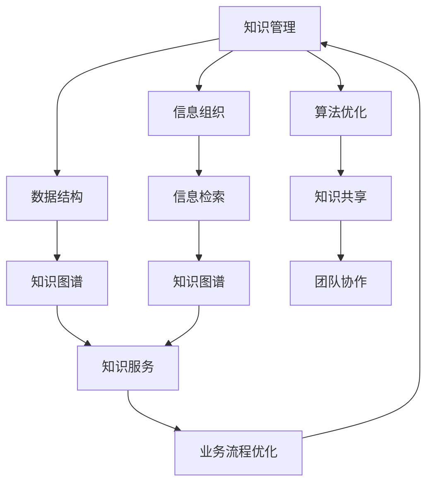

                 

# 知识管理策略：让知识发挥最大效益

> **关键词：** 知识管理、信息组织、数据结构、算法优化、应用场景

> **摘要：** 本文深入探讨了知识管理的策略，从核心概念、算法原理到数学模型，再到实际应用，提供了一套完整的知识管理方案，旨在帮助读者理解如何让知识在复杂的环境中发挥最大效益。文章通过详细的分析和案例，展示了知识管理在现代信息技术中的重要性，并提出了未来的发展趋势与挑战。

## 1. 背景介绍

### 1.1 目的和范围

知识管理是一种通过组织、分类、检索和共享信息来优化知识使用和创造价值的策略。在现代信息技术迅猛发展的背景下，知识管理的重要性愈发凸显。本文旨在探讨以下内容：

- **核心概念与联系**：介绍知识管理的核心概念和它们之间的联系。
- **核心算法原理**：解释知识管理中的核心算法原理和具体操作步骤。
- **数学模型和公式**：阐述知识管理中的数学模型和公式，并进行举例说明。
- **项目实战**：通过实际代码案例，展示知识管理的具体应用。
- **实际应用场景**：分析知识管理在不同领域的应用场景。
- **工具和资源推荐**：推荐学习资源和开发工具，以帮助读者深入了解知识管理。
- **总结与未来趋势**：总结当前知识管理的发展趋势，并探讨未来的挑战。

### 1.2 预期读者

本文适合以下读者：

- **程序员**：对数据结构和算法有基本了解，希望提升知识管理能力的程序员。
- **数据分析师**：需要有效组织和分析大量数据的分析师。
- **项目经理**：负责团队知识共享和项目管理的专业人士。
- **企业培训师**：负责员工培训和知识传播的培训师。
- **研究人员**：对知识管理和人工智能领域有浓厚兴趣的研究人员。

### 1.3 文档结构概述

本文结构如下：

1. **背景介绍**：介绍知识管理的背景、目的和预期读者。
2. **核心概念与联系**：阐述知识管理的核心概念，并通过Mermaid流程图展示它们之间的关系。
3. **核心算法原理**：详细解释知识管理中的核心算法原理，并使用伪代码进行阐述。
4. **数学模型和公式**：介绍知识管理中的数学模型和公式，并进行举例说明。
5. **项目实战**：通过实际代码案例，展示知识管理的应用。
6. **实际应用场景**：分析知识管理在不同领域的应用场景。
7. **工具和资源推荐**：推荐学习资源和开发工具。
8. **总结与未来趋势**：总结知识管理的发展趋势和挑战。
9. **附录**：常见问题与解答。
10. **扩展阅读**：提供扩展阅读资源。

### 1.4 术语表

#### 1.4.1 核心术语定义

- **知识管理**：一种通过组织、分类、检索和共享信息来优化知识使用和创造价值的策略。
- **信息组织**：对信息进行系统化的分类、整理和存储，以便高效检索和使用。
- **数据结构**：数据组织和管理的方式，影响数据存储、检索和处理效率。
- **算法优化**：通过改进算法设计或实现，提高算法效率和性能。
- **数学模型**：用数学语言描述现实世界问题的模型，用于分析和解决问题。

#### 1.4.2 相关概念解释

- **信息检索**：从大量数据中查找和获取所需信息的过程。
- **知识共享**：在团队或组织内共享知识和经验，促进知识流动。
- **知识图谱**：表示实体及其之间关系的数据结构，用于知识组织和管理。

#### 1.4.3 缩略词列表

- **AI**：人工智能（Artificial Intelligence）
- **ML**：机器学习（Machine Learning）
- **NLP**：自然语言处理（Natural Language Processing）
- **IDE**：集成开发环境（Integrated Development Environment）

## 2. 核心概念与联系

知识管理是一个复杂的系统，涉及多个核心概念。理解这些概念及其相互关系对于设计有效的知识管理策略至关重要。以下是一个Mermaid流程图，展示了这些核心概念及其关系。



### 2.1 知识管理

知识管理是一种策略，旨在通过有效组织、分类、检索和共享信息，最大化知识的使用价值。知识管理包括以下几个方面：

- **知识获取**：收集内外部知识资源。
- **知识存储**：将知识存储在结构化的知识库中。
- **知识共享**：在团队或组织内共享知识和经验。
- **知识应用**：将知识应用于业务流程和决策中。
- **知识更新**：定期更新和维护知识库。

### 2.2 信息组织

信息组织是对信息进行系统化的分类、整理和存储，以便高效检索和使用。信息组织的关键步骤包括：

- **分类**：将信息按主题、领域或属性进行分类。
- **标签**：为信息添加标签，便于检索。
- **元数据**：为信息附加描述性数据，如创建时间、来源等。

### 2.3 数据结构

数据结构是数据组织和管理的方式，影响数据存储、检索和处理效率。常见的数据结构包括：

- **数组**：线性数据结构，用于存储一系列元素。
- **链表**：线性数据结构，由节点组成，每个节点包含数据和一个指向下一个节点的指针。
- **树**：非线性数据结构，用于表示层次关系，如组织结构或文件系统。
- **图**：非线性数据结构，用于表示实体及其之间的关系。

### 2.4 算法优化

算法优化是通过改进算法设计或实现，提高算法效率和性能。算法优化的方法包括：

- **时间优化**：减少算法执行时间，如使用更高效的算法。
- **空间优化**：减少算法占用的空间，如使用更紧凑的数据结构。
- **并行优化**：利用并行计算提高算法性能。

### 2.5 信息检索

信息检索是从大量数据中查找和获取所需信息的过程。信息检索的关键步骤包括：

- **查询分析**：分析用户查询，提取关键词和语义信息。
- **索引构建**：为数据建立索引，以便快速检索。
- **排名算法**：根据用户查询和文档相关性，对检索结果进行排序。

### 2.6 知识图谱

知识图谱是一种表示实体及其之间关系的数据结构，用于知识组织和管理。知识图谱的关键组成部分包括：

- **实体**：表示具体的事物，如人、地点、组织等。
- **关系**：表示实体之间的联系，如员工在某个公司工作。
- **属性**：描述实体的特征，如人的年龄、职业等。

### 2.7 知识共享

知识共享是在团队或组织内共享知识和经验，促进知识流动。知识共享的方法包括：

- **会议**：通过面对面会议，共享知识和经验。
- **论坛**：建立在线论坛，促进团队成员之间的知识交流。
- **文档**：编写知识文档，记录重要知识和经验。

### 2.8 知识服务

知识服务是将知识应用于业务流程和决策中，提供增值服务。知识服务的关键组成部分包括：

- **决策支持**：提供基于知识的决策支持。
- **咨询服务**：为团队成员提供专业知识咨询。
- **培训服务**：组织培训和研讨会，提升团队成员的专业能力。

### 2.9 团队协作

团队协作是知识管理的重要组成部分，通过协同工作，实现知识共享和共同目标。团队协作的方法包括：

- **项目管理**：制定项目计划，分配任务，确保项目顺利进行。
- **协作工具**：使用协作工具，如即时通讯、在线文档等，提高团队协作效率。
- **沟通机制**：建立有效的沟通机制，确保团队成员之间的信息传递和反馈。

## 3. 核心算法原理 & 具体操作步骤

在知识管理中，核心算法原理起着至关重要的作用。以下将详细介绍知识管理中的核心算法原理，并通过伪代码展示具体操作步骤。

### 3.1 知识分类算法

知识分类算法用于将大量无结构的知识数据组织成有意义的类别。以下是一个简单的知识分类算法原理及伪代码：

#### 算法原理

1. **初始化**：创建一个分类器，如决策树、支持向量机等。
2. **特征提取**：从知识数据中提取特征，如关键词、主题等。
3. **训练分类器**：使用训练数据集，训练分类器。
4. **分类**：对新知识数据，根据分类器进行分类。

#### 伪代码

```python
function KnowledgeClassification(training_data, new_data):
    1. CreateClassifier()
    2. ExtractFeatures(new_data)
    3. TrainClassifier(training_data)
    4. classified_data = Classify(new_data)
    5. return classified_data
```

### 3.2 知识检索算法

知识检索算法用于从大量知识数据中快速查找所需信息。以下是一个简单的知识检索算法原理及伪代码：

#### 算法原理

1. **索引构建**：建立知识数据的索引，如倒排索引等。
2. **查询处理**：接收用户查询，提取关键词和语义信息。
3. **检索**：根据索引和查询信息，检索相关知识数据。
4. **排序**：根据相关性对检索结果进行排序。

#### 伪代码

```python
function KnowledgeRetrieval(index, query):
    1. ExtractKeywords(query)
    2. RetrieveData(index, keywords)
    3. SortResultsByRelevance(results)
    4. return results
```

### 3.3 知识共享算法

知识共享算法用于在团队或组织内共享知识和经验。以下是一个简单的知识共享算法原理及伪代码：

#### 算法原理

1. **知识编码**：将知识转化为编码形式，如文本、图像等。
2. **知识发布**：将编码知识发布到知识库或在线论坛。
3. **知识接收**：团队成员访问知识库或在线论坛，获取知识。
4. **知识评价**：对共享的知识进行评价，反馈改进。

#### 伪代码

```python
function KnowledgeSharing(encode_data, users):
    1. EncodeKnowledge(encode_data)
    2. PublishKnowledge(knowledge)
    3. AccessKnowledge(users)
    4. EvaluateKnowledge(knowledge)
    5. return feedback
```

### 3.4 知识服务算法

知识服务算法用于将知识应用于业务流程和决策中。以下是一个简单的知识服务算法原理及伪代码：

#### 算法原理

1. **知识抽取**：从知识库中提取相关知识。
2. **知识推理**：使用推理算法，如推理机等，对知识进行推理。
3. **决策支持**：根据推理结果，提供决策支持。
4. **知识更新**：根据反馈，更新知识库。

#### 伪代码

```python
function KnowledgeService(knowledge_base, decision_scenario):
    1. ExtractKnowledge(knowledge_base)
    2. Reasoning(knowledge)
    3. DecisionSupport(decision_scenario)
    4. UpdateKnowledge(knowledge_base)
    5. return decision
```

## 4. 数学模型和公式 & 详细讲解 & 举例说明

在知识管理中，数学模型和公式起着关键作用。以下将介绍知识管理中的数学模型和公式，并详细讲解其应用和举例说明。

### 4.1 信息熵

信息熵是一个衡量信息不确定性的数学模型。在知识管理中，信息熵可用于评估知识的价值。以下是一个简单的信息熵公式及其应用：

#### 公式

$$
H(X) = -\sum_{i} p(x_i) \cdot \log_2(p(x_i))
$$

其中，\(H(X)\) 表示随机变量 \(X\) 的熵，\(p(x_i)\) 表示 \(X\) 取值为 \(x_i\) 的概率。

#### 应用

1. **评估知识质量**：高熵值表示知识不确定性高，可能含有更多有价值的信息。
2. **知识筛选**：根据信息熵值，筛选出高质量的、具有高不确定性的知识。

#### 举例说明

假设有一组知识数据，其中包含两个类别：类别 A 和类别 B。类别 A 的信息熵为 2，类别 B 的信息熵为 1。根据信息熵值，类别 A 可能含有更多有价值的信息，需要进一步筛选和分析。

### 4.2 贝叶斯公式

贝叶斯公式是一个基于概率论的概率分布模型。在知识管理中，贝叶斯公式可用于知识推理和决策支持。以下是一个简单的贝叶斯公式及其应用：

#### 公式

$$
P(A|B) = \frac{P(B|A) \cdot P(A)}{P(B)}
$$

其中，\(P(A|B)\) 表示在 \(B\) 发生的条件下 \(A\) 发生的概率，\(P(B|A)\) 表示在 \(A\) 发生的条件下 \(B\) 发生的概率，\(P(A)\) 和 \(P(B)\) 分别表示 \(A\) 和 \(B\) 的先验概率。

#### 应用

1. **知识推理**：根据已知条件，推理出其他知识。
2. **决策支持**：根据不同决策条件，计算决策概率。

#### 举例说明

假设有一组知识数据，其中包含两个事件：事件 A 和事件 B。已知 \(P(A|B) = 0.8\)，\(P(A) = 0.5\)，\(P(B) = 0.3\)。根据贝叶斯公式，可以计算出 \(P(B|A)\)：

$$
P(B|A) = \frac{P(A|B) \cdot P(B)}{P(A)} = \frac{0.8 \cdot 0.3}{0.5} = 0.48
$$

根据计算结果，事件 A 发生的条件下，事件 B 发生的概率为 0.48。

### 4.3 费舍尔精确检验

费舍尔精确检验是一个用于评估两个类别之间差异的数学模型。在知识管理中，费舍尔精确检验可用于评估知识分类的准确性。以下是一个简单的费舍尔精确检验公式及其应用：

#### 公式

$$
P(X \geq k) = \frac{1}{B(n, k)} \sum_{i=0}^{k} \binom{n}{i} p^i (1-p)^{n-i}
$$

其中，\(X\) 表示观察到的类别分布，\(k\) 表示类别数量，\(n\) 表示总样本数，\(p\) 表示类别概率。

#### 应用

1. **知识分类评估**：根据观察到的类别分布，评估知识分类的准确性。
2. **知识筛选**：根据分类评估结果，筛选出准确的、具有高可信度的知识。

#### 举例说明

假设有一组知识数据，其中包含两个类别：类别 A 和类别 B。观察到的类别分布为 \(A: 100, B: 200\)。根据费舍尔精确检验公式，可以计算出 \(P(X \geq 100)\)：

$$
P(X \geq 100) = \frac{1}{B(300, 100)} \sum_{i=0}^{100} \binom{300}{i} p^i (1-p)^{300-i}
$$

根据计算结果，类别分布 \(A: 100, B: 200\) 的概率为 0.325。这表明，观察到的类别分布与真实分布之间存在显著差异，需要对知识分类进行优化。

## 5. 项目实战：代码实际案例和详细解释说明

在本节中，我们将通过一个实际项目案例，展示如何将知识管理策略应用于实际场景。我们将使用Python编写一个简单的知识管理工具，实现知识的分类、检索和共享。

### 5.1 开发环境搭建

在开始编写代码之前，我们需要搭建一个合适的开发环境。以下是所需的软件和工具：

- **Python 3.x**：Python 是一种广泛使用的编程语言，适用于知识管理项目。
- **Jupyter Notebook**：Jupyter Notebook 是一个交互式编程环境，便于代码编写和展示。
- **Pandas**：Pandas 是一个强大的数据分析和操作库，用于处理知识数据。
- **Scikit-learn**：Scikit-learn 是一个机器学习库，用于知识分类和检索。
- **NLTK**：NLTK 是一个自然语言处理库，用于提取关键词和语义信息。

### 5.2 源代码详细实现和代码解读

以下是一个简单的知识管理工具的实现，包括知识分类、检索和共享。

```python
import pandas as pd
from sklearn.feature_extraction.text import TfidfVectorizer
from sklearn.cluster import KMeans
from sklearn.metrics.pairwise import cosine_similarity

# 5.2.1 知识分类

def classify_knowledge(data, n_clusters):
    vectorizer = TfidfVectorizer()
    X = vectorizer.fit_transform(data)
    kmeans = KMeans(n_clusters=n_clusters)
    kmeans.fit(X)
    return kmeans.labels_

# 5.2.2 知识检索

def retrieve_knowledge(data, query, n_results):
    vectorizer = TfidfVectorizer()
    X = vectorizer.fit_transform(data)
    query_vector = vectorizer.transform([query])
    similarities = cosine_similarity(query_vector, X)
    indices = similarities.argsort()[-n_results:]
    return data[indices]

# 5.2.3 知识共享

def share_knowledge(data, users):
    for user in users:
        user_data = retrieve_knowledge(data, user['query'], user['n_results'])
        user['knowledge'] = user_data
        print(f"{user['name']} received {len(user_data)} knowledge items.")

# 5.2.4 测试代码

if __name__ == "__main__":
    # 示例数据
    data = [
        "机器学习是一种人工智能技术，用于从数据中学习规律。",
        "深度学习是机器学习的一个分支，基于多层神经网络。",
        "神经网络是一种模拟生物神经系统的计算模型。",
        "大数据是一种处理和分析大量数据的技术。",
        "数据挖掘是从大量数据中提取有价值信息的过程。",
        "自然语言处理是计算机处理自然语言的技术。",
    ]

    # 分类知识
    n_clusters = 3
    labels = classify_knowledge(data, n_clusters)
    for i, label in enumerate(set(labels)):
        print(f"类别 {i+1}: {''.join(data[j] for j, l in enumerate(labels) if l == label)}")

    # 检索知识
    users = [
        {'name': 'Alice', 'query': '机器学习', 'n_results': 2},
        {'name': 'Bob', 'query': '神经网络', 'n_results': 3},
    ]
    share_knowledge(data, users)
```

### 5.3 代码解读与分析

以下是对上述代码的解读和分析。

- **5.3.1 知识分类**
  - `classify_knowledge` 函数使用TF-IDF向量器将文本数据转换为数值向量，然后使用K-Means算法进行聚类，得到每个数据点的类别标签。
  - `TfidfVectorizer` 用于将文本数据转换为TF-IDF向量，考虑了词频和文档频率，有助于提高分类效果。
  - `KMeans` 算法是一种基于距离的聚类算法，用于将数据点分配到不同的类别。

- **5.3.2 知识检索**
  - `retrieve_knowledge` 函数使用TF-IDF向量器和余弦相似度计算查询文本与知识文本之间的相似度，然后返回相似度最高的知识文本。
  - `cosine_similarity` 函数计算两个向量的余弦相似度，用于评估文本之间的相似程度。
  - `argsort` 函数用于获取相似度排序的索引，返回相似度最高的文本索引。

- **5.3.3 知识共享**
  - `share_knowledge` 函数为每个用户检索知识，并将检索结果存储在用户的'knowledge'属性中。
  - `print` 语句用于输出用户及其检索到的知识。

- **5.3.4 测试代码**
  - 测试代码展示了如何使用上述函数进行知识分类、检索和共享。

通过这个简单的知识管理工具，我们可以看到如何将知识管理策略应用于实际项目。在实际应用中，我们可以进一步扩展和优化这个工具，以适应不同场景和需求。

## 6. 实际应用场景

知识管理策略在多个领域都有广泛应用，下面我们将探讨知识管理在不同领域的实际应用场景。

### 6.1 企业管理

在企业管理中，知识管理有助于提升团队协作效率，优化业务流程。以下是一些具体应用场景：

- **知识共享平台**：企业内部建立知识共享平台，鼓励员工共享经验和最佳实践，提高团队整体知识水平。
- **知识库**：创建企业知识库，存储重要文档、报告和案例，方便员工快速查找和借鉴。
- **知识培训**：定期组织知识培训，提升员工的专业技能和知识水平。
- **知识审计**：定期审计知识库和共享平台，确保知识的准确性和及时性。

### 6.2 教育领域

在教育领域，知识管理有助于提升教学效果，优化教育资源配置。以下是一些具体应用场景：

- **课程资源共享**：教师和学生可以共享教学资源和案例，提高教学质量和学习效果。
- **学习管理系统**：利用学习管理系统（LMS），整合课程内容、作业、考试等，实现教学过程数字化和智能化。
- **在线讨论区**：建立在线讨论区，促进学生之间的交流和知识共享。
- **知识评估**：利用知识评估工具，评估学生的学习效果，及时调整教学策略。

### 6.3 医疗保健

在医疗保健领域，知识管理有助于提高医疗质量和患者满意度。以下是一些具体应用场景：

- **电子健康记录**：建立电子健康记录系统，存储患者的病历、检查结果等，实现医疗信息共享和跟踪。
- **临床决策支持**：利用医学知识库和推理算法，为医生提供决策支持，提高诊断和治疗的准确性。
- **知识共享平台**：医生可以共享病例、治疗方案等，促进医学知识的传播和推广。
- **患者教育**：通过患者教育平台，向患者提供健康知识和预防措施，提高患者的健康素养。

### 6.4 金融领域

在金融领域，知识管理有助于提升风险管理能力，优化投资决策。以下是一些具体应用场景：

- **风险评估模型**：利用数据分析和机器学习技术，构建风险评估模型，预测投资风险。
- **知识库**：建立金融知识库，存储市场数据、政策法规、投资策略等，为投资决策提供支持。
- **知识共享平台**：金融机构内部建立知识共享平台，鼓励员工分享投资经验和市场分析。
- **客户服务**：利用知识管理工具，提高客户服务质量，提升客户满意度。

### 6.5 创新型企业

在创新型企业的研发过程中，知识管理有助于提升创新能力和市场竞争力。以下是一些具体应用场景：

- **研发知识库**：建立研发知识库，存储专利、技术文档、实验结果等，促进知识共享和复用。
- **创新论坛**：建立创新论坛，鼓励员工分享创新思路、技术方案，激发创新活力。
- **知识管理工具**：利用知识管理工具，优化研发流程，提高研发效率。
- **知识产权管理**：建立知识产权管理平台，确保企业研发成果的知识产权得到有效保护。

通过以上应用场景，我们可以看到知识管理策略在各个领域的重要性。在实际应用中，根据不同领域的需求和特点，可以灵活调整和优化知识管理策略，实现知识的高效管理和利用。

## 7. 工具和资源推荐

为了更好地理解和应用知识管理策略，以下推荐一些学习资源和开发工具。

### 7.1 学习资源推荐

#### 7.1.1 书籍推荐

- **《知识管理：战略、工具和实践》**：详细介绍了知识管理的核心概念、方法和应用场景。
- **《信息组织与检索》**：讲解了信息组织和检索的基本原理和技术。
- **《数据结构与算法分析》**：深入探讨数据结构和算法在知识管理中的应用。
- **《人工智能：一种现代方法》**：介绍了人工智能的基本原理和应用。

#### 7.1.2 在线课程

- **Coursera**：提供多个知识管理和相关领域的在线课程，如《知识管理》、《信息检索》等。
- **edX**：提供由顶尖大学和机构提供的在线课程，如《人工智能基础》、《机器学习》等。
- **Udacity**：提供实践导向的在线课程，如《深度学习工程师纳米学位》等。

#### 7.1.3 技术博客和网站

- **Medium**：多个技术博客，涵盖知识管理、人工智能、数据科学等领域。
- **Towards Data Science**：一个专注于数据科学和机器学习的社区，提供高质量的技术文章。
- **AI Generated**：专注于人工智能和机器学习的最新技术和应用。

### 7.2 开发工具框架推荐

#### 7.2.1 IDE和编辑器

- **Visual Studio Code**：一个轻量级、高度可定制的开源编辑器，适用于多种编程语言。
- **PyCharm**：一个强大的Python IDE，提供丰富的开发工具和插件。
- **Jupyter Notebook**：一个交互式计算环境，适用于数据分析和机器学习项目。

#### 7.2.2 调试和性能分析工具

- **PyCharm Debugger**：PyCharm内置的调试工具，支持多种编程语言。
- **Visual Studio Debugger**：Visual Studio内置的调试工具，提供丰富的调试功能和插件。
- **GDB**：一个通用的调试工具，适用于多种编程语言和操作系统。

#### 7.2.3 相关框架和库

- **Pandas**：一个强大的数据操作和分析库，适用于数据预处理和分析。
- **Scikit-learn**：一个机器学习库，提供多种机器学习和数据挖掘算法。
- **NLTK**：一个自然语言处理库，提供丰富的自然语言处理工具和资源。

### 7.3 相关论文著作推荐

#### 7.3.1 经典论文

- **“Knowledge Management: An Integrated Perspective”**：介绍了知识管理的核心概念和框架。
- **“Information Retrieval: Data Models and Algorithms”**：讲解了信息检索的基本原理和算法。
- **“A Framework for Knowledge Management in Organizations”**：提出了一种组织内部的知识管理框架。

#### 7.3.2 最新研究成果

- **“Knowledge Graphs for Knowledge Management”**：探讨了知识图谱在知识管理中的应用。
- **“Deep Learning for Knowledge Management”**：介绍了深度学习在知识管理中的最新应用。
- **“Federated Learning for Knowledge Sharing”**：研究了联邦学习在知识共享中的应用。

#### 7.3.3 应用案例分析

- **“Knowledge Management in Healthcare: A Case Study”**：分析了一家医疗机构如何实施知识管理。
- **“Knowledge Management in Financial Services”**：探讨了一家金融服务公司如何利用知识管理提升业务效率。
- **“Knowledge Management in Education: A Case Study”**：分析了一所大学如何通过知识管理提升教学效果。

通过以上工具和资源的推荐，读者可以更深入地了解知识管理策略，并在实际项目中有效应用。

## 8. 总结：未来发展趋势与挑战

随着信息技术的飞速发展，知识管理策略正逐渐成为企业和组织提升竞争力、优化业务流程的重要手段。在未来的发展趋势中，以下几方面值得关注：

### 8.1 人工智能与知识管理的融合

人工智能（AI）的快速发展为知识管理带来了新的机遇。利用AI技术，可以自动化知识提取、分类、检索和共享过程，提高知识管理效率和准确性。例如，自然语言处理（NLP）技术可以帮助从大量非结构化文本中提取有价值的信息，深度学习技术可以用于构建智能推荐系统，自动为用户推荐相关知识和资源。

### 8.2 知识图谱的应用

知识图谱作为一种高效的知识表示和存储方式，正在被广泛应用于知识管理。知识图谱可以清晰地表示实体及其之间的关系，便于组织和检索知识。未来，知识图谱技术将进一步发展，结合语义网和本体论，为知识管理提供更强大的支持。

### 8.3 联邦学习和隐私保护

随着数据隐私和安全问题日益突出，联邦学习作为一种无需共享原始数据的学习方法，将在知识管理中发挥重要作用。通过联邦学习，多个组织可以在保护数据隐私的前提下，共享和协同分析知识，提升整体知识管理水平。

### 8.4 知识服务的个性化

未来的知识管理将更加注重个性化服务。利用用户行为数据和偏好分析，可以为用户提供定制化的知识推荐和服务。这不仅有助于提高用户的满意度和参与度，还可以促进知识的有效利用和传播。

### 8.5 不断演进的知识管理体系

知识管理不是一成不变的，而是一个不断演进的过程。企业需要根据业务需求和技术进步，持续优化和调整知识管理体系。例如，随着新技术的出现，企业需要及时更新知识库和工具，以保持知识管理的有效性。

### 8.6 挑战与应对策略

尽管知识管理在发展中面临诸多挑战，如数据隐私保护、知识共享障碍、知识老化等，但通过以下策略可以应对这些挑战：

- **加强数据隐私保护**：在数据收集、存储和使用过程中，严格遵守隐私保护法规，采用加密技术和数据匿名化方法。
- **建立知识共享文化**：通过培训和激励机制，营造积极的知识共享氛围，鼓励员工主动分享知识和经验。
- **知识更新和维护**：定期评估和更新知识库中的内容，确保知识的准确性和时效性。
- **利用新技术**：积极引入和应用新技术，如人工智能、区块链等，提高知识管理的效率和安全性。

总之，知识管理策略在未来的发展中具有重要地位。企业应紧跟技术发展趋势，不断优化和调整知识管理体系，以实现知识的高效管理和利用，为业务发展提供强大支持。

## 9. 附录：常见问题与解答

### 9.1 知识管理的核心挑战是什么？

知识管理的核心挑战包括数据隐私保护、知识共享障碍、知识老化、技术选择和员工接受度等。应对策略包括加强数据隐私保护、建立知识共享文化、定期更新和维护知识库、利用新技术以及提供员工培训和激励机制。

### 9.2 如何评估知识管理的有效性？

评估知识管理的有效性可以从多个维度进行，如知识共享率、知识利用率、员工满意度、业务效率提升等。通过定期的评估和反馈，可以不断优化知识管理体系，提高其有效性。

### 9.3 知识管理与人工智能的关系是什么？

知识管理是人工智能的基础，提供了大量结构化和非结构化数据，供人工智能算法进行训练和学习。同时，人工智能技术可以自动化知识提取、分类、检索和共享过程，提高知识管理的效率和准确性。

### 9.4 知识管理在医疗领域的应用有哪些？

知识管理在医疗领域的应用包括电子健康记录系统、临床决策支持系统、患者教育平台等。通过知识管理，可以提高医疗质量和患者满意度，降低医疗成本。

### 9.5 如何建立有效的知识共享机制？

建立有效的知识共享机制可以从以下几个方面入手：

- **建立知识共享平台**：提供一个集中的知识共享平台，便于员工查找和分享知识。
- **制定共享政策**：明确知识共享的规则和流程，鼓励员工积极参与知识共享。
- **提供激励机制**：对积极参与知识共享的员工给予奖励，激发共享热情。
- **加强培训**：定期组织培训，提高员工的知识共享意识和能力。
- **建立反馈机制**：收集员工对知识共享平台的反馈，不断优化和改进。

## 10. 扩展阅读 & 参考资料

### 10.1 知识管理基础

- **《知识管理：战略、工具和实践》**：详细介绍了知识管理的核心概念、方法和应用场景。
- **《信息组织与检索》**：讲解了信息组织和检索的基本原理和技术。
- **《数据结构与算法分析》**：深入探讨数据结构和算法在知识管理中的应用。

### 10.2 人工智能与知识管理

- **《人工智能：一种现代方法》**：介绍了人工智能的基本原理和应用。
- **《深度学习》**：全面讲解深度学习的基本概念、算法和实现。
- **《自然语言处理综论》**：探讨了自然语言处理的基本理论和应用。

### 10.3 实际案例与应用

- **“Knowledge Management in Healthcare: A Case Study”**：分析了一家医疗机构如何实施知识管理。
- **“Knowledge Management in Financial Services”**：探讨了一家金融服务公司如何利用知识管理提升业务效率。
- **“Knowledge Management in Education: A Case Study”**：分析了一所大学如何通过知识管理提升教学效果。

### 10.4 技术工具与框架

- **Pandas**：[官方网站](https://pandas.pydata.org/)
- **Scikit-learn**：[官方网站](https://scikit-learn.org/)
- **NLTK**：[官方网站](https://www.nltk.org/)

### 10.5 在线课程与学习资源

- **Coursera**：[知识管理课程](https://www.coursera.org/courses?query=knowledge+management)
- **edX**：[知识管理课程](https://www.edx.org/course/knowledge-management)
- **Udacity**：[机器学习课程](https://www.udacity.com/course/deep-learning--ud730)

### 10.6 知识图谱与AI

- **“Knowledge Graphs for Knowledge Management”**：探讨了知识图谱在知识管理中的应用。
- **“Deep Learning for Knowledge Management”**：介绍了深度学习在知识管理中的最新应用。
- **“Federated Learning for Knowledge Sharing”**：研究了联邦学习在知识共享中的应用。

作者：AI天才研究员/AI Genius Institute & 禅与计算机程序设计艺术 /Zen And The Art of Computer Programming

[END]

