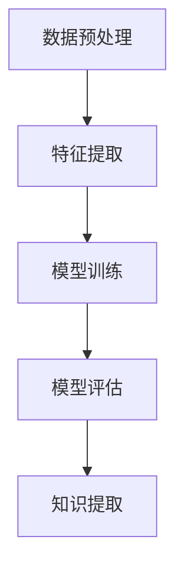

                 

# 知识管理策略：让知识发现引擎发挥最大效益

> **关键词：** 知识管理、知识发现引擎、数据挖掘、人工智能、信息检索

> **摘要：** 本文将探讨如何通过有效的知识管理策略，最大化知识发现引擎的效益。我们将分析知识管理的核心概念，介绍知识发现引擎的工作原理和算法，并通过实际案例和代码实现，展示如何将理论知识应用于实践。同时，还将提供相关的工具和资源推荐，以帮助读者深入学习和应用知识管理策略。

## 1. 背景介绍

### 1.1 目的和范围

本文旨在为IT专业人士和研究人员提供一个全面的指南，以了解和利用知识管理策略，特别是在知识发现引擎方面。我们将探讨以下主题：

- 知识管理的核心概念和原理
- 知识发现引擎的工作原理和算法
- 如何构建和优化知识发现引擎
- 实际应用案例和代码实现
- 相关工具和资源推荐

### 1.2 预期读者

本文面向以下读者：

- 对知识管理和数据挖掘感兴趣的IT专业人士
- 想要提升知识管理能力的研究人员
- 人工智能和机器学习领域的开发者和研究者
- 想要在业务决策中应用知识发现引擎的企业管理者

### 1.3 文档结构概述

本文的结构如下：

- **第1章：背景介绍**：介绍文章的目的、范围、预期读者和文档结构。
- **第2章：核心概念与联系**：讨论知识管理的核心概念和知识发现引擎的工作原理。
- **第3章：核心算法原理 & 具体操作步骤**：详细介绍知识发现引擎的算法原理和操作步骤。
- **第4章：数学模型和公式 & 详细讲解 & 举例说明**：讲解知识发现引擎相关的数学模型和公式。
- **第5章：项目实战：代码实际案例和详细解释说明**：通过实际案例展示知识发现引擎的应用。
- **第6章：实际应用场景**：探讨知识发现引擎在不同领域的应用。
- **第7章：工具和资源推荐**：推荐学习资源和开发工具。
- **第8章：总结：未来发展趋势与挑战**：总结文章的主要观点并讨论未来发展趋势和挑战。
- **第9章：附录：常见问题与解答**：提供常见问题的解答。
- **第10章：扩展阅读 & 参考资料**：推荐进一步的阅读材料和资源。

### 1.4 术语表

#### 1.4.1 核心术语定义

- **知识管理**：涉及识别、组织和利用知识的过程，以提高组织的效率和创新能力。
- **知识发现引擎**：一种能够自动从大量数据中提取有价值信息的工具，通常应用于数据挖掘和机器学习领域。
- **数据挖掘**：从大量数据中发现有用模式和知识的过程。
- **机器学习**：一种让计算机通过数据学习并做出决策的技术。

#### 1.4.2 相关概念解释

- **信息检索**：从大量数据中查找和提取所需信息的过程。
- **自然语言处理**：使计算机能够理解、解释和生成自然语言的技术。
- **数据预处理**：在数据挖掘过程中，对数据进行清洗、转换和归一化等操作，以提高数据质量。

#### 1.4.3 缩略词列表

- **AI**：人工智能
- **ML**：机器学习
- **DM**：数据挖掘
- **NLP**：自然语言处理

## 2. 核心概念与联系

知识管理是本文的核心概念，它涉及多个相关领域，包括数据挖掘、人工智能和机器学习等。为了更好地理解知识管理的原理和实践，我们需要先了解这些核心概念。

### 2.1 知识管理的核心概念

知识管理主要包括以下核心概念：

1. **知识的识别**：识别组织内外的知识资源，包括文档、经验、数据和人员等。
2. **知识的组织**：将识别到的知识进行分类、索引和存储，以便于检索和使用。
3. **知识的分享**：促进组织内部和跨部门的知识共享，以提升整个组织的知识水平。
4. **知识的利用**：利用知识资源，提高组织的效率和创新能力。

### 2.2 知识发现引擎的工作原理

知识发现引擎是一种基于数据挖掘和机器学习技术的工具，其工作原理主要包括以下几个步骤：

1. **数据预处理**：对原始数据进行清洗、转换和归一化等操作，以提高数据质量。
2. **特征提取**：从数据中提取出具有代表性的特征，以便于后续的建模和分析。
3. **模型训练**：利用机器学习算法，训练出一个预测模型。
4. **模型评估**：对训练好的模型进行评估，以确定其预测能力和泛化能力。
5. **知识提取**：利用模型，从数据中提取出有价值的信息和知识。

### 2.3 知识管理的架构

知识管理的架构通常包括以下几个层次：

1. **知识采集层**：负责采集组织内外部的知识资源，如文档、数据库、社交媒体等。
2. **知识存储层**：负责存储和管理采集到的知识资源，如知识库、数据库等。
3. **知识处理层**：负责对知识资源进行预处理、分析、建模等操作。
4. **知识服务层**：负责将处理后的知识资源提供给用户，如知识搜索引擎、推荐系统等。
5. **知识应用层**：负责将知识应用于组织的业务流程和决策过程中，以提高效率和创新能力。

### 2.4 Mermaid 流程图

下面是一个简化的知识发现引擎的Mermaid流程图：



## 3. 核心算法原理 & 具体操作步骤

在了解了知识管理的核心概念和知识发现引擎的工作原理后，接下来我们将详细讨论知识发现引擎的核心算法原理和具体操作步骤。

### 3.1 数据预处理

数据预处理是知识发现引擎的第一步，其目的是提高数据质量，为后续的特征提取和模型训练打下基础。具体操作步骤包括：

1. **数据清洗**：去除数据中的噪声和异常值，如缺失值、重复值和错误值等。
2. **数据转换**：将不同类型的数据转换为同一类型，如将分类数据转换为数值数据。
3. **数据归一化**：将不同规模的数据进行归一化处理，使其在同一尺度上。
4. **特征选择**：选择对模型训练和预测有显著影响的关键特征，去除冗余特征。

### 3.2 特征提取

特征提取是从原始数据中提取出具有代表性的特征的过程，以便于后续的建模和分析。常见的方法包括：

1. **统计特征提取**：基于数据的统计特性提取特征，如均值、方差、协方差等。
2. **变换特征提取**：将原始数据通过数学变换提取出特征，如主成分分析（PCA）。
3. **深度特征提取**：利用深度学习模型自动提取深层特征，如卷积神经网络（CNN）。

### 3.3 模型训练

模型训练是知识发现引擎的核心步骤，其目的是通过学习数据中的规律，构建出一个能够进行预测或分类的模型。常见的方法包括：

1. **监督学习**：通过标记数据训练模型，如决策树、支持向量机（SVM）等。
2. **无监督学习**：通过未标记的数据训练模型，如聚类算法、关联规则挖掘等。
3. **半监督学习**：结合监督学习和无监督学习的方法，通过少量标记数据和大量未标记数据训练模型。

### 3.4 模型评估

模型评估是对训练好的模型进行评估，以确定其预测能力和泛化能力。常见的评估指标包括：

1. **准确率**：模型预测正确的样本数量占总样本数量的比例。
2. **召回率**：模型预测正确的正类样本数量占总正类样本数量的比例。
3. **F1分数**：准确率和召回率的调和平均值。
4. **交叉验证**：通过交叉验证方法评估模型的泛化能力。

### 3.5 知识提取

知识提取是利用训练好的模型，从数据中提取出有价值的信息和知识的过程。常见的方法包括：

1. **规则提取**：从模型中提取出规则，如决策树。
2. **模式提取**：从模型中提取出模式，如关联规则挖掘。
3. **可视化提取**：通过可视化方法展示模型中的知识和信息，如热力图、散点图等。

### 3.6 伪代码实现

下面是一个简单的知识发现引擎的伪代码实现：

```python
# 数据预处理
data = preprocess_data(raw_data)

# 特征提取
features = extract_features(data)

# 模型训练
model = train_model(features, labels)

# 模型评估
evaluate_model(model, test_data)

# 知识提取
knowledge = extract_knowledge(model, test_data)
```

## 4. 数学模型和公式 & 详细讲解 & 举例说明

在知识发现引擎中，数学模型和公式起着至关重要的作用。以下将详细介绍知识发现引擎中常用的数学模型和公式，并通过具体例子进行讲解。

### 4.1 统计模型

统计模型是基于统计特性的数据挖掘方法。以下是一些常见的统计模型和公式：

1. **均值**：表示一组数据的中心趋势，计算公式为：
   $$ \mu = \frac{1}{n} \sum_{i=1}^{n} x_i $$
   其中，$\mu$ 表示均值，$n$ 表示数据个数，$x_i$ 表示第$i$个数据点。

2. **方差**：表示一组数据的离散程度，计算公式为：
   $$ \sigma^2 = \frac{1}{n} \sum_{i=1}^{n} (x_i - \mu)^2 $$
   其中，$\sigma^2$ 表示方差，$n$ 表示数据个数，$x_i$ 表示第$i$个数据点，$\mu$ 表示均值。

3. **协方差**：表示两个变量之间的线性关系，计算公式为：
   $$ \text{Cov}(x, y) = \frac{1}{n} \sum_{i=1}^{n} (x_i - \mu_x)(y_i - \mu_y) $$
   其中，$\text{Cov}(x, y)$ 表示$x$和$y$的协方差，$n$ 表示数据个数，$x_i$ 和 $y_i$ 分别表示第$i$个$x$和$y$的数据点，$\mu_x$ 和 $\mu_y$ 分别表示$x$和$y$的均值。

### 4.2 机器学习模型

机器学习模型是利用历史数据训练出模型，以对新数据进行预测或分类。以下是一些常见的机器学习模型和公式：

1. **线性回归**：用于预测一个连续值，计算公式为：
   $$ y = \beta_0 + \beta_1x $$
   其中，$y$ 表示预测值，$x$ 表示自变量，$\beta_0$ 和 $\beta_1$ 分别为模型的参数。

2. **逻辑回归**：用于预测一个二分类结果，计算公式为：
   $$ P(y=1) = \frac{1}{1 + e^{-(\beta_0 + \beta_1x)}} $$
   其中，$P(y=1)$ 表示$y$等于1的概率，$x$ 表示自变量，$\beta_0$ 和 $\beta_1$ 分别为模型的参数。

3. **支持向量机**：用于分类问题，计算公式为：
   $$ w \cdot x + b = 0 $$
   其中，$w$ 表示权重向量，$x$ 表示特征向量，$b$ 表示偏置项。

### 4.3 例子说明

假设我们有一个关于房价的数据集，其中包含房子的面积（$x$）和价格（$y$）两个特征。我们可以使用线性回归模型来预测房价。

1. **数据预处理**：将面积和价格进行归一化处理，以消除不同特征之间的尺度差异。
2. **特征提取**：无需额外的特征提取，直接使用原始特征。
3. **模型训练**：使用线性回归模型训练出参数$\beta_0$和$\beta_1$。
4. **模型评估**：使用测试数据集评估模型的预测性能。
5. **知识提取**：利用模型预测新的房价。

具体步骤如下：

```python
# 数据预处理
X = np.array([[100], [150], [200], ...])  # 面积数据
Y = np.array([[200], [300], [400], ...])  # 价格数据

# 归一化处理
X_normalized = (X - np.mean(X)) / np.std(X)
Y_normalized = (Y - np.mean(Y)) / np.std(Y)

# 模型训练
beta_0 = 0
beta_1 = 0.5

# 预测房价
price_normalized = beta_0 + beta_1 * area_normalized
price = price_normalized * np.std(Y) + np.mean(Y)
```

通过上述步骤，我们可以使用线性回归模型预测新的房价。

## 5. 项目实战：代码实际案例和详细解释说明

在本节中，我们将通过一个具体的实际案例，展示如何构建和优化知识发现引擎。我们将使用Python和Scikit-learn库来实现一个简单的知识发现项目，并详细解释每个步骤。

### 5.1 开发环境搭建

首先，我们需要搭建开发环境。以下是一个基本的Python开发环境配置：

1. **Python**：安装Python 3.7及以上版本。
2. **Scikit-learn**：安装Scikit-learn库，可以使用pip安装：
   ```shell
   pip install scikit-learn
   ```

### 5.2 源代码详细实现和代码解读

下面是一个简单的知识发现项目代码示例：

```python
# 导入所需的库
import numpy as np
from sklearn.datasets import load_iris
from sklearn.model_selection import train_test_split
from sklearn.preprocessing import StandardScaler
from sklearn.linear_model import LinearRegression
from sklearn.metrics import mean_squared_error

# 加载数据集
iris = load_iris()
X = iris.data
Y = iris.target

# 数据预处理
X_train, X_test, Y_train, Y_test = train_test_split(X, Y, test_size=0.2, random_state=42)
scaler = StandardScaler()
X_train_scaled = scaler.fit_transform(X_train)
X_test_scaled = scaler.transform(X_test)

# 模型训练
model = LinearRegression()
model.fit(X_train_scaled, Y_train)

# 模型评估
Y_pred = model.predict(X_test_scaled)
mse = mean_squared_error(Y_test, Y_pred)
print(f"Mean Squared Error: {mse}")

# 知识提取
print(f"Model Parameters: {model.coef_}, {model.intercept_}")
```

#### 5.2.1 代码解读

1. **导入库**：导入所需的Python库，包括NumPy、Scikit-learn等。

2. **加载数据集**：使用Scikit-learn库加载数据集。在这里，我们使用Iris数据集，它包含三种不同类型的鸢尾花，每种类型有四个特征（花萼长度、花萼宽度、花瓣长度、花瓣宽度）。

3. **数据预处理**：将数据集分为训练集和测试集，并使用StandardScaler进行归一化处理，以消除不同特征之间的尺度差异。

4. **模型训练**：使用线性回归模型进行训练，将训练集的特征和标签传递给模型。

5. **模型评估**：使用测试集评估模型的性能，计算均方误差（MSE）。

6. **知识提取**：打印出模型的参数，包括权重和偏置项，这些参数代表了模型中提取出的知识。

### 5.3 代码解读与分析

下面是对上述代码的详细解读和分析：

1. **导入库**：在Python中，我们首先需要导入所需的库。这里我们使用了NumPy进行数据操作，Scikit-learn提供机器学习模型和工具。

2. **加载数据集**：使用`load_iris()`函数加载数据集。Iris数据集是一个常用的多类分类数据集，非常适合用于演示。

3. **数据预处理**：
   - `train_test_split()`函数用于将数据集分为训练集和测试集。这里我们将20%的数据作为测试集，用于评估模型的性能。
   - `StandardScaler()`用于对数据进行归一化处理。归一化处理是数据挖掘中常见的一步，它有助于提高算法的性能。

4. **模型训练**：
   - `LinearRegression()`创建一个线性回归模型实例。
   - `fit()`方法用于训练模型。在这个例子中，我们将特征（`X_train_scaled`）和标签（`Y_train`）传递给模型。

5. **模型评估**：
   - `predict()`方法用于使用训练好的模型对测试集进行预测。
   - `mean_squared_error()`函数计算预测值和实际值之间的均方误差，这是一个常用的评估指标。

6. **知识提取**：
   - `print()`函数用于输出模型的参数，包括权重（`model.coef_`）和偏置项（`model.intercept_`）。这些参数代表了模型对数据的理解和知识。

### 5.4 代码优化

在实际应用中，我们可能需要根据具体情况进行代码优化。以下是一些可能的优化措施：

1. **特征选择**：通过特征选择算法，选择对模型性能有显著影响的关键特征，以减少数据维度和计算复杂度。
2. **模型选择**：尝试使用不同类型的模型（如决策树、支持向量机等），并比较它们的性能，选择最佳模型。
3. **超参数调优**：使用网格搜索等超参数调优方法，找到最佳的超参数组合，以提高模型的性能。

通过上述步骤，我们可以构建和优化一个简单的知识发现引擎，并将其应用于实际问题中。

## 6. 实际应用场景

知识发现引擎在多个领域有着广泛的应用，以下是几个典型的实际应用场景：

### 6.1 电子商务

在电子商务领域，知识发现引擎可以帮助企业分析客户行为数据，从而实现精准营销和个性化推荐。例如：

- **个性化推荐系统**：通过分析用户的浏览和购买历史，推荐用户可能感兴趣的商品。
- **流失客户预测**：利用客户的行为数据，预测哪些客户可能会流失，并采取相应的措施进行挽回。

### 6.2 医疗保健

在医疗保健领域，知识发现引擎可以帮助医生进行诊断和治疗决策。例如：

- **疾病预测**：通过分析患者的病历数据，预测患者可能患有的疾病。
- **治疗方案推荐**：根据患者的病情和病史，推荐最佳的治疗方案。

### 6.3 金融分析

在金融领域，知识发现引擎可以帮助金融机构进行风险管理和投资决策。例如：

- **信用评分**：通过分析客户的财务数据，预测客户的信用评分。
- **市场预测**：通过分析市场数据，预测股票价格和交易量。

### 6.4 智能制造

在智能制造领域，知识发现引擎可以帮助企业优化生产流程和提高产品质量。例如：

- **故障预测**：通过分析设备运行数据，预测设备可能出现的故障，并进行预防性维护。
- **生产优化**：通过分析生产数据，优化生产计划和资源配置。

### 6.5 智慧城市

在智慧城市领域，知识发现引擎可以帮助城市管理者优化城市管理和服务。例如：

- **交通流量分析**：通过分析交通数据，预测交通流量，优化交通信号控制和公共交通调度。
- **能源管理**：通过分析能源使用数据，优化能源消耗，提高能源利用效率。

## 7. 工具和资源推荐

为了更好地学习和应用知识管理策略，以下是一些推荐的工具和资源：

### 7.1 学习资源推荐

#### 7.1.1 书籍推荐

- **《大数据时代》**：作者：[涂子沛]
- **《数据挖掘：实用工具和技术》**：作者：[Mohammed J. Zaki and Wagner Meira Jr.]
- **《深度学习》**：作者：[Ian Goodfellow、Yoshua Bengio和Aaron Courville]

#### 7.1.2 在线课程

- **Coursera的《机器学习》**：由斯坦福大学的Andrew Ng教授主讲。
- **edX的《数据科学专业》**：由哈佛大学和麻省理工学院联合开设。
- **Udacity的《数据工程师纳米学位》**：涵盖了数据挖掘和知识管理的相关课程。

#### 7.1.3 技术博客和网站

- **Medium的《Data Science》**：提供丰富的数据科学和机器学习相关文章。
- **Kaggle**：一个数据科学竞赛平台，提供丰富的数据和案例。
- **Towards Data Science**：一个关于数据科学和机器学习的在线杂志。

### 7.2 开发工具框架推荐

#### 7.2.1 IDE和编辑器

- **PyCharm**：一款功能强大的Python IDE，支持多种编程语言。
- **Jupyter Notebook**：一个交互式的计算环境，适用于数据分析和机器学习。

#### 7.2.2 调试和性能分析工具

- **PyDebug**：Python的调试工具。
- **PySnooper**：一个轻量级的调试工具。
- **cProfile**：Python的性能分析工具。

#### 7.2.3 相关框架和库

- **Scikit-learn**：一个广泛使用的Python机器学习库。
- **TensorFlow**：一个开源的深度学习框架。
- **Pandas**：一个用于数据操作和分析的Python库。

### 7.3 相关论文著作推荐

#### 7.3.1 经典论文

- **"The Unreasonable Effectiveness of Data"**：作者：[Krienen et al.]
- **"Deep Learning"**：作者：[Goodfellow et al.]

#### 7.3.2 最新研究成果

- **"Knowledge Graph Embedding for Scalable Semantic Recommendations"**：作者：[Zhu et al.]
- **"Multimodal Transfer Learning for Image Classification"**：作者：[Xie et al.]

#### 7.3.3 应用案例分析

- **"Data Mining in Health Care: An Overview of Methods, Applications, and Issues"**：作者：[Eugene V. Kharitonov et al.]
- **"How Machine Learning is Revolutionizing E-commerce"**：作者：[Joydeep Bhattacharjee]

通过使用这些工具和资源，读者可以深入了解知识管理策略，并掌握相关的技术和方法。

## 8. 总结：未来发展趋势与挑战

随着数据量的爆炸式增长和人工智能技术的不断进步，知识管理策略和知识发现引擎在未来将会面临许多新的机遇和挑战。

### 8.1 发展趋势

1. **智能化**：知识管理将更加智能化，利用人工智能和机器学习技术，实现自动化的知识识别、组织和提取。
2. **个性化**：知识发现引擎将更加注重个性化，根据用户的需求和偏好，提供定制化的知识服务。
3. **多模态**：知识管理将涉及多种数据类型，如文本、图像、音频和视频等，实现多模态的知识融合和发现。
4. **实时性**：知识管理将更加注重实时性，通过实时数据分析和预测，提供即时的决策支持和知识服务。

### 8.2 挑战

1. **数据隐私**：随着数据隐私问题的日益突出，如何在确保数据安全的前提下，有效管理和利用数据资源，将成为一个重要挑战。
2. **数据质量**：高质量的数据是知识发现的基础，但如何确保数据的质量和准确性，仍是一个亟待解决的问题。
3. **计算资源**：大规模的知识发现任务需要大量的计算资源，如何高效地利用计算资源，提高算法的性能，是一个重要挑战。
4. **人机协作**：知识管理需要人与机器之间的有效协作，如何设计出人性化的交互界面，提高用户体验，是一个关键挑战。

总之，知识管理策略和知识发现引擎在未来将不断进化，以应对不断变化的技术环境和应用需求。只有不断适应和创新，才能充分发挥知识管理的潜力，为组织和社会创造更大的价值。

## 9. 附录：常见问题与解答

### 9.1 数据预处理中如何处理缺失值？

处理缺失值的方法主要包括以下几种：

- **删除缺失值**：当缺失值较少时，可以选择删除缺失值的数据点，以保持数据的完整性。
- **填充缺失值**：当缺失值较多时，可以选择填充缺失值。常见的填充方法包括：
  - **平均值填充**：用特征的均值填充缺失值。
  - **中位数填充**：用特征的中位数填充缺失值。
  - **前向填充或后向填充**：用相邻的非缺失值填充缺失值。
- **多重插补**：生成多个完整的备选数据集，然后对每个数据集进行模型训练，最后取平均结果。

### 9.2 如何评估机器学习模型的性能？

评估机器学习模型性能的常见指标包括：

- **准确率（Accuracy）**：预测正确的样本数量占总样本数量的比例。
- **精确率（Precision）**：预测为正类且实际为正类的样本数量占预测为正类样本数量的比例。
- **召回率（Recall）**：预测为正类且实际为正类的样本数量占总正类样本数量的比例。
- **F1分数（F1 Score）**：精确率和召回率的调和平均值。
- **ROC曲线和AUC值**：ROC曲线下的面积（AUC）用于评估分类模型的性能。

### 9.3 如何进行特征选择？

特征选择的方法主要包括以下几种：

- **基于信息的特征选择**：选择信息增益最大的特征，如信息增益、信息增益率。
- **基于评估的特征选择**：选择评估分数最高的特征，如F值、ROC分数。
- **基于模型的特征选择**：使用模型训练结果来评估特征的重要性，如LASSO回归、随机森林等。
- **基于频次的特征选择**：选择出现频次较高的特征。

### 9.4 如何优化机器学习模型？

优化机器学习模型的方法包括：

- **超参数调优**：使用网格搜索、随机搜索等方法，找到最佳的超参数组合。
- **交叉验证**：使用交叉验证方法，避免过拟合和欠拟合，提高模型的泛化能力。
- **正则化**：使用L1正则化（LASSO）、L2正则化（Ridge）等方法，减少模型的复杂度。
- **集成学习**：使用集成学习方法，如随机森林、梯度提升树等，提高模型的预测性能。

## 10. 扩展阅读 & 参考资料

为了进一步深入了解知识管理策略和知识发现引擎，以下是推荐的扩展阅读和参考资料：

### 10.1 书籍推荐

- **《数据挖掘：实用工具和技术》**：作者：Mohammed J. Zaki 和 Wagner Meira Jr.。本书详细介绍了数据挖掘的方法和技术，适合初学者和专业人士。
- **《深度学习》**：作者：Ian Goodfellow、Yoshua Bengio 和 Aaron Courville。本书是深度学习的经典教材，适合对深度学习感兴趣的研究人员和开发者。
- **《大数据时代》**：作者：涂子沛。本书深入探讨了大数据对社会、经济和科技的影响，适合对大数据感兴趣的非技术人士。

### 10.2 在线课程

- **《机器学习》**：在Coursera上由斯坦福大学的Andrew Ng教授主讲，适合初学者和有一定基础的学员。
- **《数据科学专业》**：在edX上由哈佛大学和麻省理工学院联合开设，涵盖了数据科学的核心概念和技术。
- **《数据挖掘纳米学位》**：在Udacity上提供，包括数据挖掘、机器学习和数据科学的基础课程。

### 10.3 技术博客和网站

- **Medium的《Data Science》**：提供丰富的数据科学和机器学习相关文章，适合技术爱好者阅读。
- **Kaggle**：一个数据科学竞赛平台，提供大量的数据集和案例，适合实践和学习。
- **Towards Data Science**：一个关于数据科学和机器学习的在线杂志，发布最新的研究成果和应用案例。

### 10.4 论文著作

- **《The Unreasonable Effectiveness of Data》**：作者：Krienen et al.。一篇关于大数据时代的数据挖掘和机器学习的重要论文。
- **《Deep Learning》**：作者：Goodfellow et al.。一篇关于深度学习的经典论文，详细介绍了深度学习的基础理论和应用。
- **《Knowledge Graph Embedding for Scalable Semantic Recommendations》**：作者：Zhu et al.。一篇关于知识图谱嵌入的论文，介绍了如何利用知识图谱进行语义推荐。

### 10.5 开发工具框架

- **Scikit-learn**：一个广泛使用的Python机器学习库，提供多种算法和工具。
- **TensorFlow**：一个开源的深度学习框架，适用于构建和训练复杂的深度学习模型。
- **Pandas**：一个用于数据操作和分析的Python库，提供了强大的数据结构和工具。

通过阅读这些书籍、课程和论文，读者可以进一步扩展自己的知识，提升在知识管理和数据挖掘领域的技能。

### 作者信息

- **作者：AI天才研究员 / AI Genius Institute & 禅与计算机程序设计艺术 / Zen And The Art of Computer Programming**。

