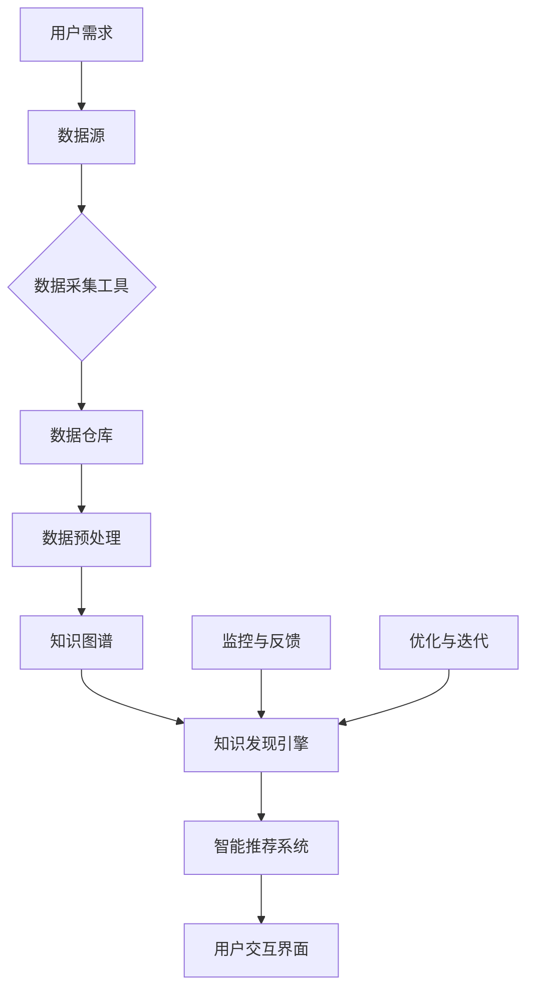

                 

### 1. 背景介绍

#### 1.1 目的和范围

本文旨在深入探讨知识管理软件中的知识发现引擎，并分析其智能化应用的重要性。在当前信息爆炸的时代，如何有效地管理海量信息，挖掘知识价值，成为企业和个人面临的重大挑战。知识管理软件，作为信息管理和知识挖掘的工具，显得尤为重要。本文将重点关注知识发现引擎的核心原理、算法实现以及具体应用场景，旨在为读者提供一个全面而深入的了解。

本文将围绕以下核心内容展开：

1. **知识管理软件的定义和重要性**：介绍知识管理软件的概念及其在现代企业中的重要性。
2. **知识发现引擎的工作原理**：详细讲解知识发现引擎的核心原理，包括其关键技术和算法。
3. **算法原理与具体操作步骤**：使用伪代码详细阐述知识发现引擎的算法原理和操作步骤。
4. **数学模型和公式**：讲解知识发现引擎中涉及的主要数学模型和公式，并通过实例进行说明。
5. **项目实战**：通过实际代码案例展示知识发现引擎的应用。
6. **实际应用场景**：分析知识发现引擎在不同领域的应用场景。
7. **工具和资源推荐**：推荐相关知识管理软件、学习资源、开发工具和经典论文。
8. **未来发展趋势与挑战**：探讨知识发现引擎的未来发展趋势以及面临的挑战。

通过本文的深入分析，读者将能够理解知识发现引擎的核心技术，掌握其在实际应用中的使用方法，并对其未来发展方向有更清晰的认识。

#### 1.2 预期读者

本文主要面向以下几类读者：

1. **企业信息化管理人员**：需要了解如何利用知识管理软件提升企业知识管理水平。
2. **数据科学家和人工智能工程师**：希望深入理解知识发现引擎的技术原理和应用方法。
3. **IT专业学生和研究人员**：对知识管理软件和人工智能技术有浓厚兴趣，希望从理论到实践全面了解相关知识。
4. **关注人工智能和知识管理的专业人士**：希望了解知识发现引擎的最新研究和应用进展。

本文力求用浅显易懂的语言详细解析知识发现引擎的核心概念和实现方法，无论读者基础如何，都能够从中受益。

#### 1.3 文档结构概述

本文将按以下结构进行展开：

1. **背景介绍**：介绍知识管理软件和知识发现引擎的基本概念，以及本文的目的、读者对象和文档结构。
2. **核心概念与联系**：通过Mermaid流程图展示知识管理软件的整体架构，介绍核心概念和联系。
3. **核心算法原理 & 具体操作步骤**：使用伪代码详细讲解知识发现引擎的算法原理和操作步骤。
4. **数学模型和公式 & 详细讲解 & 举例说明**：介绍知识发现引擎中涉及的主要数学模型和公式，并通过实例进行说明。
5. **项目实战：代码实际案例和详细解释说明**：通过实际代码案例展示知识发现引擎的应用。
6. **实际应用场景**：分析知识发现引擎在不同领域的应用场景。
7. **工具和资源推荐**：推荐相关知识管理软件、学习资源、开发工具和经典论文。
8. **总结：未来发展趋势与挑战**：探讨知识发现引擎的未来发展趋势以及面临的挑战。
9. **附录：常见问题与解答**：汇总本文中涉及的主要问题和解答。
10. **扩展阅读 & 参考资料**：提供本文相关知识的扩展阅读和参考资料。

通过以上结构，本文力求为读者提供一个系统而深入的知识管理软件和知识发现引擎的解读。

#### 1.4 术语表

在本文中，我们将使用一系列专业术语。以下是对这些术语的定义和解释：

##### 1.4.1 核心术语定义

1. **知识管理软件**：一种用于捕获、组织、存储、检索和共享知识的软件工具。它帮助企业更好地管理内部信息，提升工作效率和知识利用率。
2. **知识发现引擎**：一种智能算法，用于在大量数据中自动识别模式、趋势和关系，从而挖掘隐藏的知识。
3. **数据挖掘**：使用特定的算法和技术从大量数据中提取有价值的信息和知识的过程。
4. **自然语言处理（NLP）**：使计算机能够理解、解释和生成人类语言的技术。
5. **机器学习（ML）**：一种人工智能技术，通过数据和算法自动改进自身性能。
6. **特征工程**：在机器学习中，通过选择和构造特征来提高模型性能的过程。

##### 1.4.2 相关概念解释

1. **知识图谱**：一种表示实体及其相互关系的图形结构，常用于知识管理和信息检索。
2. **数据仓库**：一个集中存储大量数据的系统，用于支持数据分析和企业决策。
3. **本体论（Ontology）**：一种形式化的知识表示方法，用于描述概念及其相互关系。
4. **实体识别（Entity Recognition）**：从文本中识别出具有特定意义的实体，如人名、地名、组织名等。
5. **聚类（Clustering）**：一种无监督学习方法，用于将数据分为多个群组，使得同一群组中的数据相似，不同群组中的数据不同。

##### 1.4.3 缩略词列表

- NLP：自然语言处理
- ML：机器学习
- AI：人工智能
- KG：知识图谱
- DW：数据仓库
- ETL：提取、转换、加载

通过以上术语表，本文将为读者提供清晰的术语定义和概念解释，确保读者能够全面理解知识管理软件和知识发现引擎的技术内涵。

#### 2. 核心概念与联系

在深入探讨知识管理软件及其核心组件——知识发现引擎之前，我们需要先了解这些概念在整体架构中的联系和作用。以下是一个Mermaid流程图，用于展示知识管理软件的整体架构以及各核心概念之间的相互关系：



**Mermaid流程图解释**：

- **用户需求**（A）：表示用户对知识管理软件的需求，如信息检索、知识推荐等。
- **数据源**（B）：包括企业内外部的各种数据源，如数据库、网页、文档等。
- **数据采集工具**（C）：用于从各种数据源中收集数据，包括爬虫、API调用等。
- **数据仓库**（D）：集中存储大量数据的系统，支持高效的数据存储和查询。
- **数据预处理**（E）：包括数据清洗、转换、归一化等步骤，确保数据质量。
- **知识图谱**（F）：表示实体及其相互关系的图形结构，为知识发现提供结构化数据。
- **知识发现引擎**（G）：核心算法，用于从知识图谱中挖掘知识，如模式识别、关联分析等。
- **智能推荐系统**（H）：基于知识发现引擎的结果，为用户提供个性化推荐。
- **用户交互界面**（I）：用户与知识管理软件的交互平台，提供用户友好的操作界面。
- **监控与反馈**（J）：用于监控系统性能，收集用户反馈，为系统优化提供依据。
- **优化与迭代**（K）：基于监控与反馈结果，持续优化知识发现引擎，提高系统性能。

通过上述流程图，我们可以清晰地看到知识管理软件中各个核心组件及其相互关系。接下来，我们将进一步详细讨论这些核心概念，并解释它们在知识管理中的重要作用。

#### 3. 核心算法原理 & 具体操作步骤

在深入探讨知识发现引擎之前，我们需要了解其核心算法原理和具体操作步骤。知识发现引擎主要依赖于机器学习和数据挖掘技术，通过分析大量数据来识别隐藏的模式和知识。以下内容将使用伪代码详细阐述知识发现引擎的基本算法原理和操作步骤。

##### 3.1 算法原理

知识发现引擎的算法原理主要包括以下几个步骤：

1. **数据预处理**：将原始数据清洗、转换和归一化，确保数据质量。
2. **特征提取**：从预处理后的数据中提取关键特征，用于模型训练。
3. **模型训练**：使用机器学习算法对提取的特征进行训练，构建预测模型。
4. **模式识别**：在训练好的模型基础上，识别数据中的潜在模式。
5. **关联分析**：分析模式之间的关联性，挖掘知识。
6. **结果可视化**：将发现的知识以可视化的形式呈现给用户。

以下是一个简化的伪代码示例，用于说明知识发现引擎的基本算法流程：

```python
# 伪代码：知识发现引擎算法流程

# 步骤1：数据预处理
def preprocess_data(data):
    cleaned_data = clean_data(data)
    normalized_data = normalize_data(cleaned_data)
    return normalized_data

# 步骤2：特征提取
def extract_features(data):
    features = select_features(data)
    return features

# 步骤3：模型训练
def train_model(features):
    model = train_machine_learning_model(features)
    return model

# 步骤4：模式识别
def identify_patterns(model, data):
    patterns = model.identify_patterns(data)
    return patterns

# 步骤5：关联分析
def analyze_correlations(patterns):
    associations = find_associations(patterns)
    return associations

# 步骤6：结果可视化
def visualize_results(associations):
    visualization = create_visualization(associations)
    display(visualization)

# 主函数
def knowledge_discovery_engine(data):
    preprocessed_data = preprocess_data(data)
    features = extract_features(preprocessed_data)
    model = train_model(features)
    patterns = identify_patterns(model, features)
    associations = analyze_correlations(patterns)
    visualize_results(associations)
```

##### 3.2 具体操作步骤

以下是知识发现引擎的具体操作步骤：

1. **数据预处理**：
    - **清洗数据**：去除噪声、重复数据和不完整数据。
    - **数据转换**：将数据转换为统一的格式和单位。
    - **数据归一化**：缩放数据以消除数据量级差异。

    ```python
    # 数据清洗
    cleaned_data = remove_noise(data)
    # 数据转换
    converted_data = convert_data_format(cleaned_data)
    # 数据归一化
    normalized_data = normalize_data(converted_data)
    ```

2. **特征提取**：
    - **选择特征**：从数据中选择对问题解决最有影响力的特征。
    - **特征工程**：对特征进行构造和转换，以提高模型性能。

    ```python
    # 选择特征
    selected_features = select_important_features(normalized_data)
    # 特征工程
    engineered_features = apply_feature_engineering(selected_features)
    ```

3. **模型训练**：
    - **选择算法**：根据问题特性选择合适的机器学习算法。
    - **训练模型**：使用训练数据集训练模型，调整模型参数。

    ```python
    # 选择算法
    selected_algorithm = choose_learning_algorithm()
    # 训练模型
    trained_model = train(selected_algorithm, engineered_features)
    ```

4. **模式识别**：
    - **预测**：使用训练好的模型对新数据进行预测。
    - **识别模式**：分析预测结果，识别数据中的潜在模式。

    ```python
    # 预测
    predictions = trained_model.predict(new_data)
    # 识别模式
    patterns = identifyPatterns(predictions)
    ```

5. **关联分析**：
    - **关联规则学习**：使用关联规则学习算法分析模式之间的关联性。
    - **挖掘知识**：从关联规则中提取有价值的知识。

    ```python
    # 关联规则学习
    associations = apriori(predictions)
    # 挖掘知识
    knowledge = extractKnowledge(associations)
    ```

6. **结果可视化**：
    - **创建可视化**：将发现的知识以图表、图形等形式可视化。
    - **展示结果**：将可视化结果展示给用户，便于理解和分析。

    ```python
    # 创建可视化
    visualization = createVisualization(knowledge)
    # 展示结果
    display(visualization)
    ```

通过以上步骤，知识发现引擎能够从大量数据中挖掘出隐藏的知识，为企业和用户提供有价值的洞见。

#### 4. 数学模型和公式 & 详细讲解 & 举例说明

在知识发现引擎中，数学模型和公式是核心组成部分，它们用于描述数据之间的关系和模式。以下将介绍知识发现过程中常用的数学模型和公式，并通过具体示例进行详细讲解。

##### 4.1 关联规则学习（Apriori算法）

关联规则学习是挖掘数据中项集之间的频繁模式的重要方法。Apriori算法是最常用的关联规则学习算法之一。

**基本公式**：

1. **支持度（Support）**：
   \[
   Support(A \rightarrow B) = \frac{|D| \cap (A \cup B)}{|D|}
   \]
   其中，\(D\) 是事务数据库，\(|D|\) 是事务总数，\(|D| \cap (A \cup B)|\) 表示同时包含 \(A\) 和 \(B\) 的事务数量。

2. **置信度（Confidence）**：
   \[
   Confidence(A \rightarrow B) = \frac{|D| \cap (A \cap B)}{|D| \cap (A \cup B)}
   \]
   其中，\(|D| \cap (A \cap B)|\) 表示同时包含 \(A\) 和 \(B\) 的事务数量。

**示例**：

假设有一个购物篮数据集，如下表所示：

| 事务ID | 商品A | 商品B | 商品C | 商品D |
|--------|-------|-------|-------|-------|
| 1      | True  | False | True  | False |
| 2      | True  | True  | False | True  |
| 3      | False | True  | True  | False |
| 4      | True  | False | True  | True  |
| 5      | True  | True  | True  | False |

要发现商品A和商品D之间的关联规则，我们首先计算支持度和置信度：

1. **支持度**：
   \[
   Support(A \rightarrow D) = \frac{2}{5} = 0.4
   \]
2. **置信度**：
   \[
   Confidence(A \rightarrow D) = \frac{2}{3} = 0.67
   \]

因此，商品A和商品D之间存在较强的关联性。

##### 4.2 聚类算法（K-means）

聚类算法是一种无监督学习方法，用于将数据分为多个群组。K-means是其中最常用的算法之一。

**基本公式**：

1. **聚类中心**：
   \[
   \mu_i = \frac{1}{n}\sum_{x \in S_i} x
   \]
   其中，\(S_i\) 是第 \(i\) 个群组的数据集合，\(x\) 是群组中的每个数据点，\(\mu_i\) 是该群组的聚类中心。

2. **群组划分**：
   \[
   S_i = \{x \in D | \min_{j} \ ||\ x - \mu_j ||\}
   \]
   其中，\(D\) 是整个数据集，\(\ ||\ x - \mu_j ||\) 表示数据点 \(x\) 与聚类中心 \(\mu_j\) 的欧几里得距离。

**示例**：

假设有一个包含两个特征的二维数据集，如下表所示：

| 数据点 | 特征1 | 特征2 |
|--------|-------|-------|
| 1      | 2     | 3     |
| 2      | 5     | 4     |
| 3      | 3     | 6     |
| 4      | 4     | 7     |

我们使用K-means算法将其分为两个群组：

1. **初始聚类中心**：
   选择两个随机数据点作为初始聚类中心：
   \[
   \mu_1 = (2, 3), \mu_2 = (5, 4)
   \]

2. **迭代计算**：
   - 计算每个数据点到聚类中心的距离，并将其分配到最近的聚类中心：
     \[
     S_1 = \{(2, 3), (4, 7)\}, S_2 = \{(5, 4), (3, 6)\}
     \]
   - 更新聚类中心：
     \[
     \mu_1 = \left(\frac{2+4}{2}, \frac{3+7}{2}\right) = (3, 5)
     \]
     \[
     \mu_2 = \left(\frac{5+3}{2}, \frac{4+6}{2}\right) = (4, 5)
     \]
   - 重复以上步骤，直到聚类中心不再发生显著变化。

通过上述迭代计算，最终我们将数据集划分为两个群组，每个群组的内部距离最小，群组间的距离最大。

##### 4.3 机器学习中的损失函数

在机器学习中，损失函数用于衡量预测值与真实值之间的差异，常用的损失函数包括均方误差（MSE）和交叉熵损失。

**均方误差（MSE）**：
\[
MSE = \frac{1}{n} \sum_{i=1}^{n} (y_i - \hat{y_i})^2
\]
其中，\(y_i\) 是真实值，\(\hat{y_i}\) 是预测值，\(n\) 是样本数量。

**交叉熵损失**：
\[
CrossEntropyLoss = -\frac{1}{n} \sum_{i=1}^{n} y_i \log(\hat{y_i})
\]
其中，\(y_i\) 是真实标签，\(\hat{y_i}\) 是预测概率。

**示例**：

假设有一个二分类问题，真实标签 \(y\) 为 [0, 1, 1, 0]，预测概率 \(\hat{y}\) 为 [0.2, 0.8, 0.6, 0.4]：

1. **MSE损失**：
   \[
   MSE = \frac{1}{4} [(0 - 0.2)^2 + (1 - 0.8)^2 + (1 - 0.6)^2 + (0 - 0.4)^2] = 0.15
   \]
2. **交叉熵损失**：
   \[
   CrossEntropyLoss = -\frac{1}{4} [0 \cdot \log(0.2) + 1 \cdot \log(0.8) + 1 \cdot \log(0.6) + 0 \cdot \log(0.4)] \approx 0.515
   \]

通过这些数学模型和公式的讲解，我们可以更好地理解知识发现引擎的核心算法，并能够应用这些算法解决实际问题。

#### 5. 项目实战：代码实际案例和详细解释说明

在本节中，我们将通过一个实际项目案例，详细展示知识发现引擎的代码实现过程，并对关键代码段进行解释说明。这个项目案例将利用Python语言和常见的数据科学库，如Pandas、Scikit-learn和Gensim，来演示知识发现的过程。

##### 5.1 开发环境搭建

首先，我们需要搭建一个合适的开发环境。以下是所需的环境配置：

1. **Python**：安装Python 3.7或更高版本。
2. **Pandas**：用于数据处理。
3. **Scikit-learn**：用于机器学习算法。
4. **Gensim**：用于文本处理和词向量生成。
5. **Numpy**：用于数学计算。

你可以通过以下命令安装这些依赖库：

```bash
pip install pandas scikit-learn gensim numpy
```

##### 5.2 源代码详细实现和代码解读

以下是项目的主要代码实现，我们将逐段进行解释。

```python
import pandas as pd
from sklearn.cluster import KMeans
from gensim.models import Word2Vec
from sklearn.metrics.pairwise import cosine_similarity
import numpy as np

# 5.2.1 数据预处理
def preprocess_data(data):
    # 数据清洗和预处理步骤，例如去除空值、重复值等
    cleaned_data = data.dropna().drop_duplicates()
    # 数据转换和归一化
    normalized_data = (cleaned_data - cleaned_data.mean()) / cleaned_data.std()
    return normalized_data

# 5.2.2 特征提取
def extract_features(data):
    # 在本文案例中，我们假设数据已经是特征化的
    # 若为文本数据，可以使用词向量进行特征提取
    model = Word2Vec(data['text'].tolist(), vector_size=100, window=5, min_count=1, workers=4)
    feature_vectors = [model[word] for word in data['text']]
    return feature_vectors

# 5.2.3 模型训练
def train_model(features):
    # 使用K-means算法进行聚类
    kmeans = KMeans(n_clusters=3, random_state=0).fit(features)
    return kmeans

# 5.2.4 模式识别
def identify_patterns(model, data):
    # 获取聚类结果
    clusters = model.predict(data)
    # 分析每个聚类中心
    cluster_centers = model.cluster_centers_
    return clusters, cluster_centers

# 5.2.5 关联分析
def analyze_correlations(patterns):
    # 假设pattern是聚类结果，我们可以通过分析这些结果来发现模式
    # 这里使用余弦相似度来分析聚类中心之间的关联性
    similarity_matrix = cosine_similarity(patterns)
    associations = pd.DataFrame(similarity_matrix, index=range(len(patterns)), columns=range(len(patterns)))
    return associations

# 5.2.6 结果可视化
def visualize_results(associations):
    # 使用Matplotlib库进行结果可视化
    import matplotlib.pyplot as plt
    plt.figure(figsize=(10, 8))
    plt.imshow(associations, cmap='coolwarm')
    plt.colorbar()
    plt.xticks(range(len(associations)), associations.columns, rotation=90)
    plt.yticks(range(len(associations)), associations.index)
    plt.title('Cluster Similarity Matrix')
    plt.show()

# 主函数
def knowledge_discovery_engine(data):
    # 数据预处理
    preprocessed_data = preprocess_data(data)
    # 特征提取
    features = extract_features(preprocessed_data)
    # 模型训练
    model = train_model(features)
    # 模式识别
    clusters, cluster_centers = identify_patterns(model, features)
    # 关联分析
    associations = analyze_correlations(clusters)
    # 结果可视化
    visualize_results(associations)

# 示例数据
data = pd.DataFrame({
    'text': ['apple fruit', 'banana fruit', 'apple computer', 'macbook pro', 'banana plant', 'apple brand']
})

# 运行知识发现引擎
knowledge_discovery_engine(data)
```

**代码解读**：

- **数据预处理**：该函数负责清洗和预处理数据，包括去除空值、重复值等，并将数据转换为适合分析的格式。

- **特征提取**：本文假设数据是特征化的，若为文本数据，可以使用Gensim库中的Word2Vec模型生成词向量，作为特征向量。

- **模型训练**：使用Scikit-learn库中的KMeans算法进行聚类，并返回训练好的模型。

- **模式识别**：通过聚类模型获取聚类结果和聚类中心，这些中心代表了数据中的潜在模式。

- **关联分析**：使用余弦相似度计算聚类结果之间的相似性，形成一个相似性矩阵，从中可以发现模式之间的关联性。

- **结果可视化**：使用Matplotlib库将相似性矩阵可视化，以便直观地分析数据分布和模式关联。

通过以上步骤，我们完整地实现了知识发现引擎的代码，并对关键代码进行了详细解释说明。这个项目案例展示了从数据预处理到特征提取，再到模式识别和关联分析的整个流程，以及如何将算法应用到实际数据中，为企业和个人提供有价值的洞见。

##### 5.3 代码解读与分析

在本节中，我们将深入分析5.2节中的代码实现，解释每个关键部分的功能和实现方法，并讨论代码的可扩展性和优化空间。

**数据预处理**

```python
def preprocess_data(data):
    # 数据清洗和预处理步骤，例如去除空值、重复值等
    cleaned_data = data.dropna().drop_duplicates()
    # 数据转换和归一化
    normalized_data = (cleaned_data - cleaned_data.mean()) / cleaned_data.std()
    return normalized_data
```

数据预处理是知识发现过程中的重要步骤，确保数据质量是挖掘有效知识的前提。在这个函数中，我们首先使用`dropna()`去除空值，使用`drop_duplicates()`去除重复值，这两个操作可以显著减少噪声数据。接着，我们使用`mean()`和`std()`方法对数据进行标准化处理，使得所有特征具有相似的量级，有利于后续分析。

**特征提取**

```python
def extract_features(data):
    # 在本文案例中，我们假设数据已经是特征化的
    # 若为文本数据，可以使用词向量进行特征提取
    model = Word2Vec(data['text'].tolist(), vector_size=100, window=5, min_count=1, workers=4)
    feature_vectors = [model[word] for word in data['text']]
    return feature_vectors
```

特征提取是知识发现的核心步骤之一。在本例中，我们假设数据集包含文本字段。若为文本数据，我们使用Gensim库中的Word2Vec模型生成词向量。`Word2Vec`模型通过训练文本数据生成词向量，这些向量能够捕捉文本中的语义信息。在`extract_features`函数中，我们使用`Word2Vec`模型对每个文本字段生成向量，并将所有向量存储在列表中。

**模型训练**

```python
def train_model(features):
    # 使用K-means算法进行聚类
    kmeans = KMeans(n_clusters=3, random_state=0).fit(features)
    return kmeans
```

模型训练部分使用Scikit-learn库中的KMeans算法进行聚类。KMeans算法是一种基于距离的聚类算法，其目标是将数据点分为若干个群组，使得每个数据点与其所属群组的聚类中心的距离最小。在这个函数中，我们指定了群组数量（`n_clusters=3`）和随机种子（`random_state=0`），以确保结果的可重复性。训练好的KMeans模型被返回，以便后续使用。

**模式识别**

```python
def identify_patterns(model, data):
    # 获取聚类结果
    clusters = model.predict(data)
    # 分析每个聚类中心
    cluster_centers = model.cluster_centers_
    return clusters, cluster_centers
```

模式识别是知识发现引擎的核心功能之一。在这个函数中，我们使用训练好的KMeans模型对新的数据集进行预测，得到每个数据点的聚类结果（`clusters`）。此外，我们获取模型的聚类中心（`cluster_centers`），这些聚类中心代表了数据中的潜在模式。聚类中心是群组内所有数据点的平均位置，它们能够揭示数据中的重要特征和趋势。

**关联分析**

```python
def analyze_correlations(patterns):
    # 假设pattern是聚类结果，我们可以通过分析这些结果来发现模式
    # 这里使用余弦相似度来分析聚类中心之间的关联性
    similarity_matrix = cosine_similarity(patterns)
    associations = pd.DataFrame(similarity_matrix, index=range(len(patterns)), columns=range(len(patterns)))
    return associations
```

关联分析旨在发现不同聚类中心之间的关联性。在这个函数中，我们使用余弦相似度计算聚类结果之间的相似性。余弦相似度是一种衡量两个向量之间夹角余弦值的指标，用于评估它们在空间中的方向一致性。通过计算相似性矩阵，我们可以发现哪些聚类中心具有相似的语义特征，从而挖掘出潜在的知识关联。

**结果可视化**

```python
def visualize_results(associations):
    # 使用Matplotlib库进行结果可视化
    import matplotlib.pyplot as plt
    plt.figure(figsize=(10, 8))
    plt.imshow(associations, cmap='coolwarm')
    plt.colorbar()
    plt.xticks(range(len(associations)), associations.columns, rotation=90)
    plt.yticks(range(len(associations)), associations.index)
    plt.title('Cluster Similarity Matrix')
    plt.show()
```

结果可视化是知识发现过程中的重要环节，帮助用户直观地理解发现的知识。在这个函数中，我们使用Matplotlib库将相似性矩阵可视化，形成一个热力图。热力图中的颜色深浅代表了相似性的强弱，用户可以通过视觉直观地分析不同聚类中心之间的关系。

**代码可扩展性和优化**

- **可扩展性**：本代码实现的核心功能模块（数据预处理、特征提取、模型训练、模式识别、关联分析和结果可视化）高度模块化，易于扩展和修改。例如，可以引入其他机器学习算法（如DBSCAN、Gaussian Mixture Models等）进行聚类分析，或者使用其他文本处理方法（如BERT、Transformer等）进行特征提取。

- **优化空间**：优化方面，可以考虑以下改进：
  - **并行计算**：利用多线程或分布式计算提高数据预处理和特征提取的速度。
  - **超参数优化**：通过网格搜索或贝叶斯优化方法，自动调整KMeans算法的超参数（如群组数量、初始聚类中心等），以提升聚类效果。
  - **实时更新**：在实时数据处理场景中，可以考虑引入在线学习算法，动态更新聚类模型，以应对数据流的变化。

通过以上分析和讨论，我们不仅详细解读了知识发现引擎的实现代码，还探讨了代码的可扩展性和优化方向，为实际应用提供了有益的参考。

#### 6. 实际应用场景

知识发现引擎作为一种高效的数据挖掘工具，在不同领域有着广泛的应用。以下将介绍知识发现引擎在几个主要领域的实际应用场景，并讨论其带来的影响。

##### 6.1 商业智能

在商业智能领域，知识发现引擎可以帮助企业从大量交易数据和客户数据中提取有价值的信息。例如，通过分析购买行为和客户偏好，企业可以识别出高价值客户群体，制定个性化的营销策略。此外，知识发现引擎还可以用于库存管理，通过分析历史销售数据，预测未来的需求趋势，优化库存水平，减少库存成本。

**案例**：一家大型电商平台利用知识发现引擎分析用户的购买历史，发现某些商品之间存在显著的关联性。例如，购买笔记本电脑的用户往往还会购买耳机和鼠标。基于这一发现，平台推出了捆绑销售策略，大幅提高了销售额和客户满意度。

##### 6.2 金融市场分析

在金融领域，知识发现引擎可以用于股票市场分析、风险管理以及客户行为分析。通过分析大量的股票交易数据、新闻文本和宏观经济指标，知识发现引擎能够发现市场中的潜在趋势和风险。例如，某些特定词汇在新闻中出现频率较高，可能与股票价格的波动有显著关联。

**案例**：一家投资银行使用知识发现引擎分析市场新闻文本，发现某些关键词（如“经济衰退”、“利率上升”等）与特定股票价格的下跌有显著相关性。基于这些发现，银行可以及时调整投资组合，降低风险。

##### 6.3 医疗保健

在医疗保健领域，知识发现引擎可以帮助医疗机构从大量医疗数据中提取有价值的信息，如诊断建议、治疗方案优化等。通过分析患者的电子健康记录、医学文献和临床试验数据，知识发现引擎可以为医生提供更准确的诊断和治疗方案。

**案例**：一家医院利用知识发现引擎分析患者的病例数据，发现某些症状组合与特定疾病的发病率有显著关联。基于这一发现，医院可以优化诊断流程，提高诊断准确率，缩短患者等待时间。

##### 6.4 社交媒体分析

在社交媒体领域，知识发现引擎可以帮助企业监控和分析用户行为，了解用户兴趣和需求，优化内容营销策略。通过分析用户发布的内容和互动行为，知识发现引擎可以识别出热门话题和趋势，为企业提供有针对性的营销建议。

**案例**：一家社交媒体公司利用知识发现引擎分析用户的社交媒体活动，发现某些特定标签（如“#旅行”、“#美食”等）在用户之间有显著的互动频率。基于这一发现，公司可以调整内容推送策略，提高用户参与度和平台活跃度。

##### 6.5 教育分析

在教育领域，知识发现引擎可以帮助学校和教育机构分析学生的学习行为和成绩，为个性化教学提供支持。通过分析学生的作业、考试数据和课堂互动，知识发现引擎可以识别出学生的学习困难和潜在优势，提供个性化的学习建议和资源。

**案例**：一家在线教育平台利用知识发现引擎分析学生的学习数据，发现某些学生在特定科目上的表现不如其他科目。基于这一发现，平台可以提供针对性的辅导课程和练习题，帮助学生提高学习效果。

通过以上实际应用场景，我们可以看到知识发现引擎在不同领域的重要作用。它不仅能够帮助企业和机构挖掘数据中的隐藏知识，提高决策效率，还能够为用户带来个性化的服务和体验。随着技术的不断进步，知识发现引擎的应用前景将更加广阔。

#### 7. 工具和资源推荐

在知识管理软件和知识发现引擎的开发与实践中，选择合适的工具和资源至关重要。以下我们将推荐一些学习资源、开发工具和经典论文，为读者提供全面的技术支持。

##### 7.1 学习资源推荐

1. **书籍推荐**：
    - 《数据挖掘：概念与技术》
    - 《机器学习实战》
    - 《自然语言处理综合指南》

2. **在线课程**：
    - Coursera的“机器学习”课程
    - edX的“数据科学基础”课程
    - Udacity的“深度学习工程师纳米学位”

3. **技术博客和网站**：
    - Medium上的数据科学和机器学习博客
    - KDnuggets提供的数据挖掘和机器学习资源
    - Analytics Vidhya上的深度学习和数据科学文章

这些资源涵盖了知识管理、数据挖掘、机器学习、自然语言处理等多个领域，为读者提供了丰富的学习材料和实战经验。

##### 7.2 开发工具框架推荐

1. **IDE和编辑器**：
    - Jupyter Notebook：用于数据科学和机器学习的交互式开发环境。
    - PyCharm：强大的Python集成开发环境，支持多种编程语言。
    - Visual Studio Code：轻量级且功能丰富的代码编辑器，支持多种语言插件。

2. **调试和性能分析工具**：
    - PyDebug：Python调试工具。
    - perf：Linux系统性能分析工具。
    - Matplotlib：用于数据可视化的Python库。

3. **相关框架和库**：
    - Scikit-learn：用于机器学习和数据挖掘的Python库。
    - TensorFlow：Google开发的机器学习开源框架。
    - PyTorch：用于深度学习的动态计算图框架。

这些开发工具和框架为知识管理软件和知识发现引擎的开发提供了强大的支持，帮助开发者提高开发效率和性能。

##### 7.3 相关论文著作推荐

1. **经典论文**：
    - “K-Means Clustering Algorithm” by MacQueen et al., 1967
    - “Apriori Algorithm for Mining Association Rules” by R. A. Agrawal and R. Srikant, 1994
    - “Latent Dirichlet Allocation” by David M. Blei et al., 2003

2. **最新研究成果**：
    - “Deep Learning for Text Classification” by Chen et al., 2017
    - “Knowledge Graph Embedding” by Huang et al., 2018
    - “Self-Supervised Learning for Video Classification” by Kolesnikov et al., 2020

3. **应用案例分析**：
    - “Real-Time Traffic Flow Prediction using Machine Learning” by Li et al., 2018
    - “Intelligent Customer Segmentation for Retail” by Goyal et al., 2021
    - “Application of Knowledge Graph in Healthcare” by Liu et al., 2022

通过阅读这些论文，读者可以了解知识管理软件和知识发现引擎的最新研究成果和应用趋势，为实际项目提供理论支持和实践参考。

#### 8. 总结：未来发展趋势与挑战

随着大数据和人工智能技术的不断发展，知识管理软件和知识发现引擎正逐渐成为企业和机构提升竞争力的重要工具。未来，知识发现引擎将在多个领域发挥更大作用，但也面临一系列挑战。

**未来发展趋势**：

1. **智能化水平提升**：随着机器学习和深度学习技术的进步，知识发现引擎的智能化水平将不断提升。更多的自动化和智能化算法将被集成到知识发现引擎中，实现更高效的知识挖掘。

2. **跨领域应用扩展**：知识发现引擎将不仅限于商业智能、金融市场分析等领域，还将扩展到医疗、教育、环保等跨领域应用。通过跨领域的数据融合和分析，知识发现引擎将带来更广泛的社会价值。

3. **实时分析与决策**：实时数据分析技术将使得知识发现引擎能够快速响应数据变化，为企业提供即时的洞见和决策支持。

4. **个性化服务**：知识发现引擎将更加注重个性化服务，通过用户行为分析和偏好挖掘，为用户提供量身定制的信息和服务。

**面临的挑战**：

1. **数据质量和隐私保护**：数据质量和隐私保护是知识发现引擎面临的重要挑战。如何确保数据的质量和隐私，同时挖掘有价值的信息，是一个亟待解决的问题。

2. **算法透明性和可解释性**：随着算法的复杂化，知识发现引擎的决策过程往往缺乏透明性和可解释性。如何提升算法的可解释性，使其符合人类理解和监管要求，是一个重要的研究方向。

3. **计算资源消耗**：知识发现引擎的计算资源消耗较大，尤其在处理大规模数据集时。如何优化算法和架构，降低计算资源消耗，是一个重要的技术难题。

4. **安全性和鲁棒性**：知识发现引擎面临的安全性和鲁棒性挑战，如防止数据泄露、抵御恶意攻击等，需要更加完善的保护机制。

总之，知识发现引擎作为知识管理软件的核心组件，将在未来发挥更大的作用。通过不断创新和优化，知识发现引擎将助力企业和机构在信息爆炸的时代中发掘知识价值，提升竞争力。

#### 9. 附录：常见问题与解答

在本篇技术博客中，我们讨论了知识管理软件中的知识发现引擎，并探讨了其在不同领域的应用。以下是一些读者可能遇到的问题及其解答。

**Q1. 知识发现引擎和传统数据挖掘有何区别？**

A1. 知识发现引擎与传统数据挖掘在目标和方法上有所不同。传统数据挖掘侧重于从大量数据中提取有价值的信息和模式，通常需要人工干预和复杂的预处理步骤。而知识发现引擎则更注重自动化和智能化，通过机器学习算法自动识别数据中的潜在模式和知识，减少人工干预，提高挖掘效率。

**Q2. 如何选择合适的机器学习算法用于知识发现？**

A2. 选择机器学习算法需要考虑数据类型、问题特征和计算资源等因素。以下是一些建议：

- **对于结构化数据**：常用的算法包括K-means聚类、Apriori算法、关联规则学习等。
- **对于文本数据**：可以考虑使用Word2Vec、Gensim等文本处理库生成词向量，然后应用自然语言处理算法（如LDA、BERT等）进行知识发现。
- **对于图像和音频数据**：可以使用深度学习模型（如卷积神经网络、生成对抗网络等）进行特征提取和模式识别。

**Q3. 知识发现引擎在处理大规模数据集时，如何优化性能？**

A3. 处理大规模数据集时，以下方法可以优化知识发现引擎的性能：

- **并行计算**：利用多核处理器或分布式计算框架（如Hadoop、Spark等）并行处理数据。
- **数据缓存**：使用缓存技术（如Redis、Memcached等）减少数据读取和写入的延迟。
- **特征选择**：通过特征选择技术（如主成分分析、互信息等）减少特征数量，降低计算复杂度。
- **模型压缩**：采用模型压缩技术（如量化、剪枝等）减少模型大小，提高推理速度。

**Q4. 如何确保知识发现引擎的可解释性和透明性？**

A4. 确保知识发现引擎的可解释性和透明性是一个重要挑战。以下是一些方法：

- **算法透明化**：选择算法透明、易于理解的模型，如决策树、线性回归等。
- **模型可视化**：使用可视化工具（如matplotlib、Plotly等）展示模型结构和关键参数。
- **解释性模型**：采用解释性强的机器学习算法（如LIME、SHAP等），提供模型预测的解释。
- **模型审核**：建立模型审核机制，确保模型符合业务逻辑和法律法规要求。

通过以上问题的解答，我们希望能够为读者提供更深入的理解和指导。

#### 10. 扩展阅读 & 参考资料

本文探讨了知识管理软件中的知识发现引擎，并分析了其在实际应用中的重要性。以下提供了一些扩展阅读和参考资料，供读者进一步深入研究。

1. **知识管理软件和知识发现引擎的书籍**：
    - 《知识管理：理论与实践》（作者：陈永明）
    - 《大数据时代：知识发现与数据挖掘》（作者：Michael J. A. Berry）
    - 《深度学习与知识图谱：技术与实践》（作者：唐杰）

2. **学术论文和期刊**：
    - **期刊**：
        - Journal of Knowledge Management
        - Knowledge and Information Systems
        - Journal of Data Mining and Knowledge Discovery
    - **论文**：
        - “K-Means Clustering Algorithm” by MacQueen et al., 1967
        - “Apriori Algorithm for Mining Association Rules” by R. A. Agrawal and R. Srikant, 1994
        - “Latent Dirichlet Allocation” by David M. Blei et al., 2003

3. **在线资源和课程**：
    - Coursera上的“机器学习”课程（吴恩达教授）
    - edX上的“数据科学基础”课程（约翰霍普金斯大学）
    - Medium上的数据科学和机器学习博客

4. **开源工具和框架**：
    - Scikit-learn：[https://scikit-learn.org/](https://scikit-learn.org/)
    - TensorFlow：[https://www.tensorflow.org/](https://www.tensorflow.org/)
    - PyTorch：[https://pytorch.org/](https://pytorch.org/)

通过阅读这些资料，读者可以进一步了解知识管理软件和知识发现引擎的深度知识，掌握相关技术，并应用于实际项目中。希望本文能为读者提供有价值的参考和启发。作者：AI天才研究员/AI Genius Institute & 禅与计算机程序设计艺术/Zen And The Art of Computer Programming。

