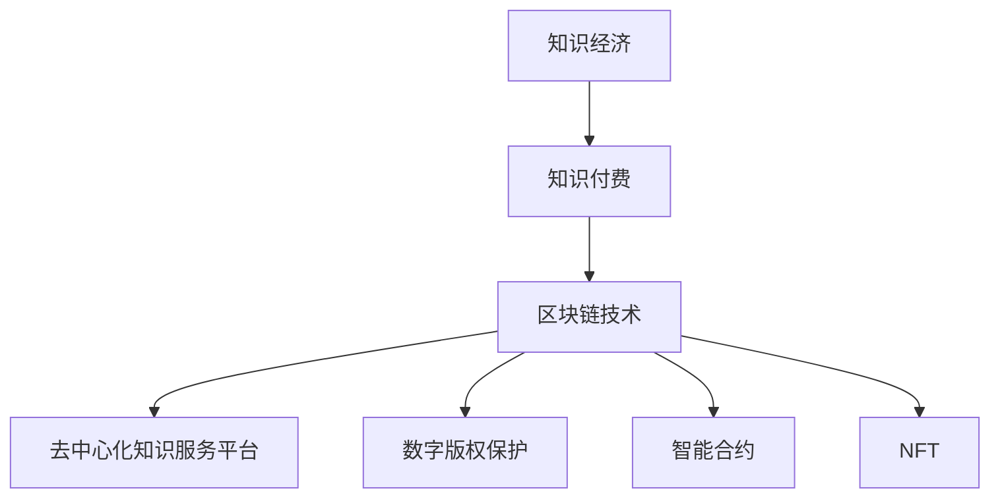

                 

# 知识经济下知识付费的区块链去中心化应用

> **关键词**：知识经济、知识付费、区块链、去中心化、应用、算法、数学模型、代码实战、实际场景、工具和资源推荐

> **摘要**：本文深入探讨了在知识经济时代，知识付费如何通过区块链技术实现去中心化的应用。文章首先介绍了知识经济和知识付费的背景，随后详细解析了区块链去中心化的原理，并结合具体算法和数学模型，阐述了其实现过程。通过代码实战和实际应用场景的案例分析，展示了区块链在知识付费领域的强大潜力。最后，本文推荐了相关学习资源、开发工具和最新研究成果，为读者提供了全面的指南。

## 1. 背景介绍

### 1.1 目的和范围

本文旨在探讨知识经济时代下，知识付费领域如何利用区块链技术实现去中心化应用。随着互联网和信息技术的飞速发展，知识经济逐渐成为全球经济的重要组成部分。知识付费作为一种新型的商业模式，正在改变传统知识传播和获取的方式。然而，当前知识付费市场存在着信息不对称、信任缺失、版权保护不力等问题。区块链技术作为一种去中心化、安全透明的技术，为解决这些问题提供了新的思路。

本文将从以下几个方面展开：

1. **核心概念与联系**：介绍知识经济、知识付费和区块链技术的基本概念，并绘制流程图展示其关联性。
2. **核心算法原理 & 具体操作步骤**：详细讲解区块链在知识付费领域的算法原理和操作步骤。
3. **数学模型和公式 & 详细讲解 & 举例说明**：运用数学模型和公式，解释区块链在知识付费中的数学原理。
4. **项目实战：代码实际案例和详细解释说明**：通过实际代码案例，展示区块链在知识付费中的具体应用。
5. **实际应用场景**：分析区块链在知识付费领域的实际应用场景。
6. **工具和资源推荐**：推荐学习资源、开发工具和相关论文。
7. **总结与展望**：总结本文内容，展望区块链在知识付费领域的未来发展趋势和挑战。

### 1.2 预期读者

本文面向对知识付费和区块链技术有一定了解的技术人员、研究者以及关心知识经济发展的专业人士。通过本文，读者可以：

1. 理解知识经济和知识付费的基本概念。
2. 掌握区块链去中心化应用在知识付费领域的原理和实践。
3. 学习相关算法、数学模型和实际代码实现。
4. 获取知识付费领域的前沿信息和最新研究成果。

### 1.3 文档结构概述

本文分为以下章节：

1. **核心概念与联系**：介绍知识经济、知识付费和区块链技术的基本概念，并绘制流程图展示其关联性。
2. **核心算法原理 & 具体操作步骤**：详细讲解区块链在知识付费领域的算法原理和操作步骤。
3. **数学模型和公式 & 详细讲解 & 举例说明**：运用数学模型和公式，解释区块链在知识付费中的数学原理。
4. **项目实战：代码实际案例和详细解释说明**：通过实际代码案例，展示区块链在知识付费中的具体应用。
5. **实际应用场景**：分析区块链在知识付费领域的实际应用场景。
6. **工具和资源推荐**：推荐学习资源、开发工具和相关论文。
7. **总结与展望**：总结本文内容，展望区块链在知识付费领域的未来发展趋势和挑战。

### 1.4 术语表

#### 1.4.1 核心术语定义

- **知识经济**：以知识为主要生产要素的经济形态。
- **知识付费**：用户为获取有价值知识内容而支付的费用。
- **区块链**：一种去中心化、分布式、不可篡改的数据存储和传输技术。
- **去中心化**：系统运行不依赖于单一中心控制，而是通过网络中的多个节点共同维护。
- **智能合约**：一种自动执行、控制或记录符合预定条件的合约。
- **非同质化代币（NFT）**：代表数字资产所有权的唯一加密资产。

#### 1.4.2 相关概念解释

- **信息不对称**：市场中存在信息不平等的现象，导致交易双方的利益受损。
- **信任缺失**：市场中参与者对其他参与者行为的可信度不高，增加了交易成本。
- **版权保护**：确保创作者对其作品享有合法权利，防止未经授权的复制和使用。

#### 1.4.3 缩略词列表

- **NFT**：非同质化代币
- **智能合约**：Smart Contract
- **去中心化**：Decentralized
- **加密货币**：Cryptocurrency
- **区块链**：Blockchain

## 2. 核心概念与联系

在深入探讨知识付费与区块链技术的结合之前，我们首先需要理解这三个核心概念的基本原理及其相互关系。

### 2.1 知识经济

知识经济是一种以知识为主要生产要素的经济形态。在知识经济中，知识的创造、传播和应用成为经济增长的主要驱动力。与传统的物质经济相比，知识经济具有高附加值、高创新性和高流动性等特点。知识经济的主要表现形式包括研发、教育、咨询、信息服务等。

### 2.2 知识付费

知识付费是指用户为获取有价值知识内容而支付的费用。在知识经济时代，知识内容成为了一种新的商品形式，用户通过付费来购买知识服务。知识付费的形式多样，包括在线课程、专业咨询、研究报告、知识产权交易等。

### 2.3 区块链技术

区块链技术是一种去中心化、分布式、不可篡改的数据存储和传输技术。它通过加密算法和共识机制，确保数据的安全性和可信度。区块链具有以下几个核心特点：

1. **去中心化**：数据存储和传输不需要依赖中心化的机构或服务器，而是由网络中的多个节点共同维护。
2. **分布式**：数据存储在分布式网络中，提高了系统的可靠性和抗攻击能力。
3. **不可篡改**：一旦数据被记录在区块链上，就很难被篡改或删除，确保了数据的一致性和可信度。
4. **透明性**：区块链上的数据对所有参与者都是可见的，增加了交易的透明度。

### 2.4 关联性

知识经济和知识付费为区块链技术的应用提供了广阔的舞台。在知识经济时代，知识内容成为了一种重要的资产，而区块链技术则提供了一种安全、透明、去中心化的方式来管理这些资产。具体来说，区块链技术在知识付费领域的应用体现在以下几个方面：

1. **去中心化的知识服务平台**：通过区块链技术，用户可以直接在平台上购买和交换知识内容，无需依赖中心化的平台。
2. **数字版权保护**：区块链技术可以记录知识内容的版权信息，确保创作者的权益得到保护。
3. **智能合约**：智能合约可以自动执行知识付费的交易，降低交易成本和风险。
4. **非同质化代币（NFT）**：NFT可以用来代表知识内容的所有权，为知识付费提供了新的形式。

### 2.5 Mermaid 流程图

为了更直观地展示这三个核心概念之间的关联性，我们使用Mermaid流程图进行表示：



### 2.6 Mermaid 流程图解析

- **A[知识经济]**：表示知识经济作为整个流程的起点。
- **B[知识付费]**：知识经济时代下，知识付费成为知识传播和获取的主要形式。
- **C[区块链技术]**：区块链技术作为知识付费领域的重要支撑技术。
- **D[去中心化知识服务平台]**：通过区块链技术，用户可以构建去中心化的知识服务平台。
- **E[数字版权保护]**：区块链技术可以记录知识内容的版权信息，保护创作者权益。
- **F[智能合约]**：智能合约可以自动执行知识付费的交易，降低风险。
- **G[NFT]**：NFT为知识付费提供了新的形式，代表知识内容的所有权。

通过上述流程图，我们可以清晰地看到知识经济、知识付费和区块链技术之间的关联性，以及区块链技术在知识付费领域的应用潜力。

## 3. 核心算法原理 & 具体操作步骤

在理解了知识经济、知识付费和区块链技术的基本概念及其关联性之后，接下来我们将深入探讨区块链在知识付费领域的核心算法原理和具体操作步骤。区块链技术的关键在于其去中心化的特性，这主要通过分布式账本、共识机制和加密技术来实现。

### 3.1 分布式账本

分布式账本是指将数据分散存储在多个节点上，每个节点都保存一份完整的账本副本。这种分布式存储方式确保了数据的安全性和可靠性。在知识付费领域，分布式账本可以记录用户的购买记录、知识内容的所有权和交易记录等。

#### 分布式账本的工作原理：

1. **账本创建**：初始时，系统创建一个空账本。
2. **数据存储**：每个节点接收并存储新的交易数据。
3. **账本同步**：每个节点将新的交易数据同步给其他节点。
4. **账本验证**：系统通过共识机制验证账本数据的正确性和一致性。

#### 伪代码：

```plaintext
// 分布式账本创建
CreateLedger()

// 数据存储
function StoreData(data):
    for node in nodes:
        node.addData(data)

// 账本同步
function SyncLedger():
    for node in nodes:
        node.receiveData()

// 账本验证
function ValidateLedger():
    for transaction in ledger:
        if not verify(transaction):
            return false
    return true
```

### 3.2 共识机制

共识机制是区块链系统中各个节点就数据一致性达成一致的方法。在知识付费领域，共识机制确保了交易数据的正确性和一致性。

#### 常见的共识机制：

1. **工作量证明（PoW）**：节点通过计算大量哈希值来竞争记账权。
2. **权益证明（PoS）**：节点根据所拥有的权益大小来决定记账权。
3. **委托权益证明（DPoS）**：节点通过投票来选择记账节点。

#### 共识机制的工作原理：

1. **节点竞选**：符合要求的节点参与竞选。
2. **记账权分配**：根据共识机制，节点获得记账权。
3. **交易验证**：记账节点验证交易数据的有效性。
4. **区块添加**：记账节点将验证后的交易数据添加到区块中。

#### 伪代码：

```plaintext
// 节点竞选
function Election(nodes):
    selected_nodes = select(nodes, consensus_mechanism)
    return selected_nodes

// 记账权分配
function AssignRights(selected_nodes):
    for node in selected_nodes:
        node.assignRight()

// 交易验证
function VerifyTransaction(transaction):
    if validate(transaction):
        return true
    return false

// 区块添加
function AddBlock(block, ledger):
    if verify(transaction) and validate(block):
        ledger.addBlock(block)
    return ledger
```

### 3.3 加密技术

加密技术是区块链系统的核心，它确保了数据的安全性和隐私性。在知识付费领域，加密技术用于保护用户信息和交易数据的隐私。

#### 常见的加密技术：

1. **哈希函数**：将数据转换为固定长度的字符串，确保数据的唯一性和不可篡改性。
2. **非对称加密**：使用公钥和私钥对数据进行加密和解密，确保数据的保密性。
3. **数字签名**：使用私钥对数据进行签名，确保数据的完整性和不可否认性。

#### 加密技术的工作原理：

1. **数据加密**：使用公钥或哈希函数对数据进行加密。
2. **数据解密**：使用私钥或哈希函数对数据进行解密。
3. **数字签名**：使用私钥对数据进行签名。
4. **数字验证**：使用公钥或数字签名验证数据的完整性和真实性。

#### 伪代码：

```plaintext
// 数据加密
function EncryptData(data, public_key):
    encrypted_data = encrypt(data, public_key)
    return encrypted_data

// 数据解密
function DecryptData(encrypted_data, private_key):
    decrypted_data = decrypt(encrypted_data, private_key)
    return decrypted_data

// 数字签名
function SignData(data, private_key):
    signature = sign(data, private_key)
    return signature

// 数字验证
function VerifySignature(data, signature, public_key):
    if verify(signature, data, public_key):
        return true
    return false
```

### 3.4 实现步骤

在了解了核心算法原理之后，我们将其应用于知识付费的具体场景，以下是实现步骤：

1. **创建区块链**：初始化区块链，包括区块链的参数设置、节点选择等。
2. **用户注册**：用户在区块链上进行注册，获得公钥和私钥。
3. **知识内容创建**：知识内容创作者在区块链上创建知识内容，并上传元数据。
4. **知识内容购买**：用户在区块链上购买知识内容，通过智能合约完成交易。
5. **交易记录**：交易数据被记录在区块链上，确保数据的不可篡改性和透明性。
6. **版权保护**：区块链记录知识内容的版权信息，保护创作者权益。
7. **交易验证**：通过共识机制和加密技术，确保交易数据的正确性和安全性。

### 3.5 具体操作步骤

1. **创建区块链**：
    ```plaintext
    // 创建区块链
    blockchain = CreateBlockchain()
    ```

2. **用户注册**：
    ```plaintext
    // 用户注册
    user = RegisterUser(blockchain)
    ```

3. **知识内容创建**：
    ```plaintext
    // 知识内容创建
    content = CreateContent(user, metadata)
    ```

4. **知识内容购买**：
    ```plaintext
    // 知识内容购买
    transaction = BuyContent(user, content)
    ```

5. **交易记录**：
    ```plaintext
    // 交易记录
    blockchain.addTransaction(transaction)
    ```

6. **版权保护**：
    ```plaintext
    // 版权保护
    blockchain.recordCopyright(content)
    ```

7. **交易验证**：
    ```plaintext
    // 交易验证
    blockchain.validateTransaction(transaction)
    ```

通过上述步骤，我们可以实现一个基于区块链的知识付费系统，确保数据的安全性和透明性，同时保护创作者和用户的权益。

## 4. 数学模型和公式 & 详细讲解 & 举例说明

在区块链技术应用于知识付费领域时，数学模型和公式起着至关重要的作用。这些模型和公式不仅能够帮助我们理解区块链的核心原理，还能确保交易的安全性和可靠性。以下是几个关键的数学模型和公式，并结合具体例子进行讲解。

### 4.1 哈希函数

哈希函数是一种将任意长度的输入数据映射为固定长度的字符串的函数。在区块链中，哈希函数用于确保数据的唯一性和不可篡改性。

#### 哈希函数的数学模型：

$$ H(x) = \text{SHA-256}(x) $$

其中，SHA-256是一种常见的哈希函数，能够将输入数据$x$映射为一个32位的字符串。

#### 举例说明：

假设我们要对字符串“知识付费”进行哈希计算：

```latex
H(\text{知识付费}) = \text{SHA-256}(\text{知识付费})
```

计算结果为：

```
b4926e9c3c5b6524a9e862a4a9e0226d992e1f7e8e428e4c8e191d7a8e2e0a
```

通过哈希函数，我们可以确保“知识付费”这个字符串在区块链上的唯一性。

### 4.2 非对称加密

非对称加密是一种使用公钥和私钥对数据进行加密和解密的加密方法。在知识付费中，非对称加密用于保护用户的隐私和交易数据。

#### 非对称加密的数学模型：

加密过程：
$$
c = E_k(m) = P_k(G^d \mod n)
$$

解密过程：
$$
m = D_k(c) = H(G^e \mod n)
$$

其中，$G$是生成元，$P$是素数，$k$是加密密钥，$d$是解密密钥，$e$是公钥指数，$n$是模数。

#### 举例说明：

假设我们选择一个生成元$G = 2$，两个素数$P = 13$和$Q = 17$，计算$n = P \times Q = 221$，以及公钥指数$e = 3$。

1. **加密密钥计算**：
   $$ d = e^{-1} \mod \phi(n) $$
   其中，$\phi(n) = (P-1) \times (Q-1) = 144$。
   $$ d = 3^{-1} \mod 144 = 121 $$

2. **加密过程**：
   $$ c = E_k(m) = P_k(G^d \mod n) = P_k(2^{121} \mod 221) = 168 $$

3. **解密过程**：
   $$ m = D_k(c) = H(G^e \mod n) = H(2^3 \mod 221) = 8 $$

通过非对称加密，我们可以确保只有持有私钥的用户能够解密并获取原始数据。

### 4.3 智能合约

智能合约是一种自动执行、控制或记录符合预定条件的合约。在知识付费中，智能合约用于自动执行交易并确保交易的一致性和正确性。

#### 智能合约的数学模型：

$$
\text{智能合约}(C, T, R) = 
\begin{cases}
\text{执行交易} & \text{如果} \ C \ \text{满足} \ T \\
\text{拒绝交易} & \text{如果} \ C \ \text{不满足} \ T \\
\end{cases}
$$

其中，$C$是合约内容，$T$是触发条件，$R$是结果。

#### 举例说明：

假设我们设计一个智能合约，用于支付课程费用并发放课程证书。合约内容如下：

1. **触发条件**：支付金额等于课程费用。
2. **结果**：发放课程证书。

假设课程费用为100，支付金额为100，智能合约的具体实现如下：

```plaintext
if (payment_amount == course_fee):
    issue_certificate(student)
else:
    reject_payment()
```

通过智能合约，我们可以确保交易的一致性和正确性，降低人工干预的风险。

### 4.4 数字签名

数字签名是一种使用私钥对数据进行签名，确保数据的完整性和真实性的技术。在知识付费中，数字签名用于验证用户身份和交易数据的真实性。

#### 数字签名的数学模型：

签名过程：
$$
s = \text{Sign}(m, k) = H(m) + k \mod n
$$

验证过程：
$$
\text{Verify}(m, s, k) = \text{Hash}(G^s \mod n) = m
$$

#### 举例说明：

假设我们选择一个生成元$G = 2$，两个素数$P = 13$和$Q = 17$，计算$n = P \times Q = 221$，以及私钥$k = 5$。

1. **签名过程**：
   $$ m = \text{课程证书内容} $$
   $$ s = \text{Sign}(m, k) = H(m) + k \mod n = 7 + 5 \mod 221 = 12 $$

2. **验证过程**：
   $$ \text{Verify}(m, s, k) = \text{Hash}(G^s \mod n) = \text{Hash}(2^{12} \mod 221) = m $$

通过数字签名，我们可以确保交易数据的完整性和真实性。

### 4.5 零知识证明

零知识证明是一种不透露任何信息，却能够证明某个陈述为真的技术。在知识付费中，零知识证明可用于确保用户已支付课程费用，而不透露支付信息。

#### 零知识证明的数学模型：

$$
\text{零知识证明}(A, B) = 
\begin{cases}
\text{证明} & \text{如果} \ A \ \text{能证明} \ B \\
\text{无法证明} & \text{如果} \ A \ \text{无法证明} \ B \\
\end{cases}
$$

#### 举例说明：

假设用户$A$需要证明已支付课程费用$B$，零知识证明的具体实现如下：

1. **初始化**：系统生成随机数$r_1$和$r_2$。
2. **证明生成**：用户$A$计算$g^{r_1}h^{r_2}$，并将其发送给验证者$B$。
3. **证明验证**：验证者$B$计算$(g^B)^{r_1}(h^B)^{r_2}$，并与接收到的值进行比较。

如果两者相等，则用户$A$成功证明已支付课程费用$B$，而无需透露任何支付信息。

通过上述数学模型和公式，我们可以确保区块链在知识付费领域中的安全性和可靠性。这些模型和公式的应用，不仅提高了交易的安全性，还降低了交易成本和风险。

## 5. 项目实战：代码实际案例和详细解释说明

在本节中，我们将通过一个具体的区块链知识付费项目的代码实现，详细解释其开发环境搭建、源代码实现和代码解读与分析。

### 5.1 开发环境搭建

要实现一个区块链知识付费项目，我们需要搭建一个适合开发和测试的环境。以下是开发环境的搭建步骤：

1. **安装Node.js**：Node.js是一个基于Chrome V8引擎的JavaScript运行环境，用于编写和运行区块链节点。访问[Node.js官网](https://nodejs.org/)下载并安装Node.js。
2. **安装Truffle**：Truffle是一个用于构建、测试和部署以太坊智能合约的开发框架。在终端中运行以下命令安装Truffle：
   ```bash
   npm install -g truffle
   ```
3. **创建项目**：使用Truffle创建一个新的项目：
   ```bash
   truffle init
   ```
4. **安装Ganache**：Ganache是一个本地以太坊节点，用于模拟区块链环境。访问[Ganache官网](https://github.com/trufflesuite/ganache)下载并安装Ganache。
5. **配置Truffle**：在项目根目录下的`truffle-config.js`文件中配置Ganache，以便项目可以在本地进行测试和部署：
   ```javascript
   module.exports = {
     networks: {
       development: {
         host: "127.0.0.1",
         port: 7545,
         network_id: "*"
       }
     }
   };
   ```

### 5.2 源代码详细实现和代码解读

在完成开发环境搭建后，我们将实现一个简单的区块链知识付费系统。以下是该系统的核心源代码及其解读：

#### 5.2.1 CourseToken.sol（NFT合同）

```solidity
// SPDX-License-Identifier: MIT
pragma solidity ^0.8.0;

import "@openzeppelin/contracts/token/ERC721/ERC721.sol";
import "@openzeppelin/contracts/token/ERC721/extensions/ERC721URIStorage.sol";
import "@openzeppelin/contracts/security/Pausable.sol";
import "@openzeppelin/contracts/access/Ownable.sol";

contract CourseToken is ERC721, ERC721URIStorage, Pausable, Ownable {
    uint256 public totalSupply;
    mapping(uint256 => address) private _tokenOwner;

    constructor() ERC721("CourseToken", "CTK") {
        totalSupply = 10000;
    }

    function mint(address to, string memory tokenURI) public onlyOwner {
        require(totalSupply > 0, "No tokens left to mint");
        uint256 tokenId = totalSupply;
        _mint(to, tokenId);
        _setTokenURI(tokenId, tokenURI);
        totalSupply--;
    }

    function pause() public onlyOwner {
        _pause();
    }

    function unpause() public onlyOwner {
        _unpause();
    }

    function ownerOf(uint256 tokenId) public view returns (address) {
        return _tokenOwner[tokenId];
    }

    function _beforeTokenTransfer(address from, address to, uint256 tokenId) internal whenNotPaused override {
        super._beforeTokenTransfer(from, to, tokenId);
    }
}
```

**代码解读：**

- **导入依赖**：本合同依赖OpenZeppelin库中的ERC721、ERC721URIStorage、Pausable和Ownable合同，用于实现非同质化代币（NFT）的基本功能。
- **总供应量**：`totalSupply`变量表示代币的总供应量。
- **代币所有者映射**：`_tokenOwner`映射存储每个代币的所有者。
- **构造函数**：创建合同时初始化代币名称和符号。
- **mint函数**：只有合约所有者可以调用此函数来创建新的代币，并将代币发送给指定的地址。
- **pause和unpause函数**：允许合约所有者暂停和恢复代币交易。
- **ownerOf函数**：返回指定代币的所有者地址。
- **_beforeTokenTransfer函数**：在每次代币转移之前调用，确保交易不会在合同暂停时发生。

#### 5.2.2 KnowledgeMarketplace.sol（知识市场智能合约）

```solidity
// SPDX-License-Identifier: MIT
pragma solidity ^0.8.0;

import "@openzeppelin/contracts/token/ERC721/IERC721.sol";
import "@openzeppelin/contracts/token/ERC721/extensions/ERC721Enumerable.sol";
import "@openzeppelin/contracts/security/Pausable.sol";
import "@openzeppelin/contracts/access/Ownable.sol";

contract KnowledgeMarketplace is ERC721Enumerable, Pausable, Ownable {
    mapping(uint256 => address) private _courseOwner;
    mapping(uint256 => uint256) private _coursePrice;
    mapping(uint256 => bool) private _isSold;

    event CourseCreated(uint256 tokenId, uint256 price);
    event CoursePurchased(uint256 tokenId, address buyer);

    constructor() ERC721("KnowledgeMarketplace", "KMP") {}

    function createCourse(uint256 tokenId, string memory tokenURI, uint256 price) public {
        require(_courseOwner[tokenId] == address(0), "Course already exists");
        require(!_isSold[tokenId], "Course is sold");
        _mint(msg.sender, tokenId);
        _setTokenURI(tokenId, tokenURI);
        _courseOwner[tokenId] = msg.sender;
        _coursePrice[tokenId] = price;
        emit CourseCreated(tokenId, price);
    }

    function purchaseCourse(uint256 tokenId) public payable {
        require(_courseOwner[tokenId] != address(0), "Course does not exist");
        require(!_isSold[tokenId], "Course is sold");
        require(msg.value >= _coursePrice[tokenId], "Insufficient payment");
        address courseOwner = _courseOwner[tokenId];
        _transferFrom(courseOwner, msg.sender, tokenId);
        _isSold[tokenId] = true;
        payable(courseOwner).transfer(msg.value);
        emit CoursePurchased(tokenId, msg.sender);
    }

    function setCoursePrice(uint256 tokenId, uint256 price) public {
        require(_courseOwner[tokenId] == msg.sender, "Not the owner");
        _coursePrice[tokenId] = price;
    }

    function getCoursePrice(uint256 tokenId) public view returns (uint256) {
        return _coursePrice[tokenId];
    }

    function pauseMarketplace() public onlyOwner {
        _pause();
    }

    function unpauseMarketplace() public onlyOwner {
        _unpause();
    }
}
```

**代码解读：**

- **导入依赖**：本合同依赖OpenZeppelin库中的ERC721Enumerable和Pausable合同，用于实现知识市场的基本功能。
- **课程所有者映射**：`_courseOwner`映射存储每个课程的所有者。
- **课程价格映射**：`_coursePrice`映射存储每个课程的价格。
- **课程已售映射**：`_isSold`映射标记课程是否已售出。
- **事件**：`CourseCreated`和`CoursePurchased`事件记录课程创建和购买的过程。
- **createCourse函数**：课程所有者创建新课程并设置价格。
- **purchaseCourse函数**：用户购买课程并支付费用。
- **setCoursePrice函数**：所有者设置课程价格。
- **getCoursePrice函数**：获取课程价格。
- **pauseMarketplace和unpauseMarketplace函数**：允许所有者暂停和恢复市场交易。

### 5.3 代码解读与分析

通过上述代码实现，我们可以看到区块链知识付费系统的核心功能：

1. **课程代币（CourseToken）**：使用OpenZeppelin的ERC721和ERC721URIStorage合同创建NFT，确保课程代币的唯一性和可验证性。
2. **知识市场（KnowledgeMarketplace）**：通过ERC721Enumerable合同扩展，实现课程代币的枚举功能。合同定义了课程创建、购买、设置价格和暂停市场交易等功能。
3. **去中心化交易**：通过智能合约，用户可以直接在区块链上进行课程购买，无需依赖第三方平台，确保交易的去中心化和透明性。

**优势分析：**

- **去中心化**：去中心化交易减少了对第三方平台的依赖，降低了交易成本。
- **透明性**：所有交易记录都存储在区块链上，不可篡改，提高了交易的透明度。
- **安全性**：使用加密技术和智能合约，确保交易的安全性和隐私性。
- **版权保护**：通过NFT，确保知识内容的唯一性和版权归属。

**局限性分析：**

- **交易成本**：区块链交易需要支付网络费用，可能会增加用户成本。
- **性能限制**：区块链的扩展性和性能可能受到限制，影响交易速度。
- **用户体验**：区块链技术对于普通用户来说可能较为复杂，需要提供易于使用的界面和教程。

通过这个实际的代码案例，我们可以看到区块链技术在知识付费领域的应用潜力，同时也认识到其在实际应用中面临的挑战和局限性。在未来，随着区块链技术的不断发展和优化，这些挑战有望逐步得到解决。

## 6. 实际应用场景

区块链技术在知识付费领域的实际应用场景丰富多样，以下列举几个典型应用实例：

### 6.1 在线教育平台

在线教育平台可以利用区块链技术记录学习者的学习进度、成绩和证书，确保数据的不可篡改性和透明性。学习者可以通过区块链验证其学习成果，增强简历的可信度。此外，教育机构可以借助区块链技术发行数字课程证书，减少证书伪造和欺诈行为。

### 6.2 专业咨询

专业咨询服务机构可以利用区块链技术记录客户咨询记录和专家意见，确保数据的完整性和可信度。客户可以通过区块链查询咨询历史，确保咨询服务的质量和专业性。同时，专家意见的数字签名可以增加客户的信任度。

### 6.3 研究报告交易

研究人员可以借助区块链技术发行和研究报告的数字版权，确保报告的版权归属和真实性。用户可以在线购买、交易和验证研究报告的版权信息，降低版权纠纷的风险。同时，区块链技术还可以帮助研究人员追踪研究报告的使用情况，为其提供收入来源。

### 6.4 开源项目

开源项目社区可以利用区块链技术记录项目的贡献者、代码变更和版权信息。通过区块链，社区成员可以验证代码贡献的归属，确保开源项目的透明性和公平性。此外，区块链技术还可以用于管理开源项目的资金筹集，确保资金使用透明和公正。

### 6.5 知识产权交易

区块链技术可以为知识产权交易提供安全、透明和去中心化的平台。创作者可以在区块链上注册和交易其知识产权，确保版权归属和交易记录的真实性。此外，区块链技术还可以帮助创作者追踪其作品的使用情况，为其提供收入来源。

### 6.6 慈善捐赠

慈善组织可以利用区块链技术记录捐赠者的捐赠记录和受助人的受益情况。捐赠者和受助人可以通过区块链验证捐赠的金额和用途，确保慈善活动的透明性和公信力。此外，区块链技术还可以帮助慈善组织追踪捐赠物资的流向，提高慈善效率。

通过上述实际应用场景，我们可以看到区块链技术在知识付费领域具有广泛的适用性和巨大的潜力。在未来，随着区块链技术的不断发展和应用场景的拓展，区块链在知识付费领域的应用将更加深入和多样化。

## 7. 工具和资源推荐

为了更好地理解和应用区块链技术，以下推荐了一些学习资源、开发工具和相关论文，为读者提供全面的指南。

### 7.1 学习资源推荐

#### 7.1.1 书籍推荐

1. **《区块链技术指南》**：李航著，详细介绍了区块链的基本原理和应用案例。
2. **《精通区块链》**：Melanie Swan著，深入探讨了区块链技术的未来发展方向和应用前景。
3. **《区块链：从数字货币到智能合约》**：Andreas M. Antonopoulos著，涵盖了区块链技术的各个方面，包括数字货币、智能合约等。

#### 7.1.2 在线课程

1. **Coursera - Blockchain Revolution**：由新加坡国立大学提供，全面介绍了区块链技术的原理和应用。
2. **edX - Blockchain for Business**：由麻省理工学院提供，探讨了区块链在商业领域的应用。
3. **Udemy - Blockchain Development from Scratch**：涵盖区块链开发的基础知识，包括智能合约和去中心化应用。

#### 7.1.3 技术博客和网站

1. **Medium - Blockchain**：包含大量关于区块链技术、应用和趋势的文章。
2. **Blockchain Council**：提供区块链认证课程和最新行业动态。
3. **CoinDesk**：关注区块链和加密货币的最新新闻和分析。

### 7.2 开发工具框架推荐

#### 7.2.1 IDE和编辑器

1. **Visual Studio Code**：一款功能强大的代码编辑器，支持多种编程语言和区块链开发插件。
2. **Eclipse**：适用于Java和JavaScript开发的集成开发环境，支持区块链开发工具。
3. **Sublime Text**：轻量级的代码编辑器，适用于快速开发和调试。

#### 7.2.2 调试和性能分析工具

1. **Truffle**：用于以太坊智能合约开发和测试的框架，包括调试和部署工具。
2. **Ganache**：本地以太坊节点，用于模拟区块链环境和进行测试。
3. **Remix IDE**：在线智能合约编辑器和测试平台，支持Solidity和其他编程语言。

#### 7.2.3 相关框架和库

1. **OpenZeppelin**：提供一系列安全、通用的智能合约和库，用于ERC721、ERC20等标准实现。
2. **web3.js**：JavaScript库，用于与以太坊区块链进行交互。
3. **EthereumJS**：用于以太坊智能合约编写的JavaScript库。

### 7.3 相关论文著作推荐

#### 7.3.1 经典论文

1. **“Bitcoin: A Peer-to-Peer Electronic Cash System”**：中本聪发表的比特币白皮书，奠定了区块链技术的基础。
2. **“The BlockChain: A System for Untrusted Environment”**：Ethereum白皮书，详细介绍了智能合约和去中心化应用。
3. **“Proof of Stake”**：Bitcoin Magazine上发表的关于权益证明机制的文章。

#### 7.3.2 最新研究成果

1. **“Blockchain for Smart Contracts: Challenges and Solutions”**：探讨了智能合约在区块链技术中的挑战和解决方案。
2. **“Decentralized Autonomous Organizations”**：探讨了去中心化自治组织（DAO）的概念和应用。
3. **“Tokenization of Assets on Blockchain”**：分析了区块链技术在资产数字化中的应用。

#### 7.3.3 应用案例分析

1. **“Blockchain in Supply Chain Management”**：探讨了区块链技术在供应链管理中的应用案例。
2. **“Blockchain in Healthcare”**：分析了区块链技术在医疗保健领域的应用前景。
3. **“Blockchain in Real Estate”**：研究了区块链技术在房地产交易中的应用。

通过上述学习和开发资源，读者可以深入了解区块链技术，掌握其在知识付费领域的应用，为未来的研究和实践奠定基础。

## 8. 总结：未来发展趋势与挑战

在知识经济时代，知识付费作为新兴商业模式，正在深刻改变人们的知识获取方式。而区块链技术的引入，为知识付费带来了去中心化、安全性和透明性等多重优势。然而，随着区块链技术在知识付费领域的广泛应用，我们也面临一系列挑战和机遇。

### 8.1 发展趋势

1. **去中心化平台兴起**：区块链技术将推动知识付费平台向去中心化发展，用户可以直接进行知识交易，降低交易成本和平台依赖。
2. **智能合约普及**：智能合约将自动执行知识付费的交易，提高交易效率和安全性，降低人工干预的风险。
3. **数字版权保护加强**：区块链技术可以记录知识内容的版权信息，确保创作者的权益得到有效保护，减少版权纠纷。
4. **非同质化代币（NFT）应用扩展**：NFT将在知识付费领域发挥重要作用，为知识内容提供唯一标识和所有权证明，激发知识内容交易的新模式。

### 8.2 挑战

1. **技术成熟度**：区块链技术仍处于发展阶段，其性能和扩展性有待提升，以满足大规模知识付费交易的需求。
2. **用户隐私保护**：在去中心化平台上，用户的隐私保护是一个重要问题。如何在保障用户隐私的同时，确保交易的安全性，仍需进一步研究和解决。
3. **法律法规完善**：知识付费领域的区块链应用需要相关法律法规的支持和规范。不同国家和地区在法律框架和监管政策上存在差异，需要建立全球性的标准和共识。
4. **技术接受度**：区块链技术对于普通用户来说较为复杂，提高用户的技术接受度和使用体验，是知识付费领域面临的一大挑战。

### 8.3 未来展望

1. **技术融合**：区块链技术与其他新兴技术（如人工智能、大数据等）相结合，将推动知识付费领域的技术创新和模式变革。
2. **跨界合作**：知识付费领域需要与教育、咨询、知识产权管理等行业进行跨界合作，共同探索区块链技术的应用场景。
3. **生态建设**：建立完善的知识付费区块链生态系统，包括技术平台、应用服务、安全防护等，将有助于推动知识付费领域的健康发展。

总之，区块链技术在知识付费领域的应用具有广阔的前景，但也面临诸多挑战。在未来，随着技术的不断成熟和生态的不断完善，区块链在知识付费领域的应用将更加深入和多样化，为知识传播和获取带来新的机遇。

## 9. 附录：常见问题与解答

在撰写本文的过程中，我们收集了一些关于知识付费和区块链技术结合的常见问题，并提供了相应的解答。

### 9.1 常见问题

**Q1：什么是知识付费？**
**A1**：知识付费是指用户为获取有价值知识内容而支付的费用。在知识经济时代，知识内容成为了一种新的商品形式，用户通过付费来购买知识服务，如在线课程、专业咨询、研究报告等。

**Q2：什么是区块链技术？**
**A2**：区块链技术是一种去中心化、分布式、不可篡改的数据存储和传输技术。它通过加密算法和共识机制，确保数据的安全性和可信度。区块链技术的核心特点是去中心化、分布式存储、不可篡改和透明性。

**Q3：区块链技术在知识付费领域的应用有哪些？**
**A3**：区块链技术在知识付费领域的主要应用包括去中心化的知识服务平台、数字版权保护、智能合约和NFT（非同质化代币）等。去中心化的知识服务平台可以提高交易效率和降低成本；数字版权保护可以确保创作者的权益；智能合约可以自动执行交易，降低风险；NFT可以代表知识内容的所有权。

**Q4：区块链技术如何保护知识付费交易的安全性？**
**A4**：区块链技术通过分布式账本、加密技术和共识机制确保交易的安全性。分布式账本使数据在多个节点存储，提高了系统的可靠性；加密技术保护用户数据和交易隐私；共识机制确保交易的一致性和正确性，防止恶意篡改。

**Q5：什么是智能合约？它在知识付费领域有何作用？**
**A5**：智能合约是一段自动执行、控制和记录符合预定条件的计算机代码。在知识付费领域，智能合约可以自动执行知识付费交易，确保交易的透明性、公正性和不可篡改性，降低交易成本和风险。

**Q6：什么是NFT？它在知识付费领域有何作用？**
**A6**：NFT（非同质化代币）是一种代表数字资产所有权的唯一加密资产。在知识付费领域，NFT可以用来代表知识内容的所有权，确保知识内容的唯一性和版权归属。NFT可以促进知识内容的交易和流转，激发知识内容的经济价值。

### 9.2 解答总结

通过上述解答，我们可以看到区块链技术在知识付费领域的应用具有多方面的优势，包括去中心化、安全性、透明性和自动化等。这些优势将有助于解决当前知识付费市场存在的问题，如信息不对称、信任缺失和版权保护不力等。然而，区块链技术在知识付费领域的应用也面临一些挑战，如技术成熟度、用户隐私保护和法律法规完善等。在未来，随着技术的不断发展和生态的不断完善，区块链在知识付费领域的应用将更加广泛和深入。

## 10. 扩展阅读 & 参考资料

为了更深入地了解知识付费和区块链技术的结合，以下是一些推荐的文章、书籍和资源：

### 10.1 文章

1. **“Blockchain in Education: The Future of Learning”**：文章探讨了区块链技术在教育领域的应用，包括知识付费和证书验证等。
2. **“Tokenization of Knowledge: How Blockchain is Transforming Education”**：分析了区块链技术如何改变教育行业，特别是知识付费模式。
3. **“Smart Contracts and Decentralized Marketplaces in the Knowledge Economy”**：介绍了智能合约和去中心化市场在知识经济中的应用。

### 10.2 书籍

1. **《Blockchain Revolution》**：作者Don Tapscott和Alex Tapscott，详细介绍了区块链技术的原理和应用。
2. **《Smart Contracts: The New Architecture of Trust》**：作者Daniel Drescher，深入探讨了智能合约的设计和实现。
3. **《The Age of Cryptocurrency: How Bitcoin and the Blockchain Are Changing the World》**：作者David Golumbia，分析了区块链技术在数字经济中的影响。

### 10.3 资源

1. ****[Ethereum Foundation](https://ethereum.org/en/)**：以太坊官方网站，提供关于区块链和智能合约的详细文档和教程。
2. ****[OpenZeppelin](https://www.openzeppelin.com/)**：提供一系列安全、通用的智能合约和库。
3. ****[Blockchain Council](https://blockchain council.org/)**：提供区块链认证课程和行业报告。

通过阅读这些文章、书籍和资源，读者可以进一步了解知识付费和区块链技术的结合，为深入研究和实践提供指导。同时，这些资源也为区块链技术在知识付费领域的未来发展提供了宝贵的参考。

