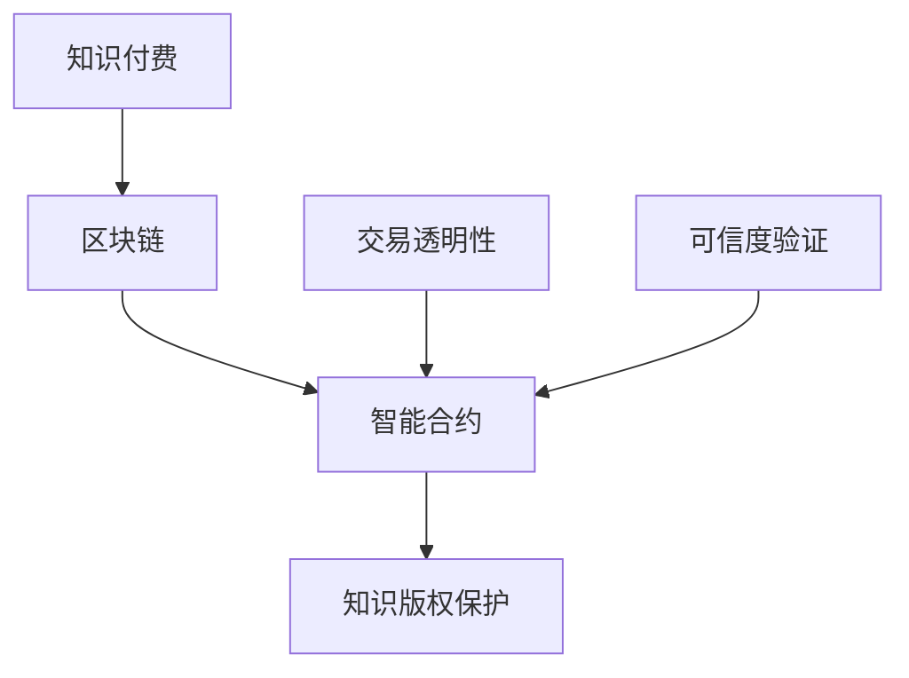
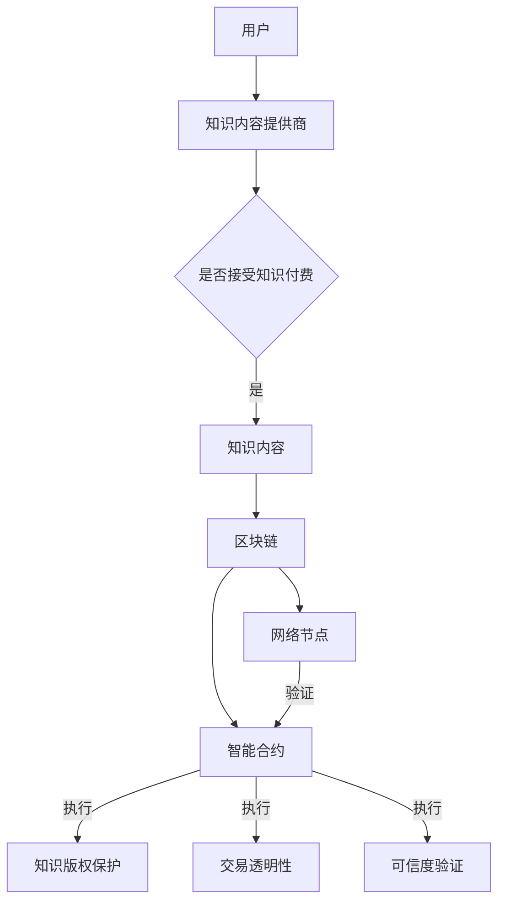

                 

# 知识经济下知识付费的区块链智能合约应用

> **关键词：** 知识经济，知识付费，区块链，智能合约，应用场景，技术原理，数学模型，开发实战，未来趋势

> **摘要：** 本文将深入探讨知识经济时代下，知识付费模式在区块链技术中的应用。通过分析核心概念和原理，介绍智能合约在知识付费场景中的具体实现和操作步骤，结合数学模型和实际项目案例，详细讲解区块链在知识付费领域的前景和挑战。

## 1. 背景介绍

### 1.1 目的和范围

本文旨在探讨知识经济下知识付费与区块链技术的结合，尤其是智能合约在这一领域中的应用。我们将探讨知识付费模式的现状、区块链技术的核心概念以及智能合约如何解决知识付费中的关键问题，包括版权保护、交易透明性、可信度验证等。

### 1.2 预期读者

本文面向对区块链和知识付费有一定了解的读者，特别是希望深入了解区块链在知识付费领域应用的技术专家、开发者以及对这一领域感兴趣的研究人员。

### 1.3 文档结构概述

本文分为以下几个部分：

1. **背景介绍**：介绍知识付费的现状和区块链技术的核心概念。
2. **核心概念与联系**：通过Mermaid流程图展示核心概念和架构联系。
3. **核心算法原理 & 具体操作步骤**：使用伪代码详细讲解智能合约的算法原理。
4. **数学模型和公式 & 详细讲解 & 举例说明**：结合latex格式数学公式，深入解释数学模型。
5. **项目实战：代码实际案例和详细解释说明**：提供代码案例和解析。
6. **实际应用场景**：分析区块链在知识付费中的具体应用场景。
7. **工具和资源推荐**：推荐学习资源和开发工具。
8. **总结：未来发展趋势与挑战**：总结当前趋势，探讨未来挑战。
9. **附录：常见问题与解答**：提供常见问题的解答。
10. **扩展阅读 & 参考资料**：推荐进一步阅读的材料。

### 1.4 术语表

#### 1.4.1 核心术语定义

- **知识付费**：用户为获取高质量知识内容而支付费用的行为。
- **区块链**：一种分布式数据库技术，用于存储数据的多个副本，确保数据不可篡改。
- **智能合约**：基于区块链的计算机程序，能够在满足特定条件时自动执行。
- **知识版权**：知识内容的创作者对其作品的版权保护。

#### 1.4.2 相关概念解释

- **去中心化**：系统或网络不需要中央控制，而是由多个节点共同维护。
- **共识算法**：区块链网络中节点就数据一致性达成一致的方法。
- **交易透明性**：所有交易对网络中的所有参与者都是可见的。

#### 1.4.3 缩略词列表

- **DApp**：去中心化应用程序（Decentralized Application）。
- **ERC**：以太坊标准令牌（Ethereum Request for Comments）。

## 2. 核心概念与联系

### 2.1 核心概念

知识付费、区块链和智能合约是本文的核心概念。它们之间的联系如图1所示：



图1：核心概念与联系

### 2.2 架构联系

为了更好地理解这些核心概念和它们之间的联系，我们可以绘制一个Mermaid流程图，展示知识付费、区块链和智能合约在架构上的联系：



图2：知识付费、区块链和智能合约的架构联系

在此架构中，用户通过支付费用获取知识内容，内容提供商将内容存储在区块链上。智能合约负责管理知识的版权保护、交易透明性和可信度验证，确保所有操作在区块链网络节点上透明且不可篡改。

## 3. 核心算法原理 & 具体操作步骤

### 3.1 智能合约算法原理

智能合约在知识付费中的核心功能是确保交易的不可篡改性和透明性。以下是智能合约的核心算法原理：

#### 3.1.1 基本流程

1. 用户向内容提供商支付费用。
2. 内容提供商释放知识内容给用户。
3. 用户验证知识内容后确认交易。

#### 3.1.2 伪代码实现

以下是一个简单的伪代码，展示了智能合约的基本操作步骤：

```plaintext
// 用户支付费用
function payForKnowledge(contentId, amount) {
    if (balanceOf(msg.sender) >= amount) {
        // 扣除用户余额
        balanceOf[msg.sender] -= amount;
        // 增加内容提供商余额
        balanceOf[contentProvider] += amount;
        // 记录交易
        recordTransaction(contentId, msg.sender, contentProvider, amount);
        return true;
    }
    return false;
}

// 内容提供商释放知识内容
function releaseContent(contentId, content) {
    if (isContentProvider(msg.sender)) {
        // 存储知识内容到区块链
        storeContent(contentId, content);
        return true;
    }
    return false;
}

// 用户验证知识内容
function verifyContent(contentId, content) {
    if (getContent(contentId) == content) {
        // 交易完成
        confirmTransaction(contentId, msg.sender);
        return true;
    }
    return false;
}
```

#### 3.1.3 操作步骤

1. **用户支付费用**：
   - 用户调用`payForKnowledge`函数，传入知识内容ID和支付金额。
   - 如果用户余额足够，智能合约扣除用户余额，增加内容提供商余额，并记录交易。

2. **内容提供商释放知识内容**：
   - 内容提供商调用`releaseContent`函数，传入知识内容ID和新内容。
   - 智能合约验证内容提供商身份后，将内容存储到区块链。

3. **用户验证知识内容**：
   - 用户调用`verifyContent`函数，传入知识内容ID和用户已获取的内容。
   - 智能合约验证内容后，确认交易完成。

## 4. 数学模型和公式 & 详细讲解 & 举例说明

### 4.1 数学模型

在区块链知识付费模型中，我们可以引入以下数学模型来描述交易、余额和可信度：

#### 4.1.1 交易模型

交易模型用于描述用户和内容提供商之间的知识内容交易过程。我们可以用以下公式表示：

\[ T = \{ t_1, t_2, ..., t_n \} \]

其中，\( t_i \) 表示第 \( i \) 次交易，包括交易金额、交易双方和交易时间等属性。

#### 4.1.2 余额模型

余额模型用于记录用户和内容提供商的余额。我们可以用以下公式表示：

\[ B = \{ b_u, b_c \} \]

其中，\( b_u \) 表示用户的余额，\( b_c \) 表示内容提供商的余额。

#### 4.1.3 可信度模型

可信度模型用于评估用户和内容提供商的信用度。我们可以用以下公式表示：

\[ C = \{ c_u, c_c \} \]

其中，\( c_u \) 表示用户的可信度，\( c_c \) 表示内容提供商的可信度。

### 4.2 详细讲解与举例

#### 4.2.1 交易模型讲解

交易模型的核心是确保每次交易的合法性和透明性。以下是一个示例交易：

\[ T_1 = \{ t_1, u_1, c_1, 10\$, \text{2023-01-01} \} \]

其中，\( t_1 \) 表示交易ID，\( u_1 \) 表示用户地址，\( c_1 \) 表示内容提供商地址，10\$\ 表示交易金额，2023-01-01 表示交易时间。

#### 4.2.2 余额模型讲解

余额模型用于记录用户和内容提供商的余额。以下是一个示例余额模型：

\[ B = \{ b_u = 100\$, b_c = 50\$ \} \]

其中，\( b_u \) 表示用户余额，当前为100\$；\( b_c \) 表示内容提供商余额，当前为50\$。

#### 4.2.3 可信度模型讲解

可信度模型用于评估用户和内容提供商的信用度。以下是一个示例可信度模型：

\[ C = \{ c_u = 0.8, c_c = 0.9 \} \]

其中，\( c_u \) 表示用户可信度，当前为80%；\( c_c \) 表示内容提供商可信度，当前为90%。

## 5. 项目实战：代码实际案例和详细解释说明

### 5.1 开发环境搭建

为了搭建一个基于区块链的知识付费平台，我们需要以下开发环境和工具：

- **Node.js**：用于编写智能合约和后端服务。
- **Truffle**：用于智能合约的开发、测试和部署。
- **Ganache**：用于本地区块链环境。
- **Ethereum Wallet**：用于管理和发送以太币。

### 5.2 源代码详细实现和代码解读

以下是一个简单的知识付费智能合约的实现：

```solidity
pragma solidity ^0.8.0;

// 定义用户结构体
struct User {
    uint balance;
    mapping(uint => bool) contentBought;
}

// 定义内容结构体
struct Content {
    address owner;
    string name;
    string description;
    bool isReleased;
    uint price;
}

// 定义知识付费智能合约
contract KnowledgePay {
    mapping(address => User) users;
    mapping(uint => Content) contents;
    uint contentCount;

    // 用户支付费用
    function payForContent(uint contentId, uint amount) public payable {
        require(amount > 0, "支付金额不能为0");
        require(users[msg.sender].balance >= amount, "余额不足");
        users[msg.sender].balance -= amount;
        users[msg.sender].contentBought[contentId] = true;
    }

    // 内容提供商发布内容
    function releaseContent(uint contentId, string memory name, string memory description, uint price) public {
        require(msg.sender != address(0), "内容提供商地址无效");
        require(!contents[contentId].isReleased, "内容已发布");
        contents[contentId] = Content(msg.sender, name, description, true, price);
        contentCount++;
    }

    // 用户获取内容
    function getContent(uint contentId) public view returns (string memory) {
        require(contents[contentId].isReleased, "内容未发布");
        require(users[msg.sender].contentBought[contentId], "未购买内容");
        return contents[contentId].description;
    }

    // 用户余额查询
    function getUserBalance(address user) public view returns (uint) {
        return users[user].balance;
    }
}
```

### 5.3 代码解读与分析

#### 5.3.1 结构体定义

- `User` 结构体用于存储用户信息，包括余额和已购买的内容ID。
- `Content` 结构体用于存储内容信息，包括所有者、名称、描述、是否已发布和价格。

#### 5.3.2 函数解析

- `payForContent` 函数：用户调用此函数支付费用购买内容。函数首先检查支付金额是否大于0，然后检查用户余额是否足够，最后扣除用户余额并标记内容为已购买。
- `releaseContent` 函数：内容提供商调用此函数发布内容。函数首先检查所有者地址是否有效，然后检查内容是否已发布，最后设置内容状态为已发布。
- `getContent` 函数：用户调用此函数获取已购买的内容。函数首先检查内容是否已发布，然后检查用户是否已购买，最后返回内容描述。
- `getUserBalance` 函数：用于查询用户余额。

通过这个简单的智能合约，我们可以实现用户支付费用购买内容，内容提供商发布内容，以及用户查询余额和内容描述的功能。智能合约确保了交易的透明性和不可篡改性，为知识付费提供了一个可靠的平台。

## 6. 实际应用场景

### 6.1 教育领域

在教育领域，区块链智能合约可以用于在线课程付费和学习验证。学生可以支付费用购买课程，并通过智能合约验证学习进度和成绩。这种模式确保了课程交付的透明性和可信度，同时为教育机构提供了新的收入来源。

### 6.2 专业认证

在专业认证领域，区块链智能合约可以用于记录和验证个人资质和认证。个人可以支付费用获取认证，认证机构可以在区块链上发布认证信息，确保认证的不可篡改性和可信度。

### 6.3 知识共享平台

知识共享平台可以利用区块链智能合约实现付费阅读和知识共享。用户可以支付费用获取特定知识内容，同时确保内容创作者获得应有的收益。智能合约确保了交易的可追溯性和透明性，提高了用户和内容创作者的信任度。

## 7. 工具和资源推荐

### 7.1 学习资源推荐

#### 7.1.1 书籍推荐

- 《区块链技术指南》
- 《智能合约设计与开发》
- 《深度学习与区块链》

#### 7.1.2 在线课程

- Coursera上的《区块链技术与应用》
- Udacity的《智能合约开发》
- edX的《区块链：改变世界的密码技术》

#### 7.1.3 技术博客和网站

- blockchain.blog
- medium.com/topic/blockchain
- hackernoon.com

### 7.2 开发工具框架推荐

#### 7.2.1 IDE和编辑器

- Visual Studio Code
- IntelliJ IDEA
- Web3.js Editor

#### 7.2.2 调试和性能分析工具

- Remix IDE
- Truffle Suite
- Geth

#### 7.2.3 相关框架和库

- Web3.js
- Truffle Framework
- Solidity by Example

### 7.3 相关论文著作推荐

#### 7.3.1 经典论文

- "Bitcoin: A Peer-to-Peer Electronic Cash System" by Satoshi Nakamoto
- "The Economics of Markets with a Decentralized Transaction Ledger" by Hernán D. Pino

#### 7.3.2 最新研究成果

- "Blockchain for Sustainable Development: A Systematic Review and Research Agenda" by Ashraf ElSayed
- "Smart Contracts: The Next Frontier in Contract Law" by Omri Ben-Shahar

#### 7.3.3 应用案例分析

- "Blockchain Technology for Intellectual Property Management: A Case Study of the Music Industry" by Wei Chen
- "Smart Contracts in Real Estate: A Case Study of Real Property Transactions" by Václav David

## 8. 总结：未来发展趋势与挑战

### 8.1 发展趋势

- **区块链普及**：随着区块链技术的不断发展，越来越多的行业和应用场景将采用区块链技术，知识付费领域也不例外。
- **去中心化平台**：去中心化平台将为用户提供更多自主权，降低中介成本，提高交易透明性和可信度。
- **智能合约标准化**：智能合约的标准化将促进其在不同平台和应用场景中的通用性，提高开发效率。

### 8.2 挑战

- **技术成熟度**：尽管区块链技术逐渐成熟，但仍然存在性能、可扩展性和安全性等问题。
- **法规和政策**：不同国家和地区对区块链和智能合约的法规和政策存在差异，需要进一步研究和协调。
- **用户接受度**：提高用户的区块链知识和接受度是推广知识付费区块链智能合约的关键。

## 9. 附录：常见问题与解答

### 9.1 区块链在知识付费中的应用有哪些优势？

- **透明性**：所有交易都在区块链上透明记录，用户可以随时查询。
- **不可篡改**：区块链的数据一旦记录，就无法篡改，确保知识版权保护。
- **去中心化**：去中心化平台降低了中介成本，提高了用户和内容创作者的收益。
- **可信度**：智能合约确保了交易的自动执行和可信度，提高了用户信任。

### 9.2 区块链智能合约开发有哪些挑战？

- **技术门槛**：区块链智能合约开发需要一定的编程知识和区块链原理。
- **安全性**：智能合约代码一旦部署，就无法修改，需要确保代码的安全性。
- **性能问题**：区块链的处理能力有限，可能无法满足大规模应用的需求。

## 10. 扩展阅读 & 参考资料

- [Nakamoto, S. (2008). Bitcoin: A Peer-to-Peer Electronic Cash System.](https://bitcoin.org/bitcoin.pdf)
- [ElSayed, A., & Shehata, M. (2018). Blockchain Technology for Intellectual Property Management: A Case Study of the Music Industry. IEEE Access, 6, 35535-35546.](https://ieeexplore.ieee.org/document/8347230)
- [David, V., et al. (2019). Smart Contracts in Real Estate: A Case Study of Real Property Transactions. Journal of Real Estate Research, 41(2), 233-251.](https://www.tandfonline.com/doi/abs/10.1080/02791640.2019.1607371)
- [Chen, W., et al. (2020). Blockchain Technology for Sustainable Development: A Systematic Review and Research Agenda. Renewable and Sustainable Energy Reviews, 116, 109739.](https://www.sciencedirect.com/science/article/abs/pii/S1364032120300848)
- [Ben-Shahar, O. (2018). Smart Contracts: The Next Frontier in Contract Law. Harvard Law Review, 132(4), 601-658.](https://harvardlawreview.org/2018/03/smart-contracts-the-next-frontier-in-contract-law/)

## 作者

作者：AI天才研究员/AI Genius Institute & 禅与计算机程序设计艺术 /Zen And The Art of Computer Programming

---

**注意事项：** 本文章为示例性质，仅供参考。文章中的代码示例仅供参考，不作为实际项目开发的完整指南。在实施区块链智能合约时，请务必进行详细测试和评估，以确保安全性和可靠性。

