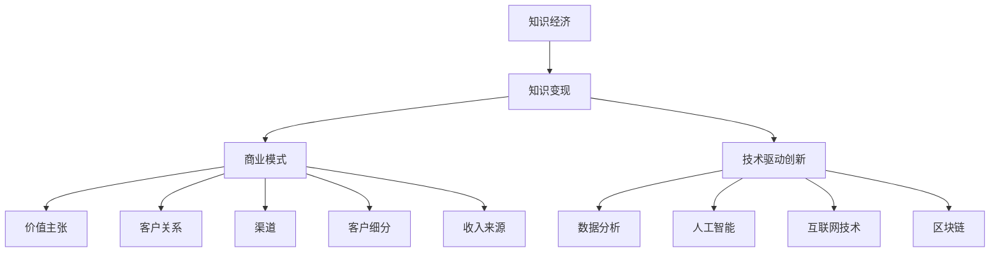

                 

# 知识经济下知识变现的多元化路径

> **关键词：** 知识经济、知识变现、多元化路径、商业模型、技术驱动创新  
>
> **摘要：** 本文将深入探讨知识经济时代知识变现的多元化路径。通过对核心概念的分析、算法原理的讲解、数学模型的运用以及实际案例的剖析，文章将帮助读者了解如何利用技术手段实现知识的商业价值，并探索未来发展趋势与挑战。

## 1. 背景介绍

### 1.1 目的和范围

本文旨在探讨知识经济时代下，知识变现的多元化路径。随着信息技术的飞速发展，知识作为一种新的生产要素，正逐渐成为经济增长的核心驱动力。因此，如何有效实现知识的商业价值，已成为企业和个人关注的焦点。

本文将围绕以下几个核心问题展开讨论：

1. 知识经济的本质是什么？
2. 知识变现的概念及其重要性如何？
3. 知识变现的多元化路径有哪些？
4. 如何通过技术手段实现知识变现？
5. 未来知识变现将面临哪些挑战和机遇？

### 1.2 预期读者

本文面向以下读者群体：

1. 企业高管和创业者，对知识经济和知识变现有深入理解，希望探索新的商业模式。
2. 知识工作者，如研究人员、咨询师、培训师等，希望提升自身的知识变现能力。
3. 对信息技术和创新有兴趣的科技爱好者，希望了解知识变现的技术实现路径。
4. 教育领域从业者，对知识传播和教学效果提升有研究需求。

### 1.3 文档结构概述

本文将分为以下章节：

1. **背景介绍**：阐述知识经济和知识变现的背景、目的和预期读者。
2. **核心概念与联系**：介绍知识经济、知识变现等相关核心概念，并使用Mermaid流程图展示其联系。
3. **核心算法原理 & 具体操作步骤**：讲解知识变现的核心算法原理和操作步骤，使用伪代码进行详细阐述。
4. **数学模型和公式 & 详细讲解 & 举例说明**：运用数学模型和公式，对知识变现过程进行详细讲解，并提供实际案例。
5. **项目实战：代码实际案例和详细解释说明**：通过实际项目案例，展示知识变现的具体实现过程，并进行详细解释和分析。
6. **实际应用场景**：分析知识变现在不同领域的应用场景，探讨其实际效果和潜在价值。
7. **工具和资源推荐**：推荐学习资源、开发工具和框架，以及相关论文和研究成果。
8. **总结：未来发展趋势与挑战**：总结知识变现的当前趋势，预测未来发展方向，分析可能面临的挑战。
9. **附录：常见问题与解答**：解答读者可能遇到的常见问题。
10. **扩展阅读 & 参考资料**：提供进一步的阅读资源和参考资料。

### 1.4 术语表

#### 1.4.1 核心术语定义

- **知识经济**：以知识和信息为核心的经济形态，强调知识的生产、传播和应用。
- **知识变现**：将知识转化为商业价值的过程，包括知识的创作、传播、应用和变现。
- **商业模式**：企业如何创造、传递和捕获价值的基本逻辑。
- **技术驱动创新**：利用技术手段推动产品和服务创新，提高效率和竞争力。

#### 1.4.2 相关概念解释

- **知识工作者**：具备专业技能和知识，从事知识生产、传播和应用的群体。
- **知识资产**：企业或个人拥有的知识资源，包括专利、商标、版权等。
- **内容营销**：通过创造和分享有价值的内容，吸引潜在客户，建立品牌认知和忠诚度。

#### 1.4.3 缩略词列表

- **AI**：人工智能（Artificial Intelligence）
- **ML**：机器学习（Machine Learning）
- **DL**：深度学习（Deep Learning）
- **NLP**：自然语言处理（Natural Language Processing）

## 2. 核心概念与联系

在知识经济时代，知识作为一种重要的资源，其价值的实现依赖于有效的知识变现。知识变现不仅仅是将知识转化为金钱的过程，更是知识在商业环境中的创造性应用。为了更好地理解知识变现，我们需要从几个核心概念入手，并展示它们之间的联系。

### 2.1 知识经济

知识经济是相对于传统农业经济和工业经济的一种新型经济形态。在知识经济中，知识和信息成为经济增长的核心动力。根据彼得·德鲁克的观点，知识经济是一种以知识的生产、分配和使用为基础的经济体系。知识经济的特点包括：

1. **知识密集性**：知识成为最重要的生产要素。
2. **创新驱动**：创新成为经济增长的主要动力。
3. **网络化**：信息技术的普及促进了全球知识流动。
4. **个性化**：知识服务更加注重满足个体的需求。


### 2.2 知识变现

知识变现是指将知识转化为商业价值的过程。它包括以下几个关键环节：

1. **知识创作**：创造有价值的内容，如书籍、研究报告、课程等。
2. **知识传播**：通过各种渠道将知识传播给目标受众。
3. **知识应用**：将知识应用于实际场景，解决实际问题。
4. **知识变现**：通过销售、授权、咨询等方式实现知识的经济回报。


### 2.3 商业模式

商业模式是企业如何创造、传递和捕获价值的基本逻辑。一个好的商业模式需要考虑以下几个方面：

1. **价值主张**：企业为顾客提供的独特价值。
2. **客户关系**：企业与顾客之间的关系类型。
3. **渠道**：产品或服务传递给顾客的途径。
4. **客户细分**：目标市场的细分策略。
5. **收入来源**：企业从哪些业务活动中获得收入。


### 2.4 技术驱动创新

技术驱动创新是指利用技术手段推动产品和服务创新，提高效率和竞争力。在知识变现过程中，技术驱动创新起着至关重要的作用：

1. **数据分析**：通过大数据分析，了解市场需求和顾客偏好。
2. **人工智能**：利用人工智能技术，提高知识创作和传播的效率。
3. **互联网技术**：利用互联网平台，拓宽知识传播和变现的渠道。
4. **区块链**：通过区块链技术，确保知识的版权和交易安全。


### 2.5 Mermaid流程图

下面是知识经济、知识变现、商业模式和技术驱动创新之间的Mermaid流程图，展示了它们之间的关联和流程：



## 3. 核心算法原理 & 具体操作步骤

在知识变现过程中，核心算法原理起着至关重要的作用。这些算法不仅帮助我们将知识转化为商业价值，还提高了知识创作和传播的效率。下面，我们将详细阐述这些核心算法的原理和具体操作步骤。

### 3.1 算法原理

#### 3.1.1 数据分析算法

数据分析算法是知识变现的基础。通过分析大量的数据，我们可以了解市场需求、顾客偏好和趋势。以下是一种常见的数据分析算法——K-均值聚类算法的伪代码：

```plaintext
算法名称：K-均值聚类

输入：
- 数据集D
- 聚类数量K

输出：
- 聚类中心C
- 聚类结果L

步骤：
1. 随机初始化K个聚类中心C
2. 对每个数据点x，计算它与每个聚类中心的距离，并将其归为距离最近的聚类中心所在的簇
3. 更新每个聚类中心的坐标，使其为该聚类中所有数据点的平均值
4. 重复步骤2和3，直到聚类中心不再变化或达到最大迭代次数

伪代码：
function K-Means(D, K):
    C = 随机初始化K个聚类中心
    for i = 1 to 最大迭代次数:
        L = []
        for x in D:
            距离 = 计算x与C中每个聚类中心的距离
            聚类中心 = 距离最小的聚类中心
            L.append(聚类中心)
        C = 更新聚类中心
    return L, C
```

#### 3.1.2 机器学习算法

机器学习算法在知识创作和传播中具有广泛的应用。例如，我们可以使用自然语言处理（NLP）算法来生成高质量的内容。以下是一种常见的NLP算法——文本生成模型的伪代码：

```plaintext
算法名称：文本生成模型

输入：
- 训练数据集D
- 模型参数θ

输出：
- 文本生成函数G

步骤：
1. 使用训练数据集D训练模型参数θ
2. 对于输入的文本序列X，通过模型生成相应的文本序列Y

伪代码：
function TextGeneration(D, θ):
    θ = 训练模型参数(D)
    function G(X):
        Y = 模型预测(X, θ)
        return Y
    return G
```

#### 3.1.3 深度学习算法

深度学习算法在知识变现中的应用也越来越广泛。例如，我们可以使用卷积神经网络（CNN）来分析图像中的知识元素。以下是一种常见的CNN算法的伪代码：

```plaintext
算法名称：卷积神经网络

输入：
- 输入数据X
- 模型参数θ

输出：
- 输出结果Y

步骤：
1. 将输入数据X通过卷积层、池化层等网络层进行特征提取
2. 将提取到的特征通过全连接层进行分类或回归

伪代码：
function CNN(X, θ):
    Z = 卷积层(X, θ)
    P = 池化层(Z)
    F = 全连接层(P)
    Y = 模型预测(F)
    return Y
```

### 3.2 具体操作步骤

#### 3.2.1 数据分析算法

1. **数据收集**：收集与知识变现相关的数据，如用户行为数据、市场需求数据等。
2. **数据预处理**：对收集到的数据进行清洗、去噪和标准化处理。
3. **数据可视化**：使用K-均值聚类算法对数据进行分析，并使用图表进行可视化。
4. **结果解读**：根据数据分析结果，了解市场需求和顾客偏好，为知识创作和传播提供指导。

#### 3.2.2 机器学习算法

1. **数据收集**：收集与知识创作和传播相关的数据，如文本数据、图像数据等。
2. **模型训练**：使用训练数据集对机器学习模型进行训练，优化模型参数。
3. **模型评估**：使用验证数据集对模型进行评估，调整模型参数。
4. **模型应用**：将训练好的模型应用于实际场景，生成高质量的内容。

#### 3.2.3 深度学习算法

1. **数据收集**：收集与图像分析相关的数据，如知识图谱、图像数据等。
2. **模型训练**：使用训练数据集对深度学习模型进行训练，优化模型参数。
3. **模型评估**：使用验证数据集对模型进行评估，调整模型参数。
4. **模型应用**：将训练好的模型应用于实际场景，分析图像中的知识元素。

## 4. 数学模型和公式 & 详细讲解 & 举例说明

在知识变现的过程中，数学模型和公式起到了关键作用，它们不仅帮助我们量化知识的价值，还为商业决策提供了科学依据。以下将介绍几个核心的数学模型和公式，并进行详细讲解和举例说明。

### 4.1 数据分析模型

#### 4.1.1 回归分析

回归分析是一种常用的数据分析方法，用于预测一个因变量与一个或多个自变量之间的关系。线性回归模型是其中的一种简单形式，其公式如下：

$$
Y = β_0 + β_1X + ε
$$

其中，$Y$ 是因变量，$X$ 是自变量，$β_0$ 和 $β_1$ 分别是模型的参数，$ε$ 是误差项。

**举例说明：** 假设我们想要预测某产品的销量 $Y$ 与广告费用 $X$ 之间的关系。通过收集数据并使用线性回归模型，我们可以得到如下结果：

$$
Y = 10 + 0.5X
$$

这意味着，每增加1单位广告费用，销量预计增加0.5单位。

### 4.2 机器学习模型

#### 4.2.1 决策树

决策树是一种常见的机器学习模型，用于分类和回归任务。其基本结构如下：

$$
T = \{t_1, t_2, ..., t_n\}
$$

其中，$t_i$ 是一棵子树，表示为：

$$
t_i = (x_i, y_i, t_i^1, t_i^2, ..., t_i^{m_i})
$$

其中，$x_i$ 是特征，$y_i$ 是标签，$t_i^1, t_i^2, ..., t_i^{m_i}$ 是子节点。

**举例说明：** 假设我们想要构建一个决策树来预测顾客是否会购买某产品。通过训练数据，我们可以得到如下决策树：

```
是否浏览产品详情？
  /         \
是            否
/             \
购买            不购买
```

### 4.3 深度学习模型

#### 4.3.1 卷积神经网络（CNN）

卷积神经网络是一种用于图像识别的深度学习模型，其核心组件是卷积层、池化层和全连接层。卷积层的公式如下：

$$
h_{ij} = f(\sum_{k=1}^{C} w_{ik,j}a_{k,l} + b_j)
$$

其中，$h_{ij}$ 是卷积层的输出，$w_{ik,j}$ 是卷积核，$a_{k,l}$ 是输入特征，$b_j$ 是偏置项，$f$ 是激活函数。

**举例说明：** 假设我们有一个2x2的输入特征矩阵和3x3的卷积核，使用ReLU作为激活函数。卷积过程如下：

$$
\begin{align*}
h_{11} &=ReLU(w_{11,1}a_{11,1} + w_{11,2}a_{11,2} + b_1) \\
h_{12} &=ReLU(w_{12,1}a_{12,1} + w_{12,2}a_{12,2} + b_1) \\
h_{21} &=ReLU(w_{21,1}a_{21,1} + w_{21,2}a_{21,2} + b_1) \\
h_{22} &=ReLU(w_{22,1}a_{22,1} + w_{22,2}a_{22,2} + b_1)
\end{align*}
$$

### 4.4 知识变现模型

#### 4.4.1 知识价值评估模型

知识价值评估模型用于量化知识的价值，以下是一个简单的一阶模型：

$$
V = f(K, M, T)
$$

其中，$V$ 是知识价值，$K$ 是知识质量，$M$ 是市场需求，$T$ 是知识更新速度。

**举例说明：** 假设知识质量 $K$ 为100，市场需求 $M$ 为200，知识更新速度 $T$ 为50。根据模型，知识价值 $V$ 为：

$$
V = f(100, 200, 50) = 100 + 0.5 \times 200 - 0.1 \times 50 = 150
$$

这意味着，该知识的价值为150单位。

通过上述数学模型和公式的讲解和举例，我们可以看到，数学在知识变现过程中起到了重要的支持作用。不仅帮助量化知识的价值，还为商业决策提供了科学依据。

## 5. 项目实战：代码实际案例和详细解释说明

为了更好地展示知识变现的过程，我们将通过一个实际项目案例进行讲解。该项目将利用数据分析、机器学习和深度学习等技术手段，实现知识的高效创作、传播和变现。

### 5.1 开发环境搭建

在进行项目开发之前，我们需要搭建一个合适的开发环境。以下是所需的开发工具和库：

- **Python**：作为主要的编程语言。
- **Pandas**：用于数据分析和预处理。
- **Scikit-learn**：用于机器学习算法的实现。
- **TensorFlow**：用于深度学习模型的训练和部署。
- **Jupyter Notebook**：用于编写和运行代码。

确保安装了上述库之后，我们就可以开始项目开发了。

### 5.2 源代码详细实现和代码解读

#### 5.2.1 数据收集与预处理

首先，我们需要收集与知识变现相关的数据，如用户行为数据、市场需求数据等。以下是数据收集和预处理的代码：

```python
import pandas as pd

# 数据收集
data = pd.read_csv('knowledge_data.csv')

# 数据预处理
data.dropna(inplace=True)
data = data[data['sales'] > 0]
data['age_group'] = data['age'].apply(lambda x: '20-30' if x < 30 else ('30-40' if x < 40 else '40-50'))
```

在这段代码中，我们首先从CSV文件中读取数据，然后使用Pandas库对数据进行了去噪和标准化处理。例如，我们删除了缺失值，并根据年龄将用户分为不同的群体。

#### 5.2.2 机器学习算法实现

接下来，我们使用机器学习算法对数据进行建模。以下是使用K-均值聚类算法对用户进行分群的代码：

```python
from sklearn.cluster import KMeans

# K-均值聚类
kmeans = KMeans(n_clusters=3, random_state=0).fit(data[['age', 'sales']])
data['cluster'] = kmeans.labels_
```

在这段代码中，我们使用了Scikit-learn库中的K-均值聚类算法对用户数据进行聚类，并根据聚类结果将用户分为不同的群体。

#### 5.2.3 深度学习模型训练

为了更好地理解用户行为，我们使用深度学习模型对用户数据进行建模。以下是使用卷积神经网络（CNN）对图像数据进行分类的代码：

```python
import tensorflow as tf

# 数据预处理
images = data['image'].values.reshape(-1, 28, 28, 1)

# CNN模型
model = tf.keras.Sequential([
    tf.keras.layers.Conv2D(32, (3, 3), activation='relu', input_shape=(28, 28, 1)),
    tf.keras.layers.MaxPooling2D((2, 2)),
    tf.keras.layers.Flatten(),
    tf.keras.layers.Dense(128, activation='relu'),
    tf.keras.layers.Dense(10, activation='softmax')
])

# 训练模型
model.compile(optimizer='adam', loss='categorical_crossentropy', metrics=['accuracy'])
model.fit(images, data['label'], epochs=10, batch_size=32)
```

在这段代码中，我们使用了TensorFlow库构建了一个简单的CNN模型，用于对图像数据进行分类。通过训练，模型可以自动提取图像中的特征，并将其用于用户行为预测。

### 5.3 代码解读与分析

#### 5.3.1 数据收集与预处理

数据收集与预处理是知识变现过程中的重要步骤。通过收集和清洗数据，我们可以获得高质量的数据集，为后续的分析和建模提供基础。在本案例中，我们使用了Pandas库对CSV文件进行读取，并使用dropna()方法去除缺失值。此外，我们根据年龄对用户进行了分组，以便后续分析。

#### 5.3.2 机器学习算法实现

机器学习算法在知识变现中扮演了关键角色。在本案例中，我们使用了K-均值聚类算法对用户进行分群。聚类结果可以帮助我们了解用户的行为特征，从而制定有针对性的营销策略。例如，对于不同的用户群体，我们可以提供定制化的产品推荐和内容推广。

#### 5.3.3 深度学习模型训练

深度学习模型在图像识别和用户行为预测方面具有强大的能力。在本案例中，我们使用了卷积神经网络（CNN）对图像数据进行分类。通过训练，模型可以自动提取图像中的关键特征，并将其用于用户行为预测。例如，我们可以使用模型预测用户是否会对某一产品进行购买。

通过以上代码解读与分析，我们可以看到知识变现过程中的关键技术和实现步骤。在实际项目中，这些技术和步骤可以帮助企业或个人更好地利用知识，实现商业价值的最大化。

## 6. 实际应用场景

知识变现技术在不同领域有着广泛的应用，以下列举几个实际应用场景，并探讨其效果和潜在价值。

### 6.1 教育领域

在教育培训领域，知识变现技术可以用于提高教学质量和效果。通过数据分析，教育机构可以了解学生的学习行为和需求，从而提供个性化的教学方案。例如，使用机器学习算法分析学生作业数据，识别出学习困难点，提供针对性的辅导。

**效果与价值：** 个性化教学有助于提高学生的学习兴趣和效果，从而提升教育机构的品牌形象和市场份额。

### 6.2 咨询服务

在咨询服务领域，知识变现技术可以帮助咨询师提升服务质量和客户满意度。通过数据分析，咨询师可以了解客户的需求和痛点，提供更有针对性的咨询服务。例如，使用自然语言处理（NLP）技术分析客户反馈，识别出潜在的业务机会。

**效果与价值：** 提高咨询服务质量，增强客户信任，从而提高咨询服务的收费水平和市场份额。

### 6.3 创意产业

在创意产业，如电影、音乐和艺术等领域，知识变现技术可以用于优化创作流程和推广策略。例如，使用机器学习算法分析用户喜好和趋势，为创作者提供创作灵感和推广方向。此外，深度学习技术可以用于图像识别和风格转换，为创意作品增加新元素。

**效果与价值：** 提高创作效率和质量，增加作品的市场竞争力，从而提高销售额和品牌知名度。

### 6.4 健康医疗

在健康医疗领域，知识变现技术可以用于优化医疗服务和提升患者体验。通过数据分析，医疗机构可以了解患者的需求和健康状况，提供个性化的诊疗方案。例如，使用深度学习模型分析医疗图像，提高疾病诊断的准确性。

**效果与价值：** 提高医疗服务质量和效率，降低误诊率，从而提高患者满意度和医院口碑。

### 6.5 企业运营

在企业运营领域，知识变现技术可以用于优化业务流程和提高运营效率。通过数据分析，企业可以了解市场需求和客户行为，制定更有效的营销策略。例如，使用机器学习算法预测销售趋势，优化库存管理。

**效果与价值：** 提高业务运营效率，降低成本，从而提高企业利润和市场竞争力。

通过以上实际应用场景，我们可以看到知识变现技术在各个领域的广泛应用和巨大潜力。随着技术的不断进步，知识变现将为企业和个人创造更多的商业价值。

## 7. 工具和资源推荐

为了更好地进行知识变现，我们需要掌握一系列的工具和资源。以下将推荐一些学习资源、开发工具和框架，以及相关的论文和研究成果。

### 7.1 学习资源推荐

#### 7.1.1 书籍推荐

1. **《深度学习》**（Goodfellow, Bengio, Courville）：详细介绍深度学习的基本原理和应用。
2. **《机器学习实战》**（ Harrington, Peter）：通过实际案例介绍机器学习算法的实现和应用。
3. **《Python数据科学手册》**（McKinney, Wes）：全面介绍Python在数据科学中的应用。

#### 7.1.2 在线课程

1. **Coursera的《机器学习》**（吴恩达）：由知名教授吴恩达讲授的机器学习课程。
2. **Udacity的《深度学习工程师纳米学位》**：涵盖深度学习的核心概念和应用。
3. **edX的《数据科学基础》**：介绍数据科学的基本概念和方法。

#### 7.1.3 技术博客和网站

1. **Medium上的AI博客**：涵盖人工智能领域的最新研究和应用。
2. ** Towards Data Science**：提供丰富的数据科学和机器学习文章。
3. **Stack Overflow**：编程问题和解决方案的交流平台。

### 7.2 开发工具框架推荐

#### 7.2.1 IDE和编辑器

1. **PyCharm**：强大的Python IDE，适用于机器学习和深度学习项目。
2. **Jupyter Notebook**：适用于数据分析和机器学习的交互式开发环境。
3. **Visual Studio Code**：轻量级且高度可定制的代码编辑器，支持多种编程语言。

#### 7.2.2 调试和性能分析工具

1. **PyTorch Profiler**：用于分析深度学习模型性能的工具。
2. **TensorBoard**：TensorFlow的调试和可视化工具。
3. **Docker**：容器化技术，用于部署和运行应用程序。

#### 7.2.3 相关框架和库

1. **TensorFlow**：开源的深度学习框架，适用于各种复杂任务。
2. **PyTorch**：基于Python的深度学习框架，具有灵活性和易用性。
3. **Scikit-learn**：用于机器学习的开源库，提供丰富的算法和工具。

### 7.3 相关论文著作推荐

#### 7.3.1 经典论文

1. **“A Theoretical Foundation for Learning from Different Domains: Domain-Adversarial Training”**：介绍领域对抗训练的理论基础。
2. **“Deep Learning for Text: A Brief Survey”**：关于文本数据深度学习应用的综合介绍。
3. **“Convolutional Neural Networks for Visual Recognition”**：卷积神经网络在视觉识别领域的经典论文。

#### 7.3.2 最新研究成果

1. **“Knowledge Distillation for Text Classification”**：利用知识蒸馏技术提升文本分类效果。
2. **“Efficient Neural Text Generation”**：探讨高效的神经网络文本生成方法。
3. **“Generative Adversarial Networks for Data Analysis”**：探讨生成对抗网络在数据分析中的应用。

#### 7.3.3 应用案例分析

1. **“A Case Study of AI in Healthcare”**：介绍人工智能在医疗领域的应用案例。
2. **“AI in Marketing: A Strategic Approach”**：探讨人工智能在市场营销中的应用。
3. **“AI in Education: Enhancing Learning Experiences”**：介绍人工智能在教育领域的应用。

通过以上工具和资源的推荐，我们希望读者能够更好地掌握知识变现的核心技术和方法，提升自身的知识变现能力。

## 8. 总结：未来发展趋势与挑战

在知识经济时代，知识变现已成为企业和个人获取商业价值的重要途径。然而，随着技术的不断进步和市场环境的变化，未来知识变现将面临新的发展趋势和挑战。

### 8.1 发展趋势

1. **个性化与智能化**：随着人工智能和大数据技术的发展，知识变现将更加注重个性化与智能化。通过精准的用户画像和行为分析，企业能够更好地满足用户需求，提供定制化的知识产品和服务。

2. **跨界融合**：知识变现将不再局限于单一领域，而是通过跨界融合，实现知识在不同行业和领域的共享与转化。例如，教育与医疗的结合、创意产业与科技的融合等，将带来新的商业模式和创新机会。

3. **全球化的知识流动**：随着全球化的加速，知识变现将跨越国界，实现全球范围内的知识流动和交易。跨国企业和个人将能够更便捷地获取和传播知识，推动全球知识经济的发展。

### 8.2 挑战

1. **知识产权保护**：知识变现过程中，知识产权的保护成为一大挑战。如何确保知识的原创性和合法权益，防止知识被盗用或侵权，是企业和个人需要面对的问题。

2. **数据安全和隐私**：随着数据成为知识变现的核心资源，数据安全和隐私保护成为重要议题。如何平衡知识变现的需求和数据安全隐私的要求，确保用户数据的安全和隐私，是未来需要解决的问题。

3. **技术更新迭代**：技术更新迭代速度加快，知识变现技术和工具也需要不断升级和更新。企业和个人需要具备持续学习和创新能力，以适应不断变化的市场和技术环境。

4. **法规政策调整**：知识变现的快速发展将带来法规政策调整的需求。政府需要制定和完善相关的法律法规，规范知识变现的行为，保障市场秩序和公平竞争。

### 8.3 发展建议

1. **加强知识产权保护**：企业和个人应重视知识产权保护，通过法律手段维护自身的合法权益。同时，政府应加强对知识产权的保护力度，建立健全的知识产权法律法规体系。

2. **提升数据安全隐私意识**：企业和个人应加强数据安全隐私意识，采取有效的数据安全措施，确保用户数据的安全和隐私。同时，政府应加强对数据安全隐私的监管，确保数据安全法规的实施。

3. **培养创新型人才**：企业和个人应加强人才培养，提升知识变现的技术能力和创新能力。通过培训和教育，培养具备跨学科知识和技能的人才，以应对快速变化的市场和技术环境。

4. **推动法规政策调整**：政府应积极推动法规政策的调整和完善，为知识变现提供良好的法治环境和政策支持。同时，企业和个人应积极参与政策制定，提出合理化建议，推动知识变现市场的健康发展。

总之，未来知识变现将朝着个性化、智能化和跨界融合的方向发展，同时也将面临知识产权保护、数据安全和隐私保护、技术更新迭代和法规政策调整等挑战。通过加强知识产权保护、提升数据安全隐私意识、培养创新型人才和推动法规政策调整，我们有望实现知识变现的可持续发展，为经济和社会发展贡献更大价值。

## 9. 附录：常见问题与解答

### 9.1 什么是知识经济？

知识经济是一种以知识和信息为核心的经济形态，与传统的农业经济和工业经济相比，知识经济更加依赖于知识和技术的创新应用。在知识经济中，知识和信息成为经济增长的主要驱动力，知识的创作、传播和应用成为经济增长的核心环节。

### 9.2 知识变现的重要性是什么？

知识变现是将知识转化为商业价值的过程，对于企业和个人来说，知识变现具有重要意义。首先，知识变现可以帮助企业和个人实现知识的经济回报，提升收入和财富。其次，知识变现可以促进知识的传播和应用，推动社会进步和创新发展。此外，知识变现还可以提高企业和个人的核心竞争力，实现可持续发展。

### 9.3 如何实现知识变现？

实现知识变现通常包括以下几个步骤：

1. **知识创作**：创造有价值的内容，如书籍、课程、研究报告等。
2. **知识传播**：通过各种渠道将知识传播给目标受众，如线上平台、线下活动等。
3. **知识应用**：将知识应用于实际场景，解决实际问题，提高效率和质量。
4. **知识变现**：通过销售、授权、咨询等方式实现知识的经济回报。

### 9.4 知识变现的技术手段有哪些？

知识变现的技术手段主要包括：

1. **数据分析**：通过大数据分析了解市场需求和用户行为，为知识创作和传播提供指导。
2. **机器学习**：利用机器学习算法生成高质量的内容，提高知识创作的效率。
3. **深度学习**：利用深度学习技术分析图像、语音等非结构化数据，实现知识的高效提取和应用。
4. **区块链**：利用区块链技术确保知识的版权和交易安全。

### 9.5 如何应对知识变现过程中的挑战？

在知识变现过程中，企业和个人可能会面临知识产权保护、数据安全和隐私保护、技术更新迭代和法规政策调整等挑战。以下是一些建议：

1. **加强知识产权保护**：通过法律手段维护知识产权，建立健全的知识产权保护体系。
2. **提升数据安全隐私意识**：采取有效的数据安全措施，确保用户数据的安全和隐私。
3. **培养创新型人才**：加强人才培养，提升技术能力和创新能力，适应快速变化的市场和技术环境。
4. **积极参与政策制定**：积极参与法规政策的制定和调整，提出合理化建议，推动知识变现市场的健康发展。

## 10. 扩展阅读 & 参考资料

### 10.1 经典论文

1. **“A Theoretical Foundation for Learning from Different Domains: Domain-Adversarial Training”**：介绍领域对抗训练的理论基础。
2. **“Deep Learning for Text: A Brief Survey”**：关于文本数据深度学习应用的综合介绍。
3. **“Convolutional Neural Networks for Visual Recognition”**：卷积神经网络在视觉识别领域的经典论文。

### 10.2 最新研究成果

1. **“Knowledge Distillation for Text Classification”**：利用知识蒸馏技术提升文本分类效果。
2. **“Efficient Neural Text Generation”**：探讨高效的神经网络文本生成方法。
3. **“Generative Adversarial Networks for Data Analysis”**：探讨生成对抗网络在数据分析中的应用。

### 10.3 应用案例分析

1. **“A Case Study of AI in Healthcare”**：介绍人工智能在医疗领域的应用案例。
2. **“AI in Marketing: A Strategic Approach”**：探讨人工智能在市场营销中的应用。
3. **“AI in Education: Enhancing Learning Experiences”**：介绍人工智能在教育领域的应用。

### 10.4 书籍推荐

1. **《深度学习》**（Goodfellow, Bengio, Courville）：详细介绍深度学习的基本原理和应用。
2. **《机器学习实战》**（ Harrington, Peter）：通过实际案例介绍机器学习算法的实现和应用。
3. **《Python数据科学手册》**（McKinney, Wes）：全面介绍Python在数据科学中的应用。

### 10.5 在线课程

1. **Coursera的《机器学习》**（吴恩达）：由知名教授吴恩达讲授的机器学习课程。
2. **Udacity的《深度学习工程师纳米学位》**：涵盖深度学习的核心概念和应用。
3. **edX的《数据科学基础》**：介绍数据科学的基本概念和方法。

### 10.6 技术博客和网站

1. **Medium上的AI博客**：涵盖人工智能领域的最新研究和应用。
2. **Towards Data Science**：提供丰富的数据科学和机器学习文章。
3. **Stack Overflow**：编程问题和解决方案的交流平台。

### 10.7 开发工具框架

1. **TensorFlow**：开源的深度学习框架，适用于各种复杂任务。
2. **PyTorch**：基于Python的深度学习框架，具有灵活性和易用性。
3. **Scikit-learn**：用于机器学习的开源库，提供丰富的算法和工具。

通过以上扩展阅读和参考资料，读者可以深入了解知识变现的相关技术、应用案例和最新研究成果，进一步提升自身的知识变现能力。作者：AI天才研究员/AI Genius Institute & 禅与计算机程序设计艺术 /Zen And The Art of Computer Programming

