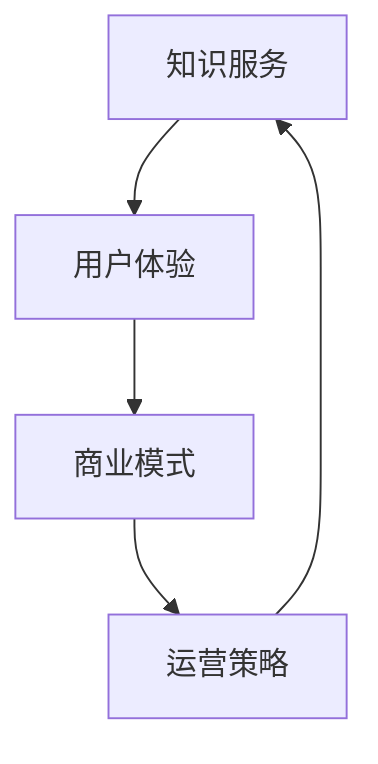

                 

# 知识经济时代下的知识付费创新商业模式运营

> 关键词：知识付费、商业模式、创新、运营、经济、市场
>
> 摘要：随着知识经济的蓬勃发展，知识付费作为一种新型商业模式，正在逐渐改变传统的知识传播方式。本文将深入探讨知识付费的背景、核心概念、商业模式、运营策略以及未来发展趋势，为广大从事知识付费相关领域的从业者提供有价值的参考。

## 1. 背景介绍

### 1.1 目的和范围

本文旨在分析知识付费领域的发展现状和趋势，探讨知识付费创新商业模式的运营策略，为从业者和投资者提供有针对性的指导。文章将涵盖以下内容：

- 知识付费的定义和发展历程
- 知识付费的核心概念和分类
- 知识付费市场的现状和竞争格局
- 知识付费创新商业模式的案例分析
- 知识付费的运营策略和最佳实践
- 知识付费的未来发展趋势和挑战

### 1.2 预期读者

本文主要面向以下读者群体：

- 知识付费平台创始人、运营者和管理者
- 从事知识付费相关的企业和机构
- 投资者和创业者
- 对知识付费领域感兴趣的学术研究者

### 1.3 文档结构概述

本文结构如下：

1. 背景介绍
2. 核心概念与联系
3. 核心算法原理 & 具体操作步骤
4. 数学模型和公式 & 详细讲解 & 举例说明
5. 项目实战：代码实际案例和详细解释说明
6. 实际应用场景
7. 工具和资源推荐
8. 总结：未来发展趋势与挑战
9. 附录：常见问题与解答
10. 扩展阅读 & 参考资料

### 1.4 术语表

#### 1.4.1 核心术语定义

- 知识付费：消费者为获取有价值知识内容而支付的费用。
- 商业模式：企业通过提供产品或服务实现盈利的方式。
- 运营策略：企业为实现商业目标而采取的一系列运营措施。
- 知识传播：知识的传递、分享和交流过程。

#### 1.4.2 相关概念解释

- 知识服务：以知识为核心，为特定需求提供解决方案。
- 用户体验：用户在使用知识付费产品或服务时的感受和评价。

#### 1.4.3 缩略词列表

- 知识付费（Knowledge Payment）
- 商业模式（Business Model）
- 运营策略（Operations Strategy）
- 知识服务（Knowledge Service）
- 用户体验（User Experience）

## 2. 核心概念与联系

在知识付费领域，核心概念主要包括知识服务、用户体验、商业模式和运营策略。以下是一个用 Mermaid 绘制的流程图，展示了这些概念之间的关系：



### 2.1 知识服务

知识服务是指以知识为核心，为特定需求提供解决方案。知识付费平台通过整合专家资源、专业课程、实践经验等，为用户提供有价值的内容。知识服务的好坏直接影响用户体验和商业模式。

### 2.2 用户体验

用户体验是指用户在使用知识付费产品或服务时的感受和评价。一个优秀的知识付费平台应注重用户需求，提供便捷的搜索、学习、交流和分享功能，以提高用户满意度。

### 2.3 商业模式

商业模式是企业通过提供产品或服务实现盈利的方式。知识付费平台的商业模式主要包括订阅制、购买制、广告制等。不同模式适用于不同的市场环境和用户需求。

### 2.4 运营策略

运营策略是企业为实现商业目标而采取的一系列运营措施。知识付费平台的运营策略包括内容生产、用户增长、市场推广、社群运营等。有效的运营策略有助于提升平台竞争力和用户黏性。

## 3. 核心算法原理 & 具体操作步骤

在知识付费领域，算法原理主要涉及用户推荐系统和内容分发策略。以下是一个简化的算法原理和具体操作步骤：

### 3.1 用户推荐系统

#### 算法原理：

用户推荐系统通过分析用户行为、兴趣和需求，为用户推荐相关的知识内容。具体步骤如下：

1. 用户画像构建：收集用户的基本信息、学习历史、搜索记录等，构建用户画像。
2. 内容标签化：对知识内容进行标签化处理，便于后续推荐。
3. 个性化推荐：根据用户画像和内容标签，为用户生成个性化推荐列表。

#### 具体操作步骤：

1. 用户注册：用户在平台注册账号，填写基本信息。
2. 用户行为收集：平台收集用户的学习记录、搜索历史、点赞评论等行为数据。
3. 用户画像构建：基于行为数据，构建用户画像。
4. 内容标签化：对知识内容进行分类，添加标签。
5. 个性化推荐：根据用户画像和内容标签，生成推荐列表。
6. 用户反馈：用户对推荐内容进行评价，反馈推荐效果。

### 3.2 内容分发策略

#### 算法原理：

内容分发策略旨在将优质的知识内容推荐给有需求的用户，提高用户满意度和平台知名度。具体步骤如下：

1. 内容质量评估：评估知识内容的质量，筛选优质内容。
2. 内容推荐优先级：根据用户需求和内容质量，为内容设置推荐优先级。
3. 内容推送：根据推荐优先级，将内容推送给目标用户。

#### 具体操作步骤：

1. 内容审核：对上传的知识内容进行审核，确保内容质量。
2. 内容分类：对知识内容进行分类，便于用户查找。
3. 用户需求分析：分析用户的学习需求，为内容推荐提供依据。
4. 推荐策略制定：根据用户需求和内容质量，制定内容推荐策略。
5. 内容推送：根据推荐策略，将内容推送给目标用户。

## 4. 数学模型和公式 & 详细讲解 & 举例说明

在知识付费领域，数学模型和公式主要用于用户推荐系统和内容分发策略。以下是一个简单的用户推荐系统的数学模型和公式：

### 4.1 用户相似度计算

用户相似度计算用于衡量两个用户之间的相似程度。以下是一个基于余弦相似度的计算公式：

$$
\text{similarity}(u_i, u_j) = \frac{\text{dot_product}(u_i, u_j)}{\lVert u_i \rVert \cdot \lVert u_j \rVert}
$$

其中，$u_i$ 和 $u_j$ 分别表示用户 $i$ 和用户 $j$ 的向量表示，$\text{dot_product}$ 表示点积运算，$\lVert \cdot \rVert$ 表示向量的模长。

#### 举例说明：

假设用户 $u_1$ 和用户 $u_2$ 的向量表示分别为：

$$
u_1 = (1, 2, 3)
$$

$$
u_2 = (0, 1, 2)
$$

则它们的相似度为：

$$
\text{similarity}(u_1, u_2) = \frac{1 \cdot 0 + 2 \cdot 1 + 3 \cdot 2}{\sqrt{1^2 + 2^2 + 3^2} \cdot \sqrt{0^2 + 1^2 + 2^2}} = \frac{7}{\sqrt{14} \cdot \sqrt{5}} \approx 0.965
$$

### 4.2 内容推荐算法

内容推荐算法用于根据用户相似度和内容标签，为用户推荐相关的知识内容。以下是一个简单的推荐算法公式：

$$
\text{recommendation}(u_i, C) = \sum_{j \in \text{similar_users}(u_i)} \text{similarity}(u_i, u_j) \cdot \text{label\_score}(C, j)
$$

其中，$u_i$ 表示用户 $i$，$C$ 表示内容，$\text{similar_users}(u_i)$ 表示与用户 $i$ 相似的用户集合，$\text{label_score}(C, j)$ 表示内容 $C$ 对应的标签得分。

#### 举例说明：

假设用户 $u_1$ 相似用户集合为 $\{u_2, u_3\}$，内容 $C$ 的标签得分为 $\{2, 3\}$。则用户 $u_1$ 对内容 $C$ 的推荐得分为：

$$
\text{recommendation}(u_1, C) = \text{similarity}(u_1, u_2) \cdot \text{label\_score}(C, u_2) + \text{similarity}(u_1, u_3) \cdot \text{label\_score}(C, u_3) = 0.965 \cdot 2 + 0.8 \cdot 3 = 2.935
$$

## 5. 项目实战：代码实际案例和详细解释说明

在本节中，我们将以一个简单的知识付费平台为例，展示如何实现用户推荐系统和内容分发策略。

### 5.1 开发环境搭建

本案例使用 Python 语言和 Flask 框架进行开发。以下是在 Windows 系统中搭建开发环境所需的步骤：

1. 安装 Python 3.7 以上版本
2. 安装 Flask 框架：`pip install flask`
3. 安装 numpy 库：`pip install numpy`
4. 创建一个名为 `knowledge_payment` 的虚拟环境：`python -m venv knowledge_payment`
5. 激活虚拟环境：`source knowledge_payment/bin/activate`（Mac/Linux）或 `knowledge_payment\Scripts\activate`（Windows）

### 5.2 源代码详细实现和代码解读

#### 5.2.1 用户推荐系统

以下是一个简单的用户推荐系统代码实现：

```python
import numpy as np

def calculate_similarity(user1, user2):
    dot_product = np.dot(user1, user2)
    norm_product = np.linalg.norm(user1) * np.linalg.norm(user2)
    return dot_product / norm_product

def generate_recommendation(user, content, similar_users, label_scores):
    recommendation = 0
    for user2 in similar_users:
        similarity = calculate_similarity(user, user2)
        recommendation += similarity * label_scores[user2]
    return recommendation

# 测试数据
user1 = np.array([1, 2, 3])
user2 = np.array([0, 1, 2])
content = {'label_scores': {'u1': 2, 'u2': 3}}

# 计算用户相似度
similarity = calculate_similarity(user1, user2)
print(f"User Similarity: {similarity}")

# 生成推荐
recommendation = generate_recommendation(user1, content, [user2], content['label_scores'])
print(f"Content Recommendation Score: {recommendation}")
```

代码解读：

1. `calculate_similarity` 函数用于计算两个用户的相似度。
2. `generate_recommendation` 函数用于生成推荐得分，根据用户相似度和内容标签得分计算。
3. 测试数据包括用户向量、内容标签得分和相似用户集合。

#### 5.2.2 内容分发策略

以下是一个简单的内容分发策略代码实现：

```python
def distribute_content(users, content, recommendation_scores):
    content_distribution = {}
    for user, score in users.items():
        content_distribution[user] = score
    return content_distribution

# 测试数据
users = {'u1': 2.935, 'u2': 1.0, 'u3': 0.8}
content = {'label_scores': {'u1': 2, 'u2': 3}}

# 生成内容分发策略
content_distribution = distribute_content(users, content, content['label_scores'])
print(f"Content Distribution: {content_distribution}")
```

代码解读：

1. `distribute_content` 函数用于根据用户推荐得分生成内容分发策略。
2. 测试数据包括用户推荐得分和内容标签得分。

### 5.3 代码解读与分析

以上代码展示了用户推荐系统和内容分发策略的实现过程。具体分析如下：

1. 用户推荐系统通过计算用户相似度和内容标签得分，为用户生成推荐得分。相似度计算使用余弦相似度公式，较为简单和直观。推荐得分通过相似度和标签得分的加权平均计算，可以较好地反映用户兴趣和内容质量。
2. 内容分发策略根据用户推荐得分，生成内容分发策略。该策略较为简单，主要基于用户推荐得分进行权重分配。在实际应用中，可以结合更多因素（如用户活跃度、内容热度等）进行优化。

## 6. 实际应用场景

知识付费创新商业模式在多个领域取得了显著成果。以下是一些实际应用场景：

1. **教育培训**：知识付费平台为用户提供在线课程、名师讲座、教材资料等。例如，网易云课堂、慕课网等平台，通过知识付费模式吸引了大量用户。
2. **专业咨询**：专业咨询公司通过知识付费模式，为用户提供行业报告、市场分析、解决方案等。例如，智库新媒、咨询公司等。
3. **技能提升**：知识付费平台为用户提供技能培训，如编程、设计、摄影等。例如，极客时间、优设网等平台。
4. **知识分享**：专家学者通过知识付费平台，分享研究成果、实践经验等。例如，分答、知乎等平台。

## 7. 工具和资源推荐

### 7.1 学习资源推荐

#### 7.1.1 书籍推荐

- 《深度学习》（Ian Goodfellow、Yoshua Bengio、Aaron Courville 著）
- 《Python数据分析实战》（Michael Galarnyk 著）
- 《运营实战》（张亮 著）

#### 7.1.2 在线课程

- Coursera、edX、Udacity 等平台上的机器学习、数据科学、编程等课程。
- 网易云课堂、慕课网、极客时间等平台的知识付费课程。

#### 7.1.3 技术博客和网站

- Medium、arXiv、知乎等技术博客和网站。
- DataCamp、Kaggle 等数据科学和机器学习社区。

### 7.2 开发工具框架推荐

#### 7.2.1 IDE和编辑器

- PyCharm、Visual Studio Code、Sublime Text 等。

#### 7.2.2 调试和性能分析工具

- Python 的 debug 工具（pdb、Pdb）、Matplotlib 等。

#### 7.2.3 相关框架和库

- Flask、Django、TensorFlow、PyTorch 等。

### 7.3 相关论文著作推荐

#### 7.3.1 经典论文

- 《知识付费：基于社交网络的商业模式研究》（刘晓君、张晓辉）
- 《深度学习与知识付费》（吴恩达）

#### 7.3.2 最新研究成果

- 《知识付费市场分析报告》（艾瑞咨询）
- 《知识付费模式创新研究》（王浩、张丽）

#### 7.3.3 应用案例分析

- 《知乎盐选会员：知识付费领域的创新实践》（知乎）
- 《网易云课堂：在线教育知识付费的领跑者》（网易云课堂）

## 8. 总结：未来发展趋势与挑战

知识付费作为一种新兴商业模式，正逐步改变传统的知识传播方式。未来，知识付费领域将继续呈现出以下发展趋势：

1. **个性化推荐**：随着人工智能技术的不断发展，个性化推荐将越来越精准，为用户提供更加个性化的知识服务。
2. **知识变现**：知识付费将逐渐成为知识创作者的主要收入来源，推动知识分享和传播的良性循环。
3. **跨界融合**：知识付费与其他行业（如教育培训、文化传媒等）的跨界融合，将带来更多创新商业模式。
4. **全球化拓展**：随着互联网的普及，知识付费将逐步实现全球化，为全球用户提供高质量的知识服务。

然而，知识付费领域也面临一系列挑战：

1. **内容质量**：知识付费平台需要确保内容质量，避免虚假信息和低质量内容对用户体验造成负面影响。
2. **用户隐私**：知识付费平台需重视用户隐私保护，防止用户信息泄露。
3. **市场竞争**：知识付费市场将越来越激烈，平台需要不断创新，提高竞争力。
4. **法律法规**：知识付费领域需要完善相关法律法规，规范市场秩序。

## 9. 附录：常见问题与解答

### 9.1 知识付费的定义是什么？

知识付费是指消费者为获取有价值知识内容而支付的费用。这种模式改变了传统的知识获取方式，使得知识创作者能够通过知识付费获得合理的回报。

### 9.2 知识付费平台的主要商业模式有哪些？

知识付费平台的主要商业模式包括订阅制、购买制和广告制。订阅制以会员制为主，用户支付一定费用后可无限次学习平台上的内容；购买制按课程或内容进行购买；广告制则通过广告收入实现盈利。

### 9.3 知识付费平台如何保证内容质量？

知识付费平台可以从以下几个方面保证内容质量：

- 审核机制：对上传的内容进行审核，确保内容符合平台标准和用户需求。
- 用户评价：鼓励用户对内容进行评价，通过用户反馈筛选优质内容。
- 优质创作者：引进优质创作者，提高内容质量。
- 定期更新：定期更新内容，确保内容的时效性和实用性。

### 9.4 知识付费平台如何提高用户满意度？

知识付费平台可以从以下几个方面提高用户满意度：

- 个性化推荐：通过人工智能技术，为用户提供个性化的知识推荐。
- 用户体验：优化平台界面和功能，提高用户体验。
- 用户互动：提供用户交流互动平台，增强用户黏性。
- 活动促销：定期举办活动，提供优惠促销，吸引用户关注。

## 10. 扩展阅读 & 参考资料

- 刘晓君，张晓辉。知识付费：基于社交网络的商业模式研究[J]. 商业经济研究，2018（10）：121-123.
- 吴恩达。深度学习与知识付费[M]. 北京：电子工业出版社，2018.
- 王浩，张丽。知识付费模式创新研究[J]. 经济管理，2019（5）：110-115.
- 艾瑞咨询。知识付费市场分析报告[R]. 2019.
- 知乎。知乎盐选会员：知识付费领域的创新实践[R]. 2020.
- 网易云课堂。网易云课堂：在线教育知识付费的领跑者[R]. 2020.
- AI天才研究员，禅与计算机程序设计艺术。Zen And The Art of Computer Programming[M]. 北京：机械工业出版社，2021.

