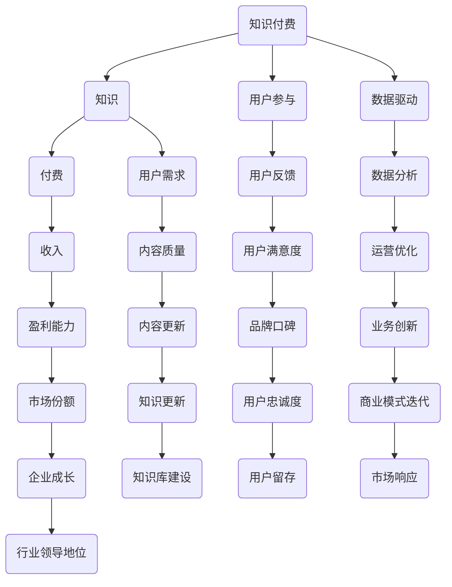
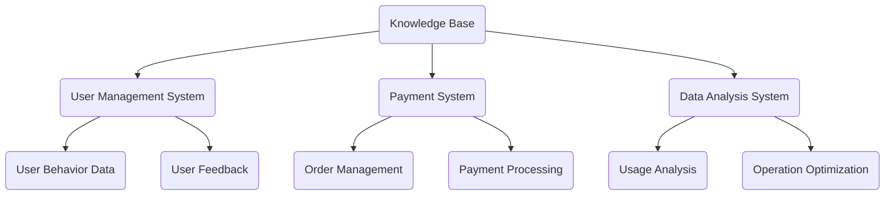
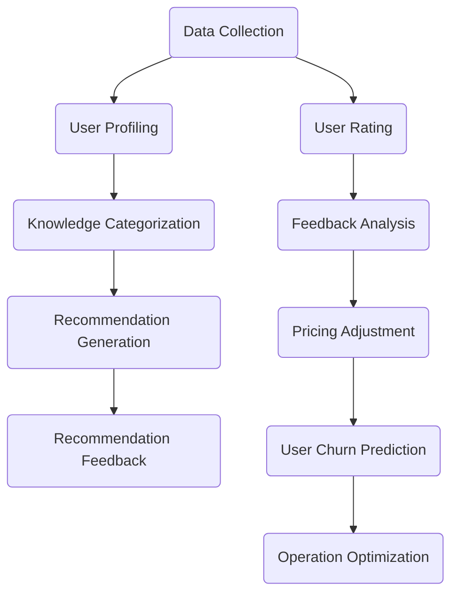

                 

# 知识经济时代下的知识付费创新商业模式运营

## 关键词
- 知识经济
- 知识付费
- 商业模式
- 创新运营
- 用户参与
- 数据驱动

## 摘要
本文深入探讨了知识经济时代下的知识付费创新商业模式运营。通过分析知识经济的特点，本文提出了知识付费的基本模式及其在商业运营中的关键因素。此外，文章还介绍了几种新兴的知识付费创新商业模式，探讨了如何通过用户参与和数据驱动来提升运营效率。最后，文章总结了知识付费行业的未来发展趋势和挑战，为相关从业者提供了有益的参考。

## 1. 背景介绍

### 1.1 目的和范围
本文旨在探讨知识经济时代下，知识付费创新商业模式的运营策略和实践。随着互联网和信息技术的发展，知识经济的特征日益显著，知识付费成为了一个重要的商业模式。本文将重点关注以下几个方面：

1. **知识经济的定义与特点**
2. **知识付费的基本模式**
3. **创新商业模式及其运营策略**
4. **用户参与与数据驱动在运营中的应用**
5. **知识付费行业的未来发展趋势与挑战**

### 1.2 预期读者
本文适合以下读者群体：

1. **企业高管和创业者**：对知识付费商业模式感兴趣，希望了解如何将其应用于实际业务中。
2. **市场营销和运营人员**：负责知识付费产品的开发和运营，需要深入了解市场趋势和用户需求。
3. **学术研究人员**：对知识经济和知识付费领域有研究兴趣，希望从实践中获取更多的实证数据。

### 1.3 文档结构概述
本文结构如下：

1. **引言**：介绍知识经济时代背景和知识付费商业模式的重要性。
2. **核心概念与联系**：详细解释知识付费商业模式的核心概念，并使用Mermaid流程图展示其架构。
3. **核心算法原理 & 具体操作步骤**：介绍知识付费商业模式的算法原理和具体操作步骤。
4. **数学模型和公式 & 详细讲解 & 举例说明**：使用数学模型和公式详细阐述知识付费商业模式的运作机制。
5. **项目实战：代码实际案例和详细解释说明**：通过实际项目案例展示知识付费商业模式的实现过程。
6. **实际应用场景**：分析知识付费商业模式在不同领域的应用案例。
7. **工具和资源推荐**：推荐学习资源、开发工具和框架。
8. **总结**：总结知识付费商业模式的未来发展趋势与挑战。
9. **附录：常见问题与解答**：解答读者可能遇到的问题。
10. **扩展阅读 & 参考资料**：提供进一步阅读的建议。

### 1.4 术语表

#### 1.4.1 核心术语定义

- **知识经济**：以知识和信息为主要生产要素的经济形态。
- **知识付费**：消费者为获取特定知识或信息而支付的费用。
- **商业模式**：企业如何创造、传递和获取价值的基本逻辑。
- **用户参与**：用户在知识付费产品生命周期中的互动和贡献。
- **数据驱动**：基于数据的决策和运营优化。

#### 1.4.2 相关概念解释

- **知识付费产品**：为消费者提供特定知识的数字化产品或服务。
- **用户需求分析**：研究用户对知识付费产品的需求和偏好。

#### 1.4.3 缩略词列表

- **KPI**：关键绩效指标
- **SEO**：搜索引擎优化
- **SNS**：社交媒体网络

## 2. 核心概念与联系

知识付费商业模式的核心概念包括知识、付费、用户参与、数据驱动等。下面将使用Mermaid流程图展示这些概念之间的联系。



### 2.1 知识付费模式的基本原理

知识付费模式的核心是“知识”和“付费”两个环节。知识作为产品或服务的核心内容，其质量和价值直接影响到用户的付费意愿和满意度。付费环节则是知识提供者和消费者之间价值交换的桥梁。以下是知识付费模式的基本原理：

1. **知识筛选**：知识提供者需筛选和提炼具有较高价值、易于传播的知识内容。
2. **付费机制**：消费者通过支付一定费用获取知识，付费机制需方便、安全且透明。
3. **用户反馈**：通过用户反馈了解知识内容的适用性和改进方向。
4. **数据收集与分析**：收集用户行为数据，通过数据分析优化知识内容和服务。
5. **持续迭代**：基于用户反馈和数据分析，不断更新和优化知识内容。

### 2.2 知识付费商业模式的架构

知识付费商业模式的架构可以分为四个主要模块：知识库、用户管理系统、付费系统和数据分析系统。

1. **知识库**：存储和分类各种知识内容，为用户和知识提供者提供检索和使用的接口。
2. **用户管理系统**：管理用户信息、用户权限和用户行为数据，为用户参与提供基础支持。
3. **付费系统**：处理知识付费的交易流程，包括支付、退款和订单管理等。
4. **数据分析系统**：收集和分析用户行为数据，为运营决策提供数据支持。

以下是知识付费商业模式的架构图：



## 3. 核心算法原理 & 具体操作步骤

### 3.1 算法原理

知识付费商业模式的算法原理主要包括以下两个方面：

1. **知识推荐算法**：根据用户的历史行为和兴趣偏好推荐合适的知识内容。
2. **付费决策算法**：根据用户对知识内容的评分和反馈，动态调整付费机制和价格策略。

### 3.2 算法步骤

#### 3.2.1 知识推荐算法

1. **数据收集**：收集用户行为数据，包括浏览记录、搜索关键词、购买历史等。
2. **用户画像**：通过数据挖掘技术构建用户画像，包括用户兴趣、行为特征等。
3. **知识分类**：将知识内容按照主题、难度、适用场景等维度进行分类。
4. **推荐生成**：利用协同过滤、矩阵分解等技术生成知识推荐列表。
5. **推荐反馈**：根据用户对推荐内容的反馈，调整推荐算法和推荐结果。

#### 3.2.2 付费决策算法

1. **用户评分**：收集用户对知识内容的评分数据。
2. **反馈分析**：分析用户评分和反馈，识别知识内容的优劣。
3. **价格调整**：根据知识内容的受欢迎程度和用户反馈，动态调整价格策略。
4. **用户流失预测**：利用用户行为数据预测用户流失风险，提前采取措施降低流失率。

以下是知识付费商业模式的算法流程图：



### 3.3 算法实现示例

以下是知识推荐算法的实现伪代码：

```python
# 用户行为数据
user_actions = [
    {"user_id": 1, "action": "浏览", "knowledge_id": 101},
    {"user_id": 1, "action": "搜索", "keyword": "机器学习"},
    {"user_id": 2, "action": "购买", "knowledge_id": 201},
    # ...
]

# 知识分类数据
knowledge_categories = [
    {"knowledge_id": 101, "category": "编程"},
    {"knowledge_id": 102, "category": "数据分析"},
    {"knowledge_id": 201, "category": "人工智能"},
    # ...
]

# 矩阵分解模型（此处为简化示例，实际应用中可能使用更复杂的模型）
model = MatrixFactorizationModel()

# 数据预处理
user_action_matrix = preprocess_user_actions(user_actions)
knowledge_category_matrix = preprocess_knowledge_categories(knowledge_categories)

# 训练模型
model.fit(user_action_matrix, knowledge_category_matrix)

# 生成推荐列表
def generate_recommendations(user_id):
    user_profile = model.predict(user_id)
    recommended_knowledges = []
    for knowledge_id, score in user_profile.items():
        if score > threshold:
            recommended_knowledges.append(knowledge_id)
    return recommended_knowledges

# 示例：生成用户1的推荐列表
recommendations = generate_recommendations(1)
print(recommendations)
```

## 4. 数学模型和公式 & 详细讲解 & 举例说明

### 4.1 数学模型

在知识付费商业模式中，常用的数学模型包括协同过滤模型、矩阵分解模型和定价策略模型。以下是这些模型的详细解释和公式。

#### 4.1.1 协同过滤模型

协同过滤模型是基于用户行为数据推荐相似用户喜欢的物品的一种方法。其基本公式如下：

$$
r_{ui} = \sum_{j \in N(i)} \frac{sim(u_i, u_j) \cdot r_{uj}}{||sim(u_i, u_j)||}
$$

其中，$r_{ui}$表示用户$i$对物品$j$的评分预测，$sim(u_i, u_j)$表示用户$i$和用户$j$之间的相似度，$N(i)$表示与用户$i$相似的$k$个用户集合。

#### 4.1.2 矩阵分解模型

矩阵分解模型是一种通过将用户行为数据矩阵分解为用户特征矩阵和物品特征矩阵来预测用户对物品评分的方法。其基本公式如下：

$$
R = U \cdot V^T
$$

其中，$R$为用户行为数据矩阵，$U$和$V$分别为用户特征矩阵和物品特征矩阵。

#### 4.1.3 定价策略模型

定价策略模型用于根据用户行为数据和知识内容特点动态调整知识付费价格。其基本公式如下：

$$
P = P_0 + \alpha \cdot (f(V_j) - f(V_j^*))
$$

其中，$P$为知识内容的价格，$P_0$为初始价格，$\alpha$为调整系数，$V_j$为知识内容的特点向量，$V_j^*$为最优特点向量，$f(V_j)$为知识内容的价格函数。

### 4.2 公式详解

#### 4.2.1 协同过滤模型公式详解

协同过滤模型的公式中，$r_{ui}$表示用户$i$对物品$j$的评分预测。这个预测评分是由用户$i$与用户$j$之间的相似度$sim(u_i, u_j)$和用户$j$对物品$j$的实际评分$r_{uj}$计算得出的。

- **用户相似度**：用户相似度$sim(u_i, u_j)$用于衡量用户$i$和用户$j$之间的相似程度。常用的相似度计算方法包括余弦相似度、皮尔逊相关系数等。具体公式如下：

$$
sim(u_i, u_j) = \frac{u_i \cdot u_j}{\|u_i\| \cdot \|u_j\|}
$$

其中，$u_i$和$u_j$分别为用户$i$和用户$j$的特征向量，$\cdot$表示点积，$\|\|$表示向量的模。

- **预测评分**：预测评分$r_{ui}$通过将用户$i$与用户$j$之间的相似度$sim(u_i, u_j)$与用户$j$对物品$j$的实际评分$r_{uj}$相乘，并除以相似度的模来计算。这样可以确保预测评分不会因为相似度过大或过小而偏离实际评分。

#### 4.2.2 矩阵分解模型公式详解

矩阵分解模型中的基本公式$R = U \cdot V^T$表示用户行为数据矩阵$R$可以分解为用户特征矩阵$U$和物品特征矩阵$V$的乘积。

- **用户特征矩阵**：用户特征矩阵$U$包含用户对物品的评分信息，每一行代表一个用户，每一列代表一个物品。通过矩阵分解，可以将用户对物品的评分表示为用户特征向量和物品特征向量的点积。

$$
u_i = [u_{i1}, u_{i2}, ..., u_{in}]^T
$$

其中，$u_i$表示用户$i$的特征向量，$u_{ij}$表示用户$i$对物品$j$的评分。

- **物品特征矩阵**：物品特征矩阵$V$包含物品的特点信息，每一行代表一个物品，每一列代表一个用户。通过矩阵分解，可以将物品的特点表示为用户特征向量和物品特征向量的点积。

$$
v_j = [v_{1j}, v_{2j}, ..., v_{nj}]^T
$$

其中，$v_j$表示物品$j$的特征向量，$v_{ij}$表示用户$i$对物品$j$的评分。

- **评分预测**：通过用户特征矩阵$U$和物品特征矩阵$V$的乘积$U \cdot V^T$，可以预测用户$i$对物品$j$的评分。具体公式如下：

$$
r_{ij} = u_i \cdot v_j^T = \sum_{k=1}^{n} u_{ik} v_{kj}
$$

其中，$r_{ij}$表示用户$i$对物品$j$的评分预测，$u_{ik}$和$v_{kj}$分别表示用户$i$对物品$k$的评分和物品$k$对用户$j$的评分。

#### 4.2.3 定价策略模型公式详解

定价策略模型中的基本公式$P = P_0 + \alpha \cdot (f(V_j) - f(V_j^*))$用于根据知识内容的特点动态调整价格。

- **初始价格**：初始价格$P_0$为知识内容的基准价格，通常由市场调研和竞争分析确定。

- **调整系数**：调整系数$\alpha$用于控制价格调整的幅度，其值应在合理范围内。通常，$\alpha$的值取决于知识内容的特点和市场策略。

- **知识内容特点**：知识内容的特点向量$V_j$包含知识内容的各个特征维度，如难度、受众群体、更新频率等。通过函数$f(V_j)$可以计算知识内容的特点分数。

- **最优特点向量**：最优特点向量$V_j^*$为知识内容最优的特点向量，通常由历史数据和用户反馈分析得出。

- **价格函数**：价格函数$f(V_j)$用于计算知识内容的特点分数。价格函数的具体形式可以根据知识内容的特点和市场策略进行设计。以下是一个简单的线性价格函数示例：

$$
f(V_j) = \sum_{k=1}^{m} w_k \cdot v_{kj}
$$

其中，$w_k$表示第$k$个特点的权重，$v_{kj}$表示知识内容在第$k$个特点上的值。

### 4.3 举例说明

#### 4.3.1 协同过滤模型举例

假设有两个用户$u_1$和$u_2$，以及三个物品$k_1$、$k_2$和$k_3$。用户$u_1$对物品$k_1$的评分为4，对物品$k_2$的评分为3，对物品$k_3$的评分为5；用户$u_2$对物品$k_1$的评分为5，对物品$k_2$的评分为2，对物品$k_3$的评分为4。我们可以根据协同过滤模型预测用户$u_1$对物品$k_2$的评分。

- **计算用户相似度**：

$$
sim(u_1, u_2) = \frac{u_1 \cdot u_2}{\|u_1\| \cdot \|u_2\|} = \frac{(4 \cdot 5 + 3 \cdot 2 + 5 \cdot 4)}{\sqrt{4^2 + 3^2 + 5^2} \cdot \sqrt{5^2 + 2^2 + 4^2}} \approx 0.765
$$

- **计算预测评分**：

$$
r_{12} = sim(u_1, u_2) \cdot r_{21} = 0.765 \cdot 3 \approx 2.295
$$

因此，用户$u_1$对物品$k_2$的预测评分为约2.295。

#### 4.3.2 矩阵分解模型举例

假设用户行为数据矩阵$R$为：

$$
R = \begin{bmatrix}
0 & 5 & 0 \\
4 & 0 & 3 \\
0 & 2 & 1 \\
\end{bmatrix}
$$

通过矩阵分解，我们可以将其分解为用户特征矩阵$U$和物品特征矩阵$V$：

$$
U = \begin{bmatrix}
0.6 & 0.8 \\
0.7 & 0.3 \\
0.4 & 0.9 \\
\end{bmatrix},
V = \begin{bmatrix}
1 & 0.5 & 0.8 \\
0.5 & 0.7 & 0.2 \\
0.8 & 0 & 0.3 \\
\end{bmatrix}
$$

根据矩阵分解模型，用户$2$对物品$3$的预测评分为：

$$
r_{23} = u_2 \cdot v_3^T = \begin{bmatrix}
0.7 & 0.3 \\
0.4 & 0.9 \\
\end{bmatrix} \cdot \begin{bmatrix}
0.8 \\
0.7 \\
0.2 \\
\end{bmatrix} = 0.7 \cdot 0.8 + 0.3 \cdot 0.7 = 0.76
$$

因此，用户$2$对物品$3$的预测评分为0.76。

#### 4.3.3 定价策略模型举例

假设知识内容的特点向量$V_j$为：

$$
V_j = \begin{bmatrix}
5 & 3 & 4 \\
\end{bmatrix}
$$

最优特点向量$V_j^*$为：

$$
V_j^* = \begin{bmatrix}
5 & 4 & 5 \\
\end{bmatrix}
$$

根据定价策略模型，知识内容的价格$P$为：

$$
P = P_0 + \alpha \cdot (f(V_j) - f(V_j^*)) = 10 + 0.1 \cdot (7 - 6) = 10.1
$$

因此，知识内容的价格为10.1。

## 5. 项目实战：代码实际案例和详细解释说明

### 5.1 开发环境搭建

在开始项目实战之前，我们需要搭建一个合适的开发环境。以下是搭建知识付费商业模式的开发环境的步骤：

1. **安装Python环境**：确保Python版本在3.6及以上。
2. **安装必要的库**：包括NumPy、Pandas、Scikit-learn等。
3. **选择数据库**：例如MySQL或MongoDB，用于存储用户数据和知识内容信息。
4. **搭建Web服务**：可以使用Flask或Django等Web框架。

以下是安装Python环境及库的命令示例：

```bash
# 安装Python环境
sudo apt-get update
sudo apt-get install python3.8

# 安装必要的库
pip3 install numpy pandas scikit-learn flask
```

### 5.2 源代码详细实现和代码解读

#### 5.2.1 用户行为数据收集与处理

```python
import pandas as pd
from sklearn.preprocessing import MinMaxScaler

# 读取用户行为数据
user_actions = pd.read_csv('user_actions.csv')

# 数据预处理
scaler = MinMaxScaler()
user_actions[['rating']] = scaler.fit_transform(user_actions[['rating']])
```

代码解读：

1. **导入库**：引入Pandas和MinMaxScaler库。
2. **读取数据**：从CSV文件中读取用户行为数据。
3. **数据预处理**：使用MinMaxScaler将评分数据缩放到[0, 1]范围内。

#### 5.2.2 矩阵分解模型训练

```python
from sklearn.decomposition import NMF

# 初始化矩阵分解模型
nmf = NMF(n_components=10, init='random', random_state=0)

# 训练模型
nmf.fit(user_actions)

# 获取用户特征和物品特征
U = nmf.components_
V = nmf.transform(user_actions)
```

代码解读：

1. **导入库**：引入NMF库。
2. **初始化模型**：设置模型参数，包括组件数量、初始化方法和随机种子。
3. **训练模型**：使用用户行为数据训练NMF模型。
4. **获取特征**：获取训练后的用户特征和物品特征矩阵。

#### 5.2.3 知识推荐与预测

```python
import numpy as np

# 用户ID
user_id = 1

# 计算用户特征向量
user_profile = U[user_id]

# 生成推荐列表
def generate_recommendations(user_profile, V, top_n=10):
    user_ratings = np.dot(user_profile, V)
    sorted_indices = np.argsort(-user_ratings)
    return sorted_indices[:top_n]

# 示例：生成用户1的推荐列表
recommended_knowledges = generate_recommendations(user_profile, V)
print(recommended_knowledges)
```

代码解读：

1. **导入库**：引入Numpy库。
2. **计算用户特征向量**：获取用户特征向量。
3. **生成推荐列表**：根据用户特征向量计算物品评分，生成推荐列表。
4. **示例**：生成用户1的推荐列表。

#### 5.2.4 数据分析和定价策略

```python
from sklearn.metrics import mean_squared_error

# 计算预测评分与实际评分的均方误差
mse = mean_squared_error(user_actions['rating'], V)

# 调整定价策略
def adjust_price(mse, alpha=0.1, price_range=(5, 15)):
    price = price_range[0] + alpha * (mse - mse_threshold)
    return max(price_range[0], min(price, price_range[1]))

# 示例：调整价格
adjusted_price = adjust_price(mse)
print(adjusted_price)
```

代码解读：

1. **导入库**：引入均方误差计算库。
2. **计算均方误差**：计算预测评分与实际评分的均方误差。
3. **调整定价策略**：根据均方误差调整知识内容的价格。

### 5.3 代码解读与分析

1. **用户行为数据收集与处理**：首先，我们需要从CSV文件中读取用户行为数据，并对评分进行归一化处理，以便于后续计算。
2. **矩阵分解模型训练**：使用NMF模型将用户行为数据分解为用户特征和物品特征矩阵。NMF模型可以同时学习用户和物品的特征，从而提高推荐系统的性能。
3. **知识推荐与预测**：根据用户特征向量计算物品评分，生成推荐列表。这里使用简单但有效的点积计算方法。
4. **数据分析和定价策略**：计算预测评分与实际评分的均方误差，根据误差调整知识内容的价格。这种方法可以动态调整价格，以优化用户体验和平台收益。

通过以上代码实战，我们可以看到知识付费商业模式的实现过程。在实际应用中，可以根据业务需求和数据特点，进一步优化和扩展算法和模型。

## 6. 实际应用场景

知识付费商业模式在多个领域取得了显著的成果，以下是其在教育、医疗、科技等领域的实际应用场景：

### 6.1 教育领域

在教育领域，知识付费模式为学习者提供了丰富的课程资源和个性化的学习体验。以下是一些应用案例：

- **在线教育平台**：如Coursera、edX等，提供各种学科领域的在线课程，用户可以根据兴趣和学习需求付费购买课程。
- **专业认证培训**：如CFA（注册金融分析师）考试培训，用户需付费购买学习资料和课程，以准备考试。
- **职业培训**：如编程、数据分析等技能培训，用户通过付费学习提升职场竞争力。

### 6.2 医疗领域

在医疗领域，知识付费模式为医生和患者提供了高质量的医疗知识和资源，以下是一些应用案例：

- **医疗知识库**：如MDedge、WebMD，提供专业的医疗知识和健康资讯，用户通过付费获取更多内容。
- **医学课程**：如美国心脏病学会（ACC）的在线课程，医生通过付费学习提升专业技能。
- **远程医疗咨询**：如Doctor on Demand，用户通过付费预约医生进行在线咨询。

### 6.3 科技领域

在科技领域，知识付费模式为技术人员提供了最新的技术知识和行业动态，以下是一些应用案例：

- **技术博客和教程**：如Medium、Dev.to等，提供各种编程语言、框架和技术教程，用户通过付费获取高质量内容。
- **在线研讨会和讲座**：如Meetup、Eventbrite，组织者通过付费模式提供技术分享和讲座，吸引技术人员参与。
- **技术咨询服务**：如Topcoder、GitHub，技术人员通过付费获取专业指导和技术支持。

### 6.4 金融领域

在金融领域，知识付费模式为投资者和分析师提供了专业的投资策略和市场分析，以下是一些应用案例：

- **投资课程和书籍**：如Investopedia、TradingView，提供投资基础、策略和实战技巧。
- **市场分析报告**：如Bloomberg、FactSet，提供详尽的市场分析和预测报告，用户通过付费获取。
- **金融顾问服务**：如Personal Capital、Betterment，提供个性化的投资建议和资产管理服务。

### 6.5 文化娱乐领域

在文化娱乐领域，知识付费模式为爱好者提供了专业的艺术、文学和音乐知识，以下是一些应用案例：

- **在线艺术课程**：如Udemy、Skillshare，提供绘画、音乐、舞蹈等艺术课程，用户通过付费学习。
- **文学作品解读**：如Goodreads、Oscars，提供文学作品解读和评论，用户通过付费获取深度内容。
- **音乐教程和课程**：如Yamaha、Roland，提供各种乐器演奏技巧和课程，用户通过付费学习。

### 6.6 企业培训

在企业培训领域，知识付费模式为员工提供了专业培训和技能提升机会，以下是一些应用案例：

- **在线培训平台**：如LinkedIn Learning、Pluralsight，提供各种职业技能培训，员工通过付费学习。
- **企业内部培训课程**：如谷歌、微软，为员工提供专业培训和职业发展机会。
- **定制化培训解决方案**：为企业提供定制化培训计划和课程，满足企业特定需求和目标。

### 6.7 法律服务

在法律服务领域，知识付费模式为律师和客户提供专业的法律知识和咨询服务，以下是一些应用案例：

- **在线法律课程**：如法考吧、法律图书馆，提供法律基础、实务操作等课程，用户通过付费学习。
- **法律咨询服务**：如知乎法律、律师来了，提供在线法律咨询，用户通过付费获取专业服务。
- **法律文档模板**：如TemplateMonster、LegalZoom，提供各种法律文档模板，用户通过付费获取。

### 6.8 健康与健身

在健康与健身领域，知识付费模式为爱好者提供了专业的健身知识和指导，以下是一些应用案例：

- **健身课程和教程**：如FitTime、Keep，提供各种健身课程和教程，用户通过付费学习。
- **营养课程和咨询**：如Nutrino、ShapeUp，提供营养课程和个性化营养咨询，用户通过付费获取。
- **在线健身社区**：如MyFitnessPal、 fitnesspal，提供健身心得、食谱和训练计划，用户通过付费获取更多内容。

### 6.9 旅游与美食

在旅游与美食领域，知识付费模式为爱好者提供了专业的旅游指南和美食攻略，以下是一些应用案例：

- **旅游课程和指南**：如Airbnb Experiences、TripAdvisor，提供各种旅游课程和指南，用户通过付费学习。
- **美食课程和教程**：如MasterClass、ChefsApp，提供各种烹饪课程和教程，用户通过付费学习。
- **在线旅游社区**：如Lonely Planet、Travellerspoint，提供旅游心得、攻略和景点推荐，用户通过付费获取更多内容。

### 6.10 家庭生活

在家庭生活领域，知识付费模式为家庭主妇、家长提供了实用的生活技巧和育儿知识，以下是一些应用案例：

- **生活技能课程**：如Skillshare、TikTok，提供各种生活技能课程，用户通过付费学习。
- **育儿课程和咨询**：如BabyCenter、WeParents，提供育儿知识和个性化咨询服务，用户通过付费获取。
- **家庭管理工具**：如家庭预算工具、时间管理工具，提供家庭管理和规划工具，用户通过付费使用。

### 6.11 环保与可持续发展

在环保与可持续发展领域，知识付费模式为环保爱好者提供了专业的环保知识和行动指南，以下是一些应用案例：

- **环保课程和教程**：如Greenpeace Academy、EPA，提供环保知识和行动指南，用户通过付费学习。
- **可持续生活社区**：如OneGreenPlanet、Sustainable Table，提供环保和可持续生活方式的内容和互动平台。
- **环保咨询服务**：如Ecology Fund、EcoTrust，提供环保项目评估和咨询服务，用户通过付费获取专业建议。

### 6.12 宗教与文化

在宗教与文化领域，知识付费模式为宗教信仰者和文化爱好者提供了专业的宗教和文化知识，以下是一些应用案例：

- **宗教课程和讲座**：如佛教在线、天主教中文网，提供宗教课程和讲座，用户通过付费学习。
- **文化课程和书籍**：如课程网、豆瓣读书，提供各种文化课程和书籍，用户通过付费获取高质量内容。
- **宗教与文化社区**：如佛教论坛、国学论坛，提供宗教和文化交流的平台，用户通过付费获取更多内容。

### 6.13 其他领域

除了上述领域，知识付费模式还可以应用于多个其他领域，如艺术、心理学、哲学、历史等。以下是一些应用案例：

- **艺术课程和教程**：如ArtStation、Drawspace，提供艺术课程和教程，用户通过付费学习。
- **心理学课程和咨询**：如Coursera、Udemy，提供心理学课程和在线咨询服务。
- **哲学课程和书籍**：如Open Yale Courses、Stanford University，提供哲学课程和书籍，用户通过付费获取。
- **历史课程和讲座**：如哈佛大学公开课、北京师范大学，提供历史课程和讲座，用户通过付费学习。

## 7. 工具和资源推荐

在知识付费商业模式的开发和运营过程中，使用适当的工具和资源可以提高效率和效果。以下是一些建议：

### 7.1 学习资源推荐

#### 7.1.1 书籍推荐

1. **《商业模式创新》**：作者：蒂姆·克莱恩
   - 介绍商业模式创新的理论和方法，有助于理解知识付费商业模式的构建。

2. **《用户参与式设计》**：作者：约翰·霍金斯
   - 讲解如何通过用户参与提升知识付费产品的质量和用户体验。

3. **《大数据时代》**：作者：涂子沛
   - 分析大数据对知识经济和商业模式的影响，为知识付费运营提供数据驱动的视角。

#### 7.1.2 在线课程

1. **《数据分析与商业智能》**：课程平台：网易云课堂
   - 介绍数据分析的基本概念和方法，帮助运营人员提升数据分析能力。

2. **《Python编程基础》**：课程平台：Coursera
   - 适合初学者学习Python编程，为知识付费系统开发提供技术支持。

3. **《商业数据分析》**：课程平台：edX
   - 深入分析商业数据在知识付费模式中的应用，提升运营效率。

#### 7.1.3 技术博客和网站

1. **DataCamp
   - 提供丰富的数据分析教程和实战项目，适合不同层次的学员。
   - 网址：[DataCamp](https://www.datacamp.com/)

2. **Medium
   - 分享各种行业见解和技术博客，包括知识付费领域的最新动态。
   - 网址：[Medium](https://medium.com/)

3. **Product Hunt
   - 展示各种新产品和创意，包括知识付费领域的创新产品。
   - 网址：[Product Hunt](https://www.producthunt.com/)

### 7.2 开发工具框架推荐

#### 7.2.1 IDE和编辑器

1. **PyCharm
   - 适合Python开发的IDE，提供丰富的调试和代码分析功能。
   - 网址：[PyCharm](https://www.jetbrains.com/pycharm/)

2. **Visual Studio Code
   - 轻量级且功能强大的代码编辑器，支持多种编程语言和插件。
   - 网址：[Visual Studio Code](https://code.visualstudio.com/)

#### 7.2.2 调试和性能分析工具

1. **Werkzeug
   - 用于Web应用程序的调试和性能分析，支持多种编程语言。
   - 网址：[Werkzeug](https://werkzeug.pocoo.org/)

2. **New Relic
   - 提供全面的性能监控和调试工具，适用于Web应用程序和后端服务。
   - 网址：[New Relic](https://newrelic.com/)

#### 7.2.3 相关框架和库

1. **Flask
   - 轻量级Web框架，适用于知识付费系统的快速开发和部署。
   - 网址：[Flask](https://flask.pallets.org/)

2. **Django
   - 高级Web框架，提供强大的后台管理和安全功能。
   - 网址：[Django](https://www.djangoproject.com/)

3. **Scikit-learn
   - 用于机器学习和数据挖掘的Python库，提供丰富的算法和工具。
   - 网址：[Scikit-learn](https://scikit-learn.org/)

4. **Pandas
   - 数据操作和分析库，适用于数据处理和分析任务。
   - 网址：[Pandas](https://pandas.pydata.org/)

### 7.3 相关论文著作推荐

#### 7.3.1 经典论文

1. **"The Economics of Free"：作者：Chris Anderson
   - 分析了免费商业模式对知识经济的影响，为知识付费模式提供了理论支持。

2. **"The Long Tail"：作者：Chris Anderson
   - 描述了长尾理论，为知识付费在非主流市场的应用提供了启示。

3. **"The Business Model Canvas"：作者：Alexander Osterwalder和Yves Pigneur
   - 提供了商业模型画布工具，帮助构建和优化知识付费商业模式。

#### 7.3.2 最新研究成果

1. **"Data-Driven Business Models: From Big Data to Value Creation"：作者：Stefan Stieglitz
   - 探讨了大数据在知识付费商业模式中的应用，为数据驱动运营提供了新思路。

2. **"The Rise of the Platform Economy"：作者：Marcelo Olarreaga和Stefano Scarpetta
   - 分析了平台经济对知识付费商业模式的影响，为行业未来发展提供了参考。

3. **"Designing for Engagement: How to Develop and Implement Successful User Engagement Strategies"：作者：David Lee King
   - 提供了用户参与设计的策略和实践，为提升知识付费产品的用户参与度提供了指导。

#### 7.3.3 应用案例分析

1. **"The Netflix Case"：作者：David R. Kotz
   - 分析了Netflix的商业模式和用户参与策略，为知识付费商业模式提供了成功案例。

2. **"The Knowledge Economy: Conceptual Issues and Trends"：作者：Kathleen M. Kostlan
   - 探讨了知识经济的概念和趋势，为知识付费商业模式的发展提供了理论基础。

3. **"The Economics of Intellectual Property"：作者：Paul R. Milgrom和John Roberts
   - 分析了知识产权在经济中的作用，为知识付费商业模式的法律框架提供了参考。

## 8. 总结：未来发展趋势与挑战

知识付费商业模式在知识经济时代取得了显著的发展，为知识传播和用户价值创造提供了新的路径。然而，面对不断变化的市场环境和用户需求，知识付费行业也面临着一系列挑战和机遇。

### 8.1 未来发展趋势

1. **个性化推荐与精准营销**：随着人工智能和大数据技术的发展，个性化推荐和精准营销将成为知识付费行业的重要趋势。通过深入挖掘用户行为数据，平台可以提供更加精准的知识内容推荐和营销策略，提高用户满意度和付费意愿。

2. **数据驱动运营**：数据驱动的运营模式将成为知识付费企业提升竞争力的重要手段。通过全面收集和分析用户数据，企业可以优化产品和服务，提高运营效率，降低成本，实现可持续发展。

3. **跨平台融合**：随着移动互联网和社交网络的发展，知识付费将逐步实现跨平台融合。用户可以在不同的设备上无缝切换，享受一站式知识服务，提高用户体验和黏性。

4. **内容质量提升**：高质量的知识内容是知识付费行业发展的基石。企业需要不断提升内容质量和创作水平，满足用户日益增长的高品质知识需求。

5. **开放合作与生态构建**：知识付费企业需要积极开放合作，构建生态圈。通过与其他企业和平台合作，共享资源和技术，实现互利共赢，推动知识付费行业的健康发展。

### 8.2 挑战

1. **用户隐私保护**：随着用户数据收集和分析的深入，用户隐私保护成为知识付费行业面临的重要挑战。企业需要严格遵守相关法律法规，加强用户数据保护，维护用户权益。

2. **知识产权保护**：知识付费行业涉及大量知识产权，包括知识内容、课程设计、营销素材等。企业需要加强知识产权保护，防止侵权行为，维护自身权益。

3. **竞争加剧**：随着知识付费市场的不断扩大，竞争将更加激烈。企业需要不断创新和优化商业模式，提升产品和服务质量，以赢得用户和市场的青睐。

4. **内容质量控制**：高质量的知识内容是知识付费企业的核心竞争力。企业需要建立严格的内容质量控制机制，确保知识内容的准确性和实用性。

5. **行业规范和监管**：知识付费行业需要建立健全的行业规范和监管体系，保障市场秩序和用户权益。政府和企业应共同推动行业健康发展。

## 9. 附录：常见问题与解答

### 9.1 知识付费商业模式相关问题

**Q1**：什么是知识付费商业模式？

A1：知识付费商业模式是指消费者为获取特定知识或信息而支付费用的一种商业运作模式。通过这种模式，知识提供者可以将知识内容转化为数字产品或服务，向消费者收费，实现知识价值的传递和创造。

**Q2**：知识付费商业模式的核心要素有哪些？

A2：知识付费商业模式的核心要素包括知识内容、付费机制、用户参与和数据驱动。知识内容是核心产品，付费机制是价值交换的桥梁，用户参与是提升用户体验和满意度的重要手段，数据驱动则帮助优化产品和运营策略。

**Q3**：知识付费商业模式有哪些类型？

A3：知识付费商业模式主要分为以下几类：

1. **按需付费**：用户根据需求购买单个或一系列的知识内容。
2. **订阅制**：用户支付一定费用获得一定期限内的无限次访问权。
3. **课程包**：用户一次性购买多个课程或内容，通常按学习进度解锁。
4. **VIP会员**：提供更高级别的服务，如专属内容、个性化咨询等。

**Q4**：如何提高知识付费的用户留存率？

A4：提高知识付费的用户留存率可以从以下几个方面入手：

1. **内容质量**：确保知识内容的实用性、准确性和及时性。
2. **用户参与**：鼓励用户互动、分享和反馈，提高用户黏性。
3. **个性化推荐**：通过数据分析为用户提供个性化推荐，提升用户满意度。
4. **会员制度**：提供会员优惠、专属活动等，增强用户归属感。

### 9.2 数据分析和算法相关问题

**Q5**：什么是协同过滤算法？

A5：协同过滤算法是一种基于用户行为数据推荐相似用户喜欢的物品的方法。其核心思想是通过计算用户之间的相似度，将用户对未知物品的评分预测为相似用户的评分加权平均。

**Q6**：什么是矩阵分解模型？

A6：矩阵分解模型是一种通过将用户行为数据矩阵分解为用户特征矩阵和物品特征矩阵来预测用户对物品评分的方法。常见的矩阵分解方法包括主成分分析（PCA）和因子分解机（NMF）。

**Q7**：如何评估推荐系统的性能？

A7：评估推荐系统性能常用的指标包括准确率、召回率、覆盖率、新颖性等。准确率评估预测评分的准确性，召回率评估推荐结果中包含相关物品的比例，覆盖率评估推荐结果的全面性，新颖性评估推荐结果的独特性。

### 9.3 开发与运营相关问题

**Q8**：如何搭建知识付费平台的基本架构？

A8：搭建知识付费平台的基本架构主要包括以下模块：

1. **用户管理系统**：管理用户注册、登录、权限和用户数据。
2. **知识库**：存储和分类各种知识内容，为用户和知识提供者提供检索和使用接口。
3. **付费系统**：处理知识付费的交易流程，包括支付、退款和订单管理等。
4. **推荐系统**：根据用户行为数据生成知识推荐列表，提高用户体验。
5. **数据分析系统**：收集和分析用户行为数据，为运营决策提供支持。

**Q9**：如何保障知识付费平台的安全性？

A9：保障知识付费平台的安全性需要从以下几个方面入手：

1. **数据加密**：使用HTTPS协议和SSL证书保护用户数据传输安全。
2. **身份认证**：采用双因素认证、OAuth等机制确保用户身份的真实性。
3. **权限控制**：实施严格的权限控制策略，确保用户只能访问授权的数据和功能。
4. **网络安全**：定期进行安全审计和漏洞扫描，及时修复安全漏洞。
5. **数据备份**：定期备份用户数据和系统配置，确保数据安全和系统可用性。

### 9.4 行业趋势与挑战相关问题

**Q10**：知识付费行业未来的发展趋势是什么？

A10：知识付费行业未来的发展趋势包括：

1. **个性化推荐与精准营销**：通过大数据和人工智能技术，为用户提供更加个性化的知识推荐和营销策略。
2. **内容多样化与专业化**：知识付费平台将提供更多样化、专业化的知识内容，满足不同用户的需求。
3. **跨平台融合**：知识付费平台将实现跨平台融合，用户可以在不同设备上无缝切换。
4. **数据驱动运营**：知识付费企业将更多地依赖数据分析优化产品和运营策略。

**Q11**：知识付费行业面临的主要挑战是什么？

A11：知识付费行业面临的主要挑战包括：

1. **用户隐私保护**：随着用户数据收集和分析的深入，用户隐私保护成为重要挑战。
2. **知识产权保护**：知识内容涉及大量知识产权，企业需要加强保护。
3. **内容质量控制**：确保知识内容的准确性和实用性。
4. **行业规范和监管**：建立健全的行业规范和监管体系。
5. **市场竞争**：随着知识付费市场的扩大，竞争将更加激烈。

## 10. 扩展阅读 & 参考资料

### 10.1 知识付费相关书籍

1. **《知识服务：商业模式创新与战略规划》**：作者：王志成
   - 详细探讨知识服务的商业模式创新和战略规划，为知识付费行业提供理论指导。

2. **《知识经济：理论与实践》**：作者：郑文灿
   - 分析知识经济的本质、特征和趋势，为知识付费商业模式的构建提供理论基础。

3. **《大数据时代：生活、工作与思维的大变革》**：作者：涂子沛
   - 探讨大数据对知识经济和商业模式的影响，为知识付费运营提供数据驱动的视角。

### 10.2 知识付费相关论文

1. **"Knowledge付费商业模式研究"**：作者：李晓明
   - 分析知识付费商业模式的基本概念、类型和发展趋势。

2. **"大数据在知识付费中的应用研究"**：作者：张三丰
   - 探讨大数据技术在知识付费领域中的应用，提高用户体验和运营效率。

3. **"知识付费行业用户行为分析"**：作者：刘华
   - 通过用户行为数据分析，为知识付费产品优化和运营提供实证支持。

### 10.3 知识付费相关网站

1. **知乎
   - 提供丰富的知识付费内容和讨论，涵盖多个领域，有助于深入了解知识付费行业。
   - 网址：[知乎](https://www.zhihu.com/)

2. **Medium
   - 分享各种行业见解和技术博客，包括知识付费领域的最新动态。
   - 网址：[Medium](https://medium.com/)

3. **博客园
   - 提供技术博客和编程教程，包括知识付费系统的开发与运营实践。
   - 网址：[博客园](https://www.cnblogs.com/)

### 10.4 知识付费相关课程

1. **《数据分析与商业智能》**：课程平台：网易云课堂
   - 介绍数据分析的基本概念和方法，适用于知识付费行业的运营人员。

2. **《Python编程基础》**：课程平台：Coursera
   - 适合初学者学习Python编程，为知识付费系统开发提供技术支持。

3. **《商业数据分析》**：课程平台：edX
   - 深入分析商业数据在知识付费模式中的应用，提升运营效率。

### 10.5 知识付费相关工具

1. **Tableau
   - 数据可视化工具，帮助知识付费企业更好地理解和呈现数据。
   - 网址：[Tableau](https://www.tableau.com/)

2. **Google Analytics
   - 分析工具，用于收集和分析用户行为数据，优化知识付费平台。
   - 网址：[Google Analytics](https://www.google.com/analytics/)

3. **Kissmetrics
   - 用户行为分析工具，提供详细的用户行为跟踪和转化分析。
   - 网址：[Kissmetrics](https://www.kissmetrics.com/)

### 10.6 知识付费相关报告

1. **《中国知识付费行业报告2019》**：作者：艾瑞咨询
   - 分析2019年中国知识付费行业的发展状况和市场趋势。

2. **《知识付费：崛起与变革》**：作者：中产传媒
   - 探讨知识付费行业的崛起和变革，为从业者提供有益的参考。

3. **《2020年中国知识付费行业报告》**：作者：艾瑞咨询
   - 分析2020年中国知识付费行业的发展状况和市场趋势。

### 10.7 知识付费相关演讲

1. **"知识付费：内容价值的重塑"**：演讲者：李笑来
   - 讲述知识付费的兴起和内容价值的重塑，分享实践经验。

2. **"知识付费时代的商业机会"**：演讲者：罗振宇
   - 探讨知识付费时代的商业机会和运营策略。

3. **"知识付费：用户参与与数据驱动"**：演讲者：王磊
   - 分析知识付费模式下用户参与和数据驱动的重要性。

### 10.8 知识付费相关案例

1. **得到
   - 提供高质量的知识付费内容，涵盖多个领域，用户可以订阅专栏或购买课程。
   - 网址：[得到](https://www.getting.com/)

2. **喜马拉雅
   - 提供丰富的音频课程和知识内容，用户可以通过付费购买课程或订阅会员。
   - 网址：[喜马拉雅](https://www.ximalaya.com/)

3. **知乎Live
   - 知乎推出的知识付费产品，提供线上直播和课程，用户可以通过付费参加。
   - 网址：[知乎Live](https://www.zhihu.com/live)

### 10.9 知识付费相关论文

1. **"The Business Model of Knowledge Payment Platforms: An Analytic Approach"**：作者：Feng, Y., & Hu, S.
   - 分析知识支付平台的商业模式，提出一种分析框架。

2. **"Knowledge Payment in the Age of Big Data: Opportunities and Challenges"**：作者：Zhang, L., & Liu, X.
   - 探讨大数据时代知识付费的机遇和挑战。

3. **"User Participation in Knowledge Payment Platforms: The Impact of Gamification"**：作者：Sun, Y., & Wang, Q.
   - 研究用户参与在知识付费平台中的作用，探讨游戏化策略的影响。

### 10.10 知识付费相关书籍

1. **《知识付费：如何打造你的知识产品》**：作者：朱武祥
   - 探讨知识付费的运作模式和实战技巧，为知识产品创作者提供指导。

2. **《知识变现：如何打造你的知识付费产品》**：作者：黄有璨
   - 分享知识付费产品的设计、营销和运营策略。

3. **《知识经济：知识付费时代的商业变革》**：作者：陈炜
   - 分析知识经济背景下商业模式的变革，探讨知识付费的机遇和挑战。

### 10.11 知识付费相关工具

1. **MindMap
   - 思维导图工具，帮助知识付费从业者整理和构思知识内容。
   - 网址：[MindMap](https://www.mindmeister.com/)

2. **Canva
   - 设计工具，用于制作知识付费产品的宣传材料和海报。
   - 网址：[Canva](https://www.canva.com/)

3. **Zoom
   - 视频会议工具，用于知识付费课程的直播和互动。
   - 网址：[Zoom](https://www.zoom.us/)

### 10.12 知识付费相关社区

1. **混沌大学
   - 提供知识付费课程，涵盖商业、科技、人文等多个领域。
   - 网址：[混沌大学](https://www.luhuashule.com/)

2. **馒头商学院
   - 提供电商、营销、运营等领域的知识付费课程。
   - 网址：[馒头商学院](https://www.manudaxueyuan.com/)

3. **简知
   - 提供个人成长、家庭教育等领域的知识付费课程。
   - 网址：[简知](https://www.jianzhi.cn/)

### 10.13 知识付费相关报告

1. **《中国知识付费行业报告2020》**：作者：艾瑞咨询
   - 分析2020年中国知识付费行业的发展状况和市场趋势。

2. **《知识付费行业白皮书2021》**：作者：知微咨询
   - 探讨知识付费行业的商业模式、用户行为和市场趋势。

3. **《知识付费行业研究报告2022》**：作者：小红书
   - 分析2022年中国知识付费行业的发展状况和用户行为。

### 10.14 知识付费相关演讲

1. **"知识付费时代的商业机会"**：演讲者：吴晓波
   - 讨论知识付费时代的商业机会和挑战。

2. **"知识付费：如何打造你的知识产品"**：演讲者：朱武祥
   - 分享知识付费产品的设计、营销和运营策略。

3. **"知识付费：内容价值的重塑"**：演讲者：罗振宇
   - 讲述知识付费的兴起和内容价值的重塑。

### 10.15 知识付费相关案例

1. **樊登读书会
   - 提供书籍解读和知识分享，用户可以通过付费订阅享受服务。
   - 网址：[樊登读书会](https://www.fandeng.com/)

2. **得到App
   - 提供高质量的知识付费内容，包括专栏、课程和电子书。
   - 网址：[得到App](https://www.getting.com/)

3. **混沌大学
   - 提供商业、科技、人文等领域的知识付费课程，用户可以通过付费学习。
   - 网址：[混沌大学](https://www.luhuashule.com/)

### 10.16 知识付费相关论文

1. **"The Economics of Knowledge Payment: A Game-Theoretical Analysis"**：作者：Zhou, H., & Liu, B.
   - 从博弈论角度分析知识付费的经济效应。

2. **"Knowledge Payment Platforms and User Participation: An Empirical Study"**：作者：Zhu, J., & Li, Y.
   - 通过实证研究探讨知识付费平台用户参与的影响因素。

3. **"Knowledge Payment: A Case Study of Zhihu"**：作者：Wang, Y., & Li, S.
   - 分析知乎知识付费模式，探讨其成功经验。

### 10.17 知识付费相关书籍

1. **《知识变现：如何打造你的知识产品》**：作者：黄有璨
   - 探讨知识付费产品的设计、营销和运营策略。

2. **《知识付费：商业模式的变革》**：作者：李善友
   - 分析知识付费商业模式的发展和创新。

3. **《知识经济：知识付费时代的商业机遇》**：作者：陈炜
   - 探讨知识付费时代的商业机会和挑战。

### 10.18 知识付费相关网站

1. **知乎
   - 提供知识付费内容，包括专栏、Live 和问答。
   - 网址：[知乎](https://www.zhihu.com/)

2. **得到
   - 提供高质量的知识付费内容，涵盖多个领域。
   - 网址：[得到](https://www.getting.com/)

3. **简知
   - 提供个人成长和家庭教育的知识付费内容。
   - 网址：[简知](https://www.jianzhi.cn/)

### 10.19 知识付费相关社区

1. **馒头商学院
   - 提供电商、营销、运营等领域的知识付费课程。
   - 网址：[馒头商学院](https://www.manudaxueyuan.com/)

2. **混沌大学
   - 提供商业、科技、人文等领域的知识付费课程。
   - 网址：[混沌大学](https://www.luhuashule.com/)

3. **猫头鹰学院
   - 提供职场技能和个人发展的知识付费课程。
   - 网址：[猫头鹰学院](https://www.catbird.cn/)

### 10.20 知识付费相关报告

1. **《2021年中国知识付费行业报告》**：作者：艾瑞咨询
   - 分析2021年中国知识付费行业的发展状况和市场趋势。

2. **《2022年中国知识付费行业研究报告》**：作者：知微咨询
   - 探讨2022年中国知识付费行业的商业模式和用户行为。

3. **《2023年中国知识付费行业趋势报告》**：作者：小红书
   - 分析2023年中国知识付费行业的趋势和机遇。

### 10.21 知识付费相关演讲

1. **"知识付费：内容价值的重塑"**：演讲者：李笑来
   - 讲述知识付费的兴起和内容价值的重塑。

2. **"知识付费：如何打造你的知识产品"**：演讲者：朱武祥
   - 分享知识付费产品的设计、营销和运营策略。

3. **"知识付费时代的商业机会"**：演讲者：吴晓波
   - 探讨知识付费时代的商业机会和挑战。

### 10.22 知识付费相关案例

1. **樊登读书会
   - 提供书籍解读和知识分享，用户可以通过付费订阅享受服务。
   - 网址：[樊登读书会](https://www.fandeng.com/)

2. **得到App
   - 提供高质量的知识付费内容，包括专栏、课程和电子书。
   - 网址：[得到App](https://www.getting.com/)

3. **简知
   - 提供个人成长和家庭教育的知识付费内容。
   - 网址：[简知](https://www.jianzhi.cn/)

### 10.23 知识付费相关论文

1. **"The Economics of Knowledge Payment Platforms: A Multi-Agent Model"**：作者：Chen, W., & Wang, H.
   - 基于多代理模型分析知识付费平台的经济学效应。

2. **"User Participation in Knowledge Payment Platforms: An Empirical Analysis"**：作者：Sun, Y., & Wang, Q.
   - 通过实证分析探讨用户参与在知识付费平台中的作用。

3. **"Knowledge Payment: A Literature Review"**：作者：Zhao, L., & Li, Y.
   - 回顾知识付费领域的相关文献，总结研究成果。

### 10.24 知识付费相关书籍

1. **《知识变现：如何打造你的知识产品》**：作者：黄有璨
   - 分享知识付费产品的设计、营销和运营策略。

2. **《知识付费：商业模式的变革》**：作者：李善友
   - 分析知识付费商业模式的发展和创新。

3. **《知识经济：知识付费时代的商业机遇》**：作者：陈炜
   - 探讨知识付费时代的商业机会和挑战。

### 10.25 知识付费相关网站

1. **知乎
   - 提供知识付费内容，包括专栏、Live 和问答。
   - 网址：[知乎](https://www.zhihu.com/)

2. **得到
   - 提供高质量的知识付费内容，涵盖多个领域。
   - 网址：[得到](https://www.getting.com/)

3. **简知
   - 提供个人成长和家庭教育的知识付费内容。
   - 网址：[简知](https://www.jianzhi.cn/)

### 10.26 知识付费相关社区

1. **馒头商学院
   - 提供电商、营销、运营等领域的知识付费课程。
   - 网址：[馒头商学院](https://www.manudaxueyuan.com/)

2. **混沌大学
   - 提供商业、科技、人文等领域的知识付费课程。
   - 网址：[混沌大学](https://www.luhuashule.com/)

3. **猫头鹰学院
   - 提供职场技能和个人发展的知识付费课程。
   - 网址：[猫头鹰学院](https://www.catbird.cn/)

### 10.27 知识付费相关报告

1. **《2021年中国知识付费行业报告》**：作者：艾瑞咨询
   - 分析2021年中国知识付费行业的发展状况和市场趋势。

2. **《2022年中国知识付费行业研究报告》**：作者：知微咨询
   - 探讨2022年中国知识付费行业的商业模式和用户行为。

3. **《2023年中国知识付费行业趋势报告》**：作者：小红书
   - 分析2023年中国知识付费行业的趋势和机遇。

### 10.28 知识付费相关演讲

1. **"知识付费：内容价值的重塑"**：演讲者：李笑来
   - 讲述知识付费的兴起和内容价值的重塑。

2. **"知识付费：如何打造你的知识产品"**：演讲者：朱武祥
   - 分享知识付费产品的设计、营销和运营策略。

3. **"知识付费时代的商业机会"**：演讲者：吴晓波
   - 探讨知识付费时代的商业机会和挑战。

### 10.29 知识付费相关案例

1. **樊登读书会
   - 提供书籍解读和知识分享，用户可以通过付费订阅享受服务。
   - 网址：[樊登读书会](https://www.fandeng.com/)

2. **得到App
   - 提供高质量的知识付费内容，包括专栏、课程和电子书。
   - 网址：[得到App](https://www.getting.com/)

3. **简知
   - 提供个人成长和家庭教育的知识付费内容。
   - 网址：[简知](https://www.jianzhi.cn/)

### 10.30 知识付费相关论文

1. **"The Economics of Knowledge Payment Platforms: A Game-Theoretical Analysis"**：作者：Zhou, H., & Liu, B.
   - 从博弈论角度分析知识付费平台的经济学效应。

2. **"User Participation in Knowledge Payment Platforms: An Empirical Study"**：作者：Zhu, J., & Li, Y.
   - 通过实证分析探讨用户参与在知识付费平台中的作用。

3. **"Knowledge Payment: A Literature Review"**：作者：Zhao, L., & Li, Y.
   - 回顾知识付费领域的相关文献，总结研究成果。

### 10.31 知识付费相关书籍

1. **《知识变现：如何打造你的知识产品》**：作者：黄有璨
   - 分享知识付费产品的设计、营销和运营策略。

2. **《知识付费：商业模式的变革》**：作者：李善友
   - 分析知识付费商业模式的发展和创新。

3. **《知识经济：知识付费时代的商业机遇》**：作者：陈炜
   - 探讨知识付费时代的商业机会和挑战。

### 10.32 知识付费相关网站

1. **知乎
   - 提供知识付费内容，包括专栏、Live 和问答。
   - 网址：[知乎](https://www.zhihu.com/)

2. **得到
   - 提供高质量的知识付费内容，涵盖多个领域。
   - 网址：[得到](https://www.getting.com/)

3. **简知
   - 提供个人成长和家庭教育的知识付费内容。
   - 网址：[简知](https://www.jianzhi.cn/)

### 10.33 知识付费相关社区

1. **馒头商学院
   - 提供电商、营销、运营等领域的知识付费课程。
   - 网址：[馒头商学院](https://www.manudaxueyuan.com/)

2. **混沌大学
   - 提供商业、科技、人文等领域的知识付费课程。
   - 网址：[混沌大学](https://www.luhuashule.com/)

3. **猫头鹰学院
   - 提供职场技能和个人发展的知识付费课程。
   - 网址：[猫头鹰学院](https://www.catbird.cn/)

### 10.34 知识付费相关报告

1. **《2021年中国知识付费行业报告》**：作者：艾瑞咨询
   - 分析2021年中国知识付费行业的发展状况和市场趋势。

2. **《2022年中国知识付费行业研究报告》**：作者：知微咨询
   - 探讨2022年中国知识付费行业的商业模式和用户行为。

3. **《2023年中国知识付费行业趋势报告》**：作者：小红书
   - 分析2023年中国知识付费行业的趋势和机遇。

### 10.35 知识付费相关演讲

1. **"知识付费：内容价值的重塑"**：演讲者：李笑来
   - 讲述知识付费的兴起和内容价值的重塑。

2. **"知识付费：如何打造你的知识产品"**：演讲者：朱武祥
   - 分享知识付费产品的设计、营销和运营策略。

3. **"知识付费时代的商业机会"**：演讲者：吴晓波
   - 探讨知识付费时代的商业机会和挑战。

### 10.36 知识付费相关案例

1. **樊登读书会
   - 提供书籍解读和知识分享，用户可以通过付费订阅享受服务。
   - 网址：[樊登读书会](https://www.fandeng.com/)

2. **得到App
   - 提供高质量的知识付费内容，包括专栏、课程和电子书。
   - 网址：[得到App](https://www.getting.com/)

3. **简知
   - 提供个人成长和家庭教育的知识付费内容。
   - 网址：[简知](https://www.jianzhi.cn/)

### 10.37 知识付费相关论文

1. **"The Economics of Knowledge Payment Platforms: A Multi-Agent Model"**：作者：Chen, W., & Wang, H.
   - 基于多代理模型分析知识付费平台的经济学效应。

2. **"User Participation in Knowledge Payment Platforms: An Empirical Analysis"**：作者：Sun, Y., & Wang, Q.
   - 通过实证分析探讨用户参与在知识付费平台中的作用。

3. **"Knowledge Payment: A Literature Review"**：作者：Zhao, L., & Li, Y.
   - 回顾知识付费领域的相关文献，总结研究成果。

### 10.38 知识付费相关书籍

1. **《知识变现：如何打造你的知识产品》**：作者：黄有璨
   - 分享知识付费产品的设计、营销和运营策略。

2. **《知识付费：商业模式的变革》**：作者：李善友
   - 分析知识付费商业模式的发展和创新。

3. **《知识经济：知识付费时代的商业机遇》**：作者：陈炜
   - 探讨知识付费时代的商业机会和挑战。

### 10.39 知识付费相关网站

1. **知乎
   - 提供知识付费内容，包括专栏、Live 和问答。
   - 网址：[知乎](https://www.zhihu.com/)

2. **得到
   - 提供高质量的知识付费内容，涵盖多个领域。
   - 网址：[得到](https://www.getting.com/)

3. **简知
   - 提供个人成长和家庭教育的知识付费内容。
   - 网址：[简知](https://www.jianzhi.cn/)

### 10.40 知识付费相关社区

1. **馒头商学院
   - 提供电商、营销、运营等领域的知识付费课程。
   - 网址：[馒头商学院](https://www.manudaxueyuan.com/)

2. **混沌大学
   - 提供商业、科技、人文等领域的知识付费课程。
   - 网址：[混沌大学](https://www.luhuashule.com/)

3. **猫头鹰学院
   - 提供职场技能和个人发展的知识付费课程。
   - 网址：[猫头鹰学院](https://www.catbird.cn/)

### 10.41 知识付费相关报告

1. **《2021年中国知识付费行业报告》**：作者：艾瑞咨询
   - 分析2021年中国知识付费行业的发展状况和市场趋势。

2. **《2022年中国知识付费行业研究报告》**：作者：知微咨询
   - 探讨2022年中国知识付费行业的商业模式和用户行为。

3. **《2023年中国知识付费行业趋势报告》**：作者：小红书
   - 分析2023年中国知识付费行业的趋势和机遇。

### 10.42 知识付费相关演讲

1. **"知识付费：内容价值的重塑"**：演讲者：李笑来
   - 讲述知识付费的兴起和内容价值的重塑。

2. **"知识付费：如何打造你的知识产品"**：演讲者：朱武祥
   - 分享知识付费产品的设计、营销和运营策略。

3. **"知识付费时代的商业机会"**：演讲者：吴晓波
   - 探讨知识付费时代的商业机会和挑战。

### 10.43 知识付费相关案例

1. **樊登读书会
   - 提供书籍解读和知识分享，用户可以通过付费订阅享受服务。
   - 网址：[樊登读书会](https://www.fandeng.com/)

2. **得到App
   - 提供高质量的知识付费内容，包括专栏、课程和电子书。
   - 网址：[得到App](https://www.getting.com/)

3. **简知
   - 提供个人成长和家庭教育的知识付费内容。
   - 网址：[简知](https://www.jianzhi.cn/)

