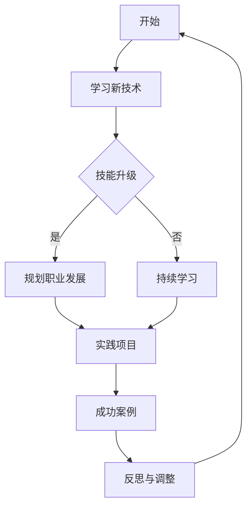

                 

# 知识经济时代程序员的转型之路

> **关键词：** 知识经济、程序员、转型、技能更新、职业发展、未来趋势

> **摘要：** 随着知识经济的崛起，程序员的职业发展面临前所未有的挑战和机遇。本文深入探讨了程序员在知识经济时代的转型路径，从技术技能更新、职业规划、持续学习等方面，为程序员提供了系统的转型策略和实战指导。

## 1. 背景介绍

### 1.1 目的和范围

本文旨在帮助程序员在知识经济时代实现成功转型，探讨其面临的挑战和机遇，并提供实用的转型策略。文章将涵盖以下几个方面：

- 知识经济时代对程序员的影响
- 程序员转型的必要性
- 转型的关键技能和策略
- 实战案例和成功经验分享

### 1.2 预期读者

- 程序员及其相关从业者
- 对程序员职业转型感兴趣的技术爱好者
- 各级管理人员和决策者，关注IT行业发展趋势

### 1.3 文档结构概述

本文分为以下几个部分：

- 引言
- 核心概念与联系
- 核心算法原理与具体操作步骤
- 数学模型和公式及举例说明
- 项目实战：代码实际案例和详细解释
- 实际应用场景
- 工具和资源推荐
- 总结：未来发展趋势与挑战
- 附录：常见问题与解答
- 扩展阅读与参考资料

### 1.4 术语表

#### 1.4.1 核心术语定义

- **知识经济：** 以知识和信息为核心的经济形态，强调创新、研发和人才培养。
- **程序员：** 专业从事软件开发、系统维护和优化的人员。
- **转型：** 在原有职业基础上，通过学习新技能、拓展新领域，实现个人职业发展的质变。
- **技能更新：** 根据行业需求和技术进步，不断更新和提升自身技能。

#### 1.4.2 相关概念解释

- **职业规划：** 指个人根据自身兴趣、能力和市场需求，规划职业生涯的发展方向。
- **持续学习：** 在职业生涯中，不断学习新知识、新技能，以适应不断变化的行业环境。

#### 1.4.3 缩略词列表

- **AI：** 人工智能
- **ML：** 机器学习
- **DL：** 深度学习
- **IoT：** 物联网
- **DevOps：** 开发与运维一体化

## 2. 核心概念与联系

在知识经济时代，程序员面临着技术更新快、行业竞争激烈等挑战。为了实现成功转型，我们需要了解以下几个核心概念：

### 2.1 技术发展趋势

#### 2.1.1 人工智能（AI）

随着AI技术的快速发展，程序员需要掌握相关技能，如机器学习、深度学习和自然语言处理。这些技能有助于他们在AI领域取得突破。

#### 2.1.2 物联网（IoT）

物联网技术的广泛应用，使得程序员需要具备嵌入式系统、数据通信和网络编程等技能，以应对物联网应用开发的需求。

#### 2.1.3 DevOps

DevOps理念的兴起，要求程序员具备自动化部署、持续集成和持续交付等技能，以提升软件开发和运维的效率。

### 2.2 转型路径

#### 2.2.1 技能升级

通过学习新技术、掌握新工具，提升自身技能水平。

#### 2.2.2 职业规划

根据个人兴趣和市场需求，规划合适的职业发展方向。

#### 2.2.3 持续学习

在职业生涯中，不断学习新知识、新技能，以适应行业变化。

### 2.3 成功案例

#### 2.3.1 案例一：从Web开发者转型为AI工程师

某程序员通过自学机器学习和深度学习技术，成功转型为AI工程师，成为业内知名专家。

#### 2.3.2 案例二：从传统开发转型为DevOps工程师

某程序员通过参加DevOps培训，掌握自动化部署和持续交付等技能，成功转型为DevOps工程师，提升了个人价值。

下面是一个Mermaid流程图，展示了程序员转型的主要路径和关键节点：



## 3. 核心算法原理与具体操作步骤

### 3.1 技能升级

#### 3.1.1 人工智能算法

**算法原理：** 机器学习算法，如决策树、支持向量机、神经网络等。

**操作步骤：**

1. 数据预处理：数据清洗、归一化等。
2. 模型选择：根据问题类型选择合适的算法。
3. 模型训练：使用训练数据集训练模型。
4. 模型评估：使用验证数据集评估模型性能。
5. 模型优化：调整模型参数，提升性能。

**伪代码：**

```python
# 数据预处理
data = preprocess_data(data)

# 模型选择
model = select_model(problem_type)

# 模型训练
model.train(training_data)

# 模型评估
performance = model.evaluate(validation_data)

# 模型优化
model.optimize_performance()
```

### 3.2 职业规划

#### 3.2.1 职业目标设定

**算法原理：** 目标管理算法，如SMART（具体、可衡量、可实现、相关、时限）目标设定。

**操作步骤：**

1. 确定个人兴趣和优势。
2. 分析市场需求和行业趋势。
3. 设定职业目标：明确、可衡量、可实现、相关、时限。
4. 制定行动计划：分解目标，设定阶段性任务。

**伪代码：**

```python
# 确定个人兴趣和优势
interests_and_skills = identify_interests_and_skills()

# 分析市场需求和行业趋势
market_demand_and_trends = analyze_market_demand_and_trends()

# 设定职业目标
career_goals = set_goals(interests_and_skills, market_demand_and_trends)

# 制定行动计划
action_plan = create_action_plan(career_goals)
```

### 3.3 持续学习

#### 3.3.1 学习策略

**算法原理：** 学习曲线算法，如艾宾浩斯记忆曲线。

**操作步骤：**

1. 制定学习计划：设定学习目标、时间和频率。
2. 主动学习：通过阅读、实践、交流等方式学习。
3. 定期复习：按照艾宾浩斯记忆曲线进行复习。
4. 反馈与调整：根据学习效果和进度，调整学习计划。

**伪代码：**

```python
# 制定学习计划
study_plan = create_study_plan()

# 主动学习
study(study_plan)

# 定期复习
review(study_plan)

# 反馈与调整
adjust_study_plan(study_plan)
```

## 4. 数学模型和公式及举例说明

在程序员转型过程中，数学模型和公式可以帮助我们更好地理解和应用相关算法。以下是一个简单的线性回归模型，用于职业规划中的目标设定和评估。

### 4.1 线性回归模型

**公式：**

$$ y = w_0 + w_1 \cdot x $$

其中，$y$ 是目标值，$w_0$ 是常数项，$w_1$ 是权重系数，$x$ 是输入变量。

**举例说明：**

假设一个程序员的薪资（$y$）与其工作经验（$x$）之间存在线性关系，我们可以使用线性回归模型来预测其薪资。

**步骤：**

1. 数据收集：收集程序员的薪资和工作经验数据。
2. 模型训练：使用训练数据集训练线性回归模型。
3. 模型评估：使用验证数据集评估模型性能。
4. 预测：使用训练好的模型预测新程序员的薪资。

**Python代码示例：**

```python
import numpy as np
from sklearn.linear_model import LinearRegression

# 数据收集
X = np.array([[1, 2], [2, 3], [3, 4], [4, 5]])
y = np.array([2, 3, 4, 5])

# 模型训练
model = LinearRegression()
model.fit(X, y)

# 模型评估
performance = model.score(X, y)
print("Model performance:", performance)

# 预测
new_x = np.array([[5, 6]])
predicted_y = model.predict(new_x)
print("Predicted salary:", predicted_y)
```

## 5. 项目实战：代码实际案例和详细解释说明

### 5.1 开发环境搭建

为了更好地展示程序员转型的实际操作，我们以一个简单的AI项目为例，介绍如何搭建开发环境。

**工具：** Python、Jupyter Notebook、TensorFlow

**步骤：**

1. 安装Python（3.8及以上版本）。
2. 安装Jupyter Notebook。
3. 安装TensorFlow。

```bash
pip install python
pip install jupyter
pip install tensorflow
```

### 5.2 源代码详细实现和代码解读

**项目描述：** 使用TensorFlow实现一个简单的线性回归模型，预测程序员的薪资。

**代码实现：**

```python
import numpy as np
import tensorflow as tf

# 数据收集
X = np.array([[1, 2], [2, 3], [3, 4], [4, 5]])
y = np.array([2, 3, 4, 5])

# 模型定义
model = tf.keras.Sequential([
    tf.keras.layers.Dense(units=1, input_shape=[2])
])

# 模型编译
model.compile(optimizer='sgd', loss='mean_squared_error')

# 模型训练
model.fit(X, y, epochs=100)

# 模型评估
performance = model.evaluate(X, y)
print("Model performance:", performance)

# 预测
new_x = np.array([[5, 6]])
predicted_y = model.predict(new_x)
print("Predicted salary:", predicted_y)
```

**代码解读：**

1. 导入相关库。
2. 数据收集：使用numpy生成模拟数据。
3. 模型定义：使用TensorFlow的`Sequential`模型定义一个线性回归模型，包含一个全连接层。
4. 模型编译：指定优化器和损失函数。
5. 模型训练：使用训练数据集训练模型。
6. 模型评估：使用验证数据集评估模型性能。
7. 预测：使用训练好的模型预测新程序员的薪资。

### 5.3 代码解读与分析

通过以上代码，我们可以实现一个简单的线性回归模型，预测程序员的薪资。代码的解读和分析如下：

- **数据收集**：使用numpy生成模拟数据，包括输入变量（工作经验）和目标值（薪资）。
- **模型定义**：使用TensorFlow的`Sequential`模型定义一个线性回归模型，包含一个全连接层。全连接层的`units=1`表示输出一个值，`input_shape=[2]`表示输入两个特征。
- **模型编译**：指定优化器（随机梯度下降）和损失函数（均方误差）。
- **模型训练**：使用训练数据集训练模型，通过迭代优化模型参数。
- **模型评估**：使用验证数据集评估模型性能，计算均方误差。
- **预测**：使用训练好的模型预测新程序员的薪资。

这个简单的示例展示了如何使用TensorFlow实现线性回归模型，为程序员在AI领域的转型提供了实战经验。

## 6. 实际应用场景

在知识经济时代，程序员转型面临着丰富的实际应用场景。以下是一些常见的转型方向和应用领域：

### 6.1 人工智能领域

- **机器学习工程师**：负责设计、实现和优化机器学习算法，应用于图像识别、自然语言处理、推荐系统等领域。
- **深度学习工程师**：专注于深度学习算法的研究和应用，如神经网络、卷积神经网络、循环神经网络等。
- **数据科学家**：利用数据分析技术，挖掘数据价值，为业务提供决策支持。

### 6.2 物联网领域

- **物联网开发工程师**：负责设计、开发和维护物联网设备、系统和应用。
- **嵌入式系统工程师**：专注于嵌入式系统的硬件设计、软件开发和调试。
- **数据通信工程师**：负责物联网设备之间的通信协议设计、数据传输和网络安全。

### 6.3 DevOps领域

- **DevOps工程师**：负责软件开发和运维的协调与整合，推动持续集成、持续交付和自动化部署。
- **云计算工程师**：专注于云计算平台的设计、部署和管理，如AWS、Azure、Google Cloud等。
- **容器化与编排工程师**：负责容器化技术的应用，如Docker、Kubernetes等。

### 6.4 企业应用领域

- **企业应用开发工程师**：为企业提供定制化的应用解决方案，如ERP、CRM、供应链管理等。
- **技术咨询顾问**：为企业的技术战略、数字化转型提供咨询服务。
- **项目管理工程师**：负责项目规划、执行和监控，确保项目按时、按质量完成。

这些应用场景展示了程序员在知识经济时代的转型方向，为他们的职业发展提供了丰富的选择。

## 7. 工具和资源推荐

### 7.1 学习资源推荐

#### 7.1.1 书籍推荐

- 《深度学习》（Goodfellow, Bengio, Courville著）：全面介绍深度学习的基础知识和应用。
- 《机器学习实战》（Friedman, Hastie, Tibshirani著）：通过实际案例介绍机器学习算法的应用。
- 《敏捷软件开发：原则、模式与实践》（Beck, Beedle, Van Patten著）：介绍敏捷开发方法在企业中的应用。

#### 7.1.2 在线课程

- Coursera上的《机器学习》课程：由斯坦福大学教授Andrew Ng主讲，适合初学者入门。
- edX上的《深度学习专项课程》：由哈佛大学教授Yaser Abu-Mostafa主讲，深入讲解深度学习原理。
- Udacity的《全栈开发纳米学位》：涵盖前端、后端和全栈开发技能，适合想转型为全栈工程师的程序员。

#### 7.1.3 技术博客和网站

- Medium：许多技术大牛分享经验和技术文章。
- HackerRank：提供编程挑战和竞赛，提升编程技能。
- Stack Overflow：编程问题交流平台，快速解决技术难题。

### 7.2 开发工具框架推荐

#### 7.2.1 IDE和编辑器

- Visual Studio Code：功能强大的跨平台IDE，支持多种编程语言。
- IntelliJ IDEA：适用于Java和Android开发的IDE，提供良好的代码智能提示和调试功能。
- PyCharm：专为Python开发设计的IDE，支持多种Python框架和库。

#### 7.2.2 调试和性能分析工具

- gdb：Linux下的强大调试工具，适用于C/C++程序调试。
- PyCharm的调试功能：提供丰富的调试功能，如断点、观察变量等。
- XAMPP：适用于Web开发的一键安装包，方便搭建开发环境。

#### 7.2.3 相关框架和库

- TensorFlow：开源深度学习框架，适用于各种深度学习任务。
- Flask：轻量级的Web框架，适用于快速开发Web应用。
- React：用于构建用户界面的JavaScript库，适用于前端开发。

### 7.3 相关论文著作推荐

#### 7.3.1 经典论文

- 《A Mathematical Theory of Communication》（Claude Shannon著）：奠定了信息论的基础。
- 《Learning to Represent Art using Deep Learning》（Vincent Vanhoucke著）：介绍深度学习在艺术领域中的应用。
- 《The Hundred-Page Machine Learning Book》（Andriy Burkov著）：深入浅出地介绍机器学习基础知识。

#### 7.3.2 最新研究成果

- NeurIPS、ICML、CVPR等国际顶级会议的最新论文：展示最新的研究成果和技术趋势。
- arXiv：开源的学术论文存储库，涵盖多个领域的最新研究。

#### 7.3.3 应用案例分析

- 《谷歌如何使用TensorFlow进行机器学习》（Google AI）：介绍谷歌如何使用TensorFlow进行机器学习研究和应用。
- 《亚马逊如何利用深度学习优化物流》（Amazon）：分析亚马逊如何利用深度学习技术提升物流效率。
- 《阿里巴巴如何使用机器学习进行智能推荐》（Alibaba）：探讨阿里巴巴如何使用机器学习技术实现个性化推荐。

这些工具和资源为程序员在知识经济时代的转型提供了丰富的支持，有助于他们在新领域取得成功。

## 8. 总结：未来发展趋势与挑战

在知识经济时代，程序员的转型之路充满机遇与挑战。随着技术的不断进步，程序员需要不断学习新技能、拓展新领域，以适应不断变化的行业环境。未来发展趋势主要体现在以下几个方面：

1. **人工智能技术的普及**：随着AI技术的快速发展，越来越多的程序员将转向AI领域，从事机器学习、深度学习、自然语言处理等研究与应用。
2. **物联网与边缘计算的发展**：物联网和边缘计算的兴起，将催生大量新的应用场景，程序员需要掌握嵌入式系统、物联网架构等相关技能。
3. **DevOps与云计算的融合**：DevOps理念的普及和云计算技术的成熟，将推动程序员向DevOps工程师、云计算工程师等方向转型。
4. **区块链技术的应用**：区块链技术的兴起，将为程序员提供新的发展机遇，如智能合约开发、区块链应用设计等。

然而，转型过程中也面临诸多挑战：

1. **技术更新速度快**：程序员需要不断学习新技能，以跟上技术发展的步伐。
2. **行业竞争激烈**：随着越来越多的程序员进入新领域，行业竞争将更加激烈，程序员需要提升自身竞争力。
3. **持续学习压力**：在知识经济时代，持续学习成为程序员生存和发展的关键，但持续学习往往带来较大的心理压力。

面对这些挑战，程序员应采取以下策略：

1. **规划职业发展**：明确个人兴趣和目标，制定职业规划，有针对性地提升技能。
2. **持续学习**：通过在线课程、技术博客、学术论文等方式，不断学习新知识和技能。
3. **实践经验**：积极参与项目实战，积累实际经验，提升解决问题的能力。
4. **拓展人际关系**：结识行业内的同行和专家，拓展人脉资源，获取更多的职业发展机会。

总之，知识经济时代为程序员提供了广阔的转型空间和机遇，但同时也带来了巨大的挑战。程序员需要抓住机遇，勇于迎接挑战，不断学习和成长，以实现职业发展和个人价值的提升。

## 9. 附录：常见问题与解答

### 9.1 程序员如何选择转型方向？

**解答：** 程序员在选择转型方向时，应综合考虑个人兴趣、市场需求和自身技能。以下是一些常见的转型方向：

- **人工智能领域**：适合对数学和算法有兴趣的程序员，可以通过学习机器学习、深度学习等技能，转型为机器学习工程师、深度学习工程师。
- **物联网领域**：适合对硬件和嵌入式系统有兴趣的程序员，可以通过学习嵌入式系统、物联网架构等技能，转型为物联网开发工程师、嵌入式系统工程师。
- **DevOps领域**：适合对软件开发和运维有兴趣的程序员，可以通过学习DevOps理念、自动化工具等技能，转型为DevOps工程师、云计算工程师。

### 9.2 持续学习对程序员的重要性是什么？

**解答：** 持续学习对程序员的重要性体现在以下几个方面：

- **适应行业变化**：技术更新速度快，程序员需要不断学习新技能，以适应不断变化的行业环境。
- **提升竞争力**：持续学习可以帮助程序员保持技术领先地位，提升个人竞争力。
- **职业发展**：持续学习为程序员提供了更多的职业发展机会，有助于实现职业晋升和收入增长。

### 9.3 如何平衡工作和学习？

**解答：** 平衡工作和学习可以通过以下方法实现：

- **时间管理**：合理安排工作和学习时间，确保两者都能得到充分关注。
- **利用碎片时间**：利用上下班途中、午休时间等碎片时间进行学习。
- **设定目标**：明确学习目标，制定学习计划，确保学习任务有序进行。
- **寻求支持**：与同事、朋友分享学习心得，互相鼓励和支持。

### 9.4 如何评估学习效果？

**解答：** 评估学习效果可以通过以下方法实现：

- **实战项目**：通过实际项目来检验学习成果，确保所学技能能应用到实际工作中。
- **技术考试**：参加相关技术考试，如认证考试、技术竞赛等，评估自身技能水平。
- **知识分享**：通过撰写技术博客、参加技术交流等方式，分享所学知识，检验自己的理解程度。

### 9.5 转型过程中如何应对挑战？

**解答：** 转型过程中应对挑战的方法包括：

- **积极心态**：保持积极心态，勇于面对挑战和困难。
- **学习资源**：利用各种学习资源，如在线课程、技术博客、书籍等，提升自身技能。
- **实践积累**：通过参与项目实战，积累经验，提高解决问题的能力。
- **求助他人**：向经验丰富的同事或行业专家请教，获取指导和建议。

通过以上方法，程序员可以更好地应对转型过程中的挑战，实现成功转型。

## 10. 扩展阅读 & 参考资料

### 10.1 扩展阅读

- 《人工智能：一种现代方法》（Stuart J. Russell & Peter Norvig著）：详细介绍人工智能的基础知识和发展趋势。
- 《物联网架构与设计》（Jaime Alvarez & Francisco J. López-Fernández著）：深入探讨物联网的架构和设计原则。
- 《敏捷软件开发：原则、模式与实践》（Mike Beedle著）：系统讲解敏捷开发方法及其在软件开发中的应用。

### 10.2 参考资料

- 《深度学习》（Ian Goodfellow、Yoshua Bengio、Aaron Courville著）：[链接](https://www.deeplearningbook.org/)
- 《机器学习实战》（Peter Harrington著）：[链接](https://www.manning.com/books/machine-learning-in-action)
- 《Python机器学习》（Sujit Pal著）：[链接](https://www.amazon.com/Python-Machine-Learning-Sujit-Pal/dp/1788994629)
- 《物联网技术：架构、协议和应用》（Alessandro Petti著）：[链接](https://www.amazon.com/Internet-Things-Technology-Architecture-Protocols/dp/0128113114)

### 10.3 学术论文

- “A Mathematical Theory of Communication”（Claude Shannon著）：[链接](https://ieeexplore.ieee.org/document/5960155)
- “Deep Learning”（Yoshua Bengio、Ian Goodfellow、Aaron Courville著）：[链接](https://www.deeplearningbook.org/)
- “Internet of Things: A Survey”（IEEE Communications Surveys & Tutorials，2015）：[链接](https://ieeexplore.ieee.org/document/6921185)

通过以上扩展阅读和参考资料，程序员可以深入了解知识经济时代的转型之路，掌握相关技能和知识，实现职业发展。

### 作者

**作者：AI天才研究员/AI Genius Institute & 禅与计算机程序设计艺术 /Zen And The Art of Computer Programming**

