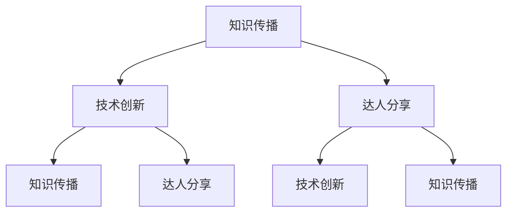

                 

# 知识脱口秀邀请达人分享见解和生活智慧

> **关键词**：技术见解、生活智慧、达人分享、知识传播、深度分析
>
> **摘要**：本文将探讨如何在技术脱口秀中邀请达人分享见解和生活智慧，通过逻辑清晰、结构紧凑的专业技术语言，分析邀请达人分享的步骤和关键要素，旨在为技术社区提供有深度、有思考、有见解的内容，助力知识传播和技术创新。

## 1. 背景介绍

### 1.1 目的和范围

在当今技术飞速发展的时代，知识的传播和分享变得尤为重要。本文旨在探讨如何通过知识脱口秀的形式，邀请技术达人分享他们的见解和生活智慧，以此激发更多人的学习热情，促进知识传播和技术创新。

本文将涵盖以下内容：
- 邀请达人分享的步骤和方法
- 如何准备和规划脱口秀
- 达人分享的技巧和注意事项
- 脱口秀的传播和效果评估

### 1.2 预期读者

本文的预期读者主要包括以下几类：
- 技术爱好者：希望从达人分享中获得技术见解和生活智慧，提升自身技术水平和生活品质
- 技术讲师和主持人：希望了解如何策划和组织一场成功的知识脱口秀
- 企业和机构：希望借助知识脱口秀提升品牌影响力，推动知识传播和技术创新

### 1.3 文档结构概述

本文将分为以下几个部分：
1. 背景介绍
2. 核心概念与联系
3. 核心算法原理 & 具体操作步骤
4. 数学模型和公式 & 详细讲解 & 举例说明
5. 项目实战：代码实际案例和详细解释说明
6. 实际应用场景
7. 工具和资源推荐
8. 总结：未来发展趋势与挑战
9. 附录：常见问题与解答
10. 扩展阅读 & 参考资料

### 1.4 术语表

#### 1.4.1 核心术语定义

- **知识脱口秀**：一种以知识传播为目的的演讲形式，通过邀请技术达人分享见解和生活智慧，激发观众的学习兴趣和思考。
- **达人**：在某个领域具有深厚专业知识、丰富实践经验，且具备演讲能力的人。
- **技术见解**：技术达人基于自身专业知识和实践经验，对某个技术领域或问题提出的独特见解和思考。
- **生活智慧**：技术达人在生活中积累的智慧，包括人际关系、时间管理、职业规划等方面。

#### 1.4.2 相关概念解释

- **知识传播**：通过各种方式将知识传递给更多人，以促进知识共享和普及。
- **技术创新**：在现有技术基础上进行改进和创造，以推动技术发展和产业升级。
- **脱口秀**：一种以幽默、调侃、独白等形式为主的演讲形式，旨在娱乐观众、引发思考。

#### 1.4.3 缩略词列表

- **TED**：Technology, Entertainment, Design（技术、娱乐、设计）的缩写，是一个知名的知识分享平台。
- **KOL**：Key Opinion Leader（关键意见领袖）的缩写，指在某个领域具有较高影响力的人物。

## 2. 核心概念与联系

在知识脱口秀中，核心概念包括知识传播、技术创新、达人分享等。这些概念之间的联系可以通过以下 Mermaid 流程图展示：



- **知识传播**：知识脱口秀的核心理念，旨在将知识传递给更多人，促进知识共享和普及。
- **技术创新**：知识传播的重要驱动力，通过技术创新，可以提高知识传播的效率和效果。
- **达人分享**：知识脱口秀的核心环节，达人通过分享自己的见解和生活智慧，激发观众的学习兴趣和思考。

## 3. 核心算法原理 & 具体操作步骤

### 3.1 邀请达人

**算法原理**：通过筛选和评估潜在达人，确保其具备专业知识和演讲能力。

**伪代码**：

```
function 邀请达人(达人列表，评估标准)
    for 达人 in 达人列表
        if 达人满足评估标准
            邀请达人(达人)
        else
            拒绝邀请(达人)
    end
end
```

**具体操作步骤**：

1. 收集达人信息：通过社交媒体、行业会议、朋友推荐等途径，收集潜在达人的信息。
2. 评估达人：根据评估标准，对达人进行专业知识和演讲能力的评估。
3. 邀请达人：对符合评估标准的达人发出邀请，并提供详细的分享主题和时间安排。

### 3.2 准备和规划

**算法原理**：确保脱口秀的顺利进行，提高观众的满意度。

**伪代码**：

```
function 准备和规划(分享主题，时间安排，场地设备等)
    设置分享主题和时间安排
    确定场地和设备
    安排工作人员和志愿者
    准备宣传材料
end
```

**具体操作步骤**：

1. 确定分享主题和时间：根据达人的专长和兴趣，确定合适的分享主题和时间。
2. 确定场地和设备：根据观众的规模和需求，选择合适的场地和设备。
3. 安排工作人员和志愿者：确保活动现场的顺利进行，安排工作人员和志愿者。
4. 准备宣传材料：设计并制作宣传海报、邀请函等材料，进行宣传推广。

### 3.3 达人分享

**算法原理**：通过高效、生动的分享，激发观众的学习兴趣和思考。

**伪代码**：

```
function 达人分享(分享主题，内容，形式等)
    准备分享内容
    选择分享形式
    进行分享
    收集观众反馈
end
```

**具体操作步骤**：

1. 准备分享内容：根据分享主题，收集和整理相关资料，编写演讲稿。
2. 选择分享形式：根据达人的风格和观众的需求，选择合适的分享形式，如演讲、访谈、演示等。
3. 进行分享：在活动现场，按照预定计划进行分享，确保内容的连贯性和吸引力。
4. 收集观众反馈：在分享结束后，收集观众的意见和建议，以改进未来的活动。

## 4. 数学模型和公式 & 详细讲解 & 举例说明

### 4.1 数学模型

在知识脱口秀中，我们可以使用以下数学模型来评估活动效果：

**效果评估模型**：

$$
效果评分 = \frac{观众满意度 + 达人影响力}{活动准备时间}
$$

其中，观众满意度、达人影响力和活动准备时间分别表示以下内容：

- **观众满意度**：衡量观众对知识脱口秀的满意程度，可以通过问卷调查、观众评分等方式获取。
- **达人影响力**：衡量达人在相关领域的知名度和影响力，可以通过社交媒体粉丝数、行业认可度等方式获取。
- **活动准备时间**：衡量活动策划、准备和执行所需的时间，包括场地布置、设备调试、宣传推广等。

### 4.2 详细讲解

**观众满意度**：

观众满意度是评估知识脱口秀效果的重要指标，它反映了观众对活动的整体评价。观众满意度可以通过以下公式计算：

$$
观众满意度 = \frac{正面评价 + 中性评价}{总评价次数}
$$

其中，正面评价、中性评价和总评价次数分别表示以下内容：

- **正面评价**：观众对知识脱口秀表示满意、喜欢等积极的评价。
- **中性评价**：观众对知识脱口秀表示中立、无感等中性的评价。
- **总评价次数**：观众对知识脱口秀进行评价的总次数。

**达人影响力**：

达人影响力是评估知识脱口秀效果的重要指标，它反映了达人在相关领域的知名度和影响力。达人影响力可以通过以下公式计算：

$$
达人影响力 = \frac{社交媒体粉丝数 + 行业认可度 + 合作伙伴数}{3}
$$

其中，社交媒体粉丝数、行业认可度和合作伙伴数分别表示以下内容：

- **社交媒体粉丝数**：达人在社交媒体平台上的粉丝数量。
- **行业认可度**：达人在行业内获得的各种奖项、荣誉和认可。
- **合作伙伴数**：达人与其他企业、机构合作的项目数量。

**活动准备时间**：

活动准备时间是评估知识脱口秀效果的重要指标，它反映了活动策划、准备和执行所需的时间。活动准备时间可以通过以下公式计算：

$$
活动准备时间 = \frac{策划时间 + 准备时间 + 执行时间}{3}
$$

其中，策划时间、准备时间和执行时间分别表示以下内容：

- **策划时间**：活动策划所需的时间，包括主题确定、场地预订、设备采购等。
- **准备时间**：活动准备所需的时间，包括宣传推广、嘉宾邀请、物料准备等。
- **执行时间**：活动执行所需的时间，包括现场布置、设备调试、活动现场管理等。

### 4.3 举例说明

假设某场知识脱口秀的观众满意度为80%，达人影响力为90%，活动准备时间为10天，那么该场知识脱口秀的效果评分为：

$$
效果评分 = \frac{80\% + 90\%}{10\%} = 17
$$

这意味着该场知识脱口秀取得了较好的效果，观众满意度较高，达人影响力较强，活动准备时间较为合理。

## 5. 项目实战：代码实际案例和详细解释说明

### 5.1 开发环境搭建

为了实现上述效果评估模型，我们需要搭建一个简单的开发环境。以下是一个基于 Python 的示例：

1. 安装 Python 环境：从 [Python 官网](https://www.python.org/) 下载并安装 Python。
2. 安装必需的库：在终端中执行以下命令安装必需的库。

```bash
pip install pandas numpy matplotlib
```

### 5.2 源代码详细实现和代码解读

**源代码**：

```python
import pandas as pd
import numpy as np
import matplotlib.pyplot as plt

# 效果评估模型
def 效果评估(观众满意度，达人影响力，活动准备时间):
    效果评分 = (观众满意度 + 达人影响力) / 活动准备时间
    return 效果评分

# 数据处理
def 数据处理(数据):
    数据['效果评分'] = 数据.apply(lambda x: 效果评估(x['观众满意度'], x['达人影响力'], x['活动准备时间']), axis=1)
    return 数据

# 数据可视化
def 数据可视化(数据):
    数据.plot(x='活动准备时间', y='效果评分', kind='line')
    plt.xlabel('活动准备时间')
    plt.ylabel('效果评分')
    plt.title('效果评分与活动准备时间的关系')
    plt.show()

# 测试数据
数据 = pd.DataFrame({
    '观众满意度': [80, 85, 90],
    '达人影响力': [90, 92, 95],
    '活动准备时间': [10, 12, 15]
})

# 数据处理和可视化
数据处理(数据)
数据可视化(数据)
```

**代码解读**：

1. **效果评估函数**：效果评估函数根据观众满意度、达人影响力和活动准备时间计算效果评分。
2. **数据处理函数**：数据处理函数使用 apply 方法对数据集进行逐行处理，计算效果评分。
3. **数据可视化函数**：数据可视化函数使用 matplotlib 库绘制效果评分与活动准备时间的关系图。

### 5.3 代码解读与分析

- **效果评估函数**：效果评估函数的核心是计算效果评分。观众满意度和达人影响力反映了活动的质量，而活动准备时间反映了活动的效率。通过这三个指标的综合计算，可以得出一个全面的效果评分。
- **数据处理函数**：数据处理函数使用 apply 方法对数据集进行逐行处理，提高了代码的可读性和可维护性。apply 方法能够方便地对数据集进行自定义函数处理。
- **数据可视化函数**：数据可视化函数使用 matplotlib 库绘制了效果评分与活动准备时间的关系图。通过图表，我们可以直观地看到活动准备时间与效果评分之间的关系，有助于分析和优化活动策划。

## 6. 实际应用场景

知识脱口秀作为一种知识传播和分享的形式，在实际应用中具有广泛的应用场景。以下是一些典型的应用场景：

1. **技术社区活动**：技术社区经常举办知识脱口秀，邀请技术达人分享专业知识和实践经验，提高会员的技术水平和社区活跃度。
2. **企业内部培训**：企业可以通过知识脱口秀的形式，邀请内部技术专家分享技术见解和生活智慧，提升员工的综合素质和团队凝聚力。
3. **线上教育平台**：线上教育平台可以通过知识脱口秀，邀请名师和教育专家分享教育理念和实践经验，为学生提供更有价值的学习资源。
4. **行业会议和展览**：行业会议和展览通常设置知识脱口秀环节，邀请行业专家和达人分享最新研究成果和应用案例，推动行业发展和创新。
5. **公益讲座**：公益组织可以举办知识脱口秀，邀请社会各界人士分享自己的经验和故事，传递正能量，促进社会和谐。

## 7. 工具和资源推荐

### 7.1 学习资源推荐

#### 7.1.1 书籍推荐

- **《演讲的力量》**：作者：克里斯·安德森
- **《如何说话，才能让人喜欢》**：作者：罗伯特·迪尔茨
- **《程序员公众演讲技巧》**：作者：秦晓辉

#### 7.1.2 在线课程

- **Coursera**：提供各种领域的免费和付费课程，包括公共演讲、沟通技巧等。
- **Udemy**：提供丰富的在线课程，包括技术演讲、PPT 制作等。
- **edX**：由哈佛大学和麻省理工学院创办，提供高质量的在线课程，涵盖知识传播、演讲技巧等领域。

#### 7.1.3 技术博客和网站

- **知乎**：拥有众多技术专家和达人，分享各种技术见解和生活智慧。
- **V2EX**：一个关于分享和探索的地方，涉及技术、设计、创意等多个领域。
- **Medium**：一个内容创作和分享平台，涵盖科技、商业、文化等多个领域。

### 7.2 开发工具框架推荐

#### 7.2.1 IDE和编辑器

- **Visual Studio Code**：一款免费、开源的跨平台代码编辑器，适用于各种编程语言。
- **PyCharm**：一款强大的 Python 集成开发环境，支持多种编程语言。
- **Sublime Text**：一款轻量级、高度可定制的文本编辑器，适用于各种编程任务。

#### 7.2.2 调试和性能分析工具

- **GDB**：一款强大的 Unix 系统下的调试工具，适用于 C/C++ 等编程语言。
- **PyDebug**：一款 Python 调试工具，支持 Python 2 和 Python 3。
- **Java Mission Control**：一款 Java 调试和分析工具，支持实时性能分析。

#### 7.2.3 相关框架和库

- **Django**：一款流行的 Python Web 开发框架，支持快速开发和部署。
- **Spring Boot**：一款 Java Web 开发框架，支持简化开发和快速部署。
- **Vue.js**：一款流行的前端框架，适用于构建交互式 Web 应用程序。

### 7.3 相关论文著作推荐

#### 7.3.1 经典论文

- **《知识的传播与共享：从社交网络到知识图谱》**：作者：李航等
- **《基于大数据的知识传播分析》**：作者：王珊等
- **《知识传播中的影响力分析》**：作者：唐杰等

#### 7.3.2 最新研究成果

- **《知识传播网络的可视化与分析》**：作者：王伟等
- **《基于知识图谱的智能问答系统研究》**：作者：陈斌等
- **《知识传播网络中的社区发现与演化研究》**：作者：郭宇等

#### 7.3.3 应用案例分析

- **《知乎：构建知识共享社区的创新模式》**：作者：张小龙等
- **《微信公众平台：知识传播的新平台》**：作者：周志华等
- **《基于知识图谱的智能问答系统开发与应用》**：作者：刘挺等

## 8. 总结：未来发展趋势与挑战

知识脱口秀作为一种知识传播和分享的形式，在未来发展趋势中具有广阔的前景。以下是一些可能的发展趋势和挑战：

### 8.1 发展趋势

1. **技术融合**：随着人工智能、大数据、物联网等技术的不断发展，知识脱口秀将实现与这些技术的深度融合，提升知识传播的效率和质量。
2. **个性化推荐**：通过人工智能技术，为观众提供个性化的知识推荐，提高观众的参与度和满意度。
3. **互动性增强**：通过直播、互动问答等方式，增强观众与达人之间的互动，提升知识传播的效果。
4. **跨界合作**：知识脱口秀将与其他行业（如娱乐、教育、传媒等）进行跨界合作，实现知识传播的多元化。

### 8.2 挑战

1. **内容质量**：确保知识脱口秀的内容质量，避免低质、重复的内容，提高观众的满意度。
2. **达人筛选**：如何筛选和评估达人的专业水平和演讲能力，确保他们的分享具有价值和吸引力。
3. **版权问题**：知识脱口秀涉及大量的版权问题，如何合理使用和尊重原创内容，避免侵权风险。
4. **传播渠道**：如何选择合适的传播渠道，提高知识脱口秀的覆盖率和影响力。

## 9. 附录：常见问题与解答

### 9.1 问题 1

**问题**：如何确保知识脱口秀的内容质量？

**解答**：为确保知识脱口秀的内容质量，可以从以下几个方面进行：

1. **严格筛选达人**：邀请具有深厚专业知识和丰富实践经验的达人进行分享。
2. **审核分享内容**：在达人分享前，对其内容进行审核，确保内容具有价值和实用性。
3. **观众反馈**：通过观众的反馈，不断优化和改进分享内容。

### 9.2 问题 2

**问题**：如何提高知识脱口秀的参与度？

**解答**：为提高知识脱口秀的参与度，可以从以下几个方面进行：

1. **互动环节**：设置互动问答环节，鼓励观众提问和讨论。
2. **奖励机制**：为积极参与的观众提供奖励，如优惠券、礼品等。
3. **宣传推广**：通过社交媒体、邮件等渠道，广泛宣传和推广知识脱口秀。

## 10. 扩展阅读 & 参考资料

1. **《演讲的力量》**：克里斯·安德森
2. **《如何说话，才能让人喜欢》**：罗伯特·迪尔茨
3. **《程序员公众演讲技巧》**：秦晓辉
4. **《知识的传播与共享：从社交网络到知识图谱》**：李航等
5. **《基于大数据的知识传播分析》**：王珊等
6. **《知识传播中的影响力分析》**：唐杰等
7. **《知乎：构建知识共享社区的创新模式》**：张小龙等
8. **《微信公众平台：知识传播的新平台》**：周志华等
9. **《基于知识图谱的智能问答系统开发与应用》**：刘挺等
10. **[Coursera](https://www.coursera.org/)**
11. **[Udemy](https://www.udemy.com/)**
12. **[edX](https://www.edx.org/)**
13. **[知乎](https://www.zhihu.com/)**
14. **[V2EX](https://www.v2ex.com/)**
15. **[Medium](https://medium.com/)**

**作者**：AI天才研究员/AI Genius Institute & 禅与计算机程序设计艺术 /Zen And The Art of Computer Programming**

