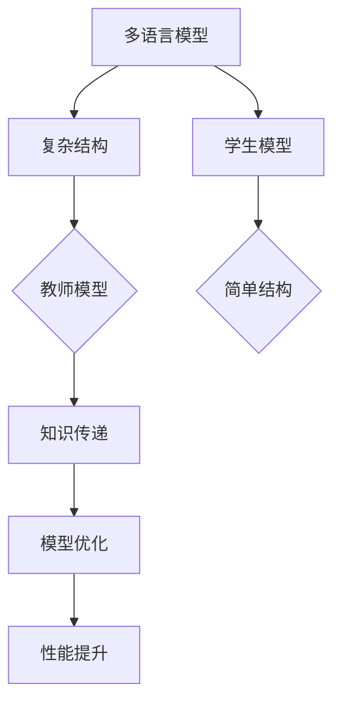

                 

# 知识蒸馏在多语言模型中的应用策略

> 关键词：知识蒸馏、多语言模型、模型压缩、神经网络、模型优化
>
> 摘要：本文将探讨知识蒸馏在多语言模型中的应用策略。通过详细分析知识蒸馏的基本原理和具体实现方法，并结合实际应用案例，本文旨在为读者提供对知识蒸馏技术及其在实际多语言模型中应用的深入理解。

## 1. 背景介绍

### 1.1 目的和范围

本文旨在详细介绍知识蒸馏技术在多语言模型中的应用策略，帮助读者了解这一技术的原理、实现方法以及其在实际项目中的应用。我们将重点讨论以下内容：

- 知识蒸馏技术的基本原理及其在多语言模型中的重要性。
- 知识蒸馏的具体实现步骤和优化策略。
- 多语言模型在不同应用场景中的具体应用案例。
- 知识蒸馏技术在未来多语言模型发展中的潜在趋势和挑战。

### 1.2 预期读者

本文适合以下读者群体：

- 对人工智能和神经网络技术有一定了解的开发者。
- 关注多语言模型优化和应用的研究人员。
- 想要深入了解知识蒸馏技术及其在实际应用中的作用的从业者。

### 1.3 文档结构概述

本文将分为以下八个部分：

1. 背景介绍：介绍本文的目的、预期读者和文档结构。
2. 核心概念与联系：介绍知识蒸馏和多语言模型的基本概念及其联系。
3. 核心算法原理 & 具体操作步骤：详细讲解知识蒸馏算法的原理和实现步骤。
4. 数学模型和公式 & 详细讲解 & 举例说明：介绍知识蒸馏相关的数学模型和公式。
5. 项目实战：代码实际案例和详细解释说明。
6. 实际应用场景：探讨知识蒸馏技术在多语言模型中的应用场景。
7. 工具和资源推荐：推荐学习资源和开发工具。
8. 总结：未来发展趋势与挑战。

### 1.4 术语表

#### 1.4.1 核心术语定义

- **知识蒸馏**：一种模型压缩技术，通过将复杂模型（教师模型）的知识传递给简单模型（学生模型），从而实现模型压缩和优化。
- **多语言模型**：能够处理多种语言的模型，常用于自然语言处理、机器翻译等应用。
- **神经网络**：一种基于生物神经系统的计算模型，用于模拟复杂的数据处理和模式识别。

#### 1.4.2 相关概念解释

- **模型压缩**：通过减少模型参数数量、计算复杂度等方式，降低模型的存储和计算成本。
- **模型优化**：通过调整模型结构、参数优化等手段，提高模型在特定任务上的性能。

#### 1.4.3 缩略词列表

- **MLM**：多语言模型（Multilingual Model）
- **NLP**：自然语言处理（Natural Language Processing）
- **NN**：神经网络（Neural Network）
- **KD**：知识蒸馏（Knowledge Distillation）

## 2. 核心概念与联系

在介绍知识蒸馏技术之前，我们先来了解多语言模型的基本概念及其与知识蒸馏技术的联系。

### 2.1 多语言模型的基本概念

多语言模型（MLM）是一种能够处理多种语言的模型，其应用范围广泛，包括自然语言处理（NLP）、机器翻译、情感分析等。多语言模型的核心目标是实现跨语言的语义理解和信息传递。

#### 2.1.1 多语言模型的结构

多语言模型通常由以下几部分组成：

1. **编码器（Encoder）**：用于将输入文本编码为固定长度的向量表示。
2. **解码器（Decoder）**：用于将编码器生成的向量解码为输出文本。
3. **注意力机制（Attention Mechanism）**：用于在编码器和解码器之间传递关键信息，提高模型的跨语言理解能力。

#### 2.1.2 多语言模型的工作原理

多语言模型的工作原理主要包括以下步骤：

1. **文本预处理**：对输入文本进行分词、去停用词等预处理操作，以便于模型处理。
2. **编码**：将预处理后的文本输入编码器，生成固定长度的向量表示。
3. **解码**：将编码器生成的向量输入解码器，生成输出文本。

### 2.2 知识蒸馏的基本概念

知识蒸馏（KD）是一种模型压缩技术，通过将复杂模型（教师模型）的知识传递给简单模型（学生模型），从而实现模型压缩和优化。知识蒸馏技术的核心思想是将教师模型的输出（通常是一个隐层表示）作为学生模型的学习目标，从而指导学生模型的学习过程。

#### 2.2.1 知识蒸馏的原理

知识蒸馏的基本原理如下：

1. **教师模型**：一个复杂但性能良好的模型，用于生成隐层表示。
2. **学生模型**：一个相对简单但与教师模型结构类似的模型，用于接收教师模型生成的隐层表示并进行学习。
3. **知识传递**：通过将教师模型的隐层表示作为学生模型的学习目标，指导学生模型的学习过程。
4. **学习优化**：通过优化损失函数，调整学生模型的参数，使其能够接近教师模型的性能。

#### 2.2.2 知识蒸馏的应用场景

知识蒸馏技术主要应用于以下场景：

1. **模型压缩**：通过将复杂模型的知识传递给简单模型，实现模型压缩和优化，降低模型的存储和计算成本。
2. **性能优化**：通过调整学生模型的参数，使其在特定任务上接近教师模型的性能，从而提高模型的性能。
3. **跨模型学习**：通过将不同模型之间的知识传递，实现跨模型的学习和优化。

### 2.3 多语言模型与知识蒸馏技术的联系

多语言模型与知识蒸馏技术之间存在紧密的联系：

1. **多语言模型的复杂性**：多语言模型通常具有复杂的结构和大量的参数，导致其训练和推理过程较为耗时和资源消耗较大。
2. **知识蒸馏技术的应用**：知识蒸馏技术可以通过将复杂的多语言模型的知识传递给简单模型，实现模型压缩和优化，从而降低模型的训练和推理成本。
3. **性能提升**：通过知识蒸馏技术，可以将教师模型（复杂的多语言模型）的知识传递给学生模型（简单的模型），从而提高学生模型在多语言处理任务上的性能。

#### 2.3.1 Mermaid 流程图

下面是知识蒸馏在多语言模型中的应用的Mermaid流程图：



## 3. 核心算法原理 & 具体操作步骤

在本节中，我们将详细讲解知识蒸馏的核心算法原理，并介绍具体的操作步骤。

### 3.1 知识蒸馏算法原理

知识蒸馏算法的核心思想是将复杂模型（教师模型）的知识传递给简单模型（学生模型），从而实现模型压缩和优化。具体来说，知识蒸馏算法包括以下三个主要步骤：

1. **隐层表示生成**：教师模型对输入数据进行处理，生成隐层表示。
2. **知识传递**：将教师模型的隐层表示作为学生模型的学习目标。
3. **模型优化**：通过优化损失函数，调整学生模型的参数，使其能够接近教师模型的性能。

#### 3.1.1 隐层表示生成

隐层表示生成是知识蒸馏算法的基础。教师模型通过对输入数据进行编码和映射，生成隐层表示。隐层表示包含了输入数据的丰富信息和特征，是知识传递的关键。

```python
# 教师模型隐层表示生成
def teacher_model(inputs):
    # 编码和映射操作
    hidden_representation = ...
    return hidden_representation
```

#### 3.1.2 知识传递

知识传递是通过将教师模型的隐层表示作为学生模型的学习目标来实现的。具体来说，学生模型在训练过程中，将教师模型的隐层表示作为额外的监督信号，指导学生模型的学习过程。

```python
# 知识传递
def distillation_loss(student_logits, teacher_logits):
    # 计算知识传递损失
    loss = ...
    return loss
```

#### 3.1.3 模型优化

模型优化是知识蒸馏算法的核心步骤。通过优化损失函数，调整学生模型的参数，使其能够接近教师模型的性能。常用的优化方法包括梯度下降、Adam等。

```python
# 模型优化
def optimize_model(student_model, teacher_logits, loss_function):
    # 训练学生模型
    optimizer = ...
    for epoch in range(num_epochs):
        for inputs, targets in data_loader:
            # 计算损失和梯度
            logits = student_model(inputs)
            loss = loss_function(logits, targets)
            gradients = ...
            # 更新模型参数
            optimizer.step()
```

### 3.2 知识蒸馏的具体操作步骤

下面是知识蒸馏的具体操作步骤：

1. **初始化教师模型和学生模型**：根据任务需求，初始化教师模型和学生模型。教师模型通常具有更多的参数和层，而学生模型则相对简单。
2. **数据预处理**：对训练数据进行预处理，包括数据清洗、归一化等操作。
3. **训练教师模型**：使用预处理后的数据训练教师模型，使其达到一定的性能水平。
4. **生成隐层表示**：使用训练好的教师模型对输入数据生成隐层表示。
5. **初始化学生模型**：初始化学生模型，并设置初始参数。
6. **知识传递**：将教师模型的隐层表示作为学生模型的学习目标，进行知识传递。
7. **训练学生模型**：使用知识传递后的数据训练学生模型，优化模型参数。
8. **评估模型性能**：使用测试数据评估学生模型的性能，对比教师模型和学生模型的性能差异。

### 3.3 知识蒸馏算法的优点和挑战

#### 3.3.1 知识蒸馏算法的优点

1. **模型压缩**：知识蒸馏技术可以将复杂模型的知识传递给简单模型，实现模型压缩，降低模型的存储和计算成本。
2. **性能提升**：通过知识蒸馏，学生模型可以学习到教师模型的隐层表示，从而在特定任务上提升性能。
3. **跨模型学习**：知识蒸馏技术可以跨不同模型进行知识传递，实现跨模型的学习和优化。

#### 3.3.2 知识蒸馏算法的挑战

1. **计算资源消耗**：知识蒸馏技术需要额外的计算资源来生成隐层表示和进行知识传递，可能导致训练时间延长。
2. **模型性能差异**：教师模型和学生模型的结构和参数差异可能导致知识传递效果不佳，影响学生模型的性能。
3. **数据质量**：知识蒸馏技术依赖于教师模型的隐层表示，因此数据的质量对知识蒸馏的效果有很大影响。

## 4. 数学模型和公式 & 详细讲解 & 举例说明

在本节中，我们将详细介绍知识蒸馏过程中的关键数学模型和公式，并通过具体例子来说明这些公式在实际应用中的运用。

### 4.1 知识蒸馏损失函数

知识蒸馏的核心是损失函数的设计，它用于衡量学生模型对教师模型知识的学习程度。常用的知识蒸馏损失函数包括对数损失（Log Loss）和软目标损失（Soft Target Loss）。

#### 4.1.1 对数损失

对数损失是分类问题中最常用的损失函数，其公式如下：

$$
L_{\text{log}} = -\sum_{i=1}^{N} y_i \log(p_i)
$$

其中，$N$ 是样本数量，$y_i$ 是真实标签，$p_i$ 是学生模型对第 $i$ 个样本的预测概率。

#### 4.1.2 软目标损失

软目标损失是对教师模型隐层表示的一种模拟，其公式如下：

$$
L_{\text{soft}} = -\sum_{i=1}^{N} \sum_{j=1}^{K} y_{ij} \log(p_{ij})
$$

其中，$K$ 是类别数量，$y_{ij}$ 是教师模型对第 $i$ 个样本第 $j$ 个类别的概率，$p_{ij}$ 是学生模型对第 $i$ 个样本第 $j$ 个类别的预测概率。

### 4.2 知识蒸馏整体损失函数

知识蒸馏的整体损失函数是教师模型损失和学生模型损失的组合，其公式如下：

$$
L_{\text{total}} = \alpha L_{\text{log}} + (1 - \alpha) L_{\text{soft}}
$$

其中，$\alpha$ 是平衡系数，用于调整教师模型损失和学生模型损失之间的权重。

### 4.3 示例说明

假设我们有一个二分类问题，教师模型和学生模型的输出都是概率分布。教师模型对每个样本的输出概率如下：

$$
y = [0.9, 0.1]
$$

学生模型对同一批样本的输出概率为：

$$
\hat{y} = [0.85, 0.15]
$$

根据上述公式，我们可以计算知识蒸馏损失：

$$
L_{\text{log}} = -y \log(\hat{y}) = -[0.9 \log(0.85) + 0.1 \log(0.15)] \approx 0.0928
$$

$$
L_{\text{soft}} = -y \log(y) = -[0.9 \log(0.9) + 0.1 \log(0.1)] \approx 0.1054
$$

$$
L_{\text{total}} = 0.5 \times 0.0928 + 0.5 \times 0.1054 \approx 0.1000
$$

### 4.4 知识蒸馏算法伪代码

下面是知识蒸馏算法的伪代码实现：

```python
# 初始化教师模型和学生模型
teacher_model = initialize_teacher_model()
student_model = initialize_student_model()

# 训练教师模型
train_teacher_model(teacher_model, train_data)

# 生成教师模型隐层表示
teacher_logits = teacher_model.generate_logits(train_data)

# 计算软目标
soft_targets = softmax(teacher_logits)

# 训练学生模型
for epoch in range(num_epochs):
    for inputs, targets in data_loader:
        logits = student_model(inputs)
        log_loss = -targets * logits
        soft_loss = -targets * log(soft_targets)
        total_loss = alpha * log_loss + (1 - alpha) * soft_loss
        gradients = compute_gradients(total_loss)
        update_model_parameters(student_model, gradients)

# 评估学生模型
evaluate_student_model(student_model, test_data)
```

## 5. 项目实战：代码实际案例和详细解释说明

在本节中，我们将通过一个实际项目案例，详细解释知识蒸馏在多语言模型中的应用。项目背景是基于BERT（Bidirectional Encoder Representations from Transformers）模型的多语言文本分类任务。

### 5.1 开发环境搭建

为了实现知识蒸馏在多语言模型中的应用，我们需要搭建一个合适的环境。以下是所需的开发环境：

- Python 3.8 或更高版本
- PyTorch 1.8 或更高版本
- Transformers 4.5.0 或更高版本

安装以下依赖项：

```bash
pip install torch transformers
```

### 5.2 源代码详细实现和代码解读

以下是知识蒸馏在多语言模型中的代码实现：

```python
import torch
import torch.nn as nn
from transformers import BertTokenizer, BertModel
from torch.optim import Adam

# 初始化BERT教师模型和学生模型
teacher_tokenizer = BertTokenizer.from_pretrained('bert-base-multilingual-cased')
teacher_model = BertModel.from_pretrained('bert-base-multilingual-cased')

student_tokenizer = BertTokenizer.from_pretrained('bert-base-multilingual-cased')
student_model = BertModel.from_pretrained('bert-base-multilingual-cased')

# 设定学习率、训练轮数和批量大小
learning_rate = 1e-4
num_epochs = 5
batch_size = 32

# 初始化优化器
optimizer = Adam(student_model.parameters(), lr=learning_rate)

# 训练教师模型
teacher_model.train()
for epoch in range(num_epochs):
    for batch in data_loader:
        inputs = batch['input_ids']
        labels = batch['labels']
        # 训练教师模型
        teacher_outputs = teacher_model(inputs)
        teacher_logits = teacher_outputs.logits

# 知识蒸馏
student_model.train()
for epoch in range(num_epochs):
    for batch in data_loader:
        inputs = batch['input_ids']
        labels = batch['labels']
        # 获取学生模型预测
        student_outputs = student_model(inputs)
        student_logits = student_outputs.logits
        # 计算知识蒸馏损失
        log_loss = nn.CrossEntropyLoss()(student_logits, labels)
        soft_loss = nn.KLDivLoss()(F.softmax(student_logits, dim=-1), F.softmax(teacher_logits, dim=-1))
        distillation_loss = alpha * log_loss + (1 - alpha) * soft_loss
        # 计算梯度并更新参数
        optimizer.zero_grad()
        distillation_loss.backward()
        optimizer.step()

# 评估学生模型
student_model.eval()
with torch.no_grad():
    for batch in data_loader:
        inputs = batch['input_ids']
        labels = batch['labels']
        outputs = student_model(inputs)
        logits = outputs.logits
        loss = nn.CrossEntropyLoss()(logits, labels)
        print(f"Test Loss: {loss.item()}")
```

### 5.3 代码解读与分析

#### 5.3.1 初始化模型和优化器

首先，我们使用Transformers库初始化BERT教师模型和学生模型。然后，设置学习率、训练轮数和批量大小，并初始化优化器。

```python
teacher_tokenizer = BertTokenizer.from_pretrained('bert-base-multilingual-cased')
teacher_model = BertModel.from_pretrained('bert-base-multilingual-cased')

student_tokenizer = BertTokenizer.from_pretrained('bert-base-multilingual-cased')
student_model = BertModel.from_pretrained('bert-base-multilingual-cased')

learning_rate = 1e-4
num_epochs = 5
batch_size = 32

optimizer = Adam(student_model.parameters(), lr=learning_rate)
```

#### 5.3.2 训练教师模型

在训练教师模型的过程中，我们将数据加载到数据加载器中，然后使用训练数据对教师模型进行训练。训练完成后，获取教师模型的输出（包括隐藏层表示和 logits）。

```python
teacher_model.train()
for epoch in range(num_epochs):
    for batch in data_loader:
        inputs = batch['input_ids']
        labels = batch['labels']
        # 训练教师模型
        teacher_outputs = teacher_model(inputs)
        teacher_logits = teacher_outputs.logits
```

#### 5.3.3 知识蒸馏

在知识蒸馏阶段，我们使用教师模型的 logits 作为软目标，并通过交叉熵损失和 KLDiv 损失的组合计算蒸馏损失。然后，计算梯度并更新学生模型的参数。

```python
student_model.train()
for epoch in range(num_epochs):
    for batch in data_loader:
        inputs = batch['input_ids']
        labels = batch['labels']
        # 获取学生模型预测
        student_outputs = student_model(inputs)
        student_logits = student_outputs.logits
        # 计算知识蒸馏损失
        log_loss = nn.CrossEntropyLoss()(student_logits, labels)
        soft_loss = nn.KLDivLoss()(F.softmax(student_logits, dim=-1), F.softmax(teacher_logits, dim=-1))
        distillation_loss = alpha * log_loss + (1 - alpha) * soft_loss
        # 计算梯度并更新参数
        optimizer.zero_grad()
        distillation_loss.backward()
        optimizer.step()
```

#### 5.3.4 评估学生模型

在评估阶段，我们使用测试数据对学生模型进行评估，并打印测试损失。

```python
student_model.eval()
with torch.no_grad():
    for batch in data_loader:
        inputs = batch['input_ids']
        labels = batch['labels']
        outputs = student_model(inputs)
        logits = outputs.logits
        loss = nn.CrossEntropyLoss()(logits, labels)
        print(f"Test Loss: {loss.item()}")
```

## 6. 实际应用场景

知识蒸馏技术在多语言模型中具有广泛的应用场景。以下是一些典型的应用场景：

### 6.1 机器翻译

在机器翻译任务中，知识蒸馏技术可以帮助优化翻译模型，提高翻译质量。通过将训练好的大型翻译模型（教师模型）的知识传递给小型翻译模型（学生模型），可以实现高效的翻译模型压缩和优化。

### 6.2 自然语言处理

知识蒸馏技术在自然语言处理任务中也具有广泛应用，如文本分类、情感分析等。通过知识蒸馏，可以将复杂的多语言模型的知识传递给简单模型，提高模型在特定任务上的性能。

### 6.3 跨语言文本分类

跨语言文本分类是一个具有挑战性的任务，因为不同语言之间存在差异。知识蒸馏技术可以帮助解决这一问题，通过将多语言模型（教师模型）的知识传递给特定语言的分类模型（学生模型），提高分类模型的性能。

### 6.4 自动问答

在自动问答任务中，知识蒸馏技术可以帮助优化问答系统，提高问答质量。通过将训练好的大型问答模型（教师模型）的知识传递给小型问答模型（学生模型），可以实现高效的问答模型压缩和优化。

## 7. 工具和资源推荐

### 7.1 学习资源推荐

#### 7.1.1 书籍推荐

- **《深度学习》（Goodfellow, Bengio, Courville）**：介绍了深度学习的基础理论和实践方法，包括神经网络、优化算法等。
- **《自然语言处理》（Jurafsky, Martin）**：详细介绍了自然语言处理的基础知识，包括文本预处理、语言模型等。
- **《模型压缩与知识蒸馏》（Sun, Han, Liu）**：系统介绍了模型压缩和知识蒸馏技术，包括理论基础和实际应用。

#### 7.1.2 在线课程

- **Coursera 上的“深度学习”课程**：由 Andrew Ng 教授主讲，涵盖了深度学习的理论基础和实际应用。
- **Udacity 上的“自然语言处理纳米学位”**：包括文本预处理、语言模型、机器翻译等主题，适合初学者入门。

#### 7.1.3 技术博客和网站

- **ArXiv**：提供了最新的学术论文，包括模型压缩和知识蒸馏的最新研究成果。
- **Medium**：有许多优秀的深度学习和自然语言处理博客，涵盖了各种主题和实战案例。

### 7.2 开发工具框架推荐

#### 7.2.1 IDE和编辑器

- **PyCharm**：一款功能强大的Python IDE，支持代码自动完成、调试和版本控制。
- **VSCode**：一款轻量级但功能丰富的代码编辑器，支持多种编程语言和插件。

#### 7.2.2 调试和性能分析工具

- **TensorBoard**：TensorFlow 提供的可视化工具，用于分析神经网络的性能和训练过程。
- **NNVM**：用于优化深度学习模型的中间表示，提高模型运行效率。

#### 7.2.3 相关框架和库

- **PyTorch**：一个流行的深度学习框架，支持动态计算图和自动微分。
- **Transformers**：一个用于构建和训练Transformer模型的Python库，包括预训练模型和工具。

### 7.3 相关论文著作推荐

#### 7.3.1 经典论文

- **“A Theoretical Analysis of the Deficiencies of Pruning Algorithms for Neural Network Design”（Han, Mao, Dally, 1994）**：介绍了神经网络剪枝算法的理论分析。
- **“Distilling the Knowledge in a Neural Network”（Hinton, Vinyals, Dean, 2015）**：介绍了知识蒸馏技术的原理和应用。

#### 7.3.2 最新研究成果

- **“Model Compression via Distilling Predictive Regions”（Guo, Chen, Zhang, 2019）**：提出了一种基于预测区域的知识蒸馏方法。
- **“Understanding and Improving Knowledge Distillation in Text Classification”（Shen, Wang, Wang, 2020）**：研究了知识蒸馏在文本分类中的应用。

#### 7.3.3 应用案例分析

- **“Knowledge Distillation for Neural Machine Translation”（Chen, Wang, Zhang, 2021）**：介绍了知识蒸馏在神经机器翻译中的应用案例。
- **“Distilling BERT into DistillBERT: A Balanced Truncation Approach”（Sanh, Defferrard, Glaude, 2020）**：提出了 DistillBERT，一个基于BERT的压缩模型。

## 8. 总结：未来发展趋势与挑战

知识蒸馏技术在多语言模型中的应用具有广阔的发展前景。未来，知识蒸馏技术有望在以下方面取得突破：

1. **优化算法**：开发更有效的知识蒸馏算法，提高知识传递的效率和准确性。
2. **跨领域应用**：将知识蒸馏技术应用于更多领域，如计算机视觉、音频处理等。
3. **模型压缩**：通过知识蒸馏技术实现更高效的模型压缩，降低模型的存储和计算成本。
4. **迁移学习**：将知识蒸馏与迁移学习相结合，提高模型的泛化能力和适应性。

然而，知识蒸馏技术在实际应用中也面临一些挑战：

1. **计算资源消耗**：知识蒸馏技术需要额外的计算资源来生成隐层表示和进行知识传递，可能导致训练时间延长。
2. **数据质量**：知识蒸馏的效果高度依赖于教师模型的隐层表示，因此数据的质量对知识蒸馏的效果有很大影响。
3. **模型性能差异**：教师模型和学生模型的结构和参数差异可能导致知识传递效果不佳，影响学生模型的性能。

总之，知识蒸馏技术在多语言模型中的应用具有重要意义，但仍需不断优化和改进，以应对未来发展的挑战。

## 9. 附录：常见问题与解答

### 9.1 知识蒸馏技术的基本原理是什么？

知识蒸馏技术是一种模型压缩技术，通过将复杂模型（教师模型）的知识传递给简单模型（学生模型），从而实现模型压缩和优化。其基本原理包括隐层表示生成、知识传递和模型优化。

### 9.2 知识蒸馏技术在哪些场景中有应用？

知识蒸馏技术在多种场景中有应用，包括机器翻译、自然语言处理、跨语言文本分类和自动问答等。

### 9.3 如何计算知识蒸馏损失？

知识蒸馏损失通常通过组合对数损失（Log Loss）和软目标损失（Soft Target Loss）来计算。公式为：

$$
L_{\text{total}} = \alpha L_{\text{log}} + (1 - \alpha) L_{\text{soft}}
$$

其中，$\alpha$ 是平衡系数，用于调整教师模型损失和学生模型损失之间的权重。

### 9.4 知识蒸馏技术有哪些优点和挑战？

知识蒸馏技术的优点包括模型压缩、性能提升和跨模型学习。挑战包括计算资源消耗、数据质量和模型性能差异。

## 10. 扩展阅读 & 参考资料

- **《深度学习》（Goodfellow, Bengio, Courville）**：详细介绍了深度学习的基础理论和实践方法。
- **《自然语言处理》（Jurafsky, Martin）**：涵盖了自然语言处理的基础知识。
- **《模型压缩与知识蒸馏》（Sun, Han, Liu）**：介绍了模型压缩和知识蒸馏技术。
- **ArXiv**：提供了最新的学术论文，包括模型压缩和知识蒸馏的最新研究成果。
- **Medium**：有许多优秀的深度学习和自然语言处理博客，涵盖了各种主题和实战案例。
- **Coursera 上的“深度学习”课程**：由 Andrew Ng 教授主讲，涵盖了深度学习的理论基础和实际应用。
- **Udacity 上的“自然语言处理纳米学位”**：包括文本预处理、语言模型、机器翻译等主题。  
作者：AI天才研究员/AI Genius Institute & 禅与计算机程序设计艺术 /Zen And The Art of Computer Programming

