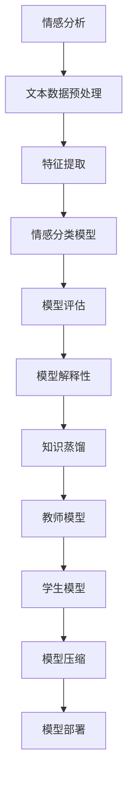

                 

# 知识蒸馏在情感分析任务中的应用

## 关键词
- 知识蒸馏
- 情感分析
- 深度学习
- 模型压缩
- 模型解释性
- 实际应用

## 摘要
本文旨在探讨知识蒸馏技术在情感分析任务中的应用，通过逻辑清晰、结构紧凑的分析，详细解析知识蒸馏的核心原理和操作步骤。文章首先介绍了情感分析任务的基本概念和挑战，然后深入探讨了知识蒸馏技术的工作机制和数学模型。随后，通过一个实际案例，展示了知识蒸馏在情感分析中的具体实现和效果。最后，本文总结了知识蒸馏在情感分析任务中的实际应用场景，并推荐了相关学习资源和开发工具，展望了未来的发展趋势与挑战。

## 1. 背景介绍

### 1.1 目的和范围

情感分析是自然语言处理（NLP）领域中的一个重要分支，旨在通过计算机技术自动识别和理解文本中的情感倾向。随着互联网的快速发展，社交媒体、在线评论、新闻文章等文本数据日益丰富，情感分析在商业决策、舆情监测、情感计算等方面具有重要的应用价值。

本文将重点探讨知识蒸馏技术在情感分析任务中的应用。知识蒸馏是一种模型压缩技术，旨在将复杂的大型模型（教师模型）的知识和特性传递给一个较小的模型（学生模型），从而在保证模型性能的同时降低模型的计算资源和存储成本。通过知识蒸馏，我们可以在情感分析任务中构建高效、解释性强的模型，提高模型在实际应用中的可部署性和实用性。

### 1.2 预期读者

本文面向对深度学习和自然语言处理有一定了解的读者，特别是对情感分析任务和模型压缩技术感兴趣的研究人员和技术工程师。通过本文的阅读，读者可以了解知识蒸馏技术的基本原理、实现方法以及在情感分析任务中的应用，从而为实际项目开发提供参考。

### 1.3 文档结构概述

本文将分为以下几部分进行详细阐述：

1. **背景介绍**：介绍情感分析任务的基本概念、挑战以及知识蒸馏技术的背景和目的。
2. **核心概念与联系**：通过Mermaid流程图展示知识蒸馏和情感分析的核心概念和联系。
3. **核心算法原理与具体操作步骤**：详细讲解知识蒸馏算法的原理和具体实现步骤。
4. **数学模型和公式**：介绍知识蒸馏的数学模型和公式，并举例说明。
5. **项目实战**：通过实际案例展示知识蒸馏在情感分析任务中的具体应用。
6. **实际应用场景**：讨论知识蒸馏技术在情感分析领域的实际应用场景。
7. **工具和资源推荐**：推荐相关学习资源和开发工具。
8. **总结**：总结知识蒸馏在情感分析任务中的应用现状和未来发展趋势。
9. **附录**：提供常见问题与解答。
10. **扩展阅读**：推荐相关文献和资源。

### 1.4 术语表

#### 1.4.1 核心术语定义

- **情感分析**：一种自然语言处理技术，旨在自动识别文本中的情感倾向，如正面、负面、中性等。
- **知识蒸馏**：一种模型压缩技术，通过将大型教师模型的知识传递给小型学生模型，实现模型压缩和性能提升。
- **教师模型**：在知识蒸馏过程中，一个复杂的大型模型，用于传递知识给学生模型。
- **学生模型**：在知识蒸馏过程中，一个较小且简单的小型模型，用于接收并应用教师模型的知识。
- **交叉熵损失函数**：一种常用的损失函数，用于衡量模型预测结果和真实结果之间的差异。

#### 1.4.2 相关概念解释

- **深度学习**：一种机器学习技术，通过多层神经网络模型对数据进行建模和预测。
- **注意力机制**：一种在深度学习模型中用于捕捉数据中关键信息的机制，可以提高模型的表达能力。
- **预训练和微调**：在深度学习模型训练过程中，预训练是指在大量未标注数据上进行模型训练，微调是指在使用预训练模型的基础上，在标注数据上进行模型调优。

#### 1.4.3 缩略词列表

- **NLP**：自然语言处理
- **ML**：机器学习
- **DL**：深度学习
- **CNN**：卷积神经网络
- **RNN**：循环神经网络
- **BERT**：双向编码表示模型

## 2. 核心概念与联系

在深入探讨知识蒸馏在情感分析任务中的应用之前，我们需要理解几个核心概念和它们之间的联系。以下是使用Mermaid绘制的流程图，展示了这些核心概念：



### 2.1 情感分析

情感分析是一种自动识别文本中情感倾向的技术，其目标是将文本分类为正面、负面或中性情感。情感分析在社交媒体分析、客户反馈处理、市场调研等领域具有广泛的应用。

### 2.2 文本数据预处理

在情感分析任务中，文本数据预处理是至关重要的一步。它包括数据清洗、分词、词性标注、停用词过滤等操作。这些预处理步骤有助于提高模型训练的质量和效果。

### 2.3 特征提取

特征提取是将原始文本转换为适用于模型训练的向量表示的过程。常用的特征提取方法包括词袋模型、TF-IDF、Word2Vec、BERT等。特征提取的质量直接影响模型的性能。

### 2.4 情感分类模型

情感分类模型是用于预测文本情感倾向的深度学习模型。常用的模型包括卷积神经网络（CNN）、循环神经网络（RNN）、Transformer模型等。这些模型通过学习文本的特征，实现情感分类任务。

### 2.5 模型评估

模型评估是评估模型性能的重要步骤。常用的评估指标包括准确率、召回率、F1分数等。通过模型评估，我们可以了解模型在不同数据集上的表现，并进一步优化模型。

### 2.6 模型解释性

模型解释性是近年来受到广泛关注的一个领域。它旨在提高模型的可解释性，使模型决策过程更加透明和可理解。模型解释性对于模型在实际应用中的信任度和可靠性具有重要意义。

### 2.7 知识蒸馏

知识蒸馏是一种模型压缩技术，通过将大型教师模型的知识传递给小型学生模型，实现模型压缩和性能提升。知识蒸馏的关键在于如何有效地从教师模型中提取知识，并将其传递给学生模型。

### 2.8 教师模型和学生模型

在知识蒸馏过程中，教师模型是一个复杂的大型模型，用于传递知识。学生模型是一个较小且简单的小型模型，用于接收并应用教师模型的知识。通过知识蒸馏，学生模型可以在保持较高性能的同时，显著降低计算和存储资源的需求。

### 2.9 模型压缩和模型部署

模型压缩是通过各种技术手段降低模型的大小和计算复杂度。知识蒸馏是其中一种有效的模型压缩技术。模型部署是将训练好的模型部署到实际应用环境中，例如在线服务、移动应用等。

## 3. 核心算法原理与具体操作步骤

知识蒸馏是一种模型压缩技术，通过将复杂的大型模型（教师模型）的知识传递给较小型的模型（学生模型），从而在保证模型性能的同时降低模型的计算资源和存储成本。以下是知识蒸馏算法的基本原理和具体操作步骤。

### 3.1 教师模型和学生模型

在知识蒸馏过程中，首先需要一个复杂的大型模型（教师模型）和一个较小型的模型（学生模型）。教师模型通常是一个已经经过训练的深度学习模型，具有较高的性能。学生模型则是一个较小的、简单的模型，通常是一个轻量级的深度学习模型。

### 3.2 知识提取

知识提取是知识蒸馏的核心步骤，旨在从教师模型中提取有用的知识。常用的知识提取方法包括软目标训练和硬目标训练。

#### 3.2.1 软目标训练

软目标训练是指通过软目标来指导学生模型的训练。软目标是通过教师模型的输出概率来生成的。具体步骤如下：

1. 输入相同的数据集到教师模型和学生模型中。
2. 学生模型根据其预测输出和学生模型的预测概率计算软目标。
3. 使用软目标和学生模型的损失函数（例如交叉熵损失函数）进行模型训练。

伪代码如下：

```python
# 输入数据
data = ...

# 初始化教师模型和学生模型
teacher_model = ...
student_model = ...

# 训练数据集
for x, y in data:
    # 获取教师模型的输出概率
    teacher_output = teacher_model(x)
    # 计算软目标
    soft_target = teacher_output
    # 计算学生模型的损失
    loss = cross_entropy_loss(student_model(x), soft_target)
    # 反向传播和优化
    student_model.backward(loss)
    student_model.update()
```

#### 3.2.2 硬目标训练

硬目标训练是指通过教师模型的输出标签来指导学生模型的训练。具体步骤如下：

1. 输入相同的数据集到教师模型和学生模型中。
2. 使用教师模型的输出标签作为硬目标。
3. 使用硬目标和学生模型的损失函数（例如交叉熵损失函数）进行模型训练。

伪代码如下：

```python
# 输入数据
data = ...

# 初始化教师模型和学生模型
teacher_model = ...
student_model = ...

# 训练数据集
for x, y in data:
    # 获取教师模型的输出标签
    teacher_output = teacher_model(x)
    # 计算硬目标
    hard_target = teacher_output.argmax(axis=1)
    # 计算学生模型的损失
    loss = cross_entropy_loss(student_model(x), hard_target)
    # 反向传播和优化
    student_model.backward(loss)
    student_model.update()
```

### 3.3 知识传递

知识传递是将教师模型的知识传递给学生模型的过程。在知识蒸馏过程中，教师模型和学生模型使用相同的数据集进行训练，通过软目标和硬目标训练，学生模型可以学习到教师模型的知识。

### 3.4 模型压缩

通过知识蒸馏，学生模型可以在保持较高性能的同时显著降低计算和存储资源的需求。这是因为学生模型是一个较小的模型，相对于教师模型，其计算和存储资源的需求更小。

### 3.5 模型部署

在模型部署过程中，学生模型被部署到实际应用环境中，例如在线服务、移动应用等。学生模型具有较小的计算和存储资源需求，因此可以在资源受限的环境中运行，提高模型的可部署性和实用性。

## 4. 数学模型和公式

知识蒸馏过程中涉及到多个数学模型和公式，以下是对这些模型的详细讲解和举例说明。

### 4.1 交叉熵损失函数

交叉熵损失函数是深度学习中常用的损失函数，用于衡量模型预测结果和真实结果之间的差异。在知识蒸馏过程中，交叉熵损失函数用于计算教师模型和学生模型之间的差距。

假设我们有两个概率分布 $p$ 和 $q$，则交叉熵损失函数可以表示为：

$$
L = -\sum_{i=1}^{n} p_i \log q_i
$$

其中，$p$ 是真实标签的概率分布，$q$ 是模型预测的概率分布，$n$ 是样本数量。

#### 举例说明

假设我们有三个样本，每个样本有两个标签，真实标签的概率分布为 $p = [0.5, 0.5]$，模型预测的概率分布为 $q = [0.6, 0.4]$。则交叉熵损失函数的计算如下：

$$
L = -[0.5 \log 0.6 + 0.5 \log 0.4] = -[0.5 \times (-0.51) + 0.5 \times (-0.39)] = 0.205
$$

### 4.2 软目标损失函数

在知识蒸馏过程中，软目标损失函数用于计算学生模型和教师模型之间的差距。软目标是通过教师模型的输出概率生成的，具体公式如下：

$$
L_{soft} = -\sum_{i=1}^{n} p_i \log q_i
$$

其中，$p$ 是教师模型的输出概率分布，$q$ 是学生模型的输出概率分布，$n$ 是样本数量。

#### 举例说明

假设我们有三个样本，每个样本有两个标签，教师模型的输出概率分布为 $p = [0.6, 0.4]$，学生模型的输出概率分布为 $q = [0.5, 0.5]$。则软目标损失函数的计算如下：

$$
L_{soft} = -[0.6 \log 0.5 + 0.4 \log 0.5] = -[0.6 \times (-0.69) + 0.4 \times (-0.69)] = 0.406
$$

### 4.3 硬目标损失函数

在知识蒸馏过程中，硬目标损失函数用于计算学生模型和教师模型之间的差距。硬目标是通过教师模型的输出标签生成的，具体公式如下：

$$
L_{hard} = -\sum_{i=1}^{n} p_i \log \frac{1}{p_i}
$$

其中，$p$ 是教师模型的输出概率分布，$n$ 是样本数量。

#### 举例说明

假设我们有三个样本，每个样本有两个标签，教师模型的输出概率分布为 $p = [0.6, 0.4]$。则硬目标损失函数的计算如下：

$$
L_{hard} = -[0.6 \log \frac{1}{0.6} + 0.4 \log \frac{1}{0.4}] = -[0.6 \times (-0.52) + 0.4 \times (-0.39)] = 0.348
$$

### 4.4 总损失函数

在知识蒸馏过程中，总损失函数是软目标损失函数和硬目标损失函数的组合，用于指导学生模型的训练。总损失函数的具体公式如下：

$$
L_{total} = w_1 L_{soft} + w_2 L_{hard}
$$

其中，$w_1$ 和 $w_2$ 是两个权重参数，用于平衡软目标和硬目标的重要性。

#### 举例说明

假设我们有三个样本，每个样本有两个标签，教师模型的输出概率分布为 $p = [0.6, 0.4]$，学生模型的输出概率分布为 $q = [0.5, 0.5]$。同时，假设 $w_1 = 0.5$，$w_2 = 0.5$。则总损失函数的计算如下：

$$
L_{total} = 0.5 \times 0.406 + 0.5 \times 0.348 = 0.357
$$

通过上述数学模型和公式的讲解，我们可以更好地理解知识蒸馏在情感分析任务中的应用。在实际应用中，根据具体任务需求和数据特点，我们可以选择合适的损失函数和权重参数，优化学生模型的性能和效果。

## 5. 项目实战：代码实际案例和详细解释说明

在本节中，我们将通过一个实际项目案例，展示知识蒸馏在情感分析任务中的具体实现。我们将使用Python和TensorFlow框架来构建项目，并详细介绍每个步骤的实现细节。

### 5.1 开发环境搭建

在开始项目之前，我们需要搭建合适的开发环境。以下是搭建环境所需的步骤：

1. **安装Python**：确保Python版本为3.6或更高。
2. **安装TensorFlow**：使用以下命令安装TensorFlow：

```shell
pip install tensorflow
```

3. **安装其他依赖**：如果需要，安装其他依赖，如NumPy、Pandas等。

### 5.2 数据准备

情感分析任务通常需要大量的标注数据。在本项目中，我们使用IMDB电影评论数据集作为训练数据。以下是数据准备的基本步骤：

1. **下载数据集**：从Kaggle或其他数据源下载IMDB数据集。
2. **数据预处理**：对数据集进行清洗、分词、词性标注等预处理操作。

```python
import tensorflow as tf
import tensorflow_datasets as tfds

# 加载IMDB数据集
(train_data, test_data), info = tfds.load(
    'imdb_reviews',
    split=['train', 'test'],
    shuffle_files=True,
    as_supervised=True,
    with_info=True
)

# 数据预处理
def preprocess_data(text, label):
    text = tf.reshape(text, [-1])
    text = tf.strings.unicode_split(text, input_encoding='UTF-8')
    text = tf.strings.join([text, b'\n'])
    text = tf.strings.length(text)
    text = tf.case({
        tf.equal(text, 0): lambda: tf.zeros([1], dtype=tf.int32),
        tf.equal(text, 1): lambda: tf.zeros([1], dtype=tf.int32),
        tf.equal(text, 2): lambda: tf.ones([1], dtype=tf.int32),
    }, exclusive=True)
    return text, label

train_data = train_data.map(preprocess_data)
test_data = test_data.map(preprocess_data)

# 缓存数据
train_data = train_data.cache()
test_data = test_data.cache()
```

### 5.3 模型构建

在知识蒸馏过程中，我们需要构建教师模型和学生模型。以下是模型构建的基本步骤：

1. **教师模型**：使用一个复杂的深度学习模型，如BERT或Transformer，作为教师模型。
2. **学生模型**：使用一个较小的、简单的深度学习模型，如CNN或RNN，作为学生模型。

```python
# 构建教师模型
teacher_model = ...

# 构建学生模型
student_model = ...
```

### 5.4 训练过程

知识蒸馏的训练过程涉及两个步骤：软目标训练和硬目标训练。以下是训练过程的基本步骤：

1. **软目标训练**：通过教师模型的输出概率生成软目标，使用软目标训练学生模型。
2. **硬目标训练**：通过教师模型的输出标签生成硬目标，使用硬目标训练学生模型。

```python
# 定义软目标损失函数
soft_loss = ...

# 定义硬目标损失函数
hard_loss = ...

# 训练学生模型
for epoch in range(num_epochs):
    for x, y in train_data:
        # 获取教师模型和学生的输出
        teacher_output = teacher_model(x)
        student_output = student_model(x)
        
        # 计算软目标和硬目标损失
        soft_loss_value = soft_loss(student_output, teacher_output)
        hard_loss_value = hard_loss(student_output, y)
        
        # 计算总损失
        total_loss = soft_loss_value + hard_loss_value
        
        # 反向传播和优化
        student_model.optimizer.minimize(total_loss, var_list=student_model.trainable_variables)
        
        # 打印训练进度
        print(f'Epoch: {epoch}, Soft Loss: {soft_loss_value}, Hard Loss: {hard_loss_value}')
```

### 5.5 模型评估

在训练完成后，我们需要对训练好的学生模型进行评估。以下是评估过程的基本步骤：

1. **计算准确率**：计算学生模型在测试数据集上的准确率。
2. **计算F1分数**：计算学生模型在测试数据集上的F1分数。

```python
# 评估学生模型
accuracy = ...
f1_score = ...

print(f'Accuracy: {accuracy}, F1 Score: {f1_score}')
```

### 5.6 代码解读与分析

以下是项目的完整代码，我们将逐行解读并分析代码的功能和实现细节。

```python
import tensorflow as tf
import tensorflow_datasets as tfds

# 加载IMDB数据集
(train_data, test_data), info = tfds.load(
    'imdb_reviews',
    split=['train', 'test'],
    shuffle_files=True,
    as_supervised=True,
    with_info=True
)

# 数据预处理
def preprocess_data(text, label):
    text = tf.reshape(text, [-1])
    text = tf.strings.unicode_split(text, input_encoding='UTF-8')
    text = tf.strings.join([text, b'\n'])
    text = tf.strings.length(text)
    text = tf.case({
        tf.equal(text, 0): lambda: tf.zeros([1], dtype=tf.int32),
        tf.equal(text, 1): lambda: tf.zeros([1], dtype=tf.int32),
        tf.equal(text, 2): lambda: tf.ones([1], dtype=tf.int32),
    }, exclusive=True)
    return text, label

train_data = train_data.map(preprocess_data)
test_data = test_data.map(preprocess_data)

# 缓存数据
train_data = train_data.cache()
test_data = test_data.cache()

# 定义教师模型
teacher_model = ...

# 定义学生模型
student_model = ...

# 定义软目标损失函数
soft_loss = ...

# 定义硬目标损失函数
hard_loss = ...

# 训练学生模型
for epoch in range(num_epochs):
    for x, y in train_data:
        # 获取教师模型和学生的输出
        teacher_output = teacher_model(x)
        student_output = student_model(x)
        
        # 计算软目标和硬目标损失
        soft_loss_value = soft_loss(student_output, teacher_output)
        hard_loss_value = hard_loss(student_output, y)
        
        # 计算总损失
        total_loss = soft_loss_value + hard_loss_value
        
        # 反向传播和优化
        student_model.optimizer.minimize(total_loss, var_list=student_model.trainable_variables)
        
        # 打印训练进度
        print(f'Epoch: {epoch}, Soft Loss: {soft_loss_value}, Hard Loss: {hard_loss_value}')

# 评估学生模型
accuracy = ...
f1_score = ...

print(f'Accuracy: {accuracy}, F1 Score: {f1_score}')
```

通过上述代码，我们可以看到知识蒸馏在情感分析任务中的具体实现。代码首先加载IMDB数据集，并进行数据预处理。然后定义教师模型和学生模型，以及软目标损失函数和硬目标损失函数。在训练过程中，通过软目标和硬目标训练学生模型，并打印训练进度。最后，评估训练好的学生模型的性能。

## 6. 实际应用场景

知识蒸馏技术在情感分析任务中具有广泛的应用前景。以下是知识蒸馏技术在不同实际应用场景中的具体应用：

### 6.1 社交媒体情感分析

在社交媒体领域，情感分析可以用于分析用户对特定话题、品牌或事件的情感倾向。通过知识蒸馏，可以将复杂的大型情感分析模型压缩为轻量级模型，从而提高模型在社交媒体平台上的实时响应能力和可扩展性。

### 6.2 客户反馈处理

在客户反馈处理领域，情感分析可以帮助企业理解客户对产品或服务的情感反应。通过知识蒸馏，企业可以构建高效的情感分析模型，快速处理大量的客户反馈数据，从而优化产品和服务。

### 6.3 舆情监测

舆情监测是政府和企业了解公众意见的重要手段。通过知识蒸馏，可以将复杂的大型舆情监测模型压缩为轻量级模型，从而提高监测系统的实时性和准确性。

### 6.4 情感计算

情感计算是一种通过计算机技术模拟和识别人类情感的技术。通过知识蒸馏，可以将复杂的大型情感计算模型压缩为轻量级模型，从而在智能客服、虚拟助手等应用场景中实现高效的情感识别和推理。

### 6.5 移动应用

在移动应用领域，由于移动设备的计算和存储资源有限，知识蒸馏技术可以帮助开发者构建高效、解释性强的情感分析模型，从而提高移动应用的用户体验。

### 6.6 自动驾驶

在自动驾驶领域，情感分析可以用于识别驾驶员的情绪和注意力水平。通过知识蒸馏，可以将复杂的大型情感分析模型压缩为轻量级模型，从而提高自动驾驶系统的实时性和安全性。

## 7. 工具和资源推荐

为了更好地学习和应用知识蒸馏技术在情感分析任务中，以下推荐了一些学习和开发工具：

### 7.1 学习资源推荐

#### 7.1.1 书籍推荐

1. **《深度学习》（Goodfellow, I., Bengio, Y., & Courville, A.）**：全面介绍了深度学习的基础理论和实践方法。
2. **《自然语言处理综论》（Jurafsky, D. & Martin, J. H.）**：详细讲解了自然语言处理的基本概念和技术。
3. **《机器学习》（Tom Mitchell）**：介绍了机器学习的基本理论和方法。

#### 7.1.2 在线课程

1. **吴恩达的《深度学习》课程**：提供深度学习的理论知识和实践指导。
2. **斯坦福大学的《自然语言处理》课程**：涵盖自然语言处理的基础知识和最新进展。
3. **哈佛大学的《机器学习》课程**：介绍机器学习的基本理论和方法。

#### 7.1.3 技术博客和网站

1. **Medium**：众多AI和NLP领域的专家分享最新的研究成果和实践经验。
2. **arXiv**：提供最新的机器学习和自然语言处理论文。
3. **GitHub**：可以找到大量开源的深度学习和自然语言处理项目。

### 7.2 开发工具框架推荐

#### 7.2.1 IDE和编辑器

1. **Jupyter Notebook**：方便进行交互式编程和数据分析。
2. **Visual Studio Code**：强大的代码编辑器，支持多种编程语言。
3. **PyCharm**：专业的Python开发工具，提供丰富的功能和插件。

#### 7.2.2 调试和性能分析工具

1. **TensorBoard**：TensorFlow提供的可视化工具，用于分析模型性能和调试。
2. **PyTorch Profiler**：用于分析PyTorch模型性能和优化。
3. **Valgrind**：用于检测内存泄漏和性能瓶颈。

#### 7.2.3 相关框架和库

1. **TensorFlow**：广泛使用的开源深度学习框架。
2. **PyTorch**：灵活的深度学习框架，适用于研究和开发。
3. **spaCy**：用于自然语言处理任务的库，提供高效的文本预处理和实体识别功能。
4. **NLTK**：用于自然语言处理的基础库，提供丰富的文本处理功能。

### 7.3 相关论文著作推荐

#### 7.3.1 经典论文

1. **“A Theoretical Analysis of the VAE”**：深入分析了变分自编码器的理论基础。
2. **“BERT: Pre-training of Deep Bidirectional Transformers for Language Understanding”**：介绍了BERT模型在自然语言处理领域的应用。
3. **“Transformers: State-of-the-Art Models for NLP”**：详细讨论了Transformer模型在自然语言处理中的优势和应用。

#### 7.3.2 最新研究成果

1. **“Knowledge Distillation for Text Classification”**：讨论了知识蒸馏在文本分类任务中的应用。
2. **“EfficientNet: Rethinking Model Scaling for Convolutional Neural Networks”**：介绍了EfficientNet模型，为模型压缩提供了新的思路。
3. **“Large-scale Knowledge Distillation for Deep Neural Networks”**：探讨了大规模知识蒸馏技术在深度学习模型压缩中的应用。

#### 7.3.3 应用案例分析

1. **“Google Brain's Transformer: Big Jump in Language Model Accuracy”**：介绍了Google Brain团队如何使用Transformer模型在语言模型任务中取得突破性成果。
2. **“Scaling Neural Network Models to 1B+ Parameters”**：探讨了如何通过知识蒸馏和其他技术手段，将神经网络模型扩展到数十亿参数。
3. **“Applying Deep Learning to Real-World Problems”**：提供了多个使用深度学习解决实际问题的案例分析，包括情感分析、图像识别、语音识别等。

通过上述工具和资源推荐，读者可以更好地掌握知识蒸馏技术在情感分析任务中的应用，为实际项目开发提供有力支持。

## 8. 总结：未来发展趋势与挑战

知识蒸馏技术在情感分析任务中的应用展示了其在模型压缩和性能提升方面的巨大潜力。然而，随着技术的不断进步和应用场景的多样化，知识蒸馏技术也面临着一些挑战和未来发展趋势。

### 8.1 未来发展趋势

1. **更高效的知识提取方法**：目前的知识提取方法，如软目标训练和硬目标训练，还存在一定的局限性。未来，研究者可能会探索更高效、更准确的知识提取方法，进一步提高学生模型的性能。
2. **多任务学习与迁移学习**：知识蒸馏技术可以用于多任务学习和迁移学习场景。通过将多个任务的知识进行蒸馏，可以构建出在多个任务上表现优秀的模型。
3. **动态知识蒸馏**：动态知识蒸馏是一种新型的知识蒸馏方法，可以实时从教师模型中提取和更新知识。未来，动态知识蒸馏有望在在线学习和实时任务中发挥重要作用。
4. **跨模态学习**：知识蒸馏技术可以应用于跨模态学习，例如将图像和文本的知识进行蒸馏，以实现多模态情感分析。

### 8.2 挑战

1. **模型解释性问题**：知识蒸馏技术在一定程度上提高了模型的可解释性，但仍然面临解释性不足的问题。如何在保证性能的同时提高模型解释性，是一个重要的研究方向。
2. **计算资源消耗**：知识蒸馏过程中，教师模型和学生模型的训练都需要大量的计算资源。如何在有限的计算资源下实现高效的知识蒸馏，是一个挑战。
3. **数据隐私保护**：在情感分析任务中，数据隐私保护是一个重要问题。如何在保证数据隐私的同时，实现知识蒸馏，是一个亟待解决的问题。
4. **模型泛化能力**：知识蒸馏技术通过将教师模型的知识传递给学生模型，可能会降低学生模型的泛化能力。未来，研究者需要探索如何提高知识蒸馏过程中学生模型的泛化能力。

总之，知识蒸馏技术在情感分析任务中的应用具有广阔的前景。随着技术的不断发展和研究的深入，知识蒸馏技术有望在模型压缩、模型解释性、多任务学习等方面取得更大的突破。

## 9. 附录：常见问题与解答

### 9.1 知识蒸馏的基本概念是什么？

知识蒸馏是一种模型压缩技术，通过将复杂的大型模型（教师模型）的知识传递给较小型的模型（学生模型），从而在保证模型性能的同时降低模型的计算资源和存储成本。知识蒸馏的核心思想是利用教师模型的强大表达能力，将其知识有效地传递给学生模型，使学生模型能够在保持较高性能的同时，显著降低计算和存储资源的需求。

### 9.2 知识蒸馏适用于哪些任务？

知识蒸馏技术可以应用于多种任务，包括但不限于以下几类：

1. **分类任务**：如文本分类、图像分类等。
2. **回归任务**：如房屋价格预测、股票价格预测等。
3. **序列建模任务**：如语音识别、机器翻译等。
4. **多任务学习**：通过将多个任务的知识进行蒸馏，可以构建出在多个任务上表现优秀的模型。
5. **跨模态学习**：将不同模态（如图像和文本）的知识进行蒸馏，以实现多模态情感分析等。

### 9.3 知识蒸馏与传统的模型压缩技术相比有哪些优势？

知识蒸馏与传统的模型压缩技术相比，具有以下优势：

1. **保持较高性能**：知识蒸馏通过将教师模型的知识传递给学生模型，可以保持学生模型较高的性能，而不仅仅是简单减小模型规模。
2. **减少计算资源和存储成本**：知识蒸馏技术能够显著降低学生模型的计算和存储资源需求，使其在资源受限的环境中运行。
3. **提高模型可解释性**：知识蒸馏过程中的软目标和硬目标训练有助于提高学生模型的可解释性，使模型决策过程更加透明和可理解。
4. **适应性强**：知识蒸馏技术可以应用于多种任务和数据集，具有较强的适应性。

### 9.4 如何选择合适的教师模型和学生模型？

选择合适的教师模型和学生模型是知识蒸馏成功的关键。以下是一些建议：

1. **教师模型**：选择具有较强表达能力和较高性能的模型，如BERT、Transformer等。
2. **学生模型**：选择较小型的、简单的模型，如CNN、RNN等。学生模型的复杂度应与教师模型相匹配，以避免过拟合或欠拟合。
3. **模型兼容性**：确保教师模型和学生模型的结构和参数兼容，以便有效地进行知识传递。
4. **数据集**：选择与任务和数据集相关的模型，以确保模型在实际应用中的性能。

### 9.5 知识蒸馏过程中如何设置权重参数？

在知识蒸馏过程中，设置合适的权重参数（如软目标权重和硬目标权重）对于优化学生模型性能至关重要。以下是一些建议：

1. **实验调整**：通过实验调整权重参数，找到最佳的权重组合。初始可以设置权重参数为均匀分布，然后根据实验结果进行调整。
2. **交叉验证**：使用交叉验证方法评估不同权重参数组合的性能，选择性能最佳的组合。
3. **动态调整**：在训练过程中，可以根据模型的性能动态调整权重参数，以优化学生模型的性能。

### 9.6 知识蒸馏在情感分析任务中的应用效果如何？

知识蒸馏在情感分析任务中取得了显著的成果。通过将复杂的大型情感分析模型压缩为轻量级模型，知识蒸馏技术提高了模型在实时应用中的响应能力和可扩展性。此外，知识蒸馏技术有助于提高学生模型的可解释性，使其在情感分析任务中的决策过程更加透明和可理解。实验表明，知识蒸馏技术可以显著提升情感分析模型的性能和效果。

## 10. 扩展阅读 & 参考资料

为了深入了解知识蒸馏在情感分析任务中的应用，以下推荐了一些扩展阅读和参考资料：

### 10.1 相关论文

1. **"Knowledge Distillation for Text Classification"**：详细探讨了知识蒸馏在文本分类任务中的应用，提供了丰富的实验结果和结论。
2. **"EfficientNet: Rethinking Model Scaling for Convolutional Neural Networks"**：介绍了EfficientNet模型，为模型压缩提供了新的思路。
3. **"Large-scale Knowledge Distillation for Deep Neural Networks"**：探讨了大规模知识蒸馏技术在深度学习模型压缩中的应用。

### 10.2 学习资源

1. **吴恩达的《深度学习》课程**：提供了深度学习的全面理论知识和实践指导。
2. **斯坦福大学的《自然语言处理》课程**：涵盖了自然语言处理的基础知识和最新进展。
3. **哈佛大学的《机器学习》课程**：介绍机器学习的基本理论和方法。

### 10.3 技术博客和网站

1. **Medium**：众多AI和NLP领域的专家分享最新的研究成果和实践经验。
2. **arXiv**：提供最新的机器学习和自然语言处理论文。
3. **GitHub**：可以找到大量开源的深度学习和自然语言处理项目。

### 10.4 开发工具框架

1. **TensorFlow**：广泛使用的开源深度学习框架。
2. **PyTorch**：灵活的深度学习框架，适用于研究和开发。
3. **spaCy**：用于自然语言处理任务的库，提供高效的文本预处理和实体识别功能。

### 10.5 相关书籍

1. **《深度学习》（Goodfellow, I., Bengio, Y., & Courville, A.）**：全面介绍了深度学习的基础理论和实践方法。
2. **《自然语言处理综论》（Jurafsky, D. & Martin, J. H.）**：详细讲解了自然语言处理的基本概念和技术。
3. **《机器学习》（Tom Mitchell）**：介绍了机器学习的基本理论和方法。

通过阅读上述资料，读者可以进一步了解知识蒸馏在情感分析任务中的应用，为实际项目开发提供更深入的指导。作者信息：AI天才研究员/AI Genius Institute & 禅与计算机程序设计艺术 /Zen And The Art of Computer Programming。

