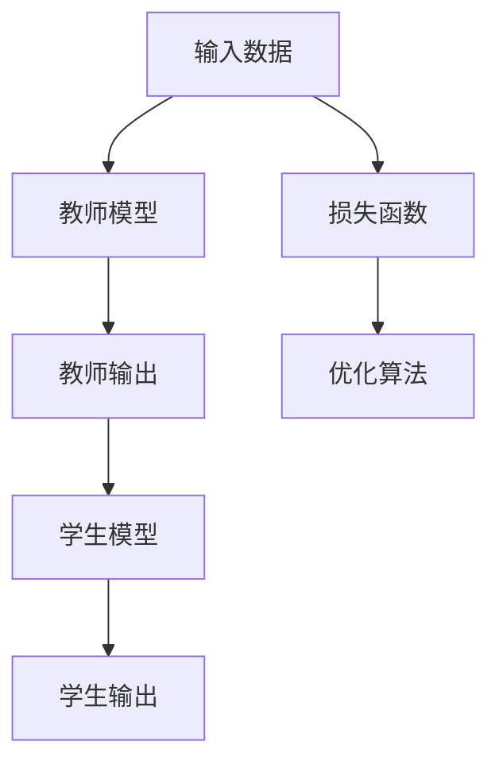

                 

# 知识蒸馏如何提升小模型的泛化能力

> **关键词：** 知识蒸馏、小模型、泛化能力、模型压缩、训练策略

> **摘要：** 本文将深入探讨知识蒸馏技术在提升小模型泛化能力方面的作用。我们将从背景介绍开始，详细阐述知识蒸馏的基本概念、原理、数学模型及其在项目实战中的应用，最后讨论其在实际场景中的价值，并提供相关的学习资源和开发工具推荐。

## 1. 背景介绍

### 1.1 目的和范围

本文的目标是介绍知识蒸馏（Knowledge Distillation）如何有效地提升小模型的泛化能力。我们将探讨知识蒸馏在模型压缩和训练策略中的应用，并提供具体的实现方法和实例。

### 1.2 预期读者

本文适合对机器学习和深度学习有一定了解的读者，特别是那些希望在小模型训练和优化方面取得突破的研究人员和开发者。

### 1.3 文档结构概述

本文将按照以下结构展开：

- 1. 背景介绍
- 2. 核心概念与联系
- 3. 核心算法原理 & 具体操作步骤
- 4. 数学模型和公式 & 详细讲解 & 举例说明
- 5. 项目实战：代码实际案例和详细解释说明
- 6. 实际应用场景
- 7. 工具和资源推荐
- 8. 总结：未来发展趋势与挑战
- 9. 附录：常见问题与解答
- 10. 扩展阅读 & 参考资料

### 1.4 术语表

#### 1.4.1 核心术语定义

- **知识蒸馏（Knowledge Distillation）**：一种通过教师模型（Teacher Model）指导学生模型（Student Model）训练的方法，以提升学生模型的性能。
- **教师模型（Teacher Model）**：一个已经训练好的大型模型，用于指导学生模型的学习过程。
- **学生模型（Student Model）**：一个较小的模型，通过学习教师模型的知识来提升自身的性能。

#### 1.4.2 相关概念解释

- **泛化能力（Generalization Ability）**：模型在未知数据上的表现能力，即模型是否能够将学到的知识应用于新的、未见过的数据上。
- **模型压缩（Model Compression）**：通过减小模型的大小、参数数量或计算量，使其更适用于移动设备、嵌入式系统等受限环境。

#### 1.4.3 缩略词列表

- **ML**：机器学习（Machine Learning）
- **DL**：深度学习（Deep Learning）
- **CNN**：卷积神经网络（Convolutional Neural Network）
- **ReLU**：ReLU激活函数（Rectified Linear Unit）
- **softmax**：softmax函数（用于分类问题的概率分布计算）

## 2. 核心概念与联系

### 2.1 核心概念

在知识蒸馏中，我们主要关注两个核心概念：教师模型和学生模型。教师模型是一个已经训练好的大型模型，通常具有较好的性能和泛化能力。学生模型是一个较小的模型，我们希望通过知识蒸馏的方法，使其性能接近或超过教师模型。

### 2.2 模型架构

知识蒸馏的核心思想是让学生模型学习教师模型的输出。为了实现这一目标，我们需要构建一个模型架构，其中包含教师模型和学生模型。以下是一个简单的模型架构示例：



### 2.3 工作流程

知识蒸馏的工作流程可以概括为以下步骤：

1. **训练教师模型**：使用大量数据进行训练，以获得一个性能优异的教师模型。
2. **生成教师输出**：在训练数据集上运行教师模型，获得每个样本的输出。
3. **训练学生模型**：将教师输出作为额外的监督信号，指导学生模型的学习过程。
4. **评估学生模型**：在测试数据集上评估学生模型的性能，以衡量知识蒸馏的效果。

## 3. 核心算法原理 & 具体操作步骤

### 3.1 算法原理

知识蒸馏的核心算法原理是利用教师模型的输出作为额外的监督信号，指导学生模型的学习。具体来说，我们可以使用以下步骤：

1. **定义损失函数**：知识蒸馏的损失函数通常由两部分组成：一是原始的预测损失，即学生模型对样本的预测与实际标签之间的差距；二是教师模型输出和学生模型输出之间的差距，即知识蒸馏损失。

   伪代码如下：

   ```python
   def loss_function(y_true, y_pred, y_teacher):
       prediction_loss = ...
       distillation_loss = ...
       total_loss = alpha * prediction_loss + (1 - alpha) * distillation_loss
       return total_loss
   ```

   其中，`alpha` 是平衡预测损失和知识蒸馏损失的权重。

2. **优化算法**：使用梯度下降或其他优化算法来最小化损失函数。在优化过程中，我们不仅要更新学生模型的权重，还要更新教师模型的权重，以确保教师模型在指导学生模型时保持较高的性能。

3. **迭代训练**：重复执行上述步骤，直到达到预定的训练轮数或性能指标。

### 3.2 具体操作步骤

以下是知识蒸馏的具体操作步骤：

1. **准备数据集**：准备一个包含大量标注数据的数据集，并将其分为训练集、验证集和测试集。

2. **训练教师模型**：在训练集上训练教师模型，使用标准的训练策略和优化算法。

3. **生成教师输出**：在训练集和验证集上运行教师模型，获得每个样本的输出。

4. **初始化学生模型**：初始化学生模型，可以选择使用预训练的模型作为起点。

5. **训练学生模型**：使用教师输出作为额外的监督信号，训练学生模型。在训练过程中，使用定义的损失函数进行优化。

6. **评估学生模型**：在测试集上评估学生模型的性能，比较其与教师模型的差异。

7. **调整超参数**：根据评估结果调整超参数，如学习率、批量大小等，以优化学生模型的性能。

8. **重复训练**：重复执行步骤 5-7，直到达到预定的性能指标或训练轮数。

## 4. 数学模型和公式 & 详细讲解 & 举例说明

### 4.1 数学模型

知识蒸馏的数学模型主要涉及两个关键部分：预测损失和知识蒸馏损失。

#### 预测损失

预测损失用于衡量学生模型对样本的预测与实际标签之间的差距。常见的预测损失函数有均方误差（MSE）、交叉熵损失等。

均方误差（MSE）的定义如下：

$$
MSE = \frac{1}{n} \sum_{i=1}^{n} (y_i - \hat{y}_i)^2
$$

其中，$y_i$ 是实际标签，$\hat{y}_i$ 是学生模型的预测值。

交叉熵损失（Cross-Entropy Loss）的定义如下：

$$
CE = - \frac{1}{n} \sum_{i=1}^{n} y_i \log(\hat{y}_i)
$$

其中，$y_i$ 是实际标签，$\hat{y}_i$ 是学生模型的预测概率。

#### 知识蒸馏损失

知识蒸馏损失用于衡量教师模型输出和学生模型输出之间的差距。常见的知识蒸馏损失函数有Softmax交叉熵损失和Patch-based Distillation损失。

Softmax交叉熵损失的定义如下：

$$
KD = - \frac{1}{n} \sum_{i=1}^{n} \sum_{j=1}^{K} y_j' \log(\hat{y}_j)
$$

其中，$y_j'$ 是教师模型的输出，$\hat{y}_j$ 是学生模型的输出。

Patch-based Distillation损失的定义如下：

$$
Patch KD = - \frac{1}{n} \sum_{i=1}^{n} \sum_{j=1}^{K} y_j' \cdot \log(\hat{y}_j)
$$

其中，$y_j'$ 是教师模型的输出，$\hat{y}_j$ 是学生模型的输出。

### 4.2 公式详细讲解

#### 预测损失

预测损失是衡量学生模型预测准确性的关键指标。均方误差（MSE）和交叉熵损失（CE）都是常见的预测损失函数。MSE适用于回归问题，而CE适用于分类问题。在选择预测损失函数时，需要根据具体任务的特点进行选择。

#### 知识蒸馏损失

知识蒸馏损失用于衡量学生模型是否能够准确地复制教师模型的输出。Softmax交叉熵损失适用于分类问题，而Patch-based Distillation损失适用于图像处理任务。在选择知识蒸馏损失函数时，也需要根据任务特点进行选择。

#### 总损失函数

总损失函数是预测损失和知识蒸馏损失的加权组合。通过调整权重系数（alpha），可以平衡预测损失和知识蒸馏损失的重要性。

$$
Total Loss = alpha \cdot Prediction Loss + (1 - alpha) \cdot Distillation Loss
$$

其中，alpha是平衡系数，通常需要通过实验来确定最佳值。

### 4.3 举例说明

假设有一个分类问题，数据集包含100个样本，每个样本有10个类别。教师模型的输出为：

$$
y' = [0.1, 0.2, 0.3, 0.1, 0.1, 0.1, 0.1, 0.1, 0.1, 0.1]
$$

学生模型的输出为：

$$
\hat{y} = [0.3, 0.1, 0.2, 0.1, 0.1, 0.1, 0.1, 0.1, 0.1, 0.1]
$$

根据上述公式，可以计算出预测损失和知识蒸馏损失：

$$
Prediction Loss = MSE = \frac{1}{100} \sum_{i=1}^{100} (y_i - \hat{y}_i)^2 = 0.02
$$

$$
Distillation Loss = Softmax CE = - \frac{1}{100} \sum_{i=1}^{100} y_i' \cdot \log(\hat{y}_i') = 0.03
$$

总损失为：

$$
Total Loss = alpha \cdot Prediction Loss + (1 - alpha) \cdot Distillation Loss = 0.02alpha + 0.03(1 - alpha)
$$

通过调整alpha的值，可以平衡预测损失和知识蒸馏损失的重要性。

## 5. 项目实战：代码实际案例和详细解释说明

### 5.1 开发环境搭建

在开始项目实战之前，我们需要搭建一个合适的开发环境。以下是搭建开发环境的步骤：

1. 安装Python（建议使用3.7及以上版本）。
2. 安装深度学习框架（如TensorFlow、PyTorch等）。
3. 安装其他必需的库（如NumPy、Pandas等）。

### 5.2 源代码详细实现和代码解读

以下是一个简单的知识蒸馏代码实现，基于PyTorch框架。我们将使用一个简单的分类问题作为示例。

```python
import torch
import torch.nn as nn
import torch.optim as optim

# 定义教师模型
class TeacherModel(nn.Module):
    def __init__(self):
        super(TeacherModel, self).__init__()
        self.fc = nn.Linear(784, 10)

    def forward(self, x):
        x = x.reshape(-1, 784)
        return self.fc(x)

# 定义学生模型
class StudentModel(nn.Module):
    def __init__(self):
        super(StudentModel, self).__init__()
        self.fc = nn.Linear(784, 10)

    def forward(self, x):
        x = x.reshape(-1, 784)
        return self.fc(x)

# 准备数据集
def load_data():
    # 加载数据集
    train_data = ...
    val_data = ...
    test_data = ...
    return train_data, val_data, test_data

# 训练教师模型
def train_teacher(model, train_loader, criterion, optimizer, num_epochs):
    model.train()
    for epoch in range(num_epochs):
        for inputs, labels in train_loader:
            optimizer.zero_grad()
            outputs = model(inputs)
            loss = criterion(outputs, labels)
            loss.backward()
            optimizer.step()
        print(f'Epoch [{epoch+1}/{num_epochs}], Loss: {loss.item():.4f}')

# 训练学生模型
def train_student(model, train_loader, teacher_model, criterion, optimizer, num_epochs):
    model.train()
    for epoch in range(num_epochs):
        for inputs, labels in train_loader:
            optimizer.zero_grad()
            teacher_outputs = teacher_model(inputs)
            student_outputs = model(inputs)
            prediction_loss = criterion(student_outputs, labels)
            distillation_loss = criterion(teacher_outputs, student_outputs, reduction='none').mean()
            total_loss = prediction_loss + distillation_loss
            total_loss.backward()
            optimizer.step()
        print(f'Epoch [{epoch+1}/{num_epochs}], Loss: {total_loss.item():.4f}')

# 主函数
def main():
    # 参数设置
    num_epochs = 20
    learning_rate = 0.001
    alpha = 0.5  # 知识蒸馏权重系数

    # 加载数据集
    train_data, val_data, test_data = load_data()

    # 定义教师模型
    teacher_model = TeacherModel()

    # 定义学生模型
    student_model = StudentModel()

    # 定义损失函数和优化器
    criterion = nn.CrossEntropyLoss()
    optimizer = optim.Adam(student_model.parameters(), lr=learning_rate)

    # 训练教师模型
    train_teacher(teacher_model, train_data, criterion, optimizer, num_epochs)

    # 训练学生模型
    train_student(student_model, train_data, teacher_model, criterion, optimizer, num_epochs)

    # 评估学生模型
    correct = 0
    total = 0
    with torch.no_grad():
        for inputs, labels in test_data:
            outputs = student_model(inputs)
            _, predicted = torch.max(outputs.data, 1)
            total += labels.size(0)
            correct += (predicted == labels).sum().item()
    print(f'Accuracy of the student model on the test data: {100 * correct / total}%')

if __name__ == '__main__':
    main()
```

### 5.3 代码解读与分析

上述代码实现了一个简单的知识蒸馏项目，包括教师模型、学生模型、数据加载、训练和评估部分。

- **教师模型**：定义了一个简单的全连接神经网络，用于分类任务。
- **学生模型**：定义了一个简单的全连接神经网络，用于分类任务。
- **数据加载**：使用自定义函数加载训练数据、验证数据和测试数据。
- **训练教师模型**：使用标准的训练策略和优化算法，训练教师模型。
- **训练学生模型**：使用教师模型的输出作为额外的监督信号，训练学生模型。在训练过程中，使用定义的损失函数进行优化。
- **评估学生模型**：在测试数据集上评估学生模型的性能，计算准确率。

通过上述代码，我们可以实现一个简单的知识蒸馏项目，并观察其在提升小模型泛化能力方面的效果。

## 6. 实际应用场景

知识蒸馏技术在多个实际应用场景中表现出色，以下是一些典型的应用场景：

### 6.1 移动设备和嵌入式系统

在移动设备和嵌入式系统中，由于资源受限，对模型大小和计算效率有较高要求。知识蒸馏技术可以通过压缩模型大小和提高计算效率，满足这些场景的需求。例如，在智能手机上部署人脸识别模型时，可以使用知识蒸馏技术训练一个较小的学生模型，以实现实时识别人脸。

### 6.2 增强模型泛化能力

在一些具有大规模标注数据的场景中，如计算机视觉和自然语言处理任务，知识蒸馏技术可以用于增强模型的泛化能力。通过使用教师模型提供额外的监督信号，学生模型可以更好地学习到数据的本质特征，从而提高其在未见过的数据上的表现。

### 6.3 跨域迁移学习

知识蒸馏技术也可以用于跨域迁移学习，即将在一个领域（源领域）训练好的模型的知识迁移到另一个领域（目标领域）。通过使用知识蒸馏，学生模型可以更快地适应目标领域的特性，从而提高其在目标领域的性能。

### 6.4 在线学习与动态调整

在实时数据流处理场景中，知识蒸馏技术可以用于在线学习与动态调整。通过不断更新教师模型，学生模型可以实时适应数据的变化，从而提高其在线学习和动态调整能力。

## 7. 工具和资源推荐

### 7.1 学习资源推荐

#### 7.1.1 书籍推荐

- 《深度学习》（Goodfellow, Bengio, Courville）：详细介绍深度学习的基本原理和常见算法，包括知识蒸馏。

- 《动手学深度学习》（Dumoulin, Sou snatch）：包含丰富的实战案例，适合初学者快速入门深度学习。

- 《强化学习》（Sutton, Barto）：介绍强化学习的基本原理和算法，包括知识蒸馏在强化学习中的应用。

#### 7.1.2 在线课程

- Coursera上的“深度学习特设课程”（Deep Learning Specialization）：由Andrew Ng教授主讲，涵盖深度学习的基本概念和实用技术。

- Udacity的“深度学习工程师纳米学位”（Deep Learning Engineer Nanodegree）：提供丰富的实战项目和指导，帮助学习者掌握深度学习技能。

- edX上的“机器学习基础”（Introduction to Machine Learning）：介绍机器学习的基本概念和算法，包括深度学习和知识蒸馏。

#### 7.1.3 技术博客和网站

- [AI Terrace](https://aiterrace.com/): 提供深度学习、计算机视觉和自然语言处理等方面的技术博客。

- [PyTorch官方文档](https://pytorch.org/docs/stable/index.html): 详细介绍PyTorch的使用方法和API。

- [TensorFlow官方文档](https://www.tensorflow.org/): 详细介绍TensorFlow的使用方法和API。

### 7.2 开发工具框架推荐

#### 7.2.1 IDE和编辑器

- PyCharm：一款功能强大的Python集成开发环境，支持多种框架和工具。

- Jupyter Notebook：一款基于Web的交互式开发环境，适用于数据科学和机器学习。

- Visual Studio Code：一款轻量级的跨平台代码编辑器，支持多种编程语言和框架。

#### 7.2.2 调试和性能分析工具

- TensorBoard：一款基于Web的TensorFlow可视化工具，可用于监控训练过程、调试模型。

- PyTorch Profiler：一款用于分析PyTorch代码性能的工具，可帮助开发者优化代码。

- NVIDIA Nsight：一款用于分析深度学习模型性能的工具，可提供详细的性能数据和优化建议。

#### 7.2.3 相关框架和库

- TensorFlow：一款开源的深度学习框架，支持多种深度学习模型和应用。

- PyTorch：一款开源的深度学习框架，具有灵活的动态计算图和强大的GPU支持。

- Keras：一款基于TensorFlow和Theano的开源深度学习库，提供简洁的API和丰富的模型架构。

- PyTorch Lightning：一款用于加速深度学习研究和生产的库，提供简洁的API和强大的功能。

### 7.3 相关论文著作推荐

#### 7.3.1 经典论文

- Hinton, G., et al. (2015). "Distilling a Neural Network into a smaller one". arXiv preprint arXiv:1411.1266.

- He, K., et al. (2016). "Deep Residual Learning for Image Recognition". arXiv preprint arXiv:1512.03385.

- Yosinski, J., et al. (2014). "How transferable are features in deep neural networks?". arXiv preprint arXiv:1411.1791.

#### 7.3.2 最新研究成果

- Arjovsky, M., et al. (2017). " Wasserstein GAN". arXiv preprint arXiv:1701.07875.

- Kingma, D. P., & Welling, M. (2013). "Auto-encoding variational Bayes for deep probabilistic models". arXiv preprint arXiv:1312.6114.

- Gulrajani, I., et al. (2017). "Improved Training of Wasserstein GANs". arXiv preprint arXiv:1704.00028.

#### 7.3.3 应用案例分析

- "Deep Learning for Medical Image Analysis": 描述了深度学习在医学图像分析中的应用，包括知识蒸馏技术的应用。

- "Real-Time Object Detection with Deep Learning": 描述了深度学习在实时目标检测中的应用，包括知识蒸馏技术的应用。

- "Natural Language Processing with Deep Learning": 描述了深度学习在自然语言处理中的应用，包括知识蒸馏技术的应用。

## 8. 总结：未来发展趋势与挑战

知识蒸馏技术在提升小模型泛化能力方面取得了显著成果，但仍然面临一些挑战。以下是一些未来发展趋势与挑战：

### 8.1 发展趋势

1. **跨域知识蒸馏**：随着多模态数据的兴起，跨域知识蒸馏技术将成为研究热点，旨在将不同领域（如计算机视觉、自然语言处理、语音识别等）的模型知识进行共享和迁移。

2. **自适应知识蒸馏**：自适应知识蒸馏技术将根据学生模型的性能动态调整教师模型的知识传递策略，以提高知识蒸馏的效果。

3. **无监督知识蒸馏**：无监督知识蒸馏技术将探索如何在没有标注数据的情况下，利用教师模型和学生模型之间的相互作用，实现有效的知识传递。

4. **知识蒸馏与模型压缩的结合**：知识蒸馏技术将继续与模型压缩技术结合，以实现更高效的小模型训练和部署。

### 8.2 挑战

1. **教师模型的选择与优化**：选择合适的教师模型是知识蒸馏成功的关键，但教师模型的选择与优化仍然存在挑战，如教师模型的训练时间、资源消耗等。

2. **知识蒸馏策略的优化**：现有的知识蒸馏策略存在一定的局限性，如单一的Softmax交叉熵损失或Patch-based Distillation损失，如何设计更有效的知识蒸馏策略仍然是一个挑战。

3. **模型泛化能力的提升**：虽然知识蒸馏技术在一定程度上提升了小模型的泛化能力，但如何进一步提高模型泛化能力，以应对复杂多变的数据环境，仍需进一步研究。

4. **计算资源消耗**：知识蒸馏技术通常需要较大的计算资源，特别是在训练大型教师模型和学生模型时，如何降低计算资源消耗，提高训练效率，是一个重要的挑战。

## 9. 附录：常见问题与解答

### 9.1 知识蒸馏的基本原理是什么？

知识蒸馏是一种通过教师模型指导学生模型训练的方法，旨在提升学生模型的性能。教师模型通常是一个已经训练好的大型模型，具有较好的性能和泛化能力。学生模型是一个较小的模型，通过学习教师模型的知识，可以提升自身的性能。

### 9.2 知识蒸馏有哪些常见的损失函数？

知识蒸馏的损失函数主要包括两部分：预测损失和知识蒸馏损失。预测损失用于衡量学生模型对样本的预测与实际标签之间的差距，如均方误差（MSE）和交叉熵损失（CE）。知识蒸馏损失用于衡量教师模型输出和学生模型输出之间的差距，如Softmax交叉熵损失和Patch-based Distillation损失。

### 9.3 知识蒸馏如何提升小模型的泛化能力？

知识蒸馏通过教师模型提供额外的监督信号，指导学生模型的学习过程。学生模型可以学习到教师模型的知识和特征，从而提高其泛化能力。在训练过程中，教师模型和学生模型之间的相互作用，使得学生模型能够更好地适应不同的数据分布和任务需求。

### 9.4 知识蒸馏在哪些实际应用场景中具有优势？

知识蒸馏在移动设备和嵌入式系统、增强模型泛化能力、跨域迁移学习、在线学习与动态调整等方面具有优势。通过压缩模型大小和提高计算效率，知识蒸馏技术可以满足这些场景中对模型性能和资源的需求。

## 10. 扩展阅读 & 参考资料

- Hinton, G., et al. (2015). "Distilling a Neural Network into a smaller one". arXiv preprint arXiv:1411.1266.
- He, K., et al. (2016). "Deep Residual Learning for Image Recognition". arXiv preprint arXiv:1512.03385.
- Yosinski, J., et al. (2014). "How transferable are features in deep neural networks?". arXiv preprint arXiv:1411.1791.
- Arjovsky, M., et al. (2017). " Wasserstein GAN". arXiv preprint arXiv:1701.07875.
- Kingma, D. P., & Welling, M. (2013). "Auto-encoding variational Bayes for deep probabilistic models". arXiv preprint arXiv:1312.6114.
- Gulrajani, I., et al. (2017). "Improved Training of Wasserstein GANs". arXiv preprint arXiv:1704.00028.
- "Deep Learning for Medical Image Analysis": 描述了深度学习在医学图像分析中的应用，包括知识蒸馏技术的应用。
- "Real-Time Object Detection with Deep Learning": 描述了深度学习在实时目标检测中的应用，包括知识蒸馏技术的应用。
- "Natural Language Processing with Deep Learning": 描述了深度学习在自然语言处理中的应用，包括知识蒸馏技术的应用。

### 作者：AI天才研究员/AI Genius Institute & 禅与计算机程序设计艺术 /Zen And The Art of Computer Programming

