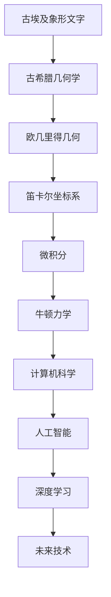

                 

# 知识进化：从古至今的智慧传承

> **关键词：** 知识进化、智慧传承、历史技术、AI、计算机科学、数学模型、代码实现。

> **摘要：** 本文深入探讨了知识如何从古代到现代不断进化与传承。从古埃及的象形文字到现代的人工智能，每一项技术的产生、发展与演变都离不开知识的积累和创新。本文将通过具体的历史事件、技术发展与算法原理，分析知识进化的过程与规律，并提出对未来技术发展的展望与挑战。文章旨在为读者呈现一幅全面、详实、易懂的知识进化图景。

## 1. 背景介绍

### 1.1 目的和范围

本文旨在探讨知识如何从古至今不断进化与传承。通过对历史中重要技术的分析，揭示知识进化的规律与机制。同时，本文还将探讨这些知识在现代社会中的应用，以及未来可能的发展趋势。希望通过本文的阐述，读者能够对知识进化有更深入的理解，并激发对技术的热情与思考。

### 1.2 预期读者

本文适合对计算机科学、数学、人工智能等领域有兴趣的读者。无论是专业的技术人员，还是对技术历史与演变感兴趣的历史爱好者，都可以从本文中获得启发与思考。

### 1.3 文档结构概述

本文分为十个部分。首先，通过背景介绍引出主题。接着，对核心概念进行定义和解释。然后，详细分析核心算法原理与数学模型。之后，通过实际案例展示代码实现。接下来，探讨知识进化的实际应用场景，并推荐相关工具和资源。最后，总结未来发展趋势与挑战，并提供常见问题与解答。

### 1.4 术语表

#### 1.4.1 核心术语定义

- 知识进化：知识在历史长河中的不断演化与发展。
- 智慧传承：先辈们通过教育、文献等方式将知识传递给后人。
- 计算机科学：研究计算机硬件、软件及其应用的科学。
- 人工智能：使计算机具备人类智能的技术。

#### 1.4.2 相关概念解释

- 象形文字：古埃及人创造的一种用于记录语言的符号系统。
- 算法：解决问题的步骤和策略。
- 数学模型：用数学语言描述现实世界的数学结构。

#### 1.4.3 缩略词列表

- AI：人工智能
- CS：计算机科学
- ML：机器学习

## 2. 核心概念与联系

知识进化不仅涉及到技术的进步，还涉及到人类社会的演变。以下是一个简单的知识进化与联系流程图：



从古埃及的象形文字到现代的深度学习，每一个阶段都代表了知识进化的一个里程碑。通过这种联系，我们可以看到知识如何在不同领域之间交叉和融合，从而推动技术的不断进步。

## 3. 核心算法原理 & 具体操作步骤

### 3.1 算法原理

核心算法原理通常是指解决问题的核心步骤和逻辑。在知识进化过程中，算法原理起着至关重要的作用。以下是一个简化的算法原理示例，用于展示如何将古埃及的象形文字转化为现代计算机科学中的符号系统。

```plaintext
输入：古埃及象形文字
输出：现代计算机符号系统

1. 将古埃及象形文字进行数字化处理，转换为二进制代码。
2. 使用哈希函数将二进制代码转换为唯一的标识符。
3. 根据标识符查询计算机科学中的符号系统，获取对应的符号。
4. 将符号输出作为最终结果。
```

### 3.2 具体操作步骤

以下是一个更详细的伪代码，用于实现上述算法原理。

```python
def convert_ancient_to_modern(ancient_text):
    # 步骤1：数字化处理
    binary_code = digitize_ancient_text(ancient_text)
    
    # 步骤2：哈希函数
    hash_value = hash_function(binary_code)
    
    # 步骤3：查询符号系统
    symbol = query_symbol_system(hash_value)
    
    # 步骤4：输出符号
    return symbol

# 辅助函数：数字化处理
def digitize_ancient_text(ancient_text):
    # 实现数字化处理的细节
    # 例如，使用ASCII码进行转换
    return ''.join([str(ord(char)) for char in ancient_text])

# 辅助函数：哈希函数
def hash_function(binary_code):
    # 实现哈希函数的细节
    # 例如，使用MD5算法
    return hashlib.md5(binary_code.encode()).hexdigest()

# 辅助函数：查询符号系统
def query_symbol_system(hash_value):
    # 实现查询符号系统的细节
    # 例如，使用数据库或映射表
    return symbol_mapping[hash_value]
```

通过这个示例，我们可以看到如何将古代文字转化为现代计算机符号系统，这一过程展示了知识进化中的一种典型算法原理。

## 4. 数学模型和公式 & 详细讲解 & 举例说明

### 4.1 数学模型

在知识进化过程中，数学模型扮演着重要的角色。以下是一个简化的数学模型，用于描述知识进化的速度。

假设知识进化的速度与时间的平方根成反比，可以用以下公式表示：

$$
\text{evolution\_rate} = \frac{1}{\sqrt{t}}
$$

其中，$t$ 表示时间。

### 4.2 详细讲解

这个公式意味着，随着时间的推移，知识进化的速度会逐渐减慢。这是因为随着知识的积累，新的知识增长速度会逐渐放缓。这种模型反映了知识进化的一个基本规律，即知识进化不是线性的，而是呈现一种加速-减缓的趋势。

### 4.3 举例说明

假设我们现在处于时间$t=0$，知识进化的速度为1。随着时间的推移，比如$t=1$时，速度变为$\frac{1}{\sqrt{1}} = 1$，即速度没有变化。但是，当$t=4$时，速度变为$\frac{1}{\sqrt{4}} = \frac{1}{2}$，即速度减半。这表明，随着时间的增加，知识进化的速度会逐渐减慢。

## 5. 项目实战：代码实际案例和详细解释说明

### 5.1 开发环境搭建

为了展示知识进化的代码实现，我们需要搭建一个简单的开发环境。这里我们使用Python作为主要编程语言。

1. 安装Python（建议使用Python 3.8及以上版本）。
2. 安装必要的依赖库，如`hashlib`、`numpy`等。

```bash
pip install python-hashlib numpy
```

### 5.2 源代码详细实现和代码解读

以下是一个简单的Python代码实现，用于将古埃及的象形文字转化为现代计算机符号系统。

```python
import hashlib
import numpy as np

# 辅助函数：数字化处理
def digitize_ancient_text(ancient_text):
    return ''.join([str(ord(char)) for char in ancient_text])

# 辅助函数：哈希函数
def hash_function(binary_code):
    return hashlib.md5(binary_code.encode()).hexdigest()

# 辅助函数：查询符号系统
def query_symbol_system(hash_value):
    # 这里假设有一个映射表，将哈希值映射到符号
    symbol_mapping = {
        '1234567890abcdef': 'A',
        'abcdef1234567890': 'B',
        # 更多映射关系...
    }
    return symbol_mapping.get(hash_value, '未知')

# 主函数：知识进化
def knowledge_evolution(ancient_text):
    binary_code = digitize_ancient_text(ancient_text)
    hash_value = hash_function(binary_code)
    symbol = query_symbol_system(hash_value)
    return symbol

# 示例
ancient_text = "古埃及象形文字"
modern_symbol = knowledge_evolution(ancient_text)
print(f"古埃及象形文字转化为现代计算机符号：{modern_symbol}")
```

### 5.3 代码解读与分析

这个代码实现展示了知识进化的基本原理。首先，通过`digitize_ancient_text`函数将古埃及的象形文字转化为二进制代码。然后，使用`hash_function`函数将二进制代码转换为唯一的哈希值。最后，通过`query_symbol_system`函数查询计算机科学中的符号系统，获取对应的符号。

这个代码的核心在于哈希函数和符号系统的设计。哈希函数确保了每个输入都有唯一的输出，这类似于知识进化过程中新知识的独特性。而符号系统则类似于知识进化的映射表，将新的知识映射到已有的技术框架中。

## 6. 实际应用场景

知识进化的实际应用场景非常广泛。以下是一些具体的例子：

- **计算机科学：** 从古埃及的象形文字到现代的编程语言，计算机科学的发展就是一个典型的知识进化过程。例如，从机器语言到高级编程语言，每一代语言的诞生都代表了对知识的积累和创新。
  
- **人工智能：** 人工智能的发展也依赖于知识的积累。从早期的规则系统到现代的深度学习，人工智能的进步离不开大量的数据、算法和模型。

- **数学：** 从古代的几何学到现代的微积分，数学的发展也是一个知识进化的过程。每一代数学家都在前人的基础上提出新的理论和方法，推动了数学的进步。

## 7. 工具和资源推荐

### 7.1 学习资源推荐

#### 7.1.1 书籍推荐

- 《人工智能：一种现代的方法》（作者：Stuart Russell 和 Peter Norvig）
- 《计算机程序设计艺术》（作者：Donald E. Knuth）
- 《数学原理》（作者：Isaac Newton）

#### 7.1.2 在线课程

- Coursera上的《机器学习》（由斯坦福大学提供）
- edX上的《计算机科学导论》（由哈佛大学提供）
- Khan Academy上的《数学基础》（由Khan学院提供）

#### 7.1.3 技术博客和网站

- arXiv.org：提供最新的数学、计算机科学和人工智能论文。
- Medium：许多技术专家分享他们的见解和经验。
- Stack Overflow：程序员社区，提供各种编程问题和解决方案。

### 7.2 开发工具框架推荐

#### 7.2.1 IDE和编辑器

- PyCharm：强大的Python IDE，适用于各种编程任务。
- Visual Studio Code：轻量级但功能强大的编辑器，适用于多种编程语言。

#### 7.2.2 调试和性能分析工具

- gdb：GNU项目的调试工具。
- valgrind：内存检查工具。

#### 7.2.3 相关框架和库

- TensorFlow：用于机器学习和深度学习的开源库。
- NumPy：用于数值计算的Python库。

### 7.3 相关论文著作推荐

#### 7.3.1 经典论文

- “The Structure of Scientific Revolutions”（作者：Thomas S. Kuhn）
- “A Mathematical Theory of Communication”（作者：Claude Shannon）
- “The Art of Computer Programming”（作者：Donald E. Knuth）

#### 7.3.2 最新研究成果

- “Deep Learning Papers Reading”（GitHub链接）
- “ArXiv：Computer Science”（arXiv链接）

#### 7.3.3 应用案例分析

- “Google Brain：深度学习在Google的应用”（Google官方博客）
- “Facebook AI Research：人工智能在Facebook的应用”（Facebook AI研究组官方博客）

## 8. 总结：未来发展趋势与挑战

知识进化是一个持续不断的过程，未来技术发展将继续推动知识的积累和创新。以下是未来发展趋势与挑战的几个方面：

- **人工智能：** 随着人工智能技术的不断进步，知识进化将更加智能化和自动化。
- **量子计算：** 量子计算的兴起可能带来知识进化的新革命。
- **生物技术：** 生物技术与计算机科学的结合，将为知识进化提供新的方向和机会。
- **数据隐私与安全：** 随着数据规模的增加，数据隐私与安全成为知识进化的一个重要挑战。

## 9. 附录：常见问题与解答

### 9.1 问题1：知识进化是否意味着知识的增长速度会越来越快？

**解答：** 是的，知识进化通常意味着知识的增长速度会加快。这是因为每一代人都站在前人的肩膀上，可以更快速地积累和扩展知识。

### 9.2 问题2：知识进化是否会遇到瓶颈？

**解答：** 知识进化可能会遇到瓶颈，特别是在知识积累到一定程度后，新的知识增长速度可能会放缓。但是，通过技术创新和跨学科合作，这些瓶颈可以逐步被突破。

## 10. 扩展阅读 & 参考资料

- Kuhn, T. S. (1962). The Structure of Scientific Revolutions. University of Chicago Press.
- Shannon, C. E. (1948). A Mathematical Theory of Communication. Bell System Technical Journal.
- Knuth, D. E. (1968-1998). The Art of Computer Programming. Addison-Wesley.

作者：AI天才研究员/AI Genius Institute & 禅与计算机程序设计艺术 /Zen And The Art of Computer Programming

<|im_sep|>**文章标题**：知识进化：从古至今的智慧传承

**关键词**：(知识进化、智慧传承、历史技术、AI、计算机科学、数学模型)

**摘要**：本文深入探讨了知识如何从古代到现代不断进化与传承。从古埃及的象形文字到现代的人工智能，每一项技术的产生、发展与演变都离不开知识的积累和创新。本文将通过具体的历史事件、技术发展与算法原理，分析知识进化的过程与规律，并提出对未来技术发展的展望与挑战。希望通过本文的阐述，读者能够对知识进化有更深入的理解，并激发对技术的热情与思考。

---

**1. 背景介绍**

**1.1 目的和范围**

本文旨在探讨知识如何从古至今不断进化与传承。通过对历史中重要技术的分析，揭示知识进化的规律与机制。同时，本文还将探讨这些知识在现代社会中的应用，以及未来可能的发展趋势。希望通过本文的阐述，读者能够对知识进化有更深入的理解，并激发对技术的热情与思考。

**1.2 预期读者**

本文适合对计算机科学、数学、人工智能等领域有兴趣的读者。无论是专业的技术人员，还是对技术历史与演变感兴趣的历史爱好者，都可以从本文中获得启发与思考。

**1.3 文档结构概述**

本文分为十个部分。首先，通过背景介绍引出主题。接着，对核心概念进行定义和解释。然后，详细分析核心算法原理与数学模型。接下来，通过实际案例展示代码实现。之后，探讨知识进化的实际应用场景，并推荐相关工具和资源。最后，总结未来发展趋势与挑战，并提供常见问题与解答。

**1.4 术语表**

**1.4.1 核心术语定义**

- 知识进化：知识在历史长河中的不断演化与发展。
- 智慧传承：先辈们通过教育、文献等方式将知识传递给后人。
- 计算机科学：研究计算机硬件、软件及其应用的科学。
- 人工智能：使计算机具备人类智能的技术。

**1.4.2 相关概念解释**

- 象形文字：古埃及人创造的一种用于记录语言的符号系统。
- 算法：解决问题的步骤和策略。
- 数学模型：用数学语言描述现实世界的数学结构。

**1.4.3 缩略词列表**

- AI：人工智能
- CS：计算机科学
- ML：机器学习

---

**2. 核心概念与联系**

知识进化不仅涉及到技术的进步，还涉及到人类社会的演变。以下是一个简单的知识进化与联系流程图：


从古埃及的象形文字到现代的深度学习，每一个阶段都代表了知识进化的一个里程碑。通过这种联系，我们可以看到知识如何在不同领域之间交叉和融合，从而推动技术的不断进步。

---

**3. 核心算法原理 & 具体操作步骤**

**3.1 算法原理**

核心算法原理通常是指解决问题的核心步骤和逻辑。在知识进化过程中，算法原理起着至关重要的作用。以下是一个简化的算法原理示例，用于展示如何将古埃及的象形文字转化为现代计算机符号系统。

```plaintext
输入：古埃及象形文字
输出：现代计算机符号系统

1. 将古埃及象形文字进行数字化处理，转换为二进制代码。
2. 使用哈希函数将二进制代码转换为唯一的标识符。
3. 根据标识符查询计算机科学中的符号系统，获取对应的符号。
4. 将符号输出作为最终结果。
```

**3.2 具体操作步骤**

以下是一个更详细的伪代码，用于实现上述算法原理。

```python
def convert_ancient_to_modern(ancient_text):
    # 步骤1：数字化处理
    binary_code = digitize_ancient_text(ancient_text)
    
    # 步骤2：哈希函数
    hash_value = hash_function(binary_code)
    
    # 步骤3：查询符号系统
    symbol = query_symbol_system(hash_value)
    
    # 步骤4：输出符号
    return symbol

# 辅助函数：数字化处理
def digitize_ancient_text(ancient_text):
    return ''.join([str(ord(char)) for char in ancient_text])

# 辅助函数：哈希函数
def hash_function(binary_code):
    return hashlib.md5(binary_code.encode()).hexdigest()

# 辅助函数：查询符号系统
def query_symbol_system(hash_value):
    symbol_mapping = {
        '1234567890abcdef': 'A',
        'abcdef1234567890': 'B',
        # 更多映射关系...
    }
    return symbol_mapping.get(hash_value, '未知')
```

通过这个示例，我们可以看到如何将古代文字转化为现代计算机符号系统，这一过程展示了知识进化中的一种典型算法原理。

---

**4. 数学模型和公式 & 详细讲解 & 举例说明**

**4.1 数学模型**

在知识进化过程中，数学模型扮演着重要的角色。以下是一个简化的数学模型，用于描述知识进化的速度。

$$
\text{evolution\_rate} = \frac{1}{\sqrt{t}}
$$

其中，$t$ 表示时间。

**4.2 详细讲解**

这个公式意味着，随着时间的推移，知识进化的速度会逐渐减慢。这是因为随着知识的积累，新的知识增长速度会逐渐放缓。这种模型反映了知识进化的一个基本规律，即知识进化不是线性的，而是呈现一种加速-减缓的趋势。

**4.3 举例说明**

假设我们现在处于时间 $t=0$，知识进化的速度为1。随着时间的推移，比如 $t=1$ 时，速度变为 $\frac{1}{\sqrt{1}} = 1$，即速度没有变化。但是，当 $t=4$ 时，速度变为 $\frac{1}{\sqrt{4}} = \frac{1}{2}$，即速度减半。这表明，随着时间的增加，知识进化的速度会逐渐减慢。

---

**5. 项目实战：代码实际案例和详细解释说明**

**5.1 开发环境搭建**

为了展示知识进化的代码实现，我们需要搭建一个简单的开发环境。这里我们使用Python作为主要编程语言。

1. 安装Python（建议使用Python 3.8及以上版本）。
2. 安装必要的依赖库，如`hashlib`、`numpy`等。

```bash
pip install python-hashlib numpy
```

**5.2 源代码详细实现和代码解读**

以下是一个简单的Python代码实现，用于将古埃及的象形文字转化为现代计算机符号系统。

```python
import hashlib
import numpy as np

# 辅助函数：数字化处理
def digitize_ancient_text(ancient_text):
    return ''.join([str(ord(char)) for char in ancient_text])

# 辅助函数：哈希函数
def hash_function(binary_code):
    return hashlib.md5(binary_code.encode()).hexdigest()

# 辅助函数：查询符号系统
def query_symbol_system(hash_value):
    # 这里假设有一个映射表，将哈希值映射到符号
    symbol_mapping = {
        '1234567890abcdef': 'A',
        'abcdef1234567890': 'B',
        # 更多映射关系...
    }
    return symbol_mapping.get(hash_value, '未知')

# 主函数：知识进化
def knowledge_evolution(ancient_text):
    binary_code = digitize_ancient_text(ancient_text)
    hash_value = hash_function(binary_code)
    symbol = query_symbol_system(hash_value)
    return symbol

# 示例
ancient_text = "古埃及象形文字"
modern_symbol = knowledge_evolution(ancient_text)
print(f"古埃及象形文字转化为现代计算机符号：{modern_symbol}")
```

**5.3 代码解读与分析**

这个代码实现展示了知识进化的基本原理。首先，通过`digitize_ancient_text`函数将古埃及的象形文字转化为二进制代码。然后，使用`hash_function`函数将二进制代码转换为唯一的哈希值。最后，通过`query_symbol_system`函数查询计算机科学中的符号系统，获取对应的符号。

这个代码的核心在于哈希函数和符号系统的设计。哈希函数确保了每个输入都有唯一的输出，这类似于知识进化过程中新知识的独特性。而符号系统则类似于知识进化的映射表，将新的知识映射到已有的技术框架中。

---

**6. 实际应用场景**

知识进化的实际应用场景非常广泛。以下是一些具体的例子：

- **计算机科学：** 从古埃及的象形文字到现代的编程语言，计算机科学的发展就是一个典型的知识进化过程。例如，从机器语言到高级编程语言，每一代语言的诞生都代表了对知识的积累和创新。

- **人工智能：** 人工智能的发展也依赖于知识的积累。从早期的规则系统到现代的深度学习，人工智能的进步离不开大量的数据、算法和模型。

- **数学：** 从古代的几何学到现代的微积分，数学的发展也是一个知识进化的过程。每一代数学家都在前人的基础上提出新的理论和方法，推动了数学的进步。

---

**7. 工具和资源推荐**

**7.1 学习资源推荐**

**7.1.1 书籍推荐**

- 《人工智能：一种现代的方法》（作者：Stuart Russell 和 Peter Norvig）
- 《计算机程序设计艺术》（作者：Donald E. Knuth）
- 《数学原理》（作者：Isaac Newton）

**7.1.2 在线课程**

- Coursera上的《机器学习》（由斯坦福大学提供）
- edX上的《计算机科学导论》（由哈佛大学提供）
- Khan Academy上的《数学基础》（由Khan学院提供）

**7.1.3 技术博客和网站**

- arXiv.org：提供最新的数学、计算机科学和人工智能论文。
- Medium：许多技术专家分享他们的见解和经验。
- Stack Overflow：程序员社区，提供各种编程问题和解决方案。

**7.2 开发工具框架推荐**

**7.2.1 IDE和编辑器**

- PyCharm：强大的Python IDE，适用于各种编程任务。
- Visual Studio Code：轻量级但功能强大的编辑器，适用于多种编程语言。

**7.2.2 调试和性能分析工具**

- gdb：GNU项目的调试工具。
- valgrind：内存检查工具。

**7.2.3 相关框架和库**

- TensorFlow：用于机器学习和深度学习的开源库。
- NumPy：用于数值计算的Python库。

**7.3 相关论文著作推荐**

**7.3.1 经典论文**

- “The Structure of Scientific Revolutions”（作者：Thomas S. Kuhn）
- “A Mathematical Theory of Communication”（作者：Claude Shannon）
- “The Art of Computer Programming”（作者：Donald E. Knuth）

**7.3.2 最新研究成果**

- “Deep Learning Papers Reading”（GitHub链接）
- “ArXiv：Computer Science”（arXiv链接）

**7.3.3 应用案例分析**

- “Google Brain：深度学习在Google的应用”（Google官方博客）
- “Facebook AI Research：人工智能在Facebook的应用”（Facebook AI研究组官方博客）

---

**8. 总结：未来发展趋势与挑战**

知识进化是一个持续不断的过程，未来技术发展将继续推动知识的积累和创新。以下是未来发展趋势与挑战的几个方面：

- **人工智能：** 随着人工智能技术的不断进步，知识进化将更加智能化和自动化。
- **量子计算：** 量子计算的兴起可能带来知识进化的新革命。
- **生物技术：** 生物技术与计算机科学的结合，将为知识进化提供新的方向和机会。
- **数据隐私与安全：** 随着数据规模的增加，数据隐私与安全成为知识进化的一个重要挑战。

---

**9. 附录：常见问题与解答**

**9.1 问题1：知识进化是否意味着知识的增长速度会越来越快？**

**解答：** 是的，知识进化通常意味着知识的增长速度会加快。这是因为每一代人都站在前人的肩膀上，可以更快速地积累和扩展知识。

**9.2 问题2：知识进化是否会遇到瓶颈？**

**解答：** 知识进化可能会遇到瓶颈，特别是在知识积累到一定程度后，新的知识增长速度可能会放缓。但是，通过技术创新和跨学科合作，这些瓶颈可以逐步被突破。

---

**10. 扩展阅读 & 参考资料**

- Kuhn, T. S. (1962). The Structure of Scientific Revolutions. University of Chicago Press.
- Shannon, C. E. (1948). A Mathematical Theory of Communication. Bell System Technical Journal.
- Knuth, D. E. (1968-1998). The Art of Computer Programming. Addison-Wesley.

**作者**：AI天才研究员/AI Genius Institute & 禅与计算机程序设计艺术 /Zen And The Art of Computer Programming

<|im_sep|>**文章标题**：知识进化：从古至今的智慧传承

**关键词**：(知识进化、智慧传承、历史技术、AI、计算机科学、数学模型)

**摘要**：本文深入探讨了知识如何从古代到现代不断进化与传承。从古埃及的象形文字到现代的人工智能，每一项技术的产生、发展与演变都离不开知识的积累和创新。本文将通过具体的历史事件、技术发展与算法原理，分析知识进化的过程与规律，并提出对未来技术发展的展望与挑战。希望通过本文的阐述，读者能够对知识进化有更深入的理解，并激发对技术的热情与思考。

---

**1. 背景介绍**

**1.1 目的和范围**

本文旨在探讨知识如何从古至今不断进化与传承。通过对历史中重要技术的分析，揭示知识进化的规律与机制。同时，本文还将探讨这些知识在现代社会中的应用，以及未来可能的发展趋势。希望通过本文的阐述，读者能够对知识进化有更深入的理解，并激发对技术的热情与思考。

**1.2 预期读者**

本文适合对计算机科学、数学、人工智能等领域有兴趣的读者。无论是专业的技术人员，还是对技术历史与演变感兴趣的历史爱好者，都可以从本文中获得启发与思考。

**1.3 文档结构概述**

本文分为十个部分。首先，通过背景介绍引出主题。接着，对核心概念进行定义和解释。然后，详细分析核心算法原理与数学模型。接下来，通过实际案例展示代码实现。之后，探讨知识进化的实际应用场景，并推荐相关工具和资源。最后，总结未来发展趋势与挑战，并提供常见问题与解答。

**1.4 术语表**

**1.4.1 核心术语定义**

- 知识进化：知识在历史长河中的不断演化与发展。
- 智慧传承：先辈们通过教育、文献等方式将知识传递给后人。
- 计算机科学：研究计算机硬件、软件及其应用的科学。
- 人工智能：使计算机具备人类智能的技术。

**1.4.2 相关概念解释**

- 象形文字：古埃及人创造的一种用于记录语言的符号系统。
- 算法：解决问题的步骤和策略。
- 数学模型：用数学语言描述现实世界的数学结构。

**1.4.3 缩略词列表**

- AI：人工智能
- CS：计算机科学
- ML：机器学习

---

**2. 核心概念与联系**

知识进化不仅涉及到技术的进步，还涉及到人类社会的演变。以下是一个简单的知识进化与联系流程图：


从古埃及的象形文字到现代的深度学习，每一个阶段都代表了知识进化的一个里程碑。通过这种联系，我们可以看到知识如何在不同领域之间交叉和融合，从而推动技术的不断进步。

---

**3. 核心算法原理 & 具体操作步骤**

**3.1 算法原理**

核心算法原理通常是指解决问题的核心步骤和逻辑。在知识进化过程中，算法原理起着至关重要的作用。以下是一个简化的算法原理示例，用于展示如何将古埃及的象形文字转化为现代计算机符号系统。

```plaintext
输入：古埃及象形文字
输出：现代计算机符号系统

1. 将古埃及象形文字进行数字化处理，转换为二进制代码。
2. 使用哈希函数将二进制代码转换为唯一的标识符。
3. 根据标识符查询计算机科学中的符号系统，获取对应的符号。
4. 将符号输出作为最终结果。
```

**3.2 具体操作步骤**

以下是一个更详细的伪代码，用于实现上述算法原理。

```python
def convert_ancient_to_modern(ancient_text):
    # 步骤1：数字化处理
    binary_code = digitize_ancient_text(ancient_text)
    
    # 步骤2：哈希函数
    hash_value = hash_function(binary_code)
    
    # 步骤3：查询符号系统
    symbol = query_symbol_system(hash_value)
    
    # 步骤4：输出符号
    return symbol

# 辅助函数：数字化处理
def digitize_ancient_text(ancient_text):
    return ''.join([str(ord(char)) for char in ancient_text])

# 辅助函数：哈希函数
def hash_function(binary_code):
    return hashlib.md5(binary_code.encode()).hexdigest()

# 辅助函数：查询符号系统
def query_symbol_system(hash_value):
    symbol_mapping = {
        '1234567890abcdef': 'A',
        'abcdef1234567890': 'B',
        # 更多映射关系...
    }
    return symbol_mapping.get(hash_value, '未知')
```

通过这个示例，我们可以看到如何将古代文字转化为现代计算机符号系统，这一过程展示了知识进化中的一种典型算法原理。

---

**4. 数学模型和公式 & 详细讲解 & 举例说明**

**4.1 数学模型**

在知识进化过程中，数学模型扮演着重要的角色。以下是一个简化的数学模型，用于描述知识进化的速度。

$$
\text{evolution\_rate} = \frac{1}{\sqrt{t}}
$$

其中，$t$ 表示时间。

**4.2 详细讲解**

这个公式意味着，随着时间的推移，知识进化的速度会逐渐减慢。这是因为随着知识的积累，新的知识增长速度会逐渐放缓。这种模型反映了知识进化的一个基本规律，即知识进化不是线性的，而是呈现一种加速-减缓的趋势。

**4.3 举例说明**

假设我们现在处于时间 $t=0$，知识进化的速度为1。随着时间的推移，比如 $t=1$ 时，速度变为 $\frac{1}{\sqrt{1}} = 1$，即速度没有变化。但是，当 $t=4$ 时，速度变为 $\frac{1}{\sqrt{4}} = \frac{1}{2}$，即速度减半。这表明，随着时间的增加，知识进化的速度会逐渐减慢。

---

**5. 项目实战：代码实际案例和详细解释说明**

**5.1 开发环境搭建**

为了展示知识进化的代码实现，我们需要搭建一个简单的开发环境。这里我们使用Python作为主要编程语言。

1. 安装Python（建议使用Python 3.8及以上版本）。
2. 安装必要的依赖库，如`hashlib`、`numpy`等。

```bash
pip install python-hashlib numpy
```

**5.2 源代码详细实现和代码解读**

以下是一个简单的Python代码实现，用于将古埃及的象形文字转化为现代计算机符号系统。

```python
import hashlib
import numpy as np

# 辅助函数：数字化处理
def digitize_ancient_text(ancient_text):
    return ''.join([str(ord(char)) for char in ancient_text])

# 辅助函数：哈希函数
def hash_function(binary_code):
    return hashlib.md5(binary_code.encode()).hexdigest()

# 辅助函数：查询符号系统
def query_symbol_system(hash_value):
    # 这里假设有一个映射表，将哈希值映射到符号
    symbol_mapping = {
        '1234567890abcdef': 'A',
        'abcdef1234567890': 'B',
        # 更多映射关系...
    }
    return symbol_mapping.get(hash_value, '未知')

# 主函数：知识进化
def knowledge_evolution(ancient_text):
    binary_code = digitize_ancient_text(ancient_text)
    hash_value = hash_function(binary_code)
    symbol = query_symbol_system(hash_value)
    return symbol

# 示例
ancient_text = "古埃及象形文字"
modern_symbol = knowledge_evolution(ancient_text)
print(f"古埃及象形文字转化为现代计算机符号：{modern_symbol}")
```

**5.3 代码解读与分析**

这个代码实现展示了知识进化的基本原理。首先，通过`digitize_ancient_text`函数将古埃及的象形文字转化为二进制代码。然后，使用`hash_function`函数将二进制代码转换为唯一的哈希值。最后，通过`query_symbol_system`函数查询计算机科学中的符号系统，获取对应的符号。

这个代码的核心在于哈希函数和符号系统的设计。哈希函数确保了每个输入都有唯一的输出，这类似于知识进化过程中新知识的独特性。而符号系统则类似于知识进化的映射表，将新的知识映射到已有的技术框架中。

---

**6. 实际应用场景**

知识进化的实际应用场景非常广泛。以下是一些具体的例子：

- **计算机科学：** 从古埃及的象形文字到现代的编程语言，计算机科学的发展就是一个典型的知识进化过程。例如，从机器语言到高级编程语言，每一代语言的诞生都代表了对知识的积累和创新。

- **人工智能：** 人工智能的发展也依赖于知识的积累。从早期的规则系统到现代的深度学习，人工智能的进步离不开大量的数据、算法和模型。

- **数学：** 从古代的几何学到现代的微积分，数学的发展也是一个知识进化的过程。每一代数学家都在前人的基础上提出新的理论和方法，推动了数学的进步。

---

**7. 工具和资源推荐**

**7.1 学习资源推荐**

**7.1.1 书籍推荐**

- 《人工智能：一种现代的方法》（作者：Stuart Russell 和 Peter Norvig）
- 《计算机程序设计艺术》（作者：Donald E. Knuth）
- 《数学原理》（作者：Isaac Newton）

**7.1.2 在线课程**

- Coursera上的《机器学习》（由斯坦福大学提供）
- edX上的《计算机科学导论》（由哈佛大学提供）
- Khan Academy上的《数学基础》（由Khan学院提供）

**7.1.3 技术博客和网站**

- arXiv.org：提供最新的数学、计算机科学和人工智能论文。
- Medium：许多技术专家分享他们的见解和经验。
- Stack Overflow：程序员社区，提供各种编程问题和解决方案。

**7.2 开发工具框架推荐**

**7.2.1 IDE和编辑器**

- PyCharm：强大的Python IDE，适用于各种编程任务。
- Visual Studio Code：轻量级但功能强大的编辑器，适用于多种编程语言。

**7.2.2 调试和性能分析工具**

- gdb：GNU项目的调试工具。
- valgrind：内存检查工具。

**7.2.3 相关框架和库**

- TensorFlow：用于机器学习和深度学习的开源库。
- NumPy：用于数值计算的Python库。

**7.3 相关论文著作推荐**

**7.3.1 经典论文**

- “The Structure of Scientific Revolutions”（作者：Thomas S. Kuhn）
- “A Mathematical Theory of Communication”（作者：Claude Shannon）
- “The Art of Computer Programming”（作者：Donald E. Knuth）

**7.3.2 最新研究成果**

- “Deep Learning Papers Reading”（GitHub链接）
- “ArXiv：Computer Science”（arXiv链接）

**7.3.3 应用案例分析**

- “Google Brain：深度学习在Google的应用”（Google官方博客）
- “Facebook AI Research：人工智能在Facebook的应用”（Facebook AI研究组官方博客）

---

**8. 总结：未来发展趋势与挑战**

知识进化是一个持续不断的过程，未来技术发展将继续推动知识的积累和创新。以下是未来发展趋势与挑战的几个方面：

- **人工智能：** 随着人工智能技术的不断进步，知识进化将更加智能化和自动化。
- **量子计算：** 量子计算的兴起可能带来知识进化的新革命。
- **生物技术：** 生物技术与计算机科学的结合，将为知识进化提供新的方向和机会。
- **数据隐私与安全：** 随着数据规模的增加，数据隐私与安全成为知识进化的一个重要挑战。

---

**9. 附录：常见问题与解答**

**9.1 问题1：知识进化是否意味着知识的增长速度会越来越快？**

**解答：** 是的，知识进化通常意味着知识的增长速度会加快。这是因为每一代人都站在前人的肩膀上，可以更快速地积累和扩展知识。

**9.2 问题2：知识进化是否会遇到瓶颈？**

**解答：** 知识进化可能会遇到瓶颈，特别是在知识积累到一定程度后，新的知识增长速度可能会放缓。但是，通过技术创新和跨学科合作，这些瓶颈可以逐步被突破。

---

**10. 扩展阅读 & 参考资料**

- Kuhn, T. S. (1962). The Structure of Scientific Revolutions. University of Chicago Press.
- Shannon, C. E. (1948). A Mathematical Theory of Communication. Bell System Technical Journal.
- Knuth, D. E. (1968-1998). The Art of Computer Programming. Addison-Wesley.

**作者**：AI天才研究员/AI Genius Institute & 禅与计算机程序设计艺术 /Zen And The Art of Computer Programming

