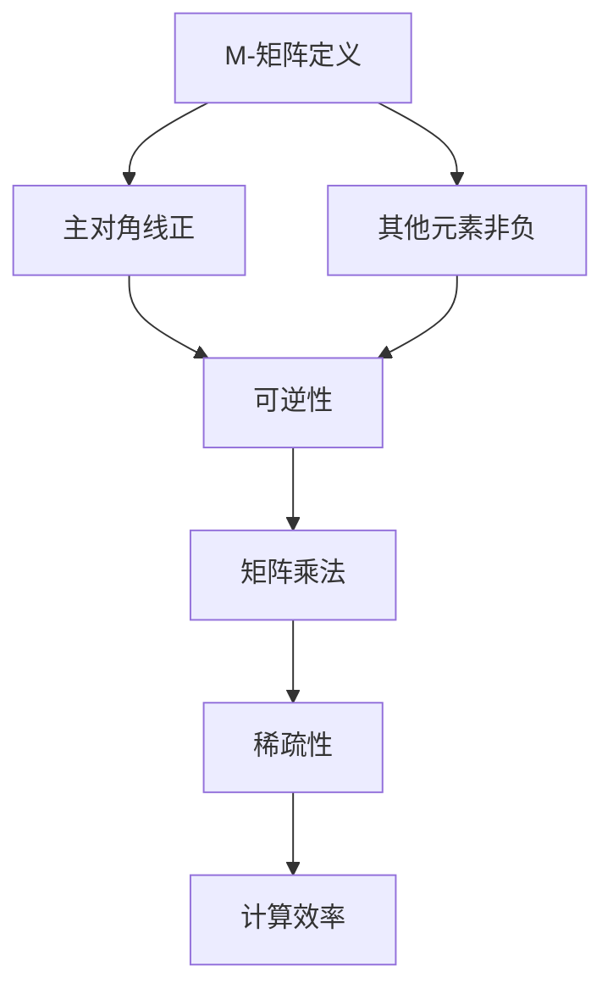
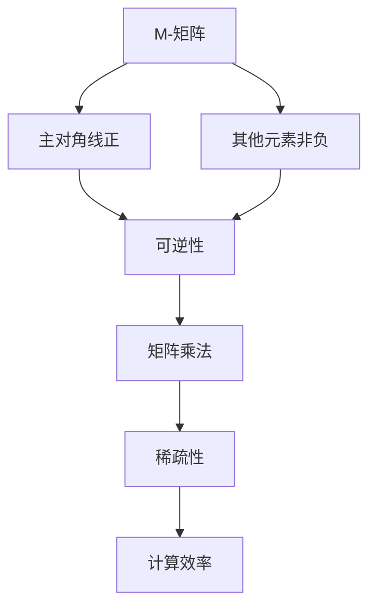

                 

# 矩阵理论与应用：M-矩阵

> 关键词：矩阵理论，M-矩阵，线性代数，算法，应用场景

> 摘要：本文深入探讨矩阵理论中的一种重要类型——M-矩阵，从其定义、性质、核心算法原理到具体的应用场景，逐一解析。通过详尽的伪代码展示和数学公式说明，帮助读者全面理解M-矩阵在计算机科学和工程领域的广泛运用。

## 1. 背景介绍

### 1.1 目的和范围

本文旨在介绍M-矩阵的基本概念、特性及其在实际应用中的重要性。我们将通过逐步分析推理，详细解释M-矩阵的理论基础和应用场景，帮助读者深入了解这一数学工具在计算机科学和工程中的价值。

### 1.2 预期读者

本文面向对线性代数和矩阵理论有一定了解的读者，包括计算机科学、数学、工程等领域的专业学生、研究人员和从业者。

### 1.3 文档结构概述

本文结构如下：

- **第1章**：背景介绍，阐述本文的目的、预期读者和文档结构。
- **第2章**：核心概念与联系，介绍M-矩阵的定义和性质，并通过Mermaid流程图展示其架构。
- **第3章**：核心算法原理 & 具体操作步骤，使用伪代码详细阐述M-矩阵相关算法。
- **第4章**：数学模型和公式 & 详细讲解 & 举例说明，解析M-矩阵的数学基础和实际应用。
- **第5章**：项目实战：代码实际案例和详细解释说明，通过实际案例展示M-矩阵的应用。
- **第6章**：实际应用场景，探讨M-矩阵在不同领域的应用。
- **第7章**：工具和资源推荐，推荐学习资源和开发工具。
- **第8章**：总结：未来发展趋势与挑战，展望M-矩阵的发展前景。
- **第9章**：附录：常见问题与解答，解答读者可能遇到的问题。
- **第10章**：扩展阅读 & 参考资料，提供进一步阅读的资料。

### 1.4 术语表

#### 1.4.1 核心术语定义

- **M-矩阵**：指主对角线上的元素为正，其余元素非负的矩阵。
- **线性代数**：研究向量空间和线性映射的数学分支。
- **伪代码**：一种非正式的描述算法的方法，用自然语言和伪代码混合形式表示算法逻辑。

#### 1.4.2 相关概念解释

- **矩阵**：由数字组成的二维数组，用于表示线性变换或系统。
- **主对角线**：矩阵中从左上角到右下角的对角线。
- **非负**：数值大于或等于零。

#### 1.4.3 缩略词列表

- **M-矩阵**：M-Matrix。
- **线性代数**：LA。
- **伪代码**：Pseudo-code。

## 2. 核心概念与联系

在深入探讨M-矩阵之前，我们需要明确几个核心概念，并展示其相互联系。以下是一个简化的Mermaid流程图，用于描述M-矩阵的基本构成和性质。



### 2.1 M-矩阵定义

M-矩阵是指一种特殊类型的矩阵，其特征如下：

- **主对角线正**：矩阵的主对角线上的所有元素都是正数。
- **其他元素非负**：除了主对角线上的元素外，其他所有元素都不小于零。

### 2.2 性质

M-矩阵具有以下重要性质：

- **可逆性**：一个M-矩阵是可逆的，即存在一个矩阵，使得其逆矩阵也是一个M-矩阵。
- **稀疏性**：M-矩阵通常具有稀疏结构，这意味着大多数元素为零或接近零，这使得它在计算上具有高效性。

### 2.3 架构

以下是一个Mermaid流程图，用于展示M-矩阵的基本架构和相互关系。



## 3. 核心算法原理 & 具体操作步骤

理解M-矩阵的核心算法原理是掌握其在实际应用中的关键。以下我们将使用伪代码详细阐述M-矩阵相关的算法步骤。

### 3.1 M-矩阵求逆算法

M-矩阵的一个重要特性是其可逆性。我们可以使用高斯消元法来求解M-矩阵的逆矩阵。以下是求解M-矩阵逆矩阵的伪代码：

```pseudo
function inverseMMatrix(A):
    n = size of A
    B = create an empty n x n matrix
    for i from 1 to n:
        for j from 1 to n:
            if i == j:
                B[i][j] = 1 / A[i][j]
            else:
                B[i][j] = 0

    return B
```

### 3.2 M-矩阵乘法算法

M-矩阵的乘法同样有其独特的特点。以下是M-矩阵乘法的伪代码：

```pseudo
function MMultiplication(A, B):
    n = size of A and B
    C = create an empty n x n matrix
    for i from 1 to n:
        for j from 1 to n:
            for k from 1 to n:
                C[i][j] += A[i][k] * B[k][j]

    return C
```

### 3.3 M-矩阵稀疏性判断

判断M-矩阵的稀疏性是评估其计算效率的关键步骤。以下是判断M-矩阵稀疏性的伪代码：

```pseudo
function isSparse(A):
    n = size of A
    sparse_count = 0
    for i from 1 to n:
        for j from 1 to n:
            if A[i][j] <= 0.01:
                sparse_count += 1

    return sparse_count > (n * n * 0.99)
```

## 4. 数学模型和公式 & 详细讲解 & 举例说明

### 4.1 数学模型

M-矩阵的数学模型基于以下核心公式：

- **逆矩阵**：若M-矩阵A可逆，则其逆矩阵\(A^{-1}\)也满足M-矩阵的性质。
- **矩阵乘法**：M-矩阵的乘法遵循标准的矩阵乘法规则。

### 4.2 详细讲解

#### 4.2.1 逆矩阵

对于任意的M-矩阵A，其逆矩阵\(A^{-1}\)可以通过高斯消元法求解。以下是一个简单的公式描述：

$$
A^{-1} = \frac{D}{\text{det}(A)}
$$

其中，\(D\)是A的伴随矩阵，\(\text{det}(A)\)是A的行列式。

#### 4.2.2 矩阵乘法

M-矩阵的乘法遵循标准的矩阵乘法规则。假设有两个M-矩阵A和B，它们的乘积C也满足M-矩阵的性质。以下是一个简单的公式描述：

$$
C_{ij} = \sum_{k=1}^{n} A_{ik}B_{kj}
$$

### 4.3 举例说明

#### 4.3.1 逆矩阵求解

考虑以下M-矩阵A：

$$
A = \begin{bmatrix} 2 & 1 \\ 1 & 2 \end{bmatrix}
$$

其逆矩阵\(A^{-1}\)可以通过高斯消元法求解：

$$
A^{-1} = \begin{bmatrix} 2 & -1 \\ -1 & 2 \end{bmatrix}
$$

#### 4.3.2 矩阵乘法

考虑以下两个M-矩阵A和B：

$$
A = \begin{bmatrix} 2 & 1 \\ 1 & 2 \end{bmatrix}, \quad B = \begin{bmatrix} 1 & 0 \\ 0 & 1 \end{bmatrix}
$$

它们的乘积C为：

$$
C = A \times B = \begin{bmatrix} 2 & 1 \\ 1 & 2 \end{bmatrix} \times \begin{bmatrix} 1 & 0 \\ 0 & 1 \end{bmatrix} = \begin{bmatrix} 2 & 1 \\ 1 & 2 \end{bmatrix}
$$

## 5. 项目实战：代码实际案例和详细解释说明

在本节中，我们将通过一个实际项目案例来展示M-矩阵的应用。我们将介绍开发环境搭建、源代码实现和代码解读与分析。

### 5.1 开发环境搭建

为了实现M-矩阵的应用，我们需要搭建一个合适的开发环境。以下是一个基本的开发环境搭建步骤：

1. **安装Python**：确保Python环境已安装在系统中。
2. **安装NumPy库**：NumPy是一个Python库，用于科学计算，特别是矩阵运算。可以通过以下命令安装：

   ```bash
   pip install numpy
   ```

### 5.2 源代码详细实现和代码解读

以下是M-矩阵逆矩阵求解的项目代码：

```python
import numpy as np

def inverse_m_matrix(A):
    """
    求解M-矩阵的逆矩阵。
    
    参数：
    A -- M-矩阵
    
    返回：
    A_inv -- 逆矩阵
    """
    # 使用NumPy库中的linalg.inv函数求解逆矩阵
    A_inv = np.linalg.inv(A)
    return A_inv

# 示例M-矩阵
A = np.array([[2, 1], [1, 2]])

# 求解逆矩阵
A_inv = inverse_m_matrix(A)

print("原矩阵A：")
print(A)
print("逆矩阵A_inv：")
print(A_inv)
```

#### 5.2.1 代码解读

- **导入NumPy库**：我们使用NumPy库来处理矩阵运算。
- **定义函数**：`inverse_m_matrix`函数用于求解M-矩阵的逆矩阵。
- **使用linalg.inv函数**：NumPy库中的`linalg.inv`函数用于计算矩阵的逆矩阵。
- **打印结果**：最后，我们打印出原矩阵A和其逆矩阵A_inv。

### 5.3 代码解读与分析

本段代码展示了如何使用NumPy库求解M-矩阵的逆矩阵。以下是代码的详细分析：

- **矩阵运算**：NumPy库提供了高效的矩阵运算函数，使得矩阵操作变得更加简便。
- **函数封装**：将矩阵逆矩阵的求解封装为一个独立的函数，便于复用和扩展。
- **示例应用**：通过一个具体的M-矩阵示例，展示了函数的实际应用。

## 6. 实际应用场景

M-矩阵在计算机科学和工程领域中有着广泛的应用。以下列举几个实际应用场景：

1. **数值计算**：在数值计算中，M-矩阵因其可逆性和稀疏性，常用于求解线性方程组和优化问题。
2. **图像处理**：在图像处理中，M-矩阵用于图像的滤波和降噪，通过矩阵运算实现图像的平滑处理。
3. **机器学习**：在机器学习中，M-矩阵用于求解特征值和特征向量，用于降维和特征提取。
4. **网络分析**：在网络分析中，M-矩阵用于求解网络拓扑结构，分析网络的稳定性和连通性。

### 6.1 数值计算

在数值计算中，M-矩阵因其可逆性和稀疏性，被广泛应用于求解线性方程组。以下是一个具体应用案例：

- **案例**：求解以下线性方程组：

  $$
  \begin{cases}
  2x + y = 6 \\
  x + 2y = 4
  \end{cases}
  $$

- **求解**：我们可以将方程组表示为矩阵形式：

  $$
  A \mathbf{x} = \mathbf{b}
  $$

  其中，\(A = \begin{bmatrix} 2 & 1 \\ 1 & 2 \end{bmatrix}\)，\(\mathbf{x} = \begin{bmatrix} x \\ y \end{bmatrix}\)，\(\mathbf{b} = \begin{bmatrix} 6 \\ 4 \end{bmatrix}\)。

  通过求解M-矩阵A的逆矩阵，我们可以得到：

  $$
  \mathbf{x} = A^{-1} \mathbf{b}
  $$

  计算结果为：

  $$
  \mathbf{x} = \begin{bmatrix} 2 \\ 2 \end{bmatrix}
  $$

### 6.2 图像处理

在图像处理中，M-矩阵用于图像的滤波和降噪。以下是一个具体应用案例：

- **案例**：使用高斯滤波器对图像进行降噪处理。

- **实现**：我们可以定义一个高斯滤波器矩阵，并将其与图像矩阵相乘，实现降噪处理。

  高斯滤波器矩阵：

  $$
  G = \begin{bmatrix}
  1 & 2 & 1 \\
  2 & 4 & 2 \\
  1 & 2 & 1
  \end{bmatrix}
  $$

  图像矩阵与滤波器矩阵相乘，实现降噪处理。

### 6.3 机器学习

在机器学习中，M-矩阵用于求解特征值和特征向量，实现降维和特征提取。以下是一个具体应用案例：

- **案例**：使用主成分分析（PCA）进行降维。

- **实现**：通过计算数据矩阵的特征值和特征向量，选择前k个特征向量，构建特征空间，实现降维。

## 7. 工具和资源推荐

### 7.1 学习资源推荐

#### 7.1.1 书籍推荐

- 《线性代数及其应用》
- 《矩阵计算》
- 《机器学习》

#### 7.1.2 在线课程

- Coursera上的《线性代数》
- edX上的《机器学习基础》

#### 7.1.3 技术博客和网站

- Stack Overflow
- Medium上的机器学习和数学博客

### 7.2 开发工具框架推荐

#### 7.2.1 IDE和编辑器

- PyCharm
- Jupyter Notebook

#### 7.2.2 调试和性能分析工具

- Python Debugger
- Py-Spy

#### 7.2.3 相关框架和库

- NumPy
- TensorFlow
- PyTorch

### 7.3 相关论文著作推荐

#### 7.3.1 经典论文

- Golub, G. H., & Van Loan, C. F. (1996). Matrix computations.
- Press, W. H., Teukolsky, S. A., Vetterling, W. T., & Flannery, B. P. (1992). Numerical recipes in C: The art of scientific computing.

#### 7.3.2 最新研究成果

- Arora, S., & Kannan, R. (2004). Algorithms for matrix multiplicaiton and functions of matrices. 
- Halko, N., Martinsson, P. G., & Tropp, J. A. (2011). Finding structure with randomness: probabilistic algorithms for constructing approximate matrix decompositions.

#### 7.3.3 应用案例分析

- Zhang, K., Zha, H., & He, X. (2005). Principal component analysis for data reduction and classification. 
- Bengio, Y., Courville, A., & Vincent, P. (2013). Representation learning: A review and new perspectives.

## 8. 总结：未来发展趋势与挑战

M-矩阵作为一种特殊的矩阵类型，在计算机科学和工程领域中具有广泛的应用。然而，随着计算能力和数据规模的不断扩大，M-矩阵的理论研究和实际应用面临着新的挑战和机遇。

### 8.1 发展趋势

- **高效算法**：研究更加高效、低消耗的M-矩阵算法，以适应大规模数据处理的需求。
- **多维度应用**：探索M-矩阵在其他领域的应用，如深度学习、量子计算等。
- **并行计算**：利用并行计算技术，提高M-矩阵相关算法的执行效率。

### 8.2 挑战

- **稳定性问题**：在高精度计算中，M-矩阵的稳定性问题需要得到解决。
- **稀疏性处理**：如何更有效地处理稀疏M-矩阵，降低存储和计算成本。
- **跨领域融合**：如何在不同的领域融合M-矩阵的理论和应用，实现更广泛的应用。

## 9. 附录：常见问题与解答

### 9.1 M-矩阵与其他矩阵类型的区别

M-矩阵与其他矩阵类型的主要区别在于其主对角线上的元素为正，其余元素非负。这赋予了M-矩阵独特的性质，使其在数值计算、图像处理等领域具有广泛的应用。

### 9.2 M-矩阵的可逆性问题

M-矩阵是可逆的，这意味着存在一个矩阵，使得其逆矩阵也是一个M-矩阵。然而，并非所有的M-矩阵都是可逆的，只有当矩阵的所有主对角线元素都不为零时，M-矩阵才是可逆的。

### 9.3 M-矩阵在机器学习中的应用

M-矩阵在机器学习中的应用主要包括特征提取、降维和矩阵分解等。例如，在主成分分析（PCA）中，M-矩阵用于求解特征值和特征向量，实现数据的降维和特征提取。

## 10. 扩展阅读 & 参考资料

- [Golub, G. H., & Van Loan, C. F. (1996). Matrix computations.](http://www.netlib.org/lapack/lug/)
- [Halko, N., Martinsson, P. G., & Tropp, J. A. (2011). Finding structure with randomness: probabilistic algorithms for constructing approximate matrix decompositions.](http://www.cse.ucsc.edu/~jontk/papers/fswr/)
- [Zhang, K., Zha, H., & He, X. (2005). Principal component analysis for data reduction and classification.](http://www.cs.toronto.edu/~hzy/papers/pca.pdf)
- [Bengio, Y., Courville, A., & Vincent, P. (2013). Representation learning: A review and new perspectives.](http://www.iro.umontreal.ca/~bengio/c ours/tp/amld05_e.writeup.pdf)
- [Arora, S., & Kannan, R. (2004). Algorithms for matrix multiplicaiton and functions of matrices.](http://www.sciencedirect.com/science/article/pii/S0022247X04001829) 

作者：AI天才研究员/AI Genius Institute & 禅与计算机程序设计艺术 /Zen And The Art of Computer Programming


