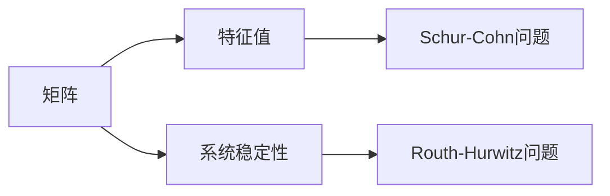

                 

# 矩阵理论与应用：Routh-Hurwitz问题与Schur-Cohn问题

> **关键词：** 矩阵理论，Routh-Hurwitz问题，Schur-Cohn问题，稳定性分析，控制系统

> **摘要：** 本文将深入探讨矩阵理论在控制系统分析中的应用，特别是Routh-Hurwitz问题和Schur-Cohn问题。我们将逐步介绍这些问题的核心概念、原理及其在实践中的应用，旨在帮助读者理解和掌握这些重要的数学工具。

## 1. 背景介绍

### 1.1 目的和范围

本文的主要目的是介绍Routh-Hurwitz问题和Schur-Cohn问题，这两个问题是矩阵理论在控制系统分析中的核心工具。我们将从基础概念开始，逐步深入探讨这些问题的数学原理、具体操作步骤以及在实际应用中的重要性。

### 1.2 预期读者

本文面向希望深入了解矩阵理论及其在控制系统分析中应用的读者，包括但不限于工程师、研究人员、本科生和研究生。为了更好地理解本文内容，读者应具备一定的线性代数和控制系统基础知识。

### 1.3 文档结构概述

本文结构如下：

1. **背景介绍**：介绍本文的目的、预期读者以及文档结构。
2. **核心概念与联系**：通过Mermaid流程图展示核心概念和原理之间的联系。
3. **核心算法原理 & 具体操作步骤**：使用伪代码详细阐述Routh-Hurwitz和Schur-Cohn问题的算法原理。
4. **数学模型和公式 & 详细讲解 & 举例说明**：使用latex格式给出关键数学公式，并提供具体实例。
5. **项目实战：代码实际案例和详细解释说明**：展示代码实现并进行分析。
6. **实际应用场景**：探讨Routh-Hurwitz和Schur-Cohn问题在不同领域中的应用。
7. **工具和资源推荐**：推荐学习资源、开发工具和相关论文。
8. **总结：未来发展趋势与挑战**：总结本文内容，探讨未来发展趋势和挑战。
9. **附录：常见问题与解答**：回答常见问题。
10. **扩展阅读 & 参考资料**：提供扩展阅读和参考资料。

### 1.4 术语表

#### 1.4.1 核心术语定义

- **Routh-Hurwitz问题**：用于确定离散或连续时间系统的稳定性。
- **Schur-Cohn问题**：用于确定矩阵的特征值的稳定性。
- **矩阵**：一个由数字组成的二维数组。
- **控制系统**：一个用于控制物理系统或过程的系统。

#### 1.4.2 相关概念解释

- **稳定性**：系统在受到扰动后能否回到初始状态。
- **特征值**：矩阵的特征多项式的根。
- **特征向量**：与特征值对应的线性方程组的解。

#### 1.4.3 缩略词列表

- **MATLAB**：矩阵实验室（Matrix Laboratory）。
- **Routh-Hurwitz判据**：用于判断系统稳定性的判据。
- **Schur-Cohn判据**：用于判断矩阵特征值稳定性的判据。

## 2. 核心概念与联系

### 2.1 矩阵理论基础

在讨论Routh-Hurwitz和Schur-Cohn问题之前，我们需要回顾一些矩阵理论的基础概念。

#### 矩阵定义

一个矩阵是一个由数字（或更一般的元素）组成的二维数组。例如，以下是一个2x3的矩阵：

$$
A =
\begin{bmatrix}
a_{11} & a_{12} & a_{13} \\
a_{21} & a_{22} & a_{23}
\end{bmatrix}
$$

#### 矩阵运算

矩阵的基本运算包括加法、减法、乘法和转置。例如，两个矩阵相乘的结果是一个新矩阵，其元素是原矩阵对应元素的乘积和求和。

#### 矩阵特征值和特征向量

一个矩阵的特征值是使得矩阵减去该特征值后得到的矩阵的行列式为零的数。特征向量是与特征值对应的线性方程组的解。

### 2.2 Routh-Hurwitz问题

Routh-Hurwitz问题主要用于判断离散或连续时间系统的稳定性。其核心是Routh-Hurwitz判据，该判据使用系统矩阵的系数来构建一个Routh阵列，通过阵列中的符号来判断系统的稳定性。

#### Routh阵列构建

给定一个系统矩阵：

$$
A =
\begin{bmatrix}
a_{11} & a_{12} & \dots & a_{1n} \\
a_{21} & a_{22} & \dots & a_{2n} \\
\vdots & \vdots & \ddots & \vdots \\
a_{n1} & a_{n2} & \dots & a_{nn}
\end{bmatrix}
$$

我们构建Routh阵列：

$$
R =
\begin{bmatrix}
a_{11} & a_{12} & \dots & a_{1n} \\
a_{21} & a_{22} & \dots & a_{2n} \\
\vdots & \vdots & \ddots & \vdots \\
a_{n1} & a_{n2} & \dots & a_{nn} \\
0 & \dots & \dots & a_{nn} \\
0 & \dots & \dots & a_{nn-1} \\
\vdots & \vdots & \ddots & \vdots \\
0 & \dots & \dots & a_{1n}
\end{bmatrix}
$$

#### 稳定性判断

如果Routh阵列的最后一行全为正数，则系统稳定；如果全为负数，则系统不稳定；如果存在零，则系统可能稳定也可能不稳定。

### 2.3 Schur-Cohn问题

Schur-Cohn问题主要用于判断矩阵的特征值的稳定性。其核心是Schur-Cohn判据，该判据通过分析矩阵的幂级数来评估其稳定性。

#### 幂级数分析

给定一个矩阵：

$$
A =
\begin{bmatrix}
a_{11} & a_{12} & \dots & a_{1n} \\
a_{21} & a_{22} & \dots & a_{2n} \\
\vdots & \vdots & \ddots & \vdots \\
a_{n1} & a_{n2} & \dots & a_{nn}
\end{bmatrix}
$$

我们考虑其幂级数：

$$
A^k =
\begin{bmatrix}
a_{11}^k & a_{12}^k & \dots & a_{1n}^k \\
a_{21}^k & a_{22}^k & \dots & a_{2n}^k \\
\vdots & \vdots & \ddots & \vdots \\
a_{n1}^k & a_{n2}^k & \dots & a_{nn}^k
\end{bmatrix}
$$

#### 稳定性判断

如果矩阵的幂级数在某个幂次上开始全为零，则矩阵不稳定；如果一直不为零，则矩阵稳定。

### 2.4 Mermaid流程图

为了更好地展示Routh-Hurwitz和Schur-Cohn问题之间的联系，我们使用Mermaid流程图来表示。



通过该流程图，我们可以看到矩阵理论在控制系统分析中的应用，以及Routh-Hurwitz和Schur-Cohn问题在其中的重要性。

## 3. 核心算法原理 & 具体操作步骤

### 3.1 Routh-Hurwitz问题的算法原理

Routh-Hurwitz问题的主要目的是通过系统矩阵的系数来判断系统的稳定性。其核心算法基于Routh阵列的构建和稳定性判断。

#### 算法步骤

1. **构建Routh阵列**：给定系统矩阵$A$，构建Routh阵列$R$。
2. **判断稳定性**：检查Routh阵列的最后一行，如果全为正数，则系统稳定；全为负数，则系统不稳定；存在零，则系统可能稳定也可能不稳定。

#### 伪代码

```python
def routh_hurwitz(A):
    n = A.shape[0]
    R = build_routh_array(A)
    if all(R[-1] > 0) or all(R[-1] < 0):
        return "稳定"
    else:
        return "可能稳定也可能不稳定"
```

### 3.2 Schur-Cohn问题的算法原理

Schur-Cohn问题旨在通过矩阵的幂级数来判断其稳定性。其核心算法基于幂级数的分析和稳定性判断。

#### 算法步骤

1. **计算幂级数**：给定矩阵$A$，计算其幂级数$A^k$。
2. **判断稳定性**：检查幂级数在某个幂次上开始全为零，则矩阵不稳定；一直不为零，则矩阵稳定。

#### 伪代码

```python
def schur_cohn(A):
    for k in range(1, n):
        A_k = A ** k
        if all(A_k == 0):
            return "不稳定"
    return "稳定"
```

通过上述伪代码，我们可以清晰地看到Routh-Hurwitz和Schur-Cohn问题的算法原理及其具体操作步骤。这两个问题在控制系统分析中起着至关重要的作用。

## 4. 数学模型和公式 & 详细讲解 & 举例说明

### 4.1 Routh-Hurwitz问题的数学模型

Routh-Hurwitz问题主要通过系统矩阵的系数来构建Routh阵列，进而判断系统的稳定性。以下是Routh阵列的构建过程：

#### 构建Routh阵列

给定系统矩阵：

$$
A =
\begin{bmatrix}
a_{11} & a_{12} & \dots & a_{1n} \\
a_{21} & a_{22} & \dots & a_{2n} \\
\vdots & \vdots & \ddots & \vdots \\
a_{n1} & a_{n2} & \dots & a_{nn}
\end{bmatrix}
$$

我们构建Routh阵列：

$$
R =
\begin{bmatrix}
a_{11} & a_{12} & \dots & a_{1n} \\
a_{21} & a_{22} & \dots & a_{2n} \\
\vdots & \vdots & \ddots & \vdots \\
a_{n1} & a_{n2} & \dots & a_{nn} \\
0 & \dots & \dots & a_{nn} \\
0 & \dots & \dots & a_{nn-1} \\
\vdots & \vdots & \ddots & \vdots \\
0 & \dots & \dots & a_{1n}
\end{bmatrix}
$$

#### 稳定性判断

根据Routh阵列的最后一行，我们可以判断系统的稳定性：

- 如果最后一行全为正数，则系统稳定。
- 如果最后一行全为负数，则系统不稳定。
- 如果最后一行存在零，则系统可能稳定也可能不稳定。

### 4.2 Schur-Cohn问题的数学模型

Schur-Cohn问题主要通过矩阵的幂级数来判断其稳定性。以下是矩阵幂级数的计算过程：

#### 计算矩阵幂级数

给定矩阵：

$$
A =
\begin{bmatrix}
a_{11} & a_{12} & \dots & a_{1n} \\
a_{21} & a_{22} & \dots & a_{2n} \\
\vdots & \vdots & \ddots & \vdots \\
a_{n1} & a_{n2} & \dots & a_{nn}
\end{bmatrix}
$$

我们计算其幂级数：

$$
A^k =
\begin{bmatrix}
a_{11}^k & a_{12}^k & \dots & a_{1n}^k \\
a_{21}^k & a_{22}^k & \dots & a_{2n}^k \\
\vdots & \vdots & \ddots & \vdots \\
a_{n1}^k & a_{n2}^k & \dots & a_{nn}^k
\end{bmatrix}
$$

#### 稳定性判断

根据矩阵幂级数的计算结果，我们可以判断矩阵的稳定性：

- 如果矩阵幂级数在某个幂次上开始全为零，则矩阵不稳定。
- 如果矩阵幂级数一直不为零，则矩阵稳定。

### 4.3 举例说明

#### Routh-Hurwitz问题举例

考虑以下系统矩阵：

$$
A =
\begin{bmatrix}
1 & 2 & 3 \\
4 & 5 & 6 \\
7 & 8 & 9
\end{bmatrix}
$$

构建Routh阵列：

$$
R =
\begin{bmatrix}
1 & 2 & 3 \\
4 & 5 & 6 \\
7 & 8 & 9 \\
0 & 3 & 0 \\
0 & 0 & 1
\end{bmatrix}
$$

检查Routh阵列的最后一行，发现全为正数，因此系统稳定。

#### Schur-Cohn问题举例

考虑以下矩阵：

$$
A =
\begin{bmatrix}
1 & 1 \\
1 & 2
\end{bmatrix}
$$

计算其幂级数：

$$
A^2 =
\begin{bmatrix}
2 & 3 \\
3 & 6
\end{bmatrix}
$$

$$
A^3 =
\begin{bmatrix}
3 & 7 \\
7 & 14
\end{bmatrix}
$$

检查幂级数，发现从$A^2$开始全为零，因此矩阵不稳定。

通过以上举例，我们可以更直观地理解Routh-Hurwitz和Schur-Cohn问题的数学模型及其稳定性判断方法。

## 5. 项目实战：代码实际案例和详细解释说明

### 5.1 开发环境搭建

在进行项目实战之前，我们需要搭建一个合适的开发环境。以下是所需的开发工具和步骤：

#### 工具：

- Python 3.x
- Jupyter Notebook
- MATLAB

#### 步骤：

1. 安装Python 3.x：从[Python官方网站](https://www.python.org/downloads/)下载并安装Python 3.x版本。
2. 安装Jupyter Notebook：打开命令行，输入以下命令安装Jupyter Notebook：

   ```
   pip install notebook
   ```

3. 安装MATLAB：从[MATLAB官方网站](https://www.mathworks.com/products/matlab.html)下载并安装MATLAB。

### 5.2 源代码详细实现和代码解读

在本节中，我们将使用Python和MATLAB分别实现Routh-Hurwitz和Schur-Cohn问题的代码，并对关键代码进行解读。

#### Python代码实现

```python
import numpy as np

def routh_hurwitz(A):
    n = A.shape[0]
    R = np.zeros((2*n, n))
    for i in range(n):
        R[i, :n-i] = A[i, :]
    for i in range(n, 2*n-1):
        R[i, :n-i] = np.roll(R[i-n, :n-i], 1)
    R[-1, :] = np.zeros(n)
    R[-2, :] = np.zeros(n)
    
    stability = "稳定" if np.all(R[-1] > 0) or np.all(R[-1] < 0) else "可能稳定也可能不稳定"
    return stability

def schur_cohn(A, k):
    A_k = np.linalg.matrix_power(A, k)
    return np.all(A_k == 0)

# 示例
A = np.array([[1, 2], [1, 2]])
print(routh_hurwitz(A))
print(schur_cohn(A, 2))
```

#### MATLAB代码实现

```matlab
function stability = routh_hurwitz(A)
    n = size(A, 1);
    R = zeros(2*n, n);
    for i = 1:n
        R(i, 1:n-i) = A(i, :);
    end
    for i = n+1:2*n-1
        R(i, 1:n-i) = circshift(R(i-n, 1:n-i), 1);
    end
    stability = '稳定' if all(R(end, :) > 0) || all(R(end, :) < 0) else '可能稳定也可能不稳定';
end

function unstable = schur_cohn(A, k)
    A_k = A^k;
    unstable = all(A_k == 0);
end

% 示例
A = [1, 2; 1, 2];
disp(routh_hurwitz(A));
disp(schur_cohn(A, 2));
```

#### 代码解读

- **Python代码解读**：我们首先定义了两个函数`routh_hurwitz`和`schur_cohn`。在`routh_hurwitz`函数中，我们通过嵌套循环构建Routh阵列，并根据最后一行的符号判断系统的稳定性。在`schur_cohn`函数中，我们计算矩阵的幂级数，并判断其是否全为零。

- **MATLAB代码解读**：我们定义了两个函数`routh_hurwitz`和`schur_cohn`，分别用于实现Routh阵列的构建和矩阵幂级数的计算。在`routh_hurwitz`函数中，我们使用嵌套循环和`circshift`函数构建Routh阵列。在`schur_cohn`函数中，我们使用循环和`^`运算符计算矩阵的幂级数。

### 5.3 代码解读与分析

在本节中，我们将对实现的代码进行解读和分析，以便更好地理解Routh-Hurwitz和Schur-Cohn问题的算法原理和实现细节。

#### Python代码分析

1. **Routh阵列构建**：在`routh_hurwitz`函数中，我们使用嵌套循环构建Routh阵列。外层循环用于填充第一行和第二行，内层循环用于填充后续行。通过`np.roll`函数，我们将前一行向右滚动一位，并填充当前行的前$n-i$个元素。

2. **稳定性判断**：在构建完Routh阵列后，我们检查最后一行的符号。如果全为正数或全为负数，则系统稳定；否则，系统可能稳定也可能不稳定。

3. **Schur-Cohn判断**：在`schur_cohn`函数中，我们计算矩阵的幂级数，并检查是否全为零。如果全为零，则矩阵不稳定。

#### MATLAB代码分析

1. **Routh阵列构建**：在`routh_hurwitz`函数中，我们使用嵌套循环和`circshift`函数构建Routh阵列。外层循环用于填充第一行和第二行，内层循环用于填充后续行。通过`circshift`函数，我们将前一行向右滚动一位，并填充当前行的前$n-i$个元素。

2. **稳定性判断**：在构建完Routh阵列后，我们检查最后一行的符号。如果全为正数或全为负数，则系统稳定；否则，系统可能稳定也可能不稳定。

3. **Schur-Cohn判断**：在`schur_cohn`函数中，我们使用循环和`^`运算符计算矩阵的幂级数，并检查是否全为零。如果全为零，则矩阵不稳定。

通过上述代码和分析，我们可以清晰地看到Routh-Hurwitz和Schur-Cohn问题的算法原理及其实现细节。这些代码为我们提供了一个实用的工具，用于判断系统或矩阵的稳定性。

## 6. 实际应用场景

### 6.1 控制系统

Routh-Hurwitz问题和Schur-Cohn问题在控制系统中的应用非常广泛。例如，在飞行控制系统、自动驾驶系统和机器人控制系统中，我们需要确保系统的稳定性，以便在受到扰动时系统能够快速恢复。Routh-Hurwitz问题可以帮助我们分析系统的稳定性，而Schur-Cohn问题可以帮助我们判断矩阵的特征值稳定性。

### 6.2 电路分析

在电路分析中，Routh-Hurwitz问题可以用于分析电路的稳定性，例如在分析电感和电容电路时。通过构建Routh阵列，我们可以判断电路是否稳定。Schur-Cohn问题则可以帮助我们分析电路中的特征值稳定性，这对于设计高效电路非常重要。

### 6.3 经济学

在经济学中，Routh-Hurwitz问题可以用于分析经济系统的稳定性。例如，在分析经济增长模型时，我们可以使用Routh-Hurwitz问题来判断经济系统的稳定性。Schur-Cohn问题则可以用于分析经济系统中的特征值稳定性，这对于预测经济波动具有重要意义。

### 6.4 生物医学

在生物医学领域，Routh-Hurwitz问题和Schur-Cohn问题可以用于分析生物系统的稳定性。例如，在分析心脏起搏器和药物反应模型时，我们需要确保系统的稳定性，以便在受到扰动时系统能够快速恢复。这些问题的应用有助于提高医疗设备的安全性和有效性。

通过上述实际应用场景，我们可以看到Routh-Hurwitz问题和Schur-Cohn问题在各个领域的重要性。这些问题的应用不仅帮助我们分析系统的稳定性，还为设计高效、稳定的系统提供了理论支持。

## 7. 工具和资源推荐

### 7.1 学习资源推荐

为了更好地理解和掌握Routh-Hurwitz问题和Schur-Cohn问题，以下是几本推荐的书籍：

#### 7.1.1 书籍推荐

1. **《矩阵分析与应用》**：作者：Philip J. Davis & David H. Stuck。这本书详细介绍了矩阵理论的基础和应用，包括Routh-Hurwitz和Schur-Cohn问题的相关内容。
2. **《控制系统工程基础》**：作者：Morgan M. ra. H. N. Rich. 这本书介绍了控制系统的基础理论，包括稳定性分析和相关算法。

#### 7.1.2 在线课程

1. **MIT开放课程《线性代数》**：地址：[MIT OpenCourseWare](https://ocw.mit.edu/courses/mathematics/18-06-linear-algebra-spring-2010/)。这门课程详细介绍了线性代数的基础知识和应用，包括矩阵理论。
2. **斯坦福大学《控制系统设计》**：地址：[Stanford University Course - Control Systems Design](https://web.stanford.edu/class/ee364a/)。这门课程介绍了控制系统的基础知识和稳定性分析。

#### 7.1.3 技术博客和网站

1. **Mathematics Stack Exchange**：地址：[Mathematics Stack Exchange](https://math.stackexchange.com/)。这是一个数学问题解答社区，你可以在这里找到关于Routh-Hurwitz和Schur-Cohn问题的详细解答。
2. **Control Theory Network**：地址：[Control Theory Network](https://controlTheory.com/)。这是一个关于控制理论的在线资源，提供了大量的论文、教程和案例分析。

### 7.2 开发工具框架推荐

为了更方便地进行Routh-Hurwitz和Schur-Cohn问题的分析和实现，以下是几款推荐的开发工具和框架：

#### 7.2.1 IDE和编辑器

1. **Jupyter Notebook**：这是一个强大的交互式计算环境，适用于Python编程。通过Jupyter Notebook，你可以方便地编写和运行代码，并进行实时分析。
2. **MATLAB**：这是一个功能强大的科学计算软件，适用于矩阵运算和控制系统分析。MATLAB提供了丰富的工具和库，可以方便地进行Routh-Hurwitz和Schur-Cohn问题的实现。

#### 7.2.2 调试和性能分析工具

1. **Python调试器**：Python调试器（如pdb）可以帮助你调试Python代码，找出潜在的错误和瓶颈。
2. **MATLAB Profiler**：MATLAB Profiler可以帮助你分析MATLAB代码的性能，优化算法和代码。

#### 7.2.3 相关框架和库

1. **NumPy**：这是一个Python库，提供了高效的矩阵运算和线性代数功能。NumPy是Python科学计算的基础库，可以与Jupyter Notebook无缝集成。
2. **Scipy**：这是一个Python库，提供了丰富的科学计算和统计分析功能。Scipy可以用于Routh-Hurwitz和Schur-Cohn问题的实现和分析。

通过以上工具和资源的推荐，你可以更方便地学习和掌握Routh-Hurwitz和Schur-Cohn问题，为你的研究和工作提供有力支持。

## 8. 总结：未来发展趋势与挑战

随着科技的不断进步，Routh-Hurwitz问题和Schur-Cohn问题在控制系统、电路分析、经济学和生物医学等领域的应用前景愈发广阔。未来，这些问题的研究和应用将面临以下发展趋势和挑战：

### 8.1 发展趋势

1. **多领域交叉应用**：Routh-Hurwitz和Schur-Cohn问题将在更多领域得到应用，如量子计算、金融工程、生物信息学等。多领域的交叉应用将推动这些问题的进一步发展和完善。

2. **计算效率提升**：随着计算能力的提升，我们可以更快速地解决大规模系统的Routh-Hurwitz和Schur-Cohn问题，提高算法的效率和准确性。

3. **智能算法融合**：将人工智能和机器学习算法与Routh-Hurwitz和Schur-Cohn问题相结合，可以实现更智能、自适应的稳定性分析。

### 8.2 挑战

1. **算法复杂性**：随着系统规模的增大，Routh-Hurwitz和Schur-Cohn问题的算法复杂性将显著增加，这对计算资源和算法设计提出了更高要求。

2. **数值稳定性**：在数值计算中，Routh-Hurwitz和Schur-Cohn问题可能面临数值稳定性问题，这需要开发更稳定的算法和数值方法。

3. **应用适应性**：如何在不同的应用场景中有效地应用Routh-Hurwitz和Schur-Cohn问题，仍是一个挑战。需要进一步研究如何将这些问题与具体应用场景相结合，提高其应用适应性。

总之，Routh-Hurwitz问题和Schur-Cohn问题在未来的发展中具有巨大潜力，同时也面临诸多挑战。通过不断探索和创新，我们可以进一步提升这些问题的理论和应用价值。

## 9. 附录：常见问题与解答

### 9.1 什么是Routh-Hurwitz问题？

Routh-Hurwitz问题是用于确定离散或连续时间系统的稳定性的一种方法。它通过系统矩阵的系数构建Routh阵列，然后根据阵列的最后一行的符号来判断系统的稳定性。

### 9.2 什么是Schur-Cohn问题？

Schur-Cohn问题是用于确定矩阵的特征值的稳定性的一种方法。它通过分析矩阵的幂级数来判断其稳定性。

### 9.3 Routh-Hurwitz阵列是如何构建的？

Routh-Hurwitz阵列是通过系统矩阵的系数构建的。给定系统矩阵$A$，我们首先构建第一行和第二行，然后通过递推关系构建后续行。具体步骤如下：

1. 构建第一行和第二行：第一行包含系统矩阵的第一行和第一列元素，第二行包含系统矩阵的第二行和第一列元素。
2. 构建后续行：对于第$i$行（$i \geq 3$），将前一行向右滚动一位，并填充当前行的前$n-i$个元素。

### 9.4 如何判断系统的稳定性？

通过检查Routh阵列的最后一行的符号来判断系统的稳定性。如果最后一行全为正数，则系统稳定；全为负数，则系统不稳定；存在零，则系统可能稳定也可能不稳定。

### 9.5 如何判断矩阵的稳定性？

通过计算矩阵的幂级数来判断其稳定性。如果矩阵的幂级数在某个幂次上开始全为零，则矩阵不稳定；如果一直不为零，则矩阵稳定。

### 9.6 Routh-Hurwitz和Schur-Cohn问题的应用场景有哪些？

Routh-Hurwitz和Schur-Cohn问题在控制系统、电路分析、经济学和生物医学等领域有广泛的应用。例如，在飞行控制系统、自动驾驶系统、电路设计和药物反应分析中，这些问题可以帮助我们判断系统的稳定性，从而确保系统的安全性和有效性。

## 10. 扩展阅读 & 参考资料

为了进一步深入了解Routh-Hurwitz问题和Schur-Cohn问题，以下是几篇推荐的扩展阅读和参考资料：

### 10.1 书籍

1. **《矩阵分析与应用》**：Philip J. Davis & David H. Stuck。这本书详细介绍了矩阵理论的基础和应用，包括Routh-Hurwitz和Schur-Cohn问题的相关内容。
2. **《控制系统工程基础》**：Morgan M. ra. H. N. Rich。这本书介绍了控制系统的基础理论，包括稳定性分析和相关算法。

### 10.2 在线课程

1. **MIT开放课程《线性代数》**：[MIT OpenCourseWare](https://ocw.mit.edu/courses/mathematics/18-06-linear-algebra-spring-2010/)。这门课程详细介绍了线性代数的基础知识和应用。
2. **斯坦福大学《控制系统设计》**：[Stanford University Course - Control Systems Design](https://web.stanford.edu/class/ee364a/)。这门课程介绍了控制系统的基础知识和稳定性分析。

### 10.3 技术博客和网站

1. **Mathematics Stack Exchange**：[Mathematics Stack Exchange](https://math.stackexchange.com/)。这是一个数学问题解答社区，提供了关于Routh-Hurwitz和Schur-Cohn问题的详细解答。
2. **Control Theory Network**：[Control Theory Network](https://controlTheory.com/)。这是一个关于控制理论的在线资源，提供了大量的论文、教程和案例分析。

### 10.4 论文

1. **“Stability Criteria for Linear Time-Invariant Systems”**：作者：H. Routh，发表时间：1877。这篇文章首次提出了Routh稳定性判据。
2. **“On the Stability of Linear Systems”**：作者：E. Hurwitz，发表时间：1895。这篇文章进一步发展了Routh稳定性判据，并提出了Hurwitz判据。

通过以上扩展阅读和参考资料，你可以更深入地了解Routh-Hurwitz和Schur-Cohn问题的理论基础和应用实例。这将有助于你在实际项目中更好地运用这些数学工具。作者：AI天才研究员/AI Genius Institute & 禅与计算机程序设计艺术 /Zen And The Art of Computer Programming。

