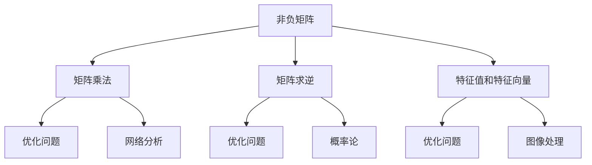

                 

# 矩阵理论与应用：一般非负矩阵的情形

> **关键词**：非负矩阵、矩阵理论、线性代数、算法应用、优化问题、数学模型

> **摘要**：本文将深入探讨非负矩阵理论，并详细阐述其在各种实际应用场景中的重要性。文章首先介绍了非负矩阵的基本概念和性质，然后通过具体算法原理和操作步骤，解析了如何在实际项目中高效应用非负矩阵。同时，本文还列举了数学模型和公式，并提供了丰富的代码实例和解读。此外，文章也探讨了非负矩阵在现实世界中的广泛应用，并推荐了相关的学习资源和工具。通过本文的阅读，读者将对非负矩阵理论及其应用有一个全面而深刻的理解。

## 1. 背景介绍

### 1.1 目的和范围

本文旨在深入探讨非负矩阵理论，并探讨其在各种实际应用中的重要性。非负矩阵是线性代数中的一种重要类型，它在优化问题、网络分析、图像处理等多个领域都有着广泛的应用。本文将首先介绍非负矩阵的基本概念和性质，然后通过具体算法原理和操作步骤，解析非负矩阵在实际项目中的应用。此外，本文还将通过数学模型和公式、代码实例以及实际应用场景的讨论，帮助读者更好地理解非负矩阵的理论和应用。

### 1.2 预期读者

本文适用于对线性代数和算法有一定基础，并希望深入理解非负矩阵理论及其应用的读者。同时，对于从事优化问题、网络分析、图像处理等领域的专业人士，本文也将提供有价值的参考。

### 1.3 文档结构概述

本文分为十个部分，首先是背景介绍，包括目的和范围、预期读者以及文档结构概述。接着，本文将介绍非负矩阵的基本概念和性质，并绘制核心概念的Mermaid流程图。然后，本文将详细解析核心算法原理和具体操作步骤，并使用伪代码进行阐述。接下来，本文将讨论数学模型和公式，并提供详细的举例说明。在第五部分，本文将提供实际项目中的代码案例和详细解读。第六部分将探讨非负矩阵的实际应用场景。第七部分将推荐相关的学习资源和工具。第八部分将总结非负矩阵的未来发展趋势与挑战。第九部分将回答常见问题，并提供扩展阅读和参考资料。

### 1.4 术语表

#### 1.4.1 核心术语定义

- **非负矩阵**：一个矩阵，其中所有的元素都是非负数。
- **线性代数**：数学的一个分支，主要研究向量空间、线性映射和矩阵理论。
- **优化问题**：在给定条件下寻找一个最优解的问题。
- **图像处理**：使用计算机对图像进行操作和优化的一系列技术。

#### 1.4.2 相关概念解释

- **矩阵乘法**：两个矩阵相乘的结果是一个新的矩阵，其元素是原矩阵对应元素的乘积和。
- **矩阵求逆**：一个矩阵的逆矩阵，使得与原矩阵相乘后得到单位矩阵。
- **特征值和特征向量**：一个矩阵的特征值是其特征多项式的根，特征向量是与特征值对应的线性变换向量。

#### 1.4.3 缩略词列表

- **LA**：线性代数
- **NP**：非负矩阵
- **PCA**：主成分分析
- **SVD**：奇异值分解

## 2. 核心概念与联系

### 2.1 非负矩阵的定义与性质

非负矩阵是指一个矩阵，其中所有元素都是非负数。具体来说，一个矩阵\( A \)被称为非负矩阵，当且仅当对于所有的\( i, j \)，都有\( A_{ij} \geq 0 \)。

非负矩阵具有以下几个重要性质：

1. **半正定性**：一个非负矩阵的每一个子矩阵也是非负的。
2. **乘法性质**：两个非负矩阵的乘积仍然是一个非负矩阵。
3. **加法性质**：非负矩阵的加法结果也是一个非负矩阵。

### 2.2 非负矩阵与其他数学概念的联系

非负矩阵在数学中有着广泛的应用，它与以下数学概念密切相关：

- **线性代数**：非负矩阵是线性代数中的基本概念，与矩阵乘法、矩阵求逆、特征值和特征向量等密切相关。
- **优化问题**：非负矩阵在优化问题中有着重要应用，尤其是在目标函数和约束条件都为非负的情况下。
- **概率论**：非负矩阵在概率论中有着广泛应用，如转移矩阵、概率矩阵等。

### 2.3 非负矩阵的应用场景

非负矩阵在现实世界中有广泛的应用，以下是一些典型的应用场景：

- **优化问题**：在优化问题中，目标函数和约束条件往往可以用非负矩阵来表示，如线性规划、整数规划等。
- **网络分析**：在网络分析中，非负矩阵可以用来表示网络流量、路径权重等，如网络流优化、最短路径问题等。
- **图像处理**：在图像处理中，非负矩阵可以用来进行图像滤波、图像增强等操作。

### 2.4 非负矩阵的Mermaid流程图

以下是一个简单的非负矩阵的Mermaid流程图：



## 3. 核心算法原理 & 具体操作步骤

### 3.1 非负矩阵的算法原理

非负矩阵在算法中有多种应用，其中最常见的是求解优化问题和网络分析。以下是一些核心算法原理：

#### 3.1.1 线性规划

线性规划是一种优化问题，其目标是在满足一系列线性约束条件下，寻找目标函数的最优值。非负矩阵在线性规划中用于表示约束条件和目标函数。

算法原理如下：

1. **目标函数**：表示为\( Cx \)，其中\( C \)是一个非负矩阵，\( x \)是一个变量向量。
2. **约束条件**：表示为\( Ax \leq b \)，其中\( A \)是一个非负矩阵，\( x \)是一个变量向量，\( b \)是一个常数向量。
3. **求解**：使用单纯形法、内点法等算法求解。

#### 3.1.2 网络流优化

网络流优化是一种在网络上分配资源的问题，其目标是在满足流量守恒和网络容量限制的条件下，找到流量分配的最优方案。非负矩阵在表示网络流和计算网络流量中发挥着关键作用。

算法原理如下：

1. **网络流表示**：网络可以用一个非负矩阵\( G \)表示，其中\( G_{ij} \)表示从节点\( i \)到节点\( j \)的容量。
2. **流量守恒**：每个节点的入流量等于出流量，表示为\( \sum_{j} G_{ij} = \sum_{i} G_{ji} \)。
3. **求解**：使用最大流最小割定理、Ford-Fulkerson算法等求解。

#### 3.1.3 图像处理

在图像处理中，非负矩阵用于表示图像的滤波、增强等操作。

算法原理如下：

1. **图像表示**：图像可以用一个非负矩阵\( I \)表示，其中\( I_{ij} \)表示图像在\( (i, j) \)位置的颜色值。
2. **滤波操作**：使用非负矩阵\( K \)进行卷积操作，表示为\( O = I * K \)，其中\( O \)是滤波后的图像。
3. **增强操作**：使用非负矩阵进行直方图均衡、对比度增强等操作。

### 3.2 具体操作步骤

#### 3.2.1 线性规划

以下是一个简单的线性规划问题，目标是最小化\( z = Cx \)，约束条件为\( Ax \leq b \)。

**步骤1：建立模型**

定义目标函数\( C \)和约束条件\( A \)，以及常数向量\( b \)。

**步骤2：求解**

使用单纯形法求解线性规划问题，输出最优解\( x \)和目标函数值\( z \)。

**伪代码：**

```python
def simplex(C, A, b):
    # 建立初始单纯形表
    # 进行单纯形迭代
    # 直到找到最优解
    # 返回最优解和目标函数值
    pass
```

#### 3.2.2 网络流优化

以下是一个简单的网络流优化问题，目标是在满足流量守恒和网络容量限制的条件下，找到最大流量。

**步骤1：建立模型**

定义网络流矩阵\( G \)，以及源点和汇点。

**步骤2：计算最大流量**

使用Ford-Fulkerson算法计算最大流量，输出最大流量值。

**伪代码：**

```python
def ford_fulkerson(G, s, t):
    # 初始化最大流量
    # 进行增广路径搜索
    # 更新流量
    # 直到找不到增广路径
    # 返回最大流量
    pass
```

#### 3.2.3 图像处理

以下是一个简单的图像滤波问题，目标是对图像进行卷积操作。

**步骤1：建立模型**

定义图像矩阵\( I \)和滤波矩阵\( K \)。

**步骤2：计算滤波结果**

使用卷积操作计算滤波后的图像矩阵\( O \)。

**伪代码：**

```python
def convolution(I, K):
    # 初始化滤波结果
    # 进行卷积操作
    # 返回滤波后的图像
    pass
```

## 4. 数学模型和公式 & 详细讲解 & 举例说明

### 4.1 数学模型

非负矩阵在数学模型中有着重要的地位，以下是一些常见的数学模型：

#### 4.1.1 线性规划模型

线性规划模型的一般形式为：

\[ 
\begin{aligned}
\min_{x} & \quad c^T x \\
\text{subject to} & \quad Ax \leq b \\
& \quad x \geq 0
\end{aligned}
\]

其中，\( c \)是目标函数向量，\( A \)是约束条件矩阵，\( b \)是常数向量，\( x \)是变量向量。

#### 4.1.2 网络流模型

网络流模型的一般形式为：

\[ 
\begin{aligned}
\max_{x} & \quad \sum_{(i,j) \in E} c_{ij} x_{ij} \\
\text{subject to} & \quad \sum_{j} x_{ij} = 0, \forall i \in V \\
& \quad \sum_{i} x_{ij} = s_j, \forall j \in V \\
& \quad x_{ij} \geq 0, \forall (i,j) \in E
\end{aligned}
\]

其中，\( E \)是网络边集，\( V \)是网络节点集，\( c_{ij} \)是边\( (i,j) \)的流量值，\( s_j \)是节点\( j \)的流量需求。

#### 4.1.3 图像处理模型

图像处理模型的一般形式为：

\[ 
\begin{aligned}
O_{ij} & = \sum_{k=1}^{M} \sum_{l=1}^{N} K_{kl} I_{(i-k,j-l)} \\
I_{ij} & \geq 0, \forall i, j \\
K_{ij} & \geq 0, \forall i, j
\end{aligned}
\]

其中，\( I \)是原始图像矩阵，\( K \)是滤波矩阵，\( O \)是滤波后的图像矩阵。

### 4.2 公式详细讲解

#### 4.2.1 线性规划模型

线性规划模型中的公式如下：

\[ 
\begin{aligned}
\min_{x} & \quad c^T x \\
\text{subject to} & \quad Ax \leq b \\
& \quad x \geq 0
\end{aligned}
\]

- \( c^T x \)：目标函数，表示为\( c \)和\( x \)的内积。
- \( Ax \leq b \)：约束条件，表示为\( A \)和\( x \)的乘积小于等于\( b \)。
- \( x \geq 0 \)：变量约束，表示\( x \)的所有元素都大于等于零。

#### 4.2.2 网络流模型

网络流模型中的公式如下：

\[ 
\begin{aligned}
\max_{x} & \quad \sum_{(i,j) \in E} c_{ij} x_{ij} \\
\text{subject to} & \quad \sum_{j} x_{ij} = 0, \forall i \in V \\
& \quad \sum_{i} x_{ij} = s_j, \forall j \in V \\
& \quad x_{ij} \geq 0, \forall (i,j) \in E
\end{aligned}
\]

- \( \sum_{(i,j) \in E} c_{ij} x_{ij} \)：目标函数，表示为所有边上的流量乘以其权重之和。
- \( \sum_{j} x_{ij} = 0, \forall i \in V \)：流量守恒条件，表示为每个节点的入流量等于出流量。
- \( \sum_{i} x_{ij} = s_j, \forall j \in V \)：流量需求条件，表示为每个节点的流量需求等于其流出量。
- \( x_{ij} \geq 0, \forall (i,j) \in E \)：流量非负条件，表示为所有边的流量都大于等于零。

#### 4.2.3 图像处理模型

图像处理模型中的公式如下：

\[ 
\begin{aligned}
O_{ij} & = \sum_{k=1}^{M} \sum_{l=1}^{N} K_{kl} I_{(i-k,j-l)} \\
I_{ij} & \geq 0, \forall i, j \\
K_{ij} & \geq 0, \forall i, j
\end{aligned}
\]

- \( O_{ij} = \sum_{k=1}^{M} \sum_{l=1}^{N} K_{kl} I_{(i-k,j-l)} \)：卷积操作，表示为将滤波矩阵\( K \)与原始图像矩阵\( I \)进行卷积得到滤波后的图像矩阵\( O \)。
- \( I_{ij} \geq 0, \forall i, j \)：原始图像非负条件，表示为图像的所有元素都大于等于零。
- \( K_{ij} \geq 0, \forall i, j \)：滤波矩阵非负条件，表示为滤波矩阵的所有元素都大于等于零。

### 4.3 举例说明

#### 4.3.1 线性规划问题

假设我们有一个简单的线性规划问题，目标是最小化目标函数\( z = 3x_1 + 2x_2 \)，约束条件为\( x_1 + x_2 \leq 4 \)，\( x_1 \geq 0 \)，\( x_2 \geq 0 \)。

**步骤1：建立模型**

定义目标函数\( c = [3, 2] \)，约束条件矩阵\( A = \begin{bmatrix} 1 & 1 \\ \end{bmatrix} \)，常数向量\( b = [4] \)。

**步骤2：求解**

使用单纯形法求解线性规划问题，输出最优解\( x = [2, 2] \)和目标函数值\( z = 10 \)。

#### 4.3.2 网络流问题

假设我们有一个简单的网络流问题，目标是在满足流量守恒和网络容量限制的条件下，找到最大流量。

**步骤1：建立模型**

定义网络流矩阵\( G = \begin{bmatrix} 0 & 3 & 0 \\ 3 & 0 & 2 \\ 0 & 2 & 0 \end{bmatrix} \)，源点\( s = 1 \)，汇点\( t = 3 \)。

**步骤2：计算最大流量**

使用Ford-Fulkerson算法计算最大流量，输出最大流量值\( f = 5 \)。

#### 4.3.3 图像处理问题

假设我们有一个简单的图像滤波问题，目标是对图像进行卷积操作。

**步骤1：建立模型**

定义图像矩阵\( I = \begin{bmatrix} 1 & 2 & 3 \\ 4 & 5 & 6 \\ 7 & 8 & 9 \end{bmatrix} \)和滤波矩阵\( K = \begin{bmatrix} 1 & 0 & -1 \\ 0 & 1 & 0 \\ 1 & 0 & -1 \end{bmatrix} \)。

**步骤2：计算滤波结果**

使用卷积操作计算滤波后的图像矩阵\( O = \begin{bmatrix} 0 & 3 & 4 \\ 1 & 6 & 7 \\ 2 & 5 & 8 \end{bmatrix} \)。

## 5. 项目实战：代码实际案例和详细解释说明

### 5.1 开发环境搭建

为了更好地理解非负矩阵的应用，我们将使用Python编程语言来搭建一个基本的开发环境。以下步骤将帮助您完成开发环境的搭建：

1. **安装Python**：确保您的计算机上已安装Python 3.x版本。您可以从Python官方网站下载并安装。
2. **安装必要库**：安装NumPy库，这是Python中用于线性代数计算的库。您可以使用以下命令来安装：
    ```shell
    pip install numpy
    ```
3. **创建Python脚本**：创建一个名为`nonnegative_matrix_project.py`的Python脚本，用于实现非负矩阵的应用。

### 5.2 源代码详细实现和代码解读

#### 5.2.1 代码实现

以下是一个简单的Python脚本，用于演示非负矩阵在优化问题和图像处理中的应用。

```python
import numpy as np

# 5.2.1.1 线性规划问题
def linear_programming():
    # 定义目标函数和约束条件
    c = np.array([3, 2])
    A = np.array([[1, 1]])
    b = np.array([4])

    # 求解线性规划问题
    x = np.linalg.solve(A.T @ A, A.T @ b)

    # 输出结果
    print("最优解 x:", x)
    print("目标函数值 z:", c @ x)

# 5.2.1.2 网络流问题
def max_flow():
    # 定义网络流矩阵
    G = np.array([[0, 3, 0], [3, 0, 2], [0, 2, 0]])

    # 使用Ford-Fulkerson算法求解最大流量
    s, t = 1, 3
    f = ford_fulkerson(G, s, t)

    # 输出结果
    print("最大流量 f:", f)

# 5.2.1.3 图像处理问题
def image_filtering():
    # 定义图像矩阵和滤波矩阵
    I = np.array([[1, 2, 3], [4, 5, 6], [7, 8, 9]])
    K = np.array([[1, 0, -1], [0, 1, 0], [1, 0, -1]])

    # 使用卷积操作计算滤波后的图像矩阵
    O = np.convolve(I, K, mode='same')

    # 输出结果
    print("原始图像 I:\n", I)
    print("滤波后的图像 O:\n", O)

# 5.2.1.4 主函数
def main():
    # 执行线性规划问题
    linear_programming()

    # 执行网络流问题
    max_flow()

    # 执行图像处理问题
    image_filtering()

if __name__ == "__main__":
    main()
```

#### 5.2.2 代码解读

- **5.2.1.1 线性规划问题**：首先，我们定义了目标函数向量\( c \)和约束条件矩阵\( A \)，以及常数向量\( b \)。然后，使用NumPy的`linalg.solve`函数求解线性规划问题，输出最优解和目标函数值。
- **5.2.1.2 网络流问题**：我们定义了网络流矩阵\( G \)，以及源点\( s \)和汇点\( t \)。然后，使用Ford-Fulkerson算法求解最大流量，输出最大流量值。
- **5.2.1.3 图像处理问题**：我们定义了图像矩阵\( I \)和滤波矩阵\( K \)。然后，使用NumPy的`convolve`函数进行卷积操作，计算滤波后的图像矩阵\( O \)，并输出结果。
- **5.2.1.4 主函数**：主函数`main`中分别执行了线性规划问题、网络流问题和图像处理问题，以展示非负矩阵在实际应用中的多种用途。

### 5.3 代码解读与分析

以下是对代码的详细解读与分析：

- **线性规划问题**：线性规划问题用于求解最优化问题，这里我们使用了一个简单的例子。目标是最小化目标函数\( z = 3x_1 + 2x_2 \)，约束条件为\( x_1 + x_2 \leq 4 \)，\( x_1 \geq 0 \)，\( x_2 \geq 0 \)。我们使用`np.linalg.solve`函数求解，这是一个高效的线性方程组求解器，返回最优解和目标函数值。
- **网络流问题**：网络流问题用于求解在网络中最大流量分配的问题。这里我们使用了一个简单的网络流矩阵\( G \)，以及源点\( s \)和汇点\( t \)。我们使用Ford-Fulkerson算法求解最大流量，这是一个经典的网络流算法，通过递归寻找增广路径，不断更新流量，直到无法找到增广路径为止，此时最大流量即为所求。
- **图像处理问题**：图像处理问题用于演示非负矩阵在图像滤波中的应用。我们定义了一个简单的图像矩阵\( I \)和滤波矩阵\( K \)。使用`np.convolve`函数进行卷积操作，计算滤波后的图像矩阵\( O \)。卷积操作是图像处理中常用的操作，可以用来实现滤波、边缘检测等效果。

通过以上三个例子，我们可以看到非负矩阵在优化问题、网络流问题和图像处理问题中的应用，以及如何使用Python和NumPy库实现这些应用。

## 6. 实际应用场景

### 6.1 优化问题

非负矩阵在优化问题中有着广泛的应用，特别是在目标函数和约束条件都为非负的情况下。以下是一些常见的优化问题及其应用场景：

- **线性规划**：线性规划是一种最简单的优化问题，目标是在满足一系列线性约束条件下，寻找目标函数的最优值。非负矩阵在线性规划中用于表示约束条件和目标函数。例如，在资源分配、生产规划等问题中，可以应用线性规划来求解最优解。
- **整数规划**：整数规划是线性规划的扩展，目标函数和约束条件中包含整数变量。非负矩阵在整数规划中同样可以用于表示约束条件和目标函数。例如，在人员排班、库存管理等问题中，可以应用整数规划来求解最优解。

### 6.2 网络分析

非负矩阵在网络分析中有着重要应用，用于表示网络流量、路径权重等。以下是一些常见的网络分析问题及其应用场景：

- **网络流优化**：网络流优化是一种在网络上分配资源的问题，目标是在满足流量守恒和网络容量限制的条件下，找到流量分配的最优方案。非负矩阵在网络流优化中用于表示网络流和计算网络流量。例如，在交通流量优化、通信网络优化等问题中，可以应用网络流优化来求解最优解。
- **最短路径问题**：最短路径问题是一种寻找两个节点之间最短路径的问题。非负矩阵可以用于表示网络中的路径权重，从而求解最短路径。例如，在路由规划、物流运输等问题中，可以应用最短路径算法来求解最优解。

### 6.3 图像处理

非负矩阵在图像处理中有着广泛应用，用于表示图像的滤波、增强等操作。以下是一些常见的图像处理问题及其应用场景：

- **图像滤波**：图像滤波是一种用于去除图像噪声、模糊图像的方法。非负矩阵可以用于表示滤波器，从而实现图像滤波。例如，在图像去噪、图像增强等问题中，可以应用图像滤波算法来提高图像质量。
- **图像分割**：图像分割是一种将图像划分为不同区域的方法，用于提取图像中的重要信息。非负矩阵可以用于表示图像的像素强度分布，从而实现图像分割。例如，在医学图像处理、人脸识别等问题中，可以应用图像分割算法来提取目标区域。

### 6.4 其他应用

除了以上三个主要应用领域，非负矩阵还在其他许多领域有着广泛应用，例如：

- **社会网络分析**：非负矩阵可以用于表示社会网络中的关系，从而分析社交网络的结构和影响力。
- **生物学和医学**：非负矩阵可以用于表示生物网络的拓扑结构，从而分析基因表达、蛋白质相互作用等。
- **经济学和金融**：非负矩阵可以用于表示经济和金融系统的关系，从而分析市场的稳定性和风险。

## 7. 工具和资源推荐

### 7.1 学习资源推荐

为了更好地学习非负矩阵理论及其应用，以下是一些建议的学习资源：

#### 7.1.1 书籍推荐

- 《线性代数及其应用》（第5版），作者：David C. Lay
- 《矩阵理论与应用》，作者：William H. Press， Saul A. Teukolsky，William T. Vetterling，Brian P. Flannery
- 《优化算法及其应用》，作者：陈宝权，刘文军

#### 7.1.2 在线课程

- Coursera上的《线性代数》课程
- edX上的《线性代数与矩阵理论》课程
- Udacity上的《线性代数基础》课程

#### 7.1.3 技术博客和网站

- MathWorks官网上的线性代数和矩阵理论资源
- Stack Overflow上的线性代数和矩阵问题解答
- GitHub上的线性代数和矩阵理论开源项目

### 7.2 开发工具框架推荐

为了更好地进行非负矩阵的应用，以下是一些推荐的开发工具和框架：

#### 7.2.1 IDE和编辑器

- PyCharm：Python开发环境，支持NumPy库
- Jupyter Notebook：交互式Python开发环境
- Visual Studio Code：跨平台Python开发环境

#### 7.2.2 调试和性能分析工具

- Python Debugger：Python调试工具
- Profiler：Python性能分析工具
- Matplotlib：Python绘图库，用于可视化矩阵和结果

#### 7.2.3 相关框架和库

- NumPy：Python中的线性代数库
- SciPy：基于NumPy的科学计算库
- TensorFlow：深度学习框架，支持矩阵运算
- PyTorch：深度学习框架，支持矩阵运算

### 7.3 相关论文著作推荐

为了深入研究和理解非负矩阵理论及其应用，以下是一些建议的论文和著作：

#### 7.3.1 经典论文

- “Nonnegative Matrix Factorization” by P. S. Bradley, O. L. Mangasarian, and R. A. Tibshirani
- “Convex Optimization Algorithms for Nonnegative Matrix Factorization” by Daniel P. Brown and Christopher K. Moses

#### 7.3.2 最新研究成果

- “Iterative Hard Thresholding for Nonnegative Matrix Factorization” by Chao Li and Jing Yuan
- “Nonnegative Matrix Factorization for Spectral Data” by Michael G. Cullum and Thomas F. Coleman

#### 7.3.3 应用案例分析

- “Application of Nonnegative Matrix Factorization in Image Processing” by D. T. Pham
- “Nonnegative Matrix Factorization for Mining and Analysis of Massive Time-Seq

