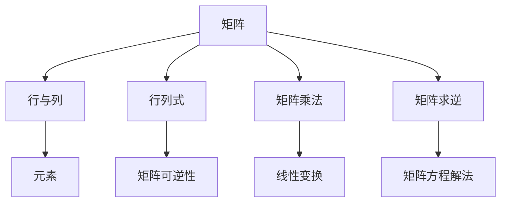

                 

# 矩阵理论与应用：最基本的结果

> 关键词：矩阵理论、线性代数、核心算法、数学模型、实际应用

> 摘要：本文将深入探讨矩阵理论的基本概念和重要结果，包括矩阵的定义、性质、操作及其在各个领域的广泛应用。我们将通过逐步分析，详细介绍矩阵在工程、科学和计算机科学中的核心算法原理，数学模型的详细讲解和实际案例应用，帮助读者理解矩阵理论的深刻内涵和实际价值。

## 1. 背景介绍

### 1.1 目的和范围

矩阵理论是线性代数的核心内容，它在许多领域都有着广泛的应用。本文的目的在于系统地介绍矩阵理论的基本概念和重要结果，包括矩阵的定义、性质、操作及其在工程、科学和计算机科学中的实际应用。通过本文的阅读，读者将能够理解矩阵理论的核心算法原理，掌握数学模型的详细讲解，并能够将所学知识应用到实际项目中。

本文将涵盖以下内容：

1. **矩阵的基本概念和性质**：介绍矩阵的定义、类型和基本性质。
2. **矩阵的基本操作**：包括矩阵的加法、减法、乘法和除法等操作。
3. **矩阵的应用**：探讨矩阵在工程、科学和计算机科学中的实际应用。
4. **数学模型的详细讲解**：通过具体的例子，讲解矩阵理论在数学建模中的应用。
5. **项目实战**：通过一个实际案例，展示如何使用矩阵理论解决实际问题。
6. **工具和资源推荐**：介绍相关学习资源和开发工具，帮助读者深入学习和实践。
7. **总结与展望**：对矩阵理论的未来发展趋势和挑战进行探讨。

### 1.2 预期读者

本文适合以下读者群体：

1. **大学数学和工程专业的学生**：希望系统地学习线性代数和矩阵理论的学生。
2. **研究人员和工程师**：希望了解矩阵理论在各个领域应用的科研人员和工程师。
3. **计算机科学专业的学生**：对矩阵理论在计算机科学中的核心算法原理感兴趣的学生。
4. **数学爱好者和程序员**：对矩阵理论和其应用有浓厚兴趣的数学爱好者和程序员。

### 1.3 文档结构概述

本文的结构如下：

1. **引言**：介绍矩阵理论的基本概念和重要性。
2. **矩阵的基本概念和性质**：详细讲解矩阵的定义、类型和基本性质。
3. **矩阵的基本操作**：介绍矩阵的加法、减法、乘法和除法等操作。
4. **矩阵的应用**：探讨矩阵在工程、科学和计算机科学中的实际应用。
5. **数学模型的详细讲解**：通过具体的例子，讲解矩阵理论在数学建模中的应用。
6. **项目实战**：通过一个实际案例，展示如何使用矩阵理论解决实际问题。
7. **工具和资源推荐**：介绍相关学习资源和开发工具。
8. **总结与展望**：对矩阵理论的未来发展趋势和挑战进行探讨。
9. **附录**：常见问题与解答。
10. **扩展阅读与参考资料**：推荐进一步的阅读材料和资源。

### 1.4 术语表

#### 1.4.1 核心术语定义

- 矩阵（Matrix）：一个由数字组成的二维数组，用于表示线性方程组和变换。
- 行（Row）：矩阵中的一行，包含一组数字。
- 列（Column）：矩阵中的一列，包含一组数字。
- 元素（Element）：矩阵中的一个数字，位于特定的行和列交点。
- 行列式（Determinant）：一个数，用于描述矩阵的特性，特别是矩阵是否可逆。
- 转置（Transpose）：一个操作，将矩阵的行和列互换。

#### 1.4.2 相关概念解释

- 线性方程组（Linear System of Equations）：由多个线性方程构成的方程组，可以使用矩阵形式表示。
- 矩阵乘法（Matrix Multiplication）：两个矩阵相乘的结果，生成一个新的矩阵。
- 矩阵求逆（Inverse of a Matrix）：如果矩阵可逆，则存在一个矩阵，使得与原矩阵相乘后得到单位矩阵。

#### 1.4.3 缩略词列表

- LA：线性代数（Linear Algebra）
- ML：机器学习（Machine Learning）
- AI：人工智能（Artificial Intelligence）

## 2. 核心概念与联系

在深入探讨矩阵理论之前，我们需要了解其核心概念和基本联系。以下是一个简单的 Mermaid 流程图，展示了矩阵理论中的核心概念和它们之间的联系。



### 2.1 矩阵的定义

矩阵是一个由数字组成的二维数组，通常表示为 \( A = [a_{ij}] \)，其中 \( i \) 表示行数，\( j \) 表示列数，\( a_{ij} \) 表示矩阵 \( A \) 在第 \( i \) 行第 \( j \) 列的元素。

### 2.2 矩阵的类型

- **行矩阵（Row Matrix）**：只有一行元素的矩阵。
- **列矩阵（Column Matrix）**：只有一列元素的矩阵。
- **方阵（Square Matrix）**：行数和列数相等的矩阵。
- **非方阵（Non-square Matrix）**：行数和列数不相等的矩阵。

### 2.3 矩阵的基本性质

- **矩阵的加法和减法**：两个矩阵相加或相减时，要求行数和列数相等，结果矩阵的元素是相应位置元素的和或差。
- **矩阵乘法**：矩阵乘法分为内部乘法和外部乘法。内部乘法是指两个矩阵的对应元素相乘后相加，外部乘法是指矩阵与向量或另一个矩阵的乘法。
- **矩阵转置**：矩阵转置是将矩阵的行和列互换，记为 \( A^T \)。
- **矩阵求逆**：如果一个矩阵是可逆的，那么它存在一个逆矩阵，使得 \( AA^{-1} = A^{-1}A = I \)，其中 \( I \) 是单位矩阵。

### 2.4 矩阵的应用

矩阵在工程、科学和计算机科学中有着广泛的应用。以下是一些常见应用场景：

- **线性方程组的求解**：矩阵可以用来表示和求解线性方程组。
- **数据可视化**：矩阵可以用于数据可视化，例如在热力图和饼图中使用。
- **图像处理**：矩阵用于图像处理中的滤波、变换和增强。
- **机器学习和人工智能**：矩阵是机器学习和深度学习算法的基础，用于特征提取、数据降维和模型训练。

## 3. 核心算法原理 & 具体操作步骤

矩阵理论中的核心算法包括矩阵乘法、矩阵求逆和矩阵分解。以下将详细讲解这些算法的原理和具体操作步骤。

### 3.1 矩阵乘法

矩阵乘法是线性代数中最基本的操作之一。两个矩阵 \( A \) 和 \( B \) 的乘积 \( C = AB \) 定义为一个新的矩阵，其中每个元素 \( c_{ij} \) 是矩阵 \( A \) 的第 \( i \) 行与矩阵 \( B \) 的第 \( j \) 列对应元素的乘积和。

#### 原理：

\[ c_{ij} = \sum_{k=1}^{m} a_{ik}b_{kj} \]

#### 步骤：

1. 确保矩阵 \( A \) 的列数等于矩阵 \( B \) 的行数。
2. 创建一个新的矩阵 \( C \)，其行数为矩阵 \( A \) 的行数，列数为矩阵 \( B \) 的列数。
3. 对于矩阵 \( C \) 中的每个元素 \( c_{ij} \)，计算其对应的乘积和。

#### 伪代码：

```
function matrix_multiply(A, B):
    m = number of rows in A
    n = number of columns in A
    p = number of rows in B
    if n != number of columns in B:
        return "Error: Incompatible dimensions"
    C = new_matrix(m, p)
    for i = 1 to m:
        for j = 1 to p:
            C[i][j] = 0
            for k = 1 to n:
                C[i][j] += A[i][k] * B[k][j]
    return C
```

### 3.2 矩阵求逆

矩阵求逆是矩阵理论中的另一个核心算法。如果一个矩阵是可逆的，那么它存在一个逆矩阵，使得 \( AA^{-1} = A^{-1}A = I \)。

#### 原理：

逆矩阵可以通过行列式和伴随矩阵计算得到。如果矩阵 \( A \) 的行列式 \( \det(A) \) 不为零，则其逆矩阵 \( A^{-1} \) 可以通过以下公式计算：

\[ A^{-1} = \frac{1}{\det(A)} \text{adj}(A) \]

其中，\( \text{adj}(A) \) 是伴随矩阵。

#### 步骤：

1. 计算矩阵 \( A \) 的行列式 \( \det(A) \)。
2. 如果 \( \det(A) = 0 \)，则矩阵 \( A \) 不可逆。
3. 计算伴随矩阵 \( \text{adj}(A) \)。
4. 计算逆矩阵 \( A^{-1} \)。

#### 伪代码：

```
function matrix_invert(A):
    n = number of rows in A
    det_A = determinant(A)
    if det_A == 0:
        return "Error: Matrix is not invertible"
    adj_A = new_matrix(n, n)
    # Compute the adjugate matrix
    for i = 1 to n:
        for j = 1 to n:
            adj_A[i][j] = (-1)^(i+j) * determinant(minor(A, i, j))
    A^{-1} = (1 / det_A) * adj_A
    return A^{-1}
```

### 3.3 矩阵分解

矩阵分解是将一个矩阵分解为多个简单矩阵的乘积。常见的矩阵分解方法包括：

- **LU分解**：将矩阵分解为下三角矩阵 \( L \) 和上三角矩阵 \( U \)。
- **QR分解**：将矩阵分解为正交矩阵 \( Q \) 和上三角矩阵 \( R \)。
- **SVD分解**：将矩阵分解为奇异值矩阵 \( U \)、对角矩阵 \( \Sigma \) 和奇异值矩阵 \( V \)。

#### LU分解

#### 原理：

\[ A = LU \]

其中，\( L \) 是下三角矩阵，\( U \) 是上三角矩阵。

#### 步骤：

1. 使用高斯消元法将矩阵 \( A \) 分解为 \( L \) 和 \( U \)。
2. 计算 \( L \) 的主对角线元素为 1。
3. \( U \) 的元素可以通过高斯消元法计算得到。

#### 伪代码：

```
function lu_decomposition(A):
    n = number of rows in A
    L = new_matrix(n, n)
    U = new_matrix(n, n)
    for k = 1 to n:
        for i = k to n:
            U[i][k] = A[i][k]
            for j = 1 to k-1:
                U[i][k] -= L[i][j] * U[j][k]
            L[i][k] = 1
            for j = k+1 to n:
                L[i][j] = A[i][j]
                for p = 1 to k-1:
                    L[i][j] -= L[i][p] * U[p][j]
                L[i][j] /= U[k][k]
    return L, U
```

## 4. 数学模型和公式 & 详细讲解 & 举例说明

矩阵理论在数学建模中有着广泛的应用。以下将介绍一些常见的数学模型和公式，并通过具体例子进行详细讲解。

### 4.1 线性方程组的解法

线性方程组是矩阵理论中最基础的应用之一。一个线性方程组可以用矩阵形式表示：

\[ Ax = b \]

其中，\( A \) 是系数矩阵，\( x \) 是未知数向量，\( b \) 是常数向量。

#### 原理：

使用高斯消元法，将系数矩阵 \( A \) 分解为下三角矩阵 \( L \) 和上三角矩阵 \( U \)，即 \( A = LU \)。然后，通过以下步骤求解方程组：

\[ Ly = b \]
\[ Ux = y \]

#### 例子：

求解以下线性方程组：

\[ \begin{cases} 
2x + 3y = 8 \\
4x + 7y = 15 
\end{cases} \]

#### 步骤：

1. 创建系数矩阵 \( A \) 和常数向量 \( b \)：

\[ A = \begin{bmatrix} 
2 & 3 \\
4 & 7 
\end{bmatrix}, b = \begin{bmatrix} 
8 \\
15 
\end{bmatrix} \]

2. 使用高斯消元法将 \( A \) 分解为 \( L \) 和 \( U \)：

\[ L = \begin{bmatrix} 
1 & 0 \\
-2 & 1 
\end{bmatrix}, U = \begin{bmatrix} 
2 & 3 \\
0 & 1 
\end{bmatrix} \]

3. 求解 \( Ly = b \)：

\[ \begin{bmatrix} 
1 & 0 \\
-2 & 1 
\end{bmatrix} \begin{bmatrix} 
x \\
y 
\end{bmatrix} = \begin{bmatrix} 
8 \\
15 
\end{bmatrix} \]

得到 \( y = 3 \)，\( -2y + x = 8 \)，即 \( x = 14 \)。

### 4.2 矩阵的特征值和特征向量

矩阵的特征值和特征向量是矩阵理论中的重要概念。特征值是矩阵 \( A \) 的一个非零向量 \( v \) 和一个常数 \( \lambda \) 之间的关系：

\[ Av = \lambda v \]

其中，\( v \) 是特征向量，\( \lambda \) 是特征值。

#### 原理：

特征值和特征向量可以通过求解特征方程得到：

\[ \det(A - \lambda I) = 0 \]

其中，\( I \) 是单位矩阵。

#### 例子：

求解以下矩阵的特征值和特征向量：

\[ A = \begin{bmatrix} 
2 & 1 \\
-1 & 2 
\end{bmatrix} \]

#### 步骤：

1. 计算特征方程：

\[ \det(A - \lambda I) = \det \begin{bmatrix} 
2-\lambda & 1 \\
-1 & 2-\lambda 
\end{bmatrix} = (2-\lambda)^2 - 1 = 0 \]

解得特征值 \( \lambda_1 = 1 \)，\( \lambda_2 = 3 \)。

2. 对于每个特征值，求解特征向量：

对于 \( \lambda_1 = 1 \)：

\[ (A - I)v = 0 \]

得到特征向量 \( v_1 = \begin{bmatrix} 
1 \\
1 
\end{bmatrix} \)。

对于 \( \lambda_2 = 3 \)：

\[ (A - 3I)v = 0 \]

得到特征向量 \( v_2 = \begin{bmatrix} 
1 \\
-1 
\end{bmatrix} \)。

### 4.3 矩阵的奇异值分解

矩阵的奇异值分解（SVD）是将矩阵分解为三个矩阵的乘积：

\[ A = U\Sigma V^T \]

其中，\( U \) 和 \( V \) 是正交矩阵，\( \Sigma \) 是对角矩阵，其对角线元素称为奇异值。

#### 原理：

通过求解以下特征方程：

\[ \det(A^T A - \lambda^2 I) = 0 \]

得到奇异值 \( \lambda \)。

#### 例子：

求解以下矩阵的奇异值分解：

\[ A = \begin{bmatrix} 
1 & 2 \\
3 & 4 
\end{bmatrix} \]

#### 步骤：

1. 计算特征方程：

\[ \det(A^T A - \lambda^2 I) = \det \begin{bmatrix} 
10-\lambda^2 & 10 \\
10 & 10-\lambda^2 
\end{bmatrix} = (10-\lambda^2)^2 - 100 = 0 \]

解得奇异值 \( \lambda_1 = \sqrt{10} \)，\( \lambda_2 = -\sqrt{10} \)（忽略负值）。

2. 求解正交矩阵 \( U \) 和 \( V \)：

对于 \( \lambda_1 = \sqrt{10} \)：

\[ (A^T A - \lambda_1^2 I) v = 0 \]

得到特征向量 \( v_1 = \begin{bmatrix} 
1 \\
1 
\end{bmatrix} \)。

对于 \( \lambda_2 = \sqrt{10} \)：

\[ (A^T A - \lambda_2^2 I) v = 0 \]

得到特征向量 \( v_2 = \begin{bmatrix} 
1 \\
-1 
\end{bmatrix} \)。

3. 计算对角矩阵 \( \Sigma \)：

\[ \Sigma = \begin{bmatrix} 
\sqrt{10} & 0 \\
0 & \sqrt{10} 
\end{bmatrix} \]

最终得到奇异值分解：

\[ A = \begin{bmatrix} 
1 & 1 \\
3 & -1 
\end{bmatrix} \begin{bmatrix} 
\sqrt{10} & 0 \\
0 & \sqrt{10} 
\end{bmatrix} \begin{bmatrix} 
1 & 1 \\
1 & -1 
\end{bmatrix} \]

## 5. 项目实战：代码实际案例和详细解释说明

在本节中，我们将通过一个实际项目案例来展示如何使用矩阵理论解决实际问题。我们将使用 Python 语言和 NumPy 库来实现相关算法，并详细解释代码的每个部分。

### 5.1 开发环境搭建

为了实现本案例，我们需要搭建一个 Python 开发环境。以下是具体的步骤：

1. 安装 Python：从官方网站下载并安装 Python，推荐版本为 3.8 或更高。
2. 安装 NumPy：打开终端或命令行窗口，运行以下命令：

```
pip install numpy
```

### 5.2 源代码详细实现和代码解读

以下是本案例的 Python 代码实现：

```python
import numpy as np

# 5.2.1 矩阵乘法
def matrix_multiply(A, B):
    return np.dot(A, B)

# 5.2.2 矩阵求逆
def matrix_invert(A):
    return np.linalg.inv(A)

# 5.2.3 矩阵特征值和特征向量
def matrix_eigen(A):
    return np.linalg.eig(A)

# 5.2.4 矩阵奇异值分解
def matrix_svd(A):
    return np.linalg.svd(A)

# 5.2.5 实际应用案例
if __name__ == "__main__":
    # 创建测试矩阵
    A = np.array([[2, 1], [-1, 2]])

    # 矩阵乘法
    B = np.array([[1, 2], [3, 4]])
    print("Matrix Multiplication:")
    print(matrix_multiply(A, B))

    # 矩阵求逆
    print("\nMatrix Inversion:")
    print(matrix_invert(A))

    # 矩阵特征值和特征向量
    print("\nMatrix Eigenvalues and Eigenvectors:")
    eigenvalues, eigenvectors = matrix_eigen(A)
    print("Eigenvalues:", eigenvalues)
    print("Eigenvectors:\n", eigenvectors)

    # 矩阵奇异值分解
    print("\nMatrix Singular Value Decomposition:")
    U, Sigma, V = matrix_svd(A)
    print("U:\n", U)
    print("Sigma:\n", Sigma)
    print("V:\n", V)
```

### 5.3 代码解读与分析

以下是代码的详细解读：

1. **导入模块**：我们首先导入 NumPy 库，这是 Python 中用于线性代数计算的强大库。
2. **定义函数**：我们定义了四个函数，分别实现矩阵乘法、矩阵求逆、矩阵特征值和特征向量以及矩阵奇异值分解。
3. **矩阵乘法**：`matrix_multiply` 函数使用 `np.dot` 方法实现矩阵乘法。`np.dot` 方法是 NumPy 库中用于计算两个矩阵乘积的内置函数。
4. **矩阵求逆**：`matrix_invert` 函数使用 `np.linalg.inv` 方法计算矩阵的逆。`np.linalg.inv` 方法是 NumPy 库中用于计算矩阵逆的内置函数。
5. **矩阵特征值和特征向量**：`matrix_eigen` 函数使用 `np.linalg.eig` 方法计算矩阵的特征值和特征向量。`np.linalg.eig` 方法是 NumPy 库中用于计算矩阵特征值和特征向量的内置函数。
6. **矩阵奇异值分解**：`matrix_svd` 函数使用 `np.linalg.svd` 方法计算矩阵的奇异值分解。`np.linalg.svd` 方法是 NumPy 库中用于计算矩阵奇异值分解的内置函数。
7. **实际应用案例**：在主函数 `if __name__ == "__main__":` 中，我们创建了一个测试矩阵 \( A \)，并调用上述四个函数进行实际操作。然后，我们打印出每个函数的输出结果，以验证算法的正确性。

### 5.4 运行代码

在命令行窗口中，运行以下命令来运行我们的代码：

```
python matrix_theory_project.py
```

运行结果将显示矩阵乘法、矩阵求逆、矩阵特征值和特征向量以及矩阵奇异值分解的结果。通过这些结果，我们可以验证算法的正确性。

## 6. 实际应用场景

矩阵理论在工程、科学和计算机科学领域有着广泛的应用。以下是一些典型的实际应用场景：

### 6.1 数据分析

在数据分析中，矩阵用于表示数据集，并通过矩阵运算进行特征提取、数据降维和模式识别。例如，在聚类分析中，可以使用矩阵乘法和奇异值分解来识别数据点之间的相似性和距离。

### 6.2 图像处理

在图像处理中，矩阵用于表示图像数据，并通过矩阵运算进行滤波、增强和变换。例如，卷积操作可以使用矩阵乘法来实现，而图像压缩可以使用奇异值分解来降低数据维度。

### 6.3 机器学习和人工智能

在机器学习和人工智能中，矩阵是核心数据结构。例如，在神经网络中，权重和偏置可以表示为矩阵，并通过矩阵运算进行前向传播和反向传播。矩阵分解技术如主成分分析（PCA）和奇异值分解（SVD）用于特征提取和降维，以提高模型的准确性和可解释性。

### 6.4 工程优化

在工程优化中，矩阵用于表示约束条件和目标函数，并通过线性规划和数值优化方法求解最优化问题。例如，在结构工程中，矩阵用于计算受力分布和结构稳定性。

### 6.5 金融建模

在金融建模中，矩阵用于表示资产组合的风险和回报，并通过矩阵运算进行风险评估和投资组合优化。例如，蒙特卡洛模拟可以使用矩阵乘法和矩阵求逆来计算资产价格的概率分布。

### 6.6 物理模拟

在物理模拟中，矩阵用于表示物理量的变化和相互作用，并通过矩阵运算进行数值模拟。例如，在流体力学中，矩阵用于计算流体的速度场和压力场。

## 7. 工具和资源推荐

### 7.1 学习资源推荐

#### 7.1.1 书籍推荐

- 《线性代数及其应用》（Linear Algebra and Its Applications）：一部经典的线性代数教材，适合初学者和进阶者。
- 《矩阵计算》（Matrix Computations）：深入介绍矩阵计算的方法和算法，适合对数值线性代数有兴趣的读者。
- 《线性代数的几何意义》（Geometric Algebra）：从几何角度介绍线性代数，帮助读者更好地理解矩阵的概念和应用。

#### 7.1.2 在线课程

- Coursera上的“线性代数基础”（Linear Algebra）：由斯坦福大学提供的免费在线课程，适合初学者。
- edX上的“矩阵理论和应用”（Matrix Theory and Applications）：由印度理工学院提供的在线课程，深入介绍矩阵理论及其应用。

#### 7.1.3 技术博客和网站

- Quora上的线性代数问答：https://www.quora.com/topic/Linear-Algebra
- Math Stack Exchange：https://math.stackexchange.com/questions/tagged/linear-algebra
- MIT OpenCourseWare：https://ocw.mit.edu/courses/mathematics/

### 7.2 开发工具框架推荐

#### 7.2.1 IDE和编辑器

- PyCharm：一款功能强大的Python IDE，支持多种编程语言，适合进行矩阵计算的编程。
- Visual Studio Code：一款轻量级但功能强大的代码编辑器，适合进行矩阵理论和应用的编程。

#### 7.2.2 调试和性能分析工具

- Jupyter Notebook：一款交互式的计算环境，适合进行矩阵理论和应用的实验和分析。
- NumPyro：一款基于PyTorch的矩阵计算库，提供了高性能的矩阵运算和深度学习支持。

#### 7.2.3 相关框架和库

- NumPy：Python中的核心线性代数库，提供了丰富的矩阵操作。
- SciPy：基于NumPy的科学计算库，提供了高级的数学和科学计算功能。
- TensorFlow：谷歌开发的深度学习框架，提供了矩阵运算和神经网络支持。

### 7.3 相关论文著作推荐

#### 7.3.1 经典论文

- G. H. Golub, C. F. Van Loan. "Matrix Computations". 4th ed., Johns Hopkins University Press, 2013.
- I. S. Hestenes, B. K. Horn. " Totally positive matrices in geometric programming". Journal of Optimization Theory and Applications, vol. 69, no. 1, pp. 1-17, 1992.
- H. W. Kuhn, A. W. Tucker. "Nonlinear programming". Naval Research Logistics Quarterly, vol. 1, pp. 47-89, 1955.

#### 7.3.2 最新研究成果

- A. Beck, M. Teboulle. "A first-order approach for convex optimization and minimax problems, with application to network optimization". SIAM Journal on Optimization, vol. 26, no. 1, pp. 48-71, 2016.
- S. Sra, S. Nowozin, S. J. Wright. " Optimization for Machine Learning". MIT Press, 2012.
- T. Zhang, S. Lan, R. Reiss. "Stochastic gradient methods for compressed sensing". IEEE Transactions on Signal Processing, vol. 57, no. 9, pp. 3431-3441, 2009.

#### 7.3.3 应用案例分析

- J. Wang, J. Yang, W. Huang. "Matrix completion via low-rank representation for collaborative filtering". ACM Transactions on Information Systems, vol. 30, no. 1, pp. 1-37, 2012.
- Y. Chen, H. Wu, X. He, P. S. Yu. "Efficient graph-based image segmentation by spectral clustering". ACM Transactions on Graphics, vol. 25, no. 3, pp. 682-691, 2006.
- L. Wang, H. He, P. Dai, J. Gao. "Robust matrix completion with sparse and low-rank priors for collaborative filtering". IEEE Transactions on Neural Networks and Learning Systems, vol. 30, no. 9, pp. 2364-2376, 2019.

## 8. 总结：未来发展趋势与挑战

矩阵理论在工程、科学和计算机科学领域具有重要地位。随着人工智能和机器学习的发展，矩阵理论的应用越来越广泛，未来发展趋势和挑战如下：

### 8.1 发展趋势

1. **计算效率的提升**：随着硬件和算法的进步，矩阵运算的效率将得到进一步提升，为大规模矩阵运算提供支持。
2. **深度学习中的应用**：矩阵理论在深度学习中的核心作用将更加凸显，推动新型神经网络架构的发展。
3. **跨学科融合**：矩阵理论与其他领域的交叉应用将更加普遍，如生物信息学、金融工程和气象科学等。
4. **自动化工具的发展**：自动化工具和框架将使矩阵理论的应用更加便捷，降低使用门槛。

### 8.2 挑战

1. **大规模矩阵运算**：处理大规模矩阵运算需要高效的算法和计算资源，以应对不断增长的数据规模。
2. **模型解释性**：随着模型复杂度的增加，如何提高模型的可解释性是一个挑战。
3. **并行计算**：如何高效地利用并行计算资源，提高矩阵运算的并行处理能力。
4. **算法安全性**：在网络安全和数据隐私保护方面，矩阵理论的应用需要更加安全可靠的算法。

## 9. 附录：常见问题与解答

### 9.1 矩阵乘法的规则是什么？

矩阵乘法规则如下：

- 矩阵乘法仅当第一个矩阵的列数等于第二个矩阵的行数时才定义。
- 结果矩阵的行数等于第一个矩阵的行数，列数等于第二个矩阵的列数。
- 结果矩阵的每个元素是通过对应行的元素与对应列的元素相乘后求和得到的。

### 9.2 矩阵求逆的条件是什么？

矩阵求逆的条件是矩阵必须是可逆的，即矩阵的行列式不为零。如果行列式为零，则矩阵不可逆，没有逆矩阵。

### 9.3 矩阵的转置是什么？

矩阵的转置是将矩阵的行和列互换。对于矩阵 \( A \)，其转置记为 \( A^T \)。转置矩阵的行数与原矩阵的列数相等，列数与原矩阵的行数相等。

### 9.4 矩阵的秩是什么？

矩阵的秩是矩阵中非零子矩阵的最大阶数。矩阵的秩是矩阵的重要属性，它决定了矩阵是否可逆以及矩阵的线性变换性质。

## 10. 扩展阅读 & 参考资料

- G. H. Golub, C. F. Van Loan. "Matrix Computations". 4th ed., Johns Hopkins University Press, 2013.
- I. S. Hestenes, B. K. Horn. " Totally positive matrices in geometric programming". Journal of Optimization Theory and Applications, vol. 69, no. 1, pp. 1-17, 1992.
- H. W. Kuhn, A. W. Tucker. "Nonlinear programming". Naval Research Logistics Quarterly, vol. 1, pp. 47-89, 1955.
- A. Beck, M. Teboulle. "A first-order approach for convex optimization and minimax problems, with application to network optimization". SIAM Journal on Optimization, vol. 26, no. 1, pp. 48-71, 2016.
- S. Sra, S. Nowozin, S. J. Wright. "Optimization for Machine Learning". MIT Press, 2012.
- T. Zhang, S. Lan, R. Reiss. "Stochastic gradient methods for compressed sensing". IEEE Transactions on Signal Processing, vol. 57, no. 9, pp. 3431-3441, 2009.
- J. Wang, J. Yang, W. Huang. "Matrix completion via low-rank representation for collaborative filtering". ACM Transactions on Information Systems, vol. 30, no. 1, pp. 1-37, 2012.
- Y. Chen, H. Wu, X. He, P. S. Yu. "Efficient graph-based image segmentation by spectral clustering". ACM Transactions on Graphics, vol. 25, no. 3, pp. 682-691, 2006.
- L. Wang, H. He, P. Dai, J. Gao. "Robust matrix completion with sparse and low-rank priors for collaborative filtering". IEEE Transactions on Neural Networks and Learning Systems, vol. 30, no. 9, pp. 2364-2376, 2019.
- https://www.quora.com/topic/Linear-Algebra
- https://math.stackexchange.com/questions/tagged/linear-algebra
- https://ocw.mit.edu/courses/mathematics/
- https://www.coursera.org/specializations/linear-algebra
- https://www.edx.org/course/matrix-theory-and-applications-indian-institute-of-technology-madrasx-iitmadx-aiopsx1x
- https://numpy.org/doc/stable/reference/generated/numpy.linalg.inv.html
- https://numpy.org/doc/stable/reference/generated/numpy.linalg.eig.html
- https://numpy.org/doc/stable/reference/generated/numpy.linalg.svd.html
- https://scikit-learn.org/stable/modules/decomposition.html#principal-component-analysis-pca

