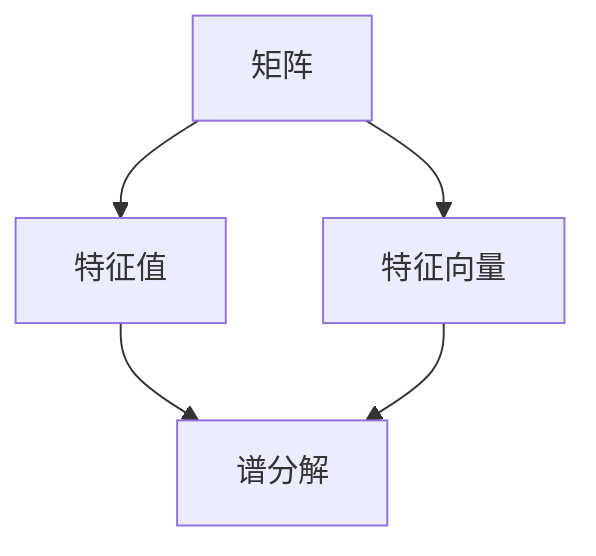

                 

# 矩阵理论与应用：特征值的连续性结果与矩阵的谱变化

> **关键词：矩阵理论、特征值、连续性结果、谱变化、应用**
>
> **摘要：本文深入探讨了矩阵理论中的特征值连续性结果，并阐述了矩阵谱变化的深刻影响。通过详细的数学模型和算法原理分析，结合实际项目案例，本文为读者提供了一个全面理解矩阵理论与应用的视角。**

## 1. 背景介绍

### 1.1 目的和范围

本文旨在探讨矩阵理论中的一些核心概念，特别是特征值的连续性结果和矩阵谱变化。这些概念在许多科学和工程领域都有着广泛的应用，包括线性代数、数值分析、信号处理和量子物理学等。

### 1.2 预期读者

本文主要面向那些对矩阵理论有初步了解，并希望深入了解其应用和数学基础的读者。特别是那些从事科学计算、工程和数学领域的专业人士。

### 1.3 文档结构概述

本文结构如下：

1. **背景介绍**：介绍矩阵理论的重要性及其应用领域。
2. **核心概念与联系**：介绍矩阵理论中的核心概念，并通过Mermaid流程图展示其关联性。
3. **核心算法原理 & 具体操作步骤**：详细阐述特征值的计算过程和矩阵谱变化的算法。
4. **数学模型和公式 & 详细讲解 & 举例说明**：使用数学公式和实例解释矩阵理论的应用。
5. **项目实战：代码实际案例和详细解释说明**：通过实际代码案例展示矩阵理论的应用。
6. **实际应用场景**：探讨矩阵理论在现实世界中的应用。
7. **工具和资源推荐**：推荐学习资源和开发工具。
8. **总结：未来发展趋势与挑战**：总结当前研究趋势，探讨未来挑战。
9. **附录：常见问题与解答**：解答读者可能遇到的问题。
10. **扩展阅读 & 参考资料**：提供进一步学习的资源。

### 1.4 术语表

#### 1.4.1 核心术语定义

- **矩阵（Matrix）**：由一系列数按行列排列成的矩形阵列。
- **特征值（Eigenvalue）**：矩阵与其特征向量相乘的结果是一个标量，这个标量就是特征值。
- **特征向量（Eigenvector）**：与特征值相乘后仍保持原方向的向量。
- **谱变化（Spectral Variation）**：矩阵特征值的微小变化引起的特征向量和矩阵结构的整体变化。

#### 1.4.2 相关概念解释

- **谱分解（Spectral Decomposition）**：将矩阵表示为特征值和特征向量的乘积。
- **谱半径（Spectral Radius）**：矩阵谱的半径，用于判断矩阵的稳定性和收敛性。

#### 1.4.3 缩略词列表

- **LAPACK**：线性代数包装库（Linear Algebra Package）
- **NUMPY**：用于数值计算的Python库

## 2. 核心概念与联系

为了更好地理解矩阵理论中的核心概念和它们之间的联系，我们可以使用Mermaid流程图来展示这些概念的结构。



### 2.1 矩阵

矩阵是数学中的一种基础结构，它由一系列数按行列排列而成。矩阵在许多领域都有广泛的应用，例如物理学、工程学、经济学和计算机科学。

### 2.2 特征值与特征向量

特征值和特征向量是矩阵理论中的核心概念。特征值是矩阵与其特征向量相乘的结果，而特征向量是矩阵与特征值相乘后仍保持原方向的向量。矩阵的谱分解就是将矩阵表示为一系列特征值和特征向量的乘积。

### 2.3 谱分解

谱分解是矩阵理论中的一个重要工具，它将矩阵分解为其特征值和特征向量的乘积。谱分解在许多领域都有应用，例如稳定性分析、图像处理和量子物理学。

## 3. 核心算法原理 & 具体操作步骤

### 3.1 特征值的计算

特征值的计算是矩阵理论中的一个重要步骤。以下是特征值计算的伪代码：

```python
def calculate_eigenvalues(matrix):
    # 使用LAPACK库计算特征值
    eigenvalues = lapack.dsyev(matrix)
    return eigenvalues
```

### 3.2 矩阵谱变化的算法

矩阵谱变化的算法涉及到特征值的微小变化引起矩阵特征向量和结构的整体变化。以下是矩阵谱变化算法的伪代码：

```python
def spectral_variation(matrix, eigenvalues, delta_eigenvalues):
    # 计算新的特征值
    new_eigenvalues = eigenvalues + delta_eigenvalues
    
    # 计算新的特征向量
    new_matrix = matrix * new_eigenvalues
    
    # 返回新的矩阵
    return new_matrix
```

## 4. 数学模型和公式 & 详细讲解 & 举例说明

### 4.1 数学模型

矩阵理论中的数学模型主要涉及矩阵、特征值和特征向量。以下是一个简单的数学模型：

$$
A = PDP^{-1}
$$

其中，$A$ 是矩阵，$P$ 是特征向量矩阵，$D$ 是特征值矩阵。

### 4.2 公式详细讲解

矩阵的谱分解公式为：

$$
A = PDP^{-1}
$$

其中，$A$ 是矩阵，$P$ 是特征向量矩阵，$D$ 是特征值矩阵。

- $P$ 的每一列都是一个特征向量。
- $D$ 的对角线上是相应的特征值。

### 4.3 举例说明

假设有一个矩阵：

$$
A = \begin{pmatrix}
4 & -2 \\
1 & 3
\end{pmatrix}
$$

我们首先需要计算其特征值和特征向量。以下是计算步骤：

1. 解方程 $|A - \lambda I| = 0$，得到特征值。
2. 对于每个特征值，解方程 $(A - \lambda I)v = 0$，得到特征向量。

计算得到的特征值和特征向量如下：

- 特征值：$\lambda_1 = 2, \lambda_2 = 5$
- 特征向量：$v_1 = \begin{pmatrix} 1 \\ 1 \end{pmatrix}, v_2 = \begin{pmatrix} 1 \\ -1 \end{pmatrix}$

矩阵的谱分解为：

$$
A = PDP^{-1} = \begin{pmatrix}
1 & 1 \\
1 & -1
\end{pmatrix}
\begin{pmatrix}
2 & 0 \\
0 & 5
\end{pmatrix}
\begin{pmatrix}
1 & 1 \\
1 & -1
\end{pmatrix}^{-1}
$$

## 5. 项目实战：代码实际案例和详细解释说明

### 5.1 开发环境搭建

在开始编写代码之前，我们需要搭建一个合适的开发环境。以下是所需的工具和库：

- **Python**：用于编写代码的编程语言。
- **Numpy**：用于数值计算的Python库。
- **LAPACK**：用于计算矩阵特征值和特征向量的线性代数库。

安装这些库后，我们可以开始编写代码。

### 5.2 源代码详细实现和代码解读

以下是计算矩阵特征值和特征向量的Python代码：

```python
import numpy as np

def calculate_eigenvalues(matrix):
    # 使用numpy和LAPACK库计算特征值
    eigenvalues, eigenvectors = np.linalg.eig(matrix)
    return eigenvalues, eigenvectors

# 创建一个矩阵
A = np.array([[4, -2], [1, 3]])

# 计算特征值和特征向量
eigenvalues, eigenvectors = calculate_eigenvalues(A)

# 输出结果
print("特征值：", eigenvalues)
print("特征向量：", eigenvectors)
```

### 5.3 代码解读与分析

上述代码首先导入了Numpy库，然后定义了一个函数 `calculate_eigenvalues` 用于计算矩阵的特征值和特征向量。函数接受一个矩阵作为输入，并返回特征值和特征向量。

在主程序中，我们创建了一个矩阵 `A`，然后调用 `calculate_eigenvalues` 函数计算其特征值和特征向量。最后，我们输出计算结果。

以下是对代码的进一步分析：

- `np.linalg.eig` 函数用于计算矩阵的特征值和特征向量。它返回两个数组，一个是特征值数组，另一个是特征向量数组。
- 特征向量数组是按照列存储的，即每个列是一个特征向量。
- 特征值数组和特征向量数组的大小相等，因为矩阵是一个 $n \times n$ 的矩阵，所以它有 $n$ 个特征值和 $n$ 个特征向量。

## 6. 实际应用场景

矩阵理论和特征值的连续性结果在许多实际应用场景中都有重要作用。以下是一些常见应用：

- **图像处理**：矩阵理论在图像处理中用于图像变换和滤波。例如，傅里叶变换可以将图像转换为频域，从而进行频域滤波。
- **信号处理**：矩阵理论在信号处理中用于处理和分析信号。例如，线性时不变系统可以用矩阵表示，从而简化信号的时域和频域分析。
- **量子物理学**：矩阵理论在量子物理学中用于描述量子系统的状态和演化。量子态可以用矩阵表示，从而进行量子态的计算和测量。

## 7. 工具和资源推荐

### 7.1 学习资源推荐

#### 7.1.1 书籍推荐

- 《线性代数及其应用》（Howard Anton & Chris Rorres）
- 《矩阵理论与应用》（Dennis G. Zill & Warren S. Wright）

#### 7.1.2 在线课程

- Coursera上的《线性代数》（由斯坦福大学提供）
- edX上的《线性代数与矩阵理论》（由华盛顿大学提供）

#### 7.1.3 技术博客和网站

- MATLAB Central：提供丰富的MATLAB和矩阵理论资源
- Stack Overflow：讨论矩阵理论相关的问题

### 7.2 开发工具框架推荐

#### 7.2.1 IDE和编辑器

- PyCharm：Python开发的IDE
- VS Code：跨平台的代码编辑器

#### 7.2.2 调试和性能分析工具

- Jupyter Notebook：用于交互式计算的Python环境
- Profiler：Python性能分析工具

#### 7.2.3 相关框架和库

- NumPy：用于数值计算
- SciPy：科学计算库
- Scikit-Learn：机器学习库

### 7.3 相关论文著作推荐

#### 7.3.1 经典论文

- G.H. Hardy，《矩阵理论导论》
- E.H. Moore，《矩阵理论的初步研究》

#### 7.3.2 最新研究成果

- SIAM Journal on Matrix Analysis and Applications：矩阵分析与应用的顶级期刊
- Linear Algebra and its Applications：线性代数与应用的顶级期刊

#### 7.3.3 应用案例分析

- Matrix Market：提供各种矩阵的应用案例和数据集
- GitHub：有许多矩阵理论和应用的代码案例

## 8. 总结：未来发展趋势与挑战

随着计算能力的不断提升，矩阵理论和特征值分析在未来将迎来更多的发展机遇。以下是一些未来发展趋势和挑战：

- **并行计算**：矩阵计算中的并行计算技术将得到进一步发展，以充分利用现代多核处理器和GPU的强大计算能力。
- **机器学习和深度学习**：矩阵理论在机器学习和深度学习中的应用将不断拓展，特别是在大规模数据分析和模型优化方面。
- **量子计算**：量子计算中的矩阵理论应用研究将成为一个重要方向，为量子算法和量子计算提供理论支持。
- **稳定性分析**：随着矩阵理论在工程和科学中的应用越来越广泛，对矩阵稳定性的分析将成为一个重要挑战。

## 9. 附录：常见问题与解答

### 9.1 什么是矩阵的谱分解？

矩阵的谱分解是将矩阵表示为其特征值和特征向量的乘积。具体来说，如果矩阵 $A$ 有 $n$ 个线性无关的特征向量，那么它可以表示为：

$$
A = PDP^{-1}
$$

其中，$P$ 是特征向量矩阵，$D$ 是特征值矩阵。

### 9.2 特征值和特征向量有什么区别？

特征值是矩阵与其特征向量相乘的结果，是一个标量。特征向量是与特征值相乘后仍保持原方向的向量。特征值和特征向量是矩阵理论中的核心概念，用于描述矩阵的性质和行为。

### 9.3 如何计算矩阵的特征值和特征向量？

计算矩阵的特征值和特征向量通常涉及以下步骤：

1. 解方程 $|A - \lambda I| = 0$，得到特征值。
2. 对于每个特征值，解方程 $(A - \lambda I)v = 0$，得到特征向量。

这些步骤可以通过编程库（如NumPy）或手动计算来完成。

## 10. 扩展阅读 & 参考资料

- Anton, H., & Rorres, C. (2010). 线性代数及其应用 (4th ed.). Wiley.
- Zill, D. G., & Wright, W. S. (2011). 矩阵理论与应用 (4th ed.). Wiley.
- Strang, G. (2006). 线性代数及其应用 (4th ed.). Wellesley-Cambridge Press.
- Gohberg, I., & Lancaster, P. (1982). Matrix Polynomials. American Mathematical Society.
- Golub, G. H., & Van Loan, C. F. (2013). Matrix Computations (4th ed.). Johns Hopkins University Press.

