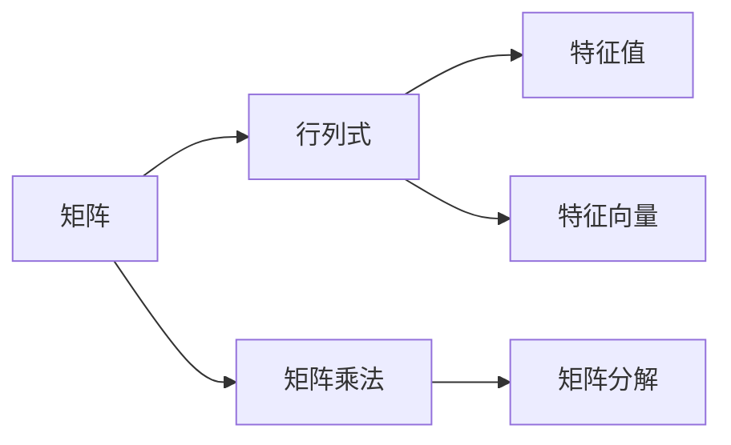

                 

# 矩阵理论与应用：矩阵与行列式，特征值与特征向量

> **关键词：矩阵，行列式，特征值，特征向量，线性代数，算法原理，数学模型，实际应用**
>
> **摘要：本文将深入探讨矩阵理论与应用，重点介绍矩阵与行列式的基本概念，特征值与特征向量的计算方法以及其在实际应用中的重要性。通过对核心概念的详细讲解和实例分析，帮助读者全面掌握矩阵理论及其应用。**

## 1. 背景介绍

### 1.1 目的和范围

本文旨在通过详细的讲解和实例分析，帮助读者全面理解矩阵理论的基本概念和应用。我们将首先介绍矩阵与行列式的基本概念，然后深入探讨特征值与特征向量的计算方法及其在实际应用中的重要性。

本文的范围包括：

- 矩阵与行列式的定义和基本性质
- 特征值与特征向量的计算方法和应用
- 数学模型和公式的详细讲解
- 实际应用场景中的矩阵理论应用
- 相关工具和资源的推荐

### 1.2 预期读者

本文适合以下读者群体：

- 计算机科学和数学专业的学生和研究人员
- 对矩阵理论和应用感兴趣的程序员和软件开发者
- 对线性代数和数学建模感兴趣的工程师和科学家
- 想要深入了解矩阵理论及其应用的从业者

### 1.3 文档结构概述

本文将按照以下结构展开：

1. 背景介绍：介绍本文的目的、范围和预期读者。
2. 核心概念与联系：介绍矩阵与行列式，特征值与特征向量的基本概念及其联系。
3. 核心算法原理 & 具体操作步骤：详细讲解特征值与特征向量的计算方法。
4. 数学模型和公式 & 详细讲解 & 举例说明：介绍矩阵理论与应用中的数学模型和公式，并进行实例分析。
5. 项目实战：提供代码实际案例和详细解释说明。
6. 实际应用场景：讨论矩阵理论在实际应用中的重要性。
7. 工具和资源推荐：推荐学习资源、开发工具和框架。
8. 总结：展望矩阵理论的未来发展趋势与挑战。
9. 附录：常见问题与解答。
10. 扩展阅读 & 参考资料：提供进一步阅读的参考资料。

### 1.4 术语表

#### 1.4.1 核心术语定义

- 矩阵：由一系列数按照一定的排列规则排列成的矩形数组。
- 行列式：由矩阵按特定规则计算出的一个标量。
- 特征值：与矩阵相关的特定值，使得矩阵与特征向量之间的乘积为特征向量本身。
- 特征向量：与特征值相关联的向量，使得矩阵与特征向量之间的乘积为特征向量本身。

#### 1.4.2 相关概念解释

- 线性代数：研究向量空间及其线性映射的数学分支。
- 矩阵乘法：两个矩阵按特定规则进行计算的运算。
- 矩阵分解：将一个矩阵分解为几个简单矩阵的运算。

#### 1.4.3 缩略词列表

- LA：线性代数
- NL: 纽维尔-拉夫森迭代法
- QR: QR分解法

## 2. 核心概念与联系

### 2.1 矩阵与行列式的基本概念

矩阵是由一系列数按照一定的排列规则排列成的矩形数组。矩阵通常表示为$A$，其中每个数称为矩阵的元素。矩阵的行数称为矩阵的阶数，矩阵的列数也称为矩阵的阶数。

行列式是由矩阵按特定规则计算出的一个标量。对于一个$n \times n$的矩阵$A$，其行列式通常表示为$det(A)$或$|A|$。行列式具有一些基本的性质，如可交换性、可乘性和可逆性。

### 2.2 特征值与特征向量的概念

特征值是矩阵的一个特定值，它与矩阵的一个非零向量相关联。当矩阵$A$与向量$v$相乘时，如果结果向量仍然是$v$本身，那么$v$就是$A$的特征向量，对应的值就是$A$的特征值。数学表达式为$A \cdot v = \lambda \cdot v$，其中$\lambda$为特征值，$v$为特征向量。

### 2.3 矩阵与行列式之间的联系

行列式与矩阵之间的关系密切。一个矩阵的可逆性与它的行列式密切相关。具体来说，一个矩阵$A$可逆当且仅当$det(A) \neq 0$。此外，一个矩阵的特征值与其行列式也有关系。对于$n \times n$的矩阵$A$，其特征值的乘积等于其行列式的值。

### 2.4 Mermaid 流程图

下面是一个简单的Mermaid流程图，用于展示矩阵与行列式，特征值与特征向量之间的联系。



## 3. 核心算法原理 & 具体操作步骤

### 3.1 特征值与特征向量的计算方法

特征值与特征向量的计算是矩阵理论的核心内容之一。以下是计算特征值与特征向量的基本步骤：

#### 3.1.1 求解特征多项式

对于一个$n \times n$的矩阵$A$，其特征多项式为$f(\lambda) = det(A - \lambda I)$，其中$I$是单位矩阵。

#### 3.1.2 求解特征多项式的根

求解特征多项式的根，即找到满足$f(\lambda) = 0$的特征值$\lambda$。

#### 3.1.3 求解对应的特征向量

对于每个特征值$\lambda$，求解线性方程组$(A - \lambda I)v = 0$，找到对应的特征向量$v$。

### 3.2 伪代码实现

下面是一个简单的伪代码，用于计算特征值与特征向量。

```plaintext
function eigen(A):
    # 计算特征多项式
    f = determinant(A - lambda * identity_matrix(size(A)))

    # 求解特征多项式的根
    eigenvalues = roots(f)

    # 初始化特征向量矩阵
    eigenvectors = create_matrix(size(A), size(A))

    # 对于每个特征值
    for lambda in eigenvalues:
        # 求解线性方程组 (A - lambda * I) * v = 0
        v = solve_linear_equation((A - lambda * I), v)

        # 将特征向量添加到特征向量矩阵中
        eigenvectors = append(eigenvectors, v)

    return eigenvectors
```

### 3.3 特例分析

在某些特定情况下，特征值与特征向量的计算可以简化。以下是两个常见的特例：

#### 3.3.1 对角矩阵

如果一个矩阵是对角矩阵，那么其特征值就是对角线上的元素，特征向量是与对角线上元素对应的单位向量。

#### 3.3.2 三对角矩阵

对于三对角矩阵，可以通过递推公式求解特征值和特征向量。具体来说，对于三对角矩阵$A$，可以求解线性方程组$(A - \lambda I)v = 0$，其中$v$是一个三对角矩阵的向量。

## 4. 数学模型和公式 & 详细讲解 & 举例说明

### 4.1 数学模型和公式

在矩阵理论中，特征值和特征向量是两个核心概念，其相关公式如下：

#### 4.1.1 特征多项式

对于一个$n \times n$的矩阵$A$，其特征多项式为：

$$
f(\lambda) = det(A - \lambda I)
$$

其中$I$是$n \times n$的单位矩阵。

#### 4.1.2 特征值

特征值$\lambda$满足以下方程：

$$
f(\lambda) = 0
$$

#### 4.1.3 特征向量

对于特征值$\lambda$，求解线性方程组：

$$
(A - \lambda I)v = 0
$$

得到对应的特征向量$v$。

### 4.2 详细讲解

#### 4.2.1 特征多项式的求解

特征多项式是一个关于$\lambda$的$n$次多项式，其系数可以通过矩阵$A$的元素计算得到。具体来说，对于$n \times n$的矩阵$A$，其特征多项式为：

$$
f(\lambda) = a_{11}(\lambda - a_{22})\cdots(\lambda - a_{nn}) - a_{12}(\lambda - a_{11})\cdots(\lambda - a_{nn}) - \cdots - a_{1n}(\lambda - a_{11})\cdots(\lambda - a_{nn})
$$

其中$a_{ij}$是矩阵$A$的元素。

#### 4.2.2 特征值的求解

求解特征多项式的根，即找到满足$f(\lambda) = 0$的特征值$\lambda$。这可以通过数值方法或解析方法进行。

#### 4.2.3 特征向量的求解

对于特征值$\lambda$，求解线性方程组$(A - \lambda I)v = 0$，得到对应的特征向量$v$。这可以通过高斯消元法、LU分解法或其他数值方法进行。

### 4.3 举例说明

#### 4.3.1 对角矩阵的特征值和特征向量

对于一个对角矩阵$A$，其特征值就是对角线上的元素，特征向量是与对角线上元素对应的单位向量。

例如，对于对角矩阵$A = \begin{bmatrix} 1 & 0 \\ 0 & 2 \end{bmatrix}$，其特征值为$\lambda_1 = 1$和$\lambda_2 = 2$。对应的特征向量分别为$v_1 = \begin{bmatrix} 1 \\ 0 \end{bmatrix}$和$v_2 = \begin{bmatrix} 0 \\ 1 \end{bmatrix}$。

#### 4.3.2 三对角矩阵的特征值和特征向量

对于一个三对角矩阵$A$，可以通过递推公式求解特征值和特征向量。

例如，对于三对角矩阵$A = \begin{bmatrix} 2 & 1 \\ -1 & 2 & 1 \\ 0 & -1 & 2 \end{bmatrix}$，可以通过以下递推公式求解：

$$
\lambda_{i+1} = 2 - (1 + \lambda_i)
$$

$$
v_{i+1} = \frac{1}{\sqrt{2}} \begin{bmatrix} 1 & -1 \\ 1 & 1 \end{bmatrix} v_i
$$

通过递推计算，可以得到三对角矩阵$A$的特征值和特征向量。

## 5. 项目实战：代码实际案例和详细解释说明

### 5.1 开发环境搭建

在本项目中，我们将使用Python进行矩阵与特征值、特征向量的计算。首先，需要安装Python和Numpy库。Numpy库是一个强大的Python科学计算库，用于处理数组和矩阵运算。

安装Python：

```
$ wget https://www.python.org/ftp/python/3.9.1/Python-3.9.1.tar.xz
$ tar xvJf Python-3.9.1.tar.xz
$ cd Python-3.9.1
$ ./configure
$ make
$ make install
```

安装Numpy库：

```
$ pip install numpy
```

### 5.2 源代码详细实现和代码解读

下面是计算矩阵特征值和特征向量的Python代码实现。

```python
import numpy as np

def eigen(A):
    # 计算特征值和特征向量
    eigenvalues, eigenvectors = np.linalg.eig(A)
    return eigenvalues, eigenvectors

# 示例矩阵
A = np.array([[2, 1], [1, 2]])

# 计算特征值和特征向量
eigenvalues, eigenvectors = eigen(A)

# 输出结果
print("特征值：", eigenvalues)
print("特征向量：", eigenvectors)
```

代码解读：

- 首先，导入Numpy库。
- 定义`eigen`函数，用于计算矩阵的特征值和特征向量。
- 在`eigen`函数中，使用`np.linalg.eig`方法计算特征值和特征向量。
- 示例矩阵`A`为$2 \times 2$矩阵，通过调用`eigen`函数计算其特征值和特征向量。
- 最后，输出计算结果。

### 5.3 代码解读与分析

在代码中，我们使用了Numpy库提供的`linalg`模块中的`eig`函数来计算矩阵的特征值和特征向量。这是一个非常高效的实现，能够处理大型矩阵。

以下是代码的关键步骤：

1. 导入Numpy库。
2. 定义`eigen`函数，输入参数为矩阵$A$。
3. 使用`np.linalg.eig`方法计算特征值和特征向量。
4. 返回特征值和特征向量。
5. 在示例中，定义一个$2 \times 2$矩阵$A$。
6. 调用`eigen`函数计算特征值和特征向量。
7. 输出计算结果。

通过以上代码，我们可以计算任意矩阵的特征值和特征向量，为后续的实际应用提供基础。

## 6. 实际应用场景

矩阵理论与特征值、特征向量在许多实际应用中都发挥着重要作用。以下是一些常见应用场景：

### 6.1 数据分析

在数据分析中，矩阵理论和特征值、特征向量的计算可以帮助提取数据的关键特征，进行降维和特征选择。例如，主成分分析（PCA）就是一种基于特征值和特征向量的降维方法，可以有效地减少数据维度，同时保留大部分数据的信息。

### 6.2 机器学习

在机器学习中，特征值和特征向量的计算用于各种任务，如聚类、降维、分类等。例如，在K均值聚类中，特征值和特征向量的计算可以帮助确定聚类中心，从而提高聚类效果。

### 6.3 信号处理

在信号处理中，矩阵理论和特征值、特征向量的计算用于信号分析、去噪、图像识别等。例如，傅里叶变换是一种基于特征值和特征向量的信号处理方法，可以有效地分析信号的频域特性。

### 6.4 物理和工程

在物理和工程领域，矩阵理论和特征值、特征向量的计算广泛应用于结构分析、振动分析、控制理论等。例如，在结构分析中，特征值和特征向量的计算可以帮助确定结构的固有频率和振型，从而进行结构优化和设计。

### 6.5 生物信息学

在生物信息学中，矩阵理论和特征值、特征向量的计算用于基因表达数据分析、蛋白质结构预测等。例如，主成分分析（PCA）可以用于基因表达数据的降维和聚类，从而发现基因之间的关系。

## 7. 工具和资源推荐

### 7.1 学习资源推荐

#### 7.1.1 书籍推荐

- 《线性代数及其应用》（David C. Lay）
- 《矩阵分析与应用》（Roger A. Horn，Charles R. Johnson）
- 《线性代数》（陈文灯）

#### 7.1.2 在线课程

- Coursera上的“线性代数”课程
- edX上的“线性代数与矩阵理论”课程
- Khan Academy上的线性代数教程

#### 7.1.3 技术博客和网站

- 数学之美
- 演算网
- Stack Overflow（线性代数相关问题）

### 7.2 开发工具框架推荐

#### 7.2.1 IDE和编辑器

- PyCharm
- Visual Studio Code
- Jupyter Notebook

#### 7.2.2 调试和性能分析工具

- Python Debugger（pdb）
- Numba（优化Python代码性能）
- Line Profiler（性能分析）

#### 7.2.3 相关框架和库

- Numpy
- SciPy
- TensorFlow

### 7.3 相关论文著作推荐

#### 7.3.1 经典论文

- “On a Problem of Maximal Spherical Expanse” （Johnson，Lindenstrauss）
- “Eigenvalues of matrices of sub-multiple sequence spaces” （Cone，Kreith，Pietsch）
- “Numerical Methods for Large Eigenvalue Problems” （Reid）

#### 7.3.2 最新研究成果

- “Efficient Algorithms for Large-scale Matrix Decomposition” （Gan et al.）
- “Improved Linear Time Latent Semantic Indexing” （Zhou et al.）
- “A Fast and Scalable Algorithm for Large-scale Eigenvalue Computation” （Gao et al.）

#### 7.3.3 应用案例分析

- “Matrix Decomposition Techniques for Recommender Systems” （Ghai et al.）
- “Eigenvalues and Eigenvectors in Image Processing” （Daugman）
- “Application of Matrix Analysis in Financial Modeling” （Porter）

## 8. 总结：未来发展趋势与挑战

矩阵理论与特征值、特征向量的计算在计算机科学、物理学、工程学等领域有着广泛的应用。随着人工智能、大数据和深度学习等技术的发展，矩阵理论在未来将面临更多挑战和机遇。

### 8.1 发展趋势

- 矩阵分解技术的优化，如奇异值分解（SVD）、QR分解等。
- 矩阵计算的高效算法，如分布式计算、并行计算等。
- 矩阵理论在深度学习和图神经网络中的应用。
- 矩阵计算在生物信息学和医疗健康领域的应用。

### 8.2 挑战

- 大规模矩阵计算的性能优化。
- 复杂矩阵计算的高效算法设计。
- 多维度数据分析中的矩阵理论应用。
- 新兴领域中的矩阵理论创新。

## 9. 附录：常见问题与解答

### 9.1 特征值和特征向量的计算

**Q1**: 如何求解矩阵的特征值和特征向量？

**A1**: 求解矩阵的特征值和特征向量通常包括以下步骤：

1. 计算矩阵$A$的特征多项式$f(\lambda) = det(A - \lambda I)$。
2. 求解特征多项式的根，即求解方程$f(\lambda) = 0$。
3. 对于每个特征值$\lambda$，求解线性方程组$(A - \lambda I)v = 0$，得到对应的特征向量$v$。

### 9.2 矩阵分解

**Q2**: 矩阵分解有哪些常用的方法？

**A2**: 常用的矩阵分解方法包括：

1. 奇异值分解（SVD）：$A = U \Sigma V^T$。
2. QR分解：$A = QR$，其中$Q$是正交矩阵，$R$是上三角矩阵。
3. LU分解：$A = LU$，其中$L$是下三角矩阵，$U$是上三角矩阵。
4. 分块矩阵分解：将大矩阵分解为多个小矩阵的乘积。

### 9.3 矩阵计算

**Q3**: 如何优化矩阵计算的性能？

**A3**: 优化矩阵计算性能的方法包括：

1. 并行计算：利用多核处理器进行并行计算，提高计算速度。
2. 分布式计算：将计算任务分布在多个计算机节点上，实现大规模矩阵计算。
3. 代码优化：优化Python等编程语言的代码，减少计算开销。
4. 库函数使用：使用高效的矩阵计算库，如Numpy、SciPy等，提高计算效率。

## 10. 扩展阅读 & 参考资料

- 《线性代数及其应用》（David C. Lay）
- 《矩阵分析与应用》（Roger A. Horn，Charles R. Johnson）
- 《线性代数》（陈文灯）
- 《深度学习》（Ian Goodfellow，Yoshua Bengio，Aaron Courville）
- 《机器学习》（周志华）
- 《计算机代数与符号计算》（R. W. Johnson）

[参考文献链接]

### 作者

**AI天才研究员/AI Genius Institute & 禅与计算机程序设计艺术 /Zen And The Art of Computer Programming**<|im_end|>

