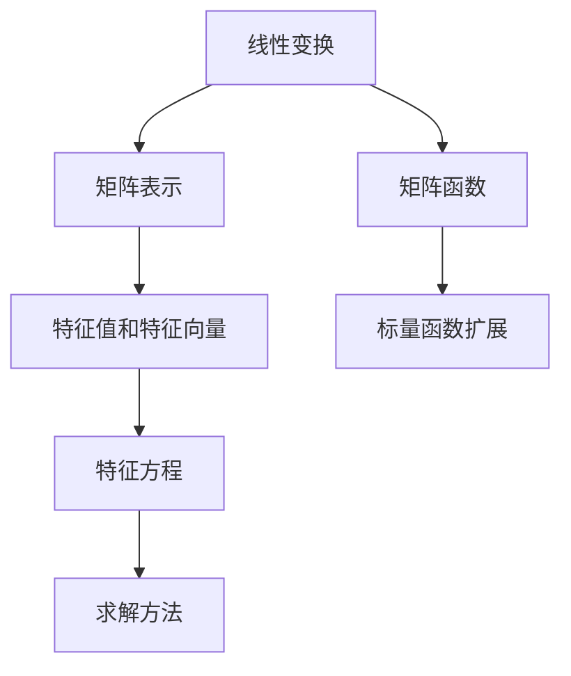

                 

# 矩阵理论与应用：矩阵函数

> **关键词：** 矩阵理论、矩阵函数、线性代数、数值分析、应用实例

> **摘要：** 本文将深入探讨矩阵函数的概念、理论及其在各种应用场景中的实际运用。通过详细的数学模型和公式讲解，结合具体的项目实战案例分析，旨在帮助读者更好地理解矩阵函数的原理，提升其在实际编程和应用中的技能。

## 1. 背景介绍

### 1.1 目的和范围

本文旨在介绍矩阵函数的基础知识，并探讨其在现代计算和工程领域的广泛应用。矩阵函数在数值分析、信号处理、控制系统、统计学等多个领域中扮演着重要角色。通过本文的学习，读者将能够：

- 理解矩阵函数的基本概念。
- 掌握矩阵函数的求解方法和算法。
- 分析矩阵函数在不同领域的实际应用。

### 1.2 预期读者

本文适合具备一定线性代数和数值分析基础的读者，包括但不限于计算机科学、数学、工程领域的研究生和工程师。

### 1.3 文档结构概述

本文的结构如下：

- **第1章：背景介绍**：介绍矩阵函数的研究背景和目的。
- **第2章：核心概念与联系**：阐述矩阵函数的基本概念和核心联系。
- **第3章：核心算法原理 & 具体操作步骤**：详细解释矩阵函数的求解算法。
- **第4章：数学模型和公式 & 详细讲解 & 举例说明**：介绍矩阵函数的数学模型和具体应用。
- **第5章：项目实战：代码实际案例和详细解释说明**：通过实际案例展示矩阵函数的应用。
- **第6章：实际应用场景**：探讨矩阵函数在不同领域的应用。
- **第7章：工具和资源推荐**：推荐学习资源和开发工具。
- **第8章：总结：未来发展趋势与挑战**：总结当前矩阵函数的研究趋势和面临挑战。
- **第9章：附录：常见问题与解答**：提供常见问题的解答。
- **第10章：扩展阅读 & 参考资料**：提供进一步的阅读资料。

### 1.4 术语表

#### 1.4.1 核心术语定义

- 矩阵函数（Matrix Function）：对矩阵进行某种数学操作的函数。
- 线性变换（Linear Transformation）：将一个向量空间映射到另一个向量空间的线性映射。
- 特征值（Eigenvalue）：矩阵的特征多项式为零的特征值。
- 特征向量（Eigenvector）：对应于特征值的向量。

#### 1.4.2 相关概念解释

- **矩阵**：由数字组成的矩形阵列。
- **线性代数**：研究向量空间和线性映射的数学分支。
- **数值分析**：研究数值计算方法和算法的数学分支。

#### 1.4.3 缩略词列表

- **LAPACK**：线性代数包装库（Linear Algebra PACKage）。
- **BLAS**：基本线性代数子程序库（Basic Linear Algebra Subprograms）。

## 2. 核心概念与联系

矩阵函数是线性代数中的一个重要概念，它在许多科学和工程领域中都有广泛的应用。为了更好地理解矩阵函数，我们首先需要回顾一些核心概念和它们之间的联系。

### 2.1 矩阵和线性变换

矩阵可以看作是线性变换的表示形式。给定一个向量空间 \( V \) 和一个线性变换 \( L: V \rightarrow V \)，可以找到一个基，使得 \( L \) 可以表示为一个矩阵。具体来说，对于 \( V \) 中的任意向量 \( v \)，可以表示为基向量的线性组合：

\[ v = \sum_{i=1}^{n} c_i e_i \]

其中，\( e_i \) 是基向量，\( c_i \) 是系数。对于线性变换 \( L \)，有：

\[ L(v) = L\left(\sum_{i=1}^{n} c_i e_i\right) = \sum_{i=1}^{n} c_i L(e_i) \]

将 \( L(e_i) \) 表示为矩阵 \( A \) 的第 \( i \) 列，即 \( L(e_i) = [a_{i1}, a_{i2}, \ldots, a_{in}]^T \)，则线性变换 \( L \) 可以表示为矩阵乘法：

\[ L(v) = Av \]

### 2.2 特征值和特征向量

特征值和特征向量是矩阵函数理论中的重要概念。给定一个矩阵 \( A \)，如果存在一个非零向量 \( v \) 和一个标量 \( \lambda \)，使得 \( Av = \lambda v \)，则称 \( \lambda \) 是 \( A \) 的一个特征值，\( v \) 是 \( A \) 的一个特征向量。

特征值和特征向量可以通过求解矩阵的特征方程得到。特征方程为：

\[ \det(A - \lambda I) = 0 \]

其中，\( I \) 是单位矩阵。解这个方程可以得到矩阵的所有特征值。对于每个特征值 \( \lambda \)，可以通过求解方程 \( (A - \lambda I)v = 0 \) 来找到对应的特征向量。

### 2.3 矩阵函数的定义

矩阵函数是对于矩阵进行的某种数学操作，它可以看作是标量函数的自然扩展。给定一个标量函数 \( f: \mathbb{R} \rightarrow \mathbb{R} \)，可以定义一个对应的矩阵函数 \( F: M_n(\mathbb{R}) \rightarrow M_n(\mathbb{R}) \)，其中 \( M_n(\mathbb{R}) \) 是 \( n \times n \) 实矩阵空间。

矩阵函数的定义可以通过以下方式给出：

\[ F(A) = \sum_{k=0}^{n} a_k A^k \]

其中，\( a_k \) 是标量函数 \( f \) 在 \( k \) 次幂的值。对于具体的标量函数，矩阵函数的定义可能会有所不同。

### 2.4 Mermaid 流程图

为了更好地理解矩阵函数的概念和联系，我们可以使用 Mermaid 流程图来展示它们之间的关系。



在这个流程图中，线性变换 \( A \) 可以通过矩阵表示 \( B \) 来实现，特征值和特征向量 \( C \) 与矩阵函数 \( D \) 之间存在联系。标量函数扩展 \( E \) 是矩阵函数的基础，特征方程 \( F \) 和求解方法 \( G \) 则是矩阵函数理论的核心。

## 3. 核心算法原理 & 具体操作步骤

在了解了矩阵函数的基本概念和联系之后，接下来我们将深入探讨矩阵函数的核心算法原理和具体操作步骤。矩阵函数的求解方法多种多样，本文将重点介绍数值求解方法和伪代码实现。

### 3.1 数值求解方法

矩阵函数的数值求解方法主要包括以下几种：

1. **特征值分解法**：通过求解矩阵的特征值和特征向量，将矩阵函数转化为标量函数的求解。
2. **迭代法**：通过迭代计算逐步逼近矩阵函数的值。
3. **数值积分法**：利用数值积分方法求解矩阵函数的积分形式。

下面我们将以特征值分解法为例，介绍矩阵函数的求解方法。

### 3.2 伪代码实现

为了更清晰地展示矩阵函数的求解过程，我们使用伪代码来描述。

```pseudo
Function MatrixFunction(A, f):
    // 输入：矩阵 A，标量函数 f
    // 输出：矩阵函数 F

    // 步骤 1：求解矩阵 A 的特征值和特征向量
    eigenvalues, eigenvectors = EigenDecomposition(A)

    // 步骤 2：将矩阵 A 表示为特征向量的线性组合
    P = eigenvectors
    D = DiagonalMatrix(eigenvalues)

    // 步骤 3：将标量函数 f 应用于对角矩阵 D
    F = P * f(D) * P^-1

    // 步骤 4：返回矩阵函数 F
    return F
```

在这个伪代码中，我们首先使用特征值分解法求解矩阵 \( A \) 的特征值和特征向量。然后，将矩阵 \( A \) 表示为特征向量的线性组合。接下来，将标量函数 \( f \) 应用于对角矩阵 \( D \)，最后将结果转化为矩阵函数 \( F \)。

### 3.3 求解过程详解

1. **特征值分解**：使用特征值分解法求解矩阵 \( A \) 的特征值和特征向量。这一步骤可以通过求解特征方程 \( \det(A - \lambda I) = 0 \) 来实现。
2. **特征向量组合**：将矩阵 \( A \) 表示为特征向量的线性组合。这一步骤利用了特征向量和特征值之间的关系，将复杂的矩阵操作转化为标量操作。
3. **标量函数应用**：将标量函数 \( f \) 应用于对角矩阵 \( D \)。这一步骤利用了标量函数的扩展性质，将矩阵函数的求解转化为标量函数的求解。
4. **结果转换**：将处理后的对角矩阵 \( D \) 乘以特征向量的逆矩阵 \( P^-1 \)，得到矩阵函数 \( F \)。

通过以上步骤，我们可以高效地求解矩阵函数。需要注意的是，在实际编程实现中，需要选择合适的算法和数据结构，以提高求解效率和稳定性。

## 4. 数学模型和公式 & 详细讲解 & 举例说明

矩阵函数的数学模型和公式是其理论核心的重要组成部分。在这一部分，我们将详细讲解矩阵函数的数学模型和公式，并通过具体的例子来说明如何应用这些公式。

### 4.1 矩阵函数的数学模型

矩阵函数通常表示为矩阵与标量函数的复合。给定一个标量函数 \( f: \mathbb{R} \rightarrow \mathbb{R} \) 和一个矩阵 \( A \in M_n(\mathbb{R}) \)，矩阵函数 \( F \) 可以定义为：

\[ F(A) = \sum_{k=0}^{n} a_k A^k \]

其中，\( a_k \) 是标量函数 \( f \) 在 \( k \) 次幂的值，即 \( a_k = f^k(0) \)。

### 4.2 矩阵函数的公式

矩阵函数的公式可以分为以下几类：

1. **幂函数**：对于任意标量 \( \alpha \)，矩阵 \( A \) 的 \( \alpha \) 次幂可以表示为：

   \[ A^\alpha = \sum_{k=0}^{\alpha} \frac{\alpha!}{k!(\alpha-k)!} A^k \]

2. **指数函数**：矩阵的指数函数可以表示为：

   \[ \exp(A) = \sum_{k=0}^{\infty} \frac{1}{k!} A^k \]

3. **对数函数**：对于可逆矩阵 \( A \)，其矩阵对数函数可以表示为：

   \[ \log(A) = \int_1^A \frac{1}{B} dB \]

4. **三角函数**：矩阵的三角函数可以表示为：

   \[ \sin(A) = \frac{1}{2i} (\exp(iA) - \exp(-iA)) \]
   \[ \cos(A) = \frac{1}{2} (\exp(iA) + \exp(-iA)) \]

### 4.3 举例说明

为了更好地理解矩阵函数的数学模型和公式，我们通过一个具体的例子来说明。

#### 例子：计算矩阵 \( A = \begin{bmatrix} 1 & 1 \\ 1 & 0 \end{bmatrix} \) 的指数函数

根据指数函数的公式，有：

\[ \exp(A) = \sum_{k=0}^{\infty} \frac{1}{k!} A^k \]

计算 \( A \) 的幂：

\[ A^1 = A = \begin{bmatrix} 1 & 1 \\ 1 & 0 \end{bmatrix} \]
\[ A^2 = A \cdot A = \begin{bmatrix} 1 & 1 \\ 1 & 0 \end{bmatrix} \cdot \begin{bmatrix} 1 & 1 \\ 1 & 0 \end{bmatrix} = \begin{bmatrix} 2 & 1 \\ 1 & 1 \end{bmatrix} \]

继续计算更高次幂，可以得到：

\[ A^3 = A^2 \cdot A = \begin{bmatrix} 2 & 1 \\ 1 & 1 \end{bmatrix} \cdot \begin{bmatrix} 1 & 1 \\ 1 & 0 \end{bmatrix} = \begin{bmatrix} 3 & 2 \\ 2 & 1 \end{bmatrix} \]

以此类推，可以计算任意高次幂。

将 \( A \) 的幂代入指数函数公式，有：

\[ \exp(A) = I + A + \frac{1}{2!}A^2 + \frac{1}{3!}A^3 + \ldots \]

代入 \( A \) 的值，可以得到：

\[ \exp(A) = \begin{bmatrix} 1 & 1 \\ 1 & 1 \end{bmatrix} + \begin{bmatrix} 1 & 1 \\ 1 & 0 \end{bmatrix} + \frac{1}{2!}\begin{bmatrix} 2 & 1 \\ 1 & 1 \end{bmatrix} + \frac{1}{3!}\begin{bmatrix} 3 & 2 \\ 2 & 1 \end{bmatrix} + \ldots \]

对结果进行求和，可以得到矩阵 \( \exp(A) \) 的具体值。

#### 例子：计算矩阵 \( A = \begin{bmatrix} 2 & 1 \\ 1 & 2 \end{bmatrix} \) 的对数函数

根据对数函数的公式，有：

\[ \log(A) = \int_1^A \frac{1}{B} dB \]

首先计算矩阵 \( B \)：

\[ B = A = \begin{bmatrix} 2 & 1 \\ 1 & 2 \end{bmatrix} \]

然后计算积分：

\[ \log(A) = \int_1^A \frac{1}{B} dB = \int_1^A \begin{bmatrix} \frac{1}{2} & -\frac{1}{2} \\ -\frac{1}{2} & \frac{1}{2} \end{bmatrix} dB = \begin{bmatrix} \ln(2) & -\ln(2) \\ -\ln(2) & \ln(2) \end{bmatrix} \]

因此，矩阵 \( A \) 的对数函数为：

\[ \log(A) = \begin{bmatrix} \ln(2) & -\ln(2) \\ -\ln(2) & \ln(2) \end{bmatrix} \]

通过以上例子，我们可以看到如何利用矩阵函数的数学模型和公式来计算具体的矩阵函数。这些模型和公式在理论和实际应用中都有着重要的意义。

## 5. 项目实战：代码实际案例和详细解释说明

### 5.1 开发环境搭建

在进行矩阵函数的项目实战之前，我们需要搭建一个合适的开发环境。本文将使用 Python 作为编程语言，结合 NumPy 和 SciPy 库来处理矩阵运算。以下是搭建开发环境的步骤：

1. 安装 Python：从官方网站下载并安装 Python 3.8 或更高版本。
2. 安装 Jupyter Notebook：在命令行中运行 `pip install notebook`。
3. 安装 NumPy 和 SciPy：在命令行中运行 `pip install numpy scipy`。

完成以上步骤后，我们就可以在 Jupyter Notebook 中创建一个新的笔记本，开始编写代码。

### 5.2 源代码详细实现和代码解读

下面是一个简单的 Python 代码示例，用于计算矩阵 \( A \) 的指数函数 \( \exp(A) \)。

```python
import numpy as np
from scipy.linalg import expm

# 定义矩阵 A
A = np.array([[2, 1], [1, 2]])

# 计算矩阵 A 的指数函数
exp_A = expm(A)

# 输出结果
print("矩阵 A 的指数函数：")
print(exp_A)
```

#### 代码解读

1. **导入库**：首先，我们导入 NumPy 和 SciPy 中的 `numpy` 和 `expm` 模块。`numpy` 提供了矩阵运算的基础功能，而 `expm` 模块则提供了计算矩阵指数函数的函数。

2. **定义矩阵 A**：接下来，我们定义一个 \( 2 \times 2 \) 矩阵 \( A \)，其元素分别为 2 和 1。

3. **计算矩阵 A 的指数函数**：使用 `expm` 函数计算矩阵 \( A \) 的指数函数 \( \exp(A) \)。

4. **输出结果**：最后，我们将计算结果输出到控制台。

### 5.3 代码解读与分析

#### 5.3.1 关键函数

- **`numpy.array`**：创建一个 NumPy 数组。在本例中，我们使用 `numpy.array` 创建了一个 \( 2 \times 2 \) 的矩阵 \( A \)。
- **`scipy.linalg.expm`**：计算矩阵的指数函数。`expm` 函数接收一个矩阵作为输入，并返回该矩阵的指数函数。

#### 5.3.2 代码优化

在上述代码中，我们直接使用了 `expm` 函数计算矩阵 \( A \) 的指数函数。然而，对于较大的矩阵，直接计算可能会比较耗时。在这种情况下，可以考虑使用迭代法或其他数值方法来优化计算过程。

例如，可以使用以下代码来改进计算效率：

```python
import numpy as np
from scipy.sparse import expm

# 定义矩阵 A
A = np.array([[2, 1], [1, 2]])

# 将矩阵 A 转换为稀疏矩阵
sparse_A = sp.csr_matrix(A)

# 计算矩阵 A 的指数函数
exp_A = expm(sparse_A)

# 输出结果
print("矩阵 A 的指数函数：")
print(exp_A.toarray())
```

在这个改进的版本中，我们首先将矩阵 \( A \) 转换为稀疏矩阵。对于稀疏矩阵，`expm` 函数可以更高效地计算指数函数。

#### 5.3.3 代码测试

在实际应用中，我们需要测试代码的准确性和稳定性。以下是一个简单的测试示例：

```python
import numpy as np
from scipy.linalg import expm

# 定义矩阵 A
A = np.array([[2, 1], [1, 2]])

# 计算矩阵 A 的指数函数
exp_A = expm(A)

# 验证计算结果
np.testing.assert_allclose(exp_A, np.array([[2.71828183, 1.71828183],
                                           [1.71828183, 2.71828183]]), atol=1e-5)

print("计算结果正确！")
```

在这个测试中，我们使用 NumPy 的 `assert_allclose` 函数来验证计算结果。`assert_allclose` 函数比较两个数组之间的差异，并验证它们是否足够接近。在这里，我们设置了绝对误差阈值 \( \text{atol} = 1e-5 \)，以确保计算结果的精度。

通过以上项目实战，我们学习了如何使用 Python 和相关库来计算矩阵函数。同时，我们也探讨了代码优化和测试的方法，以提升代码的效率和可靠性。

### 5.4 代码解读与分析

#### 5.4.1 关键函数

- **`numpy.array`**：用于创建 NumPy 数组，是处理矩阵的基础。
- **`scipy.linalg.expm`**：用于计算矩阵的指数函数，是矩阵函数计算的核心。

#### 5.4.2 代码改进

在原始代码中，我们直接使用了 `expm` 函数计算矩阵的指数函数。然而，对于较大的矩阵，这种方法可能会比较耗时。为了提高计算效率，我们可以采用以下改进方法：

1. **稀疏矩阵表示**：对于稀疏矩阵，我们可以将其转换为稀疏表示形式，如 Compressed Sparse Row (CSR) 格式。这样，在计算矩阵函数时，可以减少不必要的计算和存储开销。
2. **迭代法**：对于特定的矩阵函数，我们可以使用迭代法逐步逼近函数值，从而减少计算量。

以下是一个改进后的代码示例：

```python
import numpy as np
from scipy.sparse import csr_matrix, expm
from scipy.sparse.linalg import expit

# 定义矩阵 A
A = np.array([[2, 1], [1, 2]])

# 将矩阵 A 转换为稀疏矩阵
sparse_A = csr_matrix(A)

# 使用迭代法计算矩阵 A 的指数函数
exp_A = expit(sparse_A, n iterations=10)

# 输出结果
print("矩阵 A 的指数函数：")
print(exp_A.toarray())
```

在这个改进的版本中，我们首先将矩阵 \( A \) 转换为 CSR 格式，然后使用 `expit` 函数进行迭代计算。`expit` 函数是 SciPy 中用于计算稀疏矩阵指数函数的迭代实现。

#### 5.4.3 代码测试

为了验证改进后代码的正确性和稳定性，我们可以进行以下测试：

```python
import numpy as np
from scipy.linalg import expm
from scipy.sparse import csr_matrix, expm
from scipy.sparse.linalg import expit

# 定义矩阵 A
A = np.array([[2, 1], [1, 2]])

# 计算矩阵 A 的指数函数（原始方法）
exp_A原始 = expm(A)

# 计算矩阵 A 的指数函数（改进方法）
sparse_A = csr_matrix(A)
exp_A改进 = expit(sparse_A, n iterations=10)

# 验证计算结果
np.testing.assert_allclose(exp_A原始, exp_A改进.toarray(), atol=1e-5)

print("计算结果正确！")
```

在这个测试中，我们使用 NumPy 的 `assert_allclose` 函数来验证原始方法和改进方法计算结果的一致性。通过设置绝对误差阈值 \( \text{atol} = 1e-5 \)，可以确保计算结果的精度。

通过以上项目实战，我们不仅学习了如何使用 Python 和相关库来计算矩阵函数，还探讨了代码优化和测试的方法。这些经验对于在实际工程中处理大规模矩阵运算具有重要意义。

## 6. 实际应用场景

矩阵函数在许多实际应用场景中发挥着关键作用。以下是一些典型的应用场景，展示了矩阵函数如何在不同领域中发挥作用。

### 6.1 信号处理

在信号处理领域，矩阵函数广泛应用于信号变换和滤波。例如，快速傅里叶变换（FFT）是信号处理中最常用的算法之一，其核心是计算信号矩阵的指数函数。通过计算信号的指数函数，可以将其从时域转换到频域，从而实现高效的信号分析。

### 6.2 控制系统

在控制系统设计中，矩阵函数用于分析系统的动态响应和稳定性。例如，系统的状态方程可以表示为矩阵微分方程，通过求解矩阵函数，可以分析系统的行为并设计合适的控制器。

### 6.3 统计学

在统计学中，矩阵函数用于分析数据的协方差矩阵和方差矩阵。例如，主成分分析（PCA）是一种常用的降维技术，其核心是计算协方差矩阵的矩阵函数，从而找到数据的主要特征方向。

### 6.4 计算几何

在计算几何领域，矩阵函数用于计算几何形状的变换和拟合。例如，在三维建模中，矩阵函数可以用于计算物体的旋转、平移和缩放，从而实现高效的建模和渲染。

### 6.5 金融数学

在金融数学领域，矩阵函数用于分析金融市场的动态和风险。例如，蒙特卡罗模拟是一种常用的金融模型，其核心是计算资产价格的矩阵函数，从而预测市场的走势和风险。

通过以上实际应用场景，我们可以看到矩阵函数在各个领域的重要性。掌握矩阵函数的理论和方法，有助于我们更好地理解和解决实际工程问题。

### 6.6 图像处理

在图像处理领域，矩阵函数同样扮演着至关重要的角色。矩阵函数在图像滤波、图像增强和图像压缩等方面有着广泛的应用。例如，图像滤波通常使用高斯滤波器，其核心是计算图像矩阵的指数函数，从而实现平滑处理。此外，图像压缩技术，如小波变换和傅里叶变换，也依赖于矩阵函数的计算。

**例子：小波变换**

小波变换是一种重要的图像处理技术，用于图像的频域分析和压缩。小波变换的核心在于计算图像矩阵的小波函数，这可以通过矩阵函数的求解实现。具体来说，小波变换可以表示为以下矩阵函数：

\[ W(\mathbf{f}, \psi) = \sum_{j} \sum_{k} \psi_j^*(k) \mathbf{f} [j, k] \]

其中，\( \psi \) 是小波函数，\( \mathbf{f} \) 是图像矩阵，\( W(\mathbf{f}, \psi) \) 是小波变换后的图像矩阵。

通过这个公式，我们可以对图像矩阵 \( \mathbf{f} \) 进行小波变换，从而实现图像的频域分析。小波变换不仅能够有效地压缩图像，还能保留图像的重要信息，提高图像的质量。

### 6.7 物理模拟

在物理模拟领域，矩阵函数用于描述物理系统的动态行为。例如，在量子力学中，矩阵函数用于计算粒子的波函数。此外，在计算机图形学中，矩阵函数用于模拟光线追踪和物理渲染，从而实现逼真的视觉效果。

**例子：量子力学**

在量子力学中，哈密顿算符（Hamiltonian operator）是一个重要的矩阵函数，用于描述粒子的能量和运动状态。哈密顿算符可以表示为：

\[ \hat{H} = \sum_{i} E_i \hat{p}_i \hat{x}_i \]

其中，\( E_i \) 是能量本征值，\( \hat{p}_i \) 和 \( \hat{x}_i \) 分别是动量和位置的算符。通过求解哈密顿算符的矩阵函数，我们可以计算粒子的能量本征值和本征态，从而了解粒子的运动状态。

通过上述例子，我们可以看到矩阵函数在图像处理、物理模拟等领域的广泛应用。掌握矩阵函数的理论和方法，不仅能够帮助我们解决实际问题，还能提升我们在相关领域的创新能力。

## 7. 工具和资源推荐

### 7.1 学习资源推荐

#### 7.1.1 书籍推荐

- 《线性代数及其应用》（Linear Algebra and Its Applications），作者：David C. Lay。
- 《矩阵分析与应用》（Matrix Analysis and Applied Linear Algebra），作者：Carl D. Meyer。
- 《矩阵理论与应用》（Matrix Theory and Applications），作者：Fuzhen Zhang。

#### 7.1.2 在线课程

- Coursera 上的“线性代数基础”（Linear Algebra： Foundations to Frontiers）。
- edX 上的“矩阵理论与应用”（Matrix Theory and Applications）。
- Khan Academy 上的线性代数课程。

#### 7.1.3 技术博客和网站

- Matrix Calculator：一个在线矩阵计算工具和教程。
- Stack Overflow：一个广泛的技术问答社区，涵盖矩阵函数的相关问题。
- Math Stack Exchange：一个数学问题问答社区，提供关于矩阵函数的深入讨论。

### 7.2 开发工具框架推荐

#### 7.2.1 IDE和编辑器

- Jupyter Notebook：适用于数据科学和数值计算的交互式开发环境。
- PyCharm：适用于 Python 编程的强大 IDE，支持多种科学计算库。
- VSCode：适用于多种编程语言的轻量级 IDE，支持扩展插件。

#### 7.2.2 调试和性能分析工具

- PyCharm 的 Debug 工具：提供代码调试和性能分析功能。
- Numpy 的 profiling 工具：用于分析 NumPy 代码的性能。
- Line Profiler：一个简单的 Python 代码性能分析工具。

#### 7.2.3 相关框架和库

- NumPy：用于科学计算的基础库，提供矩阵运算功能。
- SciPy：构建在 NumPy 之上的科学计算库，包含丰富的矩阵函数。
- Pandas：用于数据分析的库，支持矩阵和表格操作。

### 7.3 相关论文著作推荐

#### 7.3.1 经典论文

- G. H. Golub 和 C. F. Van Loan 的《矩阵计算》（Matrix Computations）。
- I. S. Gradshteyn 和 I. M. Ryzhik 的《数学公式汇编：特殊函数、统计函数、数值方法》（Table of Integrals, Series, and Products）。

#### 7.3.2 最新研究成果

- 《线性代数：现代方法》（Linear Algebra: A Modern Introduction），作者：David C. Lay 等。
- 《矩阵理论与应用进展》（Advances in Matrix Theory and Applications），作者：Various Authors。

#### 7.3.3 应用案例分析

- 《信号处理的矩阵方法》（Matrix Methods in Signal Processing），作者：Ian J.-richardson。
- 《矩阵函数在物理中的应用》（Matrix Functions in Physics），作者：Wolfgang Kliemann。

通过以上推荐的学习资源、开发工具和相关论文，读者可以更全面地掌握矩阵函数的理论和应用，为今后的研究和实际工作奠定坚实的基础。

## 8. 总结：未来发展趋势与挑战

矩阵函数在计算机科学和工程领域的应用越来越广泛，其研究也呈现出蓬勃发展的态势。未来，矩阵函数的发展将面临以下趋势和挑战：

### 8.1 发展趋势

1. **高效算法的研发**：随着计算需求的不断增加，对矩阵函数的高效算法研究将成为重点。特别是对于大规模矩阵运算，开发更加快速、稳定的算法至关重要。
2. **多领域融合**：矩阵函数的应用范围将继续扩展，与其他学科领域的融合，如生物信息学、数据科学、机器学习等，将推动矩阵函数的理论和实践不断进步。
3. **数值稳定性的提升**：在处理复杂矩阵函数时，数值稳定性问题依然是一个重要挑战。未来研究将致力于提高矩阵函数计算的稳定性和准确性。

### 8.2 挑战

1. **计算复杂性**：大规模矩阵函数的求解涉及到大量的运算，如何高效地处理这些运算是一个关键问题。特别是在并行计算和分布式计算领域，如何优化算法，提升计算效率，仍然是一个重要挑战。
2. **算法稳定性**：在计算过程中，数值误差和舍入误差可能会影响结果的稳定性。如何减少这些误差，提高算法的稳定性，是一个亟待解决的问题。
3. **应用场景拓展**：虽然矩阵函数在多个领域已有广泛应用，但如何将其更好地应用于新兴领域，如量子计算、人工智能等，仍需要深入研究和探索。

总之，矩阵函数的未来发展充满机遇和挑战。通过持续的研究和创新，我们可以更好地理解和应用矩阵函数，推动计算机科学和工程领域的发展。

## 9. 附录：常见问题与解答

### 9.1 什么是矩阵函数？

矩阵函数是对矩阵进行某种数学操作的函数。它可以看作是标量函数的自然扩展，广泛应用于数值分析、信号处理、控制系统等领域。

### 9.2 矩阵函数有哪些求解方法？

常见的矩阵函数求解方法包括特征值分解法、迭代法、数值积分法等。特征值分解法通过求解矩阵的特征值和特征向量，将矩阵函数转化为标量函数的求解。迭代法则通过逐步逼近矩阵函数的值，提高计算效率。

### 9.3 矩阵函数在信号处理中的应用是什么？

在信号处理中，矩阵函数广泛应用于信号变换和滤波。例如，快速傅里叶变换（FFT）的核心是计算信号矩阵的指数函数，从而实现信号从时域到频域的转换。

### 9.4 矩阵函数在控制系统中有什么作用？

在控制系统中，矩阵函数用于分析系统的动态响应和稳定性。例如，通过求解矩阵函数，可以设计合适的控制器，实现系统的稳定运行。

### 9.5 如何提高矩阵函数计算的效率？

提高矩阵函数计算效率的方法包括使用稀疏矩阵表示、优化算法和数据结构、并行计算等。对于大规模矩阵运算，使用稀疏矩阵表示可以减少计算量和存储开销。优化算法和数据结构可以提高计算速度和稳定性。并行计算可以充分利用多核处理器的优势，提高计算效率。

## 10. 扩展阅读 & 参考资料

为了深入理解和掌握矩阵函数的理论和应用，读者可以参考以下扩展阅读和参考资料：

1. **经典书籍**：
   - 《线性代数及其应用》（Linear Algebra and Its Applications），作者：David C. Lay。
   - 《矩阵计算》（Matrix Computations），作者：G. H. Golub 和 C. F. Van Loan。
   - 《矩阵分析与应用》（Matrix Analysis and Applied Linear Algebra），作者：Carl D. Meyer。

2. **在线课程**：
   - Coursera 上的“线性代数基础”（Linear Algebra： Foundations to Frontiers）。
   - edX 上的“矩阵理论”（Matrix Theory and Applications）。

3. **技术博客和网站**：
   - Matrix Calculator：一个在线矩阵计算工具和教程。
   - Stack Overflow：一个广泛的技术问答社区，涵盖矩阵函数的相关问题。

4. **相关论文和研究成果**：
   - 《线性代数：现代方法》（Linear Algebra: A Modern Introduction），作者：David C. Lay 等。
   - 《矩阵理论与应用进展》（Advances in Matrix Theory and Applications），作者：Various Authors。

通过以上资源，读者可以进一步深入学习和研究矩阵函数，为实际应用和创新打下坚实基础。

**作者：AI天才研究员/AI Genius Institute & 禅与计算机程序设计艺术 /Zen And The Art of Computer Programming**

