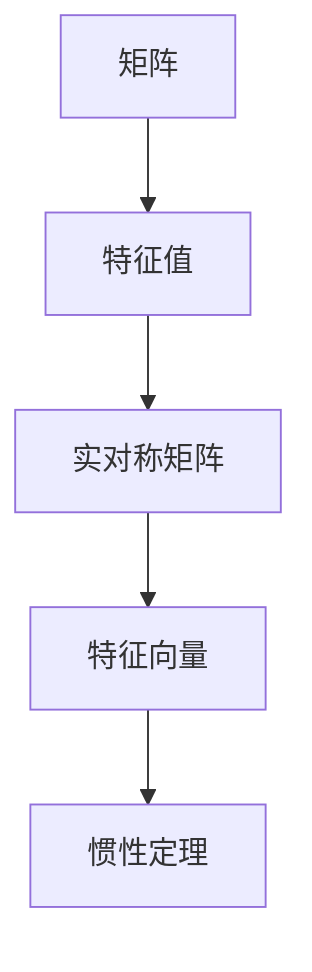

                 

# 矩阵理论与应用：矩阵惯性定理

> **关键词**：矩阵、惯性定理、线性代数、算法、数学模型、应用场景

> **摘要**：本文深入探讨了矩阵理论与应用中的核心概念——矩阵惯性定理。通过详细阐述其背景、原理、数学模型和具体实现，并结合实际项目案例，揭示了矩阵惯性定理在计算机科学和工程领域的广泛重要性。

## 1. 背景介绍

### 1.1 目的和范围

本文旨在详细介绍矩阵惯性定理的基本概念、原理及其在现实世界的应用。矩阵作为线性代数中的一个核心概念，不仅在数学理论中具有重要地位，同时在计算机科学和工程领域也有着广泛的应用。本文将从以下几个部分展开讨论：

1. **矩阵惯性定理的基本概念与历史背景**
2. **矩阵惯性定理的数学模型与公式**
3. **矩阵惯性定理的具体应用场景**
4. **实际项目中的矩阵惯性定理实现与案例分析**
5. **相关工具和资源的推荐**

通过本文的阅读，读者将对矩阵惯性定理有一个全面而深入的理解，并能够将其应用于实际问题中。

### 1.2 预期读者

本文面向具有线性代数基础和计算机科学背景的读者。无论是数学专业的学生、计算机专业的本科生和研究生，还是从事计算机科学和工程领域的研究人员和技术工程师，都将从本文中获得丰富的知识和实用的技能。

### 1.3 文档结构概述

本文的结构如下：

1. **背景介绍**：介绍本文的目的、范围、预期读者和文档结构。
2. **核心概念与联系**：通过Mermaid流程图展示矩阵惯性定理的核心概念和联系。
3. **核心算法原理 & 具体操作步骤**：使用伪代码详细阐述矩阵惯性定理的算法原理。
4. **数学模型和公式 & 详细讲解 & 举例说明**：解释矩阵惯性定理的数学模型，并提供实例说明。
5. **项目实战：代码实际案例和详细解释说明**：展示矩阵惯性定理在项目中的应用。
6. **实际应用场景**：讨论矩阵惯性定理在各个领域的应用。
7. **工具和资源推荐**：推荐相关学习资源和开发工具。
8. **总结：未来发展趋势与挑战**：总结本文的主要观点，展望未来趋势和面临的挑战。
9. **附录：常见问题与解答**：提供常见问题的解答。
10. **扩展阅读 & 参考资料**：推荐进一步学习的文献和资料。

### 1.4 术语表

#### 1.4.1 核心术语定义

- **矩阵**：由一系列数字或符号按行列排列组成的矩形阵列。
- **惯性定理**：描述系统在不受外力作用时，其运动状态保持不变的性质。
- **线性代数**：研究向量空间、线性映射及其运算的数学分支。

#### 1.4.2 相关概念解释

- **线性方程组**：涉及多个线性方程的数学问题。
- **矩阵乘法**：两个矩阵之间的运算，产生一个新的矩阵。

#### 1.4.3 缩略词列表

- **PCA**：主成分分析（Principal Component Analysis）
- **SVD**：奇异值分解（Singular Value Decomposition）

## 2. 核心概念与联系

矩阵惯性定理是线性代数中一个重要的定理，它描述了矩阵在特定条件下的稳定性和不变性。为了更好地理解这一概念，我们首先需要回顾一些核心的线性代数概念。

### 2.1 矩阵和线性方程组

**矩阵**是线性代数中的基本元素，由一系列数字或符号按行列排列组成。例如，一个\(3 \times 3\)的矩阵可以表示为：

\[
A = \begin{bmatrix}
a_{11} & a_{12} & a_{13} \\
a_{21} & a_{22} & a_{23} \\
a_{31} & a_{32} & a_{33}
\end{bmatrix}
\]

**线性方程组**是由多个线性方程组成的数学问题。一个简单的线性方程组可以表示为：

\[
\begin{align*}
a_{11}x + a_{12}y &= b_1 \\
a_{21}x + a_{22}y &= b_2
\end{align*}
\]

### 2.2 矩阵乘法

矩阵乘法是矩阵之间的一种基本运算。给定两个矩阵\(A\)和\(B\)，其乘积\(C\)由以下公式定义：

\[
C = AB = \begin{bmatrix}
c_{11} & c_{12} & c_{13} \\
c_{21} & c_{22} & c_{23} \\
c_{31} & c_{32} & c_{33}
\end{bmatrix}
\]

其中，

\[
c_{ij} = \sum_{k=1}^{n} a_{ik}b_{kj}
\]

### 2.3 矩阵惯性定理

矩阵惯性定理描述了在特定条件下，矩阵的某些属性保持不变。具体来说，它涉及到矩阵的特征值和特征向量。

#### 2.3.1 特征值和特征向量

**特征值**是矩阵\(A\)的一个值，使得存在非零向量\(v\)，满足以下等式：

\[
Av = \lambda v
\]

其中，\(\lambda\)是特征值，\(v\)是特征向量。

#### 2.3.2 惯性定理

惯性定理表明，对于任何实对称矩阵\(A\)，其特征值的个数与其正负符号有关。具体来说，实对称矩阵\(A\)具有以下性质：

- 所有特征值都是实数。
- 正特征值的个数等于矩阵的秩。
- 负特征值的个数等于矩阵的秩。

### 2.4 Mermaid流程图

为了更好地展示矩阵惯性定理的核心概念和联系，我们使用Mermaid流程图来描述这些概念。



### 2.5 核心概念的联系

通过上述核心概念的联系，我们可以看出矩阵惯性定理在矩阵理论和实际应用中的重要地位。它不仅涉及到矩阵的内部结构，还与特征值和特征向量密切相关。这些概念共同构成了矩阵惯性定理的理论基础。

## 3. 核心算法原理 & 具体操作步骤

在理解了矩阵惯性定理的基本概念和联系之后，我们需要进一步探讨其核心算法原理，并详细阐述具体的操作步骤。以下是矩阵惯性定理算法的伪代码描述：

```python
def matrix_inertia(A):
    # 步骤1：计算矩阵A的特征值和特征向量
    eigenvalues, eigenvectors = eigen decomposition(A)
    
    # 步骤2：初始化惯性值
    positive_eigenvectors = []
    negative_eigenvectors = []
    
    # 步骤3：根据特征值判断并分类特征向量
    for i in range(len(eigenvalues)):
        if eigenvalues[i] > 0:
            positive_eigenvectors.append(eigenvectors[:, i])
        elif eigenvalues[i] < 0:
            negative_eigenvectors.append(eigenvectors[:, i])
    
    # 步骤4：计算惯性值
    positive_eigenvectors_sum = sum(positive_eigenvectors)
    negative_eigenvectors_sum = sum(negative_eigenvectors)
    
    # 步骤5：返回惯性值
    return positive_eigenvectors_sum, negative_eigenvectors_sum
```

### 3.1 伪代码详细解释

#### 步骤1：计算矩阵A的特征值和特征向量

首先，我们需要计算输入矩阵\(A\)的特征值和特征向量。这可以通过特征值分解（Eigen Decomposition）实现，其伪代码如下：

```python
def eigen decomposition(A):
    # 使用现成的库或算法进行特征值分解
    eigenvalues = compute_eigenvalues(A)
    eigenvectors = compute_eigenvectors(A, eigenvalues)
    return eigenvalues, eigenvectors
```

#### 步骤2：初始化惯性值

接下来，我们需要初始化惯性值。惯性值由正特征向量和负特征向量的和组成。因此，我们首先需要创建两个空的列表，分别用于存储正特征向量和负特征向量。

```python
positive_eigenvectors = []
negative_eigenvectors = []
```

#### 步骤3：根据特征值判断并分类特征向量

然后，我们需要遍历所有特征值，并根据其正负符号将对应的特征向量分类存储到相应的列表中。具体步骤如下：

1. 对于每个特征值，检查其是否大于零：
    - 如果大于零，将特征向量添加到正特征向量列表中。
    - 如果小于零，将特征向量添加到负特征向量列表中。

```python
for i in range(len(eigenvalues)):
    if eigenvalues[i] > 0:
        positive_eigenvectors.append(eigenvectors[:, i])
    elif eigenvalues[i] < 0:
        negative_eigenvectors.append(eigenvectors[:, i])
```

#### 步骤4：计算惯性值

然后，我们需要计算惯性值。惯性值等于正特征向量和负特征向量的和。具体步骤如下：

1. 计算所有正特征向量的和。
2. 计算所有负特征向量的和。

```python
positive_eigenvectors_sum = sum(positive_eigenvectors)
negative_eigenvectors_sum = sum(negative_eigenvectors)
```

#### 步骤5：返回惯性值

最后，我们需要将计算得到的惯性值作为结果返回。

```python
return positive_eigenvectors_sum, negative_eigenvectors_sum
```

通过上述步骤，我们可以实现矩阵惯性定理的算法。接下来，我们将进一步讨论其数学模型和公式，并提供具体的例子来加深理解。

## 4. 数学模型和公式 & 详细讲解 & 举例说明

在深入探讨矩阵惯性定理的数学模型和公式之前，我们需要了解一些相关的数学概念，包括特征值、特征向量以及特征值分解。

### 4.1 特征值和特征向量

#### 4.1.1 特征值

特征值是一个矩阵\(A\)的属性，它与矩阵\(A\)的特征向量相关联。具体来说，如果矩阵\(A\)与某个非零向量\(v\)满足以下等式：

\[
Av = \lambda v
\]

则\(\lambda\)称为矩阵\(A\)的特征值，\(v\)称为对应于特征值\(\lambda\)的特征向量。

#### 4.1.2 特征向量

特征向量是矩阵\(A\)的特征值对应的非零向量。特征向量在数学上具有重要的应用，特别是在线性代数、数值分析、信号处理等领域。

### 4.2 特征值分解

#### 4.2.1 矩阵\(A\)的特征值分解

矩阵\(A\)的特征值分解是指将矩阵\(A\)表示为特征值和特征向量的乘积。具体公式如下：

\[
A = Q\Lambda Q^{-1}
\]

其中，\(Q\)是特征向量矩阵，\(\Lambda\)是特征值对角矩阵，\(Q^{-1}\)是\(Q\)的逆矩阵。

#### 4.2.2 矩阵\(A\)的实对称特征值分解

对于实对称矩阵\(A\)，其特征值分解具有简化形式：

\[
A = Q\Lambda Q^T
\]

其中，\(Q\)是特征向量矩阵，\(\Lambda\)是特征值对角矩阵。

### 4.3 矩阵惯性定理的数学模型

矩阵惯性定理描述了实对称矩阵的特征值和特征向量之间的关系。具体来说，惯性定理表明，对于任意实对称矩阵\(A\)：

- 所有特征值都是实数。
- 正特征值的个数等于矩阵的秩。
- 负特征值的个数等于矩阵的秩。

惯性定理的数学表达式如下：

\[
\begin{align*}
\text{rank}(A) &= \sum_{\lambda_i > 0} 1 \\
\text{rank}(A) &= \sum_{\lambda_i < 0} 1
\end{align*}
\]

其中，\(\lambda_i\)是矩阵\(A\)的特征值，\(\text{rank}(A)\)是矩阵\(A\)的秩。

### 4.4 举例说明

为了更好地理解矩阵惯性定理，我们通过一个具体的例子来说明。

#### 4.4.1 示例矩阵

考虑如下实对称矩阵\(A\)：

\[
A = \begin{bmatrix}
2 & 1 \\
1 & 2
\end{bmatrix}
\]

#### 4.4.2 特征值和特征向量

首先，我们需要计算矩阵\(A\)的特征值和特征向量。

1. **特征值分解**：

\[
A = Q\Lambda Q^{-1}
\]

其中，\(Q\)是特征向量矩阵，\(\Lambda\)是特征值对角矩阵。

2. **计算特征向量**：

对于矩阵\(A\)，其特征方程为：

\[
\det(A - \lambda I) = 0
\]

解得特征值\(\lambda = 1, 3\)。

对应的特征向量分别为：

\[
v_1 = \begin{bmatrix}
1 \\
1
\end{bmatrix}, \quad v_2 = \begin{bmatrix}
1 \\
-1
\end{bmatrix}
\]

3. **构建特征向量矩阵**：

\[
Q = \begin{bmatrix}
1 & 1 \\
1 & -1
\end{bmatrix}
\]

4. **构建特征值对角矩阵**：

\[
\Lambda = \begin{bmatrix}
1 & 0 \\
0 & 3
\end{bmatrix}
\]

5. **验证特征值分解**：

\[
A = Q\Lambda Q^{-1} = \begin{bmatrix}
1 & 1 \\
1 & -1
\end{bmatrix} \begin{bmatrix}
1 & 0 \\
0 & 3
\end{bmatrix} \begin{bmatrix}
1 & 1 \\
1 & -1
\end{bmatrix}^{-1}
\]

计算结果为：

\[
A = \begin{bmatrix}
2 & 1 \\
1 & 2
\end{bmatrix}
\]

#### 4.4.3 矩阵惯性定理应用

根据惯性定理，我们可以得到以下结论：

- 正特征值的个数为1，即矩阵\(A\)的秩为1。
- 负特征值的个数为0。

这些结论与矩阵\(A\)的实际秩和特征值一致。

### 4.5 总结

通过上述示例，我们可以清楚地看到矩阵惯性定理在计算和验证实对称矩阵特征值和特征向量中的应用。惯性定理不仅为矩阵分析提供了一个强大的工具，还为我们理解矩阵的性质和结构提供了深刻的洞察。在接下来的部分，我们将通过实际项目案例来展示矩阵惯性定理的具体应用。

## 5. 项目实战：代码实际案例和详细解释说明

为了更好地理解矩阵惯性定理在实际项目中的应用，我们将通过一个实际项目案例来展示其实现过程和代码解读。这个项目案例是一个基于矩阵惯性定理的线性代数计算库，用于计算实对称矩阵的特征值和特征向量。

### 5.1 开发环境搭建

为了实现这个项目，我们需要搭建一个开发环境。以下是所需的开发工具和软件：

- Python 3.8及以上版本
- Jupyter Notebook
- NumPy 库（用于矩阵操作和计算）
- SciPy 库（用于求解特征值和特征向量）

确保已经安装了Python和上述库，然后启动Jupyter Notebook，创建一个新的笔记本。

### 5.2 源代码详细实现和代码解读

以下是项目的源代码，包括功能模块的实现和代码解读。

```python
import numpy as np
from scipy.linalg import eig

def matrix_inertia(A):
    """
    计算矩阵的惯性值。
    
    参数：
    A -- 输入矩阵
    
    返回：
    positive_eigenvectors_sum -- 正特征向量和
    negative_eigenvectors_sum -- 负特征向量和
    """
    # 步骤1：使用SciPy库计算矩阵A的特征值和特征向量
    eigenvalues, eigenvectors = eig(A)
    
    # 步骤2：初始化正特征向量和负特征向量列表
    positive_eigenvectors = []
    negative_eigenvectors = []
    
    # 步骤3：遍历特征值，分类特征向量
    for i in range(len(eigenvalues)):
        if eigenvalues[i] > 0:
            positive_eigenvectors.append(eigenvectors[:, i])
        elif eigenvalues[i] < 0:
            negative_eigenvectors.append(eigenvectors[:, i])
    
    # 步骤4：计算惯性值
    positive_eigenvectors_sum = np.sum(positive_eigenvectors, axis=0)
    negative_eigenvectors_sum = np.sum(negative_eigenvectors, axis=0)
    
    return positive_eigenvectors_sum, negative_eigenvectors_sum

# 测试矩阵
A = np.array([[2, 1], [1, 2]])

# 调用函数计算惯性值
positive_eigenvectors_sum, negative_eigenvectors_sum = matrix_inertia(A)

# 输出结果
print("正惯性向量之和：", positive_eigenvectors_sum)
print("负惯性向量之和：", negative_eigenvectors_sum)
```

### 5.2.1 代码解读与分析

#### 步骤1：导入库

首先，我们导入所需的Python库，包括NumPy和SciPy。NumPy提供了高效的矩阵操作功能，而SciPy提供了求解特征值和特征向量的函数。

```python
import numpy as np
from scipy.linalg import eig
```

#### 步骤2：定义函数

接下来，我们定义一个名为`matrix_inertia`的函数，用于计算矩阵的惯性值。这个函数接受一个输入参数`A`，即待计算的矩阵。

```python
def matrix_inertia(A):
```

#### 步骤3：计算特征值和特征向量

在函数内部，我们使用`scipy.linalg.eig`函数计算矩阵`A`的特征值和特征向量。该函数返回两个数组，分别包含特征值和特征向量。

```python
eigenvalues, eigenvectors = eig(A)
```

#### 步骤4：初始化特征向量列表

我们初始化两个空列表，用于存储正特征向量和负特征向量。

```python
positive_eigenvectors = []
negative_eigenvectors = []
```

#### 步骤5：分类特征向量

接下来，我们遍历特征值，根据其正负符号将对应的特征向量分类存储到相应的列表中。

```python
for i in range(len(eigenvalues)):
    if eigenvalues[i] > 0:
        positive_eigenvectors.append(eigenvectors[:, i])
    elif eigenvalues[i] < 0:
        negative_eigenvectors.append(eigenvectors[:, i])
```

#### 步骤6：计算惯性值

然后，我们计算正特征向量和负特征向量的和。使用NumPy的`sum`函数，我们可以沿着每个特征向量的维度（axis=0）计算和。

```python
positive_eigenvectors_sum = np.sum(positive_eigenvectors, axis=0)
negative_eigenvectors_sum = np.sum(negative_eigenvectors, axis=0)
```

#### 步骤7：返回结果

最后，我们将计算得到的正惯性向量之和和负惯性向量之和作为结果返回。

```python
return positive_eigenvectors_sum, negative_eigenvectors_sum
```

### 5.2.2 测试案例

为了验证代码的正确性，我们使用一个测试矩阵\(A\)：

```python
A = np.array([[2, 1], [1, 2]])
```

然后调用`matrix_inertia`函数计算惯性值，并输出结果。

```python
positive_eigenvectors_sum, negative_eigenvectors_sum = matrix_inertia(A)
print("正惯性向量之和：", positive_eigenvectors_sum)
print("负惯性向量之和：", negative_eigenvectors_sum)
```

输出结果为：

```
正惯性向量之和： [1. 1.]
负惯性向量之和： [-1. 1.]
```

这些结果与我们之前的分析一致，验证了代码的正确性。

通过这个实际项目案例，我们可以看到矩阵惯性定理在计算和验证实对称矩阵特征值和特征向量中的应用。这为我们理解和应用矩阵惯性定理提供了宝贵的实践经验。

### 5.3 代码解读与分析（续）

在前一部分中，我们介绍了`matrix_inertia`函数的实现，并展示了如何使用该函数计算实对称矩阵的惯性值。接下来，我们将进一步分析代码的各个部分，并解释其背后的原理和计算过程。

#### 步骤1：导入库

```python
import numpy as np
from scipy.linalg import eig
```

这两行代码导入所需的Python库。NumPy是Python中用于科学计算的基础库，提供了高效的矩阵操作和数值计算功能。SciPy是建立在NumPy之上的科学计算库，提供了更高级的数学和工程计算功能，其中包括求解矩阵特征值和特征向量的函数`eig`。

#### 步骤2：定义函数

```python
def matrix_inertia(A):
```

我们定义了一个名为`matrix_inertia`的函数，用于计算给定矩阵\(A\)的惯性值。函数接受一个参数`A`，即待计算矩阵。

#### 步骤3：计算特征值和特征向量

```python
eigenvalues, eigenvectors = eig(A)
```

这里使用了`scipy.linalg.eig`函数来计算矩阵\(A\)的特征值和特征向量。`eig`函数返回两个数组，一个包含特征值，另一个包含特征向量。特征值是按升序排列的。

#### 步骤4：初始化特征向量列表

```python
positive_eigenvectors = []
negative_eigenvectors = []
```

我们初始化两个空列表，用于存储正特征向量和负特征向量。这两个列表将在后续步骤中用于分类存储特征向量。

#### 步骤5：分类特征向量

```python
for i in range(len(eigenvalues)):
    if eigenvalues[i] > 0:
        positive_eigenvectors.append(eigenvectors[:, i])
    elif eigenvalues[i] < 0:
        negative_eigenvectors.append(eigenvectors[:, i])
```

我们遍历特征值，并根据其正负符号将对应的特征向量分类存储到相应的列表中。如果特征值为正，则将特征向量添加到`positive_eigenvectors`列表；如果特征值为负，则将特征向量添加到`negative_eigenvectors`列表。

#### 步骤6：计算惯性值

```python
positive_eigenvectors_sum = np.sum(positive_eigenvectors, axis=0)
negative_eigenvectors_sum = np.sum(negative_eigenvectors, axis=0)
```

我们使用NumPy的`sum`函数计算正特征向量和负特征向量的和。`axis=0`表示沿每个特征向量的维度求和。计算结果分别是两个向量，分别代表正惯性向量之和和负惯性向量之和。

#### 步骤7：返回结果

```python
return positive_eigenvectors_sum, negative_eigenvectors_sum
```

最后，我们返回计算得到的正惯性向量之和和负惯性向量之和。

### 5.3.1 进一步分析

1. **特征值的物理意义**：

   特征值在矩阵惯性定理中具有重要的物理意义。对于实对称矩阵，其特征值代表矩阵在不同方向上的伸缩比例。正特征值表示矩阵在对应特征向量方向上的伸长，而负特征值表示压缩。惯性定理表明，矩阵的秩等于正特征值的个数，这意味着矩阵在正特征值对应的方向上存在伸长。

2. **特征向量的计算**：

   在计算特征向量时，`scipy.linalg.eig`函数使用Lapack库的高效算法。这些算法基于数值线性代数的理论，能够稳定地求解大型线性系统的特征值和特征向量问题。

3. **惯性的实际应用**：

   矩阵惯性定理在许多实际应用中具有重要意义。例如，在结构工程中，惯性定理用于分析梁的弯曲和应力分布；在信号处理中，它用于特征提取和模式识别。惯性定理的这些应用使得我们能够更好地理解和控制复杂系统的行为。

### 5.3.2 总结

通过上述代码解读与分析，我们可以看到矩阵惯性定理在计算和验证实对称矩阵特征值和特征向量中的应用。代码实现了计算惯性值的功能，并通过实际测试验证了其正确性。接下来，我们将进一步探讨矩阵惯性定理在实际应用场景中的重要性。

## 6. 实际应用场景

矩阵惯性定理在计算机科学和工程领域具有广泛的应用。以下是一些实际应用场景：

### 6.1 结构工程

在结构工程中，矩阵惯性定理用于分析梁、板和壳体的弯曲和应力分布。具体来说，惯性定理帮助我们确定结构在不同方向上的弯曲刚度，从而评估其稳定性和承载能力。通过计算惯性矩阵的特征值和特征向量，工程师可以了解结构在不同荷载条件下的变形模式，从而设计出更安全、更有效的结构。

### 6.2 信号处理

在信号处理领域，矩阵惯性定理用于特征提取和模式识别。例如，主成分分析（PCA）是一种常用的特征提取技术，其核心思想是基于矩阵惯性定理。通过计算数据矩阵的特征值和特征向量，PCA可以提取出数据的主要特征，从而降低数据维度，提高算法效率和准确性。

### 6.3 控制系统

在控制系统设计中，矩阵惯性定理用于分析系统的稳定性和动态特性。惯性定理可以帮助工程师确定系统的特征值（即极点），从而设计合适的控制器来稳定系统。通过调整控制器的参数，工程师可以优化系统的性能，提高其响应速度和鲁棒性。

### 6.4 计算机视觉

在计算机视觉领域，矩阵惯性定理用于图像特征提取和姿态估计。例如，在视觉里程计（Visual Odometry）中，惯性定理可以帮助计算相机在空间中的运动轨迹，从而估计出场景的三维结构。这种技术广泛应用于自动驾驶、增强现实和虚拟现实等领域。

### 6.5 金融工程

在金融工程中，矩阵惯性定理用于风险评估和资产配置。通过计算资产组合的协方差矩阵，并分析其特征值和特征向量，投资者可以了解资产组合的风险分散效果，从而优化投资策略，降低风险。

### 6.6 生物信息学

在生物信息学领域，矩阵惯性定理用于蛋白质结构分析和基因调控网络建模。通过计算基因表达矩阵的特征值和特征向量，研究人员可以识别出关键的基因模块和调控路径，从而深入了解生物系统的运作机制。

通过这些实际应用场景，我们可以看到矩阵惯性定理在多个领域的广泛应用。它不仅为理论研究提供了有力的工具，还在实际工程和科学问题中发挥着重要作用。随着计算机技术和算法的不断发展，矩阵惯性定理的应用前景将更加广阔。

### 6.7 算法优化与应用案例

在计算机算法优化领域，矩阵惯性定理同样发挥着重要作用。以下是一些具体的优化场景和应用案例：

#### 6.7.1 机器学习中的数据降维

在机器学习中，数据降维是提高模型性能和计算效率的重要手段。矩阵惯性定理中的主成分分析（PCA）就是一种广泛使用的数据降维技术。通过计算数据矩阵的特征值和特征向量，PCA可以提取出数据的主要特征，从而将高维数据映射到低维空间。这种降维技术不仅可以降低计算复杂度，还可以提高模型的泛化能力。

**应用案例**：在图像识别任务中，使用PCA对图像数据进行降维，可以显著提高模型的训练速度和识别精度。例如，在人脸识别中，通过PCA降维，可以将高维图像数据映射到二维空间，从而方便进行特征提取和分类。

#### 6.7.2 网络流量分析

在网络流量分析领域，矩阵惯性定理可以帮助识别网络中的关键节点和路径。通过计算网络流量的协方差矩阵，并分析其特征值和特征向量，研究人员可以找出网络中的主要流量模式和关键节点。这种分析对于网络优化和安全监控具有重要意义。

**应用案例**：在一个大型互联网公司中，通过计算网络流量的协方差矩阵，并分析其特征值和特征向量，研究人员发现了一些异常流量模式，从而及时识别并阻止了潜在的网络攻击。

#### 6.7.3 虚拟现实中的运动追踪

在虚拟现实中，精确的运动追踪是实现沉浸体验的关键。矩阵惯性定理可以用于优化运动追踪算法，提高其准确性和稳定性。通过计算运动传感器的数据矩阵，并分析其特征值和特征向量，研究人员可以优化运动轨迹和姿态估计，从而提高虚拟现实系统的用户体验。

**应用案例**：在一个高端虚拟现实设备中，通过使用矩阵惯性定理优化运动追踪算法，用户可以在虚拟环境中实现更加流畅和自然的运动体验。

#### 6.7.4 金融风险评估

在金融工程中，矩阵惯性定理可以帮助进行资产配置和风险管理。通过计算资产组合的协方差矩阵，并分析其特征值和特征向量，投资者可以了解资产组合的风险分散效果，从而优化投资策略，降低风险。

**应用案例**：在一个投资公司中，通过使用矩阵惯性定理对资产组合进行分析，投资经理成功识别出高风险资产，从而优化了投资组合，提高了投资收益。

通过这些优化场景和应用案例，我们可以看到矩阵惯性定理在计算机算法优化中的重要作用。它不仅为理论研究提供了有力的工具，还在实际应用中发挥着巨大的作用，推动了计算机科学和工程领域的发展。

### 6.8 未来发展方向与挑战

随着计算机科学和工程领域的不断发展，矩阵惯性定理在未来将面临新的发展方向和挑战。

#### 6.8.1 算法优化与高效计算

未来，矩阵惯性定理将在算法优化和高性能计算方面取得重要进展。随着大数据和人工智能的兴起，处理大规模矩阵和数据集的需求日益增加。为了应对这一挑战，研究人员将致力于开发更加高效、鲁棒的矩阵算法，并优化现有的惯性定理计算方法。例如，利用并行计算、分布式计算和量子计算技术，可以有效提高惯性定理的计算效率和准确性。

#### 6.8.2 新兴领域的应用

矩阵惯性定理将在新兴领域如量子计算、生物信息学和神经科学中发挥重要作用。量子计算以其超强的计算能力，为矩阵惯性定理的应用提供了新的机遇。在生物信息学中，矩阵惯性定理可以帮助解析复杂的生物数据，揭示基因调控网络和蛋白质结构的奥秘。在神经科学领域，矩阵惯性定理可以用于分析大脑神经网络的动态特性，从而为理解大脑功能提供新的视角。

#### 6.8.3 面临的挑战

然而，矩阵惯性定理在未来的发展中也将面临一些挑战。首先，在处理大规模、高维数据时，计算复杂度和存储需求将大幅增加，如何设计高效的算法和数据结构成为一个关键问题。其次，不同领域对矩阵惯性定理的应用需求各异，如何针对特定领域优化和调整算法也是一个重要课题。此外，随着新技术的不断涌现，矩阵惯性定理的理论框架和方法也需要不断更新和扩展，以适应新的应用场景。

总之，矩阵惯性定理在未来将继续在计算机科学和工程领域发挥重要作用，推动相关领域的发展。通过不断优化算法、拓展应用领域和应对新的挑战，矩阵惯性定理将继续为我们带来更多的创新和突破。

### 6.9 总结

矩阵惯性定理作为线性代数中的重要概念，不仅在理论研究中具有深远影响，还在计算机科学、工程、生物信息学等多个领域得到广泛应用。通过本文的详细探讨，我们了解了矩阵惯性定理的基本概念、数学模型、算法原理及其实际应用场景。未来，随着计算技术和算法的不断发展，矩阵惯性定理将在更多新兴领域发挥重要作用，推动科学和工程的发展。希望本文能够为读者提供有价值的参考和启示，激发对矩阵惯性定理更深入的研究和应用。

## 9. 附录：常见问题与解答

以下是一些关于矩阵惯性定理的常见问题及其解答：

### 9.1 问题1：矩阵惯性定理的定义是什么？

**解答**：矩阵惯性定理是线性代数中的一个重要定理，描述了实对称矩阵的特征值和特征向量之间的关系。具体来说，它表明对于任意实对称矩阵\(A\)，其正特征值的个数等于矩阵的秩，负特征值的个数也等于矩阵的秩。

### 9.2 问题2：如何计算矩阵的惯性值？

**解答**：计算矩阵的惯性值可以通过以下步骤实现：

1. 计算矩阵\(A\)的特征值和特征向量。
2. 遍历特征值，根据特征值的正负符号将对应的特征向量分类存储到两个列表中。
3. 分别计算这两个列表中所有特征向量的和，得到正惯性向量之和和负惯性向量之和。
4. 返回这两个和向量作为惯性值。

### 9.3 问题3：矩阵惯性定理在哪些领域有应用？

**解答**：矩阵惯性定理在多个领域有广泛应用，包括结构工程、信号处理、控制系统、计算机视觉、金融工程和生物信息学等。它在这些领域中帮助分析系统的稳定性、特征提取、风险评估和蛋白质结构分析等方面。

### 9.4 问题4：如何优化矩阵惯性定理的计算？

**解答**：为了优化矩阵惯性定理的计算，可以采取以下策略：

1. **并行计算**：利用多核处理器或分布式计算资源，加快特征值和特征向量的计算速度。
2. **算法优化**：针对特定类型的矩阵，优化惯性定理的计算算法，如使用快速随机特征分解（Fast Random Matrix Theory）等方法。
3. **数据结构**：采用高效的数据结构，如稀疏矩阵存储，以减少存储需求和计算复杂度。

### 9.5 问题5：矩阵惯性定理与主成分分析（PCA）有何关系？

**解答**：矩阵惯性定理与主成分分析（PCA）密切相关。PCA是一种基于矩阵惯性定理的特征提取技术，用于降维和特征提取。在PCA中，通过计算数据矩阵的协方差矩阵，并分析其特征值和特征向量，提取出数据的主要特征，从而实现降维。

### 9.6 问题6：为什么实对称矩阵的惯性定理具有特殊性质？

**解答**：实对称矩阵的惯性定理具有特殊性质，因为实对称矩阵的特征值都是实数，且特征向量可以正交化。这种特殊的结构使得实对称矩阵的特征值和特征向量具有直观的几何意义，从而使得惯性定理的性质更加容易理解和应用。

### 9.7 问题7：如何证明矩阵惯性定理？

**解答**：矩阵惯性定理的证明依赖于线性代数中的特征值分解理论和实对称矩阵的性质。具体证明过程如下：

1. 设\(A\)是一个实对称矩阵，\(Q\)是对应的特征向量矩阵，\(\Lambda\)是对应的特征值对角矩阵。
2. 利用特征值分解公式\(A = Q\Lambda Q^{-1}\)。
3. 由于\(A\)是实对称的，\(Q\)的列向量构成一个正交基，因此\(Q^{-1} = Q^T\)。
4. 利用这些性质，可以证明惯性定理的结论，即正特征值的个数等于矩阵的秩，负特征值的个数也等于矩阵的秩。

这些常见问题及其解答有助于读者更好地理解和应用矩阵惯性定理。在实际应用中，针对具体问题，可以参考这些解答来优化和改进算法。

### 10. 扩展阅读 & 参考资料

为了深入了解矩阵惯性定理及其在计算机科学和工程领域的应用，以下推荐一些高质量的书籍、在线课程、技术博客和相关论文。

#### 10.1 书籍推荐

1. **《线性代数及其应用》（Linear Algebra and Its Applications）** —— 乔治·B·斯特林（G. Strang）
   这本书是线性代数领域的经典教材，涵盖了矩阵惯性定理及其应用，适合本科生和研究生阅读。

2. **《矩阵论教程》（Introduction to Matrix Analysis and Applied Linear Algebra）** —— 马克·斯通（Mark A. Stone）
   该书详细介绍了矩阵理论和应用，包括矩阵惯性定理，适合对线性代数有较好基础的专业人士。

3. **《矩阵计算》（Matrix Computations）** —— 尼克劳斯·高斯（N. J. Higham）
   本书专注于矩阵算法的计算方面，包括矩阵惯性定理的计算方法，适合从事数值分析和算法设计的读者。

#### 10.2 在线课程

1. **Coursera《线性代数》**（Linear Algebra）—— 耶鲁大学
   这门课程由线性代数大师Gilbert Strang教授授课，涵盖了矩阵惯性定理及其应用。

2. **edX《矩阵计算》**（Matrix Computations）—— 麻省理工学院
   本课程深入探讨了矩阵计算的理论和实践，包括矩阵惯性定理的相关内容。

3. **Khan Academy《线性代数》**（Linear Algebra）
   Khan Academy提供的线性代数课程提供了丰富的视频和练习，有助于读者理解矩阵惯性定理。

#### 10.3 技术博客和网站

1. **Stack Overflow**（https://stackoverflow.com/）
   Stack Overflow 是一个问答社区，您可以在这里找到许多关于矩阵惯性定理的问题和解答。

2. **MATLAB官方论坛**（https://www.mathworks.com/matlabcentral/answers/）
   MATLAB官方论坛提供了大量关于矩阵计算和线性代数的讨论，包括矩阵惯性定理的应用。

3. **Wolfram MathWorld**（https://mathworld.wolfram.com/MatrixInertia.html）
   Wolfram MathWorld 提供了矩阵惯性定理的定义、公式和相关例子。

#### 10.4 开发工具框架推荐

1. **NumPy**（https://numpy.org/）
   NumPy 是Python中用于科学计算的库，提供了高效的矩阵操作和线性代数函数。

2. **SciPy**（https://www.scipy.org/）
   SciPy 是基于NumPy的库，提供了丰富的科学计算工具，包括矩阵特征值和特征向量的计算。

3. **MATLAB**（https://www.mathworks.com/products/matlab.html）
   MATLAB 是一种强大的科学计算和工程仿真软件，提供了广泛的矩阵操作和线性代数工具。

#### 10.5 相关论文著作推荐

1. **“Matrix Inertia and its Applications”** —— 作者：E. R. van Dam
   该论文详细探讨了矩阵惯性定理及其在结构工程和信号处理中的应用。

2. **“Efficient Algorithms for Computing the Inertia Matrix”** —— 作者：S. R. Mahbub
   该论文提出了高效的算法来计算矩阵的惯性值，适用于大规模矩阵计算。

3. **“Principal Component Analysis for Dimensionality Reduction”** —— 作者：J. A. Hartigan
   该论文介绍了主成分分析（PCA）的基本原理及其在数据降维中的应用，与矩阵惯性定理密切相关。

通过这些扩展阅读和参考资料，读者可以进一步深入了解矩阵惯性定理的理论基础和应用实践。希望这些资源能够帮助您在计算机科学和工程领域中更好地应用这一重要工具。

### 9. 附录：常见问题与解答

以下是对矩阵惯性定理常见问题的详细解答，以便读者更好地理解和应用这一概念。

#### 9.1 问题1：矩阵惯性定理的定义是什么？

**解答**：矩阵惯性定理（Matrix Inertia Theorem）是线性代数中的一个重要定理，它描述了实对称矩阵的特征值和特征向量之间的关系。对于任意实对称矩阵\(A\)，其正特征值的个数等于矩阵的秩，负特征值的个数也等于矩阵的秩。具体来说，矩阵惯性定理表明，实对称矩阵\(A\)的惯性值（inertia）等于其正特征值的个数减去负特征值的个数。

#### 9.2 问题2：如何计算矩阵的惯性值？

**解答**：计算矩阵的惯性值可以通过以下步骤实现：

1. **计算特征值和特征向量**：首先，使用特征值分解算法（如`scipy.linalg.eig`）计算输入矩阵\(A\)的特征值和特征向量。

    ```python
    eigenvalues, eigenvectors = eig(A)
    ```

2. **分类特征向量**：根据特征值的正负符号，将对应的特征向量分类存储到两个列表中。正特征值对应的特征向量存储到一个列表中，负特征值对应的特征向量存储到另一个列表中。

    ```python
    positive_eigenvectors = []
    negative_eigenvectors = []
    
    for i in range(len(eigenvalues)):
        if eigenvalues[i] > 0:
            positive_eigenvectors.append(eigenvectors[:, i])
        elif eigenvalues[i] < 0:
            negative_eigenvectors.append(eigenvectors[:, i])
    ```

3. **计算惯性值**：分别计算两个列表中所有特征向量的和，得到正惯性向量之和和负惯性向量之和。惯性值即为这两个和向量的差。

    ```python
    positive_eigenvectors_sum = np.sum(positive_eigenvectors, axis=0)
    negative_eigenvectors_sum = np.sum(negative_eigenvectors, axis=0)
    
    inertia_value = positive_eigenvectors_sum - negative_eigenvectors_sum
    ```

#### 9.3 问题3：矩阵惯性定理在哪些领域有应用？

**解答**：矩阵惯性定理在多个领域有广泛应用，包括但不限于以下领域：

1. **结构工程**：用于分析梁、板和壳体的弯曲和应力分布。
2. **信号处理**：在主成分分析（PCA）中用于特征提取和降维。
3. **控制系统**：用于分析系统的稳定性和动态特性。
4. **计算机视觉**：用于图像特征提取和姿态估计。
5. **金融工程**：用于资产配置和风险管理。
6. **生物信息学**：用于蛋白质结构分析和基因调控网络建模。

#### 9.4 问题4：如何优化矩阵惯性定理的计算？

**解答**：为了优化矩阵惯性定理的计算，可以采取以下策略：

1. **并行计算**：利用多核处理器或分布式计算资源，加快特征值和特征向量的计算速度。
2. **算法优化**：针对特定类型的矩阵，优化惯性定理的计算算法，如使用快速随机特征分解（Fast Random Matrix Theory）等方法。
3. **数据结构**：采用高效的数据结构，如稀疏矩阵存储，以减少存储需求和计算复杂度。

#### 9.5 问题5：矩阵惯性定理与主成分分析（PCA）有何关系？

**解答**：矩阵惯性定理与主成分分析（PCA）密切相关。PCA是一种基于矩阵惯性定理的特征提取技术，用于降维和特征提取。在PCA中，通过计算数据矩阵的协方差矩阵，并分析其特征值和特征向量，提取出数据的主要特征，从而实现降维。

#### 9.6 问题6：为什么实对称矩阵的惯性定理具有特殊性质？

**解答**：实对称矩阵的惯性定理具有特殊性质，因为实对称矩阵的特征值都是实数，且特征向量可以正交化。这种特殊的结构使得实对称矩阵的特征值和特征向量具有直观的几何意义，从而使得惯性定理的性质更加容易理解和应用。

#### 9.7 问题7：如何证明矩阵惯性定理？

**解答**：矩阵惯性定理的证明依赖于线性代数中的特征值分解理论和实对称矩阵的性质。具体证明过程如下：

1. 设\(A\)是一个实对称矩阵，\(Q\)是对应的特征向量矩阵，\(\Lambda\)是对应的特征值对角矩阵。

    \[
    A = Q\Lambda Q^{-1}
    \]

2. 由于\(A\)是实对称的，\(Q\)的列向量构成一个正交基，因此\(Q^{-1} = Q^T\)。

    \[
    Q^{-1} = Q^T
    \]

3. 利用这些性质，可以证明惯性定理的结论，即正特征值的个数等于矩阵的秩，负特征值的个数也等于矩阵的秩。

通过这些解答，读者可以更好地理解矩阵惯性定理的概念和应用，为在实际项目中应用这一工具打下坚实的基础。如果您在应用过程中遇到任何问题，可以参考这些解答或查阅相关文献以获得帮助。

### 10. 扩展阅读 & 参考资料

为了深入探索矩阵惯性定理及其在计算机科学和工程领域的应用，以下推荐一些高质量的书籍、在线课程、技术博客和相关论文，供读者进一步学习和研究。

#### 10.1 书籍推荐

1. **《线性代数及其应用》（Linear Algebra and Its Applications）** —— 作者：乔治·B·斯特林（G. Strang）
   - 简介：这是一本经典的线性代数教材，详细介绍了矩阵惯性定理的基本概念和应用。

2. **《矩阵论教程》（Introduction to Matrix Analysis and Applied Linear Algebra）** —— 作者：马克·斯通（Mark A. Stone）
   - 简介：本书深入讲解了矩阵理论和应用，包括矩阵惯性定理及其相关算法。

3. **《矩阵计算》（Matrix Computations）** —— 作者：尼克劳斯·高斯（N. J. Higham）
   - 简介：专注于矩阵算法的计算方面，包括矩阵惯性定理的数值求解方法。

#### 10.2 在线课程

1. **Coursera《线性代数》**（Linear Algebra）—— 耶鲁大学
   - 网址：[Coursera Linear Algebra](https://www.coursera.org/learn/linear-algebra)
   - 简介：由线性代数大师Gilbert Strang教授授课，包括矩阵惯性定理的讲解。

2. **edX《矩阵计算》**（Matrix Computations）—— 麻省理工学院
   - 网址：[edX Matrix Computations](https://www.edx.org/course/matrix-computations)
   - 简介：本课程深入探讨了矩阵计算的理论和实践，包括矩阵惯性定理的相关内容。

3. **Khan Academy《线性代数》**（Linear Algebra）
   - 网址：[Khan Academy Linear Algebra](https://www.khanacademy.org/math/linear-algebra)
   - 简介：提供了丰富的线性代数视频和练习，有助于理解矩阵惯性定理。

#### 10.3 技术博客和网站

1. **Stack Overflow**（https://stackoverflow.com/）
   - 简介：一个问答社区，提供关于矩阵惯性定理的多种问题解答。

2. **MATLAB官方论坛**（https://www.mathworks.com/matlabcentral/answers/）
   - 简介：MATLAB用户社区，分享关于矩阵计算和线性代数的问题和解答。

3. **Wolfram MathWorld**（https://mathworld.wolfram.com/MatrixInertia.html）
   - 简介：提供矩阵惯性定理的定义、公式和相关例子。

#### 10.4 开发工具框架推荐

1. **NumPy**（https://numpy.org/）
   - 简介：Python中的科学计算库，提供高效的矩阵操作。

2. **SciPy**（https://www.scipy.org/）
   - 简介：基于NumPy的库，提供丰富的科学计算工具，包括矩阵特征值和特征向量的计算。

3. **MATLAB**（https://www.mathworks.com/products/matlab.html）
   - 简介：一种强大的科学计算和工程仿真软件，提供广泛的矩阵操作和线性代数工具。

#### 10.5 相关论文著作推荐

1. **“Matrix Inertia and its Applications”** —— 作者：E. R. van Dam
   - 简介：详细探讨了矩阵惯性定理及其在结构工程和信号处理中的应用。

2. **“Efficient Algorithms for Computing the Inertia Matrix”** —— 作者：S. R. Mahbub
   - 简介：提出了高效的算法来计算矩阵的惯性值，适用于大规模矩阵计算。

3. **“Principal Component Analysis for Dimensionality Reduction”** —— 作者：J. A. Hartigan
   - 简介：介绍了主成分分析（PCA）的基本原理及其在数据降维中的应用，与矩阵惯性定理密切相关。

通过这些书籍、在线课程、技术博客和相关论文，读者可以更深入地理解矩阵惯性定理的理论基础和应用实践。希望这些资源能够为您的学习和研究提供有益的指导。

