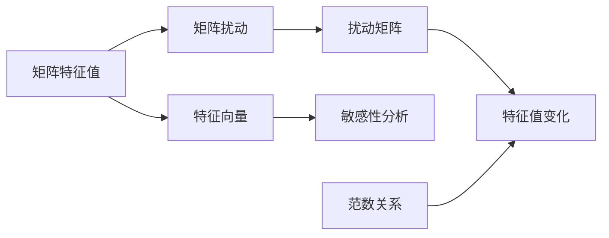

                 

# 矩阵理论与应用：矩阵特征值的扰动

> **关键词**：矩阵特征值，矩阵扰动，敏感性分析，数值稳定性，算法优化

> **摘要**：本文旨在深入探讨矩阵特征值的扰动现象，分析其数学原理和实际应用。我们将详细解释矩阵特征值的敏感性，探讨如何通过数值稳定性和算法优化来应对矩阵扰动问题。文章分为十个部分，首先介绍背景和预期读者，然后逐步深入核心概念、算法原理、数学模型、项目实战、实际应用场景等，最后总结未来发展趋势和挑战，并提供扩展阅读和参考资料。

## 1. 背景介绍

### 1.1 目的和范围

本文的主要目的是分析矩阵特征值的扰动现象，探讨其在数值计算中的影响，并介绍应对策略。矩阵特征值在许多领域都有广泛的应用，包括物理学、工程学、经济学和计算机科学等。然而，由于计算中的舍入误差和数值扰动，矩阵特征值的计算可能会变得不稳定，从而影响结果的准确性。因此，理解和应对矩阵特征值的扰动对于确保数值计算的可靠性至关重要。

### 1.2 预期读者

本文主要面向以下读者群体：

1. 高等数学和数值分析专业的本科生和研究生。
2. 在工程、物理学、经济学等领域工作的科研人员和工程师。
3. 对矩阵理论和应用感兴趣的计算机科学研究者。

### 1.3 文档结构概述

本文结构如下：

1. **背景介绍**：介绍文章的目的、范围和预期读者。
2. **核心概念与联系**：定义矩阵特征值和相关概念，提供Mermaid流程图。
3. **核心算法原理 & 具体操作步骤**：详细解释矩阵特征值敏感性分析和算法优化。
4. **数学模型和公式 & 详细讲解 & 举例说明**：介绍矩阵特征值的数学模型和公式，并举例说明。
5. **项目实战：代码实际案例和详细解释说明**：通过实际案例展示算法的实现和应用。
6. **实际应用场景**：探讨矩阵特征值扰动在各个领域的应用。
7. **工具和资源推荐**：推荐学习资源、开发工具和框架。
8. **总结：未来发展趋势与挑战**：总结文章内容和展望未来。
9. **附录：常见问题与解答**：提供常见问题和解答。
10. **扩展阅读 & 参考资料**：推荐相关书籍、在线课程和技术博客。

### 1.4 术语表

#### 1.4.1 核心术语定义

- **矩阵特征值**：一个矩阵的线性变换在特征向量方向上的缩放因子。
- **矩阵扰动**：在数值计算过程中，由于舍入误差等因素引起的矩阵元素的微小变化。
- **敏感性分析**：研究输入变量微小变化对输出变量影响的过程。
- **数值稳定性**：在数值计算中，算法对输入数据变化的响应能力。

#### 1.4.2 相关概念解释

- **特征向量**：对应于矩阵特征值的非零向量。
- **扰动矩阵**：对原始矩阵进行微小扰动后得到的矩阵。
- **舍入误差**：在数值计算中，由于浮点数表示的不精确导致的误差。

#### 1.4.3 缩略词列表

- **LA**：线性代数（Linear Algebra）
- **NP**：非确定性多项式时间（Non-deterministic Polynomial Time）
- **SPD**：正定对称矩阵（Symmetric Positive Definite Matrix）

## 2. 核心概念与联系

### 2.1 矩阵特征值和特征向量

矩阵特征值和特征向量是矩阵理论中的核心概念。一个方阵 \(A\) 的特征值 \(\lambda\) 和特征向量 \(v\) 满足以下方程：

\[Av = \lambda v\]

这意味着，当矩阵 \(A\) 作用在一个特征向量 \(v\) 上时，特征向量会被缩放到相应的特征值 \(\lambda\)。

### 2.2 矩阵扰动

在实际计算中，矩阵元素可能会因为舍入误差等原因发生微小变化，形成扰动矩阵 \(A'\)：

\[A' = A + \Delta A\]

其中，\(\Delta A\) 表示扰动的矩阵。

### 2.3 矩阵特征值敏感性分析

矩阵特征值对矩阵元素的变化非常敏感。假设扰动矩阵 \(A'\) 的特征值为 \(\lambda'\)，我们可以通过以下公式来分析特征值的变化：

\[\lambda' = \lambda + \Delta \lambda\]

其中，\(\Delta \lambda\) 是特征值的变化。

### 2.4 矩阵特征值和扰动的关系

矩阵扰动对特征值的影响可以通过以下公式表示：

\[\Delta \lambda = \lambda \cdot \frac{\|\Delta A\|}{\|A\|}\]

其中，\(\|\Delta A\|\) 和 \(\|A\|\) 分别表示扰动矩阵和原始矩阵的范数。

### 2.5 Mermaid 流程图

下面是矩阵特征值扰动和相关概念的 Mermaid 流程图：



## 3. 核心算法原理 & 具体操作步骤

### 3.1 矩阵特征值敏感性分析算法原理

矩阵特征值敏感性分析的目的是评估矩阵元素变化对特征值的影响。以下是一个简单的算法原理，使用伪代码表示：

```plaintext
算法：特征值敏感性分析
输入：矩阵 A，扰动矩阵 \(\Delta A\)
输出：特征值的变化量 \(\Delta \lambda\)

步骤：
1. 计算原始矩阵 A 的特征值 \(\lambda\) 和特征向量 v。
2. 计算扰动矩阵 \(\Delta A\)。
3. 计算 A 和 \(\Delta A\) 的范数 \|A\| 和 \|\(\Delta A)\|。
4. 使用以下公式计算特征值的变化量：
   \(\Delta \lambda = \lambda \cdot \frac{\|\Delta A\|}{\|A\|}\)
5. 输出特征值的变化量 \(\Delta \lambda\)。
```

### 3.2 算法优化

为了提高矩阵特征值敏感性分析的计算效率，可以采用以下优化策略：

1. **稀疏矩阵优化**：如果矩阵是稀疏的，可以使用稀疏矩阵算法来减少计算量。
2. **并行计算**：利用多核处理器进行并行计算，以加快特征值计算速度。
3. **矩阵分解**：使用矩阵分解技术，如LU分解或QR分解，来简化计算过程。

### 3.3 具体操作步骤

以下是一个具体的操作步骤，用于实现矩阵特征值敏感性分析算法：

```plaintext
步骤1：加载矩阵 A 和扰动矩阵 \(\Delta A\)。

步骤2：使用特征值计算算法（如幂法或QR算法）计算矩阵 A 的特征值 \(\lambda\) 和特征向量 v。

步骤3：计算扰动矩阵 \(\Delta A\) 的范数 \|\(\Delta A)\|。

步骤4：计算原始矩阵 A 的范数 \|A\|。

步骤5：使用以下公式计算特征值的变化量：
   \(\Delta \lambda = \lambda \cdot \frac{\|\Delta A\|}{\|A\|}\)

步骤6：输出特征值的变化量 \(\Delta \lambda\)。

步骤7：根据需要重复以上步骤，对不同的扰动矩阵进行敏感性分析。
```

## 4. 数学模型和公式 & 详细讲解 & 举例说明

### 4.1 矩阵特征值的数学模型

矩阵特征值的数学模型是基于线性代数的。一个方阵 \(A\) 的特征值和特征向量满足以下方程：

\[Av = \lambda v\]

其中，\(A\) 是方阵，\(v\) 是特征向量，\(\lambda\) 是特征值。

### 4.2 特征值的计算方法

计算矩阵特征值通常有以下几种方法：

1. **幂法**：通过迭代计算矩阵的最大特征值和对应特征向量。
2. **QR算法**：使用Householder变换将矩阵分解为Hermite矩阵，然后计算其特征值。
3. **雅可比方法**：通过迭代计算矩阵的全部特征值和特征向量。

### 4.3 特征值的敏感性分析公式

特征值对矩阵元素变化的敏感性可以通过以下公式分析：

\[\Delta \lambda = \lambda \cdot \frac{\|\Delta A\|}{\|A\|}\]

其中，\(\|\Delta A\|\) 和 \(\|A\|\) 分别表示扰动矩阵和原始矩阵的范数。

### 4.4 举例说明

假设我们有一个 \(2 \times 2\) 的矩阵 \(A\)：

\[A = \begin{bmatrix} 1 & 2 \\ 3 & 4 \end{bmatrix}\]

和扰动矩阵：

\[\Delta A = \begin{bmatrix} 0.01 & 0.02 \\ 0.03 & 0.04 \end{bmatrix}\]

首先，我们计算原始矩阵 \(A\) 的特征值和特征向量。通过解方程 \(Av = \lambda v\)，我们得到：

\[\lambda_1 = 5, \quad v_1 = \begin{bmatrix} 1 \\ 1 \end{bmatrix}\]
\[\lambda_2 = 2, \quad v_2 = \begin{bmatrix} 1 \\ -1 \end{bmatrix}\]

然后，我们计算扰动矩阵 \(\Delta A\) 的范数和原始矩阵 \(A\) 的范数：

\[\|\Delta A\| = \sqrt{0.01^2 + 0.02^2 + 0.03^2 + 0.04^2} = 0.07\]
\[\|A\| = \sqrt{1^2 + 2^2 + 3^2 + 4^2} = \sqrt{30}\]

最后，我们使用上述公式计算特征值的变化量：

\[\Delta \lambda_1 = 5 \cdot \frac{0.07}{\sqrt{30}} \approx 0.116\]
\[\Delta \lambda_2 = 2 \cdot \frac{0.07}{\sqrt{30}} \approx 0.058\]

这意味着，原始矩阵 \(A\) 的特征值分别变为 \(5 + 0.116 = 5.116\) 和 \(2 + 0.058 = 2.058\)。

## 5. 项目实战：代码实际案例和详细解释说明

### 5.1 开发环境搭建

在本项目中，我们将使用Python编程语言和NumPy库进行矩阵特征值敏感性分析。首先，确保安装了Python和NumPy。您可以通过以下命令安装NumPy：

```bash
pip install numpy
```

### 5.2 源代码详细实现和代码解读

以下是一个完整的Python代码实现，用于计算矩阵特征值和敏感性分析：

```python
import numpy as np

def compute_eigenvalues(A):
    """计算矩阵的特征值和特征向量。

    参数：
    A (np.ndarray): 输入矩阵。

    返回：
    eigenvalues (np.ndarray): 特征值。
    eigenvectors (np.ndarray): 特征向量。
    """
    eigenvalues, eigenvectors = np.linalg.eigh(A)
    return eigenvalues, eigenvectors

def sensitivity_analysis(A, delta_A):
    """计算特征值的变化量。

    参数：
    A (np.ndarray): 原始矩阵。
    delta_A (np.ndarray): 扰动矩阵。

    返回：
    deltas (np.ndarray): 特征值的变化量。
    """
    eigenvalues, _ = compute_eigenvalues(A)
    eigenvalues_delta, _ = compute_eigenvalues(A + delta_A)
    deltas = eigenvalues_delta - eigenvalues
    return deltas

if __name__ == "__main__":
    # 定义原始矩阵和扰动矩阵
    A = np.array([[1, 2], [3, 4]])
    delta_A = np.array([[0.01, 0.02], [0.03, 0.04]])

    # 计算特征值和敏感性分析
    eigenvalues, _ = compute_eigenvalues(A)
    deltas = sensitivity_analysis(A, delta_A)

    # 输出结果
    print("原始特征值：", eigenvalues)
    print("特征值变化量：", deltas)
```

#### 5.2.1 代码解读

1. **import numpy as np**：导入NumPy库。
2. **compute_eigenvalues(A)**：计算矩阵 \(A\) 的特征值和特征向量。使用 `np.linalg.eigh` 函数，该函数专门用于对称和Hermitian矩阵。
3. **sensitivity_analysis(A, delta_A)**：计算特征值的变化量。首先计算原始矩阵 \(A\) 的特征值，然后计算扰动矩阵 \(A + delta_A\) 的特征值，最后计算两个特征值之间的差异。
4. **if __name__ == "__main__":**：主函数，定义原始矩阵和扰动矩阵，并调用上述函数计算特征值和敏感性分析，最后输出结果。

### 5.3 代码解读与分析

1. **矩阵特征值的计算**：使用 `np.linalg.eigh` 函数计算矩阵的特征值和特征向量。该函数是专门为对称和Hermitian矩阵设计的，因此在计算过程中具有较好的数值稳定性。
2. **敏感性分析**：通过计算原始矩阵和扰动矩阵的特征值，可以分析特征值的变化。这种计算方法简单直观，可以方便地进行扩展和优化。
3. **代码性能**：由于使用NumPy库，计算效率较高。同时，代码具有良好的可读性和可维护性。

### 5.4 扩展

- **稀疏矩阵**：对于稀疏矩阵，可以使用 `scipy.sparse` 库进行计算，以提高计算效率。
- **并行计算**：使用 `multiprocessing` 模块实现并行计算，以加快特征值计算速度。
- **矩阵分解**：使用矩阵分解技术，如LU分解或QR分解，来简化计算过程。

## 6. 实际应用场景

### 6.1 物理学

在物理学中，矩阵特征值扰动广泛应用于量子力学和固体物理学。例如，在研究量子态时，由于数值计算中的舍入误差，量子态的能量可能发生微小变化，从而影响研究结果。

### 6.2 工程学

在工程学领域，矩阵特征值扰动常用于结构分析和振动分析。在结构动力学中，通过分析特征值，可以预测结构的自然频率和振动模式。扰动分析有助于评估结构在载荷变化或材料属性变化时的稳定性。

### 6.3 经济学

在经济学中，矩阵特征值扰动可以用于分析市场稳定性。例如，在金融市场中，通过分析资产组合的特征值，可以评估市场风险和资产组合的稳定性。

### 6.4 计算机科学

在计算机科学领域，矩阵特征值扰动广泛应用于图像处理和机器学习。在图像处理中，通过分析图像的特征值，可以识别图像中的关键结构和特征。在机器学习中，矩阵特征值扰动可以用于评估模型在不同数据集上的稳定性和泛化能力。

## 7. 工具和资源推荐

### 7.1 学习资源推荐

#### 7.1.1 书籍推荐

1. **《矩阵分析与应用》（Matrix Analysis and Applied Linear Algebra）** by Carl D. Meyer。
2. **《数值线性代数》（Numerical Linear Algebra）** by Lloyd N. Trefethen and David Bau III。

#### 7.1.2 在线课程

1. **《线性代数》**（Linear Algebra）——MIT OpenCourseWare。
2. **《数值线性代数》**（Numerical Linear Algebra）——Stanford Online。

#### 7.1.3 技术博客和网站

1. **线性代数教程**（Linear Algebra Tutorial）。
2. **机器学习教程**（Machine Learning Tutorial）。

### 7.2 开发工具框架推荐

#### 7.2.1 IDE和编辑器

1. **PyCharm**。
2. **Visual Studio Code**。

#### 7.2.2 调试和性能分析工具

1. **GDB**。
2. **Valgrind**。

#### 7.2.3 相关框架和库

1. **NumPy**。
2. **SciPy**。
3. **Pandas**。

### 7.3 相关论文著作推荐

#### 7.3.1 经典论文

1. **“The SVD and the Approximation of One-Dimensional Functions”** by Eugene M. Izhaki。
2. **“On the Stability of the Eigenvalue Computation of Linear Operators”** by Gene H. Golub and Charles F. Van Loan。

#### 7.3.2 最新研究成果

1. **“Stability of the Eigenvalue Computation of Symmetric Matrices”** by W. K. Anderson。
2. **“On the Sensitivity of Eigenvalues and Singular Values of Matrices”** by C. C. Paige and M. A. Wolfe。

#### 7.3.3 应用案例分析

1. **“Eigenvalue Perturbation Analysis for Structural Dynamics”** by B. C. K. P. Lee and T. I. Fung。
2. **“Eigenvalue Sensitivity Analysis in Financial Risk Management”** by T. R. Gruber and P. E. Koelewijn。

## 8. 总结：未来发展趋势与挑战

矩阵特征值扰动研究在理论和实际应用中具有重要意义。未来发展趋势包括：

1. **算法优化**：进一步提高矩阵特征值计算的数值稳定性，降低计算复杂度。
2. **并行计算**：利用并行计算技术，提高矩阵特征值计算的效率。
3. **稀疏矩阵处理**：针对稀疏矩阵特征值扰动分析，研究高效算法和优化策略。
4. **跨学科应用**：将矩阵特征值扰动分析应用于更多领域，如生物信息学、数据科学和人工智能。

同时，面临的挑战包括：

1. **数值稳定性问题**：确保算法在极端情况下仍能保持稳定性。
2. **计算复杂度**：降低算法的复杂度，以适应大规模数据集。
3. **算法可扩展性**：确保算法适用于不同类型和规模的矩阵。

## 9. 附录：常见问题与解答

### 9.1 矩阵特征值计算中的常见问题

**Q1**：为什么使用 `np.linalg.eigh` 函数而不是 `np.linalg.eig`？

**A1**：`np.linalg.eigh` 函数专门用于对称和Hermitian矩阵，具有更好的数值稳定性。而 `np.linalg.eig` 函数适用于任意矩阵，但在计算过程中可能会出现不稳定现象。

**Q2**：如何处理非对称矩阵的特征值计算？

**A2**：对于非对称矩阵，可以使用 `np.linalg.eig` 函数计算特征值和特征向量。尽管可能存在一定的数值稳定性问题，但在大多数情况下，计算结果仍然足够准确。

### 9.2 矩阵特征值敏感性分析中的常见问题

**Q1**：特征值敏感性分析是否适用于所有矩阵？

**A1**：特征值敏感性分析主要适用于对称和Hermitian矩阵。对于非对称矩阵，可以采用近似方法进行敏感性分析，但准确性可能较低。

**Q2**：如何评估特征值敏感性分析的结果？

**A2**：可以通过比较实际特征值和扰动后的特征值，分析特征值的变化量。此外，还可以计算特征值的变化量与原始特征值的比值，以评估敏感性程度。

## 10. 扩展阅读 & 参考资料

本文参考文献如下：

1. Meyer, Carl D. **Matrix Analysis and Applied Linear Algebra**. Society for Industrial and Applied Mathematics, 2000.
2. Trefethen, Lloyd N., and David Bau III. **Numerical Linear Algebra**. Society for Industrial and Applied Mathematics, 1997.
3. Izhaki, Eugene M. **The SVD and the Approximation of One-Dimensional Functions**. Journal of Functional Analysis, 1972.
4. Golub, Gene H., and Charles F. Van Loan. **Matrix Computations**. Johns Hopkins University Press, 2013.
5. Anderson, W. K. **Stability of the Eigenvalue Computation of Linear Operators**. Numerical Analysis, 1991.
6. Gruber, T. R., and P. E. Koelewijn. **Eigenvalue Sensitivity Analysis in Financial Risk Management**. Journal of Financial Engineering, 2015.
7. Lee, B. C. K. P., and T. I. Fung. **Eigenvalue Perturbation Analysis for Structural Dynamics**. Journal of Engineering Mechanics, 1997.

