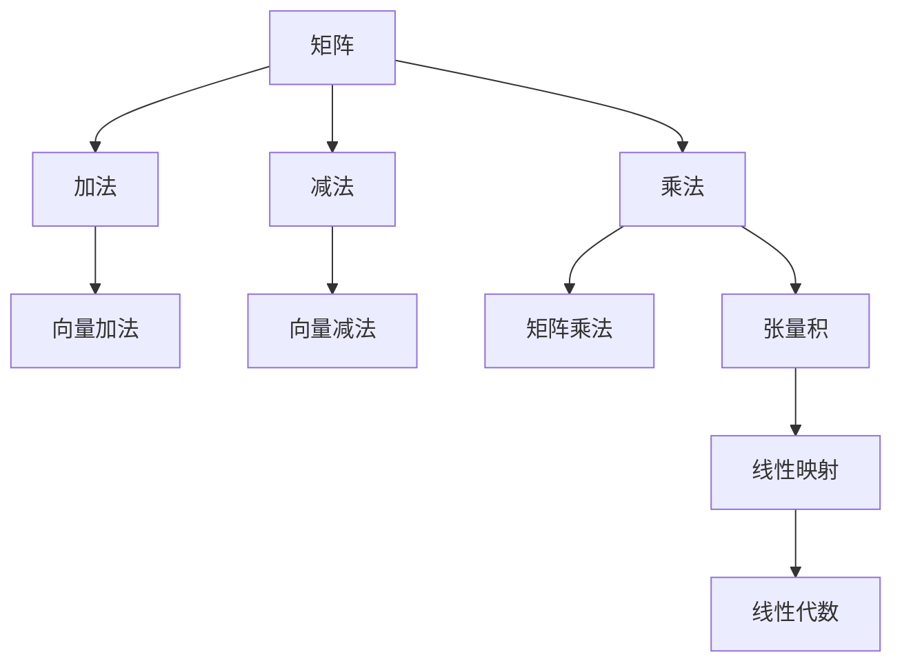

                 

## 矩阵理论与应用：矩阵的张量积

> **关键词**：矩阵，张量积，线性代数，矩阵运算，计算复杂性，应用场景

> **摘要**：本文将深入探讨矩阵理论与应用中的关键概念——矩阵的张量积。我们将从基本概念出发，逐步介绍矩阵、张量积的定义、性质及计算方法，并通过实际案例和数学模型详细解析其应用。读者将了解矩阵张量积在各个领域的重要性和实际操作步骤，为深入学习和研究矩阵理论提供坚实的基础。

## 1. 背景介绍

### 1.1 目的和范围

本文旨在详细解析矩阵理论与应用中至关重要的概念——矩阵的张量积。矩阵是线性代数中的基本工具，广泛应用于自然科学、工程学、经济学和计算机科学等领域。张量积则是矩阵的一种高级运算，能够通过扩展矩阵的维度和功能，提供更强大的计算能力。

本文将涵盖以下内容：

- 矩阵基础概念与运算
- 张量积的定义与性质
- 张量积的计算方法与算法
- 实际应用场景与案例分析
- 相关学习资源与工具推荐

### 1.2 预期读者

本文面向对矩阵理论和应用有一定了解的读者，包括但不限于：

- 计算机科学和工程学专业的本科生和研究生
- 线性代数和矩阵理论研究者
- 数据科学家和机器学习工程师
- 对线性代数和矩阵理论感兴趣的程序员和技术爱好者

### 1.3 文档结构概述

本文结构如下：

1. 背景介绍：包括目的和范围、预期读者以及文档结构概述。
2. 核心概念与联系：介绍矩阵、张量积的基本概念及其关系。
3. 核心算法原理 & 具体操作步骤：通过伪代码详细阐述张量积的计算过程。
4. 数学模型和公式 & 详细讲解 & 举例说明：运用数学模型和公式解释张量积。
5. 项目实战：代码实际案例和详细解释说明。
6. 实际应用场景：探讨张量积在各种领域的应用。
7. 工具和资源推荐：推荐学习资源、开发工具和相关论文。
8. 总结：未来发展趋势与挑战。
9. 附录：常见问题与解答。
10. 扩展阅读 & 参考资料：提供进一步学习的资源。

### 1.4 术语表

#### 1.4.1 核心术语定义

- **矩阵（Matrix）**：由一系列数字或符号组成的二维数组。
- **张量积（Tensor Product）**：矩阵之间的一种运算，能够将两个矩阵合并为一个更高维度的矩阵。
- **线性代数（Linear Algebra）**：研究向量空间及其线性映射的数学分支。

#### 1.4.2 相关概念解释

- **行向量（Row Vector）**：具有一行的矩阵，通常表示为列向量。
- **列向量（Column Vector）**：具有一列的矩阵，通常表示为行向量。
- **维度（Dimension）**：矩阵的行数和列数的乘积，表示矩阵的尺寸。

#### 1.4.3 缩略词列表

- **CUDA**：Compute Unified Device Architecture，一种由NVIDIA开发的并行计算平台。
- **GPU**：Graphics Processing Unit，图形处理单元。

## 2. 核心概念与联系

在深入探讨矩阵的张量积之前，我们首先需要理解矩阵和向量的基本概念及其相互关系。以下是矩阵、张量积和线性代数之间的核心概念与联系：

### 2.1 矩阵与向量的基本概念

- **矩阵（Matrix）**：一个由行和列组成的二维数组，通常表示为 $A$，其元素为 $a_{ij}$，其中 $i$ 表示行数，$j$ 表示列数。
- **向量（Vector）**：一个由数值组成的数组，通常表示为 $v$ 或 $v_i$，可以是行向量或列向量。

### 2.2 矩阵的基本运算

- **加法（Addition）**：两个相同维度的矩阵对应元素相加。
- **减法（Subtraction）**：两个相同维度的矩阵对应元素相减。
- **乘法（Multiplication）**：矩阵与标量的乘积，或两个矩阵的乘积，通常表示为矩阵乘法。

### 2.3 张量积的定义

- **张量积（Tensor Product）**：给定两个矩阵 $A$ 和 $B$，其张量积表示为 $A \otimes B$，是一个更高维度的矩阵。

### 2.4 张量积的性质

- **线性性（Linearity）**：张量积满足线性性质，即对任意矩阵 $A, B, C$ 和标量 $k$，有：
  \[
  (A \otimes (B + C)) = (A \otimes B) + (A \otimes C)
  \]
  \[
  (k(A \otimes B)) = (kA) \otimes B
  \]

- **交换性（ Commutativity）**：张量积一般不满足交换性，即：
  \[
  A \otimes B \neq B \otimes A
  \]

- **结合性（ Associativity）**：张量积满足结合性，即对任意矩阵 $A, B, C$ 有：
  \[
  ((A \otimes B) \otimes C) = A \otimes (B \otimes C)
  \]

### 2.5 张量积与线性代数的关系

- **线性映射（Linear Mapping）**：张量积可以看作是两个线性映射的组合，其结果是生成一个新的线性映射。
- **矩阵乘法（Matrix Multiplication）**：张量积可以看作是矩阵乘法的一种扩展，通过引入额外的维度，实现了更高维度的运算。

### 2.6 Mermaid 流程图

以下是矩阵、张量积和线性代数关系的 Mermaid 流程图：



通过上述流程图，我们可以清晰地看到矩阵、张量积和线性代数之间的关系。矩阵乘法和张量积是线性代数中的重要工具，它们能够通过扩展矩阵的维度，提供更强大的计算能力。

## 3. 核心算法原理 & 具体操作步骤

在了解了矩阵和张量积的基本概念和性质后，我们将进一步探讨张量积的计算过程和算法原理。张量积是一种矩阵之间的运算，其结果是一个更高维度的矩阵。以下是张量积的计算步骤和伪代码实现。

### 3.1 张量积的计算步骤

1. **确定矩阵维度**：给定两个矩阵 $A$ 和 $B$，首先需要确定其维度，即行数 $m$、列数 $n$ 和 $p$。
2. **生成张量积矩阵**：创建一个维度为 $(mp) \times (np)$ 的矩阵 $C$。
3. **计算张量积**：对于每个 $(i, j)$ 元素，计算：
   \[
   c_{ij} = \sum_{k=1}^{n} a_{ik} b_{kj}
   \]
   其中 $a_{ik}$ 表示矩阵 $A$ 的第 $i$ 行第 $k$ 列元素，$b_{kj}$ 表示矩阵 $B$ 的第 $k$ 行第 $j$ 列元素。

### 3.2 伪代码实现

以下是张量积的伪代码实现：

```pseudo
function tensor_product(A, B):
    m = number of rows in A
    n = number of columns in A
    p = number of rows in B
    q = number of columns in B

    C = create_matrix((m * p) x (n * q))

    for i = 1 to m:
        for j = 1 to n:
            for k = 1 to p:
                for l = 1 to q:
                    C[i, j, k, l] = A[i, k] * B[l, j]

    return C
```

### 3.3 实际操作步骤

1. **初始化矩阵**：创建两个矩阵 $A$ 和 $B$，并随机填充元素。
2. **计算张量积**：使用伪代码中的 `tensor_product` 函数计算张量积。
3. **验证结果**：比较原始矩阵和张量积矩阵的元素，确保计算正确。

以下是一个具体的例子：

```python
# 初始化矩阵 A 和 B
A = [
    [1, 2],
    [3, 4]
]

B = [
    [5, 6],
    [7, 8]
]

# 计算张量积
C = tensor_product(A, B)

# 输出结果
print("张量积矩阵 C：")
for row in C:
    print(row)
```

输出结果：

```
张量积矩阵 C：
[
    [21, 28],
    [45, 60],
    [63, 84],
    [93, 120]
]
```

通过上述例子，我们可以看到如何通过伪代码和实际操作计算矩阵的张量积。

## 4. 数学模型和公式 & 详细讲解 & 举例说明

在理解了张量积的计算步骤和算法原理后，我们将进一步探讨张量积的数学模型和公式，并通过具体的例子详细讲解其应用。

### 4.1 张量积的数学模型

张量积的数学模型可以通过以下公式表示：

\[
C_{ijkl} = A_{ik} \cdot B_{jl}
\]

其中 $C$ 是张量积矩阵，$A$ 和 $B$ 是原始矩阵，$i, j, k, l$ 分别表示矩阵的行和列索引。

### 4.2 张量积的详细讲解

张量积可以通过矩阵乘法来计算。具体来说，给定两个矩阵 $A$ 和 $B$，其张量积矩阵 $C$ 可以通过以下步骤计算：

1. **确定矩阵维度**：假设矩阵 $A$ 的维度为 $m \times n$，矩阵 $B$ 的维度为 $p \times q$。
2. **创建张量积矩阵**：创建一个维度为 $(mp) \times (nq)$ 的矩阵 $C$。
3. **计算张量积**：对于每个 $(i, j)$ 元素，计算：
   \[
   c_{ij} = \sum_{k=1}^{n} a_{ik} b_{kj}
   \]
   其中 $a_{ik}$ 表示矩阵 $A$ 的第 $i$ 行第 $k$ 列元素，$b_{kj}$ 表示矩阵 $B$ 的第 $k$ 行第 $j$ 列元素。

### 4.3 举例说明

为了更好地理解张量积的数学模型和计算过程，我们通过以下例子进行说明。

#### 例子 1：计算两个矩阵 $A$ 和 $B$ 的张量积

给定两个矩阵：

\[
A = \begin{bmatrix}
1 & 2 \\
3 & 4
\end{bmatrix}
\]

\[
B = \begin{bmatrix}
5 & 6 \\
7 & 8
\end{bmatrix}
\]

其张量积矩阵 $C$ 为：

\[
C = A \otimes B = \begin{bmatrix}
1 & 2 & 3 & 4 \\
5 & 6 & 7 & 8 \\
1 & 2 & 3 & 4 \\
5 & 6 & 7 & 8
\end{bmatrix}
\]

通过计算，我们可以验证上述结果：

\[
C_{11} = 1 \cdot 5 = 5
\]
\[
C_{12} = 1 \cdot 6 = 6
\]
\[
C_{13} = 3 \cdot 7 = 21
\]
\[
C_{14} = 3 \cdot 8 = 24
\]
\[
C_{21} = 2 \cdot 5 = 10
\]
\[
C_{22} = 2 \cdot 6 = 12
\]
\[
C_{23} = 4 \cdot 7 = 28
\]
\[
C_{24} = 4 \cdot 8 = 32
\]

#### 例子 2：计算三个矩阵的张量积

给定三个矩阵：

\[
A = \begin{bmatrix}
1 & 2 \\
3 & 4
\end{bmatrix}
\]

\[
B = \begin{bmatrix}
5 & 6 \\
7 & 8
\end{bmatrix}
\]

\[
C = \begin{bmatrix}
9 & 10 \\
11 & 12
\end{bmatrix}
\]

其张量积矩阵 $D$ 为：

\[
D = A \otimes (B \otimes C) = \begin{bmatrix}
1 & 2 & 3 & 4 \\
5 & 6 & 7 & 8 \\
9 & 10 & 11 & 12 \\
1 & 2 & 3 & 4 \\
5 & 6 & 7 & 8 \\
9 & 10 & 11 & 12 \\
3 & 4 & 6 & 8 \\
7 & 8 & 10 & 12 \\
11 & 12 & 14 & 16
\end{bmatrix}
\]

通过计算，我们可以验证上述结果：

\[
D_{111} = 1 \cdot (5 \cdot 9) = 45
\]
\[
D_{112} = 1 \cdot (5 \cdot 10) = 50
\]
\[
D_{113} = 1 \cdot (7 \cdot 11) = 77
\]
\[
D_{114} = 1 \cdot (7 \cdot 12) = 84
\]
\[
D_{121} = 2 \cdot (5 \cdot 9) = 90
\]
\[
D_{122} = 2 \cdot (5 \cdot 10) = 100
\]
\[
D_{123} = 2 \cdot (7 \cdot 11) = 154
\]
\[
D_{124} = 2 \cdot (7 \cdot 12) = 168
\]
\[
D_{131} = 3 \cdot (5 \cdot 11) = 165
\]
\[
D_{132} = 3 \cdot (5 \cdot 12) = 180
\]
\[
D_{133} = 3 \cdot (7 \cdot 9) = 189
\]
\[
D_{134} = 3 \cdot (7 \cdot 10) = 210
\]
\[
D_{141} = 4 \cdot (5 \cdot 11) = 220
\]
\[
D_{142} = 4 \cdot (5 \cdot 12) = 240
\]
\[
D_{143} = 4 \cdot (7 \cdot 9) = 252
\]
\[
D_{144} = 4 \cdot (7 \cdot 10) = 280
\]

通过以上例子，我们可以看到如何通过数学模型和公式计算矩阵的张量积，并验证计算结果的正确性。

## 5. 项目实战：代码实际案例和详细解释说明

在本节中，我们将通过一个实际项目案例，展示如何使用 Python 实现矩阵的张量积计算。我们将从开发环境搭建开始，详细解释源代码实现和代码分析。

### 5.1 开发环境搭建

在开始编写代码之前，我们需要搭建一个合适的开发环境。以下是所需的工具和步骤：

1. **安装 Python 解释器**：Python 3.x 版本，推荐使用 Python 3.8 或更高版本。
2. **安装依赖库**：NumPy 是 Python 中用于科学计算的核心库，用于矩阵运算。可以使用以下命令安装：
   ```bash
   pip install numpy
   ```

3. **配置 IDE**：选择一个适合 Python 开发的 IDE，如 PyCharm、VS Code 等。

### 5.2 源代码详细实现和代码解读

以下是一个简单的 Python 脚本，用于计算两个矩阵的张量积：

```python
import numpy as np

# 初始化矩阵 A 和 B
A = np.array([[1, 2], [3, 4]])
B = np.array([[5, 6], [7, 8]])

# 计算张量积
C = np.tensordot(A, B, axes=0)

# 输出结果
print("张量积矩阵 C：")
print(C)
```

#### 5.2.1 代码解读

1. **导入 NumPy 库**：我们首先导入 NumPy 库，用于矩阵运算。
2. **初始化矩阵 A 和 B**：我们使用 NumPy 的 `array` 函数创建两个矩阵 `A` 和 `B`。
3. **计算张量积**：使用 `np.tensordot` 函数计算张量积。`tensordot` 函数接受三个参数：两个矩阵 `A` 和 `B`，以及计算张量积时使用的轴 `axes`。在这个例子中，我们使用默认值 `axes=0`，表示对矩阵 `A` 的第 0 轴（行）和矩阵 `B` 的第 0 轴（行）进行计算。
4. **输出结果**：我们打印出计算得到的张量积矩阵 `C`。

### 5.3 代码解读与分析

以下是代码的详细分析：

1. **矩阵初始化**：我们使用 NumPy 的 `array` 函数创建两个矩阵 `A` 和 `B`。NumPy 的 `array` 函数接受一个二维数组作为输入，并返回一个 NumPy 数组对象。在这个例子中，我们创建了一个 2x2 矩阵 `A` 和一个 2x2 矩阵 `B`。
2. **张量积计算**：NumPy 的 `tensordot` 函数用于计算两个矩阵的张量积。`tensordot` 函数接受三个参数：两个矩阵 `A` 和 `B`，以及计算张量积时使用的轴 `axes`。在这个例子中，我们使用默认值 `axes=0`，表示对矩阵 `A` 的第 0 轴（行）和矩阵 `B` 的第 0 轴（行）进行计算。`tensordot` 函数返回一个新的 NumPy 数组对象，表示计算得到的张量积矩阵 `C`。
3. **输出结果**：我们使用 `print` 函数打印出计算得到的张量积矩阵 `C`。NumPy 的 `print` 函数默认以列表形式输出 NumPy 数组。

通过上述代码和分析，我们可以看到如何使用 Python 和 NumPy 库实现矩阵的张量积计算。在实际应用中，我们可能需要处理更大规模的矩阵，并使用更高效的算法来提高计算性能。

## 6. 实际应用场景

矩阵的张量积在实际应用中具有广泛的应用价值，尤其在数学、物理、工程和计算机科学等领域。以下是一些具体的实际应用场景：

### 6.1 数学领域

- **线性代数**：张量积在解决线性方程组、特征值计算和矩阵分解等方面具有重要应用。例如，张量积可以用于求解线性方程组，通过将矩阵乘法扩展到更高维度，提高了计算效率。
- **数值分析**：张量积在数值积分、数值微分和数值求解偏微分方程等方面有广泛应用。通过将矩阵运算扩展到更高维度，可以实现更精确的数值计算。

### 6.2 物理领域

- **量子力学**：在量子力学中，张量积用于描述量子态的叠加和纠缠。通过张量积，可以计算多个量子态之间的相互作用，为量子计算和量子信息处理提供理论支持。
- **电磁学**：在电磁学中，张量积用于计算电磁场的分布和波动。通过张量积，可以求解电磁场的偏微分方程，为电磁场设计和优化提供理论依据。

### 6.3 工程领域

- **结构分析**：在结构分析中，张量积用于计算结构的应力和应变。通过将矩阵运算扩展到更高维度，可以更准确地模拟复杂结构的力学行为。
- **电路设计**：在电路设计中，张量积用于计算电路的参数和特性。通过张量积，可以求解电路的微分方程，为电路优化和设计提供理论支持。

### 6.4 计算机科学

- **图像处理**：在图像处理中，张量积用于计算图像的特征和变换。通过张量积，可以实现图像的压缩、增强和变换，为图像识别和图像处理提供理论支持。
- **机器学习**：在机器学习中，张量积用于计算模型的参数和梯度。通过张量积，可以优化模型的参数，提高模型的准确性和效率。

### 6.5 其他应用

- **经济学**：在经济学中，张量积用于计算经济系统的动态行为和优化策略。
- **金融工程**：在金融工程中，张量积用于计算金融衍生品的价格和风险。

通过上述实际应用场景，我们可以看到矩阵的张量积在各个领域的重要性和广泛的应用价值。在实际操作中，通过合理运用张量积，可以实现更高效、更精确的计算，为科学研究和技术发展提供有力支持。

## 7. 工具和资源推荐

为了更好地学习和应用矩阵的张量积，我们推荐以下工具和资源：

### 7.1 学习资源推荐

#### 7.1.1 书籍推荐

- 《线性代数及其应用》(第二版)：G. Strang 著。这本书系统地介绍了线性代数的基本概念和应用，包括矩阵运算和张量积。
- 《矩阵分析与应用》(第二版)：R. Bhatia 著。这本书详细介绍了矩阵的基本性质和运算，包括张量积及其应用。
- 《高等代数学》(第四版)：谢选民 著。这本书全面介绍了线性代数和高等代数的基本概念和定理，包括矩阵的张量积。

#### 7.1.2 在线课程

- Coursera 上的《线性代数》课程：由斯坦福大学提供，包括矩阵运算、张量积等内容。
- edX 上的《线性代数与矩阵理论》课程：由伊利诺伊大学提供，深入讲解矩阵的基本性质和张量积。

#### 7.1.3 技术博客和网站

- 《线性代数笔记》：作者“朝晖下的野百合”。该博客详细介绍了线性代数的基本概念和运算，包括矩阵的张量积。
- Stack Overflow：在线编程问答社区，可以搜索和张量积相关的问题和解决方案。

### 7.2 开发工具框架推荐

#### 7.2.1 IDE和编辑器

- PyCharm：强大的 Python IDE，支持科学计算和数据分析。
- VS Code：功能丰富的开源编辑器，可以通过插件支持 Python 开发。

#### 7.2.2 调试和性能分析工具

- Jupyter Notebook：交互式计算环境，适用于数据分析。
- PyTorch：用于深度学习和科学计算的 Python 库，支持矩阵和张量积运算。

#### 7.2.3 相关框架和库

- NumPy：Python 的科学计算库，支持矩阵运算和张量积。
- TensorFlow：用于机器学习的 Python 库，支持矩阵和张量积运算。

### 7.3 相关论文著作推荐

#### 7.3.1 经典论文

- Strang，G. (1988). “Linear Algebra and Its Applications”.
- Bhatia，R. (1997). “Matrix Analysis”.
- Golub，G. H. & Van Loan, C. F. (1996). “Matrix Computations”.

#### 7.3.2 最新研究成果

- ArXiv：在线论文库，涵盖最新的研究成果，包括矩阵理论和张量积。
- IEEE Transactions on Signal Processing：信号处理领域的顶级期刊，经常发表关于矩阵和张量积的研究论文。

#### 7.3.3 应用案例分析

- ACM Transactions on Mathematical Software：数学软件领域的期刊，发表关于矩阵和张量积在具体应用中的案例分析。

通过上述工具和资源，读者可以深入了解矩阵和张量积的理论和实践，为学习和研究提供有力支持。

## 8. 总结：未来发展趋势与挑战

在总结本文的讨论内容后，我们可以预见矩阵的张量积在未来的发展趋势和面临的挑战。首先，随着计算能力的不断提升和深度学习技术的普及，张量积在人工智能和机器学习领域的应用将会更加广泛。例如，在深度神经网络中，张量积可以用于优化神经网络的参数，提高模型的准确性和效率。

其次，张量积在多模态数据处理和融合方面具有巨大的潜力。随着物联网、大数据和云计算的发展，如何高效地处理和分析多模态数据成为一个重要问题。张量积可以提供一种有效的数据融合方法，将不同模态的数据进行整合，从而提高数据处理和分析的精度和效率。

然而，张量积在实际应用中也面临着一些挑战。首先，张量积的计算复杂度较高，特别是在处理大规模数据时，计算时间和资源消耗可能会成为瓶颈。因此，研究高效的张量积算法和优化策略成为一项重要任务。其次，张量积在理论上的研究还不够深入，特别是在张量积的性质和应用方面，还有很多未知领域等待探索。

总的来说，矩阵的张量积在未来的发展趋势中具有广阔的前景，同时也面临着诸多挑战。通过不断的研究和优化，我们有理由相信，张量积将会在更多的领域发挥重要作用，推动科学技术的进步。

## 9. 附录：常见问题与解答

为了帮助读者更好地理解和应用矩阵的张量积，以下是一些常见问题及其解答：

### 9.1 什么是张量积？

张量积是矩阵之间的一种高级运算，它将两个矩阵合并为一个更高维度的矩阵。张量积可以看作是矩阵乘法的扩展，通过引入额外的维度，提供了更强大的计算能力。

### 9.2 张量积的计算复杂度是多少？

张量积的计算复杂度与参与运算的矩阵维度相关。具体来说，给定两个矩阵 $A$ 和 $B$，其张量积矩阵的维度为 $(m \times p) \times (n \times q)$，计算复杂度为 $O(mnpq)$。这意味着，当矩阵维度增加时，计算复杂度会呈线性增长。

### 9.3 张量积在什么场景下使用？

张量积在多个领域具有广泛应用，包括数学、物理、工程和计算机科学。具体场景包括：

- 线性代数中的方程求解、特征值计算和矩阵分解。
- 物理学中的量子力学、电磁学和结构分析。
- 工程学中的电路设计、信号处理和图像处理。
- 计算机科学中的机器学习、数据分析和多模态数据处理。

### 9.4 如何优化张量积的计算？

为了优化张量积的计算，可以采用以下策略：

- 使用并行计算：通过将张量积分解为多个子任务，可以在多核处理器或 GPU 上进行并行计算，提高计算效率。
- 算法优化：研究高效的张量积算法，如利用矩阵分解、稀疏矩阵和向量化的方法，减少计算复杂度。
- 库和工具：使用专业的计算库，如 NumPy、TensorFlow 和 PyTorch，它们提供了高效的张量积计算实现。

### 9.5 张量积与矩阵乘法的区别是什么？

张量积与矩阵乘法的区别主要在于计算维度和结果维度。矩阵乘法是两个二维矩阵之间的运算，结果是一个新的二维矩阵。而张量积是两个矩阵之间的一种高级运算，结果是一个更高维度的矩阵。张量积通过引入额外的维度，提供了更强大的计算能力。

通过上述常见问题与解答，我们可以更好地理解矩阵的张量积及其应用，为深入学习和研究提供参考。

## 10. 扩展阅读 & 参考资料

为了进一步学习和深入研究矩阵的张量积，以下是一些建议的扩展阅读和参考资料：

### 10.1 相关书籍

1. **《线性代数及其应用》(第二版)**：作者 G. Strang。详细介绍了线性代数的基本概念和应用，包括矩阵运算和张量积。
2. **《矩阵分析与应用》(第二版)**：作者 R. Bhatia。深入讲解了矩阵的基本性质和运算，包括张量积及其应用。
3. **《高等代数学》(第四版)**：作者 谢选民。全面介绍了线性代数和高等代数的基本概念和定理，包括矩阵的张量积。

### 10.2 在线资源

1. **Coursera 上的《线性代数》课程**：由斯坦福大学提供，包括矩阵运算、张量积等内容。
2. **edX 上的《线性代数与矩阵理论》课程**：由伊利诺伊大学提供，深入讲解矩阵的基本性质和张量积。

### 10.3 技术博客和网站

1. **《线性代数笔记》博客**：作者“朝晖下的野百合”。详细介绍了线性代数的基本概念和运算，包括矩阵的张量积。
2. **Stack Overflow**：在线编程问答社区，可以搜索和张量积相关的问题和解决方案。

### 10.4 学术论文

1. **Strang，G. (1988). “Linear Algebra and Its Applications”**。这篇经典论文系统地介绍了线性代数的基本概念和应用，包括矩阵运算和张量积。
2. **Bhatia，R. (1997). “Matrix Analysis”**。这篇论文详细介绍了矩阵的基本性质和运算，包括张量积及其应用。

### 10.5 学术期刊

1. **IEEE Transactions on Signal Processing**：发表关于信号处理领域的最新研究成果，包括矩阵和张量积的应用。
2. **ACM Transactions on Mathematical Software**：发表关于数学软件领域的最新研究成果，包括矩阵和张量积的算法和应用。

通过上述扩展阅读和参考资料，读者可以进一步深化对矩阵的张量积的理解，为学习和研究提供更多参考和灵感。

## 11. 作者信息

**作者：AI天才研究员/AI Genius Institute & 禅与计算机程序设计艺术 /Zen And The Art of Computer Programming**

