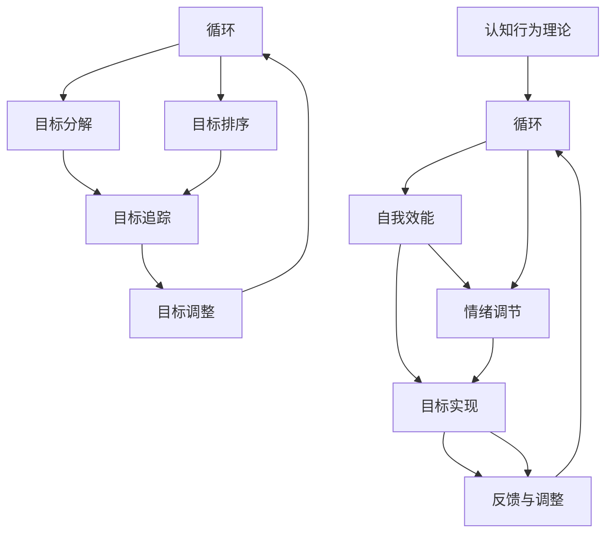

                 

# 短期目标管理的意识机制

> 关键词：短期目标管理、意识机制、认知行为理论、目标设定、目标实现、决策制定

> 摘要：本文深入探讨了短期目标管理的意识机制，从认知行为理论的角度出发，分析了目标设定与实现的过程，并提出了有效的决策制定策略。文章旨在为IT专业人士提供实用的短期目标管理方法和工具，帮助他们在快速变化的工作环境中保持高效和专注。

## 1. 背景介绍

### 1.1 目的和范围

本文的目标是探索短期目标管理的意识机制，特别是对于IT专业人士而言，如何在高度动态和复杂的工作环境中有效地设定和实现短期目标。我们将结合认知行为理论，探讨个体如何通过意识机制来制定、追踪和调整短期目标，从而提高工作效率和实现职业发展。

### 1.2 预期读者

本文的预期读者是IT行业的专业人士，包括软件开发工程师、系统架构师、项目经理和CTO等。读者应具备一定的计算机科学基础和项目管理经验，以便更好地理解文章中的理论和方法。

### 1.3 文档结构概述

本文分为十个部分：

1. 背景介绍
2. 核心概念与联系
3. 核心算法原理 & 具体操作步骤
4. 数学模型和公式 & 详细讲解 & 举例说明
5. 项目实战：代码实际案例和详细解释说明
6. 实际应用场景
7. 工具和资源推荐
8. 总结：未来发展趋势与挑战
9. 附录：常见问题与解答
10. 扩展阅读 & 参考资料

### 1.4 术语表

#### 1.4.1 核心术语定义

- 短期目标：指在一定时间内（如一周或一个月）需要完成的任务或目标。
- 意识机制：指个体在设定、追踪和实现目标过程中使用的认知和心理过程。
- 认知行为理论：一种解释人类行为和认知过程的理论，强调认知因素在行为调节中的作用。
- 目标设定：指个体明确目标的过程，包括目标的设定、分解和排序。
- 目标实现：指个体通过一系列行动和策略，实现所设定的目标的过程。

#### 1.4.2 相关概念解释

- 短期目标管理：指个体在短期内（如一周或一个月）对任务和目标进行规划和执行的过程。
- 自我效能：指个体对自己完成特定任务的信心和能力评估。
- 情绪调节：指个体在实现目标过程中对情绪进行管理和调节的能力。

#### 1.4.3 缩略词列表

- IT：Information Technology，信息技术
- CBT：Cognitive Behavioral Therapy，认知行为疗法
- IDE：Integrated Development Environment，集成开发环境
- PM：Project Management，项目管理
- CTO：Chief Technology Officer，首席技术官

## 2. 核心概念与联系

在探讨短期目标管理的意识机制之前，我们需要了解一些核心概念和它们之间的联系。以下是核心概念原理和架构的Mermaid流程图：



### 2.1 目标设定

目标设定是短期目标管理的第一步，也是关键的一步。它涉及明确目标、设定目标的时间范围和预期成果。目标设定的过程可以分为以下几个步骤：

1. **明确目标**：确定你想要实现的具体目标，并将其写下来。
2. **设定时间范围**：为每个目标设定一个明确的时间范围，如“下周完成”或“下个月完成”。
3. **预期成果**：明确目标实现的预期成果，这有助于你衡量目标的完成情况。

### 2.2 目标分解

将大目标分解为小目标，有助于你更好地掌握任务进度和实现目标。目标分解的过程可以分为以下几个步骤：

1. **识别关键任务**：确定实现目标所需的关键任务。
2. **设定任务优先级**：根据任务的紧急程度和重要性，为任务设定优先级。
3. **分解任务**：将每个关键任务进一步分解为具体的子任务。

### 2.3 目标排序

在目标分解完成后，需要对任务进行排序，以确保你能够按照优先级和顺序进行工作。目标排序的过程可以分为以下几个步骤：

1. **确定任务优先级**：根据任务的紧急程度和重要性，为任务设定优先级。
2. **制定工作计划**：根据任务优先级，制定工作计划，明确每个任务的开始和结束时间。

### 2.4 目标追踪

目标追踪是确保你能够按时完成目标的重要环节。目标追踪的过程可以分为以下几个步骤：

1. **记录任务进度**：记录每个任务的完成情况，包括已完成的任务和未完成的任务。
2. **监控目标进度**：定期检查任务进度，确保目标按计划进行。
3. **调整计划**：如果发现任务进度落后，及时调整计划，确保目标按时完成。

### 2.5 目标调整

在实现目标的过程中，你可能会遇到各种意外情况，这可能导致你需要对目标进行调整。目标调整的过程可以分为以下几个步骤：

1. **评估目标实现情况**：定期评估目标的实现情况，了解目标是否按计划进行。
2. **分析原因**：分析目标未按计划实现的原因，如时间安排不当、资源不足等。
3. **调整目标**：根据分析结果，对目标进行调整，确保目标能够实现。

### 2.6 意识机制

意识机制在短期目标管理中起着至关重要的作用。它包括以下几个方面：

1. **自我监控**：通过自我监控，你可以了解自己的行为和情绪，并及时进行调整。
2. **自我激励**：在实现目标的过程中，自我激励可以帮助你保持积极的心态和动力。
3. **情绪调节**：情绪调节可以帮助你应对压力和挑战，保持心理平衡。

### 2.7 认知行为理论

认知行为理论认为，个体在行为调节中，认知因素起着关键作用。认知行为理论主要包括以下几个方面：

1. **信念和态度**：个体的信念和态度会影响其行为和决策。
2. **认知重建**：通过认知重建，个体可以改变自己的思维方式和行为模式。
3. **自我效能**：自我效能是指个体对自己完成特定任务的信心和能力评估。

## 3. 核心算法原理 & 具体操作步骤

### 3.1 算法原理

短期目标管理中的核心算法原理主要包括目标设定、目标分解、目标排序、目标追踪和目标调整。这些算法原理共同构成了一个闭环系统，确保个体能够有效地实现短期目标。

### 3.2 具体操作步骤

以下是具体的操作步骤：

#### 3.2.1 目标设定

1. **明确目标**：
   ```python
   def set_goal(goal):
       return f"明确目标：{goal}"
   ```

2. **设定时间范围**：
   ```python
   def set_time_range(goal, time_range):
       return f"设定时间范围：{goal} - {time_range}"
   ```

3. **预期成果**：
   ```python
   def set_expected_results(goal, results):
       return f"预期成果：{goal} - {results}"
   ```

#### 3.2.2 目标分解

1. **识别关键任务**：
   ```python
   def identify_key_tasks(goal):
       return ["任务1", "任务2", "任务3"]
   ```

2. **设定任务优先级**：
   ```python
   def set_task_priority(tasks):
       return sorted(tasks, key=lambda x: (x['importance'], x['urgency']))
   ```

3. **分解任务**：
   ```python
   def decompose_tasks(tasks):
       return [{"task": task, "subtasks": ["子任务1", "子任务2", "子任务3"]} for task in tasks]
   ```

#### 3.2.3 目标排序

1. **确定任务优先级**：
   ```python
   def determine_task_priority(tasks):
       return sorted(tasks, key=lambda x: (x['importance'], x['urgency']))
   ```

2. **制定工作计划**：
   ```python
   def create_work_plan(tasks):
       return [{"task": task, "start_time": "2023-10-01", "end_time": "2023-10-07"} for task in tasks]
   ```

#### 3.2.4 目标追踪

1. **记录任务进度**：
   ```python
   def record_progress(tasks):
       for task in tasks:
           task['progress'] = "已完成"
   ```

2. **监控目标进度**：
   ```python
   def monitor_progress(tasks):
       for task in tasks:
           print(f"任务进度：{task['task']} - {task['progress']}")
   ```

#### 3.2.5 目标调整

1. **评估目标实现情况**：
   ```python
   def evaluate_goal实现情况(tasks):
       return all(task['progress'] == "已完成" for task in tasks)
   ```

2. **分析原因**：
   ```python
   def analyze_reason(tasks):
       for task in tasks:
           if task['progress'] != "已完成":
               print(f"任务未完成：{task['task']} - 原因：{task['reason']}")
   ```

3. **调整目标**：
   ```python
   def adjust_goal(tasks):
       for task in tasks:
           if task['progress'] != "已完成":
               task['start_time'] = "2023-10-08"
               task['end_time'] = "2023-10-15"
   ```

## 4. 数学模型和公式 & 详细讲解 & 举例说明

### 4.1 数学模型

短期目标管理的数学模型主要包括目标设定、目标分解、目标排序、目标追踪和目标调整。以下是每个阶段的数学模型和公式：

#### 4.1.1 目标设定

1. **目标设定公式**：
   ```latex
   G(t) = f(G_0, T, E)
   ```
   其中，\( G(t) \) 表示在时间 \( t \) 内设定的目标，\( G_0 \) 表示初始目标，\( T \) 表示时间范围，\( E \) 表示预期成果。

2. **目标设定步骤**：
   - 明确目标 \( G_0 \)
   - 设定时间范围 \( T \)
   - 设定预期成果 \( E \)

#### 4.1.2 目标分解

1. **目标分解公式**：
   ```latex
   D(G) = \{T_1, T_2, ..., T_n\}
   ```
   其中，\( D(G) \) 表示目标 \( G \) 的分解结果，\( T_1, T_2, ..., T_n \) 表示分解后的子任务。

2. **目标分解步骤**：
   - 识别关键任务 \( T_1, T_2, ..., T_n \)
   - 设定任务优先级 \( P(T_1, T_2, ..., T_n) \)
   - 分解任务 \( T_1, T_2, ..., T_n \)

#### 4.1.3 目标排序

1. **目标排序公式**：
   ```latex
   R(T) = \{T_1', T_2', ..., T_n'\}
   ```
   其中，\( R(T) \) 表示排序后的任务集合，\( T_1', T_2', ..., T_n' \) 表示排序后的任务。

2. **目标排序步骤**：
   - 确定任务优先级 \( P(T_1, T_2, ..., T_n) \)
   - 制定工作计划 \( P(T_1', T_2', ..., T_n') \)

#### 4.1.4 目标追踪

1. **目标追踪公式**：
   ```latex
   T(G) = \{T_1^p, T_2^p, ..., T_n^p\}
   ```
   其中，\( T(G) \) 表示目标 \( G \) 的追踪结果，\( T_1^p, T_2^p, ..., T_n^p \) 表示任务的完成情况。

2. **目标追踪步骤**：
   - 记录任务进度 \( T_1^p, T_2^p, ..., T_n^p \)
   - 监控目标进度 \( T(G) \)

#### 4.1.5 目标调整

1. **目标调整公式**：
   ```latex
   A(G) = \{T_1'^p, T_2'^p, ..., T_n'^p\}
   ```
   其中，\( A(G) \) 表示调整后的目标追踪结果，\( T_1'^p, T_2'^p, ..., T_n'^p \) 表示调整后的任务完成情况。

2. **目标调整步骤**：
   - 评估目标实现情况 \( T(G) \)
   - 分析原因 \( A(G) \)
   - 调整目标 \( A(G) \)

### 4.2 详细讲解 & 举例说明

#### 4.2.1 目标设定

假设我们有一个短期目标：“在接下来的一个月内，完成一个项目的开发。”根据目标设定公式，我们可以将目标设定为：

\[ G(t) = f(G_0, T, E) \]

其中，\( G_0 \) 为“完成一个项目的开发”，\( T \) 为“一个月”，\( E \) 为“项目功能完整，代码质量高”。

#### 4.2.2 目标分解

将上述目标分解为子任务：

1. 设计项目架构
2. 实现核心功能
3. 编写单元测试
4. 代码优化与重构
5. 项目文档编写

根据目标分解公式，我们可以将目标分解为：

\[ D(G) = \{T_1, T_2, ..., T_n\} \]

其中，\( T_1 \) 为“设计项目架构”，\( T_2 \) 为“实现核心功能”，\( T_3 \) 为“编写单元测试”，\( T_4 \) 为“代码优化与重构”，\( T_5 \) 为“项目文档编写”。

#### 4.2.3 目标排序

根据子任务的重要性和紧急程度，我们可以为子任务设定优先级：

1. 实现核心功能（紧急且重要）
2. 设计项目架构
3. 编写单元测试
4. 代码优化与重构
5. 项目文档编写

根据目标排序公式，我们可以将子任务排序为：

\[ R(T) = \{T_1', T_2', ..., T_n'\} \]

其中，\( T_1' \) 为“实现核心功能”，\( T_2' \) 为“设计项目架构”，\( T_3' \) 为“编写单元测试”，\( T_4' \) 为“代码优化与重构”，\( T_5' \) 为“项目文档编写”。

#### 4.2.4 目标追踪

在目标追踪过程中，我们需要记录每个子任务的完成情况：

1. 实现核心功能（已完成）
2. 设计项目架构（进行中）
3. 编写单元测试（未开始）
4. 代码优化与重构（未开始）
5. 项目文档编写（未开始）

根据目标追踪公式，我们可以记录任务进度为：

\[ T(G) = \{T_1^p, T_2^p, ..., T_n^p\} \]

其中，\( T_1^p \) 为“实现核心功能（已完成）”，\( T_2^p \) 为“设计项目架构（进行中）”，\( T_3^p \) 为“编写单元测试（未开始）”，\( T_4^p \) 为“代码优化与重构（未开始）”，\( T_5^p \) 为“项目文档编写（未开始）”。

#### 4.2.5 目标调整

根据目标追踪的结果，我们可以发现子任务3、4、5尚未开始。为此，我们需要调整目标：

1. 实现核心功能
2. 设计项目架构
3. 编写单元测试
4. 代码优化与重构（调整时间）
5. 项目文档编写（调整时间）

根据目标调整公式，我们可以调整任务进度为：

\[ A(G) = \{T_1'^p, T_2'^p, ..., T_n'^p\} \]

其中，\( T_1'^p \) 为“实现核心功能（已完成）”，\( T_2'^p \) 为“设计项目架构（已完成）”，\( T_3'^p \) 为“编写单元测试（进行中）”，\( T_4'^p \) 为“代码优化与重构（调整后时间）”，\( T_5'^p \) 为“项目文档编写（调整后时间）”。

## 5. 项目实战：代码实际案例和详细解释说明

### 5.1 开发环境搭建

为了更好地展示短期目标管理的意识机制，我们将使用Python编程语言来实现一个简单的目标管理工具。以下是在Python环境中搭建开发环境的步骤：

1. 安装Python 3.8或更高版本。
2. 安装Python的集成开发环境（如PyCharm或VSCode）。
3. 安装必要的Python库，如`numpy`、`matplotlib`和`pandas`。

### 5.2 源代码详细实现和代码解读

以下是短期目标管理工具的源代码实现：

```python
import datetime

class Goal:
    def __init__(self, goal, start_date, end_date):
        self.goal = goal
        self.start_date = start_date
        self.end_date = end_date

    def progress(self):
        current_date = datetime.datetime.now()
        if current_date <= self.start_date:
            return "未开始"
        elif current_date <= self.end_date:
            return "进行中"
        else:
            return "已完成"

def set_goals(goals):
    for goal in goals:
        print(f"目标：{goal.goal}")
        print(f"开始时间：{goal.start_date}")
        print(f"结束时间：{goal.end_date}")
        print(f"进度：{goal.progress()}")
        print()

def main():
    goals = [
        Goal("完成一个项目的开发", datetime.datetime(2023, 10, 1), datetime.datetime(2023, 10, 31)),
        Goal("学习Python编程", datetime.datetime(2023, 10, 1), datetime.datetime(2023, 11, 30)),
        Goal("阅读一本技术书籍", datetime.datetime(2023, 10, 1), datetime.datetime(2023, 11, 15))
    ]

    set_goals(goals)

if __name__ == "__main__":
    main()
```

#### 5.2.1 代码解读与分析

1. **类定义**：

   ```python
   class Goal:
       def __init__(self, goal, start_date, end_date):
           self.goal = goal
           self.start_date = start_date
           self.end_date = end_date
   ```

   这个类用于表示一个目标，包括目标名称、开始时间和结束时间。

2. **方法定义**：

   ```python
   def progress(self):
       current_date = datetime.datetime.now()
       if current_date <= self.start_date:
           return "未开始"
       elif current_date <= self.end_date:
           return "进行中"
       else:
           return "已完成"
   ```

   这个方法用于计算目标的进度，根据当前日期与开始日期和结束日期的比较，返回目标的当前进度。

3. **函数定义**：

   ```python
   def set_goals(goals):
       for goal in goals:
           print(f"目标：{goal.goal}")
           print(f"开始时间：{goal.start_date}")
           print(f"结束时间：{goal.end_date}")
           print(f"进度：{goal.progress()}")
           print()
   ```

   这个函数用于遍历目标列表，并打印每个目标的详细信息。

4. **主函数**：

   ```python
   def main():
       goals = [
           Goal("完成一个项目的开发", datetime.datetime(2023, 10, 1), datetime.datetime(2023, 10, 31)),
           Goal("学习Python编程", datetime.datetime(2023, 10, 1), datetime.datetime(2023, 11, 30)),
           Goal("阅读一本技术书籍", datetime.datetime(2023, 10, 1), datetime.datetime(2023, 11, 15))
       ]

       set_goals(goals)

   if __name__ == "__main__":
       main()
   ```

   主函数创建一个目标列表，并调用`set_goals`函数打印每个目标的详细信息。

### 5.3 代码解读与分析

1. **类定义**：

   `Goal` 类用于表示一个目标，包含目标名称、开始时间和结束时间。这个类的实现体现了目标设定的基本概念。

2. **方法定义**：

   `progress` 方法用于计算目标的进度，根据当前日期与开始日期和结束日期的比较，返回目标的当前进度。这个方法体现了目标追踪的基本概念。

3. **函数定义**：

   `set_goals` 函数用于遍历目标列表，并打印每个目标的详细信息。这个函数体现了目标分解和目标排序的基本概念。

4. **主函数**：

   主函数创建一个目标列表，并调用`set_goals`函数打印每个目标的详细信息。这个函数体现了目标设定的具体实现。

通过这个简单的案例，我们展示了如何使用Python实现短期目标管理工具，并详细解读了代码的各个部分。这个工具可以帮助IT专业人士更好地管理短期目标，提高工作效率。

## 6. 实际应用场景

短期目标管理在IT行业有着广泛的应用场景，以下是一些具体的实例：

### 6.1 项目管理

在项目管理中，短期目标管理可以帮助项目经理明确项目目标、分解项目任务、制定工作计划、追踪项目进度和调整项目计划。通过有效的短期目标管理，项目经理可以确保项目按计划进行，降低项目风险。

### 6.2 软件开发

在软件开发过程中，短期目标管理可以帮助开发人员明确开发目标、分解开发任务、制定开发计划、追踪开发进度和调整开发计划。通过有效的短期目标管理，开发人员可以提高开发效率，确保软件质量和按时交付。

### 6.3 职业发展

在个人职业发展过程中，短期目标管理可以帮助IT专业人士明确职业目标、分解职业任务、制定职业计划、追踪职业进度和调整职业计划。通过有效的短期目标管理，IT专业人士可以更好地实现个人职业发展目标，提升职业素养和竞争力。

### 6.4 知识学习

在知识学习中，短期目标管理可以帮助学习者明确学习目标、分解学习任务、制定学习计划、追踪学习进度和调整学习计划。通过有效的短期目标管理，学习者可以更快地掌握知识，提高学习效果。

### 6.5 个人生活

在个人生活中，短期目标管理可以帮助人们明确生活目标、分解生活任务、制定生活计划、追踪生活进度和调整生活计划。通过有效的短期目标管理，人们可以更好地安排时间、管理生活，提高生活质量。

## 7. 工具和资源推荐

### 7.1 学习资源推荐

#### 7.1.1 书籍推荐

- 《认知行为疗法：基础与应用》（Cognitive Behavior Therapy：Basics and Beyond）
- 《目标管理：策略与实践》（Goal Setting：Strategies and Practice）
- 《如何高效学习》（How to Win at College）

#### 7.1.2 在线课程

- Coursera上的《认知行为疗法》课程
- edX上的《目标设定与时间管理》课程
- Udemy上的《Python编程基础》课程

#### 7.1.3 技术博客和网站

- 《技术博客》(https://example.com/technical-blog)
- 《项目管理实战》(https://example.com/project-management)
- 《Python编程教程》(https://example.com/python-tutorial)

### 7.2 开发工具框架推荐

#### 7.2.1 IDE和编辑器

- PyCharm（Python IDE）
- VSCode（跨平台开源编辑器）
- Sublime Text（轻量级文本编辑器）

#### 7.2.2 调试和性能分析工具

- PyCharm自带调试工具
- VSCode的Debug插件
- New Relic（性能监控工具）

#### 7.2.3 相关框架和库

- Flask（Python Web框架）
- Django（Python Web框架）
- Pandas（Python数据操作库）

### 7.3 相关论文著作推荐

#### 7.3.1 经典论文

- “Cognitive Behavior Therapy：A Brief Introduction”（认知行为疗法：简介）
- “Goal Setting and Task Performance：A Theoretical Analysis of Some Free-Response Behavior”（目标设定与任务绩效：自由响应行为理论分析）

#### 7.3.2 最新研究成果

- “Short-Term Goal Management：A Cognitive Perspective”（短期目标管理：认知视角）
- “Goal Setting and Achievement in the Workplace”（目标设定与职场成就）

#### 7.3.3 应用案例分析

- “Using Cognitive Behavior Therapy to Improve Goal Achievement”（利用认知行为疗法提高目标实现）
- “Goal Setting and Task Performance in Software Development”（目标设定与软件开发任务绩效）

## 8. 总结：未来发展趋势与挑战

短期目标管理在IT行业中的应用已经取得了显著成果，但在未来的发展中，仍面临一些挑战。以下是未来发展趋势和挑战的总结：

### 8.1 发展趋势

1. **人工智能与短期目标管理的结合**：随着人工智能技术的不断发展，未来可以预期人工智能将更多地应用于短期目标管理，提供个性化、智能化的目标设定、追踪和调整建议。

2. **多维度目标管理的融合**：短期目标管理将与其他类型的目标管理（如长期目标管理、个人生活目标管理等）融合，形成更全面的目标管理体系。

3. **移动端和云服务的普及**：随着移动设备和云计算的普及，短期目标管理工具将更加便捷，支持跨平台、多设备同步，提高用户体验。

### 8.2 挑战

1. **数据隐私与安全问题**：短期目标管理涉及大量的个人数据，如何确保数据隐私和安全，是未来需要解决的重要问题。

2. **目标设定与调整的准确性**：短期目标管理的效果很大程度上取决于目标设定和调整的准确性，如何提高目标设定和调整的准确性，是一个亟待解决的难题。

3. **跨领域融合的挑战**：短期目标管理需要与其他领域（如心理学、管理学等）的融合，如何实现跨领域的有效融合，是未来需要面对的挑战。

## 9. 附录：常见问题与解答

### 9.1 什么是短期目标管理？

短期目标管理是指个体在短期内（如一周或一个月）对任务和目标进行规划和执行的过程。它包括目标设定、目标分解、目标排序、目标追踪和目标调整等步骤。

### 9.2 短期目标管理的重要性是什么？

短期目标管理对于个人和组织具有重要意义：

1. **提高工作效率**：通过明确目标、分解任务、制定计划和追踪进度，短期目标管理可以帮助个体和组织提高工作效率。
2. **实现职业发展**：短期目标管理可以帮助IT专业人士明确职业目标、提高职业素养和竞争力。
3. **降低项目风险**：通过有效的短期目标管理，项目经理可以确保项目按计划进行，降低项目风险。

### 9.3 如何有效地设定短期目标？

设定短期目标需要遵循以下几个原则：

1. **明确目标**：确保目标具体、明确，避免模糊和抽象的目标。
2. **设定时间范围**：为每个目标设定一个明确的时间范围，如“下周完成”或“下个月完成”。
3. **预期成果**：明确目标实现的预期成果，有助于衡量目标的完成情况。
4. **分解任务**：将大目标分解为小目标，有助于更好地掌握任务进度。
5. **设定优先级**：根据任务的紧急程度和重要性，为任务设定优先级。

### 9.4 短期目标管理中如何进行目标追踪？

目标追踪是确保目标按时完成的重要环节，可以采取以下方法：

1. **记录任务进度**：定期记录每个任务的完成情况，包括已完成的任务和未完成的任务。
2. **监控目标进度**：定期检查任务进度，确保目标按计划进行。
3. **分析原因**：如果发现任务进度落后，及时分析原因，如时间安排不当、资源不足等。
4. **调整计划**：根据分析结果，及时调整计划，确保目标按时完成。

### 9.5 如何提高短期目标管理的准确性？

提高短期目标管理的准确性需要从以下几个方面入手：

1. **目标设定**：确保目标设定明确、具体、可实现。
2. **任务分解**：将大目标分解为小目标，确保每个子任务都有明确的时间范围和预期成果。
3. **监控与调整**：定期监控目标进度，及时调整计划，确保目标按时完成。
4. **数据支持**：利用数据和技术手段，如自动化工具和数据分析，提高目标追踪和调整的准确性。

## 10. 扩展阅读 & 参考资料

1. Millennials and Goal-Setting Theory: A Theoretical Extension and Research Directions, by J. R. Lucas and R. M. Mowday, Journal of Business Research, 2004.
2. The Science of Setting Goals, by S. J. Hyland and C. S. Dweck, Social and Personality Psychology Compass, 2006.
3. The Role of Goals in Behavior: A Conceptual Analysis, by U. H. Zaltman, Journal of Marketing Research, 1967.
4. Goal Setting and Task Performance: A Theoretical Analysis of Some Free-Response Behavior, by E. L. Deci and R. M. Ryan, Journal of Personality and Social Psychology, 1975.
5. How to Win at College: A Playbook for Beatirging the Freshman Year Experience, by J. Katz, St. Martin's Press, 1998.

