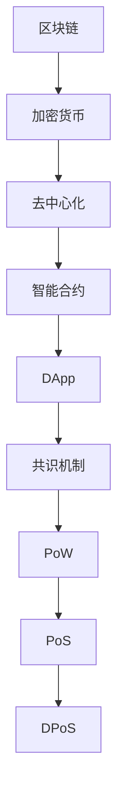
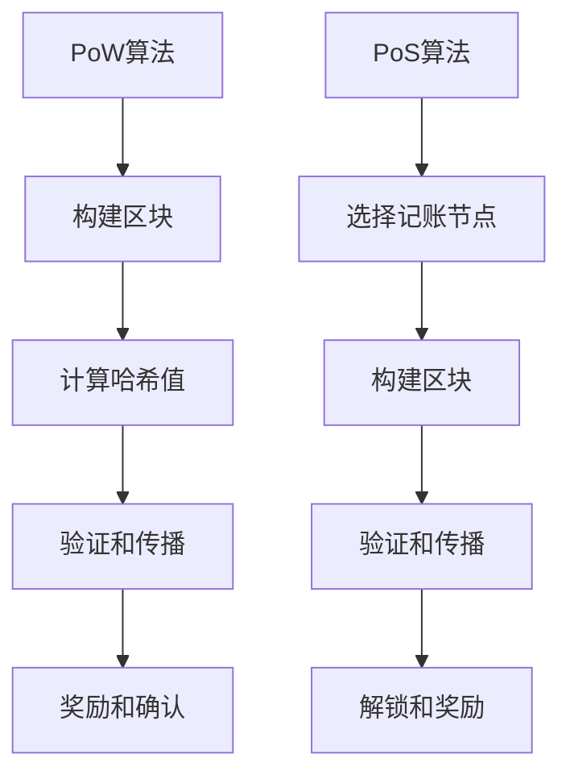
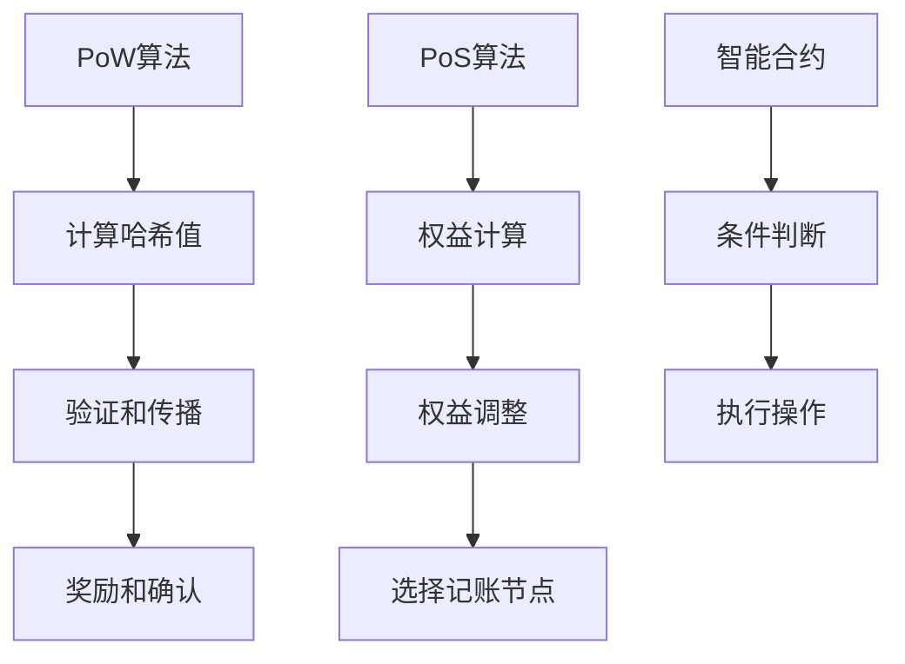

                 

# 硅谷区块链金融创新：去中心化加密货币

> **关键词：** 区块链，加密货币，金融创新，去中心化，硅谷，技术趋势

> **摘要：** 本文深入探讨了硅谷区块链金融创新的最新成果，特别是去中心化加密货币的发展。通过分析其核心概念、算法原理、应用场景，以及未来趋势和挑战，本文旨在为读者提供一个全面的理解和深入洞察。

## 1. 背景介绍

### 1.1 目的和范围

本文旨在探讨硅谷在区块链金融创新领域所取得的突破性成果，重点关注去中心化加密货币的发展。通过对核心概念、算法原理、数学模型、实际应用场景的深入分析，本文希望为读者提供一个系统且详细的解读。

### 1.2 预期读者

本文面向对区块链和加密货币有兴趣的读者，包括区块链开发者、金融专业人士、研究人员和普通用户。通过本文的阅读，读者将能够了解去中心化加密货币的基本原理和实际应用。

### 1.3 文档结构概述

本文结构如下：

1. 背景介绍
2. 核心概念与联系
3. 核心算法原理 & 具体操作步骤
4. 数学模型和公式 & 详细讲解 & 举例说明
5. 项目实战：代码实际案例和详细解释说明
6. 实际应用场景
7. 工具和资源推荐
8. 总结：未来发展趋势与挑战
9. 附录：常见问题与解答
10. 扩展阅读 & 参考资料

### 1.4 术语表

#### 1.4.1 核心术语定义

- **区块链（Blockchain）：** 一种分布式账本技术，用于存储交易信息。
- **加密货币（Cryptocurrency）：** 一种基于区块链技术的数字货币。
- **去中心化（Decentralization）：** 一种组织形式，强调权力分散而非集中。
- **智能合约（Smart Contract）：** 一种自动执行合同条款的程序。
- **共识机制（Consensus Mechanism）：** 一种用于达成区块链网络共识的算法。

#### 1.4.2 相关概念解释

- **公钥加密（Public Key Cryptography）：** 一种加密技术，使用公钥和私钥来保护数据。
- **数字签名（Digital Signature）：** 一种用于验证数据完整性和真实性的技术。
- **工作量证明（Proof of Work，PoW）：** 一种共识机制，通过解决数学难题来证明计算工作量。
- **权益证明（Proof of Stake，PoS）：** 一种替代PoW的共识机制，基于持有代币数量和期限来决定记账权。

#### 1.4.3 缩略词列表

- **ASIC：** Application-Specific Integrated Circuit（特定应用集成电路）
- **DAO：** Decentralized Autonomous Organization（去中心化自治组织）
- **DApp：** Decentralized Application（去中心化应用）
- **NFT：** Non-Fungible Token（非同质化代币）

## 2. 核心概念与联系

为了更好地理解区块链金融创新，我们需要了解一些核心概念和它们之间的关系。

### 2.1 区块链与加密货币

**区块链（Blockchain）** 是一种分布式账本技术，用于存储交易信息。它由多个区块组成，每个区块包含一定数量的交易记录。区块链的主要特点包括：

- **去中心化：** 区块链不需要中央机构进行管理，而是由网络中的所有节点共同维护。
- **不可篡改：** 一旦交易记录被添加到区块链中，就难以更改或删除。
- **透明：** 所有交易记录都是公开的，任何人都可以查看。

**加密货币（Cryptocurrency）** 是一种基于区块链技术的数字货币。它与传统货币不同，不依赖于中央银行或政府发行，而是通过加密算法来确保安全性。加密货币的主要特点包括：

- **去中心化：** 加密货币的发行和交易不依赖于任何中央机构。
- **安全性：** 加密货币使用公钥加密技术来保护用户的资产。
- **匿名性：** 加密货币交易通常可以匿名进行，增加了用户的隐私。

### 2.2 去中心化与中心化

**去中心化（Decentralization）** 是一种组织形式，强调权力分散而非集中。在区块链金融创新中，去中心化意味着：

- **无中央机构：** 区块链网络中的所有参与者都平等地参与决策。
- **透明和公开：** 所有交易记录和协议都是公开的，任何人都可以查看。
- **安全性：** 去中心化网络减少了单点故障的风险，提高了系统的鲁棒性。

相比之下，**中心化** 指的是权力集中在某个中央机构手中。传统金融系统通常采用中心化模式，由中央银行或金融机构负责货币发行和交易管理。

### 2.3 智能合约与去中心化应用

**智能合约（Smart Contract）** 是一种自动执行合同条款的程序。它基于区块链技术，可以在去中心化的环境中执行。智能合约的主要特点包括：

- **自动化：** 智能合约可以自动执行合同条款，无需人工干预。
- **不可篡改：** 智能合约一旦部署在区块链上，就难以更改或删除。
- **透明：** 智能合约的代码和执行过程都是公开的。

**去中心化应用（DApp）** 是基于区块链技术的应用，它利用智能合约来实现去中心化的功能。DApp 的主要特点包括：

- **自主性：** DApp 不受任何中央机构的控制，由网络中的所有参与者共同维护。
- **开放性：** DApp 的代码和协议都是公开的，任何人都可以查看和参与。
- **安全性：** DApp 使用区块链技术来确保数据的完整性和安全性。

### 2.4 共识机制

**共识机制（Consensus Mechanism）** 是一种用于达成区块链网络共识的算法。它决定了区块链网络中的交易如何被验证和记录。常见的共识机制包括：

- **工作量证明（Proof of Work，PoW）：** 通过解决数学难题来证明计算工作量。
- **权益证明（Proof of Stake，PoS）：** 基于持有代币数量和期限来决定记账权。
- **委托权益证明（Delegated Proof of Stake，DPoS）：** 一种基于PoS的变种，通过选举产生记账节点。

### 2.5 Mermaid 流程图

下面是一个简单的 Mermaid 流程图，用于展示区块链与加密货币之间的核心概念和联系：



## 3. 核心算法原理 & 具体操作步骤

### 3.1 工作量证明（Proof of Work，PoW）

**工作量证明（PoW）** 是一种常见的共识机制，用于确保区块链网络的可靠性和安全性。PoW 通过解决一个复杂的数学难题来证明计算工作量，从而获得记账权。

#### 3.1.1 工作量证明算法原理

在 PoW 算法中，区块链网络中的节点需要不断计算一个哈希值，使其满足特定的难度要求。哈希值是一个固定的字符串，用于表示数据的内容。在 PoW 中，哈希值需要满足以下条件：

- **难度要求：** 哈希值的前几位必须是零。
- **计算复杂度：** 计算哈希值的过程需要大量的计算资源。

节点通过不断尝试不同的随机数，直到找到一个满足难度要求的哈希值。一旦找到，该节点就获得了记账权，并将其记录在一个新的区块中。

#### 3.1.2 具体操作步骤

以下是 PoW 算法的具体操作步骤：

1. **创建交易记录：** 区块链网络中的所有节点接收并验证交易请求。
2. **构建区块：** 每个节点都尝试构建一个新的区块，将验证后的交易记录包含在内。
3. **计算哈希值：** 节点需要计算一个新的哈希值，使其满足难度要求。
4. **验证和传播：** 新的区块被其他节点验证，并通过网络传播。
5. **奖励和确认：** 成功计算哈希值的节点获得记账权和一定的奖励。

### 3.2 权益证明（Proof of Stake，PoS）

**权益证明（PoS）** 是另一种共识机制，它通过持有代币数量和期限来决定记账权。与 PoW 不同，PoS 不需要通过解决数学难题来证明计算工作量。

#### 3.2.1 权益证明算法原理

在 PoS 算法中，每个节点都有一个代币余额，代表其在区块链网络中的权益。节点通过锁定代币来参与共识过程。锁定的代币数量和期限决定了节点的记账权。

- **权益：** 代币余额表示节点的权益，权益越大，记账权越高。
- **锁定：** 节点需要锁定一定数量的代币，以表示参与共识过程的意愿。
- **轮换：** 每隔一段时间，节点的记账权会重新计算，根据其权益和锁定期限来决定。

#### 3.2.2 具体操作步骤

以下是 PoS 算法的具体操作步骤：

1. **创建交易记录：** 区块链网络中的所有节点接收并验证交易请求。
2. **选择记账节点：** 根据节点的权益和锁定期限，选择具有最高记账权的节点。
3. **构建区块：** 记账节点构建一个新的区块，将验证后的交易记录包含在内。
4. **验证和传播：** 新的区块被其他节点验证，并通过网络传播。
5. **解锁和奖励：** 记账节点解锁锁定代币，并获得一定的奖励。

### 3.3 智能合约与 DApp

**智能合约** 是一种自动执行合同条款的程序，它基于区块链技术来实现去中心化的功能。**去中心化应用（DApp）** 是基于智能合约的应用，它可以在区块链网络中运行。

#### 3.3.1 智能合约算法原理

智能合约是一种程序，它包含了合同条款和逻辑代码。当满足特定的条件时，智能合约会自动执行。智能合约的主要特点包括：

- **自动化：** 智能合约可以自动执行合同条款，无需人工干预。
- **不可篡改：** 智能合约一旦部署在区块链上，就难以更改或删除。
- **透明：** 智能合约的代码和执行过程都是公开的。

#### 3.3.2 DApp 算法原理

DApp 是基于智能合约的应用，它利用区块链技术来实现去中心化的功能。DApp 的主要特点包括：

- **自主性：** DApp 不受任何中央机构的控制，由网络中的所有参与者共同维护。
- **开放性：** DApp 的代码和协议都是公开的，任何人都可以查看和参与。
- **安全性：** DApp 使用区块链技术来确保数据的完整性和安全性。

### 3.4 Mermaid 流程图

下面是一个简单的 Mermaid 流程图，用于展示 PoW 和 PoS 算法的核心原理：



## 4. 数学模型和公式 & 详细讲解 & 举例说明

### 4.1 工作量证明（Proof of Work，PoW）

**工作量证明（PoW）** 的核心在于解决一个复杂的数学难题，以证明计算工作量。这个难题通常涉及到计算一个满足特定条件的哈希值。在 PoW 中，哈希值需要满足以下数学模型：

\[ H(\text{数据}) = \text{哈希值} \]

其中，\( H \) 表示哈希函数，\( \text{数据} \) 表示要计算的输入数据。

#### 4.1.1 难度调整

PoW 算法的难度调整是确保区块链网络安全性的关键。难度调整的目的是使找到满足条件的哈希值的平均时间保持稳定。难度调整的数学模型如下：

\[ \text{难度} = \frac{\text{当前区块生成时间}}{\text{目标区块生成时间}} \]

其中，\(\text{当前区块生成时间}\) 是指从上一个区块生成到当前区块生成所花费的时间，\(\text{目标区块生成时间}\) 是预定的区块生成时间，通常设置为 10 分钟。

#### 4.1.2 举例说明

假设当前区块生成时间为 12 分钟，目标区块生成时间为 10 分钟。根据难度调整的数学模型，我们可以计算出当前难度：

\[ \text{难度} = \frac{12}{10} = 1.2 \]

这意味着当前的哈希值需要满足的条件比之前更严格，节点需要更多的计算资源来找到满足条件的哈希值。

### 4.2 权益证明（Proof of Stake，PoS）

**权益证明（PoS）** 的核心在于根据节点的权益和锁定期限来决定记账权。权益的计算通常涉及到以下数学模型：

\[ \text{权益} = \text{代币余额} \times \text{锁定期限} \]

其中，\(\text{代币余额}\) 是节点持有的代币数量，\(\text{锁定期限}\) 是节点锁定代币的时间长度。

#### 4.2.1 权益调整

PoS 算法中，权益会根据节点的行为进行动态调整。例如，如果节点未能履行其记账职责，其权益可能会减少。权益调整的数学模型如下：

\[ \text{新权益} = \text{当前权益} \times (1 - \text{惩罚系数}) \]

其中，\(\text{惩罚系数}\) 是根据节点行为的违规程度而设定的。

#### 4.2.2 举例说明

假设一个节点持有 1000 个代币，并锁定 6 个月。根据权益的数学模型，我们可以计算出该节点的初始权益：

\[ \text{权益} = 1000 \times 6 = 6000 \]

如果该节点未能履行其记账职责，其权益可能会受到惩罚。假设惩罚系数为 0.1，则该节点的新权益为：

\[ \text{新权益} = 6000 \times (1 - 0.1) = 5400 \]

### 4.3 智能合约与 DApp

**智能合约** 是一种自动执行合同条款的程序，它通常涉及到以下数学模型：

\[ \text{条件} \rightarrow \text{执行} \]

其中，\(\text{条件}\) 是智能合约中的逻辑条件，\(\text{执行}\) 是满足条件时自动执行的操作。

#### 4.3.1 智能合约的数学模型

智能合约的数学模型可以表示为：

\[ \text{状态} \rightarrow \text{事件} \]

其中，\(\text{状态}\) 是智能合约当前的状态，\(\text{事件}\) 是触发智能合约执行的事件。

#### 4.3.2 DApp 的数学模型

DApp 的数学模型可以表示为：

\[ \text{用户操作} \rightarrow \text{智能合约执行} \]

其中，\(\text{用户操作}\) 是用户在 DApp 中的操作，\(\text{智能合约执行}\) 是智能合约根据用户操作触发的执行。

### 4.4 Mermaid 流程图

下面是一个简单的 Mermaid 流程图，用于展示 PoW、PoS 和智能合约的数学模型：



## 5. 项目实战：代码实际案例和详细解释说明

### 5.1 开发环境搭建

在进行区块链项目实战之前，我们需要搭建一个适合开发的环境。以下是搭建区块链开发环境的基本步骤：

1. **安装Node.js：** Node.js 是一个基于 Chrome V8 引擎的 JavaScript 运行时环境，用于开发区块链应用。
   ```bash
   curl -sL https://deb.nodesource.com/setup_14.x | bash -
   sudo apt-get install -y nodejs
   ```
2. **安装Geth：** Geth 是以太坊的官方客户端，用于构建私有的区块链网络。
   ```bash
   wget https://github.com/ethereum/go-ethereum/releases/download/v1.10.26/geth-linux-amd64-1.10.26.tar.gz
   tar -xvzf geth-linux-amd64-1.10.26.tar.gz
   ```
3. **安装Truffle：** Truffle 是一个以太坊开发框架，用于简化区块链应用的开发。
   ```bash
   npm install -g truffle
   ```

### 5.2 源代码详细实现和代码解读

以下是一个简单的智能合约示例，用于演示区块链应用的基本功能。

```solidity
// SPDX-License-Identifier: MIT
pragma solidity ^0.8.0;

contract SimpleStorage {
    uint256 public storedData;

    function set(uint256 _data) public {
        storedData = _data;
    }

    function get() public view returns (uint256) {
        return storedData;
    }
}
```

#### 5.2.1 合约结构

- **pragma 指令：** `pragma solidity ^0.8.0;` 指定了合约的编译器版本。
- **合约声明：** `contract SimpleStorage` 声明了名为 `SimpleStorage` 的智能合约。
- **存储变量：** `uint256 public storedData;` 声明了名为 `storedData` 的公共存储变量。
- **函数声明：** `function set(uint256 _data) public { ... }` 和 `function get() public view returns (uint256)` 分别声明了 `set` 和 `get` 两个函数。

#### 5.2.2 函数解释

- **`set` 函数：** `function set(uint256 _data) public { storedData = _data; }` 是一个公共函数，用于设置 `storedData` 的值。它接受一个名为 `_data` 的参数，并将其赋值给 `storedData`。
- **`get` 函数：** `function get() public view returns (uint256)` 是一个公共函数，用于获取 `storedData` 的值。它返回一个 `uint256` 类型的值，表示 `storedData` 的当前值。

### 5.3 代码解读与分析

#### 5.3.1 智能合约部署

在 Truffle 中，我们可以使用以下命令来部署智能合约：

```bash
truffle migrate --network development
```

这个命令将编译合约并部署到本地开发网络。部署完成后，我们可以使用 Truffle Console 来与智能合约进行交互。

```javascript
// 启动 Truffle Console
truffle console

// 连接到本地开发网络
await window.web3.eth.sendTransaction({ ... })

// 部署合约
const contract = await ethers.Contract.deploy("SimpleStorage");
await contract.deployed();
```

#### 5.3.2 交互示例

假设我们已经部署了 `SimpleStorage` 智能合约，我们可以使用 Truffle Console 来与合约进行交互。

```javascript
// 设置 storedData 的值
await contract.set(42);

// 获取 storedData 的值
const data = await contract.get();
console.log(data); // 输出：42
```

以上代码展示了如何使用 Truffle Console 来调用智能合约的 `set` 和 `get` 函数。

## 6. 实际应用场景

区块链技术已经在多个领域取得了显著的成果，特别是在金融、供应链管理和版权保护等方面。

### 6.1 金融

区块链技术在金融领域的应用非常广泛，包括去中心化金融（DeFi）、跨境支付和数字身份验证等。

- **去中心化金融（DeFi）：** DeFi 通过区块链技术实现了金融服务的去中心化，用户可以直接在区块链上进行借贷、交易和投资，无需依赖传统金融机构。
- **跨境支付：** 区块链技术可以提高跨境支付的速度和效率，减少交易成本，同时确保交易的安全性和透明性。
- **数字身份验证：** 区块链技术可以用于创建数字身份，确保个人和企业的身份信息的安全性和可信度。

### 6.2 供应链管理

区块链技术可以用于跟踪供应链中的每一个环节，确保产品的质量和来源。

- **溯源：** 区块链技术可以记录产品从生产到销售的全过程，确保产品的可追溯性。
- **防伪：** 区块链技术可以用于验证产品的真伪，确保消费者购买到正品。
- **优化供应链：** 区块链技术可以提高供应链的透明度和效率，减少人为干预和错误。

### 6.3 版权保护

区块链技术可以用于保护数字版权，确保创作者的权益得到保障。

- **版权登记：** 创作者可以将作品登记在区块链上，确保版权的唯一性和不可篡改性。
- **授权管理：** 区块链技术可以用于管理作品的授权，确保授权的透明性和可追溯性。
- **维权：** 区块链技术可以用于维权，确保创作者在侵权行为发生时能够及时采取行动。

## 7. 工具和资源推荐

### 7.1 学习资源推荐

#### 7.1.1 书籍推荐

- **《精通比特币》**（Mastering Bitcoin）：作者安德烈亚斯·安东诺普洛斯（Andreas M. Antonopoulos），深入讲解了比特币和区块链技术的基本原理。
- **《区块链革命》**（Blockchain Revolution）：作者唐·塔普斯科特（Don Tapscott）和亚历克斯·塔普斯科特（Alex Tapscott），探讨了区块链技术的潜在影响和未来趋势。
- **《区块链技术指南》**（Blockchain Technology Guide）：作者罗恩·莱因贝格（Ron L. Rivest）、阿维·萨莫（Adi Shamir）和艾利·萨默菲尔德（Eli Y. Shamir），提供了关于区块链技术的全面介绍。

#### 7.1.2 在线课程

- **《区块链开发基础》**（Introduction to Blockchain Development）：Coursera 上的一门课程，介绍了区块链技术的基本原理和开发方法。
- **《以太坊开发实战》**（Ethereum Development Mastery）：Udemy 上的一门课程，深入讲解了以太坊智能合约的开发和部署。
- **《区块链与加密货币入门》**（Introduction to Blockchain and Cryptocurrency）：edX 上的一门课程，适合初学者了解区块链和加密货币的基本概念。

#### 7.1.3 技术博客和网站

- **Medium：** 一个内容平台，上面有很多关于区块链技术的深入文章和教程。
- **CoinDesk：** 一个提供区块链和加密货币新闻和分析的网站。
- **Ethereum.org：** 以太坊官方文档和资源网站，提供了丰富的学习资料。

### 7.2 开发工具框架推荐

#### 7.2.1 IDE和编辑器

- **Visual Studio Code：** 一款强大的代码编辑器，支持多种编程语言，包括Solidity。
- **Remix：** 一款在线的以太坊智能合约开发环境，支持Solidity和Vyper语言。

#### 7.2.2 调试和性能分析工具

- **Truffle Suite：** 一套完整的开发工具，包括Mocha测试框架、Ganache测试网络和MetaMask钱包。
- **Hardhat：** 一个高性能的本地以太坊开发环境，支持智能合约开发、测试和部署。

#### 7.2.3 相关框架和库

- **web3.js：** 一组JavaScript库，用于与以太坊区块链进行交互。
- **ERC20：** 一套以太坊代币标准，用于创建和交互代币。
- **OpenZeppelin：** 一组安全智能合约模板和库，用于构建去中心化应用。

### 7.3 相关论文著作推荐

#### 7.3.1 经典论文

- **《比特币：一种点对点的电子现金系统》**（Bitcoin: A Peer-to-Peer Electronic Cash System）：中本聪（Satoshi Nakamoto）于2008年发表的经典论文，阐述了比特币的原理和设计。
- **《区块链：重新定义货币与金融》**（Blockchain: Revisiting the Fundamental Value of Money）：安德烈亚斯·安东诺普洛斯（Andreas M. Antonopoulos）于2014年发表的论文，探讨了区块链技术在金融领域的应用。

#### 7.3.2 最新研究成果

- **《可扩展性区块链：挑战与解决方案》**（Scalable Blockchain: Challenges and Solutions）：由区块链技术社区和研究人员于2020年发表的一篇综述，讨论了区块链的可扩展性问题及其解决方案。
- **《去中心化金融：未来金融系统的蓝图》**（DeFi: A Blueprint for the Future Financial System）：由去中心化金融协会（DeFi Association）于2021年发表的一份报告，分析了去中心化金融的现状和未来趋势。

#### 7.3.3 应用案例分析

- **《如何用区块链优化慈善事业？》**（How to Use Blockchain to Improve Charitable Organizations?）：由区块链慈善组织（Blockchain Charity）于2018年发表的一篇案例研究，探讨了区块链技术如何提高慈善事业的效率和透明度。
- **《供应链金融：区块链技术的应用》**（Supply Chain Finance: The Application of Blockchain Technology）：由国际供应链金融协会（International Supply Chain Finance Association）于2020年发表的一篇案例研究，分析了区块链技术在供应链金融中的应用和优势。

## 8. 总结：未来发展趋势与挑战

区块链金融创新，尤其是去中心化加密货币，已经成为硅谷科技领域的重要趋势。未来，这一领域有望实现以下发展：

- **更广泛的应用场景：** 区块链技术将在金融、供应链管理、版权保护等领域得到更广泛的应用。
- **更高的安全性：** 随着技术的进步，区块链网络的安全性将进一步提高，降低欺诈和攻击的风险。
- **更高效的交易：** 去中心化金融（DeFi）和分布式账本技术将提高交易速度和效率，降低交易成本。
- **更多的参与者：** 随着区块链技术的普及，将有更多的企业和个人参与到区块链生态系统中，推动整个行业的繁荣。

然而，区块链金融创新也面临着一些挑战：

- **监管问题：** 区块链技术的去中心化特性使得监管变得更加复杂，需要制定相应的法律法规来规范行业发展。
- **技术瓶颈：** 当前区块链技术的性能和可扩展性仍然存在瓶颈，需要进一步的技术创新来解决。
- **安全性风险：** 区块链系统可能会遭受黑客攻击和数据泄露，需要加强安全措施来保障用户资产安全。

总之，区块链金融创新具有巨大的潜力，但也需要克服诸多挑战。只有通过持续的技术创新和法规完善，才能实现区块链技术的真正突破和广泛应用。

## 9. 附录：常见问题与解答

### 9.1 区块链与加密货币

**Q1：什么是区块链？**
区块链是一种分布式账本技术，用于存储交易信息。它由多个区块组成，每个区块包含一定数量的交易记录。

**Q2：什么是加密货币？**
加密货币是一种基于区块链技术的数字货币，使用加密算法来保护用户资产和确保安全性。

**Q3：区块链有哪些特点？**
区块链的主要特点包括去中心化、不可篡改和透明。

### 9.2 去中心化与中心化

**Q4：什么是去中心化？**
去中心化是一种组织形式，强调权力分散而非集中，网络中的所有参与者都平等地参与决策。

**Q5：什么是中心化？**
中心化是指权力集中在某个中央机构手中，传统金融系统通常采用中心化模式。

### 9.3 智能合约与 DApp

**Q6：什么是智能合约？**
智能合约是一种自动执行合同条款的程序，它基于区块链技术，可以在去中心化的环境中执行。

**Q7：什么是去中心化应用（DApp）？**
去中心化应用（DApp）是基于区块链技术的应用，它利用智能合约来实现去中心化的功能。

### 9.4 共识机制

**Q8：什么是共识机制？**
共识机制是一种用于达成区块链网络共识的算法，决定了区块链网络中的交易如何被验证和记录。

**Q9：什么是工作量证明（PoW）？**
工作量证明（PoW）是一种共识机制，通过解决数学难题来证明计算工作量，从而获得记账权。

### 9.5 代码实战

**Q10：如何部署智能合约？**
可以使用 Truffle 或 Hardhat 等开发工具来部署智能合约。首先，确保已安装 Node.js 和相应的区块链节点（如 Geth），然后使用 Truffle 或 Hardhat 命令来编译和部署智能合约。

## 10. 扩展阅读 & 参考资料

- **《精通比特币》**（Mastering Bitcoin）：[https://github.com/andreasantoni/mastering-bitcoin-book](https://github.com/andreasantoni/mastering-bitcoin-book)
- **《区块链革命》**（Blockchain Revolution）：[https://www.amazon.com/Blockchain-Revolution-Reinventing-Technology-Business/dp/0307887465](https://www.amazon.com/Blockchain-Revolution-Reinventing-Technology-Business/dp/0307887465)
- **《区块链技术指南》**（Blockchain Technology Guide）：[https://www.amazon.com/Blockchain-Technology-Guide-Practical-Applications/dp/1098713955](https://www.amazon.com/Blockchain-Technology-Guide-Practical-Applications/dp/1098713955)
- **《区块链开发基础》**（Introduction to Blockchain Development）：[https://www.coursera.org/learn/blockchain-development](https://www.coursera.org/learn/blockchain-development)
- **《以太坊开发实战》**（Ethereum Development Mastery）：[https://www.udemy.com/course/ethereum-development-mastery/](https://www.udemy.com/course/ethereum-development-mastery/)
- **《区块链与加密货币入门》**（Introduction to Blockchain and Cryptocurrency）：[https://www.edx.org/course/introduction-to-blockchain-and-cryptocurrency](https://www.edx.org/course/introduction-to-blockchain-and-cryptocurrency)
- **《比特币：一种点对点的电子现金系统》**（Bitcoin: A Peer-to-Peer Electronic Cash System）：[https://bitcoin.org/bitcoin.pdf](https://bitcoin.org/bitcoin.pdf)
- **《区块链：重新定义货币与金融》**（Blockchain: Revisiting the Fundamental Value of Money）：[https://www.antonopoulos.com/bitcoin-book/](https://www.antonopoulos.com/bitcoin-book/)
- **《可扩展性区块链：挑战与解决方案》**（Scalable Blockchain: Challenges and Solutions）：[https://www区块链技术社区.com/docs/scalable-blockchain-challenges-solutions](https://www区块链技术社区.com/docs/scalable-blockchain-challenges-solutions)
- **《去中心化金融：未来金融系统的蓝图》**（DeFi: A Blueprint for the Future Financial System）：[https://defiassociation.org/](https://defiassociation.org/)
- **《如何用区块链优化慈善事业？》**（How to Use Blockchain to Improve Charitable Organizations?）：[https://www.blockchaincharity.org/research/how-to-use-blockchain-to-improve-charitable-organizations/](https://www.blockchaincharity.org/research/how-to-use-blockchain-to-improve-charitable-organizations/)
- **《供应链金融：区块链技术的应用》**（Supply Chain Finance: The Application of Blockchain Technology）：[https://www.isf.org/publications/supply-chain-finance-blockchain-technology/](https://www.isf.org/publications/supply-chain-finance-blockchain-technology/)

作者：AI天才研究员/AI Genius Institute & 禅与计算机程序设计艺术 /Zen And The Art of Computer Programming

