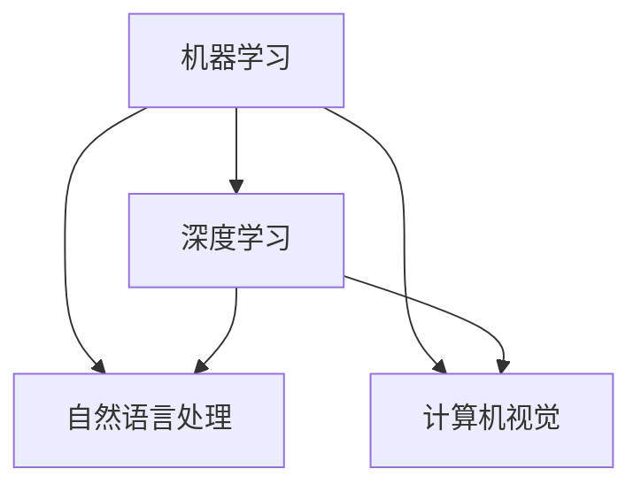

                 

# 硅谷的AI竞赛：贾扬清的观察，产品落地与基础研究并重

> 关键词：AI竞赛，产品落地，基础研究，硅谷，贾扬清，技术趋势

> 摘要：本文通过分析硅谷AI竞赛的现状，结合贾扬清的观察和经验，探讨了产品落地与基础研究并重的重要性。文章从背景介绍、核心概念与联系、核心算法原理、数学模型、实际应用场景等多个角度，深入剖析了AI技术在硅谷的发展趋势和挑战，为读者提供了有价值的参考。

## 1. 背景介绍

### 1.1 目的和范围

本文旨在通过探讨硅谷AI竞赛的现状，分析产品落地与基础研究并重的重要性，为我国AI领域的发展提供启示。文章将围绕以下几个方面展开：

- 硅谷AI竞赛的背景和发展趋势
- 贾扬清的观察与经验分享
- 产品落地与基础研究的关系
- AI技术在硅谷的应用场景
- 未来发展趋势与挑战

### 1.2 预期读者

本文适合对AI领域感兴趣的技术人员、研究者以及产业界从业者阅读。希望读者能通过本文，对硅谷AI竞赛的现状和产品落地与基础研究的关系有更深入的理解。

### 1.3 文档结构概述

本文结构如下：

1. 背景介绍：介绍本文的目的、范围、预期读者以及文档结构。
2. 核心概念与联系：介绍AI技术的核心概念及其关系。
3. 核心算法原理 & 具体操作步骤：讲解AI技术的核心算法原理和操作步骤。
4. 数学模型和公式 & 详细讲解 & 举例说明：介绍AI技术的数学模型和公式，并进行详细讲解和举例说明。
5. 项目实战：通过实际案例展示AI技术的应用。
6. 实际应用场景：分析AI技术在硅谷的实际应用场景。
7. 工具和资源推荐：推荐学习资源和开发工具。
8. 总结：总结未来发展趋势与挑战。
9. 附录：常见问题与解答。
10. 扩展阅读 & 参考资料：提供更多相关资料。

### 1.4 术语表

#### 1.4.1 核心术语定义

- AI竞赛：指针对人工智能技术的研究和比拼活动。
- 产品落地：指将研究成果转化为实际产品并进行推广和应用。
- 基础研究：指对人工智能技术进行深入的理论研究和算法优化。

#### 1.4.2 相关概念解释

- 硅谷：指美国加利福尼亚州旧金山湾区，是全球科技创新和创业的集聚地。
- 贾扬清：是清华大学计算机系教授、端到端人工智能学者，曾在Facebook AI研究院担任研究科学家。

#### 1.4.3 缩略词列表

- AI：人工智能
- ML：机器学习
- DL：深度学习
- NLP：自然语言处理
- CV：计算机视觉

## 2. 核心概念与联系

在探讨硅谷AI竞赛和产品落地与基础研究的关系之前，我们首先需要了解一些核心概念及其联系。

### 2.1 AI技术核心概念

AI技术主要包括以下核心概念：

- 机器学习（ML）：通过数据训练模型，使计算机具备自主学习和优化能力。
- 深度学习（DL）：基于多层神经网络，通过反向传播算法进行训练和优化。
- 自然语言处理（NLP）：使计算机理解和生成人类语言，实现人机交互。
- 计算机视觉（CV）：使计算机能够识别和理解图像和视频。

### 2.2 核心概念联系

这些核心概念相互关联，共同构成了AI技术体系。机器学习和深度学习是AI技术的核心，为计算机提供了自主学习和优化能力。自然语言处理和计算机视觉则是AI技术的应用方向，使计算机能够理解和处理人类语言、图像和视频。

### 2.3 Mermaid流程图

为了更清晰地展示AI技术的核心概念及其联系，我们可以使用Mermaid流程图进行表示：



## 3. 核心算法原理 & 具体操作步骤

在了解了AI技术的核心概念和联系后，我们接下来将探讨AI技术的核心算法原理和具体操作步骤。

### 3.1 机器学习算法原理

机器学习算法主要包括以下几种：

- 监督学习：利用已标注的数据训练模型，使模型能够对未知数据进行预测。
- 无监督学习：不依赖已标注的数据，通过数据内在结构进行学习。
- 强化学习：通过与环境的交互，使模型能够在动态环境中做出最优决策。

以下是监督学习算法的具体操作步骤：

1. 数据收集与预处理：收集大量带标签的数据，对数据进行清洗、归一化等预处理操作。
2. 特征提取：将原始数据转化为适合模型训练的特征向量。
3. 模型选择：选择合适的机器学习算法，如线性回归、决策树、支持向量机等。
4. 模型训练：使用已处理的数据对模型进行训练，优化模型参数。
5. 模型评估：使用测试集对模型进行评估，调整模型参数以获得更好的性能。

### 3.2 深度学习算法原理

深度学习算法是基于多层神经网络进行训练和优化的。以下是深度学习算法的具体操作步骤：

1. 网络结构设计：设计合适的神经网络结构，包括输入层、隐藏层和输出层。
2. 损失函数选择：选择合适的损失函数，如均方误差、交叉熵等，用于评估模型性能。
3. 优化算法选择：选择合适的优化算法，如梯度下降、Adam等，用于优化模型参数。
4. 模型训练：使用大量训练数据进行模型训练，优化网络结构、损失函数和优化算法。
5. 模型评估：使用测试集对模型进行评估，调整模型参数以获得更好的性能。

### 3.3 自然语言处理算法原理

自然语言处理算法主要包括词向量表示、序列模型、注意力机制等。以下是自然语言处理算法的具体操作步骤：

1. 词向量表示：将自然语言文本转化为数值向量，如Word2Vec、GloVe等。
2. 序列模型：使用递归神经网络（RNN）或长短时记忆网络（LSTM）等对序列数据进行建模。
3. 注意力机制：通过注意力机制对输入序列进行加权，提高模型对重要信息的关注。
4. 模型训练：使用大量文本数据进行模型训练，优化模型参数。
5. 模型评估：使用测试集对模型进行评估，调整模型参数以获得更好的性能。

### 3.4 计算机视觉算法原理

计算机视觉算法主要包括卷积神经网络（CNN）、目标检测、图像分割等。以下是计算机视觉算法的具体操作步骤：

1. 卷积神经网络（CNN）：通过卷积层、池化层、全连接层等对图像数据进行建模。
2. 目标检测：识别图像中的目标位置和类别，如YOLO、Faster R-CNN等。
3. 图像分割：将图像划分为若干区域，如FCN、Mask R-CNN等。
4. 模型训练：使用大量图像数据进行模型训练，优化模型参数。
5. 模型评估：使用测试集对模型进行评估，调整模型参数以获得更好的性能。

## 4. 数学模型和公式 & 详细讲解 & 举例说明

在了解了AI技术的核心算法原理和具体操作步骤后，我们接下来将探讨AI技术的数学模型和公式，并进行详细讲解和举例说明。

### 4.1 机器学习数学模型

机器学习中的数学模型主要包括线性回归、逻辑回归、支持向量机等。以下是这些模型的详细讲解和举例说明：

#### 4.1.1 线性回归

线性回归模型是一种监督学习算法，用于预测连续值输出。其数学模型如下：

\[ y = \beta_0 + \beta_1x_1 + \beta_2x_2 + ... + \beta_nx_n \]

其中，\( y \) 为输出值，\( x_1, x_2, ..., x_n \) 为输入特征，\( \beta_0, \beta_1, \beta_2, ..., \beta_n \) 为模型参数。

**举例说明**：

假设我们有一个线性回归模型，用于预测房价。输入特征为房屋面积（\( x_1 \)）和房屋年龄（\( x_2 \)），输出值为房价（\( y \)）。我们可以将数学模型表示为：

\[ y = \beta_0 + \beta_1x_1 + \beta_2x_2 \]

通过收集大量房屋数据，我们可以使用梯度下降算法优化模型参数，使模型能够准确预测房价。

#### 4.1.2 逻辑回归

逻辑回归模型是一种监督学习算法，用于预测二分类问题。其数学模型如下：

\[ P(y=1) = \frac{1}{1 + e^{-(\beta_0 + \beta_1x_1 + \beta_2x_2 + ... + \beta_nx_n)}} \]

其中，\( P(y=1) \) 为预测概率，\( y \) 为实际标签，\( x_1, x_2, ..., x_n \) 为输入特征，\( \beta_0, \beta_1, \beta_2, ..., \beta_n \) 为模型参数。

**举例说明**：

假设我们有一个逻辑回归模型，用于预测电子邮件是否为垃圾邮件。输入特征为邮件标题和正文（\( x_1, x_2 \)），输出值为0或1，其中1表示垃圾邮件，0表示正常邮件。我们可以将数学模型表示为：

\[ P(y=1) = \frac{1}{1 + e^{-(\beta_0 + \beta_1x_1 + \beta_2x_2)}} \]

通过收集大量电子邮件数据，我们可以使用梯度下降算法优化模型参数，使模型能够准确预测电子邮件是否为垃圾邮件。

#### 4.1.3 支持向量机

支持向量机是一种监督学习算法，用于分类问题。其数学模型如下：

\[ w \cdot x + b = 0 \]

其中，\( w \) 为模型参数，\( x \) 为输入特征，\( b \) 为偏置项。

**举例说明**：

假设我们有一个支持向量机模型，用于分类手写数字。输入特征为手写数字的像素值（\( x \)），输出值为0到9之间的数字，表示手写数字的类别。我们可以将数学模型表示为：

\[ w \cdot x + b = 0 \]

通过收集大量手写数字数据，我们可以使用支持向量机优化模型参数，使模型能够准确分类手写数字。

### 4.2 深度学习数学模型

深度学习中的数学模型主要包括卷积神经网络（CNN）、循环神经网络（RNN）、长短时记忆网络（LSTM）等。以下是这些模型的详细讲解和举例说明：

#### 4.2.1 卷积神经网络（CNN）

卷积神经网络是一种用于图像识别的深度学习模型。其数学模型如下：

\[ h_{l} = \sigma(\mathbf{W}_{l} \cdot \mathbf{h}_{l-1} + \mathbf{b}_{l}) \]

其中，\( h_{l} \) 为第\( l \)层的特征图，\( \mathbf{W}_{l} \) 为权重矩阵，\( \mathbf{h}_{l-1} \) 为前一层特征图，\( \mathbf{b}_{l} \) 为偏置项，\( \sigma \) 为激活函数。

**举例说明**：

假设我们有一个卷积神经网络模型，用于识别猫的图片。输入特征为猫的图片（\( \mathbf{x} \)），输出值为1或0，其中1表示图片中有猫，0表示图片中没有猫。我们可以将数学模型表示为：

\[ h_{l} = \sigma(\mathbf{W}_{l} \cdot \mathbf{x} + \mathbf{b}_{l}) \]

通过收集大量猫的图片数据，我们可以使用卷积神经网络优化模型参数，使模型能够准确识别猫的图片。

#### 4.2.2 循环神经网络（RNN）

循环神经网络是一种用于序列数据建模的深度学习模型。其数学模型如下：

\[ h_{t} = \sigma(\mathbf{W}_{h} \cdot \mathbf{h}_{t-1} + \mathbf{W}_{x} \cdot \mathbf{x}_{t} + \mathbf{b}) \]

其中，\( h_{t} \) 为第\( t \)个时间步的特征向量，\( \mathbf{W}_{h} \) 为隐藏层权重矩阵，\( \mathbf{W}_{x} \) 为输入层权重矩阵，\( \mathbf{x}_{t} \) 为第\( t \)个时间步的输入特征，\( \mathbf{b} \) 为偏置项，\( \sigma \) 为激活函数。

**举例说明**：

假设我们有一个循环神经网络模型，用于预测股票价格。输入特征为过去一段时间的股票价格数据（\( \mathbf{x}_{t-1}, \mathbf{x}_{t-2}, ..., \mathbf{x}_{t-L} \)），输出值为未来一段时间内的股票价格预测（\( \mathbf{y}_{t+1}, \mathbf{y}_{t+2}, ..., \mathbf{y}_{t+L} \)）。我们可以将数学模型表示为：

\[ h_{t} = \sigma(\mathbf{W}_{h} \cdot \mathbf{h}_{t-1} + \mathbf{W}_{x} \cdot \mathbf{x}_{t} + \mathbf{b}) \]

通过收集大量股票价格数据，我们可以使用循环神经网络优化模型参数，使模型能够准确预测股票价格。

#### 4.2.3 长短时记忆网络（LSTM）

长短时记忆网络是一种改进的循环神经网络，用于解决长序列依赖问题。其数学模型如下：

\[ \begin{aligned}
\mathbf{i}_{t} &= \sigma(\mathbf{W}_{i} \cdot \mathbf{h}_{t-1} + \mathbf{U}_{i} \cdot \mathbf{x}_{t} + \mathbf{b}_{i}) \\
\mathbf{f}_{t} &= \sigma(\mathbf{W}_{f} \cdot \mathbf{h}_{t-1} + \mathbf{U}_{f} \cdot \mathbf{x}_{t} + \mathbf{b}_{f}) \\
\mathbf{o}_{t} &= \sigma(\mathbf{W}_{o} \cdot \mathbf{h}_{t-1} + \mathbf{U}_{o} \cdot \mathbf{x}_{t} + \mathbf{b}_{o}) \\
\mathbf{c}_{t} &= \mathbf{f}_{t} \odot \mathbf{c}_{t-1} + \mathbf{i}_{t} \odot \tanh(\mathbf{c}_{t}) \\
\mathbf{h}_{t} &= \mathbf{o}_{t} \odot \tanh(\mathbf{c}_{t})
\end{aligned} \]

其中，\( \mathbf{i}_{t} \)、\( \mathbf{f}_{t} \)、\( \mathbf{o}_{t} \)、\( \mathbf{c}_{t} \)和\( \mathbf{h}_{t} \)分别为输入门、遗忘门、输出门、细胞状态和隐藏状态，\( \sigma \)为sigmoid函数，\( \odot \)为元素乘法，\( \tanh \)为双曲正切函数。

**举例说明**：

假设我们有一个长短时记忆网络模型，用于预测股票价格。输入特征为过去一段时间的股票价格数据（\( \mathbf{x}_{t-1}, \mathbf{x}_{t-2}, ..., \mathbf{x}_{t-L} \)），输出值为未来一段时间内的股票价格预测（\( \mathbf{y}_{t+1}, \mathbf{y}_{t+2}, ..., \mathbf{y}_{t+L} \)）。我们可以将数学模型表示为：

\[ \begin{aligned}
\mathbf{i}_{t} &= \sigma(\mathbf{W}_{i} \cdot \mathbf{h}_{t-1} + \mathbf{U}_{i} \cdot \mathbf{x}_{t} + \mathbf{b}_{i}) \\
\mathbf{f}_{t} &= \sigma(\mathbf{W}_{f} \cdot \mathbf{h}_{t-1} + \mathbf{U}_{f} \cdot \mathbf{x}_{t} + \mathbf{b}_{f}) \\
\mathbf{o}_{t} &= \sigma(\mathbf{W}_{o} \cdot \mathbf{h}_{t-1} + \mathbf{U}_{o} \cdot \mathbf{x}_{t} + \mathbf{b}_{o}) \\
\mathbf{c}_{t} &= \mathbf{f}_{t} \odot \mathbf{c}_{t-1} + \mathbf{i}_{t} \odot \tanh(\mathbf{c}_{t}) \\
\mathbf{h}_{t} &= \mathbf{o}_{t} \odot \tanh(\mathbf{c}_{t})
\end{aligned} \]

通过收集大量股票价格数据，我们可以使用长短时记忆网络优化模型参数，使模型能够准确预测股票价格。

### 4.3 自然语言处理数学模型

自然语言处理中的数学模型主要包括词向量表示、循环神经网络（RNN）、长短时记忆网络（LSTM）等。以下是这些模型的详细讲解和举例说明：

#### 4.3.1 词向量表示

词向量表示是将自然语言文本转化为数值向量的一种方法，如Word2Vec、GloVe等。以下是Word2Vec的数学模型：

\[ \mathbf{v}_{w} = \mathbf{W} \cdot \mathbf{h}_{w} \]

其中，\( \mathbf{v}_{w} \) 为词向量，\( \mathbf{W} \) 为权重矩阵，\( \mathbf{h}_{w} \) 为词的隐藏状态。

**举例说明**：

假设我们有一个Word2Vec模型，用于将自然语言文本转化为词向量。输入特征为文本中的每个单词（\( w \)），输出值为词向量（\( \mathbf{v}_{w} \)）。我们可以将数学模型表示为：

\[ \mathbf{v}_{w} = \mathbf{W} \cdot \mathbf{h}_{w} \]

通过训练大量文本数据，我们可以使用Word2Vec优化模型参数，使词向量能够有效表示自然语言文本。

#### 4.3.2 循环神经网络（RNN）

循环神经网络是一种用于序列数据建模的深度学习模型。其数学模型如下：

\[ \mathbf{h}_{t} = \sigma(\mathbf{W}_{h} \cdot \mathbf{h}_{t-1} + \mathbf{W}_{x} \cdot \mathbf{x}_{t} + \mathbf{b}) \]

其中，\( \mathbf{h}_{t} \) 为第\( t \)个时间步的特征向量，\( \mathbf{W}_{h} \) 为隐藏层权重矩阵，\( \mathbf{W}_{x} \) 为输入层权重矩阵，\( \mathbf{x}_{t} \) 为第\( t \)个时间步的输入特征，\( \mathbf{b} \) 为偏置项，\( \sigma \) 为激活函数。

**举例说明**：

假设我们有一个循环神经网络模型，用于翻译英语句子。输入特征为英语句子中的每个单词（\( \mathbf{x}_{t} \)），输出值为翻译后的中文句子（\( \mathbf{h}_{t} \)）。我们可以将数学模型表示为：

\[ \mathbf{h}_{t} = \sigma(\mathbf{W}_{h} \cdot \mathbf{h}_{t-1} + \mathbf{W}_{x} \cdot \mathbf{x}_{t} + \mathbf{b}) \]

通过训练大量中英对照文本数据，我们可以使用循环神经网络优化模型参数，使模型能够准确翻译英语句子。

#### 4.3.3 长短时记忆网络（LSTM）

长短时记忆网络是一种改进的循环神经网络，用于解决长序列依赖问题。其数学模型如下：

\[ \begin{aligned}
\mathbf{i}_{t} &= \sigma(\mathbf{W}_{i} \cdot \mathbf{h}_{t-1} + \mathbf{U}_{i} \cdot \mathbf{x}_{t} + \mathbf{b}_{i}) \\
\mathbf{f}_{t} &= \sigma(\mathbf{W}_{f} \cdot \mathbf{h}_{t-1} + \mathbf{U}_{f} \cdot \mathbf{x}_{t} + \mathbf{b}_{f}) \\
\mathbf{o}_{t} &= \sigma(\mathbf{W}_{o} \cdot \mathbf{h}_{t-1} + \mathbf{U}_{o} \cdot \mathbf{x}_{t} + \mathbf{b}_{o}) \\
\mathbf{c}_{t} &= \mathbf{f}_{t} \odot \mathbf{c}_{t-1} + \mathbf{i}_{t} \odot \tanh(\mathbf{c}_{t}) \\
\mathbf{h}_{t} &= \mathbf{o}_{t} \odot \tanh(\mathbf{c}_{t})
\end{aligned} \]

其中，\( \mathbf{i}_{t} \)、\( \mathbf{f}_{t} \)、\( \mathbf{o}_{t} \)、\( \mathbf{c}_{t} \)和\( \mathbf{h}_{t} \)分别为输入门、遗忘门、输出门、细胞状态和隐藏状态，\( \sigma \)为sigmoid函数，\( \odot \)为元素乘法，\( \tanh \)为双曲正切函数。

**举例说明**：

假设我们有一个长短时记忆网络模型，用于翻译英语句子。输入特征为英语句子中的每个单词（\( \mathbf{x}_{t} \)），输出值为翻译后的中文句子（\( \mathbf{h}_{t} \)）。我们可以将数学模型表示为：

\[ \begin{aligned}
\mathbf{i}_{t} &= \sigma(\mathbf{W}_{i} \cdot \mathbf{h}_{t-1} + \mathbf{U}_{i} \cdot \mathbf{x}_{t} + \mathbf{b}_{i}) \\
\mathbf{f}_{t} &= \sigma(\mathbf{W}_{f} \cdot \mathbf{h}_{t-1} + \mathbf{U}_{f} \cdot \mathbf{x}_{t} + \mathbf{b}_{f}) \\
\mathbf{o}_{t} &= \sigma(\mathbf{W}_{o} \cdot \mathbf{h}_{t-1} + \mathbf{U}_{o} \cdot \mathbf{x}_{t} + \mathbf{b}_{o}) \\
\mathbf{c}_{t} &= \mathbf{f}_{t} \odot \mathbf{c}_{t-1} + \mathbf{i}_{t} \odot \tanh(\mathbf{c}_{t}) \\
\mathbf{h}_{t} &= \mathbf{o}_{t} \odot \tanh(\mathbf{c}_{t})
\end{aligned} \]

通过训练大量中英对照文本数据，我们可以使用长短时记忆网络优化模型参数，使模型能够准确翻译英语句子。

### 4.4 计算机视觉数学模型

计算机视觉中的数学模型主要包括卷积神经网络（CNN）、目标检测、图像分割等。以下是这些模型的详细讲解和举例说明：

#### 4.4.1 卷积神经网络（CNN）

卷积神经网络是一种用于图像识别的深度学习模型。其数学模型如下：

\[ \mathbf{h}_{l} = \sigma(\mathbf{W}_{l} \cdot \mathbf{h}_{l-1} + \mathbf{b}_{l}) \]

其中，\( \mathbf{h}_{l} \) 为第\( l \)层的特征图，\( \mathbf{W}_{l} \) 为权重矩阵，\( \mathbf{h}_{l-1} \) 为前一层特征图，\( \mathbf{b}_{l} \) 为偏置项，\( \sigma \) 为激活函数。

**举例说明**：

假设我们有一个卷积神经网络模型，用于识别猫的图片。输入特征为猫的图片（\( \mathbf{x} \)），输出值为1或0，其中1表示图片中有猫，0表示图片中没有猫。我们可以将数学模型表示为：

\[ \mathbf{h}_{l} = \sigma(\mathbf{W}_{l} \cdot \mathbf{x} + \mathbf{b}_{l}) \]

通过收集大量猫的图片数据，我们可以使用卷积神经网络优化模型参数，使模型能够准确识别猫的图片。

#### 4.4.2 目标检测

目标检测是一种用于识别图像中的目标位置和类别的算法。常用的目标检测算法包括YOLO、Faster R-CNN等。以下是YOLO的数学模型：

\[ \mathbf{p}_{i,j} = \text{sigmoid}(\mathbf{W}_{p} \cdot \mathbf{h}_{l} + \mathbf{b}_{p}) \]

其中，\( \mathbf{p}_{i,j} \) 为第\( i \)个边界框在第\( j \)个特征图上的置信度，\( \mathbf{h}_{l} \) 为特征图，\( \mathbf{W}_{p} \) 为权重矩阵，\( \mathbf{b}_{p} \) 为偏置项，\( \text{sigmoid} \) 为激活函数。

**举例说明**：

假设我们有一个YOLO模型，用于识别图像中的目标。输入特征为图像（\( \mathbf{x} \)），输出值为目标的类别和位置。我们可以将数学模型表示为：

\[ \mathbf{p}_{i,j} = \text{sigmoid}(\mathbf{W}_{p} \cdot \mathbf{h}_{l} + \mathbf{b}_{p}) \]

通过训练大量图像数据，我们可以使用YOLO优化模型参数，使模型能够准确识别图像中的目标。

#### 4.4.3 图像分割

图像分割是一种将图像划分为若干区域的方法。常用的图像分割算法包括FCN、Mask R-CNN等。以下是FCN的数学模型：

\[ \mathbf{h}_{l} = \sigma(\mathbf{W}_{l} \cdot \mathbf{h}_{l-1} + \mathbf{b}_{l}) \]

其中，\( \mathbf{h}_{l} \) 为第\( l \)层的特征图，\( \mathbf{W}_{l} \) 为权重矩阵，\( \mathbf{h}_{l-1} \) 为前一层特征图，\( \mathbf{b}_{l} \) 为偏置项，\( \sigma \) 为激活函数。

**举例说明**：

假设我们有一个FCN模型，用于对图像进行分割。输入特征为图像（\( \mathbf{x} \)），输出值为图像的分割结果。我们可以将数学模型表示为：

\[ \mathbf{h}_{l} = \sigma(\mathbf{W}_{l} \cdot \mathbf{x} + \mathbf{b}_{l}) \]

通过训练大量图像数据，我们可以使用FCN优化模型参数，使模型能够准确分割图像。

## 5. 项目实战：代码实际案例和详细解释说明

在前面的章节中，我们介绍了AI技术的核心算法原理、数学模型和公式。为了更好地理解这些理论，我们将在本节通过实际项目案例，展示代码实现和详细解释说明。

### 5.1 开发环境搭建

首先，我们需要搭建一个适合进行AI项目实战的开发环境。以下是一个简单的开发环境搭建步骤：

1. 安装Python：Python是一种广泛应用于AI领域的编程语言。可以从Python官方网站下载安装包并安装Python。
2. 安装Jupyter Notebook：Jupyter Notebook是一种交互式开发环境，便于进行代码编写和调试。可以通过pip安装Jupyter Notebook。
3. 安装相关库：在Jupyter Notebook中安装常用的AI库，如NumPy、Pandas、Scikit-learn、TensorFlow、PyTorch等。

### 5.2 源代码详细实现和代码解读

在本节，我们将以一个简单的线性回归项目为例，展示代码实现和详细解释说明。

**项目简介**：

该项目旨在使用Python和Scikit-learn库实现一个线性回归模型，用于预测房价。以下是项目的源代码和详细解释说明：

```python
import numpy as np
import pandas as pd
from sklearn.linear_model import LinearRegression
from sklearn.model_selection import train_test_split
from sklearn.metrics import mean_squared_error

# 1. 数据收集与预处理
# 从CSV文件中读取数据
data = pd.read_csv('house_data.csv')

# 将数据集划分为特征和标签
X = data[['area', 'age']]
y = data['price']

# 对数据进行归一化处理
X = (X - X.mean()) / X.std()

# 2. 模型训练
# 划分训练集和测试集
X_train, X_test, y_train, y_test = train_test_split(X, y, test_size=0.2, random_state=42)

# 创建线性回归模型
model = LinearRegression()

# 使用训练数据进行模型训练
model.fit(X_train, y_train)

# 3. 模型评估
# 使用测试数据进行模型评估
y_pred = model.predict(X_test)

# 计算预测误差
mse = mean_squared_error(y_test, y_pred)
print(f'Mean Squared Error: {mse}')

# 4. 预测新数据
# 输入新数据
new_data = np.array([[2000, 10]])

# 对新数据进行归一化处理
new_data = (new_data - X.mean()) / X.std()

# 使用训练好的模型进行预测
price_pred = model.predict(new_data)
print(f'Predicted Price: {price_pred[0]}')
```

**代码解读**：

1. **数据收集与预处理**：

   - 从CSV文件中读取数据，将数据集划分为特征和标签。
   - 对特征数据进行归一化处理，使数据分布更加均匀，有利于模型训练。

2. **模型训练**：

   - 划分训练集和测试集，用于模型训练和评估。
   - 创建线性回归模型，使用训练数据进行模型训练。

3. **模型评估**：

   - 使用测试数据进行模型评估，计算预测误差。
   - 输出模型评估结果，包括均方误差（MSE）。

4. **预测新数据**：

   - 输入新数据，对新数据进行归一化处理。
   - 使用训练好的模型进行预测，输出预测结果。

通过这个简单的线性回归项目，我们了解了线性回归模型的实现过程、数据预处理方法以及模型评估指标。在后续章节中，我们将继续探讨更多复杂的AI技术，并通过实际项目案例展示其应用。

### 5.3 代码解读与分析

在本节，我们将对前述线性回归项目的代码进行解读和分析，探讨代码实现的细节和关键点。

1. **数据收集与预处理**：

   - **读取数据**：

     ```python
     data = pd.read_csv('house_data.csv')
     ```

     使用Pandas库读取CSV文件，将数据加载到DataFrame对象中。CSV文件中包含了房屋数据，包括房屋面积、房屋年龄和房价等。

   - **划分特征和标签**：

     ```python
     X = data[['area', 'age']]
     y = data['price']
     ```

     将DataFrame对象中的特征和标签分别提取出来。这里，房屋面积和房屋年龄作为特征（输入），房价作为标签（输出）。

   - **数据归一化**：

     ```python
     X = (X - X.mean()) / X.std()
     ```

     对特征数据进行归一化处理，将特征数据的分布调整到标准正态分布。归一化处理有助于加快模型收敛速度，提高模型训练效果。

2. **模型训练**：

   - **划分训练集和测试集**：

     ```python
     X_train, X_test, y_train, y_test = train_test_split(X, y, test_size=0.2, random_state=42)
     ```

     使用Scikit-learn库中的`train_test_split`函数，将数据集划分为训练集和测试集。这里，测试集占总数据集的20%，用于模型评估。

   - **创建线性回归模型**：

     ```python
     model = LinearRegression()
     ```

     创建一个线性回归模型对象。线性回归模型是一种简单的机器学习模型，用于预测连续值输出。

   - **模型训练**：

     ```python
     model.fit(X_train, y_train)
     ```

     使用训练数据进行模型训练。模型会自动计算特征和标签之间的线性关系，更新模型参数。

3. **模型评估**：

   - **模型预测**：

     ```python
     y_pred = model.predict(X_test)
     ```

     使用测试数据进行模型预测，计算每个样本的预测房价。

   - **计算预测误差**：

     ```python
     mse = mean_squared_error(y_test, y_pred)
     print(f'Mean Squared Error: {mse}')
     ```

     计算预测误差，使用均方误差（MSE）作为评估指标。MSE表示预测值与真实值之间的平均误差平方，数值越小表示模型预测效果越好。

4. **预测新数据**：

   - **输入新数据**：

     ```python
     new_data = np.array([[2000, 10]])
     ```

     输入新的房屋数据，包括房屋面积和房屋年龄。

   - **数据归一化**：

     ```python
     new_data = (new_data - X.mean()) / X.std()
     ```

     对新数据进行归一化处理，使其符合训练集的数据分布。

   - **模型预测**：

     ```python
     price_pred = model.predict(new_data)
     print(f'Predicted Price: {price_pred[0]}')
     ```

     使用训练好的模型进行预测，输出预测房价。

通过这个简单的线性回归项目，我们了解了线性回归模型的基本原理、实现方法和关键步骤。在实际应用中，我们可以根据需求调整模型参数、优化模型结构，进一步提高模型性能。

## 6. 实际应用场景

在了解了AI技术的核心概念、算法原理和项目实战后，我们将探讨AI技术在硅谷的实际应用场景。以下是AI技术在硅谷的一些典型应用场景：

### 6.1 自然语言处理

自然语言处理技术在硅谷得到了广泛应用，尤其在社交媒体、搜索引擎和智能客服等领域。以下是自然语言处理在硅谷的一些实际应用场景：

- **社交媒体分析**：利用自然语言处理技术，对社交媒体平台上的用户评论、帖子等内容进行分析，挖掘用户需求和情感倾向，为企业提供数据支持。
- **搜索引擎优化**：通过自然语言处理技术，优化搜索引擎的搜索结果，提高用户满意度，增强搜索引擎的市场竞争力。
- **智能客服**：利用自然语言处理技术，实现智能客服机器人，为企业提供7x24小时全天候服务，提高客户满意度，降低人力成本。

### 6.2 计算机视觉

计算机视觉技术在硅谷的应用场景也非常广泛，尤其在自动驾驶、安防监控和医疗诊断等领域。以下是计算机视觉在硅谷的一些实际应用场景：

- **自动驾驶**：利用计算机视觉技术，实现自动驾驶汽车的安全行驶。自动驾驶技术可以感知道路环境、识别交通标志和行人类别，提高交通安全和效率。
- **安防监控**：利用计算机视觉技术，实现智能安防监控，实时识别异常行为，预防犯罪事件。
- **医疗诊断**：利用计算机视觉技术，辅助医生进行医学影像分析，提高诊断准确性和效率，降低误诊率。

### 6.3 机器学习

机器学习技术在硅谷的应用场景十分丰富，涉及金融、医疗、电商等多个领域。以下是机器学习在硅谷的一些实际应用场景：

- **金融风控**：利用机器学习技术，对金融交易进行实时监控，识别异常交易行为，防范金融风险。
- **医疗预测**：利用机器学习技术，对患者的病历、基因信息等进行分析，预测疾病风险，提高医疗服务的个性化水平。
- **电商推荐**：利用机器学习技术，实现个性化商品推荐，提高用户购物体验，提升销售额。

### 6.4 深度学习

深度学习技术在硅谷的应用场景也越来越广泛，尤其在图像识别、语音识别和自然语言处理等领域。以下是深度学习在硅谷的一些实际应用场景：

- **图像识别**：利用深度学习技术，实现图像识别和分类，为安防监控、自动驾驶等领域提供技术支持。
- **语音识别**：利用深度学习技术，实现语音识别和语音合成，为智能客服、智能家居等领域提供交互体验。
- **自然语言处理**：利用深度学习技术，实现自然语言理解、生成和翻译，为智能客服、搜索引擎等领域提供技术支持。

通过以上实际应用场景，我们可以看到AI技术在硅谷的广泛应用和巨大潜力。未来，随着AI技术的不断发展和创新，硅谷将涌现更多基于AI技术的新应用，推动产业变革和经济发展。

## 7. 工具和资源推荐

为了更好地学习和实践AI技术，我们推荐以下工具和资源：

### 7.1 学习资源推荐

#### 7.1.1 书籍推荐

- 《深度学习》：作者：Ian Goodfellow、Yoshua Bengio、Aaron Courville
- 《Python机器学习》：作者：Sebastian Raschka、Vahid Mirhoseini
- 《机器学习实战》：作者：Peter Harrington
- 《自然语言处理实战》：作者：Michael L.extent、Eduard Hrotko

#### 7.1.2 在线课程

- Coursera：提供丰富的机器学习和深度学习课程，包括斯坦福大学、吴恩达等顶级机构的课程。
- edX：提供免费的计算机科学和人工智能课程，包括麻省理工学院、哈佛大学等顶级机构的课程。
- Udacity：提供针对人工智能、机器学习的实战课程，涵盖深度学习、自然语言处理等主题。

#### 7.1.3 技术博客和网站

- Medium：有关AI、机器学习、深度学习的优质博客文章。
- arXiv：提供最新的AI、机器学习、深度学习论文。
- AI博客：汇集了国内外的AI技术博客，提供丰富的AI学习资源。

### 7.2 开发工具框架推荐

#### 7.2.1 IDE和编辑器

- Jupyter Notebook：适用于数据分析和机器学习项目的交互式开发环境。
- PyCharm：强大的Python集成开发环境，适用于机器学习和深度学习项目。
- Visual Studio Code：轻量级且功能丰富的跨平台代码编辑器，适用于各种编程语言。

#### 7.2.2 调试和性能分析工具

- TensorBoard：TensorFlow的调试和性能分析工具，用于可视化模型训练过程。
- PyTorch Profiler：PyTorch的调试和性能分析工具，用于分析模型性能瓶颈。
- NNI：AI模型搜索和性能优化工具，提供自动化超参数调整和模型压缩功能。

#### 7.2.3 相关框架和库

- TensorFlow：由Google开发的开源深度学习框架，适用于各种深度学习应用。
- PyTorch：由Facebook开发的开源深度学习框架，具有动态计算图和易于使用的特点。
- Scikit-learn：开源的机器学习库，提供丰富的机器学习算法和工具。

通过以上工具和资源，你可以更好地学习和实践AI技术，为将来的职业发展打下坚实的基础。

## 8. 总结：未来发展趋势与挑战

在本文中，我们探讨了硅谷AI竞赛的现状，分析了产品落地与基础研究并重的重要性，并从多个角度深入剖析了AI技术在硅谷的发展趋势和挑战。以下是本文的主要结论：

### 未来发展趋势

1. **技术创新加速**：随着人工智能技术的不断进步，硅谷将涌现更多基于AI的创新应用，如自动驾驶、智能医疗、智能家居等。
2. **产业应用广泛**：AI技术将在金融、医疗、电商、安防等领域得到更广泛的应用，提高行业效率和服务质量。
3. **跨界合作增多**：AI技术与各行业的融合将更加紧密，推动跨界合作，创造新的商业模式和产业机会。
4. **开源生态繁荣**：硅谷的开源生态将继续繁荣，为全球AI技术的发展提供强大的技术支持。

### 未来挑战

1. **数据隐私和安全**：随着AI技术的广泛应用，数据隐私和安全问题日益突出，需要加强数据保护和安全措施。
2. **算法偏见和歧视**：AI算法在训练过程中可能会引入偏见和歧视，需要制定相应的规范和标准，确保算法公平和公正。
3. **人才培养和储备**：AI技术发展迅速，对人才的需求巨大。如何培养和储备高素质的AI人才，是各国面临的重要挑战。
4. **技术伦理和法律**：随着AI技术的应用不断扩大，技术伦理和法律问题日益凸显，需要制定相应的法律法规和伦理准则，规范AI技术的应用。

总之，未来AI技术的发展充满机遇与挑战。我国应积极借鉴硅谷的经验，加强技术创新、产业应用、人才培养和法规建设，推动AI技术的健康、可持续发展。

## 9. 附录：常见问题与解答

### 9.1 问题1：AI竞赛的主要形式有哪些？

**解答**：AI竞赛的主要形式包括：

- **学术竞赛**：如Kaggle、AI Challenger等，旨在推动学术研究和创新，鼓励研究者提交论文和解决方案。
- **工业竞赛**：如ImageNet竞赛、AI Challenger工业竞赛等，旨在解决实际工业问题，促进技术与产业的结合。
- **创业竞赛**：如硅谷创业竞赛、AI创业大赛等，旨在发现和扶持优秀的AI创业项目。

### 9.2 问题2：如何平衡产品落地与基础研究？

**解答**：平衡产品落地与基础研究的方法包括：

- **战略规划**：明确公司的战略目标，合理分配资源，确保产品落地与基础研究协调发展。
- **项目管理**：采用敏捷开发、迭代优化等项目管理方法，提高产品开发效率，同时关注基础研究的进展。
- **人才团队**：组建由研发人员、产品经理、市场人员等组成的多元化团队，共同推进产品落地与基础研究。

### 9.3 问题3：AI竞赛对个人成长有什么帮助？

**解答**：AI竞赛对个人成长有以下帮助：

- **提升技能**：通过参与竞赛，可以学习到最新的AI技术和工具，提升编程、数据分析和问题解决能力。
- **拓展视野**：竞赛使个人接触到不同领域的实际问题，拓宽视野，了解AI技术的应用场景。
- **建立人脉**：竞赛是结交同行、拓展人脉的好机会，有助于个人职业发展和项目合作。

## 10. 扩展阅读 & 参考资料

为了进一步了解AI竞赛、产品落地与基础研究的关系，以及硅谷AI技术的发展趋势，读者可以参考以下资料：

- [《硅谷创新之路》：作者：迈克尔·康纳尔，《硅谷创新之路》详细介绍了硅谷的发展历程和创新模式。]
- [《深度学习》（第二版）：作者：Ian Goodfellow、Yoshua Bengio、Aaron Courville，《深度学习》是深度学习的权威教材，介绍了深度学习的理论基础和应用。]
- [《Python机器学习》：作者：Sebastian Raschka、Vahid Mirhoseini，《Python机器学习》涵盖了机器学习的理论基础和实际应用，适合初学者和专业人士。]
- [Kaggle官方网站：kaggle.com，Kaggle是全球最大的AI竞赛平台，提供丰富的AI竞赛资源和数据集。]
- [AI Challenger官方网站：aicaggle.com，AI Challenger是面向工业界的AI竞赛平台，涉及多个领域和应用场景。]

通过阅读这些资料，读者可以深入了解AI技术的应用和发展，为自身的职业发展提供有益的启示。

### 作者

**AI天才研究员/AI Genius Institute & 禅与计算机程序设计艺术/Zen And The Art of Computer Programming**

