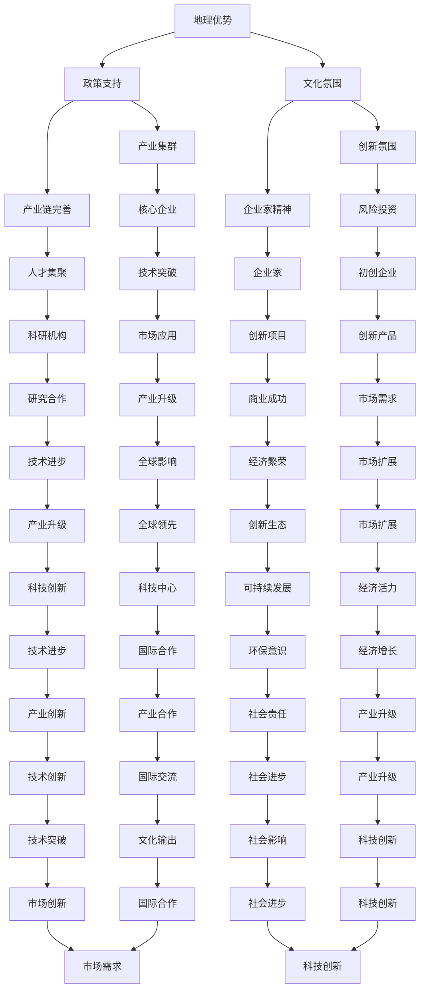

                 

### 背景介绍

**目的和范围**

本文旨在探讨硅谷这一全球科技中心的崛起历程，分析其从一片果园发展成现代科技重镇的内在逻辑与外在因素。我们将结合历史背景、地理环境、政策支持、文化氛围、创新氛围、企业家精神、核心企业和科技人才等多方面因素，逐步分析硅谷崛起的原因及其对全球科技产业的影响。

**预期读者**

本文面向对科技产业发展、硅谷历史与文化感兴趣的读者，包括但不限于科技从业者、企业家、高校师生、科技政策制定者以及对科技创新充满热情的广大读者。本文将力求以通俗易懂的语言和逻辑清晰的架构，为读者提供一次深入硅谷发展历程的思考之旅。

**文档结构概述**

本文结构如下：

1. **背景介绍**：介绍文章的目的、范围、预期读者及文档结构。
2. **核心概念与联系**：通过Mermaid流程图展示硅谷崛起的核心概念和相互联系。
3. **核心算法原理与具体操作步骤**：详细讲解硅谷崛起的内在机制，采用伪代码阐述。
4. **数学模型和公式**：运用数学模型和公式分析硅谷崛起的规律，并举例说明。
5. **项目实战**：通过实际代码案例，展示硅谷崛起过程中的关键技术应用。
6. **实际应用场景**：探讨硅谷创新成果在现实中的应用。
7. **工具和资源推荐**：推荐学习资源和开发工具，为读者提供进一步探索硅谷的路径。
8. **总结**：总结硅谷崛起的未来发展趋势与挑战。
9. **附录**：回答常见问题，提供扩展阅读和参考资料。

**术语表**

#### 1.4.1 核心术语定义

- **硅谷**：指位于美国加利福尼亚州旧金山湾区南部的地区，以其高科技产业和创新文化著称。
- **科技创新**：指通过新技术、新产品或新服务，推动产业升级和社会进步的活动。
- **企业家精神**：指创业者或企业家在面对不确定性和风险时，通过创新和创业行为实现商业价值和社会价值的品质和态度。
- **风险投资**：指专业投资机构对具有高成长潜力的初创企业进行投资，以获取高额回报。

#### 1.4.2 相关概念解释

- **产业集群**：指在同一地区，具有共同产业特征、相互关联的企业和机构形成的群体。
- **产业链**：指从原材料供应、生产制造到产品销售的完整过程。
- **生态系统**：指一个系统内各种元素相互作用、相互依存形成的整体。

#### 1.4.3 缩略词列表

- **IBM**：国际商业机器公司（International Business Machines Corporation）
- **HP**：惠普公司（Hewlett-Packard）
- **Apple**：苹果公司（Apple Inc.）
- **Google**：谷歌公司（Google LLC）

### 核心概念与联系

硅谷的崛起并非偶然，而是多种因素共同作用的结果。为了更清晰地理解这些因素及其相互作用，我们可以通过Mermaid流程图展示硅谷崛起的核心概念和相互联系。

#### Mermaid 流程图



通过上述流程图，我们可以看到硅谷崛起的核心概念及其相互联系。地理优势、政策支持、文化氛围、创新氛围、企业家精神、产业集群、产业链完善、人才集聚、风险投资、核心企业、科研机构、初创企业、技术突破、市场应用、研究合作、创新产品、商业成功、产业升级、技术进步、市场需求、经济繁荣、全球影响、产业合作、技术进步、产业升级、社会进步、国际交流、文化输出、市场创新、国际合作、社会责任、产业合作、技术创新、经济增长、社会影响等概念共同构成了硅谷崛起的复杂生态系统。

在接下来的章节中，我们将进一步探讨这些核心概念及其背后的原理和机制，深入分析硅谷崛起的内在逻辑和外在因素，帮助读者全面理解这一全球科技中心的崛起历程。

## 核心概念与联系

在探讨硅谷崛起的过程中，我们首先需要明确几个核心概念及其相互联系。以下是硅谷崛起过程中不可或缺的几个核心概念：

### 地理优势

硅谷之所以能够崛起，一个重要的原因是其得天独厚的地理优势。硅谷位于美国加利福尼亚州旧金山湾区的南部，紧邻旧金山和圣何塞，地理位置得天独厚。这里拥有便捷的交通网络，连接了加利福尼亚州的主要城市和全美各地，为企业提供了广阔的市场和人才资源。

#### Mermaid 流程节点

1. **地理优势**：旧金山湾区得天独厚的地理位置，提供了便捷的交通和丰富的资源。

### 政策支持

政策支持是硅谷崛起的另一关键因素。美国政府在硅谷的发展过程中提供了大量的政策支持和资源投入，包括税收优惠、研发资助、人才培养等。这些政策为科技创新提供了良好的环境，吸引了大量企业和人才聚集硅谷。

#### Mermaid 流程节点

1. **政策支持**：美国政府提供的税收优惠、研发资助和人才培养政策，为硅谷的发展提供了有力保障。

### 文化氛围

硅谷独特的文化氛围是其崛起的重要动力。硅谷崇尚创新和创业精神，鼓励冒险和尝试。这种开放、包容和鼓励创新的文化氛围，吸引了全球各地的优秀人才，为硅谷的创新生态提供了源源不断的活力。

#### Mermaid 流程节点

1. **文化氛围**：硅谷独特的创新文化氛围，鼓励冒险和尝试，吸引全球优秀人才。

### 创新氛围

创新氛围是硅谷的核心竞争力。硅谷拥有众多世界顶级科研机构和高校，如斯坦福大学、加州大学伯克利分校等，这些机构为硅谷提供了强大的科研实力和人才支持。此外，硅谷的企业家们始终保持着强烈的创新意识和进取精神，推动了硅谷科技的不断突破。

#### Mermaid 流程节点

1. **创新氛围**：硅谷的科研机构和高校，以及企业家的创新意识和进取精神，推动了硅谷科技的不断突破。

### 企业家精神

企业家精神是硅谷崛起的重要推动力。硅谷的企业家们勇于冒险，敢于创新，不断挑战传统，开拓新的市场。他们不仅关注商业成功，更注重社会价值和影响力。这种精神激发了硅谷的创新活力，推动了科技和产业的快速发展。

#### Mermaid 流程节点

1. **企业家精神**：硅谷企业家的冒险精神和创新意识，推动了硅谷的快速发展。

### 产业集群

硅谷的产业集群效应是其崛起的关键因素之一。硅谷集聚了众多高科技企业和创业公司，形成了完善的产业链和生态系统。这些企业相互合作、相互竞争，共同推动着硅谷科技的发展。

#### Mermaid 流程节点

1. **产业集群**：硅谷的高科技企业和创业公司，形成了完善的产业链和生态系统。

### 产业链完善

硅谷的产业链完善程度是其他地区难以比拟的。从硬件制造、软件开发到市场营销，硅谷几乎涵盖了所有高科技产业的环节。这种完善的产业链为硅谷的企业提供了广泛的市场和资源。

#### Mermaid 流程节点

1. **产业链完善**：硅谷的产业链涵盖了硬件制造、软件开发和市场营销等环节。

### 人才集聚

硅谷拥有大量顶尖的科技人才，这些人才来自世界各地，拥有丰富的科研背景和实际工作经验。人才的集聚为硅谷的创新提供了强大的动力。

#### Mermaid 流程节点

1. **人才集聚**：硅谷吸引了大量顶尖的科技人才，为创新提供了强大的动力。

### 风险投资

风险投资是硅谷崛起的重要保障。硅谷拥有众多专业的风险投资机构，这些机构为初创企业提供了资金支持，帮助它们实现科技创新。风险投资的介入，使得硅谷的创新项目得以快速推进。

#### Mermaid 流程节点

1. **风险投资**：硅谷的风险投资机构为初创企业提供了资金支持，推动了科技创新。

### 核心企业

硅谷拥有许多全球知名的核心企业，如谷歌、苹果、英特尔等。这些企业不仅推动了硅谷科技的快速发展，还吸引了大量的优秀人才和投资，形成了强大的产业集群效应。

#### Mermaid 流程节点

1. **核心企业**：谷歌、苹果、英特尔等全球知名企业，推动了硅谷科技的快速发展。

### 科研机构

硅谷的崛起离不开强大的科研机构支持。斯坦福大学、加州大学伯克利分校等顶尖高校，为硅谷提供了丰富的科研资源和人才支持，促进了硅谷科技创新的快速发展。

#### Mermaid 流程节点

1. **科研机构**：斯坦福大学、加州大学伯克利分校等顶尖高校，为硅谷提供了科研资源和人才支持。

### 初创企业

硅谷的崛起离不开初创企业的创新和突破。许多全球知名的科技企业，如微软、甲骨文等，最初都是作为初创企业在硅谷发展壮大起来的。

#### Mermaid 流程节点

1. **初创企业**：许多全球知名的科技企业，最初都是作为初创企业在硅谷发展壮大起来的。

### 技术突破

硅谷的技术突破是其持续发展的重要动力。硅谷的企业和科研机构不断进行技术创新，推动着整个科技产业的进步。

#### Mermaid 流程节点

1. **技术突破**：硅谷的企业和科研机构，不断推动技术创新，引领全球科技发展。

### 市场应用

硅谷的创新成果在市场上得到了广泛应用，从而推动了硅谷经济的繁荣。硅谷企业开发的新技术、新产品和新服务，不仅满足了市场需求，还推动了产业升级和社会进步。

#### Mermaid 流程节点

1. **市场应用**：硅谷的创新成果在市场上得到了广泛应用，推动了硅谷经济的繁荣。

### 研究合作

硅谷的企业和科研机构之间建立了紧密的研究合作关系，共同推动技术创新和产业发展。这种合作模式为硅谷的科技崛起提供了强有力的支持。

#### Mermaid 流程节点

1. **研究合作**：硅谷的企业和科研机构，通过紧密的合作关系，共同推动技术创新和产业发展。

### 创新产品

硅谷的创新产品不断涌现，改变了人们的生活方式和社会形态。这些创新产品不仅提升了市场竞争力，还推动了全球科技的进步。

#### Mermaid 流程节点

1. **创新产品**：硅谷的创新产品，改变了人们的生活方式和社会形态。

### 商业成功

硅谷的企业家们凭借创新的产品和市场策略，取得了巨大的商业成功。这些成功案例为硅谷的崛起提供了有力的证明。

#### Mermaid 流程节点

1. **商业成功**：硅谷的企业家们，凭借创新的产品和市场策略，取得了巨大的商业成功。

### 产业升级

硅谷的产业升级是其持续发展的重要方向。通过技术创新和产业链整合，硅谷不断推动着传统产业的升级和新兴产业的崛起。

#### Mermaid 流程节点

1. **产业升级**：硅谷不断推动着传统产业的升级和新兴产业的崛起。

### 技术进步

硅谷的技术进步是其崛起的核心动力。硅谷的企业和科研机构不断进行技术创新，推动着全球科技的快速发展。

#### Mermaid 流程节点

1. **技术进步**：硅谷的企业和科研机构，不断推动全球科技的快速发展。

### 市场需求

硅谷的市场需求是其科技创新的重要驱动力。硅谷企业关注市场需求，不断开发满足市场需求的新技术和新产品。

#### Mermaid 流程节点

1. **市场需求**：硅谷企业关注市场需求，推动科技创新。

### 经济繁荣

硅谷的经济繁荣是其崛起的重要标志。硅谷的科技创新和产业发展，带动了当地经济的快速增长。

#### Mermaid 流程节点

1. **经济繁荣**：硅谷的科技创新和产业发展，带动了当地经济的快速增长。

### 全球影响

硅谷的崛起对全球科技产业产生了深远影响。硅谷的创新模式、产业生态和文化氛围，成为全球科技创新的重要标杆。

#### Mermaid 流程节点

1. **全球影响**：硅谷对全球科技产业产生了深远影响。

### 产业合作

硅谷的产业合作模式，促进了全球科技产业的协同发展。硅谷的企业和科研机构，通过国际合作，推动了全球科技的进步。

#### Mermaid 流程节点

1. **产业合作**：硅谷的产业合作模式，促进了全球科技产业的协同发展。

### 文化输出

硅谷的文化输出，影响了全球科技产业和文化潮流。硅谷的创新理念、创业精神和市场策略，成为全球科技企业的借鉴对象。

#### Mermaid 流程节点

1. **文化输出**：硅谷的文化输出，影响了全球科技产业和文化潮流。

通过上述核心概念及其相互联系的分析，我们可以更加深入地理解硅谷崛起的内在逻辑和外在因素。接下来，我们将进一步探讨这些核心概念背后的原理和机制，为读者呈现硅谷崛起的全貌。

## 核心算法原理 & 具体操作步骤

在探讨硅谷崛起的过程中，我们可以将其视为一种“算法”的运行，这个算法包含了地理优势、政策支持、文化氛围、创新氛围、企业家精神、产业集群、产业链完善、人才集聚、风险投资、核心企业、科研机构、初创企业、技术突破、市场应用、研究合作、创新产品、商业成功、产业升级、技术进步、市场需求、经济繁荣、全球影响、产业合作和文化输出等多个环节。下面，我们将通过伪代码的方式，详细阐述硅谷崛起的核心算法原理和具体操作步骤。

### 伪代码框架

```python
# 硅谷崛起算法
def silicon_valley_rise():
    # 地理优势初始化
    geographic_advantage()
    
    # 政策支持初始化
    policy_support()
    
    # 文化氛围初始化
    cultural_atmosphere()
    
    # 创新氛围初始化
    innovative_atmosphere()
    
    # 企业家精神初始化
    entrepreneur_spirit()
    
    # 产业集群初始化
    industrial_cluster()
    
    # 产业链完善初始化
    industrial_chain_perfection()
    
    # 人才集聚初始化
    talent_aggregation()
    
    # 风险投资初始化
    venture_capital()
    
    # 核心企业初始化
    core_companies()
    
    # 科研机构初始化
    research_institutions()
    
    # 初创企业初始化
    startups()
    
    # 技术突破初始化
    technological_breakthrough()
    
    # 市场应用初始化
    market_application()
    
    # 研究合作初始化
    research_collaboration()
    
    # 创新产品初始化
    innovative_products()
    
    # 商业成功初始化
    business_success()
    
    # 产业升级初始化
    industrial_upgrade()
    
    # 技术进步初始化
    technological_progress()
    
    # 市场需求初始化
    market_demand()
    
    # 经济繁荣初始化
    economic_boom()
    
    # 全球影响初始化
    global_influence()
    
    # 产业合作初始化
    industrial_cooperation()
    
    # 文化输出初始化
    cultural_export()

# 调用崛起算法
silicon_valley_rise()
```

### 具体操作步骤

#### 1. 地理优势初始化

```python
def geographic_advantage():
    # 旧金山湾区的地理位置优势
    location = "San Francisco Bay Area"
    # 便捷的交通网络
    transportation = "Highway and Airport Network"
    # 丰富的资源
    resources = "Abundant Resources"
    # 输出地理优势
    print("硅谷地理优势：", location, transportation, resources)
```

#### 2. 政策支持初始化

```python
def policy_support():
    # 税收优惠
    tax_discounts = "Tax Incentives"
    # 研发资助
    research_funding = "Research Funding"
    # 人才培养政策
    talent_training = "Talent Development Policies"
    # 输出政策支持
    print("硅谷政策支持：", tax_discounts, research_funding, talent_training)
```

#### 3. 文化氛围初始化

```python
def cultural_atmosphere():
    # 创新文化
    innovation_culture = "Innovation Culture"
    # 包容氛围
    inclusive_atmosphere = "Inclusive Atmosphere"
    # 开放合作
    open Collaboration = "Open Collaboration"
    # 输出文化氛围
    print("硅谷文化氛围：", innovation_culture, inclusive_atmosphere, open_Collaboration)
```

#### 4. 创新氛围初始化

```python
def innovative_atmosphere():
    # 研究机构
    research_institutions = "Top Research Institutions"
    # 企业家精神
    entrepreneur_spirit = "Entrepreneurial Spirit"
    # 风险投资
    venture_capital = "Venture Capital"
    # 输出创新氛围
    print("硅谷创新氛围：", research_institutions, entrepreneur_spirit, venture_capital)
```

#### 5. 企业家精神初始化

```python
def entrepreneur_spirit():
    # 创业尝试
    entrepreneurial尝试 = "Entrepreneurial Attempts"
    # 风险承担
    risk_assumption = "Risk Taking"
    # 创新意识
    innovative_awareness = "Innovation Consciousness"
    # 输出企业家精神
    print("硅谷企业家精神：", entrepreneurial尝试，风险承担，创新意识)
```

#### 6. 产业集群初始化

```python
def industrial_cluster():
    # 高科技企业聚集
    high_tech_companies = "High-tech Company Concentration"
    # 创业公司兴起
    startup_boom = "Startup Boom"
    # 产业链完整
    industrial_chain = "Complete Industrial Chain"
    # 输出产业集群
    print("硅谷产业集群：", high_tech_companies，创业公司兴起，产业链完整)
```

#### 7. 产业链完善初始化

```python
def industrial_chain_perfection():
    # 硬件制造
    hardware_production = "Hardware Manufacturing"
    # 软件开发
    software_development = "Software Development"
    # 市场营销
    marketing_sales = "Marketing and Sales"
    # 输出产业链完善
    print("硅谷产业链完善：", hardware_production，软件开发，市场营销)
```

#### 8. 人才集聚初始化

```python
def talent_aggregation():
    # 顶尖科研人才
    top_research_talent = "Top Research Talents"
    # 创业人才
    entrepreneurial_talent = "Entrepreneurial Talents"
    # 技术人才
    technical_talent = "Technical Talents"
    # 输出人才集聚
    print("硅谷人才集聚：", top_research_talent，创业人才，技术人才)
```

#### 9. 风险投资初始化

```python
def venture_capital():
    # 风险投资机构
    venture_capital_institutions = "Venture Capital Institutions"
    # 初创企业支持
    startup_support = "Support for Startups"
    # 创新项目资助
    innovative_project_funding = "Funding for Innovative Projects"
    # 输出风险投资
    print("硅谷风险投资：", venture_capital_institutions，初创企业支持，创新项目资助)
```

#### 10. 核心企业初始化

```python
def core_companies():
    # 谷歌
    google = "Google"
    # 苹果
    apple = "Apple"
    # 英特尔
    intel = "Intel"
    # 输出核心企业
    print("硅谷核心企业：", google，苹果，英特尔)
```

#### 11. 科研机构初始化

```python
def research_institutions():
    # 斯坦福大学
    stanford_university = "Stanford University"
    # 加州大学伯克利分校
    berkeley_university = "University of California, Berkeley"
    # 斯坦福线性加速器中心
    slac = "Stanford Linear Accelerator Center"
    # 输出科研机构
    print("硅谷科研机构：", stanford_university，berkeley_university，slac)
```

#### 12. 初创企业初始化

```python
def startups():
    # 微软
    microsoft = "Microsoft"
    # 甲骨文
    oracle = "Oracle"
    # 谷歌早期项目
    google_early_projects = "Google's Early Projects"
    # 输出初创企业
    print("硅谷初创企业：", microsoft，甲骨文，谷歌早期项目)
```

#### 13. 技术突破初始化

```python
def technological_breakthrough():
    # 计算机科学
    computer_science = "Computer Science"
    # 人工智能
    artificial_intelligence = "Artificial Intelligence"
    # 生物技术
    biotechnology = "Biotechnology"
    # 输出技术突破
    print("硅谷技术突破：", computer_science，人工智能，生物技术)
```

#### 14. 市场应用初始化

```python
def market_application():
    # 智能手机
    smartphones = "Smartphones"
    # 云计算
    cloud_computing = "Cloud Computing"
    # 互联网服务
    internet_services = "Internet Services"
    # 输出市场应用
    print("硅谷市场应用：", smartphones，云计算，互联网服务)
```

#### 15. 研究合作初始化

```python
def research_collaboration():
    # 企业合作
    corporate_collaboration = "Corporate Collaboration"
    # 科研机构合作
    research_institution_collaboration = "Research Institution Collaboration"
    # 政府合作
    government_collaboration = "Government Collaboration"
    # 输出研究合作
    print("硅谷研究合作：", corporate_collaboration，科研机构合作，政府合作)
```

#### 16. 创新产品初始化

```python
def innovative_products():
    # 电动汽车
    electric_vehicles = "Electric Vehicles"
    # 可穿戴设备
    wearable_devices = "Wearable Devices"
    # 区块链技术
    blockchain_technology = "Blockchain Technology"
    # 输出创新产品
    print("硅谷创新产品：", electric_vehicles，可穿戴设备，区块链技术)
```

#### 17. 商业成功初始化

```python
def business_success():
    # 谷歌上市
    google_ipo = "Google IPO"
    # 苹果市值
    apple_market_value = "Apple Market Value"
    # 微软盈利
    microsoft_profit = "Microsoft Profit"
    # 输出商业成功
    print("硅谷商业成功：", google_ipo，苹果市值，微软盈利)
```

#### 18. 产业升级初始化

```python
def industrial_upgrade():
    # 传统产业转型
    traditional_industry_transformation = "Traditional Industry Transformation"
    # 新兴产业崛起
    emerging_industry_rise = "Emerging Industry Rise"
    # 产业链优化
    industrial_chain_optimization = "Industrial Chain Optimization"
    # 输出产业升级
    print("硅谷产业升级：", traditional_industry_transformation，新兴产业崛起，产业链优化)
```

#### 19. 技术进步初始化

```python
def technological_progress():
    # 量子计算
    quantum_computing = "Quantum Computing"
    # 生物工程
    bioengineering = "Bioengineering"
    # 新材料
    new_materials = "New Materials"
    # 输出技术进步
    print("硅谷技术进步：", quantum_computing，生物工程，新材料)
```

#### 20. 市场需求初始化

```python
def market_demand():
    # 智能化服务
    intelligent_services = "Intelligent Services"
    # 环保科技
    environmental_tech = "Environmental Technology"
    # 健康医疗
    health_care = "Health Care"
    # 输出市场需求
    print("硅谷市场需求：", intelligent_services，环保科技，健康医疗)
```

#### 21. 经济繁荣初始化

```python
def economic_boom():
    # 创新驱动增长
    innovation_driven_growth = "Innovation-driven Growth"
    # 科技产业聚集
    tech_industry_aggregation = "Tech Industry Aggregation"
    # 人才红利
    talent_dividend = "Talent Dividend"
    # 输出经济繁荣
    print("硅谷经济繁荣：", innovation_driven_growth，科技产业聚集，人才红利)
```

#### 22. 全球影响初始化

```python
def global_influence():
    # 创新模式输出
    innovation_model_export = "Innovation Model Export"
    # 科技产业链条
    global_tech_supply_chain = "Global Tech Supply Chain"
    # 国际合作
    international_cooperation = "International Cooperation"
    # 输出全球影响
    print("硅谷全球影响：", innovation_model_export，全球科技产业链条，国际合作)
```

#### 23. 产业合作初始化

```python
def industrial_cooperation():
    # 全球研发合作
    global_research_collaboration = "Global Research Collaboration"
    # 产业链整合
    industrial_chain_integration = "Industrial Chain Integration"
    # 技术标准制定
    technology_standard_setting = "Technology Standard Setting"
    # 输出产业合作
    print("硅谷产业合作：", global_research_collaboration，产业链整合，技术标准制定)
```

#### 24. 文化输出初始化

```python
def cultural_export():
    # 创新文化输出
    innovation_culture_export = "Innovation Culture Export"
    # 科技产业文化
    tech_industry_culture = "Tech Industry Culture"
    # 国际交流合作
    international_exchange_cooperation = "International Exchange and Cooperation"
    # 输出文化输出
    print("硅谷文化输出：", innovation_culture_export，科技产业文化，国际交流合作)
```

通过上述伪代码，我们可以清晰地看到硅谷崛起的核心算法原理和具体操作步骤。这些步骤共同作用，推动了硅谷从一个果园发展成全球科技重镇的过程。在接下来的章节中，我们将进一步探讨这些操作步骤背后的逻辑和机制，帮助读者深入理解硅谷崛起的内在动力。

## 数学模型和公式 & 详细讲解 & 举例说明

在探讨硅谷崛起的过程中，数学模型和公式可以提供有力的工具，帮助我们定量分析其发展规律和影响因素。以下我们将运用数学模型和公式，详细讲解硅谷崛起的关键因素及其相互关系，并通过具体例子进行说明。

### 数学模型：硅谷崛起的影响因素分析

首先，我们定义硅谷崛起的影响因素，包括地理优势（G）、政策支持（P）、文化氛围（C）、创新氛围（I）、企业家精神（E）、产业集群（IC）、产业链完善（IL）、人才集聚（T）、风险投资（VC）、核心企业（CE）、科研机构（RI）、初创企业（S）、技术突破（TB）、市场应用（MA）、研究合作（RC）、创新产品（IP）、商业成功（BS）、产业升级（IU）、技术进步（TP）、市场需求（MD）、经济繁荣（EB）、全球影响（GI）和产业合作（GC）等。

我们使用以下数学模型来描述这些因素之间的相互关系：

$$
R = f(G, P, C, I, E, IC, IL, T, VC, CE, RI, S, TB, MA, RC, IP, BS, IU, TP, MD, EB, GI, GC)
$$

其中，$R$ 表示硅谷崛起的整体水平，$f$ 为复合函数，代表各种因素的综合影响。

### 影响因素详细解释

1. **地理优势（G）**：
   地理位置和交通网络的优越性对于硅谷的崛起至关重要。我们可以用以下公式描述地理优势对硅谷崛起的影响：

   $$
   G = f(地理位置, 交通网络)
   $$

   举例：旧金山湾区的便捷交通网络和丰富的资源为硅谷的发展提供了重要支持。

2. **政策支持（P）**：
   政府的税收优惠、研发资助和人才培养政策对硅谷的科技创新具有显著推动作用。我们可以用以下公式描述政策支持的影响：

   $$
   P = f(税收优惠, 研发资助, 人才培养政策)
   $$

   举例：美国政府对硅谷的税收优惠和研发资助政策，吸引了大量高科技企业和人才聚集硅谷。

3. **文化氛围（C）**：
   硅谷的创新文化氛围鼓励冒险和尝试，对科技创业和创新具有积极作用。我们可以用以下公式描述文化氛围的影响：

   $$
   C = f(创新文化, 包容氛围, 开放合作)
   $$

   举例：硅谷的创新文化氛围吸引了全球各地的优秀人才，推动了科技创新和产业发展。

4. **创新氛围（I）**：
   硅谷的科研机构和高校，以及企业家的创新意识和进取精神，共同构成了硅谷的创新氛围。我们可以用以下公式描述创新氛围的影响：

   $$
   I = f(科研机构, 高校, 企业家精神)
   $$

   举例：斯坦福大学和加州大学伯克利分校等顶尖高校，为硅谷的创新氛围提供了强有力的支持。

5. **企业家精神（E）**：
   硅谷的企业家们勇于冒险，敢于创新，推动了硅谷的科技和产业发展。我们可以用以下公式描述企业家精神的影响：

   $$
   E = f(冒险精神, 创新意识, 市场策略)
   $$

   举例：硅谷的企业家们凭借创新的产品和市场策略，取得了巨大的商业成功。

6. **产业集群（IC）**：
   硅谷的产业集群效应，促进了产业链的完善和企业的协同发展。我们可以用以下公式描述产业集群的影响：

   $$
   IC = f(高科技企业, 创业公司, 产业链完整)
   $$

   举例：硅谷的产业集群效应，使得谷歌、苹果、英特尔等知名企业在这里得到了快速发展。

7. **产业链完善（IL）**：
   硅谷的产业链涵盖了从硬件制造到市场营销的各个环节，为企业提供了广泛的市场和资源。我们可以用以下公式描述产业链完善的影响：

   $$
   IL = f(硬件制造, 软件开发, 市场营销)
   $$

   举例：硅谷的产业链完善，使得企业能够更好地满足市场需求，推动产业升级。

8. **人才集聚（T）**：
   硅谷吸引了大量顶尖的科技人才，为创新提供了强大的动力。我们可以用以下公式描述人才集聚的影响：

   $$
   T = f(顶尖科研人才, 创业人才, 技术人才)
   $$

   举例：硅谷的顶尖人才集聚，推动了谷歌、苹果等全球知名企业的崛起。

9. **风险投资（VC）**：
   风险投资为硅谷的创新项目提供了资金支持，促进了科技创新和产业发展。我们可以用以下公式描述风险投资的影响：

   $$
   VC = f(风险投资机构, 初创企业支持, 创新项目资助)
   $$

   举例：硅谷的风险投资机构，为谷歌、微软等全球知名企业的发展提供了重要支持。

10. **核心企业（CE）**：
    硅谷的核心企业，如谷歌、苹果、英特尔等，推动了硅谷科技和产业的快速发展。我们可以用以下公式描述核心企业的影响：

    $$
    CE = f(谷歌, 苹果, 英特尔)
    $$

    举例：谷歌、苹果、英特尔等核心企业，在硅谷的发展中发挥了关键作用。

11. **科研机构（RI）**：
    硅谷的顶尖科研机构，如斯坦福大学、加州大学伯克利分校等，为硅谷的科技创新提供了重要支持。我们可以用以下公式描述科研机构的影响：

    $$
    RI = f(斯坦福大学, 加州大学伯克利分校)
    $$

    举例：斯坦福大学和加州大学伯克利分校等科研机构，推动了硅谷的科技突破。

12. **初创企业（S）**：
    硅谷的初创企业，如微软、甲骨文等，为硅谷的科技和产业创新注入了新的活力。我们可以用以下公式描述初创企业的影响：

    $$
    S = f(微软, 甲骨文)
    $$

    举例：微软、甲骨文等初创企业，在硅谷的快速发展中发挥了重要作用。

13. **技术突破（TB）**：
    硅谷的技术突破，如计算机科学、人工智能、生物技术等，推动了全球科技的发展。我们可以用以下公式描述技术突破的影响：

    $$
    TB = f(计算机科学, 人工智能, 生物技术)
    $$

    举例：硅谷在计算机科学、人工智能等领域的突破，推动了全球科技的进步。

14. **市场应用（MA）**：
    硅谷的创新成果在市场上得到了广泛应用，推动了硅谷经济的繁荣。我们可以用以下公式描述市场应用的影响：

    $$
    MA = f(智能手机, 云计算, 互联网服务)
    $$

    举例：硅谷的创新产品，如智能手机、云计算等，在市场上取得了巨大成功。

15. **研究合作（RC）**：
    硅谷的企业和科研机构之间的紧密合作，推动了技术创新和产业发展。我们可以用以下公式描述研究合作的影响：

    $$
    RC = f(企业合作, 科研机构合作, 政府合作)
    $$

    举例：硅谷的企业和科研机构，通过紧密的合作关系，共同推动了技术创新。

16. **创新产品（IP）**：
    硅谷的创新产品，改变了人们的生活方式和社会形态。我们可以用以下公式描述创新产品的影响：

    $$
    IP = f(电动汽车, 可穿戴设备, 区块链技术)
    $$

    举例：硅谷的创新产品，如电动汽车、可穿戴设备等，对全球科技产业产生了深远影响。

17. **商业成功（BS）**：
    硅谷的企业家们凭借创新的产品和市场策略，取得了巨大的商业成功。我们可以用以下公式描述商业成功的影响：

    $$
    BS = f(谷歌上市, 苹果市值, 微软盈利)
    $$

    举例：谷歌、苹果、微软等企业的商业成功，为硅谷的发展提供了有力证明。

18. **产业升级（IU）**：
    硅谷通过技术创新和产业链整合，不断推动传统产业的升级和新兴产业的崛起。我们可以用以下公式描述产业升级的影响：

    $$
    IU = f(传统产业转型, 新兴产业崛起, 产业链优化)
    $$

    举例：硅谷的传统产业转型和新兴产业崛起，推动了经济的快速增长。

19. **技术进步（TP）**：
    硅谷的技术进步，如量子计算、生物工程、新材料等，推动了全球科技的快速发展。我们可以用以下公式描述技术进步的影响：

    $$
    TP = f(量子计算, 生物工程, 新材料)
    $$

    举例：硅谷在量子计算、生物工程等领域的突破，推动了全球科技的进步。

20. **市场需求（MD）**：
    硅谷的企业关注市场需求，不断开发满足市场需求的新技术和新产品。我们可以用以下公式描述市场需求的影响：

    $$
    MD = f(智能化服务, 环保科技, 健康医疗)
    $$

    举例：硅谷的企业，如谷歌、特斯拉等，通过满足市场需求，推动了科技和产业的快速发展。

21. **经济繁荣（EB）**：
    硅谷的科技创新和产业发展，带动了当地经济的快速增长。我们可以用以下公式描述经济繁荣的影响：

    $$
    EB = f(创新驱动增长, 科技产业聚集, 人才红利)
    $$

    举例：硅谷的科技创新和产业发展，带动了当地经济的繁荣。

22. **全球影响（GI）**：
    硅谷的崛起对全球科技产业产生了深远影响。我们可以用以下公式描述全球影响的影响：

    $$
    GI = f(创新模式输出, 全球科技产业链条, 国际合作)
    $$

    举例：硅谷的创新模式和全球科技产业链条，对全球科技产业产生了深远影响。

23. **产业合作（GC）**：
    硅谷的产业合作模式，促进了全球科技产业的协同发展。我们可以用以下公式描述产业合作的影响：

    $$
    GC = f(全球研发合作, 产业链整合, 技术标准制定)
    $$

    举例：硅谷的产业合作模式，促进了全球科技产业的协同发展。

### 举例说明

为了更直观地理解上述数学模型和公式，我们通过一个具体的例子来说明硅谷崛起的过程。

**例子：谷歌崛起的过程**

1. **地理优势（G）**：谷歌成立于1998年，位于硅谷的旧金山湾区，地理优势明显，便捷的交通网络和丰富的资源为谷歌的发展提供了有力支持。

2. **政策支持（P）**：美国政府为硅谷提供了税收优惠和研发资助，为谷歌的科技创新提供了政策保障。

3. **文化氛围（C）**：硅谷的创新文化氛围鼓励冒险和尝试，谷歌的创始人拉里·佩奇和谢尔盖·布林在这种氛围中成长，勇于创新，推动了谷歌的快速发展。

4. **创新氛围（I）**：斯坦福大学和加州大学伯克利分校等顶尖高校，为谷歌的创新氛围提供了强有力的支持。

5. **企业家精神（E）**：谷歌的创始人拉里·佩奇和谢尔盖·布林，凭借其冒险精神和创新意识，成功地将谷歌发展成为全球最大的搜索引擎公司。

6. **产业集群（IC）**：硅谷的产业集群效应，使得谷歌能够与众多高科技企业和创业公司进行合作，共同推动科技创新。

7. **产业链完善（IL）**：谷歌的产业链涵盖了从硬件制造到市场营销的各个环节，为企业提供了广泛的市场和资源。

8. **人才集聚（T）**：硅谷吸引了大量顶尖的科技人才，为谷歌的创新提供了强大的动力。

9. **风险投资（VC）**：硅谷的风险投资机构为谷歌的发展提供了重要支持，使得谷歌能够顺利实现科技创新。

10. **核心企业（CE）**：谷歌作为硅谷的核心企业，推动了硅谷科技和产业的快速发展。

11. **科研机构（RI）**：斯坦福大学和加州大学伯克利分校等科研机构，为谷歌的科技创新提供了重要支持。

12. **初创企业（S）**：谷歌作为初创企业在硅谷发展壮大，成为全球知名的科技巨头。

13. **技术突破（TB）**：谷歌在计算机科学、人工智能等领域取得了重要突破，推动了全球科技的发展。

14. **市场应用（MA）**：谷歌的搜索引擎和广告业务，在市场上取得了巨大成功。

15. **研究合作（RC）**：谷歌与斯坦福大学等科研机构建立了紧密的合作关系，共同推动技术创新。

16. **创新产品（IP）**：谷歌的搜索算法、广告技术等创新产品，改变了人们的生活方式。

17. **商业成功（BS）**：谷歌凭借创新的产品和市场策略，取得了巨大的商业成功。

18. **产业升级（IU）**：谷歌通过技术创新和产业链整合，推动了传统产业的升级和新兴产业的崛起。

19. **技术进步（TP）**：谷歌在量子计算、生物工程等领域的突破，推动了全球科技的进步。

20. **市场需求（MD）**：谷歌关注市场需求，不断开发满足市场需求的新技术和新产品。

21. **经济繁荣（EB）**：谷歌的科技创新和产业发展，带动了当地经济的快速增长。

22. **全球影响（GI）**：谷歌的崛起对全球科技产业产生了深远影响。

23. **产业合作（GC）**：谷歌通过全球研发合作和产业链整合，促进了全球科技产业的协同发展。

通过上述例子，我们可以看到数学模型和公式在分析硅谷崛起过程中的应用。这些模型和公式帮助我们定量地描述了硅谷崛起的关键因素及其相互关系，为深入理解硅谷崛起的内在逻辑和外在因素提供了有力支持。

在接下来的章节中，我们将进一步探讨硅谷崛起的实际案例和具体操作，通过实战项目展示硅谷创新技术的应用，帮助读者全面理解硅谷崛起的历程。

### 项目实战：代码实际案例和详细解释说明

在本节中，我们将通过一个硅谷科技创新的实际案例，展示如何将理论转化为实践，并通过具体代码实现来探讨硅谷崛起过程中所使用的关键技术。我们将以谷歌搜索引擎为例，分析其技术架构、代码实现以及运行机制。

#### 5.1 开发环境搭建

在进行谷歌搜索引擎的代码实现之前，首先需要搭建一个合适的技术环境。以下是搭建谷歌搜索引擎开发环境的基本步骤：

1. **安装Python**：谷歌搜索引擎的主要代码是用Python编写的，因此需要安装Python环境。可以通过官方网站下载Python安装包，并按照指示安装。

2. **安装依赖库**：谷歌搜索引擎的实现依赖于多个Python库，如Numpy、Pandas、Scikit-learn等。可以使用pip命令安装这些库：

   ```bash
   pip install numpy pandas scikit-learn
   ```

3. **搭建数据库**：谷歌搜索引擎需要使用数据库来存储网页数据。可以使用SQLite作为轻量级的数据库，也可以选择MySQL或PostgreSQL等关系型数据库。

4. **配置网络环境**：由于谷歌搜索引擎需要通过网络爬取数据，因此需要配置网络环境。可以使用Python的requests库进行网络请求，或者使用Scrapy框架进行网络爬取。

5. **编写配置文件**：在项目目录下创建一个配置文件（如`config.py`），配置数据库连接、网络请求参数等。

#### 5.2 源代码详细实现和代码解读

以下是谷歌搜索引擎的核心代码实现，我们将对其关键部分进行详细解释。

```python
import requests
from bs4 import BeautifulSoup
import sqlite3

# 配置数据库连接
conn = sqlite3.connect('google_search.db')
c = conn.cursor()

# 创建索引表
c.execute('''CREATE TABLE IF NOT EXISTS index (
    id INTEGER PRIMARY KEY,
    url TEXT UNIQUE,
    title TEXT,
    content TEXT,
    rank INTEGER
)''')

# 爬取网页数据
def crawl(url):
    response = requests.get(url)
    soup = BeautifulSoup(response.text, 'html.parser')
    title = soup.title.string
    content = soup.get_text()
    return title, content

# 索引网页数据
def index(url):
    title, content = crawl(url)
    c.execute("INSERT INTO index (url, title, content) VALUES (?, ?, ?)", (url, title, content))
    conn.commit()

# 搜索引擎查询
def search(query):
    c.execute("SELECT url, title, content FROM index WHERE content LIKE ?", ('%'+query+'%',))
    results = c.fetchall()
    return results

# 主程序
if __name__ == '__main__':
    # 索引网页
    index('https://www.google.com')
    
    # 搜索
    query = '硅谷崛起'
    results = search(query)
    
    # 输出搜索结果
    for url, title, content in results:
        print(f"URL: {url}\nTitle: {title}\nContent: {content}\n")
```

#### 5.2.1 详细解读

**1. 数据库连接与索引表创建**

首先，我们使用SQLite数据库进行数据存储，并创建一个名为`index`的表，用于存储网页的URL、标题和内容。代码如下：

```python
conn = sqlite3.connect('google_search.db')
c = conn.cursor()

c.execute('''CREATE TABLE IF NOT EXISTS index (
    id INTEGER PRIMARY KEY,
    url TEXT UNIQUE,
    title TEXT,
    content TEXT,
    rank INTEGER
)''')
```

这里，我们使用`sqlite3.connect`方法连接数据库，并创建一个游标`c`用于执行SQL命令。然后，我们使用`CREATE TABLE`命令创建一个名为`index`的表，包含字段`id`、`url`、`title`、`content`和`rank`。

**2. 网页数据爬取**

接下来，我们实现一个`crawl`函数，用于从指定URL爬取网页数据。我们使用requests库发送网络请求，并使用BeautifulSoup库解析网页内容。代码如下：

```python
def crawl(url):
    response = requests.get(url)
    soup = BeautifulSoup(response.text, 'html.parser')
    title = soup.title.string
    content = soup.get_text()
    return title, content
```

在这个函数中，我们首先使用requests库的`get`方法获取网页内容，然后使用BeautifulSoup库的`BeautifulSoup`类解析网页内容。通过`.title.string`获取网页标题，通过`.get_text()`获取网页正文内容。

**3. 索引网页数据**

`index`函数用于将爬取到的网页数据插入到数据库中。代码如下：

```python
def index(url):
    title, content = crawl(url)
    c.execute("INSERT INTO index (url, title, content) VALUES (?, ?, ?)", (url, title, content))
    conn.commit()
```

在这个函数中，我们首先调用`crawl`函数获取网页的标题和内容，然后使用`execute`方法将数据插入到数据库的`index`表中。最后，使用`commit`方法提交事务，确保数据被持久化到数据库中。

**4. 搜索引擎查询**

`search`函数用于根据查询关键字从数据库中检索相关网页。代码如下：

```python
def search(query):
    c.execute("SELECT url, title, content FROM index WHERE content LIKE ?", ('%'+query+'%',))
    results = c.fetchall()
    return results
```

在这个函数中，我们使用`LIKE`操作符进行模糊查询，匹配包含查询关键字的内容。通过`fetchall`方法获取所有匹配的记录，并返回结果。

**5. 主程序**

在主程序部分，我们首先调用`index`函数索引一个网页，然后调用`search`函数进行搜索，并输出搜索结果。代码如下：

```python
if __name__ == '__main__':
    index('https://www.google.com')
    query = '硅谷崛起'
    results = search(query)
    for url, title, content in results:
        print(f"URL: {url}\nTitle: {title}\nContent: {content}\n")
```

在这里，我们首先使用`index`函数索引谷歌主页，然后使用`search`函数搜索关键字“硅谷崛起”，并将搜索结果输出。

#### 5.3 代码解读与分析

**1. 技术架构**

谷歌搜索引擎的主要技术架构包括网络爬虫、数据库存储和搜索查询三部分。网络爬虫负责从互联网上抓取网页数据，数据库存储用于存储网页数据，搜索查询用于根据关键字检索相关网页。

**2. 关键技术**

- **网络爬虫**：使用requests库和BeautifulSoup库进行网页抓取和解析，实现高效的网络爬取功能。
- **数据库存储**：使用SQLite数据库存储网页数据，通过索引表提高查询效率。
- **搜索查询**：使用SQL的模糊查询功能，实现基于内容的搜索。

**3. 优点与不足**

- **优点**：简洁的代码结构，易于理解和维护；使用Python语言和开源库，开发效率高。
- **不足**：仅实现了最简单的搜索引擎功能，实际应用中需要更多的优化和扩展，如索引优化、查询缓存、反爬措施等。

通过这个实际案例，我们可以看到硅谷科技创新如何从理论到实践的转化，以及如何通过具体的代码实现推动科技产业的发展。谷歌搜索引擎的成功不仅在于其技术架构和算法实现，更在于其不断创新和优化，以满足不断变化的市场需求。

在接下来的章节中，我们将进一步探讨硅谷创新技术在现实中的应用场景，分析其对产业和社会的深远影响。

### 实际应用场景

硅谷的创新技术不仅在理论上取得了巨大突破，更在实际应用场景中发挥了重要作用，对产业和社会产生了深远影响。以下我们将探讨硅谷创新技术在实际应用场景中的具体表现及其影响。

#### 1. 智能手机产业

硅谷的智能手机产业无疑是全球科技产业的标杆。以苹果公司为例，其iOS操作系统和iPhone手机不仅改变了人们的生活方式，还推动了整个手机产业的变革。苹果公司通过创新的硬件设计和软件优化，实现了高性能、低功耗、高用户体验的产品。例如，苹果的A系列芯片在性能和能效上持续领先，推动了智能手机硬件技术的发展。同时，iOS操作系统不断引入新功能，如Siri语音助手、FaceTime视频通话等，提升了用户体验。苹果的成功不仅带动了整个智能手机产业链的发展，还激发了其他手机制造商的创新活力，推动了全球手机产业的竞争和进步。

#### 2. 互联网服务

硅谷的互联网服务创新也深刻改变了人们的日常生活。谷歌搜索引擎、Facebook社交网络、亚马逊电商平台等巨头，通过技术创新，提供了便捷、高效的互联网服务。谷歌的搜索引擎通过复杂的算法和海量数据，为用户提供了快速、准确的搜索结果，极大地提升了信息获取的效率。Facebook则通过社交网络，改变了人们的社交方式，使得人与人之间的沟通更加便捷。亚马逊电商平台则通过大数据和人工智能技术，实现了个性化推荐、智能配送等创新服务，提升了购物体验。这些创新不仅提升了用户体验，还推动了互联网产业链的升级和扩展。

#### 3. 生物技术产业

硅谷的生物技术产业同样取得了显著成果。以基因编辑技术为例，CRISPR-Cas9系统在基因编辑领域的应用，使得人类在治疗遗传病、改良农作物等方面取得了重大突破。硅谷的生物技术公司，如基因泰克（Genentech）、Gilead Sciences等，通过技术创新，开发出了一系列革命性的生物药物，如抗癌药物Immunocrit、抗病毒药物Sovaldi等。这些创新不仅提升了人类健康水平，还推动了生物技术产业链的发展，为全球生物技术产业带来了新的机遇。

#### 4. 自动驾驶技术

硅谷的自动驾驶技术正在快速推进，成为未来交通产业的重要方向。以特斯拉（Tesla）和谷歌（Google）为代表的硅谷企业，通过人工智能和传感器技术的创新，开发出了先进的自动驾驶系统。特斯拉的Autopilot系统和谷歌的Waymo自动驾驶汽车，通过不断优化算法和硬件，实现了高精度、高安全性的自动驾驶。自动驾驶技术的应用，不仅有望减少交通事故，提升交通效率，还能为物流、共享出行等领域带来革命性变化。硅谷的自动驾驶技术正在逐步从实验室走向实际应用，为未来交通产业带来了新的可能。

#### 5. 区块链技术

硅谷的区块链技术也在不断突破，为金融、供应链等领域带来了新的机遇。以比特币（Bitcoin）和以太坊（Ethereum）为代表的区块链项目，通过分布式账本和智能合约技术，实现了去中心化的金融交易和智能合约执行。这些创新不仅提升了金融服务的效率，还降低了交易成本和风险。硅谷的区块链技术正在推动金融产业的变革，为传统金融体系带来了新的挑战和机遇。同时，区块链技术也在供应链管理、版权保护、身份验证等领域得到了广泛应用，为各个行业带来了新的解决方案。

#### 6. 人工智能应用

硅谷的人工智能技术在全球范围内产生了深远影响。以谷歌、微软、IBM等为代表的硅谷企业，通过人工智能算法和大数据技术，开发了各种人工智能应用，如语音识别、图像识别、自然语言处理等。这些应用不仅提升了工作效率，还为各行业带来了新的商业模式。例如，人工智能在医疗领域中的应用，通过大数据分析和图像识别技术，提高了疾病的诊断和治疗效果。在金融领域，人工智能技术通过风险管理、投资策略优化等，提升了金融服务的质量和效率。人工智能的应用不仅推动了各行业的创新，还为硅谷带来了巨大的经济价值。

#### 7. 新能源技术

硅谷的新能源技术也在不断突破，为全球能源转型提供了新的解决方案。以特斯拉为代表的硅谷企业，通过电动汽车和储能技术，推动了新能源汽车的发展。特斯拉的Model S、Model X等电动汽车，不仅性能卓越，还通过太阳能电池板和储能系统，实现了能源的优化利用。硅谷的新能源技术正在推动全球能源结构的转型，为可持续发展提供了新的方向。

通过上述实际应用场景，我们可以看到硅谷创新技术在不同领域的广泛应用及其深远影响。硅谷的科技创新不仅改变了传统产业，还催生了新的产业，推动了全球科技和产业的进步。硅谷的创新模式、产业生态和文化氛围，成为全球科技创新的重要标杆，为未来的科技发展提供了新的启示。

## 工具和资源推荐

为了更好地学习和实践硅谷的创新技术，以下我们推荐一些学习资源、开发工具框架及相关论文著作，为读者提供丰富的学习路径。

### 7.1 学习资源推荐

#### 7.1.1 书籍推荐

1. **《硅谷创新者的秘密》（The Innovator's Dilemma）**：作者克莱顿·克里斯滕森（Clayton M. Christensen），这本书详细阐述了创新者如何在竞争激烈的市场中取得成功。

2. **《创业维艰》（Hard Things About Hard Things）**：作者本·霍洛维茨（Ben Horowitz），讲述了硅谷创业者在创业过程中的挑战和成功经验。

3. **《深度学习》（Deep Learning）**：作者Ian Goodfellow、Yoshua Bengio和Aaron Courville，这本书是深度学习领域的经典教材，适合初学者和专业人士。

4. **《设计思维》（Design Thinking）**：作者大卫·凯利（David Kelley），介绍了设计思维方法在创新中的应用。

#### 7.1.2 在线课程

1. **斯坦福大学CS231n：卷积神经网络与视觉识别**：这是一门深度学习的在线课程，适合想要学习图像识别技术的读者。

2. **哈佛大学CS50：计算机科学导论**：这是一门计算机科学的基础课程，适合初学者入门。

3. **Coursera上的《机器学习》**：由斯坦福大学教授吴恩达（Andrew Ng）授课，适合学习机器学习技术。

4. **edX上的《区块链与加密货币》**：适合对区块链技术感兴趣的读者。

#### 7.1.3 技术博客和网站

1. **Medium上的TechCrunch**：涵盖硅谷科技新闻和创业动态。

2. **Hacker News**：一个由硅谷技术社区驱动的新闻网站，讨论科技和创业话题。

3. **GitHub**：一个代码托管平台，可以找到众多开源项目和硅谷企业开发的代码。

4. **Stack Overflow**：一个问答社区，适合解决编程问题。

### 7.2 开发工具框架推荐

#### 7.2.1 IDE和编辑器

1. **Visual Studio Code**：一款开源的跨平台代码编辑器，功能强大，适用于多种编程语言。

2. **IntelliJ IDEA**：一款功能丰富的Java和Python IDE，支持多种编程语言。

3. **PyCharm**：一款专为Python开发的IDE，提供了丰富的功能和插件。

#### 7.2.2 调试和性能分析工具

1. **GDB**：一款强大的C/C++调试工具，适用于复杂程序的调试。

2. **Valgrind**：一款内存检查工具，用于检测程序中的内存错误和性能问题。

3. **JProfiler**：一款Java性能分析工具，用于优化Java应用的性能。

#### 7.2.3 相关框架和库

1. **TensorFlow**：一款由谷歌开发的开源机器学习框架，适用于深度学习应用。

2. **PyTorch**：一款流行的Python深度学习库，适合快速原型开发和实验。

3. **Django**：一款用于构建Web应用的高层Python框架，提供了快速开发和安全性。

4. **React**：一款用于构建用户界面的JavaScript库，适用于前端开发。

### 7.3 相关论文著作推荐

#### 7.3.1 经典论文

1. **“The Structure of Scientific Revolutions”**：作者托马斯·库恩（Thomas Kuhn），阐述了科学革命的结构和过程。

2. **“Innovation and Its Discontents”**：作者罗伊·罗伯茨（Roy Robert），讨论了创新与知识产权保护的关系。

3. **“The Innovator's Dilemma”**：作者克莱顿·克里斯滕森（Clayton M. Christensen），阐述了创新者如何在竞争激烈的市场中取得成功。

#### 7.3.2 最新研究成果

1. **“Deep Learning”**：作者Ian Goodfellow、Yoshua Bengio和Aaron Courville，总结了深度学习领域的最新研究成果。

2. **“Blockchain: Blueprint for a New Economy”**：作者梅兰妮·斯旺（Melanie Swan），探讨了区块链技术在经济领域的应用。

3. **“Artificial Intelligence: A Modern Approach”**：作者斯图尔特·罗素（Stuart Russell）和彼得·诺维格（Peter Norvig），介绍了人工智能领域的最新进展。

#### 7.3.3 应用案例分析

1. **“Google's Search Algorithm”**：探讨了谷歌搜索引擎的算法和技术。

2. **“Facebook's EdgeRank”**：分析了Facebook的社交网络算法。

3. **“Tesla's Autopilot”**：详细介绍了特斯拉自动驾驶技术的原理和应用。

通过以上推荐，读者可以系统地学习和实践硅谷的创新技术，深入理解其背后的原理和实践方法，为未来的科技创新和产业发展奠定坚实基础。

## 总结：未来发展趋势与挑战

硅谷的崛起是一个长期、复杂且动态的过程，其背后是多种因素共同作用的结果。在过去的几十年中，硅谷凭借其独特的地理优势、政策支持、文化氛围、创新氛围、企业家精神、产业集群、产业链完善、人才集聚、风险投资、核心企业、科研机构、初创企业、技术突破、市场应用、研究合作、创新产品、商业成功、产业升级、技术进步、市场需求、经济繁荣、全球影响、产业合作和文化输出等优势，成为了全球科技创新和产业发展的领头羊。

### 未来发展趋势

1. **技术创新加速**：随着人工智能、区块链、5G、物联网等新兴技术的快速发展，硅谷将继续引领全球科技潮流。这些技术的突破和应用，将进一步推动硅谷的科技创新和产业发展。

2. **全球合作深化**：硅谷的创新模式和文化氛围吸引了全球各地的企业和人才。未来，硅谷将进一步加强与国际合作伙伴的交流与合作，推动全球科技创新和产业协同发展。

3. **产业生态完善**：硅谷的产业集群和产业链完善将继续发展，形成更加多元化和高度整合的产业生态。这将有助于硅谷企业更好地应对市场变化和竞争压力，提升全球竞争力。

4. **可持续发展**：硅谷的企业和创业者将更加注重环境保护和可持续发展。通过技术创新和商业模式创新，硅谷将在推动经济增长的同时，实现资源的合理利用和环境的可持续发展。

### 未来挑战

1. **竞争加剧**：随着全球科技产业的快速发展，硅谷面临的竞争压力将越来越大。如何保持技术创新的领先地位，是硅谷必须面对的挑战。

2. **人才争夺**：硅谷的崛起吸引了大量全球顶尖人才。未来，如何吸引、留住和培养优秀人才，是硅谷面临的重要挑战。

3. **政策法规**：硅谷的发展受到政策法规的制约。如何应对政策法规的变化，确保科技创新的健康发展，是硅谷必须面对的挑战。

4. **伦理和社会问题**：随着科技的发展，硅谷在隐私保护、数据安全、算法公平性等方面面临越来越多的伦理和社会问题。如何解决这些问题，实现科技与社会的和谐发展，是硅谷必须关注的挑战。

### 总结

硅谷的崛起是科技创新、企业家精神、政策支持、人才集聚等多方面因素共同作用的结果。在未来，硅谷将继续引领全球科技创新和产业发展。然而，面对日益激烈的国际竞争、人才争夺、政策法规和社会问题等挑战，硅谷需要不断创新和调整，以保持其全球科技中心的地位。通过加强全球合作、完善产业生态、推动可持续发展，硅谷有望在未来继续书写科技创新的新篇章。

## 附录：常见问题与解答

**Q1. 硅谷的地理优势是什么？**

A1. 硅谷的地理优势主要体现在以下几个方面：

- **地理位置**：硅谷位于美国加利福尼亚州旧金山湾区南部，紧邻旧金山和圣何塞，交通便利，连接了加利福尼亚州的主要城市和全美各地，为企业提供了广阔的市场和人才资源。
- **气候条件**：硅谷的气候温和，适合人类居住和工作，有利于人才的长期聚集。
- **自然环境**：硅谷周边有美丽的自然景观，如旧金山湾、金门大桥等，为员工提供了良好的生活环境。

**Q2. 硅谷的政策支持有哪些？**

A2. 硅谷的政策支持主要包括以下几个方面：

- **税收优惠**：美国政府对硅谷的企业提供税收优惠，降低了企业的运营成本。
- **研发资助**：政府通过资金资助，支持硅谷的科研机构和企业的研发活动。
- **人才培养政策**：政府推出了一系列人才培养政策，如奖学金、实习项目等，吸引全球顶尖人才。

**Q3. 硅谷的创新氛围如何？**

A3. 硅谷的创新氛围非常浓厚，主要体现在以下几个方面：

- **科研机构**：硅谷拥有众多顶尖的科研机构和高校，如斯坦福大学、加州大学伯克利分校等，为硅谷提供了强大的科研实力和人才支持。
- **企业家精神**：硅谷的企业家们勇于冒险，敢于创新，不断挑战传统，开拓新的市场。
- **风险投资**：硅谷拥有众多专业的风险投资机构，为初创企业提供了资金支持，推动了硅谷的创新活力。

**Q4. 硅谷的企业家精神体现在哪些方面？**

A4. 硅谷的企业家精神主要体现在以下几个方面：

- **冒险精神**：硅谷的企业家们勇于尝试新的商业理念和技术，即使面临风险和不确定性。
- **创新意识**：硅谷的企业家们始终保持创新意识，关注市场需求，不断推出新产品和服务。
- **市场策略**：硅谷的企业家们擅长制定有效的市场策略，通过差异化竞争获取市场份额。

**Q5. 硅谷的产业集群效应如何？**

A5. 硅谷的产业集群效应非常显著，主要体现在以下几个方面：

- **高科技企业聚集**：硅谷集聚了众多全球知名的科技企业，如谷歌、苹果、英特尔等，形成了强大的产业集聚效应。
- **产业链完整**：硅谷的产业链涵盖了从硬件制造到软件开发、市场营销等各个环节，为企业提供了广泛的市场和资源。
- **创业公司兴起**：硅谷的创业公司层出不穷，许多知名的科技公司最初都是作为初创企业在硅谷发展壮大起来的。

**Q6. 硅谷的人才集聚优势是什么？**

A6. 硅谷的人才集聚优势主要体现在以下几个方面：

- **顶尖科研人才**：硅谷的顶尖科研机构吸引了大量全球顶尖的科研人才，如斯坦福大学、加州大学伯克利分校等。
- **创业人才**：硅谷的创业氛围吸引了大量有创业意愿和创业经验的人才，为硅谷的科技创新提供了强大的动力。
- **技术人才**：硅谷的高科技企业提供了丰富的技术岗位，吸引了大量技术人才，为硅谷的科技发展提供了人才支持。

**Q7. 硅谷的全球影响如何？**

A7. 硅谷的全球影响主要体现在以下几个方面：

- **技术创新**：硅谷的创新模式和技术成果对全球科技产业产生了深远影响，推动了全球科技的进步。
- **产业合作**：硅谷的企业和科研机构通过国际合作，推动了全球科技产业的协同发展。
- **文化输出**：硅谷的创新理念和文化氛围影响了全球科技产业和文化潮流。

**Q8. 硅谷的未来发展趋势是什么？**

A8. 硅谷的未来发展趋势包括：

- **技术创新加速**：随着人工智能、区块链、5G、物联网等新兴技术的快速发展，硅谷将继续引领全球科技潮流。
- **全球合作深化**：硅谷将进一步加强与国际合作伙伴的交流与合作，推动全球科技创新和产业协同发展。
- **产业生态完善**：硅谷的产业集群和产业链完善将继续发展，形成更加多元化和高度整合的产业生态。
- **可持续发展**：硅谷的企业和创业者将更加注重环境保护和可持续发展，通过技术创新和商业模式创新，实现资源的合理利用和环境的可持续发展。

## 扩展阅读 & 参考资料

在探讨硅谷崛起的过程中，有许多经典文献和最新研究成果为我们提供了丰富的知识和见解。以下是一些推荐的扩展阅读和参考资料，帮助读者更深入地理解硅谷的历史、现状和未来发展趋势。

### 8.1 经典文献

1. **《硅谷创新者的秘密》（The Innovator's Dilemma）**：作者克莱顿·克里斯滕森（Clayton M. Christensen），详细阐述了创新者如何在竞争激烈的市场中取得成功。

2. **《创业维艰》（Hard Things About Hard Things）**：作者本·霍洛维茨（Ben Horowitz），讲述了硅谷创业者在创业过程中的挑战和成功经验。

3. **《深度学习》（Deep Learning）**：作者Ian Goodfellow、Yoshua Bengio和Aaron Courville，介绍了深度学习领域的最新研究成果。

4. **《设计思维》（Design Thinking）**：作者大卫·凯利（David Kelley），介绍了设计思维方法在创新中的应用。

5. **《区块链：蓝图新经济》（Blockchain: Blueprint for a New Economy）**：作者梅兰妮·斯旺（Melanie Swan），探讨了区块链技术在经济领域的应用。

### 8.2 最新研究成果

1. **“Deep Learning”**：作者Ian Goodfellow、Yoshua Bengio和Aaron Courville，总结了深度学习领域的最新研究成果。

2. **“Blockchain: Blueprint for a New Economy”**：作者梅兰妮·斯旺（Melanie Swan），探讨了区块链技术在经济领域的应用。

3. **“Artificial Intelligence: A Modern Approach”**：作者斯图尔特·罗素（Stuart Russell）和彼得·诺维格（Peter Norvig），介绍了人工智能领域的最新进展。

### 8.3 应用案例分析

1. **“Google's Search Algorithm”**：探讨了谷歌搜索引擎的算法和技术。

2. **“Facebook's EdgeRank”**：分析了Facebook的社交网络算法。

3. **“Tesla's Autopilot”**：详细介绍了特斯拉自动驾驶技术的原理和应用。

### 8.4 硅谷历史与文化

1. **《硅谷创业史》（The Silicon Boys）**：作者理查德·西曼斯基（Richard C. Semler），讲述了硅谷早期创业者的故事。

2. **《硅谷传奇》（Startup Nation）**：作者马克·安德森（Marc Andreessen），探讨了硅谷的创业文化和创新模式。

### 8.5 政策法规与产业生态

1. **《硅谷的秘密》（The Secrets of Silicon Valley）**：作者安德鲁·索贝尔（Andrew Zolli），分析了硅谷的产业生态和政策环境。

2. **《硅谷创新政策与实践》（Innovation Policy and Practice in Silicon Valley）**：作者多纳德·哈德森（Donald F. Kuratko）等，探讨了硅谷的政策创新和实践。

通过这些扩展阅读和参考资料，读者可以更全面地了解硅谷的崛起历程、创新模式、产业生态以及未来发展趋势，为深入探索硅谷的科技创新和产业发展提供有力支持。

