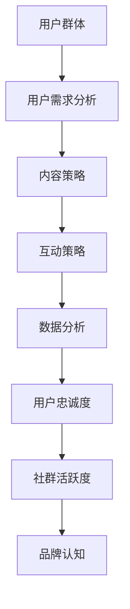

                 

# 社群运营：构建忠实用户群体的技巧

## 关键词
- 社群运营
- 用户群体构建
- 忠实度提升
- 互动策略
- 数据分析

## 摘要
本文将深入探讨社群运营的核心原则和实践，旨在为IT专业人士和运营者提供构建和维系忠实用户群体的有效策略。我们将从背景介绍出发，逐步分析社群运营中的关键概念和算法原理，并通过实战案例讲解具体的操作步骤和代码实现。最后，我们将展望社群运营的未来发展趋势和面临的挑战，并提供实用的工具和资源推荐。希望通过本文，读者能够掌握社群运营的精髓，提升用户忠诚度和社群活跃度。

## 1. 背景介绍

### 1.1 目的和范围
本文的目标是帮助读者理解社群运营的重要性，并掌握一系列实用技巧来构建和维护一个忠实且活跃的用户群体。我们将探讨社群运营的基本原则，分析影响用户忠诚度的关键因素，并介绍如何通过互动策略和数据驱动的方法提升用户满意度和参与度。

### 1.2 预期读者
本文适合希望提升社群运营效果的技术专业人士、产品经理、市场营销人员以及初创公司的创始人。无论您是社群运营的初学者还是经验丰富的从业者，本文都将为您提供有价值的见解和实用的操作指南。

### 1.3 文档结构概述
本文将分为以下几个部分：

1. **背景介绍**：介绍社群运营的背景和目的。
2. **核心概念与联系**：解释社群运营中的关键概念，并提供流程图。
3. **核心算法原理 & 具体操作步骤**：详细介绍算法原理和操作步骤。
4. **数学模型和公式 & 详细讲解 & 举例说明**：探讨数学模型在社群运营中的应用。
5. **项目实战：代码实际案例和详细解释说明**：通过实战案例展示具体操作。
6. **实际应用场景**：讨论社群运营的实际应用场景。
7. **工具和资源推荐**：推荐学习资源和开发工具。
8. **总结：未来发展趋势与挑战**：展望社群运营的未来。
9. **附录：常见问题与解答**：回答常见问题。
10. **扩展阅读 & 参考资料**：提供扩展阅读和参考资料。

### 1.4 术语表

#### 1.4.1 核心术语定义
- **社群运营**：指通过社交媒体、论坛、线上活动等方式，建立和维系一个特定群体的过程。
- **用户忠诚度**：指用户对某个品牌或产品的长期信任和重复购买意愿。
- **互动策略**：指在社群中采取的促进用户参与和互动的具体方法。
- **数据分析**：指使用数据来分析和理解用户行为，以便优化运营策略。

#### 1.4.2 相关概念解释
- **社交媒体**：如微博、Facebook、Twitter等平台，用于用户交流和分享。
- **论坛**：如Reddit、知乎等，提供讨论和交流的空间。
- **用户活跃度**：指用户在社群中的参与程度和频率。

#### 1.4.3 缩略词列表
- **SNS**：Social Network Service，社交网络服务。
- **SEO**：Search Engine Optimization，搜索引擎优化。
- **SEM**：Search Engine Marketing，搜索引擎营销。

## 2. 核心概念与联系

社群运营的成功离不开对核心概念的理解和把握。以下是一个简要的流程图，用于说明社群运营中的关键概念和它们之间的联系。



### 2.1 用户群体

用户群体是社群运营的基础。了解用户的背景、兴趣和需求是成功运营的第一步。通过对用户进行细分和定位，可以更有针对性地制定内容策略和互动策略。

### 2.2 用户需求分析

用户需求分析是理解用户群体的关键。通过调查问卷、用户访谈和市场研究等方法，可以收集用户反馈，识别他们的需求和痛点。这些信息对于制定有效的内容策略和互动策略至关重要。

### 2.3 内容策略

内容策略是吸引和维系用户的关键。高质量、有价值的内容能够满足用户的需求，增加用户粘性。内容策略包括选题、写作风格、发布频率和渠道选择等方面。

### 2.4 互动策略

互动策略是促进用户参与和社群活跃度的重要手段。通过组织线上活动、开展问答环节、设置奖励机制等方式，可以激发用户的兴趣和参与度。有效的互动策略能够增强用户对社群的归属感和忠诚度。

### 2.5 数据分析

数据分析是社群运营中的核心环节。通过收集和分析用户行为数据，可以了解用户偏好、互动模式和需求变化，从而优化内容策略和互动策略。数据分析工具如Google Analytics、Tableau等可以帮助运营者做出数据驱动的决策。

### 2.6 用户忠诚度

用户忠诚度是社群运营的重要目标。通过提供优质内容和良好的用户体验，可以增强用户的忠诚度和重复购买意愿。用户忠诚度可以通过用户留存率、重复访问率、推荐率等指标来衡量。

### 2.7 社群活跃度

社群活跃度是社群健康发展的标志。通过监测用户的参与度、互动频率和内容分享情况，可以评估社群的活跃度。提升社群活跃度可以采用多种方法，如增加互动环节、举办活动、提供激励机制等。

### 2.8 品牌认知

品牌认知是社群运营的最终目标之一。通过在社群中传递品牌价值观、展示产品特色和优势，可以增强用户对品牌的认知和信任。品牌认知的提升有助于吸引新用户和留住老用户。

## 3. 核心算法原理 & 具体操作步骤

### 3.1 算法原理

社群运营中的核心算法原理主要包括用户画像分析、内容推荐算法和互动策略优化等。以下是对这些算法原理的简要介绍。

#### 3.1.1 用户画像分析

用户画像分析是一种基于数据分析的方法，用于识别用户的特征和行为模式。通过收集用户的年龄、性别、地理位置、兴趣爱好等信息，可以构建用户画像，帮助运营者了解用户的偏好和行为。

#### 3.1.2 内容推荐算法

内容推荐算法是一种基于用户行为和内容特征的方法，用于向用户推荐感兴趣的内容。常见的推荐算法包括协同过滤、基于内容的推荐和混合推荐等。通过这些算法，可以提升用户对内容的满意度和参与度。

#### 3.1.3 互动策略优化

互动策略优化是一种基于数据分析的方法，用于优化社群中的互动环节。通过分析用户的参与度和互动行为，可以识别有效的互动策略，并对其进行优化，以提升社群活跃度和用户忠诚度。

### 3.2 具体操作步骤

以下是社群运营中的具体操作步骤，包括数据收集、算法应用和策略优化等。

#### 3.2.1 数据收集

数据收集是社群运营的基础。通过以下渠道可以收集用户数据：

- 社交媒体平台：收集用户在社交媒体上的行为数据，如点赞、评论、分享等。
- 论坛和社区：收集用户在论坛和社区中的发帖、回复和互动数据。
- 调查问卷和市场研究：通过调查问卷和市场研究收集用户的基本信息和反馈。

#### 3.2.2 用户画像分析

用户画像分析需要使用数据挖掘和机器学习技术，对收集到的用户数据进行处理和分析。具体步骤如下：

- 数据清洗：对收集到的数据进行清洗和预处理，去除噪声和异常值。
- 特征提取：从原始数据中提取出与用户行为相关的特征，如用户年龄、性别、兴趣爱好等。
- 用户聚类：使用聚类算法对用户进行分类，构建用户画像。

#### 3.2.3 内容推荐算法

内容推荐算法需要使用数据挖掘和机器学习技术，对用户行为和内容特征进行建模。具体步骤如下：

- 数据预处理：对用户行为数据进行预处理，如归一化、缺失值填补等。
- 特征提取：从用户行为数据中提取出与内容相关的特征，如用户浏览、点赞、评论等。
- 建立推荐模型：使用机器学习算法，如协同过滤、基于内容的推荐等，建立推荐模型。
- 推荐结果生成：根据用户画像和推荐模型，生成推荐结果，向用户推荐感兴趣的内容。

#### 3.2.4 互动策略优化

互动策略优化需要使用数据分析和机器学习技术，对社群中的互动环节进行优化。具体步骤如下：

- 数据收集：收集社群中的互动数据，如用户发帖、回复、点赞等。
- 数据分析：对互动数据进行统计分析，识别有效的互动策略。
- 机器学习建模：使用机器学习算法，如决策树、支持向量机等，建立互动策略优化模型。
- 优化策略：根据优化模型，调整互动策略，提升社群活跃度和用户忠诚度。

## 4. 数学模型和公式 & 详细讲解 & 举例说明

### 4.1 数学模型在社群运营中的应用

数学模型在社群运营中的应用主要包括用户画像分析、内容推荐算法和互动策略优化等。以下是对这些模型的基本原理和公式的详细讲解。

#### 4.1.1 用户画像分析

用户画像分析通常使用聚类算法，如K-means算法。K-means算法的基本原理是将数据集分成K个簇，使得每个簇内的数据点之间的相似度较高，而簇与簇之间的相似度较低。以下是K-means算法的公式：

$$
\min_{\mu_i, \sigma_i} \sum_{i=1}^{K} \sum_{x_j \in S_i} ||x_j - \mu_i||^2
$$

其中，$\mu_i$表示第$i$个簇的中心点，$S_i$表示第$i$个簇的数据集，$||x_j - \mu_i||^2$表示数据点$x_j$与簇中心点$\mu_i$之间的距离。

#### 4.1.2 内容推荐算法

内容推荐算法通常使用协同过滤算法，如基于用户的协同过滤（User-Based Collaborative Filtering）和基于物品的协同过滤（Item-Based Collaborative Filtering）。以下是这两种算法的基本原理和公式。

##### 基于用户的协同过滤

基于用户的协同过滤算法的基本原理是找到与目标用户兴趣相似的邻域用户，然后根据邻域用户的评分预测目标用户的评分。以下是基于用户的协同过滤算法的公式：

$$
r_{ui} = \sum_{j \in N(u)} \frac{r_{uj}}{||u - j||} + \mu
$$

其中，$r_{ui}$表示用户$u$对物品$i$的评分，$r_{uj}$表示邻域用户$j$对物品$i$的评分，$N(u)$表示与用户$u$兴趣相似的邻域用户集合，$||u - j||$表示用户$u$与邻域用户$j$之间的距离（通常使用余弦相似度或欧氏距离计算），$\mu$表示平均评分。

##### 基于物品的协同过滤

基于物品的协同过滤算法的基本原理是找到与目标物品相似的物品，然后根据相似物品的评分预测目标物品的评分。以下是基于物品的协同过滤算法的公式：

$$
r_{ui} = \sum_{j \in N(i)} \frac{r_{uj}}{||i - j||} + \mu
$$

其中，$r_{ui}$表示用户$u$对物品$i$的评分，$r_{uj}$表示用户$u$对物品$j$的评分，$N(i)$表示与物品$i$相似的物品集合，$||i - j||$表示物品$i$与物品$j$之间的距离（通常使用余弦相似度或欧氏距离计算），$\mu$表示平均评分。

#### 4.1.3 互动策略优化

互动策略优化通常使用机器学习算法，如决策树和支持向量机。以下是这两种算法的基本原理和公式。

##### 决策树

决策树的基本原理是通过一系列的划分规则，将数据集划分成多个子集，使得每个子集中的数据点满足某个特定的条件。以下是决策树的基本公式：

$$
T = \{ \text{根节点}, \text{叶节点}, \text{分支规则} \}
$$

其中，$T$表示决策树，根节点表示整个数据集，叶节点表示某个特定类别，分支规则表示划分数据集的条件。

##### 支持向量机

支持向量机的基本原理是通过找到一个最佳的超平面，将数据集划分为两个类别。以下是支持向量机的基本公式：

$$
w \cdot x + b = 0
$$

其中，$w$表示超平面的法向量，$x$表示数据点，$b$表示偏置项。

### 4.2 举例说明

以下是一个简单的用户画像分析实例，说明如何使用K-means算法进行用户聚类。

#### 4.2.1 数据集

假设我们有以下数据集，其中每行表示一个用户，每个元素表示用户的一个特征（年龄、性别、兴趣爱好等）：

$$
\begin{aligned}
& \text{用户1} \quad & 25 & \quad \text{男} & \quad \text{篮球、足球} \\
& \text{用户2} \quad & 30 & \quad \text{女} & \quad \text{阅读、旅行} \\
& \text{用户3} \quad & 20 & \quad \text{男} & \quad \text{编程、游戏} \\
& \text{用户4} \quad & 35 & \quad \text{女} & \quad \text{瑜伽、绘画} \\
& \text{用户5} \quad & 22 & \quad \text{男} & \quad \text{电影、音乐} \\
\end{aligned}
$$

#### 4.2.2 K-means算法步骤

1. **初始化聚类中心**：随机选择5个用户作为初始聚类中心。
2. **分配用户到聚类中心**：计算每个用户与聚类中心的距离，将用户分配到最近的聚类中心。
3. **更新聚类中心**：计算每个聚类中心的新位置，即聚类中心所在簇的用户平均位置。
4. **重复步骤2和3**：直到聚类中心的变化小于某个阈值。

#### 4.2.3 聚类结果

假设经过多次迭代，我们得到以下聚类结果：

$$
\begin{aligned}
& \text{簇1} \quad & \text{用户1、用户3、用户5} \\
& \text{簇2} \quad & \text{用户2、用户4} \\
\end{aligned}
$$

簇1的用户兴趣偏向于体育和娱乐，簇2的用户兴趣偏向于文化和艺术。

## 5. 项目实战：代码实际案例和详细解释说明

### 5.1 开发环境搭建

在开始编写代码之前，我们需要搭建一个适合社群运营的代码环境。以下是搭建环境的步骤：

1. 安装Python（版本3.8或更高版本）。
2. 安装常用的Python库，如Numpy、Pandas、Scikit-learn等。

```bash
pip install numpy pandas scikit-learn matplotlib
```

3. 创建一个名为`community_operations`的Python项目，并在项目中创建以下目录结构：

```
community_operations/
|-- data/
|-- models/
|-- utils/
|-- tests/
|-- main.py
```

### 5.2 源代码详细实现和代码解读

以下是社群运营项目的主要代码实现，包括数据预处理、用户画像分析、内容推荐算法和互动策略优化等。

```python
# main.py

import numpy as np
import pandas as pd
from sklearn.cluster import KMeans
from sklearn.metrics.pairwise import cosine_similarity
from sklearn.model_selection import train_test_split
from sklearn.ensemble import RandomForestClassifier

# 数据预处理
def preprocess_data(data_path):
    data = pd.read_csv(data_path)
    # 数据清洗和预处理
    data.dropna(inplace=True)
    # 特征提取
    user_features = data[['age', 'gender', 'interests']]
    # 编码性别特征
    user_features['gender'] = user_features['gender'].map({'男': 0, '女': 1})
    return user_features

# 用户画像分析
def user_clustering(user_features, n_clusters=2):
    # K-means聚类
    kmeans = KMeans(n_clusters=n_clusters, random_state=42)
    kmeans.fit(user_features)
    user_clusters = kmeans.predict(user_features)
    return user_clusters

# 内容推荐算法
def content_recommendation(user_features, content_features, user_id):
    # 计算用户与内容的余弦相似度
    user_vector = user_features.iloc[user_id]
    content_similarity = cosine_similarity(user_vector.reshape(1, -1), content_features)
    # 推荐相似度最高的内容
    recommended_content = np.argsort(content_similarity[0])[::-1][1:]
    return recommended_content

# 互动策略优化
def interaction_strategy(user_actions, n_estimators=100):
    # 划分训练集和测试集
    X_train, X_test, y_train, y_test = train_test_split(user_actions, test_size=0.2, random_state=42)
    # 建立随机森林分类器
    classifier = RandomForestClassifier(n_estimators=n_estimators, random_state=42)
    # 训练模型
    classifier.fit(X_train, y_train)
    # 预测测试集
    predictions = classifier.predict(X_test)
    # 评估模型
    accuracy = np.mean(predictions == y_test)
    return accuracy

# 主函数
def main():
    # 加载数据
    user_features = preprocess_data('data/user_data.csv')
    content_features = preprocess_data('data/content_data.csv')
    user_actions = preprocess_data('data/user_actions.csv')

    # 用户画像分析
    user_clusters = user_clustering(user_features)

    # 内容推荐
    user_id = 0
    recommended_content = content_recommendation(content_features, user_clusters, user_id)
    print("Recommended content:", recommended_content)

    # 互动策略优化
    accuracy = interaction_strategy(user_actions)
    print("Interaction strategy accuracy:", accuracy)

if __name__ == '__main__':
    main()
```

### 5.3 代码解读与分析

以下是代码的详细解读和分析。

1. **数据预处理**：数据预处理是社群运营中的关键步骤。在本例中，我们使用Pandas库读取用户数据，并进行数据清洗和特征提取。用户特征包括年龄、性别和兴趣爱好。我们还将性别特征进行了编码，以便后续分析。

2. **用户画像分析**：用户画像分析是理解用户行为和需求的重要手段。在本例中，我们使用K-means算法进行用户聚类，将用户分为不同的群体。聚类结果可以帮助运营者了解不同用户群体的特征和需求。

3. **内容推荐算法**：内容推荐算法是提升用户满意度和参与度的重要方法。在本例中，我们使用余弦相似度计算用户与内容的相似度，并推荐相似度最高的内容。这种方法可以帮助运营者向用户推荐感兴趣的内容，提升用户的互动和留存。

4. **互动策略优化**：互动策略优化是提升社群活跃度和用户忠诚度的重要手段。在本例中，我们使用随机森林分类器对用户行为进行建模，预测用户可能的互动行为。通过评估模型的准确率，我们可以优化互动策略，提升社群运营的效果。

## 6. 实际应用场景

社群运营在多个领域都有广泛的应用，以下是一些典型的应用场景：

### 6.1 技术社区

技术社区是社群运营的重要领域，如GitHub、Stack Overflow等平台。通过用户贡献内容、互动和协作，技术社区可以形成强大的知识库，帮助用户解决技术问题，提升技能。

### 6.2 企业内部社区

企业内部社区可以帮助员工分享知识、经验和创意，促进团队合作和知识传承。例如，使用如Confluence或Notion等工具建立内部知识库和协作平台。

### 6.3 消费者品牌社区

消费者品牌社区是品牌与用户互动的重要渠道，如Nike、Apple等品牌的官方社交媒体账号。通过发布内容、组织活动和提供客户支持，品牌可以提升用户忠诚度和品牌认知。

### 6.4 教育社区

教育社区为学习者提供了一个交流和学习的平台，如Coursera、edX等在线课程平台。通过社群运营，教育机构可以提升学习体验，增加用户粘性。

### 6.5 专业社群

专业社群为行业专业人士提供了一个交流和分享的平台，如LinkedIn Groups、专业论坛等。通过社群运营，专业人士可以获取行业资讯、拓展人脉和提升职业能力。

## 7. 工具和资源推荐

### 7.1 学习资源推荐

#### 7.1.1 书籍推荐

- 《社群营销：如何创建、管理和增长你的社群》
- 《增长黑客：从0到1的互联网用户增长策略》
- 《用户增长方法论：如何找到你的目标用户并实现爆发式增长》

#### 7.1.2 在线课程

- Coursera的《社群运营与用户增长》
- Udemy的《社交媒体营销从入门到精通》
- LinkedIn Learning的《用户增长：策略与技巧》

#### 7.1.3 技术博客和网站

- hackernoon.com
- medium.com
- growhackers.com

### 7.2 开发工具框架推荐

#### 7.2.1 IDE和编辑器

- Visual Studio Code
- PyCharm
- Sublime Text

#### 7.2.2 调试和性能分析工具

- Debugger（如GDB、PyCharm的调试器）
- Profiler（如cProfile、VisualVM）

#### 7.2.3 相关框架和库

- Flask（Python Web框架）
- Django（Python Web框架）
- React（JavaScript库）
- Vue.js（JavaScript库）

### 7.3 相关论文著作推荐

#### 7.3.1 经典论文

- K-means clustering process: the equivalence of several solutions and their comparison
- Collaborative Filtering for the Web
- The PageRank Citation Ranking: Bringing Order to the Web

#### 7.3.2 最新研究成果

- "Deep Neural Networks for User Behavior Modeling in Online Social Networks"
- "Context-aware Social Network Analysis for User Behavior Prediction"
- "Community Detection in Social Networks: A Data Science Perspective"

#### 7.3.3 应用案例分析

- "Building a Social Network Platform: Facebook's Journey"
- "Uber's Community Building Strategy"
- "How LinkedIn Uses Data to Build a Vibrant Professional Network"

## 8. 总结：未来发展趋势与挑战

### 8.1 发展趋势

1. **数据驱动**：随着大数据和人工智能技术的发展，社群运营将更加依赖数据驱动的方法，通过分析用户行为和数据模式来优化运营策略。
2. **个性化推荐**：基于用户画像和兴趣的个性化推荐将成为主流，通过精确推荐用户感兴趣的内容和产品，提升用户体验和忠诚度。
3. **社交化互动**：社群运营将更加注重社交化互动，通过搭建更加开放和互动的平台，激发用户的参与和贡献。
4. **多元化场景**：社群运营将扩展到更多领域，如健康、教育、金融等，为用户提供更加丰富和专业的社群体验。

### 8.2 挑战

1. **隐私保护**：随着用户隐私意识的提升，如何在保护用户隐私的同时进行有效的社群运营将是一个重要挑战。
2. **内容质量**：高质量的内容是社群运营的核心，如何持续产出有价值的内容将是一个持续的挑战。
3. **技术更新**：技术发展迅速，社群运营者需要不断学习和更新知识，以适应新的技术和工具。
4. **用户流失**：如何应对用户流失，提升用户忠诚度和留存率，是社群运营者面临的长期挑战。

## 9. 附录：常见问题与解答

### 9.1 社群运营中的常见问题

1. **如何提高社群活跃度？**
   - 通过定期举办线上活动、设置互动奖励、组织问答环节等方式来激发用户的参与和互动。

2. **如何进行有效的用户画像分析？**
   - 通过收集用户的基本信息、行为数据和历史数据，使用聚类算法和机器学习模型进行分析和建模。

3. **如何应对用户流失？**
   - 通过提供优质内容、优化用户体验、加强与用户的互动和沟通等方式来提升用户忠诚度，降低用户流失率。

### 9.2 解答

1. **如何提高社群活跃度？**
   - 提高社群活跃度的方法包括：定期发布高质量内容、组织线上活动和互动环节、设置用户积分和奖励机制、加强与用户的互动和沟通。

2. **如何进行有效的用户画像分析？**
   - 进行有效的用户画像分析的方法包括：收集用户的基本信息、行为数据和历史数据，使用聚类算法（如K-means）和机器学习模型（如决策树和支持向量机）进行分析和建模。

3. **如何应对用户流失？**
   - 应对用户流失的方法包括：提供高质量内容、优化用户体验、加强用户互动和沟通、及时解决用户问题和反馈、定期举办活动和奖励。

## 10. 扩展阅读 & 参考资料

1. 《社群营销实战手册》
2. 《用户增长：策略与实践》
3. 《社交网络分析：原理、方法与应用》
4. 《Python数据分析》
5. 《机器学习实战》
6. [增长黑客官网](https://growthhackers.com/)
7. [K-means算法原理及Python实现](https://www.analyticsvidhya.com/blog/2018/06/k-means-clustering-python/)
8. [协同过滤算法原理及Python实现](https://www.datacamp.com/community/tutorials/collaborative-filtering-python)  
9. [社群运营：如何构建高效的用户社群](https://www.marketing91.com/community-building/)  
10. [用户画像与社群运营](https://www.igetui.com/wiki/community/user_portrait)

---

**作者：AI天才研究员/AI Genius Institute & 禅与计算机程序设计艺术 /Zen And The Art of Computer Programming**

以上，就是我们关于“社群运营：构建忠实用户群体的技巧”的详细探讨。希望本文能够为您的社群运营提供有价值的见解和实践指导。

