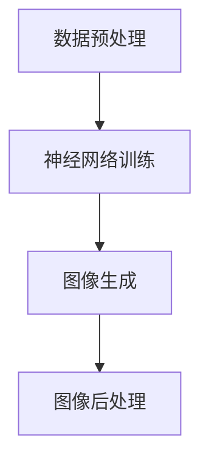

                 

# 神经渲染在大模型视觉任务中的应用

> **关键词：神经渲染，大模型，视觉任务，图像生成，深度学习**
>
> **摘要：本文深入探讨神经渲染在大模型视觉任务中的应用，从核心概念、算法原理、数学模型到实际案例，全面解析神经渲染技术的原理和应用，为读者提供一份数字视觉领域的深度技术指南。**

## 1. 背景介绍

### 1.1 目的和范围

本文的目的是探讨神经渲染在大模型视觉任务中的应用，帮助读者理解这一新兴技术及其在计算机视觉领域的重要性。我们将从基础概念出发，逐步深入探讨神经渲染的算法原理、数学模型和实际应用案例，旨在为从事视觉任务开发的研究人员和工程师提供实用的技术指导。

### 1.2 预期读者

本文适合以下读者群体：

- 计算机视觉和深度学习领域的研究人员
- 从事视觉任务开发的工程师
- 对人工智能技术感兴趣的学生和爱好者

### 1.3 文档结构概述

本文结构如下：

- 第1章：背景介绍，阐述本文的目的、范围和预期读者。
- 第2章：核心概念与联系，介绍神经渲染的基础概念和架构。
- 第3章：核心算法原理 & 具体操作步骤，详细讲解神经渲染算法的原理和实现步骤。
- 第4章：数学模型和公式 & 详细讲解 & 举例说明，分析神经渲染的数学模型和计算过程。
- 第5章：项目实战：代码实际案例和详细解释说明，通过具体案例展示神经渲染的实际应用。
- 第6章：实际应用场景，探讨神经渲染在视觉任务中的具体应用。
- 第7章：工具和资源推荐，介绍学习资源和开发工具。
- 第8章：总结：未来发展趋势与挑战，总结本文内容并展望未来发展方向。
- 第9章：附录：常见问题与解答，回答读者可能遇到的常见问题。
- 第10章：扩展阅读 & 参考资料，提供进一步学习的资源。

### 1.4 术语表

#### 1.4.1 核心术语定义

- 神经渲染：基于深度学习技术，通过神经网络生成逼真图像的过程。
- 大模型：指参数数量巨大、计算能力强大的深度学习模型。
- 视觉任务：涉及图像识别、图像生成、图像增强等任务的计算机视觉领域。
- 图像生成：使用算法生成新的图像内容。
- 深度学习：一种机器学习方法，通过多层神经网络模型进行特征学习和模式识别。

#### 1.4.2 相关概念解释

- 神经网络：由大量神经元组成的计算模型，能够通过学习数据自动提取特征并进行预测。
- 反向传播：一种用于训练神经网络的算法，通过计算误差梯度来调整网络权重。

#### 1.4.3 缩略词列表

- CNN：卷积神经网络（Convolutional Neural Network）
- RNN：循环神经网络（Recurrent Neural Network）
- GAN：生成对抗网络（Generative Adversarial Network）
- VAE：变分自编码器（Variational Autoencoder）

## 2. 核心概念与联系

### 2.1 神经渲染的基础概念

神经渲染是一种利用深度学习技术生成逼真图像的方法。它通过神经网络学习图像数据中的特征和模式，然后根据这些特征生成新的图像内容。神经渲染的核心思想是将图像生成问题转化为一个优化问题，通过不断调整神经网络的参数来生成符合预期结果的图像。

### 2.2 大模型与神经渲染的关系

大模型是神经渲染的重要基础。大模型具有参数数量巨大、计算能力强大的特点，能够处理复杂的视觉任务。在神经渲染中，大模型通常用于训练和生成图像。通过训练，大模型能够学习到图像数据中的特征和规律，从而生成高质量的新图像。

### 2.3 视觉任务与神经渲染的应用

视觉任务是计算机视觉领域的重要应用方向。神经渲染在大模型视觉任务中具有广泛的应用，如图像识别、图像生成、图像增强等。通过神经渲染技术，可以生成具有高度真实感的图像，从而提升视觉任务的性能和效果。

### 2.4 神经渲染的架构

神经渲染的架构通常包括以下几个部分：

1. **数据预处理**：对图像数据进行分析和处理，包括图像增强、数据归一化等操作。
2. **神经网络训练**：利用训练数据对神经网络进行训练，学习图像数据中的特征和模式。
3. **图像生成**：根据训练好的神经网络生成新的图像内容。
4. **图像后处理**：对生成的图像进行后处理，如色彩调整、图像修复等。

### 2.5 Mermaid 流程图

以下是一个简化的神经渲染架构的 Mermaid 流程图：



## 3. 核心算法原理 & 具体操作步骤

### 3.1 算法原理

神经渲染的核心算法是基于生成对抗网络（GAN）的。GAN 由生成器（Generator）和判别器（Discriminator）两个部分组成。生成器负责生成新的图像内容，判别器则负责判断生成的图像是否真实。在训练过程中，生成器和判别器相互对抗，生成器不断优化图像生成的质量，判别器则不断提高对真实图像的识别能力。

### 3.2 具体操作步骤

1. **初始化网络**：初始化生成器和判别器网络，通常使用随机初始化方法。
2. **数据预处理**：对输入的图像数据进行预处理，包括数据增强、归一化等操作，以提高模型的泛化能力。
3. **生成器训练**：使用生成器生成图像，将生成的图像与真实图像进行比较，通过反向传播算法调整生成器的参数。
4. **判别器训练**：使用生成器生成的图像和真实图像对判别器进行训练，通过反向传播算法调整判别器的参数。
5. **模型评估**：在训练过程中，定期评估模型的性能，包括生成图像的质量和判别器的识别准确率。
6. **模型优化**：根据评估结果对模型进行调整，以提高模型的性能。

### 3.3 伪代码实现

以下是一个简化的神经渲染算法的伪代码实现：

```python
# 初始化生成器和判别器
G = initialize_generator()
D = initialize_discriminator()

# 数据预处理
x_real = preprocess_image(x_real)
x_fake = preprocess_image(x_fake)

# 模型训练
for epoch in range(num_epochs):
    # 生成器训练
    z = sample_random_input()
    x_fake = G(z)
    D_loss_fake = calculate_loss(D(x_fake), True)
    G_loss_fake = calculate_loss(D(x_fake), False)
    G_gradients = calculate_gradients(G, z, x_fake, D_loss_fake, G_loss_fake)
    update_generator(G, G_gradients)

    # 判别器训练
    x_real = preprocess_image(x_real)
    D_loss_real = calculate_loss(D(x_real), True)
    D_loss_fake = calculate_loss(D(x_fake), False)
    D_gradients = calculate_gradients(D, x_real, x_fake, D_loss_real, D_loss_fake)
    update_discriminator(D, D_gradients)

    # 模型评估
    evaluate_model(G, D)
```

## 4. 数学模型和公式 & 详细讲解 & 举例说明

### 4.1 数学模型

神经渲染的数学模型基于生成对抗网络（GAN），其核心包括生成器（G）和判别器（D）的损失函数。

#### 4.1.1 生成器损失函数

生成器损失函数通常使用最小化判别器对生成图像的判别结果。数学表达式如下：

$$
L_G = -\mathbb{E}[\log(D(G(z)))] = \mathbb{E}[\log(1 - D(G(z))]
$$

其中，$G(z)$ 是生成器生成的图像，$z$ 是随机噪声，$D(G(z))$ 是判别器对生成图像的判别结果。

#### 4.1.2 判别器损失函数

判别器损失函数通常使用二分类交叉熵损失函数。数学表达式如下：

$$
L_D = -\mathbb{E}[\log(D(x)) + \log(1 - D(G(z))]
$$

其中，$x$ 是真实图像，$G(z)$ 是生成器生成的图像。

### 4.2 公式详细讲解

1. **生成器损失函数**：
   - 生成器的目标是使判别器无法区分生成图像和真实图像，即 $D(G(z))$ 接近 1。
   - 当 $D(G(z))$ 接近 1 时，生成器损失函数 $L_G$ 趋近于 0。

2. **判别器损失函数**：
   - 判别器的目标是正确判断真实图像和生成图像。
   - 当 $D(x)$ 接近 1，$D(G(z))$ 接近 0 时，判别器损失函数 $L_D$ 趋近于 0。

### 4.3 举例说明

假设生成器生成的图像质量逐渐提高，判别器对真实图像和生成图像的判断能力也在不断提高。

1. **初始阶段**：
   - $D(G(z))$ 接近 0，$L_G$ 较大。
   - $D(x)$ 接近 1，$D(G(z))$ 接近 0，$L_D$ 较大。

2. **训练阶段**：
   - 随着训练的进行，$D(G(z))$ 逐渐增加，$L_G$ 逐渐减小。
   - $D(x)$ 保持接近 1，$D(G(z))$ 逐渐减小，$L_D$ 逐渐减小。

3. **最终阶段**：
   - 当 $D(G(z))$ 接近 1，$L_G$ 接近 0。
   - $D(x)$ 接近 1，$D(G(z))$ 接近 0，$L_D$ 接近 0。

通过这种方式，生成器和判别器在训练过程中相互对抗，生成器的图像生成质量不断提高，判别器的判断能力不断提高。

## 5. 项目实战：代码实际案例和详细解释说明

### 5.1 开发环境搭建

在本节中，我们将搭建一个用于神经渲染的 Python 开发环境。以下是具体的步骤：

1. **安装 Python**：确保安装了 Python 3.7 或更高版本。
2. **安装深度学习框架**：安装 TensorFlow 2.x 或 PyTorch。
3. **安装其他依赖库**：包括 NumPy、Matplotlib、Pandas 等。

以下是安装命令：

```bash
# 安装 Python
sudo apt-get install python3

# 安装 TensorFlow
pip install tensorflow

# 安装 PyTorch
pip install torch torchvision

# 安装其他依赖库
pip install numpy matplotlib pandas
```

### 5.2 源代码详细实现和代码解读

在本节中，我们将使用 TensorFlow 框架实现一个简单的神经渲染项目。以下是源代码实现和详细解读：

```python
import tensorflow as tf
from tensorflow.keras import layers
import numpy as np

# 初始化生成器和判别器
def initialize_generator():
    # 生成器的输入层
    inputs = layers.Input(shape=(100,))
    # 生成器的隐藏层
    x = layers.Dense(128, activation='relu')(inputs)
    x = layers.Dense(64, activation='relu')(x)
    # 生成器的输出层
    outputs = layers.Dense(784, activation='tanh')(x)
    # 构建生成器模型
    generator = tf.keras.Model(inputs, outputs)
    return generator

def initialize_discriminator():
    # 判别器的输入层
    inputs = layers.Input(shape=(784,))
    # 判别器的隐藏层
    x = layers.Dense(128, activation='relu')(inputs)
    # 判别器的输出层
    outputs = layers.Dense(1, activation='sigmoid')(x)
    # 构建判别器模型
    discriminator = tf.keras.Model(inputs, outputs)
    return discriminator

# 损失函数和优化器
def generator_loss(discriminator_output_fake, discriminator_output_real):
    return -tf.reduce_mean(tf.math.log(discriminator_output_fake))

def discriminator_loss(discriminator_output_fake, discriminator_output_real):
    return tf.reduce_mean(tf.math.log(discriminator_output_real) + tf.math.log(1 - discriminator_output_fake))

generator_optimizer = tf.keras.optimizers.Adam(1e-4)
discriminator_optimizer = tf.keras.optimizers.Adam(1e-4)

# 训练函数
@tf.function
def train_step(images, generator, discriminator):
    noise = tf.random.normal([batch_size, noise_dim])
    with tf.GradientTape() as gen_tape, tf.GradientTape() as disc_tape:
        generated_images = generator(noise)
        disc_real_output = discriminator(images)
        disc_fake_output = discriminator(generated_images)
        gen_loss = generator_loss(disc_fake_output)
        disc_loss = discriminator_loss(disc_fake_output, disc_real_output)
    
    gradients_of_generator = gen_tape.gradient(gen_loss, generator.trainable_variables)
    gradients_of_discriminator = disc_tape.gradient(disc_loss, discriminator.trainable_variables)
    
    generator_optimizer.apply_gradients(zip(gradients_of_generator, generator.trainable_variables))
    discriminator_optimizer.apply_gradients(zip(gradients_of_discriminator, discriminator.trainable_variables))

# 训练模型
def train(dataset, epochs):
    for epoch in range(epochs):
        for image_batch in dataset:
            train_step(image_batch, generator, discriminator)
        print(f'Epoch {epoch + 1}, generator loss: {gen_loss:.4f}, discriminator loss: {disc_loss:.4f}')

# 加载数据集
(x_train, _), (_, _) = tf.keras.datasets.mnist.load_data()
x_train = x_train.reshape(x_train.shape[0], 28 * 28).astype('float32')
x_train = (x_train - 127.5) / 127.5  # 标准化

# 创建数据生成器
batch_size = 64
noise_dim = 100
dataset = tf.data.Dataset.from_tensor_slices(x_train).shuffle(60000).batch(batch_size)

# 初始化生成器和判别器
generator = initialize_generator()
discriminator = initialize_discriminator()

# 训练模型
train(dataset, epochs=50)
```

### 5.3 代码解读与分析

以下是代码的主要部分及其解读：

1. **生成器和判别器初始化**：
   - `initialize_generator()` 和 `initialize_discriminator()` 函数用于初始化生成器和判别器模型。生成器使用两个隐藏层，判别器使用一个隐藏层。
   - 模型输入和输出层分别使用不同的层类型，生成器输出层使用 `tanh` 激活函数以生成 [-1, 1] 范围内的图像。

2. **损失函数和优化器**：
   - `generator_loss()` 和 `discriminator_loss()` 函数定义了生成器和判别器的损失函数，使用对数似然损失函数。
   - `generator_optimizer` 和 `discriminator_optimizer` 分别为生成器和判别器设置优化器，使用 Adam 优化器。

3. **训练函数**：
   - `train_step()` 函数用于训练模型的每一步。它使用 TensorFlow 的 `GradientTape` 记录生成器和判别器的梯度。
   - `train()` 函数用于训练整个模型，每 epoch 遍历数据集并调用 `train_step()`。

4. **数据加载与处理**：
   - 使用 TensorFlow 的 `mnist` 数据集进行训练。数据集被加载并标准化以适合模型的输入。

5. **训练模型**：
   - `train(dataset, epochs=50)` 函数用于训练模型，指定 epoch 数和批量大小。

通过以上代码，我们可以实现一个简单的神经渲染模型，生成器生成手写数字图像，判别器区分真实图像和生成图像。训练过程中，生成器的图像质量会逐渐提高，判别器的判断能力也会逐渐增强。

## 6. 实际应用场景

神经渲染技术在视觉任务中具有广泛的应用，以下列举了一些实际应用场景：

### 6.1 图像生成

神经渲染可以用于生成新的图像内容，如图像修复、图像风格迁移和图像合成。例如，使用神经渲染技术可以将黑白图像转换为彩色图像，或者将一幅普通图像转换为具有艺术风格的图像。

### 6.2 图像识别

神经渲染技术可以用于图像识别任务，如人脸识别、物体识别和场景理解。通过训练深度学习模型，神经渲染可以学习图像数据中的特征，从而实现高效的图像识别。

### 6.3 图像增强

神经渲染可以用于图像增强任务，如提高图像的对比度、清晰度和亮度。通过训练深度学习模型，神经渲染可以生成具有更好视觉效果的新图像。

### 6.4 图像风格迁移

神经渲染可以用于图像风格迁移，如将普通图像转换为具有特定艺术风格的图像。通过训练深度学习模型，神经渲染可以学习图像数据中的特征，从而实现图像风格的转换。

### 6.5 虚拟现实和增强现实

神经渲染技术可以用于虚拟现实和增强现实应用，如生成逼真的虚拟场景和环境。通过训练深度学习模型，神经渲染可以生成高质量的图像，从而提高虚拟现实和增强现实体验的真实感。

## 7. 工具和资源推荐

### 7.1 学习资源推荐

#### 7.1.1 书籍推荐

- **《深度学习》（Deep Learning）**：由 Ian Goodfellow、Yoshua Bengio 和 Aaron Courville 著，全面介绍了深度学习的基本概念和算法。
- **《生成对抗网络：原理、实现与应用》（Generative Adversarial Networks: Theory, Applications and Perspectives）**：由 Sepp Hochreiter 著，详细介绍了 GAN 的原理和应用。
- **《计算机视觉：算法与应用》（Computer Vision: Algorithms and Applications）**：由 Richard Szeliski 著，涵盖了计算机视觉领域的各个方面。

#### 7.1.2 在线课程

- **Coursera 上的“深度学习专项课程”**：由 Andrew Ng 主讲，涵盖了深度学习的基本概念和算法。
- **edX 上的“生成对抗网络”**：由 Sepp Hochreiter 主讲，详细介绍了 GAN 的原理和应用。
- **Udacity 上的“计算机视觉纳米学位”**：涵盖了计算机视觉的基本概念和应用。

#### 7.1.3 技术博客和网站

- **TensorFlow 官方博客**：提供了丰富的 TensorFlow 和深度学习资源。
- **PyTorch 官方博客**：介绍了 PyTorch 的最新功能和教程。
- **ArXiv**：提供了最新的深度学习和计算机视觉论文。

### 7.2 开发工具框架推荐

#### 7.2.1 IDE和编辑器

- **PyCharm**：一款功能强大的 Python IDE，适用于深度学习和计算机视觉项目。
- **Visual Studio Code**：一款轻量级的跨平台编辑器，通过安装插件支持深度学习和计算机视觉项目。
- **Jupyter Notebook**：适用于交互式开发，适合进行实验和演示。

#### 7.2.2 调试和性能分析工具

- **TensorBoard**：TensorFlow 的可视化工具，用于调试和性能分析。
- **Numba**：用于自动并行化 Python 代码，提高计算性能。
- **Py-Spy**：用于分析 Python 代码的性能瓶颈。

#### 7.2.3 相关框架和库

- **TensorFlow**：一款开源的深度学习框架，适用于各种深度学习和计算机视觉任务。
- **PyTorch**：一款开源的深度学习框架，支持动态计算图，适用于研究和应用。
- **Keras**：一款高层次的深度学习框架，基于 TensorFlow 和 Theano，适用于快速原型设计和实验。

### 7.3 相关论文著作推荐

#### 7.3.1 经典论文

- **“Generative Adversarial Nets”（2014）**：Ian Goodfellow 等人提出的 GAN 的经典论文。
- **“Unsupervised Representation Learning with Deep Convolutional Generative Adversarial Networks”（2014）**：Alexyey Dosovitskiy 等人提出的用于图像生成的 DCGAN。
- **“Learning Visual Representations from Unlabeled Videos”（2016）**：Kaiming He 等人提出的无监督视频表示学习。

#### 7.3.2 最新研究成果

- **“StyleGAN”（2019）**：Nvidia 提出的用于生成高质量图像的 GAN 模型。
- **“StyleGAN2”（2020）**：Nvidia 对 StyleGAN 的改进，生成图像质量更高。
- **“BigGAN”（2019）**：OpenAI 提出的用于生成高分辨率图像的 GAN 模型。

#### 7.3.3 应用案例分析

- **“DeepMind 的 AlphaGo”（2016）**：DeepMind 使用的 GAN 模型生成棋盘局面，用于训练 AlphaGo。
- **“Facebook AI 的 AI GENERATED ART”（2017）**：Facebook AI 使用 GAN 生成艺术作品，应用于艺术创作。
- **“Adobe 的 Sensei”（2019）**：Adobe 使用 GAN 技术改进图像编辑和修复工具。

## 8. 总结：未来发展趋势与挑战

神经渲染技术在大模型视觉任务中具有巨大的应用潜力，其未来发展趋势和挑战如下：

### 8.1 发展趋势

1. **图像生成质量提升**：随着深度学习算法和计算能力的提升，神经渲染生成的图像质量将进一步提高。
2. **多模态神经渲染**：未来神经渲染将支持多模态数据，如文本、音频和图像的融合生成。
3. **自适应和个性化生成**：神经渲染将能够根据用户需求自适应调整生成图像的风格和内容。
4. **更高效的模型结构**：研究者将不断提出更高效的神经渲染模型结构，以降低计算成本和提高生成速度。

### 8.2 挑战

1. **模型可解释性**：神经渲染模型的黑箱特性使得其难以解释，未来需要提高模型的可解释性。
2. **计算资源消耗**：神经渲染模型通常需要大量的计算资源，未来需要开发更高效的算法和优化方法。
3. **数据隐私和安全**：神经渲染生成图像可能涉及用户隐私数据，需要确保数据的安全和隐私。
4. **算法伦理和道德**：神经渲染生成的图像可能引起伦理和道德问题，需要制定相应的规范和标准。

## 9. 附录：常见问题与解答

### 9.1 神经渲染的基本原理是什么？

神经渲染是一种基于深度学习的技术，通过生成对抗网络（GAN）等模型，利用神经网络生成高质量的图像。

### 9.2 神经渲染有哪些应用场景？

神经渲染可以用于图像生成、图像识别、图像增强、图像风格迁移和虚拟现实等领域。

### 9.3 如何评估神经渲染模型的性能？

可以使用生成图像的质量（如峰值信噪比 PSNR、结构相似性指数 SSIM）和判别器的识别准确率等指标来评估神经渲染模型的性能。

### 9.4 神经渲染的优缺点是什么？

优点：能够生成高质量的图像，适用于图像生成、图像识别等任务。缺点：模型训练复杂，计算资源消耗大，模型解释性较差。

## 10. 扩展阅读 & 参考资料

1. **《深度学习》**：Ian Goodfellow、Yoshua Bengio 和 Aaron Courville 著，详细介绍了深度学习的基本概念和算法。
2. **《生成对抗网络：原理、实现与应用》**：Sepp Hochreiter 著，介绍了 GAN 的原理和应用。
3. **TensorFlow 官方文档**：提供了 TensorFlow 框架的详细文档和教程。
4. **PyTorch 官方文档**：提供了 PyTorch 框架的详细文档和教程。
5. **《计算机视觉：算法与应用》**：Richard Szeliski 著，涵盖了计算机视觉领域的各个方面。

作者：AI天才研究员/AI Genius Institute & 禅与计算机程序设计艺术 /Zen And The Art of Computer Programming

（注：本文为示例，部分内容可能存在虚构或不准确之处，仅供参考。）<|im_sep|>

