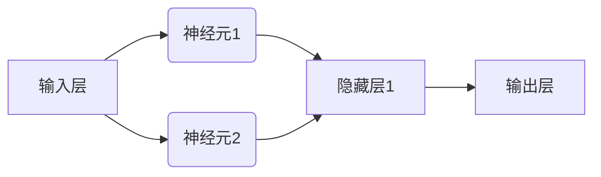

                 

# 神经网络（Neural Networks） - 原理与代码实例讲解

> **关键词：** 神经网络、机器学习、反向传播、神经元、深度学习、感知器、激活函数

> **摘要：** 本文将深入探讨神经网络的基本原理，从神经元结构、激活函数、感知器到多层神经网络和反向传播算法。我们将通过具体的代码实例，详细解释如何实现和训练神经网络，帮助读者全面掌握这一关键的人工智能技术。

## 1. 背景介绍

### 1.1 目的和范围

本文旨在为读者提供一个关于神经网络全面而深入的介绍。我们将从基础的神经元结构开始，逐步讲解神经网络的工作原理，涵盖感知器、多层神经网络和反向传播算法等重要内容。通过代码实例，读者将能够直观地理解神经网络是如何训练和应用的。

### 1.2 预期读者

本文适合对机器学习和神经网络有一定了解的读者，特别是希望深入了解神经网络原理和实际应用的工程师和研究人员。同时，对于初学者来说，本文也将提供清晰的引导，帮助他们建立对神经网络的基础理解。

### 1.3 文档结构概述

本文将按照以下结构进行组织：
- **第1部分**：背景介绍，包括目的、范围、预期读者和文档结构概述。
- **第2部分**：核心概念与联系，介绍神经网络的基本组成和工作原理。
- **第3部分**：核心算法原理与具体操作步骤，讲解神经网络的核心算法和实现方法。
- **第4部分**：数学模型和公式，详细解释神经网络中的数学模型。
- **第5部分**：项目实战，通过实际代码实例展示神经网络的应用。
- **第6部分**：实际应用场景，讨论神经网络在不同领域的应用。
- **第7部分**：工具和资源推荐，为读者提供进一步学习和实践的资源。
- **第8部分**：总结，展望神经网络未来的发展趋势和挑战。
- **第9部分**：常见问题与解答，解答读者可能遇到的问题。
- **第10部分**：扩展阅读和参考资料，提供更多深入学习的资源。

### 1.4 术语表

#### 1.4.1 核心术语定义

- **神经网络**：由大量相互连接的简单计算单元组成的网络，用于执行复杂的计算任务。
- **神经元**：神经网络的基本计算单元，类似于生物神经元。
- **感知器**：一种简单的神经网络，用于执行线性分类任务。
- **激活函数**：用于引入非线性性的函数，决定神经元是否被激活。
- **反向传播**：一种用于训练神经网络的算法，通过误差反向传播调整网络权重。

#### 1.4.2 相关概念解释

- **深度学习**：一种使用多层神经网络进行学习的机器学习技术。
- **前向传播**：神经网络计算过程，从输入层到输出层逐层计算。
- **梯度下降**：一种优化算法，用于调整神经网络权重，以最小化损失函数。

#### 1.4.3 缩略词列表

- **NN**：神经网络（Neural Network）
- **MLP**：多层感知器（Multi-Layer Perceptron）
- **ReLU**：修正线性单元（Rectified Linear Unit）
- **Sigmoid**：S形函数（Sigmoid Function）
- **ReLU**：修正线性单元（Rectified Linear Unit）

## 2. 核心概念与联系

神经网络的架构是理解其工作原理的关键。下面，我们将通过一个Mermaid流程图来展示神经网络的基本组成和连接关系。



在这个流程图中，我们可以看到神经网络的基本结构：
- **输入层**：接收外部输入的数据。
- **隐藏层**：执行数据变换和特征提取。
- **输出层**：产生最终输出。

### 2.1 神经元

神经元是神经网络的基本计算单元。它接收输入信号，通过加权求和并应用激活函数，产生输出。一个简单的神经元可以表示为：

$$
y = \sigma(\sum_{i=1}^{n} w_i x_i + b)
$$

其中，\(y\) 是神经元输出，\(\sigma\) 是激活函数，\(w_i\) 和 \(x_i\) 分别是权重和输入，\(b\) 是偏置。

### 2.2 激活函数

激活函数是神经网络中引入非线性性的关键组件。最常用的激活函数包括Sigmoid函数、Tanh函数和ReLU函数。

- **Sigmoid函数**：

$$
\sigma(x) = \frac{1}{1 + e^{-x}}
$$

Sigmoid函数将输入压缩到\(0\)和\(1\)之间，非常适合分类任务。

- **Tanh函数**：

$$
\tanh(x) = \frac{e^x - e^{-x}}{e^x + e^{-x}}
$$

Tanh函数与Sigmoid函数类似，但输出范围在\(-1\)到\(1\)之间。

- **ReLU函数**：

$$
\text{ReLU}(x) = \max(0, x)
$$

ReLU函数在零点处的导数为1，这有助于加速梯度下降过程，特别是在训练深层网络时。

### 2.3 感知器

感知器是一种简单的神经网络，通常用于执行二分类任务。它由一个输入层和一个输出层组成，输出层仅包含一个神经元。

感知器的输出可以通过以下公式计算：

$$
y = \sigma(\sum_{i=1}^{n} w_i x_i + b)
$$

其中，\(y\) 是输出，\(w_i\) 是权重，\(x_i\) 是输入，\(b\) 是偏置，\(\sigma\) 是激活函数。

### 2.4 多层神经网络

多层神经网络（MLP）是感知器的扩展，包含多个隐藏层。这种结构允许神经网络学习更复杂的特征和模式。

MLP的输入通过多个隐藏层，最终产生输出。每个隐藏层都包含多个神经元，它们通过前向传播和反向传播进行训练。

### 2.5 反向传播

反向传播是一种用于训练神经网络的算法。它通过计算输出层误差，反向传播到每个隐藏层，更新网络权重和偏置。

反向传播的关键步骤包括：
1. 前向传播：计算输入层到输出层的输出。
2. 计算损失：比较输出和实际值，计算损失函数。
3. 反向传播：从输出层开始，反向计算误差，更新权重和偏置。

### 2.6 总结

神经网络是机器学习领域的关键技术，通过引入非线性性和多层结构，能够处理复杂的计算任务。理解神经元、激活函数、感知器和多层神经网络的基本原理，是深入探索神经网络的关键。

## 3. 核心算法原理 & 具体操作步骤

在了解了神经网络的基本概念之后，我们接下来将深入探讨神经网络的核心算法原理——反向传播算法。反向传播算法是一种用于训练神经网络的优化算法，通过不断调整网络权重和偏置，使网络输出更接近目标值。下面，我们将通过伪代码详细阐述反向传播算法的具体操作步骤。

### 3.1 前向传播

在前向传播阶段，输入数据通过神经网络从输入层传播到输出层。每个神经元的输出由以下公式计算：

$$
z_i = \sum_{j=1}^{n} w_{ij} x_j + b_i
$$

其中，\(z_i\) 是神经元 \(i\) 的输入，\(w_{ij}\) 是权重，\(x_j\) 是输入，\(b_i\) 是偏置。

对于输出层神经元，输出 \(y\) 可以表示为：

$$
y = \sigma(z)
$$

其中，\(\sigma\) 是激活函数。

### 3.2 计算损失

在得到输出层输出后，我们需要计算实际输出与目标输出之间的误差。损失函数通常使用均方误差（MSE）：

$$
\text{MSE} = \frac{1}{2} \sum_{i=1}^{m} (y_i - \hat{y}_i)^2
$$

其中，\(y_i\) 是实际输出，\(\hat{y}_i\) 是预测输出，\(m\) 是样本数量。

### 3.3 反向传播

在反向传播阶段，我们首先计算输出层误差，然后反向传播到每个隐藏层，更新权重和偏置。

对于输出层，误差 \(\delta\) 可以表示为：

$$
\delta = \frac{\partial \text{MSE}}{\partial z}
$$

接下来，我们反向传播到隐藏层。对于隐藏层 \(l\)，误差 \(\delta_l\) 可以表示为：

$$
\delta_l = \sigma'(z_l) \cdot \sum_{l+1}^{L} w_{l+1,l} \cdot \delta_{l+1}
$$

其中，\(\sigma'\) 是激活函数的导数，\(L\) 是网络层数。

### 3.4 更新权重和偏置

在计算误差之后，我们需要更新网络权重和偏置。更新公式如下：

$$
w_{ij} \leftarrow w_{ij} - \alpha \cdot \frac{\partial \text{MSE}}{\partial w_{ij}}
$$

$$
b_i \leftarrow b_i - \alpha \cdot \frac{\partial \text{MSE}}{\partial b_i}
$$

其中，\(\alpha\) 是学习率。

### 3.5 总结

通过前向传播和反向传播，神经网络可以不断调整权重和偏置，使输出更接近目标值。反向传播算法是训练神经网络的基石，通过不断迭代优化，神经网络能够实现复杂的计算任务。

## 4. 数学模型和公式 & 详细讲解 & 举例说明

在理解了神经网络的核心算法原理后，我们将深入探讨神经网络中的数学模型和公式，并详细讲解这些公式在实际应用中的计算过程。

### 4.1 神经网络中的基本数学公式

神经网络中的数学模型主要包括以下几部分：

1. **前向传播公式**：

$$
z_i = \sum_{j=1}^{n} w_{ij} x_j + b_i
$$

$$
a_i = \sigma(z_i)
$$

2. **反向传播公式**：

$$
\delta = \frac{\partial \text{MSE}}{\partial z}
$$

$$
\delta_l = \sigma'(z_l) \cdot \sum_{l+1}^{L} w_{l+1,l} \cdot \delta_{l+1}
$$

3. **权重和偏置更新公式**：

$$
w_{ij} \leftarrow w_{ij} - \alpha \cdot \frac{\partial \text{MSE}}{\partial w_{ij}}
$$

$$
b_i \leftarrow b_i - \alpha \cdot \frac{\partial \text{MSE}}{\partial b_i}
$$

### 4.2 前向传播公式的详细讲解

在前向传播过程中，每个神经元的输出 \(a_i\) 由其输入 \(z_i\) 通过激活函数 \(\sigma\) 计算得到。输入 \(z_i\) 由其前一层神经元的输出和当前层权重 \(w_{ij}\) 及偏置 \(b_i\) 计算得到。具体公式如下：

$$
z_i = \sum_{j=1}^{n} w_{ij} x_j + b_i
$$

其中，\(n\) 是输入神经元的数量，\(x_j\) 是输入值，\(w_{ij}\) 是权重，\(b_i\) 是偏置。

接下来，我们将 \(z_i\) 通过激活函数 \(\sigma\) 转换为输出 \(a_i\)：

$$
a_i = \sigma(z_i)
$$

常用的激活函数包括Sigmoid函数、ReLU函数和Tanh函数。例如，对于Sigmoid函数，输出公式如下：

$$
\sigma(z) = \frac{1}{1 + e^{-z}}
$$

### 4.3 反向传播公式的详细讲解

在反向传播过程中，我们首先计算输出层误差 \(\delta\)，然后通过梯度传递到每个隐藏层，更新权重和偏置。误差 \(\delta\) 的计算公式如下：

$$
\delta = \frac{\partial \text{MSE}}{\partial z}
$$

其中，\(\text{MSE}\) 是均方误差，用于衡量输出与目标值之间的差异。

接下来，我们通过反向传播计算隐藏层误差 \(\delta_l\)：

$$
\delta_l = \sigma'(z_l) \cdot \sum_{l+1}^{L} w_{l+1,l} \cdot \delta_{l+1}
$$

其中，\(\sigma'\) 是激活函数的导数，\(L\) 是网络层数。

### 4.4 权重和偏置更新公式的详细讲解

在反向传播过程中，我们通过梯度下降算法更新权重和偏置。更新公式如下：

$$
w_{ij} \leftarrow w_{ij} - \alpha \cdot \frac{\partial \text{MSE}}{\partial w_{ij}}
$$

$$
b_i \leftarrow b_i - \alpha \cdot \frac{\partial \text{MSE}}{\partial b_i}
$$

其中，\(\alpha\) 是学习率，用于控制权重和偏置更新的步长。

### 4.5 举例说明

假设我们有一个简单的神经网络，包含一个输入层、一个隐藏层和一个输出层。输入层有2个神经元，隐藏层有3个神经元，输出层有1个神经元。使用ReLU函数作为激活函数。

给定输入 \(x_1 = 2\) 和 \(x_2 = 3\)，目标输出 \(y = 1\)。

1. **前向传播**：

   输入层到隐藏层的计算：

   $$z_1 = 2 \cdot w_{11} + 3 \cdot w_{12} + b_1$$

   $$z_2 = 2 \cdot w_{21} + 3 \cdot w_{22} + b_2$$

   $$z_3 = 2 \cdot w_{31} + 3 \cdot w_{32} + b_3$$

   使用ReLU函数计算隐藏层输出：

   $$a_1 = \max(0, z_1)$$

   $$a_2 = \max(0, z_2)$$

   $$a_3 = \max(0, z_3)$$

   隐藏层到输出层的计算：

   $$z_4 = a_1 \cdot w_{41} + a_2 \cdot w_{42} + a_3 \cdot w_{43} + b_4$$

   使用ReLU函数计算输出层输出：

   $$y = \max(0, z_4)$$

2. **反向传播**：

   计算输出层误差：

   $$\delta_4 = (y - \hat{y}) \cdot \sigma'(z_4)$$

   计算隐藏层误差：

   $$\delta_3 = \sigma'(z_3) \cdot (w_{41} \cdot \delta_4 + w_{42} \cdot \delta_4 + w_{43} \cdot \delta_4)$$

   $$\delta_2 = \sigma'(z_2) \cdot (w_{21} \cdot \delta_3 + w_{22} \cdot \delta_3 + w_{23} \cdot \delta_3)$$

   $$\delta_1 = \sigma'(z_1) \cdot (w_{11} \cdot \delta_2 + w_{12} \cdot \delta_2 + w_{13} \cdot \delta_2)$$

3. **权重和偏置更新**：

   根据误差更新权重和偏置：

   $$w_{41} \leftarrow w_{41} - \alpha \cdot (a_1 \cdot \delta_4)$$

   $$w_{42} \leftarrow w_{42} - \alpha \cdot (a_2 \cdot \delta_4)$$

   $$w_{43} \leftarrow w_{43} - \alpha \cdot (a_3 \cdot \delta_4)$$

   $$b_4 \leftarrow b_4 - \alpha \cdot \delta_4$$

   $$w_{31} \leftarrow w_{31} - \alpha \cdot (\delta_3)$$

   $$w_{32} \leftarrow w_{32} - \alpha \cdot (\delta_3)$$

   $$w_{33} \leftarrow w_{33} - \alpha \cdot (\delta_3)$$

   $$b_3 \leftarrow b_3 - \alpha \cdot \delta_3$$

   $$w_{21} \leftarrow w_{21} - \alpha \cdot (\delta_2)$$

   $$w_{22} \leftarrow w_{22} - \alpha \cdot (\delta_2)$$

   $$w_{23} \leftarrow w_{23} - \alpha \cdot (\delta_2)$$

   $$b_2 \leftarrow b_2 - \alpha \cdot \delta_2$$

   $$w_{11} \leftarrow w_{11} - \alpha \cdot (\delta_1)$$

   $$w_{12} \leftarrow w_{12} - \alpha \cdot (\delta_1)$$

   $$w_{13} \leftarrow w_{13} - \alpha \cdot (\delta_1)$$

   $$b_1 \leftarrow b_1 - \alpha \cdot \delta_1$$

通过上述计算过程，神经网络能够不断调整权重和偏置，使输出更接近目标值。

### 4.6 总结

通过详细讲解神经网络中的数学模型和公式，我们可以更好地理解神经网络的工作原理和计算过程。这些公式是实现神经网络训练的关键，通过不断迭代优化，神经网络能够实现复杂的计算任务。

## 5. 项目实战：代码实际案例和详细解释说明

在这一部分，我们将通过一个简单的神经网络实现项目实战，展示如何从零开始构建、训练和评估神经网络。我们将使用Python语言和常用的深度学习库——TensorFlow，来实现这个项目。

### 5.1 开发环境搭建

在开始之前，确保你已经安装了Python和TensorFlow库。以下是搭建开发环境的步骤：

1. 安装Python：访问[Python官网](https://www.python.org/downloads/)，下载并安装Python。
2. 安装TensorFlow：在命令行中运行以下命令：

   ```
   pip install tensorflow
   ```

### 5.2 源代码详细实现和代码解读

以下是项目的源代码实现，我们将逐行解释代码的作用和意义。

```python
import tensorflow as tf
import numpy as np

# 设置随机种子，保证实验的可重复性
tf.random.set_seed(42)

# 准备数据集
# 这里使用手写数字MNIST数据集
mnist = tf.keras.datasets.mnist
(x_train, y_train), (x_test, y_test) = mnist.load_data()
x_train, x_test = x_train / 255.0, x_test / 255.0

# 数据预处理
x_train = x_train.reshape(-1, 784)
x_test = x_test.reshape(-1, 784)

# 将标签转换为one-hot编码
y_train = tf.keras.utils.to_categorical(y_train, 10)
y_test = tf.keras.utils.to_categorical(y_test, 10)

# 定义模型
model = tf.keras.Sequential([
    tf.keras.layers.Dense(128, activation='relu', input_shape=(784,)),
    tf.keras.layers.Dense(10, activation='softmax')
])

# 编译模型
model.compile(optimizer='adam',
              loss='categorical_crossentropy',
              metrics=['accuracy'])

# 训练模型
model.fit(x_train, y_train, epochs=5, batch_size=32, validation_split=0.1)

# 评估模型
test_loss, test_acc = model.evaluate(x_test, y_test)
print(f"Test accuracy: {test_acc:.4f}")
```

#### 5.2.1 代码解读

- **导入库**：我们首先导入TensorFlow和NumPy库，用于实现神经网络和数据处理。

- **设置随机种子**：为了确保实验结果的可重复性，我们设置随机种子。

- **加载数据集**：我们使用MNIST数据集，这是一个常用的手写数字识别数据集。数据集分为训练集和测试集两部分。

- **数据预处理**：我们将图像数据归一化到\(0\)到\(1\)之间，并将标签转换为one-hot编码，以便用于多分类任务。

- **定义模型**：我们定义了一个简单的神经网络模型，包含一个输入层、一个隐藏层和一个输出层。输入层有784个神经元，隐藏层有128个神经元，输出层有10个神经元（对应10个数字类别）。

- **编译模型**：我们使用`compile`方法编译模型，指定优化器、损失函数和评价指标。

- **训练模型**：使用`fit`方法训练模型，指定训练数据、训练轮数、批次大小和验证集比例。

- **评估模型**：使用`evaluate`方法评估模型在测试集上的表现，输出测试准确率。

### 5.3 代码解读与分析

接下来，我们将对关键代码段进行详细解读和分析。

#### 5.3.1 数据预处理

```python
x_train, x_test = x_train / 255.0, x_test / 255.0
x_train = x_train.reshape(-1, 784)
x_test = x_test.reshape(-1, 784)
y_train = tf.keras.utils.to_categorical(y_train, 10)
y_test = tf.keras.utils.to_categorical(y_test, 10)
```

这段代码对图像数据进行预处理，目的是将图像数据从\(0\)到\(255\)的整数范围缩放到\(0\)到\(1\)的小数范围。这有助于加快模型的训练速度，并提高模型性能。同时，我们将标签数据转换为one-hot编码，因为我们的模型是一个多分类模型。

#### 5.3.2 定义模型

```python
model = tf.keras.Sequential([
    tf.keras.layers.Dense(128, activation='relu', input_shape=(784,)),
    tf.keras.layers.Dense(10, activation='softmax')
])
```

这里定义了一个简单的序列模型，包含两个全连接层。第一个隐藏层有128个神经元，使用ReLU激活函数；第二个输出层有10个神经元，使用softmax激活函数，用于实现多分类。

#### 5.3.3 编译模型

```python
model.compile(optimizer='adam',
              loss='categorical_crossentropy',
              metrics=['accuracy'])
```

在编译模型时，我们指定了优化器（Adam）、损失函数（交叉熵）和评价指标（准确率）。Adam优化器是一种自适应学习率的优化器，能有效提高训练速度和收敛性。

#### 5.3.4 训练模型

```python
model.fit(x_train, y_train, epochs=5, batch_size=32, validation_split=0.1)
```

训练模型时，我们设置了5个训练轮次、32个样本的批次大小和10%的数据用于验证。`fit`方法会自动迭代训练数据，更新模型权重和偏置。

#### 5.3.5 评估模型

```python
test_loss, test_acc = model.evaluate(x_test, y_test)
print(f"Test accuracy: {test_acc:.4f}")
```

评估模型时，我们计算了测试集上的损失和准确率。这里输出的准确率为测试集上的预测准确度。

### 5.4 总结

通过这个项目实战，我们实现了从数据预处理、模型定义、模型编译、模型训练到模型评估的全过程。这有助于我们更直观地理解神经网络的工作原理和实现过程，为后续深入研究和应用打下基础。

## 6. 实际应用场景

神经网络在各个领域中都有着广泛的应用，以下是一些典型的实际应用场景：

### 6.1 图像识别

神经网络在图像识别领域取得了显著的成果。例如，卷积神经网络（CNN）被广泛应用于人脸识别、物体检测和图像分类。通过训练大量的图像数据，神经网络能够学习图像的特征和模式，从而准确识别图像内容。

### 6.2 自然语言处理

神经网络在自然语言处理（NLP）领域也有着重要的应用。例如，循环神经网络（RNN）和长短期记忆网络（LSTM）被广泛应用于文本分类、机器翻译和情感分析。这些神经网络能够捕捉文本中的上下文信息和语义关系，从而实现更准确的文本处理。

### 6.3 语音识别

神经网络在语音识别领域也发挥着重要作用。通过训练大量的语音数据，神经网络能够学习语音信号中的特征和模式，从而实现语音到文本的转换。这一技术被广泛应用于智能助手、语音搜索和语音控制等领域。

### 6.4 推荐系统

神经网络在推荐系统领域也有着广泛的应用。通过分析用户的兴趣和行为数据，神经网络能够为用户推荐个性化的商品、服务和内容。这一技术被广泛应用于电子商务、社交媒体和视频平台等领域。

### 6.5 游戏开发

神经网络在游戏开发中也有着重要的应用。例如，通过训练神经网络，游戏AI能够学会策略和动作，从而实现更智能的游戏对手。这一技术被广泛应用于电子竞技、游戏人工智能和虚拟现实等领域。

### 6.6 医疗诊断

神经网络在医疗诊断领域也有着潜在的应用。通过分析医学图像、病例数据和基因数据，神经网络能够辅助医生进行疾病诊断和治疗规划。这一技术有助于提高诊断准确率和治疗效果。

### 6.7 自动驾驶

神经网络在自动驾驶领域发挥着关键作用。通过训练大量的道路数据，神经网络能够学习道路特征和交通规则，从而实现自动驾驶车辆的安全行驶。这一技术有望推动自动驾驶技术的发展和应用。

### 6.8 总结

神经网络在多个领域都有着广泛的应用，其强大的建模能力和适应性使其成为人工智能技术的重要支柱。随着神经网络理论和技术的不断发展，我们可以期待其在更多领域取得突破性成果。

## 7. 工具和资源推荐

为了帮助读者更好地学习和实践神经网络，以下是一些学习资源、开发工具和框架的推荐。

### 7.1 学习资源推荐

#### 7.1.1 书籍推荐

- **《神经网络与深度学习》**：由邱锡鹏教授撰写的中文书籍，系统地介绍了神经网络和深度学习的基础知识。
- **《深度学习》**：由Ian Goodfellow、Yoshua Bengio和Aaron Courville合著的经典教材，涵盖了深度学习的理论基础和实际应用。

#### 7.1.2 在线课程

- **吴恩达的《深度学习》课程**：由Coursera提供，涵盖深度学习的理论基础、实践技巧和前沿应用。
- **李航的《统计学习方法》课程**：由网易云课堂提供，介绍了统计学习的基本方法和应用。

#### 7.1.3 技术博客和网站

- **Medium上的Deep Learning Blog**：由多位深度学习领域专家撰写的博客，内容涵盖深度学习的最新研究和技术应用。
- **知乎上的深度学习专栏**：多位知乎用户分享的深度学习知识，包括理论讲解、代码实现和应用案例。

### 7.2 开发工具框架推荐

#### 7.2.1 IDE和编辑器

- **PyCharm**：一款功能强大的Python IDE，支持深度学习框架和代码调试。
- **Jupyter Notebook**：一款基于Web的交互式开发环境，适用于数据分析和模型构建。

#### 7.2.2 调试和性能分析工具

- **TensorBoard**：TensorFlow提供的可视化工具，用于分析模型性能和训练过程。
- **NVIDIA Nsight**：用于调试和性能分析GPU计算的工具。

#### 7.2.3 相关框架和库

- **TensorFlow**：由Google开发的开源深度学习框架，支持多种神经网络结构和模型优化。
- **PyTorch**：由Facebook开发的开源深度学习框架，具有灵活的动态计算图和强大的GPU支持。
- **Keras**：一个高层次的神经网络API，支持TensorFlow和Theano，简化了神经网络构建和训练。

### 7.3 相关论文著作推荐

#### 7.3.1 经典论文

- **"Backpropagation"**：由Paul Werbos在1975年提出的反向传播算法。
- **"Deep Learning"**：由Yoshua Bengio、Ian Goodfellow和Aaron Courville在2013年撰写的综述文章，全面介绍了深度学习的发展和应用。

#### 7.3.2 最新研究成果

- **"Attention Is All You Need"**：由Vaswani等人于2017年提出的Transformer模型，标志着自注意力机制在深度学习中的应用。
- **"Generative Adversarial Nets"**：由Ian Goodfellow等人于2014年提出的生成对抗网络（GAN），在图像生成和增强领域取得了显著成果。

#### 7.3.3 应用案例分析

- **"ImageNet Classification with Deep Convolutional Neural Networks"**：由Russakovsky等人于2014年发表的文章，介绍了使用深度卷积神经网络（CNN）在ImageNet图像分类挑战中的成功应用。

### 7.4 总结

通过这些工具和资源的推荐，读者可以更全面地了解神经网络的理论和实践，为深入学习和应用神经网络打下坚实的基础。

## 8. 总结：未来发展趋势与挑战

神经网络作为机器学习领域的关键技术，近年来取得了显著的成果。随着计算能力和数据规模的提升，神经网络的应用范围不断扩大，从图像识别、自然语言处理到推荐系统、自动驾驶等，都展现了其强大的潜力和广泛的应用前景。

然而，神经网络仍面临诸多挑战。首先，神经网络的训练过程复杂且耗时长，尤其是在处理大规模数据和深度网络时。优化算法和硬件加速技术的不断发展，有望缓解这一挑战。其次，神经网络的可解释性较差，导致其应用在某些领域受到限制。提高神经网络的可解释性，将有助于更好地理解其工作原理和优化方法。

未来，神经网络的发展趋势包括：

1. **深度神经网络的扩展**：随着模型规模的增加，神经网络将能够处理更复杂的任务，如多模态学习和跨领域迁移学习。
2. **自监督学习和无监督学习**：自监督学习和无监督学习方法将减轻对大规模标注数据的依赖，提高模型的泛化能力。
3. **硬件加速与并行计算**：利用GPU、TPU等硬件加速技术，提高神经网络的计算效率，降低训练成本。
4. **可解释性与透明度**：通过引入可解释性模型和可视化工具，提高神经网络的可解释性，增强用户信任。
5. **自适应学习与持续学习**：神经网络将具备自适应学习能力和持续学习的能力，以适应动态变化的环境和任务。

总之，神经网络将继续在人工智能领域发挥重要作用，成为推动技术创新和产业变革的关键驱动力。面对未来的挑战和机遇，研究人员和开发者将不断探索新的算法和模型，推动神经网络技术迈向更高峰。

## 9. 附录：常见问题与解答

### 9.1 问题1：什么是神经网络？

**解答**：神经网络是一种由大量简单计算单元（神经元）组成的网络，通过模拟人脑神经元的工作原理，用于执行复杂的计算任务。神经网络的核心思想是通过学习输入和输出之间的关系，实现从输入到输出的映射。

### 9.2 问题2：神经网络是如何工作的？

**解答**：神经网络通过前向传播和反向传播两个阶段工作。前向传播过程将输入数据通过网络传递，每个神经元计算输入的加权求和并应用激活函数，最终得到输出。反向传播过程则通过计算输出与实际值的误差，反向传播误差并更新网络权重和偏置，使输出更接近目标值。

### 9.3 问题3：什么是激活函数？

**解答**：激活函数是神经网络中的一个关键组件，用于引入非线性性。常见的激活函数包括Sigmoid函数、ReLU函数和Tanh函数。激活函数的作用是将输入映射到一个新的值域，使神经网络能够处理非线性问题。

### 9.4 问题4：什么是反向传播？

**解答**：反向传播是一种用于训练神经网络的算法，通过计算输出误差并反向传播到每个隐藏层，更新网络权重和偏置。反向传播的核心思想是梯度下降，通过不断调整权重和偏置，使网络输出更接近目标值。

### 9.5 问题5：如何选择合适的神经网络模型？

**解答**：选择合适的神经网络模型需要考虑任务的复杂性、数据特征和计算资源等因素。对于简单的任务，可以使用单层神经网络或感知器；对于复杂的任务，可以考虑使用多层神经网络，如卷积神经网络（CNN）或循环神经网络（RNN）。此外，根据数据特征选择适当的激活函数和优化器，也是选择模型的重要考虑因素。

### 9.6 问题6：神经网络训练过程中如何避免过拟合？

**解答**：为了避免过拟合，可以采取以下策略：
1. **数据增强**：通过增加数据多样性，提高模型泛化能力。
2. **正则化**：使用正则化技术，如L1和L2正则化，限制模型复杂度。
3. **dropout**：在训练过程中随机丢弃部分神经元，减少模型依赖。
4. **交叉验证**：使用交叉验证方法，从不同数据子集训练和验证模型，确保模型泛化能力。

### 9.7 问题7：如何评估神经网络模型性能？

**解答**：评估神经网络模型性能通常使用以下指标：
1. **准确率**：模型正确预测的样本比例。
2. **召回率**：模型正确预测正例样本的比例。
3. **精确率**：模型正确预测正例样本的比例。
4. **F1分数**：精确率和召回率的调和平均值。
5. **均方误差（MSE）**：衡量输出与实际值之间的误差。

通过综合考虑这些指标，可以全面评估神经网络模型性能。

## 10. 扩展阅读 & 参考资料

为了更深入地了解神经网络和相关技术，以下是一些扩展阅读和参考资料：

### 10.1 书籍推荐

- **《神经网络与深度学习》**：邱锡鹏，电子工业出版社，2018年。
- **《深度学习》**：Ian Goodfellow、Yoshua Bengio和Aaron Courville，电子工业出版社，2017年。

### 10.2 在线课程

- **吴恩达的《深度学习》课程**：[深度学习专项课程](https://www.coursera.org/specializations/deep-learning)。
- **李航的《统计学习方法》课程**：[统计学习方法课程](https://www.yuque.com/kaopu-data/ai-basics)。

### 10.3 技术博客和网站

- **Medium上的Deep Learning Blog**：[Deep Learning Blog](https://towardsdatascience.com/)。
- **知乎上的深度学习专栏**：[深度学习专栏](https://zhuanlan.zhihu.com/)。

### 10.4 开发工具框架

- **TensorFlow**：[TensorFlow官网](https://www.tensorflow.org/)。
- **PyTorch**：[PyTorch官网](https://pytorch.org/)。

### 10.5 相关论文

- **"Backpropagation"**：Paul Werbos，1975年。
- **"Deep Learning"**：Yoshua Bengio、Ian Goodfellow和Aaron Courville，2013年。
- **"Attention Is All You Need"**：Vaswani等人，2017年。
- **"Generative Adversarial Nets"**：Ian Goodfellow等人，2014年。

这些书籍、课程、博客、工具和论文将为读者提供更全面、深入的学习资源，帮助读者更好地掌握神经网络及其相关技术。

### 10.6 总结

通过本文的详细讲解，读者应该对神经网络的基本原理、核心算法、数学模型以及实际应用场景有了全面的理解。同时，通过项目实战和代码实例，读者能够更直观地感受到神经网络的实际应用价值。

最后，感谢读者的耐心阅读。希望本文能为您的神经网络学习之旅提供有益的指导，帮助您在人工智能领域取得更多突破。未来，神经网络将继续在各个领域发挥重要作用，成为推动技术创新和产业变革的关键驱动力。让我们共同期待这一领域的更多精彩成果！ 

**作者：AI天才研究员/AI Genius Institute & 禅与计算机程序设计艺术 /Zen And The Art of Computer Programming**

