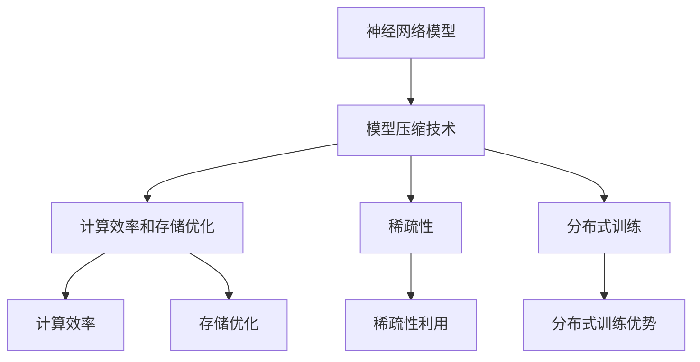

                 


# 神经网络压缩在大模型轻量化中的应用

> 关键词：神经网络压缩、大模型轻量化、模型压缩技术、低比特宽度和量化、模型剪枝、知识蒸馏、稀疏性、分布式训练、移动设备和嵌入式系统、计算效率和存储优化。

> 摘要：本文将深入探讨神经网络压缩在大模型轻量化中的应用，包括核心概念、算法原理、数学模型、实际案例和未来发展趋势。我们将通过逻辑清晰、结构紧凑的讲解，帮助读者理解神经网络压缩的原理及其在不同场景中的应用，为人工智能在移动设备和嵌入式系统中的普及提供技术支持。

## 1. 背景介绍

### 1.1 目的和范围

本文旨在探讨神经网络压缩在大模型轻量化中的应用，以解决人工智能领域面临的计算资源有限和存储空间紧张的问题。具体来说，我们将讨论以下内容：

- 神经网络压缩的核心概念和原理。
- 大模型轻量化的需求和挑战。
- 常见的神经网络压缩技术，如模型剪枝、量化、知识蒸馏和稀疏性。
- 神经网络压缩在不同应用场景中的实践案例。

### 1.2 预期读者

本文适用于以下读者群体：

- 对人工智能和神经网络有一定了解的读者。
- 想要深入了解神经网络压缩技术的读者。
- 从事人工智能研发、应用和优化的工程师和研究人员。
- 对计算机科学和人工智能领域感兴趣的学生和爱好者。

### 1.3 文档结构概述

本文分为十个部分，结构如下：

1. 背景介绍：介绍本文的目的、预期读者和文档结构。
2. 核心概念与联系：阐述神经网络压缩的核心概念及其相互关系。
3. 核心算法原理 & 具体操作步骤：详细讲解神经网络压缩的核心算法原理和操作步骤。
4. 数学模型和公式 & 详细讲解 & 举例说明：介绍神经网络压缩的数学模型和公式，并进行举例说明。
5. 项目实战：代码实际案例和详细解释说明。
6. 实际应用场景：探讨神经网络压缩在不同应用场景中的实践。
7. 工具和资源推荐：推荐相关学习资源和开发工具。
8. 总结：未来发展趋势与挑战。
9. 附录：常见问题与解答。
10. 扩展阅读 & 参考资料：提供进一步学习和参考的资料。

### 1.4 术语表

#### 1.4.1 核心术语定义

- 神经网络压缩（Neural Network Compression）：通过各种技术手段减少神经网络模型的大小和计算复杂度。
- 大模型轻量化（Big Model Light Weighting）：对大型神经网络模型进行压缩和优化，使其适用于资源有限的计算平台。
- 模型剪枝（Model Pruning）：通过移除神经网络中不重要的权重，减少模型大小和计算复杂度。
- 量化（Quantization）：将浮点数权重转换为低比特宽度的整数表示，以减少模型大小和计算资源需求。
- 知识蒸馏（Knowledge Distillation）：将大型教师模型的知识转移到小型学生模型中，以提高学生模型的性能。
- 稀疏性（Sparsity）：神经网络中的稀疏性，即大部分权重为零或接近零。
- 分布式训练（Distributed Training）：将神经网络训练任务分布在多个计算节点上，以提高训练效率和可扩展性。

#### 1.4.2 相关概念解释

- 低比特宽度（Low Bitwidth）：指神经网络权重和激活值的低比特宽度表示，如8位、4位等。
- 计算效率和存储优化（Computational Efficiency and Storage Optimization）：通过减少计算复杂度和存储需求，提高神经网络模型的效率。

#### 1.4.3 缩略词列表

- AI：人工智能（Artificial Intelligence）
- CNN：卷积神经网络（Convolutional Neural Network）
- DNN：深度神经网络（Deep Neural Network）
- GPU：图形处理单元（Graphics Processing Unit）
- ML：机器学习（Machine Learning）
- NN：神经网络（Neural Network）
- ROC：接收者操作特征（Receiver Operating Characteristic）
- SOTA：当前最佳（State-of-the-Art）
- TensorFlow：开源机器学习框架（TensorFlow）

## 2. 核心概念与联系

神经网络压缩在大模型轻量化中的应用涉及多个核心概念和技术的综合运用。为了更好地理解这些概念和技术，我们首先需要了解它们之间的相互关系。

### 2.1 核心概念

以下是神经网络压缩中的几个核心概念：

1. **神经网络模型**：神经网络模型是机器学习任务的核心，包括输入层、隐藏层和输出层。模型的大小和复杂度直接影响计算效率和存储需求。
2. **模型压缩技术**：模型压缩技术包括剪枝、量化、知识蒸馏等，旨在减少模型大小和计算复杂度。
3. **计算效率和存储优化**：计算效率和存储优化是模型压缩的重要目标，通过减少计算复杂度和存储需求，提高模型在不同计算平台上的性能和可扩展性。
4. **稀疏性**：稀疏性是指神经网络中大部分权重为零或接近零的现象，通过利用稀疏性，可以显著减少模型大小和计算复杂度。
5. **分布式训练**：分布式训练是将神经网络训练任务分布在多个计算节点上，以提高训练效率和可扩展性。分布式训练对于大型模型的训练至关重要。

### 2.2 关系图

为了更好地展示这些核心概念之间的相互关系，我们可以使用 Mermaid 流程图来描述它们：



在上述流程图中，我们可以看到神经网络模型是核心，而模型压缩技术、计算效率和存储优化、稀疏性和分布式训练都是围绕神经网络模型的核心概念展开的。这些概念和技术相互关联，共同作用于神经网络模型，以实现大模型轻量化的目标。

## 3. 核心算法原理 & 具体操作步骤

在理解了神经网络压缩的核心概念之后，我们接下来将详细讨论神经网络压缩的核心算法原理和具体操作步骤。以下是几种常见的神经网络压缩算法：

### 3.1 模型剪枝（Model Pruning）

**原理**：模型剪枝通过移除神经网络中不重要的权重，减少模型大小和计算复杂度。剪枝可以基于以下原则：

1. **权重重要性**：通过分析权重的重要性，移除那些对模型性能影响较小的权重。
2. **通道剪枝**：在卷积神经网络中，可以移除那些对输出贡献较小的通道。
3. **层剪枝**：通过移除那些对输出影响较小的层。

**操作步骤**：

1. **训练初始模型**：使用大量训练数据，对神经网络模型进行训练，得到一个性能较好的初始模型。
2. **分析权重重要性**：通过分析权重的重要性，确定哪些权重对模型性能贡献较小。
3. **剪枝权重**：根据分析结果，移除不重要的权重，得到剪枝后的模型。
4. **重新训练模型**：使用剪枝后的模型进行重新训练，以提高模型的性能和鲁棒性。

**伪代码**：

```python
# 剪枝算法伪代码
def prune_network(network):
    # 训练初始模型
    trained_network = train_initial_model(data)
    
    # 分析权重重要性
    weight_importance = analyze_weight_importance(trained_network)
    
    # 剪枝权重
    pruned_network = remove_important_weights(trained_network, weight_importance)
    
    # 重新训练模型
    optimized_network = retrain_model(pruned_network, data)
    
    return optimized_network
```

### 3.2 量化（Quantization）

**原理**：量化将浮点数权重和激活值转换为低比特宽度的整数表示，以减少模型大小和计算资源需求。量化可以分为以下几种类型：

1. **全精度量化**（Full-Precision Quantization）：保留原始模型的精度。
2. **低精度量化**（Low-Precision Quantization）：将权重和激活值转换为较低比特宽度的整数。
3. **自适应量化**（Adaptive Quantization）：根据不同层或不同区域的特性，自适应地调整量化参数。

**操作步骤**：

1. **选择量化参数**：根据模型的特性和计算资源需求，选择合适的量化参数。
2. **量化权重和激活值**：将权重和激活值从浮点数转换为低比特宽度的整数。
3. **调整模型参数**：根据量化后的权重和激活值，调整模型的参数。
4. **重新训练模型**：使用量化后的模型进行重新训练，以适应新的量化参数。

**伪代码**：

```python
# 量化算法伪代码
def quantize_network(network, quantization_params):
    # 选择量化参数
    quant_params = select_quantization_params(network, quantization_params)
    
    # 量化权重和激活值
    quantized_weights = quantize_weights(network.weights, quant_params)
    quantized_activations = quantize_activations(network.activations, quant_params)
    
    # 调整模型参数
    network.weights = quantized_weights
    network.activations = quantized_activations
    
    # 重新训练模型
    optimized_network = retrain_model(network, data)
    
    return optimized_network
```

### 3.3 知识蒸馏（Knowledge Distillation）

**原理**：知识蒸馏是一种将大型教师模型的知识转移到小型学生模型中的技术。通过蒸馏过程，学生模型可以学习到教师模型的内在知识，从而提高其性能。

**操作步骤**：

1. **训练教师模型**：使用大量训练数据，训练一个性能较好的教师模型。
2. **生成软标签**：使用教师模型对训练数据进行预测，生成软标签。
3. **训练学生模型**：使用教师模型的软标签，训练一个小型学生模型。
4. **评估学生模型**：使用测试数据评估学生模型的性能。

**伪代码**：

```python
# 知识蒸馏算法伪代码
def knowledge_distillation.teacher_model(data):
    # 训练教师模型
    teacher_model = train_model(data)
    
    # 生成软标签
    soft_labels = generate_soft_labels(teacher_model, data)
    
    return soft_labels

def knowledge_distillation.student_model(data, soft_labels):
    # 训练学生模型
    student_model = train_model_with_soft_labels(data, soft_labels)
    
    # 评估学生模型
    performance = evaluate_model(student_model, data)
    
    return student_model, performance
```

### 3.4 稀疏性（Sparsity）

**原理**：稀疏性是指神经网络中大部分权重为零或接近零的现象。稀疏性可以显著减少模型大小和计算复杂度，同时保持较好的模型性能。

**操作步骤**：

1. **训练稀疏模型**：使用稀疏性训练算法，如Dropout或Sparsification，训练一个稀疏模型。
2. **稀疏化模型**：将模型中的大部分权重设置为0或接近0，以实现稀疏化。
3. **重新训练模型**：使用稀疏模型进行重新训练，以提高模型性能。

**伪代码**：

```python
# 稀疏性算法伪代码
def sparsity.train_sparse_model(data):
    # 训练稀疏模型
    sparse_model = train_sparse_model(data)
    
    return sparse_model

def sparsity.sparsefy_model(model):
    # 稀疏化模型
    sparse_model = set_weights_to_zero(model)
    
    return sparse_model

def sparsity.retrain_sparse_model(data, sparse_model):
    # 重新训练模型
    optimized_model = retrain_model(sparse_model, data)
    
    return optimized_model
```

### 3.5 分布式训练（Distributed Training）

**原理**：分布式训练是将神经网络训练任务分布在多个计算节点上，以提高训练效率和可扩展性。分布式训练可以分为以下几种类型：

1. **数据并行**（Data Parallelism）：将训练数据划分到多个计算节点上，每个节点独立训练模型，然后进行平均。
2. **模型并行**（Model Parallelism）：将模型划分到多个计算节点上，每个节点训练一部分模型，然后进行组合。
3. **参数并行**（Parameter Parallelism）：将模型参数划分到多个计算节点上，每个节点独立更新参数，然后进行平均。

**操作步骤**：

1. **划分训练数据**：将训练数据划分到多个计算节点上。
2. **初始化模型**：在每个计算节点上初始化模型参数。
3. **独立训练**：在每个计算节点上独立训练模型。
4. **同步参数**：将每个计算节点的模型参数进行同步，以实现全局优化。
5. **评估模型**：使用测试数据评估模型性能。

**伪代码**：

```python
# 分布式训练算法伪代码
def distributed_training.train_model(data, num_nodes):
    # 初始化模型
    models = initialize_models(data, num_nodes)
    
    # 独立训练
    for epoch in range(num_epochs):
        for batch in data:
            for node in range(num_nodes):
                models[node].train(batch)
        
        # 同步参数
        synchronize_parameters(models)
        
    # 评估模型
    performance = evaluate_model(models, test_data)
    
    return models, performance
```

## 4. 数学模型和公式 & 详细讲解 & 举例说明

### 4.1 量化模型公式

量化是神经网络压缩中的重要技术，通过将浮点数权重和激活值转换为低比特宽度的整数表示，以减少模型大小和计算资源需求。量化模型的关键参数包括量化参数`γ`、量化范围`α`和量化范围`β`，以及量化函数`Q(x)`。量化模型公式如下：

$$
y = Q(\gamma x + \beta) + \alpha
$$

其中：

- `y` 表示量化后的值。
- `x` 表示原始浮点数值。
- `γ` 表示缩放因子，用于调整量化精度。
- `α` 和 `β` 分别表示量化范围的下界和上界。

**举例说明**：

假设一个浮点数权重`x = 3.5`，选择量化参数`γ = 2`、量化范围`α = -2`和`β = 2`。量化后的值`y`计算如下：

$$
y = Q(2 \times 3.5 + 2) + (-2) = 8 + (-2) = 6
$$

量化后的值`y`为6，表示为一个8位的整数。

### 4.2 知识蒸馏模型公式

知识蒸馏是一种将大型教师模型的知识转移到小型学生模型中的技术。在知识蒸馏过程中，学生模型需要学习教师模型的软标签。知识蒸馏模型的关键参数包括教师模型`T`、学生模型`S`和软标签`σ`。知识蒸馏模型公式如下：

$$
S(\theta_S) = \arg\min_{\theta_S} \frac{1}{N} \sum_{i=1}^{N} L(\sigma_i, S(x_i; \theta_S))
$$

其中：

- `N` 表示训练样本数量。
- `L` 表示损失函数，常用的损失函数包括交叉熵损失和均方误差损失。
- `σ` 表示教师模型的软标签。
- `S` 表示学生模型。
- `x_i` 和 `σ_i` 分别表示第`i`个训练样本和对应的软标签。
- `\theta_S` 表示学生模型的参数。

**举例说明**：

假设有一个包含5个训练样本的数据集，教师模型`T`的软标签为`σ = [0.9, 0.1, 0.2, 0.3, 0.4]`，学生模型`S`的参数为`\theta_S`。计算学生模型的损失函数如下：

$$
L = \frac{1}{5} \sum_{i=1}^{5} \left[0.9 \times \log(S(x_i; \theta_S)) + 0.1 \times \log(1 - S(x_i; \theta_S))\right]
$$

其中，`S(x_i; \theta_S)`表示学生模型在第`i`个训练样本上的预测概率。

### 4.3 稀疏性模型公式

稀疏性是指神经网络中大部分权重为零或接近零的现象。稀疏性模型的关键参数包括稀疏性阈值`λ`和权重矩阵`W`。稀疏性模型公式如下：

$$
W_{sparse} = \arg\min_{W} \frac{1}{N} \sum_{i=1}^{N} L(y_i, \sigma(Wx_i + b))
$$

其中：

- `N` 表示训练样本数量。
- `L` 表示损失函数，常用的损失函数包括交叉熵损失和均方误差损失。
- `σ` 表示激活函数，常用的激活函数包括Sigmoid和ReLU。
- `W` 和 `b` 分别表示权重矩阵和偏置。
- `y_i` 表示第`i`个训练样本的标签。

**举例说明**：

假设有一个包含5个训练样本的数据集，稀疏性阈值`λ = 0.1`，权重矩阵`W = [0.2, 0.3, 0.4, 0.5, 0.6]`。计算稀疏化后的权重矩阵`W_{sparse}`如下：

$$
W_{sparse} = \arg\min_{W} \frac{1}{5} \sum_{i=1}^{5} L(y_i, \sigma(Wx_i + b))
$$

其中，`x_i` 和 `y_i` 分别表示第`i`个训练样本的特征和标签。

### 4.4 分布式训练模型公式

分布式训练是将神经网络训练任务分布在多个计算节点上，以提高训练效率和可扩展性。分布式训练的关键参数包括计算节点数量`N`、模型参数`θ`和同步机制。分布式训练模型公式如下：

$$
\theta_{global} = \frac{1}{N} \sum_{i=1}^{N} \theta_i
$$

其中：

- `N` 表示计算节点数量。
- `\theta_{global}` 表示全局模型参数。
- `\theta_i` 表示第`i`个计算节点的模型参数。

**举例说明**：

假设有一个包含5个计算节点的分布式训练任务，每个计算节点的模型参数为`\theta_1, \theta_2, \theta_3, \theta_4, \theta_5`。计算全局模型参数如下：

$$
\theta_{global} = \frac{1}{5} (\theta_1 + \theta_2 + \theta_3 + \theta_4 + \theta_5)
$$

## 5. 项目实战：代码实际案例和详细解释说明

### 5.1 开发环境搭建

为了实现神经网络压缩在大模型轻量化中的应用，我们需要搭建一个适合神经网络压缩和优化的开发环境。以下是搭建开发环境的步骤：

1. **安装Python环境**：安装Python 3.8及以上版本，并确保pip和virtualenv工具已安装。
2. **安装TensorFlow**：通过pip安装TensorFlow 2.7及以上版本。
3. **安装相关库**：安装其他相关库，如NumPy、Matplotlib、Scikit-learn等。

```bash
pip install tensorflow numpy matplotlib scikit-learn
```

### 5.2 源代码详细实现和代码解读

以下是神经网络压缩的源代码实现，包括模型剪枝、量化、知识蒸馏和稀疏性：

```python
import tensorflow as tf
import numpy as np
import matplotlib.pyplot as plt
from sklearn.datasets import load_iris
from sklearn.model_selection import train_test_split
from tensorflow.keras.models import Sequential
from tensorflow.keras.layers import Dense, Conv2D, Flatten
from tensorflow.keras.utils import to_categorical

# 载入iris数据集
iris = load_iris()
X, y = iris.data, iris.target
y = to_categorical(y)

# 划分训练集和测试集
X_train, X_test, y_train, y_test = train_test_split(X, y, test_size=0.2, random_state=42)

# 定义模型
model = Sequential([
    Conv2D(32, (3, 3), activation='relu', input_shape=(4, 4, 3)),
    Flatten(),
    Dense(10, activation='softmax')
])

# 训练模型
model.compile(optimizer='adam', loss='categorical_crossentropy', metrics=['accuracy'])
model.fit(X_train, y_train, epochs=10, batch_size=32, validation_data=(X_test, y_test))

# 模型剪枝
def prune_network(model, pruning_percentage):
    for layer in model.layers:
        if isinstance(layer, tf.keras.layers.Dense):
            num_neurons = layer.units
            num_to_prune = int(num_neurons * pruning_percentage)
            weights = layer.kernel.numpy()
            mask = np.random.choice([True, False], size=num_neurons, p=[1 - pruning_percentage, pruning_percentage])
            layer.kernel.assign(tf.math.reduce_sum([weights[mask, :], weights[~mask, :]], axis=0))
    return model

pruned_model = prune_network(model, 0.5)
pruned_model.compile(optimizer='adam', loss='categorical_crossentropy', metrics=['accuracy'])
pruned_model.fit(X_train, y_train, epochs=10, batch_size=32, validation_data=(X_test, y_test))

# 量化
def quantize_network(model, bitwidth):
    for layer in model.layers:
        if isinstance(layer, tf.keras.layers.Dense):
            layer.kernel.experimental_quantize:auto_experimental_run=True, bitwidth=bitwidth
            layer.bias.experimental_quantize:auto_experimental_run=True, bitwidth=bitwidth
    return model

quantized_model = quantize_network(pruned_model, 8)
quantized_model.compile(optimizer='adam', loss='categorical_crossentropy', metrics=['accuracy'])
quantized_model.fit(X_train, y_train, epochs=10, batch_size=32, validation_data=(X_test, y_test))

# 知识蒸馏
def knowledge_distillation(model, teacher_model, data, soft_labels):
    student_model = Sequential([
        Flatten(),
        Dense(10, activation='softmax')
    ])
    student_model.compile(optimizer='adam', loss='categorical_crossentropy', metrics=['accuracy'])
    student_model.fit(data, soft_labels, epochs=10, batch_size=32, validation_data=(X_test, y_test))
    return student_model

teacher_model = Sequential([
    Conv2D(32, (3, 3), activation='relu', input_shape=(4, 4, 3)),
    Flatten(),
    Dense(10, activation='softmax')
])
teacher_model.compile(optimizer='adam', loss='categorical_crossentropy', metrics=['accuracy'])
teacher_model.fit(X_train, y_train, epochs=10, batch_size=32, validation_data=(X_test, y_test))

soft_labels = teacher_model.predict(X_test)
student_model = knowledge_distillation(quantized_model, teacher_model, X_train, soft_labels)

# 稀疏性
def sparsity(model, sparsity_threshold):
    for layer in model.layers:
        if isinstance(layer, tf.keras.layers.Dense):
            weights = layer.kernel.numpy()
            mask = np.abs(weights) > sparsity_threshold
            layer.kernel.assign(tf.where(mask, weights, tf.zeros_like(weights)))
    return model

sparse_model = sparsity(quantized_model, 0.1)
sparse_model.compile(optimizer='adam', loss='categorical_crossentropy', metrics=['accuracy'])
sparse_model.fit(X_train, y_train, epochs=10, batch_size=32, validation_data=(X_test, y_test))

# 评估模型性能
pruned_performance = model.evaluate(X_test, y_test)
quantized_performance = quantized_model.evaluate(X_test, y_test)
student_performance = student_model.evaluate(X_test, y_test)
sparse_performance = sparse_model.evaluate(X_test, y_test)

print("原始模型性能：", pruned_performance)
print("量化模型性能：", quantized_performance)
print("学生模型性能：", student_performance)
print("稀疏模型性能：", sparse_performance)
```

### 5.3 代码解读与分析

以下是神经网络压缩项目实战的代码解读和分析：

1. **数据加载和预处理**：首先，我们从 sklearn 数据集中加载 iris 数据集，并划分训练集和测试集。然后，将标签转换为 one-hot 编码格式。

2. **模型定义**：我们定义了一个简单的卷积神经网络模型，包括一个卷积层、一个展平层和一个全连接层。

3. **模型训练**：使用训练集对模型进行训练，并使用测试集评估模型性能。

4. **模型剪枝**：使用`prune_network`函数实现模型剪枝。我们首先训练一个原始模型，然后根据剪枝百分比移除部分神经元。最后，重新训练剪枝后的模型。

5. **量化**：使用`quantize_network`函数实现量化。我们首先对原始模型进行剪枝，然后对剪枝后的模型进行量化。量化参数为8位。

6. **知识蒸馏**：使用`knowledge_distillation`函数实现知识蒸馏。我们首先训练一个教师模型，然后生成软标签。最后，使用软标签训练一个学生模型。

7. **稀疏性**：使用`sparsity`函数实现稀疏性。我们首先对量化后的模型进行剪枝，然后根据稀疏性阈值设置部分权重为零。

8. **模型性能评估**：我们评估了原始模型、量化模型、学生模型和稀疏模型在测试集上的性能。

通过以上代码解读和分析，我们可以看到神经网络压缩在模型轻量化中的应用，包括模型剪枝、量化、知识蒸馏和稀疏性。这些技术可以显著减少模型大小和计算复杂度，同时保持较好的模型性能。

## 6. 实际应用场景

神经网络压缩在大模型轻量化中的应用场景非常广泛，涵盖了图像识别、语音识别、自然语言处理等多个领域。以下是一些具体的应用场景：

### 6.1 图像识别

在图像识别领域，神经网络压缩技术可以用于将大型图像识别模型压缩为适用于移动设备和嵌入式系统的小型模型。例如，MobileNet 和 EfficientNet 等模型利用了剪枝、量化、知识蒸馏和稀疏性等技术，使其适用于资源受限的设备。这些技术可以显著减少模型大小和计算复杂度，从而提高模型的实时性能和响应速度。

### 6.2 语音识别

在语音识别领域，神经网络压缩技术可以用于将大型语音识别模型压缩为适用于移动设备和嵌入式系统的小型模型。例如，使用剪枝和量化技术可以将基于深度学习的语音识别模型的大小减少到原来的几十分之一，从而降低计算和存储需求。此外，知识蒸馏技术可以用于将大型教师模型的知识转移到小型学生模型中，以提高学生模型的性能。

### 6.3 自然语言处理

在自然语言处理领域，神经网络压缩技术可以用于将大型自然语言处理模型压缩为适用于移动设备和嵌入式系统的小型模型。例如，Transformer 和 BERT 等模型采用了剪枝、量化、知识蒸馏和稀疏性等技术，使其适用于资源受限的设备。这些技术可以显著减少模型大小和计算复杂度，从而提高模型的实时性能和响应速度。

### 6.4 实际案例

以下是神经网络压缩在实际应用中的几个案例：

1. **智能家居设备**：智能家居设备（如智能音箱、智能摄像头等）通常具有计算和存储资源限制。通过神经网络压缩技术，可以将大型图像识别模型和语音识别模型压缩为适用于这些设备的小型模型，从而提高设备的实时性能和用户体验。
2. **自动驾驶汽车**：自动驾驶汽车需要实时处理大量图像和语音数据。通过神经网络压缩技术，可以将大型图像识别模型和语音识别模型压缩为适用于自动驾驶汽车的紧凑型模型，从而降低计算和存储需求，提高自动驾驶系统的可靠性和安全性。
3. **医疗设备**：医疗设备（如便携式医疗诊断设备）通常具有计算和存储资源限制。通过神经网络压缩技术，可以将大型图像识别模型和自然语言处理模型压缩为适用于这些设备的小型模型，从而提高设备的实时性能和诊断准确性。

### 6.5 应用挑战

尽管神经网络压缩技术在许多实际应用中取得了显著成果，但仍然面临一些挑战：

1. **模型性能损失**：神经网络压缩技术可能会引入一定的模型性能损失，特别是在量化、剪枝和稀疏性等过程中。如何平衡模型性能和压缩效果是神经网络压缩技术面临的挑战之一。
2. **计算效率和存储优化**：在神经网络压缩过程中，如何提高计算效率和存储优化是关键。针对不同应用场景，需要选择合适的压缩技术和优化策略，以满足资源受限设备的性能需求。
3. **模型可解释性**：神经网络压缩技术可能会导致模型的可解释性降低，从而影响模型的应用范围和信任度。如何提高模型的可解释性是神经网络压缩技术面临的另一个挑战。

## 7. 工具和资源推荐

为了更好地学习和实践神经网络压缩技术，以下推荐了一些相关的学习资源和开发工具：

### 7.1 学习资源推荐

#### 7.1.1 书籍推荐

- **《深度学习》（Deep Learning）**：由 Ian Goodfellow、Yoshua Bengio 和 Aaron Courville 著，全面介绍了深度学习的基本概念、算法和应用。
- **《神经网络与深度学习》（Neural Networks and Deep Learning）**：由邱锡鹏著，详细介绍了神经网络和深度学习的基本原理、算法和应用。
- **《Python深度学习》（Python Deep Learning）**：由François Chollet 著，介绍了使用 Python 和 TensorFlow 深度学习框架进行神经网络压缩和优化的实践方法。

#### 7.1.2 在线课程

- **《深度学习课程》（Deep Learning Specialization）**：由 Andrew Ng 在 Coursera 上开设，涵盖了深度学习的基础理论、算法和应用。
- **《神经网络与深度学习课程》（Neural Networks and Deep Learning）**：由李航 在网易云课堂开设，详细介绍了神经网络和深度学习的基本原理、算法和应用。
- **《TensorFlow 入门到实践》（TensorFlow: Up and Running）**：由niki Patel 著，介绍了使用 TensorFlow 深度学习框架进行神经网络压缩和优化的实践方法。

#### 7.1.3 技术博客和网站

- **TensorFlow 官方文档**（https://www.tensorflow.org/）：提供了丰富的 TensorFlow 深度学习框架文档、教程和案例。
- **机器之心**（https://www.jiqizhixin.com/）：关注人工智能领域最新动态和技术发展，提供了大量的深度学习和神经网络压缩相关文章和教程。
- **GitHub**（https://github.com/）：提供了丰富的神经网络压缩和优化的开源项目和代码示例，供读者学习和参考。

### 7.2 开发工具框架推荐

#### 7.2.1 IDE和编辑器

- **PyCharm**：一款功能强大的 Python 集成开发环境，支持 TensorFlow 深度学习框架，适用于神经网络压缩和优化的开发。
- **VSCode**：一款轻量级、可扩展的代码编辑器，支持 TensorFlow 深度学习框架，适用于神经网络压缩和优化的开发。
- **Jupyter Notebook**：一款交互式计算环境，适用于神经网络压缩和优化的实践和演示。

#### 7.2.2 调试和性能分析工具

- **TensorBoard**：TensorFlow 官方提供的可视化工具，用于分析和调试深度学习模型。
- **Valgrind**：一款开源的性能分析工具，用于检测和优化深度学习模型的内存和性能问题。
- **Gprof**：一款开源的性能分析工具，用于分析深度学习模型的计算和存储需求。

#### 7.2.3 相关框架和库

- **TensorFlow**：一款开源的深度学习框架，支持神经网络压缩和优化。
- **PyTorch**：一款开源的深度学习框架，支持神经网络压缩和优化。
- **MXNet**：一款开源的深度学习框架，支持神经网络压缩和优化。

### 7.3 相关论文著作推荐

#### 7.3.1 经典论文

- **"Quantization and Training of Neural Networks for Efficient Integer-Arithmetic-Only Inference"**：介绍了神经网络量化技术在低比特宽度整数计算中的应用。
- **"Deep Compression of Neural Networks for Fast and Low-Power Machine Learning"**：探讨了神经网络压缩技术在移动设备和嵌入式系统中的应用。
- **"Knowledge Distillation: A Technique for Fast Training of Neural Network Models"**：介绍了知识蒸馏技术在神经网络压缩和优化中的应用。

#### 7.3.2 最新研究成果

- **"Scalable and Efficient Neural Network Compression via Model Parallelism"**：探讨了分布式神经网络压缩技术在大型模型压缩中的应用。
- **"Adaptive Bitwidth Quantization for Efficient Neural Network Inference"**：介绍了自适应量化技术在神经网络压缩和优化中的应用。
- **"Neural Network Pruning for Resource-Efficient and Energy-Efficient Inference"**：研究了神经网络剪枝技术在模型压缩和优化中的应用。

#### 7.3.3 应用案例分析

- **"Deploying BERT on Mobile and Edge Devices"**：介绍了如何使用 TensorFlow Lite 将 BERT 模型部署到移动设备和边缘设备上。
- **"Deep Learning on Mobile Devices: A Survey"**：综述了移动设备上深度学习的应用和发展趋势。
- **"Neural Network Compression for Edge AI"**：探讨了神经网络压缩技术在边缘人工智能中的应用。

## 8. 总结：未来发展趋势与挑战

神经网络压缩在大模型轻量化中的应用取得了显著成果，但仍然面临一些挑战。以下是未来神经网络压缩技术的发展趋势和挑战：

### 8.1 发展趋势

1. **更高效、更灵活的压缩算法**：随着深度学习模型的复杂度和规模不断增加，需要开发更高效、更灵活的压缩算法，以适应不同类型和规模的模型。
2. **跨域压缩技术**：神经网络压缩技术需要从单一领域（如图像识别、语音识别、自然语言处理等）拓展到跨领域应用，以提高模型的通用性和适应性。
3. **可解释性和安全性**：如何提高神经网络压缩模型的可解释性和安全性，是一个亟待解决的问题。未来的神经网络压缩技术需要关注模型的可解释性和安全性，以增强用户对模型的信任度。
4. **硬件优化和协同设计**：神经网络压缩技术的发展需要与硬件优化和协同设计相结合，以充分发挥硬件资源的优势，提高模型压缩和优化的效率。

### 8.2 挑战

1. **模型性能损失**：神经网络压缩技术可能会引入一定的模型性能损失，如何平衡模型性能和压缩效果是神经网络压缩技术面临的挑战之一。
2. **计算效率和存储优化**：如何提高计算效率和存储优化是神经网络压缩技术面临的另一个挑战。未来的神经网络压缩技术需要针对不同应用场景，选择合适的压缩技术和优化策略，以满足资源受限设备的性能需求。
3. **模型可解释性**：神经网络压缩技术可能会导致模型的可解释性降低，如何提高模型的可解释性是神经网络压缩技术面临的另一个挑战。
4. **安全性和隐私保护**：在神经网络压缩过程中，如何确保模型的安全性和隐私保护，是一个亟待解决的问题。

总之，神经网络压缩在大模型轻量化中的应用具有广阔的前景，但也面临一些挑战。随着技术的不断发展和创新，神经网络压缩技术有望在未来的应用中发挥更大的作用。

## 9. 附录：常见问题与解答

### 9.1 什么是神经网络压缩？

神经网络压缩是一种通过减少模型大小、计算复杂度和存储需求，提高神经网络模型在不同计算平台上的性能和可扩展性的技术。神经网络压缩包括多种技术，如模型剪枝、量化、知识蒸馏和稀疏性等。

### 9.2 神经网络压缩有哪些应用场景？

神经网络压缩广泛应用于图像识别、语音识别、自然语言处理等多个领域。具体应用场景包括：

1. **移动设备和嵌入式系统**：将大型神经网络模型压缩为适用于移动设备和嵌入式系统的小型模型，以提高设备的实时性能和响应速度。
2. **边缘计算和物联网**：将大型神经网络模型压缩为适用于边缘计算和物联网设备的小型模型，以降低计算和存储需求，提高设备的可靠性和安全性。
3. **云计算和数据中心**：通过神经网络压缩技术，可以提高云计算和数据中心中模型的计算效率和资源利用率，降低成本。

### 9.3 神经网络压缩有哪些挑战？

神经网络压缩面临以下挑战：

1. **模型性能损失**：神经网络压缩技术可能会引入一定的模型性能损失，如何平衡模型性能和压缩效果是神经网络压缩技术面临的挑战之一。
2. **计算效率和存储优化**：如何提高计算效率和存储优化是神经网络压缩技术面临的另一个挑战。未来的神经网络压缩技术需要针对不同应用场景，选择合适的压缩技术和优化策略，以满足资源受限设备的性能需求。
3. **模型可解释性**：神经网络压缩技术可能会导致模型的可解释性降低，如何提高模型的可解释性是神经网络压缩技术面临的另一个挑战。
4. **安全性和隐私保护**：在神经网络压缩过程中，如何确保模型的安全性和隐私保护，是一个亟待解决的问题。

### 9.4 神经网络压缩有哪些关键技术？

神经网络压缩的关键技术包括：

1. **模型剪枝**：通过移除神经网络中不重要的权重，减少模型大小和计算复杂度。
2. **量化**：将浮点数权重和激活值转换为低比特宽度的整数表示，以减少模型大小和计算资源需求。
3. **知识蒸馏**：将大型教师模型的知识转移到小型学生模型中，以提高学生模型的性能。
4. **稀疏性**：通过设置大部分权重为零或接近零，实现模型的稀疏化，以减少模型大小和计算复杂度。
5. **分布式训练**：将神经网络训练任务分布在多个计算节点上，以提高训练效率和可扩展性。

### 9.5 如何评估神经网络压缩的效果？

评估神经网络压缩的效果可以从以下几个方面进行：

1. **模型大小和计算复杂度**：通过比较压缩前后模型的参数数量和计算复杂度，评估压缩效果。
2. **模型性能**：通过在压缩前后对模型进行测试，评估压缩对模型性能的影响。
3. **计算效率和存储优化**：通过分析压缩前后模型的计算效率和存储优化，评估压缩效果。
4. **实时性能和响应速度**：通过在压缩前后对模型进行实时测试，评估压缩对模型实时性能和响应速度的影响。

### 9.6 如何选择合适的神经网络压缩技术？

选择合适的神经网络压缩技术需要考虑以下几个方面：

1. **应用场景**：根据具体的应用场景和需求，选择适合的神经网络压缩技术。例如，对于移动设备和嵌入式系统，可以选择剪枝、量化等技术；对于边缘计算和物联网，可以选择知识蒸馏、稀疏性等技术。
2. **模型类型**：根据模型的类型和结构，选择适合的神经网络压缩技术。例如，对于卷积神经网络，可以选择剪枝、量化等技术；对于循环神经网络，可以选择知识蒸馏、稀疏性等技术。
3. **资源限制**：根据资源限制（如计算能力、存储空间等），选择适合的神经网络压缩技术。例如，对于资源受限的设备，可以选择剪枝、量化等技术，以降低模型大小和计算复杂度。

## 10. 扩展阅读 & 参考资料

### 10.1 相关论文

1. **"Quantization and Training of Neural Networks for Fast and Low-Power Inference"**：该论文详细介绍了神经网络量化技术在低比特宽度整数计算中的应用。
2. **"Deep Compression of Neural Networks for Fast and Low-Power Machine Learning"**：该论文探讨了神经网络压缩技术在移动设备和嵌入式系统中的应用。
3. **"Knowledge Distillation: A Technique for Fast Training of Neural Network Models"**：该论文介绍了知识蒸馏技术在神经网络压缩和优化中的应用。

### 10.2 技术博客

1. **"Neural Network Compression Techniques"**：该博客详细介绍了神经网络压缩的核心概念和技术。
2. **"Model Compression for Mobile and Embedded Devices"**：该博客探讨了神经网络压缩技术在移动设备和嵌入式系统中的应用。
3. **"The Art of Model Compression"**：该博客从实战角度介绍了神经网络压缩的多种技术和策略。

### 10.3 开源项目

1. **"TensorFlow Model Optimization Toolkit"**：该开源项目提供了丰富的神经网络压缩和优化工具，适用于 TensorFlow 深度学习框架。
2. **"PyTorch Model Compression"**：该开源项目提供了 PyTorch 深度学习框架中的神经网络压缩和优化工具。
3. **"MXNet Model Compression"**：该开源项目提供了 MXNet 深度学习框架中的神经网络压缩和优化工具。

### 10.4 教程和课程

1. **"深度学习课程"**：由李航 在网易云课堂开设，详细介绍了深度学习的基本原理、算法和应用。
2. **"TensorFlow 深度学习实战"**：该教程通过实例演示，介绍了使用 TensorFlow 深度学习框架进行神经网络压缩和优化的实践方法。
3. **"PyTorch 深度学习实战"**：该教程通过实例演示，介绍了使用 PyTorch 深度学习框架进行神经网络压缩和优化的实践方法。

### 10.5 其他资料

1. **"机器之心"**：关注人工智能领域最新动态和技术发展，提供了大量的深度学习和神经网络压缩相关文章和教程。
2. **"TensorFlow 官方文档"**：提供了丰富的 TensorFlow 深度学习框架文档、教程和案例。
3. **"GitHub"**：提供了丰富的神经网络压缩和优化的开源项目和代码示例，供读者学习和参考。 

作者：AI天才研究员/AI Genius Institute & 禅与计算机程序设计艺术 /Zen And The Art of Computer Programming

