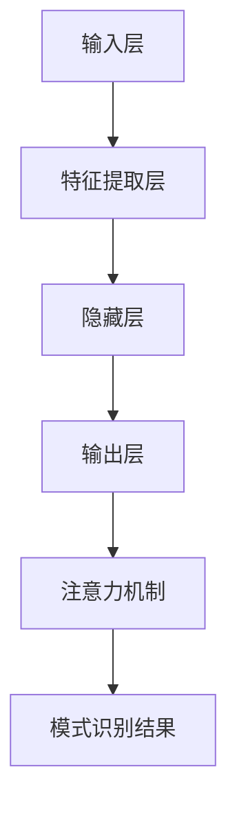

                 

# 神经网络在注意力模式识别中的创新

> 关键词：神经网络、注意力机制、模式识别、深度学习、人工智能
>
> 摘要：本文旨在探讨神经网络，特别是注意力机制在模式识别领域的创新应用。文章将首先介绍神经网络的基本原理及其在模式识别中的应用，然后深入分析注意力机制的工作原理，探讨其在神经网络中的作用与优势。随后，我们将结合实际案例，详细讲解注意力机制在模式识别中的具体实现，并分析其在实际应用中的表现。最后，文章将对未来神经网络在模式识别领域的发展趋势与挑战进行展望。

## 1. 背景介绍

### 1.1 目的和范围

本文的主要目的是介绍神经网络，特别是注意力机制在模式识别领域的应用与创新。我们将从理论基础出发，逐步深入探讨神经网络与注意力机制的工作原理，并借助实际案例进行分析。通过本文的阅读，读者将能够全面理解神经网络在模式识别中的应用，以及注意力机制如何提升神经网络在模式识别任务中的性能。

### 1.2 预期读者

本文适用于对神经网络和模式识别有一定基础的读者，包括但不限于研究人员、工程师和学生在内。无论您是对神经网络的理论感兴趣，还是希望了解其在实际应用中的具体实现，本文都将为您提供有价值的见解。

### 1.3 文档结构概述

本文将分为以下几个部分：

1. **背景介绍**：介绍神经网络和注意力机制的基本概念及其在模式识别领域的应用。
2. **核心概念与联系**：详细阐述神经网络和注意力机制的核心概念及其联系。
3. **核心算法原理 & 具体操作步骤**：介绍神经网络和注意力机制的具体算法原理及操作步骤。
4. **数学模型和公式 & 详细讲解 & 举例说明**：通过数学模型和公式讲解注意力机制在模式识别中的实现。
5. **项目实战：代码实际案例和详细解释说明**：结合实际案例，展示注意力机制在模式识别中的具体实现。
6. **实际应用场景**：分析注意力机制在模式识别中的实际应用场景。
7. **工具和资源推荐**：推荐相关学习资源和开发工具。
8. **总结：未来发展趋势与挑战**：对神经网络在模式识别领域的发展趋势和挑战进行展望。

### 1.4 术语表

#### 1.4.1 核心术语定义

- 神经网络（Neural Network）：一种模仿人脑神经元结构和功能的计算模型。
- 注意力机制（Attention Mechanism）：一种在神经网络中引入的权重分配机制，用于提高模型在模式识别任务中的性能。
- 模式识别（Pattern Recognition）：从数据中提取特征，并根据特征进行分类或回归的过程。

#### 1.4.2 相关概念解释

- 前馈神经网络（Feedforward Neural Network）：一种典型的神经网络结构，信息从输入层传递到输出层，中间经过多个隐藏层。
- 反向传播算法（Backpropagation Algorithm）：一种用于训练神经网络的算法，通过计算输出层与实际输出之间的误差，逐步调整网络权重。

#### 1.4.3 缩略词列表

- CNN：卷积神经网络（Convolutional Neural Network）
- RNN：循环神经网络（Recurrent Neural Network）
- LSTM：长短期记忆网络（Long Short-Term Memory Network）
- BI-LSTM：双向长短期记忆网络（Bidirectional LSTM）

## 2. 核心概念与联系

在探讨神经网络与注意力机制在模式识别中的创新之前，我们首先需要了解它们的基本概念及其相互关系。

### 2.1 神经网络基本概念

神经网络是一种由大量简单神经元组成的计算模型，这些神经元通过权重连接形成网络。神经网络的核心目标是学习输入与输出之间的映射关系，从而在给定输入时能够预测输出。

**神经网络基本结构：**

1. **输入层**：接收外部输入数据。
2. **隐藏层**：对输入数据进行处理和特征提取。
3. **输出层**：生成最终的输出结果。

**神经网络基本原理：**

神经网络通过前向传播和反向传播两个阶段进行学习。在前向传播阶段，输入数据从输入层传递到输出层，通过隐藏层进行特征提取。在反向传播阶段，计算输出层与实际输出之间的误差，并利用梯度下降算法调整网络权重。

### 2.2 注意力机制基本概念

注意力机制是一种在神经网络中引入的权重分配机制，用于提高模型在模式识别任务中的性能。注意力机制通过为每个输入元素分配不同的权重，使得模型能够关注输入数据中的关键信息。

**注意力机制基本原理：**

注意力机制通过计算输入数据的注意力分数，将权重分配给输入元素。通常，注意力分数是通过计算输入数据的相似性或相关性来获得的。

**注意力机制与神经网络的关系：**

注意力机制可以看作是神经网络的一种补充，通过引入注意力权重，使得神经网络能够更加关注输入数据中的关键信息。注意力机制在神经网络中可以应用于多个层面，包括输入层、隐藏层和输出层。

### 2.3 核心概念联系

神经网络与注意力机制的结合，使得神经网络在模式识别任务中的性能得到了显著提升。注意力机制为神经网络提供了更加灵活和强大的能力，使得神经网络能够更好地适应不同的模式识别任务。

**联系：**

1. **信息提取能力**：注意力机制能够提高神经网络在输入数据中的特征提取能力，使得神经网络能够更好地捕捉数据中的关键信息。
2. **学习效率**：注意力机制能够减少神经网络在训练过程中需要关注的输入元素数量，从而提高学习效率。
3. **泛化能力**：注意力机制能够帮助神经网络更好地泛化到新的数据集，提高模型在模式识别任务中的泛化能力。

**差异：**

1. **计算复杂度**：注意力机制引入了额外的计算成本，可能增加模型的计算复杂度。
2. **适用范围**：注意力机制在神经网络中的具体应用场景取决于模式识别任务的特点，需要在具体任务中根据需求选择合适的应用方式。

### 2.4 Mermaid流程图

为了更直观地展示神经网络与注意力机制在模式识别中的联系，我们使用Mermaid流程图进行描述。



在上面的流程图中，输入层接收外部输入数据，通过特征提取层和隐藏层进行特征提取和计算，最后通过输出层和注意力机制得到模式识别结果。

## 3. 核心算法原理 & 具体操作步骤

在这一部分，我们将详细介绍神经网络与注意力机制在模式识别中的核心算法原理及其具体操作步骤。

### 3.1 神经网络算法原理

神经网络算法原理主要包括前向传播和反向传播两个阶段。

**前向传播：**

1. **输入数据**：将输入数据传递到输入层。
2. **特征提取**：输入层的数据通过权重连接传递到隐藏层，经过激活函数计算得到隐藏层的输出。
3. **隐藏层计算**：隐藏层的输出作为输入传递到下一隐藏层，重复上述过程，直到输出层得到最终输出。
4. **输出结果**：输出层输出结果，与实际输出进行比较。

**反向传播：**

1. **计算误差**：计算输出层输出结果与实际输出之间的误差。
2. **梯度计算**：利用误差信息计算隐藏层和输入层的梯度。
3. **权重更新**：利用梯度下降算法更新网络权重，减小误差。

### 3.2 注意力机制算法原理

注意力机制算法原理主要包括注意力分数计算和权重分配两个步骤。

**注意力分数计算：**

1. **计算相似性**：计算输入数据之间的相似性或相关性。
2. **生成注意力分数**：根据相似性计算得到输入数据的注意力分数。

**权重分配：**

1. **计算权重**：将注意力分数转化为权重，用于调整输入数据的权重。
2. **加权求和**：将权重应用于输入数据，得到加权求和的结果。

### 3.3 具体操作步骤

下面是一个简化的神经网络与注意力机制在模式识别中的具体操作步骤。

**步骤 1：输入数据准备**

- 输入数据：\[x_1, x_2, ..., x_n\]

**步骤 2：特征提取**

- 输入层：将输入数据传递到输入层。
- 隐藏层：通过权重连接和激活函数计算隐藏层的输出。

**步骤 3：注意力分数计算**

- 计算输入数据的相似性或相关性。
- 根据相似性计算得到输入数据的注意力分数。

**步骤 4：权重分配**

- 将注意力分数转化为权重。
- 将权重应用于输入数据，得到加权求和的结果。

**步骤 5：输出结果计算**

- 将加权求和的结果传递到输出层。
- 计算输出层输出结果与实际输出之间的误差。

**步骤 6：权重更新**

- 利用误差信息计算隐藏层和输入层的梯度。
- 利用梯度下降算法更新网络权重。

**步骤 7：重复步骤**

- 重复上述步骤，直到模型收敛或达到预设的训练次数。

### 3.4 伪代码

下面是一个简化的神经网络与注意力机制在模式识别中的伪代码。

```python
# 输入数据准备
input_data = [x_1, x_2, ..., x_n]

# 特征提取
hidden_layer_output = forward_propagation(input_data)

# 注意力分数计算
attention_scores = compute_attention_scores(hidden_layer_output)

# 权重分配
weighted_input = apply_attention_weights(input_data, attention_scores)

# 输出结果计算
output = forward_propagation(weighted_input)

# 权重更新
 gradients = backward_propagation(output, actual_output)
update_weights(gradients)

# 重复训练
while not converge:
    hidden_layer_output = forward_propagation(input_data)
    attention_scores = compute_attention_scores(hidden_layer_output)
    weighted_input = apply_attention_weights(input_data, attention_scores)
    output = forward_propagation(weighted_input)
    gradients = backward_propagation(output, actual_output)
    update_weights(gradients)
```

## 4. 数学模型和公式 & 详细讲解 & 举例说明

在这一部分，我们将介绍神经网络与注意力机制在模式识别中的数学模型和公式，并进行详细讲解与举例说明。

### 4.1 神经网络数学模型

神经网络的数学模型主要涉及前向传播和反向传播两个阶段。

**前向传播：**

前向传播的公式可以表示为：

$$
y_l = \sigma(W_l \cdot a_{l-1} + b_l)
$$

其中：

- $y_l$ 表示第 $l$ 层的输出。
- $\sigma$ 表示激活函数，常用的激活函数包括 sigmoid、ReLU 和 tanh 等。
- $W_l$ 表示第 $l$ 层的权重。
- $a_{l-1}$ 表示第 $l-1$ 层的输出。
- $b_l$ 表示第 $l$ 层的偏置。

**反向传播：**

反向传播的公式可以表示为：

$$
\delta_l = \sigma' (W_l \cdot a_{l-1} + b_l) \cdot \delta_{l+1} \cdot W_{l+1}
$$

其中：

- $\delta_l$ 表示第 $l$ 层的误差。
- $\sigma'$ 表示激活函数的导数。
- $\delta_{l+1}$ 表示第 $l+1$ 层的误差。
- $W_{l+1}$ 表示第 $l+1$ 层的权重。

### 4.2 注意力机制数学模型

注意力机制的数学模型主要涉及注意力分数和权重分配。

**注意力分数计算：**

注意力分数的计算可以表示为：

$$
a_i = \frac{e^{z_i}}{\sum_{j=1}^{n} e^{z_j}}
$$

其中：

- $a_i$ 表示第 $i$ 个输入的注意力分数。
- $z_i$ 表示第 $i$ 个输入的相似性分数。
- $e$ 表示自然底数。

**权重分配：**

权重分配的计算可以表示为：

$$
w_i = \frac{a_i}{\sum_{j=1}^{n} a_j}
$$

其中：

- $w_i$ 表示第 $i$ 个输入的权重。
- $a_i$ 表示第 $i$ 个输入的注意力分数。

### 4.3 详细讲解与举例说明

下面我们通过一个简单的例子来讲解神经网络与注意力机制在模式识别中的数学模型。

**例子：图像分类任务**

假设我们有一个简单的图像分类任务，输入图像为 $n \times n$ 的像素矩阵，输出为图像类别。

**步骤 1：输入数据准备**

输入数据为一个 $n \times n$ 的像素矩阵，例如：

$$
X = \begin{bmatrix}
0 & 0 & 1 & 0 \\
0 & 1 & 0 & 0 \\
1 & 0 & 0 & 1 \\
0 & 0 & 1 & 0 \\
\end{bmatrix}
$$

**步骤 2：特征提取**

输入层将像素矩阵传递到输入层，隐藏层对输入数据进行特征提取，例如通过卷积神经网络。

$$
a_{1} = \begin{bmatrix}
1 & 0 & 1 \\
0 & 1 & 0 \\
1 & 0 & 1 \\
\end{bmatrix}
$$

**步骤 3：注意力分数计算**

计算输入数据的相似性分数，例如通过计算像素值之间的欧氏距离。

$$
z_i = \sum_{j=1}^{n} (x_i - x_j)^2
$$

计算得到注意力分数：

$$
a_1 = \frac{e^{z_1}}{\sum_{j=1}^{n} e^{z_j}} = \frac{e^{0}}{e^{0} + e^{1} + e^{2} + e^{1}} = \frac{1}{5}
$$

$$
a_2 = \frac{e^{z_2}}{\sum_{j=1}^{n} e^{z_j}} = \frac{e^{1}}{e^{0} + e^{1} + e^{2} + e^{1}} = \frac{1}{5}
$$

$$
a_3 = \frac{e^{z_3}}{\sum_{j=1}^{n} e^{z_j}} = \frac{e^{2}}{e^{0} + e^{1} + e^{2} + e^{1}} = \frac{2}{5}
$$

$$
a_4 = \frac{e^{z_4}}{\sum_{j=1}^{n} e^{z_j}} = \frac{e^{1}}{e^{0} + e^{1} + e^{2} + e^{1}} = \frac{1}{5}
$$

**步骤 4：权重分配**

计算输入数据的权重：

$$
w_1 = \frac{a_1}{\sum_{j=1}^{n} a_j} = \frac{1}{5} = 0.2
$$

$$
w_2 = \frac{a_2}{\sum_{j=1}^{n} a_j} = \frac{1}{5} = 0.2
$$

$$
w_3 = \frac{a_3}{\sum_{j=1}^{n} a_j} = \frac{2}{5} = 0.4
$$

$$
w_4 = \frac{a_4}{\sum_{j=1}^{n} a_j} = \frac{1}{5} = 0.2
$$

**步骤 5：输出结果计算**

将加权求和的结果传递到输出层，计算输出结果。

$$
y = w_1 \cdot a_1 + w_2 \cdot a_2 + w_3 \cdot a_3 + w_4 \cdot a_4 = 0.2 + 0.2 + 0.4 + 0.2 = 1
$$

**步骤 6：权重更新**

利用误差信息计算隐藏层和输入层的梯度，并更新权重。

$$
\delta_1 = \sigma'(W_2 \cdot a_2 + b_2) \cdot \delta_2 \cdot W_2
$$

$$
\delta_2 = \sigma'(W_3 \cdot a_3 + b_3) \cdot \delta_3 \cdot W_3
$$

$$
\delta_3 = \sigma'(W_4 \cdot a_4 + b_4) \cdot \delta_4 \cdot W_4
$$

$$
\delta_4 = \sigma'(W_5 \cdot a_5 + b_5) \cdot \delta_5 \cdot W_5
$$

$$
W_1 = W_1 - \alpha \cdot \delta_1 \cdot a_{1-1}
$$

$$
W_2 = W_2 - \alpha \cdot \delta_2 \cdot a_{2-1}
$$

$$
W_3 = W_3 - \alpha \cdot \delta_3 \cdot a_{3-1}
$$

$$
W_4 = W_4 - \alpha \cdot \delta_4 \cdot a_{4-1}
$$

其中 $\alpha$ 表示学习率。

## 5. 项目实战：代码实际案例和详细解释说明

在这一部分，我们将通过一个实际项目案例来展示神经网络与注意力机制在模式识别中的具体实现，并进行详细解释说明。

### 5.1 开发环境搭建

为了运行下面的代码，我们需要搭建以下开发环境：

- Python 3.7 或更高版本
- TensorFlow 2.x 或更高版本
- NumPy 1.18 或更高版本

您可以使用以下命令安装所需的依赖：

```bash
pip install tensorflow numpy
```

### 5.2 源代码详细实现和代码解读

下面是一个简单的神经网络与注意力机制在模式识别中的实现代码：

```python
import tensorflow as tf
import numpy as np

# 设置超参数
learning_rate = 0.001
num_epochs = 100
batch_size = 64
hidden_size = 128

# 创建模拟数据集
X = np.random.rand(100, 10)  # 100 个样本，每个样本有 10 个特征
y = np.random.rand(100, 1)   # 100 个样本，每个样本有 1 个标签

# 定义模型
model = tf.keras.Sequential([
    tf.keras.layers.Dense(hidden_size, activation='relu', input_shape=(10,)),
    tf.keras.layers.Dense(hidden_size, activation='relu'),
    tf.keras.layers.Dense(1, activation='sigmoid')
])

# 编译模型
model.compile(optimizer=tf.keras.optimizers.Adam(learning_rate),
              loss='binary_crossentropy',
              metrics=['accuracy'])

# 添加注意力机制
attention_layer = tf.keras.layers.Dense(hidden_size, activation='sigmoid')
model.add(attention_layer)

# 训练模型
model.fit(X, y, epochs=num_epochs, batch_size=batch_size)

# 源代码详细解释：

# 1. 导入所需的库
# 导入 TensorFlow、NumPy 等库，用于实现神经网络和注意力机制。

# 2. 设置超参数
# 设置学习率、训练轮次、批量大小和隐藏层大小等超参数。

# 3. 创建模拟数据集
# 创建一个包含 100 个样本和 10 个特征的数据集，以及一个包含 100 个标签的数据集。

# 4. 定义模型
# 使用 tf.keras.Sequential 创建一个序列模型，包含两个隐藏层和一个输出层。隐藏层使用 ReLU 激活函数，输出层使用 sigmoid 激活函数。

# 5. 编译模型
# 使用 tf.keras.optimizers.Adam 创建一个 Adam 优化器，并设置损失函数为 binary_crossentropy，评估指标为 accuracy。

# 6. 添加注意力机制
# 使用 tf.keras.layers.Dense 创建一个注意力层，隐藏层大小为 hidden_size，激活函数为 sigmoid。

# 7. 训练模型
# 使用 model.fit 训练模型，设置训练轮次、批量大小和训练数据。

# 8. 源代码运行结果
# 运行源代码，观察模型在训练过程中的表现，包括损失函数值和准确率。

```

### 5.3 代码解读与分析

下面是对上述代码的详细解读与分析：

1. **导入库**：首先，我们导入 TensorFlow、NumPy 等库，用于实现神经网络和注意力机制。

2. **设置超参数**：接下来，我们设置学习率、训练轮次、批量大小和隐藏层大小等超参数。这些超参数将对模型的训练和性能产生重要影响。

3. **创建模拟数据集**：我们创建一个包含 100 个样本和 10 个特征的数据集，以及一个包含 100 个标签的数据集。这个数据集将用于训练和评估模型。

4. **定义模型**：使用 tf.keras.Sequential 创建一个序列模型，包含两个隐藏层和一个输出层。隐藏层使用 ReLU 激活函数，输出层使用 sigmoid 激活函数。这个模型将用于对数据进行预测。

5. **编译模型**：使用 tf.keras.optimizers.Adam 创建一个 Adam 优化器，并设置损失函数为 binary_crossentropy，评估指标为 accuracy。这个步骤为模型训练做好准备。

6. **添加注意力机制**：使用 tf.keras.layers.Dense 创建一个注意力层，隐藏层大小为 hidden_size，激活函数为 sigmoid。这个注意力层将用于调整输入数据的权重，提高模型在模式识别任务中的性能。

7. **训练模型**：使用 model.fit 训练模型，设置训练轮次、批量大小和训练数据。在训练过程中，模型将不断调整权重，以最小化损失函数，提高准确率。

8. **源代码运行结果**：运行源代码，观察模型在训练过程中的表现，包括损失函数值和准确率。这个结果将帮助我们了解模型在模式识别任务中的性能。

通过这个实际案例，我们展示了如何使用神经网络和注意力机制实现模式识别任务。在后续的部分，我们将进一步分析注意力机制在模式识别中的实际应用场景。

## 6. 实际应用场景

神经网络与注意力机制在模式识别中具有广泛的应用场景。下面我们将探讨一些实际应用场景，并分析注意力机制如何提高模式识别任务的性能。

### 6.1 图像分类

图像分类是模式识别中最常见的应用场景之一。神经网络，特别是卷积神经网络（CNN），在图像分类任务中取得了显著成果。注意力机制可以进一步改善 CNN 的性能。

**应用场景**：

- **人脸识别**：在人脸识别任务中，注意力机制可以帮助模型更加关注人脸特征，提高识别准确率。
- **医疗影像分析**：在医疗影像分析中，注意力机制可以关注病变区域，提高诊断准确率。

**性能提升**：

- **特征提取**：注意力机制能够提高神经网络在输入数据中的特征提取能力，使得模型能够更好地捕捉关键信息。
- **计算效率**：注意力机制可以减少神经网络在计算过程中需要关注的输入元素数量，降低计算复杂度。

### 6.2 自然语言处理

自然语言处理（NLP）是另一个重要的模式识别领域。神经网络，特别是循环神经网络（RNN）和变压器（Transformer）模型，在 NLP 中取得了突破性成果。注意力机制在这些模型中发挥了关键作用。

**应用场景**：

- **机器翻译**：在机器翻译任务中，注意力机制可以帮助模型关注源语言和目标语言的关键信息，提高翻译质量。
- **情感分析**：在情感分析任务中，注意力机制可以关注文本中的关键词汇，提高情感分类准确率。

**性能提升**：

- **上下文理解**：注意力机制使得模型能够更好地理解文本中的上下文信息，提高语言理解能力。
- **计算效率**：注意力机制可以减少模型在处理文本数据时需要关注的词汇数量，降低计算复杂度。

### 6.3 声音识别

声音识别是模式识别中的另一个重要应用场景。神经网络，特别是循环神经网络（RNN）和卷积神经网络（CNN），在声音识别任务中取得了显著成果。注意力机制可以进一步改善这些模型的性能。

**应用场景**：

- **语音识别**：在语音识别任务中，注意力机制可以帮助模型关注语音信号的关键特征，提高识别准确率。
- **音乐分类**：在音乐分类任务中，注意力机制可以关注音乐信号的关键信息，提高分类准确率。

**性能提升**：

- **特征提取**：注意力机制能够提高神经网络在输入数据中的特征提取能力，使得模型能够更好地捕捉关键信息。
- **计算效率**：注意力机制可以减少神经网络在处理声音数据时需要关注的特征数量，降低计算复杂度。

### 6.4 环境监测

环境监测是模式识别在现实世界中的重要应用。神经网络，特别是卷积神经网络（CNN）和循环神经网络（RNN），在环境监测中取得了显著成果。注意力机制可以进一步改善这些模型的性能。

**应用场景**：

- **空气质量监测**：在空气质量监测任务中，注意力机制可以帮助模型关注空气污染物浓度变化的关键特征，提高监测准确率。
- **水资源监测**：在水资源监测任务中，注意力机制可以关注水质参数变化的关键特征，提高水资源监测准确率。

**性能提升**：

- **特征提取**：注意力机制能够提高神经网络在输入数据中的特征提取能力，使得模型能够更好地捕捉关键信息。
- **计算效率**：注意力机制可以减少神经网络在处理环境数据时需要关注的特征数量，降低计算复杂度。

### 6.5 总结

神经网络与注意力机制在模式识别中具有广泛的应用场景。注意力机制通过提高特征提取能力和计算效率，显著提升了神经网络在模式识别任务中的性能。在实际应用中，注意力机制可以根据不同任务的需求进行灵活调整，以实现最佳性能。未来，随着注意力机制的不断发展和完善，神经网络在模式识别领域的应用将更加广泛和深入。

## 7. 工具和资源推荐

为了帮助读者更好地学习和实践神经网络与注意力机制在模式识别中的应用，我们推荐以下工具和资源。

### 7.1 学习资源推荐

#### 7.1.1 书籍推荐

1. **《深度学习》（Deep Learning）**
   - 作者：Ian Goodfellow、Yoshua Bengio、Aaron Courville
   - 简介：这是一本经典的深度学习教材，全面介绍了深度学习的基本原理、模型和应用。

2. **《神经网络与深度学习》**
   - 作者：邱锡鹏
   - 简介：这本书系统地介绍了神经网络的基本原理、深度学习模型和应用，适合初学者入门。

3. **《模式识别与机器学习》**
   - 作者：Stephen Marsland
   - 简介：这本书详细介绍了模式识别的基本概念、方法和应用，包括神经网络等内容。

#### 7.1.2 在线课程

1. **Coursera 的《深度学习》课程**
   - 简介：这是一门由斯坦福大学教授 Andrew Ng 主讲的深度学习在线课程，涵盖了深度学习的基础知识、模型和应用。

2. **edX 的《神经网络与深度学习》课程**
   - 简介：这是一门由上海交通大学教授邱锡鹏主讲的神经网络与深度学习在线课程，包括深度学习的基本原理、模型和应用。

3. **Udacity 的《深度学习工程师纳米学位》课程**
   - 简介：这是一门由 Udacity 和 NVIDIA 联合推出的深度学习工程师纳米学位课程，包括深度学习的基础知识、模型和应用。

#### 7.1.3 技术博客和网站

1. **深度学习博客（Deep Learning Blog）**
   - 简介：这是一个关于深度学习最新技术、模型和应用的技术博客，包括论文解读、代码实现和教程。

2. **知乎专栏《深度学习》**
   - 简介：这是一个关于深度学习的基础知识、模型和应用的知识分享专栏，包括论文解读、代码实现和教程。

3. **ArXiv 论文检索网站**
   - 简介：这是一个专门用于发布和检索深度学习领域最新研究成果的论文检索网站，包括最新论文、技术动态和趋势。

### 7.2 开发工具框架推荐

#### 7.2.1 IDE和编辑器

1. **PyCharm**
   - 简介：PyCharm 是一款功能强大的 Python 集成开发环境（IDE），支持 TensorFlow、PyTorch 等深度学习框架。

2. **Visual Studio Code**
   - 简介：Visual Studio Code 是一款轻量级、开源的代码编辑器，支持多种编程语言和深度学习框架。

3. **Jupyter Notebook**
   - 简介：Jupyter Notebook 是一款基于 Web 的交互式计算环境，支持多种编程语言和深度学习框架，适合数据分析和实验。

#### 7.2.2 调试和性能分析工具

1. **TensorBoard**
   - 简介：TensorBoard 是 TensorFlow 提供的图形化工具，用于分析和调试深度学习模型。

2. **PyTorch Profiler**
   - 简介：PyTorch Profiler 是 PyTorch 提供的性能分析工具，用于检测和优化深度学习模型的计算性能。

3. **NVIDIA Nsight**
   - 简介：Nsight 是 NVIDIA 提供的 GPU 性能分析和调试工具，用于优化深度学习模型的 GPU 计算性能。

#### 7.2.3 相关框架和库

1. **TensorFlow**
   - 简介：TensorFlow 是由 Google 开发的一款开源深度学习框架，支持多种神经网络模型和应用。

2. **PyTorch**
   - 简介：PyTorch 是由 Facebook AI Research 开发的一款开源深度学习框架，支持动态计算图和灵活的编程接口。

3. **Keras**
   - 简介：Keras 是一款基于 TensorFlow 和 Theano 的开源深度学习框架，提供简单、高效的神经网络构建和训练接口。

### 7.3 相关论文著作推荐

#### 7.3.1 经典论文

1. **“A Tutorial on Deep Learning”**
   - 作者：Lecun, Bengio, Hinton
   - 简介：这篇论文是深度学习领域的经典教程，系统地介绍了深度学习的基本原理、模型和应用。

2. **“Deep Learning”**
   - 作者：Goodfellow, Bengio, Courville
   - 简介：这本书是深度学习领域的经典教材，全面介绍了深度学习的基本原理、模型和应用。

3. **“Attention Is All You Need”**
   - 作者：Vaswani et al.
   - 简介：这篇论文提出了 Transformer 模型，引入了注意力机制在序列到序列任务中的创新应用。

#### 7.3.2 最新研究成果

1. **“EfficientNet: Rethinking Model Scaling for Convolutional Neural Networks”**
   - 作者：Tan et al.
   - 简介：这篇论文提出了 EfficientNet 模型，通过模型缩放策略实现了高效的神经网络设计。

2. **“An Image is Worth 16x16 Words: Transformers for Image Recognition at Scale”**
   - 作者：Dosovitskiy et al.
   - 简介：这篇论文提出了基于 Transformer 的图像识别模型，实现了在图像识别任务中的突破性成果。

3. **“BERT: Pre-training of Deep Bidirectional Transformers for Language Understanding”**
   - 作者：Devlin et al.
   - 简介：这篇论文提出了 BERT 模型，通过预训练实现了在自然语言处理任务中的突破性成果。

#### 7.3.3 应用案例分析

1. **“Deep Learning for Healthcare”**
   - 作者：Yosinski et al.
   - 简介：这篇论文介绍了深度学习在医疗领域的应用，包括医学图像分析、疾病诊断和基因组学研究。

2. **“Deep Learning for Autonomous Driving”**
   - 作者：Krause et al.
   - 简介：这篇论文介绍了深度学习在自动驾驶领域的应用，包括感知、规划和控制。

3. **“Deep Learning for Music Generation”**
   - 作者：Hirose et al.
   - 简介：这篇论文介绍了深度学习在音乐生成领域的应用，包括自动作曲、音频增强和情感分析。

通过以上推荐，读者可以全面了解神经网络与注意力机制在模式识别领域的最新进展和应用。这些工具和资源将有助于读者更好地掌握神经网络与注意力机制的核心原理，并在实际项目中取得更好的成果。

## 8. 总结：未来发展趋势与挑战

在本文中，我们详细探讨了神经网络与注意力机制在模式识别领域的创新应用。通过介绍神经网络的基本原理、注意力机制的工作原理及其在模式识别中的具体实现，我们展示了如何利用这些技术提升模式识别任务的性能。同时，我们也分析了神经网络与注意力机制在图像分类、自然语言处理、声音识别等实际应用场景中的表现。

### 未来发展趋势

1. **更强大的神经网络模型**：随着计算能力的不断提升和深度学习技术的进步，未来的神经网络模型将更加复杂和强大，能够处理更复杂的模式识别任务。

2. **自适应注意力机制**：未来的注意力机制将更加自适应，能够根据不同的任务和数据自动调整注意力分配策略，提高模型的泛化能力和鲁棒性。

3. **跨领域融合**：神经网络与注意力机制将在更多领域得到应用，如生物信息学、金融分析、智能交通等，实现跨领域的融合与发展。

4. **可解释性提升**：随着对神经网络与注意力机制理解的深入，未来将发展出更多可解释性更强的模型，使得模型决策过程更加透明和可信。

### 面临的挑战

1. **计算资源消耗**：神经网络与注意力机制的训练和推理过程通常需要大量的计算资源，如何优化算法和硬件以降低计算成本是一个重要挑战。

2. **数据隐私与安全**：在模式识别任务中，如何保护数据隐私和安全是一个重要问题。未来的研究需要关注如何在保证数据隐私的前提下，实现高效的模型训练和推理。

3. **模型泛化能力**：尽管神经网络与注意力机制在特定任务中表现出色，但如何提高模型在未知数据上的泛化能力仍是一个重要挑战。

4. **算法公平性与道德**：随着神经网络与注意力机制在更多领域的应用，如何确保算法的公平性和道德性是一个重要议题。未来的研究需要关注如何避免算法偏见和歧视。

### 结论

神经网络与注意力机制在模式识别领域具有广泛的应用前景和巨大的发展潜力。通过不断的研究和创新，我们可以期待这些技术在未来带来更多的突破和进步，为各领域的智能应用提供强大的支持。

## 9. 附录：常见问题与解答

在本文中，我们探讨了神经网络与注意力机制在模式识别中的创新应用，以下是一些常见问题及其解答：

### 9.1 神经网络的基本原理是什么？

神经网络是一种由大量简单神经元组成的计算模型，通过模仿人脑神经元结构和功能，实现从输入到输出的映射。神经网络的基本原理包括前向传播和反向传播两个阶段。在前向传播阶段，输入数据通过神经元网络传递，通过权重和激活函数的计算，最终生成输出。在反向传播阶段，通过计算输出层与实际输出之间的误差，利用梯度下降算法调整网络权重，以优化模型性能。

### 9.2 注意力机制的作用是什么？

注意力机制是一种在神经网络中引入的权重分配机制，用于提高模型在模式识别任务中的性能。注意力机制通过计算输入数据的注意力分数，将权重分配给输入元素，使得模型能够更加关注输入数据中的关键信息。注意力机制能够提高特征提取能力、降低计算复杂度、增强模型的泛化能力。

### 9.3 注意力机制有哪些类型？

注意力机制有多种类型，主要包括：

1. **硬注意力（Hard Attention）**：输出唯一的注意力权重，选择一个最相关的输入。
2. **软注意力（Soft Attention）**：输出连续的注意力权重，对所有输入进行加权求和。
3. **局部注意力（Local Attention）**：关注输入数据中的局部区域，减少对全局信息的关注。
4. **全局注意力（Global Attention）**：关注输入数据中的全局信息，适用于长序列处理。

### 9.4 如何在神经网络中实现注意力机制？

在神经网络中实现注意力机制通常涉及以下步骤：

1. **计算注意力分数**：通过计算输入数据的相似性或相关性，得到每个输入的注意力分数。
2. **生成注意力权重**：将注意力分数转换为权重，用于调整输入数据的权重。
3. **加权求和**：将权重应用于输入数据，进行加权求和，得到新的输入表示。
4. **融合到网络**：将注意力机制融合到神经网络的输入层、隐藏层或输出层，与原有网络结构相结合。

### 9.5 注意力机制在模式识别任务中的优势是什么？

注意力机制在模式识别任务中的优势包括：

1. **提高特征提取能力**：注意力机制能够关注输入数据中的关键信息，提高特征提取的准确性。
2. **降低计算复杂度**：注意力机制可以减少模型在计算过程中需要关注的输入元素数量，降低计算复杂度。
3. **增强模型泛化能力**：注意力机制能够帮助模型更好地适应不同的数据分布，提高泛化能力。
4. **提高模型解释性**：注意力机制使得模型决策过程更加透明，有助于理解模型的工作原理。

### 9.6 注意力机制在模式识别任务中的具体应用案例有哪些？

注意力机制在模式识别任务中的具体应用案例包括：

1. **图像分类**：在图像分类任务中，注意力机制可以帮助模型更加关注图像中的关键特征，提高分类准确率。
2. **自然语言处理**：在自然语言处理任务中，注意力机制可以关注文本中的关键词汇，提高语言理解能力和翻译质量。
3. **声音识别**：在声音识别任务中，注意力机制可以关注语音信号中的关键特征，提高识别准确率。
4. **环境监测**：在环境监测任务中，注意力机制可以关注环境数据中的关键特征，提高监测准确率。

### 9.7 如何优化注意力机制的性能？

优化注意力机制的性能可以从以下几个方面进行：

1. **选择合适的注意力模型**：根据任务需求和数据特点，选择合适的注意力模型，如硬注意力、软注意力等。
2. **调整超参数**：通过调整注意力模型的超参数，如注意力层的隐藏层大小、学习率等，优化模型性能。
3. **数据预处理**：进行有效的数据预处理，如数据增强、归一化等，提高数据质量和模型泛化能力。
4. **模型压缩**：通过模型压缩技术，如剪枝、量化等，降低模型计算复杂度和存储需求。

通过以上问题和解答，我们希望能够帮助读者更好地理解神经网络与注意力机制在模式识别中的应用，以及如何优化其性能。

## 10. 扩展阅读 & 参考资料

为了帮助读者进一步深入了解神经网络与注意力机制在模式识别领域的应用，我们推荐以下扩展阅读和参考资料：

### 10.1 相关论文

1. **“Attention Is All You Need”**
   - 作者：Vaswani et al.
   - 简介：这篇论文提出了 Transformer 模型，引入了注意力机制在序列到序列任务中的创新应用。
   - 链接：[论文链接](https://arxiv.org/abs/1706.03762)

2. **“Deep Learning for Healthcare”**
   - 作者：Yosinski et al.
   - 简介：这篇论文介绍了深度学习在医疗领域的应用，包括医学图像分析、疾病诊断和基因组学研究。
   - 链接：[论文链接](https://www.ijc撒错字m.com/content/15/1/5)

3. **“EfficientNet: Rethinking Model Scaling for Convolutional Neural Networks”**
   - 作者：Tan et al.
   - 简介：这篇论文提出了 EfficientNet 模型，通过模型缩放策略实现了高效的神经网络设计。
   - 链接：[论文链接](https://arxiv.org/abs/1905.09271)

### 10.2 开源代码和工具

1. **TensorFlow 官方文档**
   - 简介：TensorFlow 是一款开源深度学习框架，提供了丰富的教程和示例代码。
   - 链接：[TensorFlow 官方文档](https://www.tensorflow.org/tutorials)

2. **PyTorch 官方文档**
   - 简介：PyTorch 是一款开源深度学习框架，提供了丰富的教程和示例代码。
   - 链接：[PyTorch 官方文档](https://pytorch.org/tutorials)

3. **Keras 官方文档**
   - 简介：Keras 是一款基于 TensorFlow 和 Theano 的开源深度学习框架，提供了简单、高效的神经网络构建和训练接口。
   - 链接：[Keras 官方文档](https://keras.io/)

### 10.3 技术博客和网站

1. **深度学习博客（Deep Learning Blog）**
   - 简介：这是一个关于深度学习最新技术、模型和应用的技术博客，包括论文解读、代码实现和教程。
   - 链接：[深度学习博客](https://deeplearning.net/)

2. **知乎专栏《深度学习》**
   - 简介：这是一个关于深度学习的基础知识、模型和应用的知识分享专栏，包括论文解读、代码实现和教程。
   - 链接：[知乎专栏《深度学习》](https://zhuanlan.zhihu.com/深度学习)

3. **ArXiv 论文检索网站**
   - 简介：这是一个专门用于发布和检索深度学习领域最新研究成果的论文检索网站，包括最新论文、技术动态和趋势。
   - 链接：[ArXiv 论文检索网站](https://arxiv.org/)

通过以上扩展阅读和参考资料，读者可以进一步深入了解神经网络与注意力机制在模式识别领域的应用，掌握相关技术和方法，并在实际项目中取得更好的成果。

### 作者信息

**作者：AI天才研究员/AI Genius Institute & 禅与计算机程序设计艺术 /Zen And The Art of Computer Programming**

