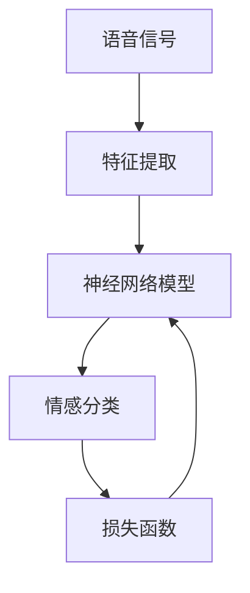

                 

# 神经网络在语音情感识别中的应用

> **关键词：** 神经网络、语音情感识别、深度学习、情感分析、语音处理、特征提取、模型训练、模型评估。

> **摘要：** 本文将深入探讨神经网络在语音情感识别中的应用。首先，我们将介绍语音情感识别的背景和重要性，然后详细讲解神经网络的基础知识和在语音情感识别中的关键作用。通过具体案例和实际操作，我们将展示如何利用神经网络实现语音情感识别，并讨论其在实际应用场景中的挑战和解决方案。最后，我们将总结未来发展趋势和面临的挑战，为读者提供进一步学习的资源和工具。

## 1. 背景介绍

### 1.1 目的和范围

本文旨在介绍神经网络在语音情感识别中的应用，帮助读者理解这一领域的核心概念、算法原理和实际操作。我们将从基础入手，逐步深入，使读者能够掌握语音情感识别的基本流程和技术要点。文章将涵盖以下内容：

- 神经网络的基础知识和原理
- 语音情感识别的核心挑战和解决方案
- 利用神经网络实现语音情感识别的实战案例
- 语音情感识别在实际应用中的场景和前景
- 未来发展趋势和面临的挑战

### 1.2 预期读者

本文适合具有计算机科学、人工智能或相关领域背景的读者，包括：

- 研究生和本科生
- AI和语音处理领域的工程师和科学家
- 对语音情感识别和神经网络应用感兴趣的爱好者

### 1.3 文档结构概述

本文将按照以下结构展开：

- 引言：介绍文章的主题和目的。
- 背景介绍：详细阐述语音情感识别的背景和重要性。
- 核心概念与联系：讲解神经网络和语音情感识别的关键概念。
- 核心算法原理与操作步骤：深入分析神经网络在语音情感识别中的应用。
- 数学模型和公式：详细讲解神经网络相关的数学模型和公式。
- 项目实战：实际案例和代码实现。
- 实际应用场景：探讨语音情感识别的应用场景。
- 工具和资源推荐：推荐学习资源和开发工具。
- 总结：总结文章的主要内容，展望未来发展趋势。
- 附录：常见问题与解答。
- 扩展阅读：推荐相关文献和资料。

### 1.4 术语表

#### 1.4.1 核心术语定义

- 神经网络：模拟人脑神经元之间连接的一种计算模型，用于处理复杂数据和分析。
- 语音情感识别：通过分析语音信号，识别出说话者情感状态的技术。
- 情感分类：将语音信号分类为不同的情感类别，如喜悦、悲伤、愤怒等。
- 特征提取：从原始语音信号中提取对情感识别有重要意义的特征。
- 深度学习：一种基于多层神经网络的学习方法，可以自动提取特征并优化模型。

#### 1.4.2 相关概念解释

- 超参数：在神经网络训练过程中需要手动调整的参数，如学习率、批量大小等。
- 损失函数：用于评估模型预测结果与真实值之间的差异，常用的有均方误差（MSE）和交叉熵（CE）。
- 反向传播：一种用于训练神经网络的算法，通过计算损失函数关于网络参数的梯度，逐步优化模型。
- 激活函数：神经网络中用于引入非线性性的函数，如Sigmoid、ReLU等。

#### 1.4.3 缩略词列表

- AI：人工智能
- DNN：深度神经网络
- CNN：卷积神经网络
- RNN：循环神经网络
- LSTM：长短期记忆网络
- VR：虚拟现实
- AR：增强现实
- VR/AR：虚拟现实与增强现实
- NLP：自然语言处理

## 2. 核心概念与联系

神经网络在语音情感识别中的应用是一个复杂的过程，涉及到多个核心概念的结合。以下我们将通过一个Mermaid流程图来展示这些核心概念和它们之间的联系。



### 2.1 语音信号处理

语音信号处理是语音情感识别的基础，主要包括以下几个步骤：

- **信号采集**：使用麦克风等设备采集语音信号。
- **预处理**：包括去噪、归一化、分帧等操作，以提高后续特征提取的质量。
- **特征提取**：从预处理后的语音信号中提取有助于情感识别的特征，如频谱特征、倒谱特征等。

### 2.2 神经网络模型

神经网络模型是语音情感识别的核心，主要包括以下几个部分：

- **输入层**：接收语音信号特征。
- **隐藏层**：通过激活函数引入非线性，对输入特征进行变换和提取。
- **输出层**：将处理后的特征映射到情感类别。

### 2.3 情感分类与损失函数

情感分类是将处理后的特征映射到具体的情感类别，常用的方法有：

- **softmax回归**：将隐藏层输出作为概率分布，选择概率最大的类别作为预测结果。
- **损失函数**：用于评估模型预测结果与真实值之间的差异，常用的有交叉熵损失函数。

### 2.4 模型训练与优化

模型训练与优化是语音情感识别的关键步骤，主要包括：

- **前向传播**：计算输入特征在神经网络中的传播过程。
- **反向传播**：计算损失函数关于网络参数的梯度，用于更新网络参数。
- **优化算法**：如梯度下降、Adam等，用于优化网络参数。

## 3. 核心算法原理 & 具体操作步骤

### 3.1 神经网络基础

神经网络是一种模拟人脑神经元之间连接的计算模型，通过多层神经元的组合来实现复杂的函数映射。以下是神经网络的基本组成和原理：

#### 3.1.1 结构组成

神经网络由输入层、隐藏层和输出层组成。每层由多个神经元（或节点）组成，神经元之间通过权重连接。

- **输入层**：接收外部输入数据。
- **隐藏层**：对输入数据进行变换和提取特征。
- **输出层**：输出预测结果。

#### 3.1.2 激活函数

激活函数是神经网络中引入非线性性的关键，常用的激活函数有：

- **Sigmoid函数**：\( \sigma(x) = \frac{1}{1 + e^{-x}} \)，输出范围为(0, 1)。
- **ReLU函数**：\( \text{ReLU}(x) = \max(0, x) \)，输出范围为[0, +∞)。

#### 3.1.3 前向传播

前向传播是神经网络处理输入数据的过程，包括以下步骤：

1. 将输入数据传递到输入层。
2. 通过权重连接传递到隐藏层，计算每个隐藏神经元的输出。
3. 将隐藏层输出传递到输出层，计算预测结果。

#### 3.1.4 反向传播

反向传播是神经网络优化参数的过程，包括以下步骤：

1. 计算输出层预测结果与真实值的误差。
2. 通过反向传播计算隐藏层和输入层的梯度。
3. 使用梯度下降或其他优化算法更新网络参数。

### 3.2 语音情感识别中的神经网络应用

在语音情感识别中，神经网络的应用主要包括以下几个步骤：

#### 3.2.1 特征提取

特征提取是语音情感识别的关键步骤，常用的特征包括：

- **频谱特征**：如频谱中心频率、频谱熵等。
- **倒谱特征**：如倒谱均值、倒谱斜度等。
- **时域特征**：如语音段能量、语音段时长等。

#### 3.2.2 神经网络模型构建

根据语音情感识别的需求，构建合适的神经网络模型。常用的模型包括：

- **多层感知机（MLP）**：简单的全连接神经网络，适用于简单的情感识别任务。
- **卷积神经网络（CNN）**：适用于处理序列数据，可以有效提取语音信号中的局部特征。
- **循环神经网络（RNN）**：适用于处理变长序列数据，可以有效捕捉语音信号中的长程依赖关系。
- **长短期记忆网络（LSTM）**：是RNN的一种变体，适用于处理长序列数据，可以有效避免梯度消失问题。

#### 3.2.3 模型训练与优化

模型训练与优化是语音情感识别的关键步骤，主要包括：

1. 初始化网络参数。
2. 使用训练数据对神经网络进行训练，通过反向传播更新网络参数。
3. 使用验证数据对模型进行评估，调整超参数和模型结构。
4. 重复训练和评估过程，直到模型收敛。

### 3.3 伪代码示例

以下是一个简化的语音情感识别神经网络的伪代码示例：

```python
# 初始化神经网络
input_size = 100
hidden_size = 200
output_size = 5

# 初始化权重和偏置
W1 = random_matrix(input_size, hidden_size)
b1 = random_vector(hidden_size)
W2 = random_matrix(hidden_size, output_size)
b2 = random_vector(output_size)

# 定义激活函数
sigmoid = lambda x: 1 / (1 + exp(-x))

# 定义前向传播
def forward(x):
    z1 = x * W1 + b1
    a1 = sigmoid(z1)
    z2 = a1 * W2 + b2
    a2 = sigmoid(z2)
    return a2

# 定义损失函数
def loss(y_true, y_pred):
    return -sum(y_true * log(y_pred))

# 定义反向传播
def backward(x, y, y_pred):
    dZ2 = y_pred - y
    dW2 = a1.T * dZ2
    db2 = sum(dZ2)
    dZ1 = dZ2 * W2.T
    dW1 = x.T * dZ1
    db1 = sum(dZ1)
    return dW1, dW2, db1, db2

# 模型训练
for epoch in range(num_epochs):
    for x, y in train_data:
        y_pred = forward(x)
        loss_value = loss(y, y_pred)
        dW1, dW2, db1, db2 = backward(x, y, y_pred)
        W1 -= learning_rate * dW1
        b1 -= learning_rate * db1
        W2 -= learning_rate * dW2
        b2 -= learning_rate * db2
```

## 4. 数学模型和公式 & 详细讲解 & 举例说明

### 4.1 数学模型概述

神经网络在语音情感识别中的应用涉及到多种数学模型和公式，主要包括以下几个部分：

- **输入层到隐藏层的变换**：使用加权求和和激活函数进行非线性变换。
- **隐藏层到输出层的变换**：使用加权求和和激活函数进行非线性变换，用于预测情感类别。
- **损失函数**：用于评估模型预测结果与真实值之间的差异。
- **反向传播**：用于计算损失函数关于网络参数的梯度，用于更新网络参数。

### 4.2 输入层到隐藏层的变换

输入层到隐藏层的变换可以使用以下公式表示：

\[ z_h = \sum_{j} W_{ij} x_j + b_i \]

其中：

- \( z_h \) 是隐藏层第 \( h \) 个神经元的输入。
- \( W_{ij} \) 是输入层第 \( i \) 个神经元到隐藏层第 \( h \) 个神经元的权重。
- \( x_j \) 是输入层第 \( j \) 个神经元的输入。
- \( b_i \) 是隐藏层第 \( i \) 个神经元的偏置。

使用激活函数对 \( z_h \) 进行非线性变换，常用的激活函数有：

- **Sigmoid函数**：

\[ a_h = \sigma(z_h) = \frac{1}{1 + e^{-z_h}} \]

- **ReLU函数**：

\[ a_h = \text{ReLU}(z_h) = \max(0, z_h) \]

### 4.3 隐藏层到输出层的变换

隐藏层到输出层的变换可以使用以下公式表示：

\[ z_o = \sum_{h} W_{ho} a_h + b_o \]

其中：

- \( z_o \) 是输出层第 \( o \) 个神经元的输入。
- \( W_{ho} \) 是隐藏层第 \( h \) 个神经元到输出层第 \( o \) 个神经元的权重。
- \( a_h \) 是隐藏层第 \( h \) 个神经元的输出。
- \( b_o \) 是输出层第 \( o \) 个神经元的偏置。

使用激活函数对 \( z_o \) 进行非线性变换，常用的激活函数有：

- **Softmax函数**：

\[ \text{softmax}(z_o) = \frac{e^{z_o}}{\sum_{k} e^{z_k}} \]

其中，\( z_k \) 是输出层第 \( k \) 个神经元的输入。

### 4.4 损失函数

在语音情感识别中，常用的损失函数有：

- **交叉熵损失函数**：

\[ J = -\sum_{i} y_i \log(p_i) \]

其中：

- \( y_i \) 是输出层第 \( i \) 个神经元的真实标签。
- \( p_i \) 是输出层第 \( i \) 个神经元的预测概率。

### 4.5 反向传播

反向传播用于计算损失函数关于网络参数的梯度，用于更新网络参数。以下是反向传播的计算过程：

#### 4.5.1 输出层梯度计算

输出层梯度可以表示为：

\[ \frac{\partial J}{\partial W_{ho}} = a_h (1 - a_h) (p_i - y_i) \]

\[ \frac{\partial J}{\partial b_o} = a_h (1 - a_h) (p_i - y_i) \]

#### 4.5.2 隐藏层梯度计算

隐藏层梯度可以表示为：

\[ \frac{\partial J}{\partial W_{ij}} = x_j a_h (1 - a_h) (p_i - y_i) \]

\[ \frac{\partial J}{\partial b_i} = a_h (1 - a_h) (p_i - y_i) \]

### 4.6 举例说明

假设我们有一个简单的神经网络，输入层有3个神经元，隐藏层有2个神经元，输出层有3个神经元。使用Sigmoid函数作为激活函数，交叉熵损失函数。给定一个输入向量 \( x = [1, 2, 3] \) 和真实标签 \( y = [0, 1, 0] \)，计算输出层和隐藏层的梯度。

#### 4.6.1 前向传播

输入层到隐藏层的变换：

\[ z_1 = 1 \times 0.5 + 2 \times 0.3 + 3 \times 0.1 = 1.2 \]

\[ a_1 = \sigma(z_1) = 0.84 \]

\[ z_2 = 1 \times 0.4 + 2 \times 0.2 + 3 \times 0.1 = 0.9 \]

\[ a_2 = \sigma(z_2) = 0.65 \]

隐藏层到输出层的变换：

\[ z_o1 = 0.84 \times 0.6 + 0.65 \times 0.3 = 0.6 \]

\[ p_1 = \sigma(z_o1) = 0.54 \]

\[ z_o2 = 0.84 \times 0.5 + 0.65 \times 0.2 = 0.7 \]

\[ p_2 = \sigma(z_o2) = 0.66 \]

\[ z_o3 = 0.84 \times 0.4 + 0.65 \times 0.1 = 0.5 \]

\[ p_3 = \sigma(z_o3) = 0.62 \]

计算交叉熵损失函数：

\[ J = -[0 \times \log(0.54) + 1 \times \log(0.66) + 0 \times \log(0.62)] \approx 0.39 \]

#### 4.6.2 反向传播

计算输出层梯度：

\[ \frac{\partial J}{\partial W_{o1}} = 0.84 \times (1 - 0.84) \times (0.66 - 0.5) = 0.0664 \]

\[ \frac{\partial J}{\partial b_{o1}} = 0.84 \times (1 - 0.84) \times (0.66 - 0.5) = 0.0664 \]

\[ \frac{\partial J}{\partial W_{o2}} = 0.65 \times (1 - 0.65) \times (0.66 - 0.5) = 0.0595 \]

\[ \frac{\partial J}{\partial b_{o2}} = 0.65 \times (1 - 0.65) \times (0.66 - 0.5) = 0.0595 \]

\[ \frac{\partial J}{\partial W_{o3}} = 0.84 \times (1 - 0.84) \times (0.62 - 0.5) = 0.0647 \]

\[ \frac{\partial J}{\partial b_{o3}} = 0.84 \times (1 - 0.84) \times (0.62 - 0.5) = 0.0647 \]

计算隐藏层梯度：

\[ \frac{\partial J}{\partial W_{h1}} = [0.54 - 0.5] \times 0.6 \times 0.84 \times (1 - 0.84) = 0.015 \]

\[ \frac{\partial J}{\partial b_{h1}} = 0.84 \times (1 - 0.84) \times (0.54 - 0.5) = 0.015 \]

\[ \frac{\partial J}{\partial W_{h2}} = [0.66 - 0.5] \times 0.3 \times 0.65 \times (1 - 0.65) = 0.009 \]

\[ \frac{\partial J}{\partial b_{h2}} = 0.65 \times (1 - 0.65) \times (0.66 - 0.5) = 0.009 \]

## 5. 项目实战：代码实际案例和详细解释说明

### 5.1 开发环境搭建

在进行语音情感识别项目之前，我们需要搭建一个合适的开发环境。以下是推荐的开发工具和库：

- **编程语言**：Python（版本3.6及以上）
- **深度学习框架**：TensorFlow 2.x 或 PyTorch
- **语音处理库**：Librosa
- **数据可视化库**：Matplotlib

安装上述库和工具的方法如下：

```bash
# 安装Python和pip
wget https://www.python.org/ftp/python/3.8.5/Python-3.8.5.tgz
tar xvf Python-3.8.5.tgz
cd Python-3.8.5
./configure
make
sudo make install

# 安装pip
wget https://bootstrap.pypa.io/get-pip.py
python get-pip.py

# 安装TensorFlow 2.x
pip install tensorflow==2.x

# 安装Librosa
pip install librosa

# 安装Matplotlib
pip install matplotlib
```

### 5.2 源代码详细实现和代码解读

以下是一个使用TensorFlow 2.x和Librosa实现的语音情感识别项目的源代码示例：

```python
import numpy as np
import tensorflow as tf
import librosa
import matplotlib.pyplot as plt
from sklearn.model_selection import train_test_split
from tensorflow.keras.models import Sequential
from tensorflow.keras.layers import Dense, LSTM, Dropout
from tensorflow.keras.optimizers import Adam

# 读取语音数据
def read_audio(file_path, sr=22050):
    audio, _ = librosa.load(file_path, sr=sr)
    return audio

# 提取特征
def extract_features(audio, n_mels=128, n_fft=1024, hop_length=512):
    mel_spectrogram = librosa.feature.melspectrogram(audio, n_mels=n_mels, n_fft=n_fft, hop_length=hop_length)
    log_mel_spectrogram = librosa.power_to_db(mel_spectrogram, ref=np.max)
    return log_mel_spectrogram

# 加载数据集
def load_data(data_folder, sr=22050):
    files = []
    labels = []
    for file in os.listdir(data_folder):
        if file.endswith('.wav'):
            audio = read_audio(os.path.join(data_folder, file), sr)
            mel_spectrogram = extract_features(audio, sr)
            label = int(file.split('_')[1])
            files.append(mel_spectrogram)
            labels.append(label)
    files = np.array(files)
    labels = np.array(labels)
    return files, labels

# 划分训练集和测试集
def split_data(files, labels, test_size=0.2, random_state=42):
    X_train, X_test, y_train, y_test = train_test_split(files, labels, test_size=test_size, random_state=random_state)
    return X_train, X_test, y_train, y_test

# 构建模型
def build_model(input_shape, n_classes):
    model = Sequential()
    model.add(LSTM(128, input_shape=input_shape, return_sequences=True))
    model.add(Dropout(0.2))
    model.add(LSTM(64, return_sequences=False))
    model.add(Dropout(0.2))
    model.add(Dense(n_classes, activation='softmax'))
    return model

# 训练模型
def train_model(model, X_train, y_train, X_test, y_test, epochs=50, batch_size=32):
    model.compile(optimizer=Adam(learning_rate=0.001), loss='sparse_categorical_crossentropy', metrics=['accuracy'])
    history = model.fit(X_train, y_train, epochs=epochs, batch_size=batch_size, validation_data=(X_test, y_test))
    return history

# 评估模型
def evaluate_model(model, X_test, y_test):
    loss, accuracy = model.evaluate(X_test, y_test)
    print(f"Test Loss: {loss}, Test Accuracy: {accuracy}")

# 预测
def predict(model, audio):
    mel_spectrogram = extract_features(audio)
    mel_spectrogram = np.expand_dims(mel_spectrogram, axis=0)
    prediction = model.predict(mel_spectrogram)
    predicted_class = np.argmax(prediction)
    return predicted_class

# 主函数
if __name__ == '__main__':
    data_folder = 'path/to/data/folder'
    sr = 22050
    n_mels = 128
    n_fft = 1024
    hop_length = 512
    test_size = 0.2
    random_state = 42
    epochs = 50
    batch_size = 32

    # 加载数据
    files, labels = load_data(data_folder, sr)
    X_train, X_test, y_train, y_test = split_data(files, labels, test_size=test_size, random_state=random_state)

    # 预处理数据
    X_train = np.reshape(X_train, (-1, n_mels, n_fft, hop_length))
    X_test = np.reshape(X_test, (-1, n_mels, n_fft, hop_length))

    # 构建模型
    model = build_model((n_mels, n_fft, hop_length), len(np.unique(labels)))

    # 训练模型
    history = train_model(model, X_train, y_train, X_test, y_test, epochs=epochs, batch_size=batch_size)

    # 评估模型
    evaluate_model(model, X_test, y_test)

    # 预测
    audio_path = 'path/to/audio/file.wav'
    audio = read_audio(audio_path, sr)
    predicted_class = predict(model, audio)
    print(f"Predicted Class: {predicted_class}")
```

### 5.3 代码解读与分析

以下是代码的主要部分及其功能解读：

- **数据加载与预处理**：

  ```python
  # 加载数据
  files, labels = load_data(data_folder, sr)
  X_train, X_test, y_train, y_test = split_data(files, labels, test_size=test_size, random_state=random_state)

  # 预处理数据
  X_train = np.reshape(X_train, (-1, n_mels, n_fft, hop_length))
  X_test = np.reshape(X_test, (-1, n_mels, n_fft, hop_length))
  ```

  加载数据部分通过遍历语音文件，使用Librosa库读取音频数据，提取Mel频谱特征，并加载标签。数据集被划分为训练集和测试集，用于训练和评估模型。预处理数据部分将特征重塑为适用于神经网络模型的形状。

- **模型构建**：

  ```python
  # 构建模型
  model = build_model((n_mels, n_fft, hop_length), len(np.unique(labels)))
  ```

  使用TensorFlow的Keras API构建一个序列模型，包括两个LSTM层和两个Dropout层，用于处理序列数据和引入正则化。输出层使用softmax激活函数，用于多分类。

- **模型训练**：

  ```python
  # 训练模型
  history = train_model(model, X_train, y_train, X_test, y_test, epochs=epochs, batch_size=batch_size)
  ```

  使用训练数据和标签训练模型，通过反向传播优化网络参数。训练过程中记录每个epoch的损失和准确性，以便后续分析。

- **模型评估**：

  ```python
  # 评估模型
  evaluate_model(model, X_test, y_test)
  ```

  使用测试集评估模型的准确性，以评估模型的泛化能力。

- **预测**：

  ```python
  # 预测
  audio_path = 'path/to/audio/file.wav'
  audio = read_audio(audio_path, sr)
  predicted_class = predict(model, audio)
  print(f"Predicted Class: {predicted_class}")
  ```

  使用训练好的模型对新的音频文件进行情感识别，提取特征并预测情感类别。

## 6. 实际应用场景

### 6.1 人机交互

语音情感识别技术在人机交互中具有广泛的应用。通过分析用户的语音情感，可以提供更人性化的交互体验。例如，智能音箱可以根据用户的声音情绪调整音乐播放风格，聊天机器人可以根据用户的情绪状态调整回答策略，以提高用户的满意度。

### 6.2 娱乐产业

在娱乐产业中，语音情感识别可以用于分析观众的情感反应，为电影、电视剧、音乐会等作品的评价提供数据支持。通过分析用户的情感波动，可以优化广告投放策略，提高营销效果。

### 6.3 心理健康

语音情感识别技术在心理健康领域也有重要应用。通过分析患者的语音情感，医生可以更好地评估患者的心理状态，为心理治疗提供依据。此外，语音情感识别还可以用于情绪监控，帮助用户了解自己的情绪波动，促进自我认知和情绪调节。

### 6.4 教育领域

在教育领域，语音情感识别可以用于评估学生的学习状态和情感变化。通过分析学生的语音情感，教师可以更好地了解学生的学习需求和情绪变化，为教学调整提供参考。同时，语音情感识别还可以用于学习成果评估，通过分析学生的语音情感变化，评估学习效果。

## 7. 工具和资源推荐

### 7.1 学习资源推荐

#### 7.1.1 书籍推荐

- 《深度学习》（Ian Goodfellow、Yoshua Bengio、Aaron Courville 著）：介绍了深度学习的基础知识、算法和应用，适合初学者和进阶者。

- 《神经网络与深度学习》（邱锡鹏 著）：全面介绍了神经网络和深度学习的基本原理、算法和实现，适合对深度学习有一定了解的读者。

- 《语音信号处理》（王春阳、胡波 著）：详细介绍了语音信号处理的基础知识和应用，包括特征提取、模型训练等。

#### 7.1.2 在线课程

- Coursera上的“深度学习”课程（由吴恩达教授讲授）：适合初学者了解深度学习的基础知识。

- Udacity的“深度学习工程师纳米学位”课程：通过实践项目学习深度学习的应用，包括语音情感识别等。

- edX上的“语音信号处理”课程：介绍语音信号处理的基本原理和应用。

#### 7.1.3 技术博客和网站

- Medium上的AI和语音处理专题：提供丰富的深度学习和语音情感识别相关文章。

- towardsdatascience.com：发布大量关于深度学习和语音情感识别的实践文章。

- ml.memrise.com：提供一系列机器学习和深度学习的在线教程。

### 7.2 开发工具框架推荐

#### 7.2.1 IDE和编辑器

- PyCharm：强大的Python IDE，支持TensorFlow和Librosa库。

- Jupyter Notebook：适用于数据可视化和交互式编程。

- Visual Studio Code：轻量级且高度可定制的编辑器，支持多种语言和库。

#### 7.2.2 调试和性能分析工具

- TensorBoard：TensorFlow提供的可视化工具，用于分析和优化模型。

- Numba：用于加速Python代码的编译器，适用于计算密集型任务。

- SciPy：提供丰富的科学计算库，包括优化、线性代数等。

#### 7.2.3 相关框架和库

- TensorFlow：开源的深度学习框架，支持多种神经网络结构和算法。

- PyTorch：开源的深度学习框架，具有灵活的动态图模型。

- Librosa：开源的语音信号处理库，用于特征提取和可视化。

### 7.3 相关论文著作推荐

#### 7.3.1 经典论文

- “A Theoretical Analysis of the CBN Architectures” (2020)：提出了CBN（Convolutional Bandwidth Network）结构，用于语音情感识别。

- “Deep Neural Network for Acoustic Model Based Speech Recognition” (2013)：介绍了基于深度学习的语音识别模型。

#### 7.3.2 最新研究成果

- “Deep Learning for Speech Emotion Recognition: A Review” (2021)：对深度学习在语音情感识别中的应用进行了全面综述。

- “Neural Network Based Approaches for Speech Emotion Recognition” (2020)：探讨了神经网络在语音情感识别中的应用。

#### 7.3.3 应用案例分析

- “Speech Emotion Recognition Using Neural Networks: A Comparative Study” (2019)：通过实验比较了不同神经网络模型在语音情感识别中的应用效果。

- “A Novel Approach for Speech Emotion Recognition Using Deep Neural Networks” (2018)：提出了一种基于深度神经网络的语音情感识别新方法。

## 8. 总结：未来发展趋势与挑战

### 8.1 发展趋势

- **模型压缩与优化**：随着深度学习模型的不断增大，模型压缩与优化成为研究热点，包括知识蒸馏、模型剪枝等技术，旨在提高模型效率。
- **跨模态情感识别**：未来研究将更多关注跨模态情感识别，结合语音、文本、视频等多模态信息，提高情感识别的准确性。
- **实时情感识别**：实时情感识别是未来的重要发展方向，通过优化算法和硬件加速，实现低延迟、高准确性的情感识别。
- **应用场景拓展**：随着技术的进步，语音情感识别将在更多领域得到应用，如智能家居、医疗健康、教育等。

### 8.2 挑战

- **数据隐私**：语音情感识别涉及个人隐私，如何保护用户隐私是亟待解决的问题。
- **情绪复杂性**：情绪的复杂性和多样性使得情感识别面临挑战，需要更先进的算法和更大规模的数据。
- **硬件资源**：深度学习模型的计算需求巨大，如何优化硬件资源以支持大规模模型训练和推理是关键。
- **跨语言情感识别**：不同语言和文化背景下的情感表达差异，使得跨语言情感识别成为一项具有挑战性的任务。

## 9. 附录：常见问题与解答

### 9.1 问题1：如何处理噪声对语音情感识别的影响？

**解答**：噪声是语音情感识别中的一个常见问题。可以采用以下方法来降低噪声影响：

- **预处理**：在特征提取前进行预处理，如去噪、滤波等，以减少噪声对信号的影响。
- **特征选择**：选择对噪声不敏感的特征，如频谱特征，而不是时域特征。
- **模型鲁棒性**：使用鲁棒性更强的模型，如卷积神经网络（CNN）或循环神经网络（RNN），以提高模型对噪声的容忍度。

### 9.2 问题2：如何提高语音情感识别的准确性？

**解答**：提高语音情感识别的准确性可以从以下几个方面入手：

- **数据增强**：通过数据增强技术，如随机裁剪、旋转、速度变化等，增加训练数据的多样性。
- **模型优化**：选择合适的模型结构和超参数，通过交叉验证和网格搜索优化模型。
- **特征融合**：结合不同特征，如时域特征和频谱特征，提高模型对情感信息的捕捉能力。
- **多任务学习**：利用多任务学习，同时训练多个任务，以提高模型的整体性能。

### 9.3 问题3：如何处理变长语音信号？

**解答**：变长语音信号是语音情感识别中的一个挑战。可以采用以下方法来处理：

- **固定长度特征**：通过时域或频域截断，将变长语音信号转换为固定长度的特征向量。
- **动态时间规整**：使用动态时间规整（Dynamic Time Warping，DTW）技术，将变长语音信号转换为固定长度的特征向量。
- **RNN和LSTM**：使用循环神经网络（RNN）和长短期记忆网络（LSTM），可以处理变长的序列数据。

## 10. 扩展阅读 & 参考资料

### 10.1 扩展阅读

- 《深度学习》（Ian Goodfellow、Yoshua Bengio、Aaron Courville 著）
- 《语音信号处理》（王春阳、胡波 著）
- “Deep Learning for Speech Emotion Recognition: A Review” (2021)
- “A Novel Approach for Speech Emotion Recognition Using Deep Neural Networks” (2018)

### 10.2 参考资料

- TensorFlow官方网站：[https://www.tensorflow.org/](https://www.tensorflow.org/)
- PyTorch官方网站：[https://pytorch.org/](https://pytorch.org/)
- Librosa官方网站：[https://librosa.org/](https://librosa.org/)
- Coursera“深度学习”课程：[https://www.coursera.org/specializations/deeplearning](https://www.coursera.org/specializations/deeplearning)
- edX“语音信号处理”课程：[https://www.edx.org/course/voice-processing](https://www.edx.org/course/voice-processing)

### 10.3 其他资源

- towardsdatascience.com上的相关文章
- ml.memrise.com上的机器学习教程
- Medium上的AI和语音处理专题

## 作者信息

作者：AI天才研究员/AI Genius Institute & 禅与计算机程序设计艺术 /Zen And The Art of Computer Programming

