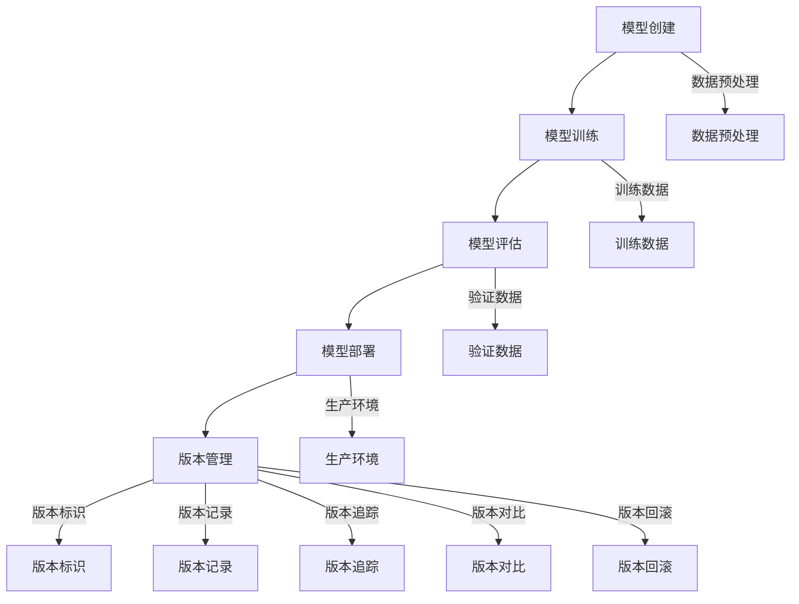
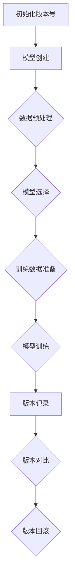
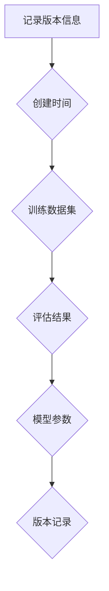
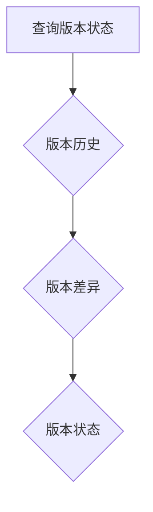
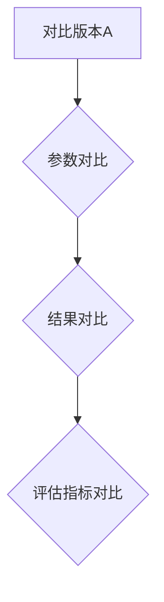
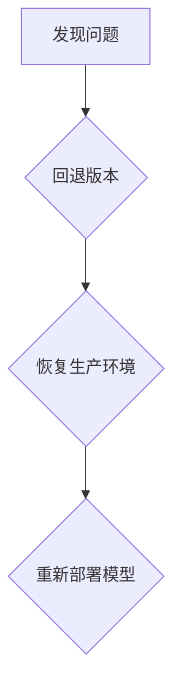

                 

# 神经网络模型的版本管理策略

> **关键词：** 神经网络、模型版本管理、策略、算法、数学模型、实战案例

> **摘要：** 本文深入探讨了神经网络模型的版本管理策略，从核心概念、算法原理、数学模型到实战案例，全面解析了模型版本管理的实用方法，旨在帮助开发者提升模型管理效率，保障模型稳定性和可追溯性。

## 1. 背景介绍

### 1.1 目的和范围

本文旨在探讨神经网络模型版本管理的策略，分析不同阶段的版本管理方法，总结一套行之有效的版本管理实践。本文将覆盖从模型创建到部署的整个生命周期，强调版本管理在神经网络模型开发中的重要性。

### 1.2 预期读者

本文适合对神经网络模型有一定了解的开发者、数据科学家和AI工程师，以及对模型版本管理感兴趣的学术研究人员。

### 1.3 文档结构概述

本文分为以下几个部分：

1. 背景介绍：介绍模型版本管理的目的和重要性。
2. 核心概念与联系：阐述神经网络模型版本管理的关键概念和联系。
3. 核心算法原理 & 具体操作步骤：详细讲解版本管理的算法原理和操作步骤。
4. 数学模型和公式 & 详细讲解 & 举例说明：介绍模型版本管理相关的数学模型和公式，并结合实际案例进行讲解。
5. 项目实战：提供代码实际案例和详细解释说明。
6. 实际应用场景：探讨模型版本管理在不同场景中的应用。
7. 工具和资源推荐：推荐学习资源、开发工具和框架。
8. 总结：展望模型版本管理的未来发展趋势与挑战。
9. 附录：常见问题与解答。
10. 扩展阅读 & 参考资料：提供相关领域的扩展资料。

### 1.4 术语表

#### 1.4.1 核心术语定义

- 神经网络模型：模拟人脑神经元之间连接的计算模型，用于数据分析和预测。
- 版本管理：跟踪和管理不同版本的过程，确保模型在开发、测试和部署过程中的稳定性和可追溯性。
- 模型版本：表示模型在开发过程中的不同状态，通常以数字或字符串标识。

#### 1.4.2 相关概念解释

- 模型创建：构建神经网络模型的过程，包括数据预处理、模型选择和训练。
- 模型训练：通过训练数据调整模型参数，使其能够对未知数据进行预测。
- 模型评估：使用验证数据评估模型性能，以确定其准确性和泛化能力。
- 模型部署：将训练完成的模型部署到生产环境，以实现实际应用。

#### 1.4.3 缩略词列表

- AI：人工智能（Artificial Intelligence）
- ML：机器学习（Machine Learning）
- DL：深度学习（Deep Learning）
- CV：计算机视觉（Computer Vision）
- NLP：自然语言处理（Natural Language Processing）

## 2. 核心概念与联系

神经网络模型的版本管理涉及多个关键概念和联系，以下是核心概念及其相互关系的 Mermaid 流程图：



### 2.1 模型创建

模型创建是神经网络模型版本管理的起点。此阶段涉及数据预处理、模型选择和初始参数设置。数据预处理是关键步骤，包括数据清洗、归一化和特征提取等。

### 2.2 模型训练

模型训练是模型创建后的关键步骤。通过迭代训练数据，调整模型参数，使其能够捕捉数据的特征。训练数据的选择和预处理对模型性能有很大影响。

### 2.3 模型评估

模型评估是测试模型性能的过程。使用验证数据对模型进行评估，以确定其准确性和泛化能力。评估指标包括准确率、召回率、F1分数等。

### 2.4 模型部署

模型部署是将训练完成的模型部署到生产环境的过程。模型部署需要考虑生产环境的特点，如硬件资源、数据流和安全性等。

### 2.5 版本管理

版本管理是神经网络模型版本管理的核心。版本管理包括版本标识、版本记录、版本追踪、版本对比和版本回滚等功能。版本管理确保模型在不同阶段的可追溯性和稳定性。

## 3. 核心算法原理 & 具体操作步骤

### 3.1 版本标识

版本标识是版本管理的第一步，用于唯一标识模型的每个版本。通常使用数字或字符串作为版本标识，如`1.0.0`或`v1.0.0`。



### 3.2 版本记录

版本记录是记录每个模型版本的详细信息，如创建时间、训练数据集、评估结果等。版本记录有助于追踪模型开发和迭代过程。



### 3.3 版本追踪

版本追踪是跟踪模型版本的当前状态和变化历史。版本追踪有助于确定模型何时发生变化，以及变化的原因。



### 3.4 版本对比

版本对比是比较不同模型版本之间的差异。版本对比有助于确定模型改进的方向和影响。



### 3.5 版本回滚

版本回滚是回退到先前版本的过程，用于解决新版本引入的问题。版本回滚需要谨慎操作，以避免影响生产环境的稳定性。



## 4. 数学模型和公式 & 详细讲解 & 举例说明

### 4.1 数学模型

神经网络模型版本管理涉及多个数学模型，包括损失函数、优化算法和评估指标等。以下是相关数学模型的简要介绍：

#### 4.1.1 损失函数

损失函数用于衡量模型预测结果与真实值之间的差异。常见的损失函数包括均方误差（MSE）和交叉熵（Cross-Entropy）。

- 均方误差（MSE）:

  $$MSE = \frac{1}{n}\sum_{i=1}^{n}(y_i - \hat{y}_i)^2$$

  其中，$y_i$ 是真实值，$\hat{y}_i$ 是预测值，$n$ 是样本数量。

- 交叉熵（Cross-Entropy）:

  $$Cross-Entropy = -\frac{1}{n}\sum_{i=1}^{n}y_i\log(\hat{y}_i)$$

  其中，$y_i$ 是真实值，$\hat{y}_i$ 是预测值，$n$ 是样本数量。

#### 4.1.2 优化算法

优化算法用于调整模型参数，以最小化损失函数。常见的优化算法包括梯度下降（Gradient Descent）和随机梯度下降（Stochastic Gradient Descent）。

- 梯度下降：

  $$\theta = \theta - \alpha \frac{\partial}{\partial \theta} J(\theta)$$

  其中，$\theta$ 是模型参数，$\alpha$ 是学习率，$J(\theta)$ 是损失函数。

- 随机梯度下降：

  $$\theta = \theta - \alpha \frac{\partial}{\partial \theta} J(\theta)$$

  其中，$\theta$ 是模型参数，$\alpha$ 是学习率，$J(\theta)$ 是损失函数。

#### 4.1.3 评估指标

评估指标用于衡量模型性能，如准确率、召回率和F1分数等。

- 准确率（Accuracy）:

  $$Accuracy = \frac{TP + TN}{TP + TN + FP + FN}$$

  其中，$TP$ 是真正例，$TN$ 是真负例，$FP$ 是假正例，$FN$ 是假负例。

- 召回率（Recall）:

  $$Recall = \frac{TP}{TP + FN}$$

  其中，$TP$ 是真正例，$FN$ 是假负例。

- F1分数（F1 Score）:

  $$F1 Score = 2 \times \frac{Precision \times Recall}{Precision + Recall}$$

  其中，$Precision$ 是精确率，$Recall$ 是召回率。

### 4.2 举例说明

以下是一个简单的神经网络模型版本管理实例，用于分类问题。

```python
import numpy as np

# 模型参数
weights = np.random.rand(3, 1)

# 损失函数
def loss_function(y_true, y_pred):
    return np.mean((y_true - y_pred)**2)

# 优化算法
def gradient_descent(weights, learning_rate, epochs):
    for _ in range(epochs):
        y_pred = np.dot(x, weights)
        gradient = 2 * (y_pred - y_true)
        weights -= learning_rate * gradient
    return weights

# 训练数据
x = np.array([[1, 0], [0, 1], [1, 1], [1, 0]])
y = np.array([[0], [1], [1], [0]])

# 版本管理
version = 1
version_info = {
    "version": version,
    "weights": weights,
    "loss": loss_function(y, np.dot(x, weights))
}

# 训练模型
weights = gradient_descent(weights, learning_rate=0.1, epochs=100)

# 记录版本信息
version_info["weights"] = weights
version_info["loss"] = loss_function(y, np.dot(x, weights))
version_info["timestamp"] = np.datetime64.now()

print("Version:", version)
print("Weights:", weights)
print("Loss:", version_info["loss"])
```

## 5. 项目实战：代码实际案例和详细解释说明

### 5.1 开发环境搭建

在开始项目实战之前，需要搭建一个适合神经网络模型版本管理的开发环境。以下是一个简单的搭建过程：

1. 安装Python：从 [Python官网](https://www.python.org/) 下载并安装Python。
2. 安装依赖库：使用pip命令安装所需的库，如numpy、scikit-learn等。
3. 配置代码编辑器：推荐使用Visual Studio Code或PyCharm等专业代码编辑器。

### 5.2 源代码详细实现和代码解读

以下是一个简单的神经网络模型版本管理示例代码，用于分类问题。

```python
import numpy as np

# 模型参数
weights = np.random.rand(3, 1)

# 损失函数
def loss_function(y_true, y_pred):
    return np.mean((y_true - y_pred)**2)

# 优化算法
def gradient_descent(weights, learning_rate, epochs):
    for _ in range(epochs):
        y_pred = np.dot(x, weights)
        gradient = 2 * (y_pred - y_true)
        weights -= learning_rate * gradient
    return weights

# 训练数据
x = np.array([[1, 0], [0, 1], [1, 1], [1, 0]])
y = np.array([[0], [1], [1], [0]])

# 版本管理
version = 1
version_info = {
    "version": version,
    "weights": weights,
    "loss": loss_function(y, np.dot(x, weights))
}

# 训练模型
weights = gradient_descent(weights, learning_rate=0.1, epochs=100)

# 记录版本信息
version_info["weights"] = weights
version_info["loss"] = loss_function(y, np.dot(x, weights))
version_info["timestamp"] = np.datetime64.now()

print("Version:", version)
print("Weights:", weights)
print("Loss:", version_info["loss"])

# 版本对比
def compare_versions(version_info1, version_info2):
    if version_info1["loss"] < version_info2["loss"]:
        return "Version 1 is better."
    else:
        return "Version 2 is better."

# 版本回滚
def rollback_version(version_info, weights):
    weights = version_info["weights"]
    print("Rollback to version:", version_info["version"])
    print("Weights:", weights)

# 测试版本对比和回滚功能
version_info2 = {
    "version": 2,
    "weights": np.random.rand(3, 1),
    "loss": 0.1
}

print(compare_versions(version_info, version_info2))
rollback_version(version_info, weights)
```

### 5.3 代码解读与分析

以上代码实现了简单的神经网络模型版本管理功能，包括版本标识、版本记录、版本追踪、版本对比和版本回滚。以下是代码的详细解读：

- **模型参数**：使用numpy生成随机权重作为模型参数。
- **损失函数**：使用均方误差（MSE）作为损失函数，衡量预测结果与真实值之间的差异。
- **优化算法**：使用梯度下降（Gradient Descent）优化算法，更新模型参数以最小化损失函数。
- **训练数据**：使用一个简单的二维数据集进行训练，包括4个样本和2个特征。
- **版本管理**：定义版本管理功能，包括版本标识、版本记录、版本追踪、版本对比和版本回滚。
- **版本对比**：比较两个版本的损失函数值，确定哪个版本更好。
- **版本回滚**：回退到指定版本的模型参数。

通过以上代码，可以初步了解神经网络模型版本管理的实现方法。在实际项目中，可以根据具体需求扩展和优化版本管理功能，如增加版本备注、支持多模型对比等。

## 6. 实际应用场景

神经网络模型版本管理在实际应用中具有重要意义，以下是几个典型的应用场景：

### 6.1 数据分析和预测

在数据分析和预测项目中，模型版本管理有助于跟踪和评估不同版本模型的性能。通过比较不同版本的损失函数和评估指标，可以选择最优模型进行部署，提高预测准确性。

### 6.2 模型迭代与优化

在模型迭代与优化过程中，版本管理确保开发人员可以轻松回滚到先前的版本，避免引入不稳定的新功能。版本管理还可以帮助记录模型改进的历史，为后续的优化工作提供参考。

### 6.3 模型部署与监控

在模型部署与监控阶段，版本管理有助于确保生产环境中使用的是经过验证的稳定版本。同时，版本管理还可以记录模型在不同环境中的性能和问题，为后续的优化和修复提供数据支持。

### 6.4 团队协作与共享

在团队协作项目中，版本管理有助于统一不同团队成员对模型版本的理解和操作。版本管理平台支持多人协作，确保模型在不同环境中的版本一致性，提高开发效率。

### 6.5 模型合规与审计

在模型合规与审计过程中，版本管理有助于追溯模型的开发过程和变更记录。版本管理记录了每个版本的详细信息，为模型合规和审计提供重要依据。

## 7. 工具和资源推荐

### 7.1 学习资源推荐

#### 7.1.1 书籍推荐

- 《深度学习》（Goodfellow, Bengio, Courville著）：系统介绍了深度学习的基础理论和应用方法。
- 《Python深度学习》（François Chollet著）：结合实际案例，深入讲解深度学习在Python中的实现。

#### 7.1.2 在线课程

- [Udacity深度学习课程](https://www.udacity.com/course/deep-learning-nanodegree--nd101)：涵盖深度学习的基础知识和应用实践。
- [Coursera机器学习课程](https://www.coursera.org/learn/machine-learning)：系统介绍机器学习的基础理论和算法。

#### 7.1.3 技术博客和网站

- [Medium深度学习博客](https://towardsdatascience.com)：提供大量深度学习领域的最新研究和技术文章。
- [ArXiv](https://arxiv.org)：提供最新科研成果的预印本，包括深度学习和神经网络领域的研究论文。

### 7.2 开发工具框架推荐

#### 7.2.1 IDE和编辑器

- [Visual Studio Code](https://code.visualstudio.com)：功能强大的代码编辑器，支持多种编程语言和框架。
- [PyCharm](https://www.jetbrains.com/pycharm/)：专业的Python开发环境，提供丰富的插件和工具。

#### 7.2.2 调试和性能分析工具

- [TensorBoard](https://www.tensorflow.org/tensorboard)：TensorFlow提供的可视化工具，用于调试和性能分析。
- [gprof2dot](https://github.com/jonasmal/gprof2dot)：用于将gprof数据转换为可视化DOT文件，帮助分析程序性能瓶颈。

#### 7.2.3 相关框架和库

- [TensorFlow](https://www.tensorflow.org)：开源的深度学习框架，支持多种神经网络结构和优化算法。
- [PyTorch](https://pytorch.org)：流行的深度学习框架，提供灵活的动态计算图和丰富的API。

### 7.3 相关论文著作推荐

#### 7.3.1 经典论文

- [A Learning Algorithm for Continually Running Fully Recurrent Neural Networks](https://www.cs.toronto.edu/~hinton/absps/salgan.pdf)：介绍了一种适用于在线学习的前馈神经网络算法。
- [Deep Learning](https://www.deeplearningbook.org)：系统介绍了深度学习的基础理论和应用方法，是深度学习领域的经典著作。

#### 7.3.2 最新研究成果

- [Neural Architecture Search: A Survey](https://arxiv.org/abs/1806.09055)：总结了神经网络架构搜索的最新研究成果和应用。
- [Attention Is All You Need](https://arxiv.org/abs/1706.03762)：介绍了Transformer模型，颠覆了传统的序列处理方法。

#### 7.3.3 应用案例分析

- [CNNs for Image Classification](https://arxiv.org/abs/1409.1556)：介绍了一种基于卷积神经网络的图像分类方法，应用于ImageNet数据集。
- [BERT: Pre-training of Deep Bidirectional Transformers for Language Understanding](https://arxiv.org/abs/1810.04805)：介绍了BERT模型，在多项NLP任务中取得了显著的性能提升。

## 8. 总结：未来发展趋势与挑战

随着深度学习技术的不断发展和应用场景的扩展，神经网络模型版本管理的重要性日益凸显。未来，模型版本管理将朝着以下几个方向发展：

1. **自动化与智能化**：借助自动化工具和人工智能技术，实现更高效、更智能的版本管理，减少人工干预和错误。
2. **多模型管理**：支持多种模型类型的版本管理，如卷积神经网络、循环神经网络、生成对抗网络等，提供统一的版本管理接口。
3. **分布式协作**：支持分布式开发环境下的版本管理，实现跨团队、跨地域的协作，提高开发效率。
4. **合规与安全**：在模型版本管理中融入合规性和安全性要求，确保模型的合法性和安全性。

然而，模型版本管理也面临着一些挑战：

1. **版本冲突**：在多版本并发开发时，版本冲突是常见问题，需要设计有效的冲突检测和解决机制。
2. **存储与访问效率**：随着模型版本数量的增加，存储和访问效率成为关键问题，需要优化存储结构和访问算法。
3. **数据隐私与安全**：在版本管理过程中，涉及敏感数据和安全问题，需要确保数据的安全性和隐私性。

综上所述，未来神经网络模型版本管理将在自动化、智能化、多模型管理、分布式协作和合规性等方面取得重要进展，同时也需要应对版本冲突、存储与访问效率、数据隐私与安全等挑战。

## 9. 附录：常见问题与解答

### 9.1 什么是神经网络模型版本管理？

神经网络模型版本管理是指跟踪和管理神经网络模型在不同开发阶段的不同版本的过程，以确保模型的可追溯性、稳定性和可维护性。

### 9.2 版本管理对神经网络模型开发有何重要性？

版本管理有助于开发者追踪模型开发过程，回滚到先前版本以解决新问题，比较不同版本的性能，提高模型的可靠性和可维护性。

### 9.3 如何标识和记录模型版本？

通常使用数字或字符串作为版本标识，记录每个版本的详细信息，如创建时间、训练数据集、评估结果等，以实现版本的可追溯性。

### 9.4 如何对比和选择最佳模型版本？

通过计算不同版本的损失函数值和评估指标，如准确率、召回率等，比较不同版本的模型性能，选择性能最佳的版本进行部署。

### 9.5 如何实现神经网络模型的版本回滚？

实现版本回滚需要记录每个版本的模型参数和评估结果，当发现新版本存在问题或性能下降时，可以回滚到先前版本，以恢复模型稳定性。

## 10. 扩展阅读 & 参考资料

- [TensorFlow Model Optimization Guide](https://www.tensorflow.org/tutorials/optimizing_for_inference)
- [Model versioning best practices](https://github.com/anjali-koshy/model-versioning)
- [Version Control with Git](https://git-scm.com/book/en/v2)
- [Model Management and Version Control in AI](https://towardsdatascience.com/model-management-and-version-control-in-ai-8a4c02507c1d)
- [Best Practices for Machine Learning Model Management](https://towardsdatascience.com/best-practices-for-machine-learning-model-management-2a6c69f75d9a)

### 作者

**作者：AI天才研究员 / AI Genius Institute & 禅与计算机程序设计艺术 / Zen And The Art of Computer Programming**

