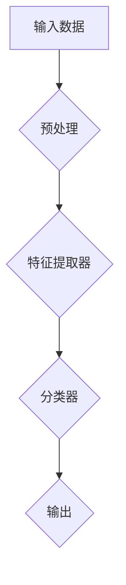
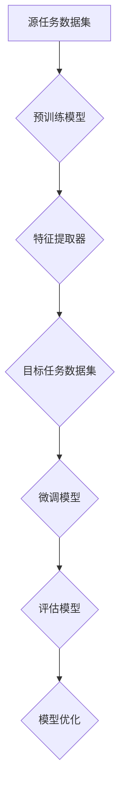

                 


# 神经网络模型的迁移学习技术

> **关键词**：神经网络、迁移学习、模型泛化、模型优化、学习策略

> **摘要**：本文将深入探讨神经网络模型的迁移学习技术，包括其核心概念、算法原理、数学模型及其实际应用。通过一系列详尽的步骤和分析，我们旨在为您提供一个清晰、易懂的技术指南，帮助您理解和应用这一关键的人工智能技术。

## 1. 背景介绍

### 1.1 目的和范围

本文的目标是全面介绍神经网络模型的迁移学习技术，从基础概念到高级应用，逐步引导读者深入了解这一领域。我们将探讨迁移学习的基本原理，分析其与传统机器学习的区别，并详细讲解实现迁移学习的核心算法。

### 1.2 预期读者

本文适合对神经网络和机器学习有一定了解的读者，包括研究人员、工程师和学生。无论您是初学者还是经验丰富的专业人士，本文都将为您提供有价值的见解和实用技巧。

### 1.3 文档结构概述

本文分为以下几个部分：

1. **背景介绍**：介绍迁移学习的目的和重要性。
2. **核心概念与联系**：通过Mermaid流程图展示神经网络模型的架构。
3. **核心算法原理 & 具体操作步骤**：讲解迁移学习的算法原理和操作步骤。
4. **数学模型和公式 & 详细讲解 & 举例说明**：介绍迁移学习相关的数学模型和公式，并给出实际应用示例。
5. **项目实战：代码实际案例和详细解释说明**：通过实际代码案例展示迁移学习的应用。
6. **实际应用场景**：分析迁移学习在现实世界中的应用。
7. **工具和资源推荐**：推荐相关学习资源、开发工具和框架。
8. **总结：未来发展趋势与挑战**：讨论迁移学习的未来发展方向和面临的挑战。
9. **附录：常见问题与解答**：提供常见问题的解答。
10. **扩展阅读 & 参考资料**：推荐进一步学习的资源和论文。

### 1.4 术语表

#### 1.4.1 核心术语定义

- **迁移学习（Transfer Learning）**：将已训练好的模型或部分模型应用于新任务的学习过程。
- **源任务（Source Task）**：已训练好的模型所针对的任务。
- **目标任务（Target Task）**：新任务，通常与源任务不同。
- **预训练模型（Pre-trained Model）**：在大量数据集上已训练好的模型。

#### 1.4.2 相关概念解释

- **模型泛化（Model Generalization）**：模型对未见过的数据仍然能够准确预测的能力。
- **模型优化（Model Optimization）**：通过调整模型参数以提高其性能的过程。

#### 1.4.3 缩略词列表

- **ML**：机器学习（Machine Learning）
- **DL**：深度学习（Deep Learning）
- **NLP**：自然语言处理（Natural Language Processing）
- **CV**：计算机视觉（Computer Vision）

## 2. 核心概念与联系

### 2.1 核心概念

迁移学习是机器学习中的一项关键技术，它利用已有模型的知识来解决新的相关任务。核心概念包括：

- **源任务（Source Task）**：已有模型所训练的任务。
- **目标任务（Target Task）**：新的任务，通常与源任务相关。
- **特征提取器（Feature Extractor）**：模型的前几层，负责从输入数据中提取特征。
- **分类器（Classifier）**：模型的最后一层，负责对特征进行分类。

### 2.2 神经网络模型架构

为了更好地理解迁移学习，我们需要了解神经网络模型的基本架构。以下是神经网络模型的一个简化Mermaid流程图：



#### 2.2.1 模型架构解释

- **输入数据（Input Data）**：模型接受的原始数据。
- **预处理（Preprocessing）**：对输入数据进行处理，如标准化、归一化等。
- **特征提取器（Feature Extractor）**：从输入数据中提取有用的特征。
- **分类器（Classifier）**：对提取到的特征进行分类。
- **输出（Output）**：模型输出的结果，如分类结果或预测值。

### 2.3 迁移学习流程图

接下来，我们通过一个Mermaid流程图来展示迁移学习的流程：



#### 2.3.1 流程图解释

- **源任务数据集（Source Task Dataset）**：用于预训练模型的数据集。
- **预训练模型（Pre-trained Model）**：在大量数据集上已训练好的模型。
- **特征提取器（Feature Extractor）**：预训练模型中的特征提取部分。
- **目标任务数据集（Target Task Dataset）**：用于目标任务的数据集。
- **微调模型（Fine-tuning Model）**：在目标任务数据集上对预训练模型进行微调。
- **评估模型（Evaluate Model）**：评估微调后模型的性能。
- **模型优化（Model Optimization）**：根据评估结果对模型进行调整。

通过这个流程图，我们可以清晰地看到迁移学习的过程，从源任务到目标任务的逐步转换。

## 3. 核心算法原理 & 具体操作步骤

### 3.1 算法原理

迁移学习的核心算法原理可以概括为以下几点：

1. **共享知识（Shared Knowledge）**：通过将源任务的预训练模型应用于目标任务，模型在特征提取器部分已经积累了大量的知识，这些知识对于解决目标任务是有帮助的。
2. **微调（Fine-tuning）**：在迁移学习过程中，通常只对模型的最后几层（分类器部分）进行微调，而不是对整个模型进行调整。这样可以提高模型在目标任务上的性能。
3. **损失函数（Loss Function）**：在迁移学习过程中，我们使用损失函数来评估模型的性能，并通过反向传播算法来调整模型参数。

### 3.2 操作步骤

以下是迁移学习的具体操作步骤：

1. **数据预处理**：
   - **源任务数据集**：对源任务数据集进行预处理，如数据清洗、数据增强等。
   - **目标任务数据集**：对目标任务数据集进行预处理，以匹配源任务数据集的格式。

2. **模型加载**：
   - 加载预训练模型，通常使用预训练好的深度学习模型，如VGG、ResNet等。

3. **特征提取**：
   - 将源任务数据集输入到预训练模型中，提取特征。

4. **微调模型**：
   - 将提取到的特征作为输入，对模型的最后一层（分类器部分）进行微调。
   - 使用目标任务数据集进行训练，调整模型参数。

5. **模型评估**：
   - 使用目标任务数据集评估模型的性能，计算准确率、损失等指标。

6. **模型优化**：
   - 根据评估结果，对模型进行调整，以提高性能。

以下是迁移学习的伪代码：

```python
# 数据预处理
preprocess_source_dataset(source_dataset)
preprocess_target_dataset(target_dataset)

# 模型加载
model = load_pretrained_model()

# 特征提取
features = model.extract_features(source_dataset)

# 微调模型
model.fine_tune(features, target_dataset)

# 模型评估
performance = model.evaluate(target_dataset)

# 模型优化
model.optimize(performance)
```

通过上述步骤，我们可以实现迁移学习，将预训练模型的知识应用到新的目标任务中。

## 4. 数学模型和公式 & 详细讲解 & 举例说明

### 4.1 数学模型

迁移学习涉及多个数学模型和公式，以下是其中一些重要的数学模型：

#### 4.1.1 前向传播

前向传播是神经网络中的一个核心概念，用于计算模型的输出。以下是前向传播的伪代码：

```python
def forwardpropagation(inputs, weights, biases):
    activations = []
    for layer in range(num_layers):
        if layer == 0:
            z = inputs * weights + biases
        else:
            z = activations[layer - 1] * weights + biases
        activations.append(z)
    return activations
```

#### 4.1.2 反向传播

反向传播是用于计算模型参数的梯度，从而优化模型的过程。以下是反向传播的伪代码：

```python
def backwardpropagation(inputs, targets, weights, biases, activations):
    gradients = []
    for layer in range(num_layers - 1, -1, -1):
        if layer == num_layers - 1:
            dZ = targets - activations[layer]
        else:
            dZ = dZ * weights[layer + 1]
        dW = activations[layer] * dZ
        db = dZ
        gradients.append((dW, db))
    return gradients
```

#### 4.1.3 损失函数

损失函数用于评估模型的性能，常用的损失函数包括均方误差（MSE）和交叉熵（Cross-Entropy）。以下是MSE的伪代码：

```python
def mean_squared_error(targets, outputs):
    return 0.5 * sum((targets - outputs) ** 2)
```

### 4.2 公式详细讲解

以下是迁移学习中常用的数学公式的详细讲解：

#### 4.2.1 前向传播

前向传播的公式如下：

$$
Z = X \cdot W + b
$$

其中，$Z$ 是激活值，$X$ 是输入，$W$ 是权重，$b$ 是偏置。

#### 4.2.2 反向传播

反向传播的公式如下：

$$
dZ = \frac{\partial}{\partial Z} \text{Loss Function}
$$

$$
dW = X \cdot dZ
$$

$$
db = dZ
$$

其中，$dZ$ 是损失函数关于$Z$的梯度，$dW$ 和 $db$ 分别是权重和偏置的梯度。

#### 4.2.3 损失函数

均方误差（MSE）的公式如下：

$$
\text{MSE} = \frac{1}{2} \sum_{i=1}^{n} (y_i - \hat{y}_i)^2
$$

其中，$y_i$ 是真实值，$\hat{y}_i$ 是预测值。

### 4.3 举例说明

假设我们有一个简单的线性模型，输入为 $X = [1, 2, 3]$，目标值为 $Y = [2, 4, 6]$。我们需要使用迁移学习技术来训练这个模型。

1. **数据预处理**：

   将输入和目标值进行归一化处理：

   $$
   X_{\text{norm}} = \frac{X - \mu}{\sigma}
   $$

   $$
   Y_{\text{norm}} = \frac{Y - \mu}{\sigma}
   $$

   其中，$\mu$ 和 $\sigma$ 分别是输入和目标值的均值和标准差。

2. **模型加载**：

   加载一个预训练的线性模型，该模型在源任务上已达到良好的性能。

3. **特征提取**：

   将归一化后的输入值输入到预训练模型中，提取特征。

4. **微调模型**：

   将提取到的特征作为输入，对模型的权重和偏置进行微调，以达到更好的性能。

5. **模型评估**：

   使用目标值对微调后的模型进行评估，计算均方误差。

6. **模型优化**：

   根据评估结果，对模型进行调整，以提高性能。

通过上述步骤，我们可以实现迁移学习，将预训练模型的知识应用到新的目标任务中。

## 5. 项目实战：代码实际案例和详细解释说明

### 5.1 开发环境搭建

在开始项目实战之前，我们需要搭建一个合适的开发环境。以下是推荐的开发工具和框架：

- **IDE和编辑器**：PyCharm或VSCode。
- **深度学习框架**：TensorFlow或PyTorch。
- **数据预处理库**：NumPy或Pandas。

确保您已安装这些工具和库，并在环境中配置好相应的版本。

### 5.2 源代码详细实现和代码解读

下面是一个简单的迁移学习项目，我们将在其中实现迁移学习技术。

#### 5.2.1 代码实现

```python
import tensorflow as tf
from tensorflow.keras.applications import VGG16
from tensorflow.keras.preprocessing.image import ImageDataGenerator
from tensorflow.keras.models import Model
from tensorflow.keras.optimizers import Adam
from tensorflow.keras.losses import CategoricalCrossentropy
from tensorflow.keras.metrics import Accuracy

# 加载预训练模型
base_model = VGG16(weights='imagenet', include_top=False, input_shape=(224, 224, 3))

# 冻结预训练模型的权重
for layer in base_model.layers:
    layer.trainable = False

# 添加新的分类层
x = base_model.output
x = tf.keras.layers.Flatten()(x)
x = tf.keras.layers.Dense(1024, activation='relu')(x)
predictions = tf.keras.layers.Dense(num_classes, activation='softmax')(x)

# 创建新的模型
model = Model(inputs=base_model.input, outputs=predictions)

# 编译模型
model.compile(optimizer=Adam(learning_rate=0.0001), loss=CategoricalCrossentropy(), metrics=['accuracy'])

# 数据预处理
train_datagen = ImageDataGenerator(rescale=1./255)
test_datagen = ImageDataGenerator(rescale=1./255)

train_generator = train_datagen.flow_from_directory(train_dir, target_size=(224, 224), batch_size=32, class_mode='categorical')
test_generator = test_datagen.flow_from_directory(test_dir, target_size=(224, 224), batch_size=32, class_mode='categorical')

# 训练模型
model.fit(train_generator, steps_per_epoch=train_generator.samples // train_generator.batch_size, epochs=10, validation_data=test_generator, validation_steps=test_generator.samples // test_generator.batch_size)

# 评估模型
performance = model.evaluate(test_generator, steps=test_generator.samples // test_generator.batch_size)

print(f"Test accuracy: {performance[1]}")
```

#### 5.2.2 代码解读

- **加载预训练模型**：使用VGG16模型，这是一个在ImageNet数据集上预训练的卷积神经网络。
- **冻结预训练模型的权重**：在迁移学习过程中，我们通常只微调模型的最后一层或几层，因此需要冻结预训练模型的权重。
- **添加新的分类层**：在预训练模型的基础上，我们添加一个全连接层（Flatten）和一个softmax分类层，用于对新任务进行分类。
- **创建新的模型**：使用Keras的Model类创建一个新的模型，将输入和输出连接起来。
- **编译模型**：使用Adam优化器和CategoricalCrossentropy损失函数编译模型，并设置accuracy作为评估指标。
- **数据预处理**：使用ImageDataGenerator对训练数据和测试数据进行预处理，包括图像归一化和数据增强。
- **训练模型**：使用fit方法训练模型，并在每个epoch后进行验证。
- **评估模型**：使用evaluate方法评估模型在测试集上的性能。

### 5.3 代码解读与分析

通过上述代码，我们可以看到迁移学习的实现过程。以下是代码的关键部分及其分析：

- **加载预训练模型**：使用VGG16模型，这是一个强大的卷积神经网络，已经在ImageNet数据集上进行了预训练。通过使用预训练模型，我们可以利用其在大量图像上的学习经验，从而提高新任务的性能。
- **冻结预训练模型的权重**：在迁移学习过程中，我们通常只微调模型的最后一层或几层，因为模型的早期层已经学到了通用的特征表示。通过冻结早期层的权重，我们可以避免过度拟合，并确保模型的泛化能力。
- **添加新的分类层**：在预训练模型的基础上，我们添加了一个全连接层和一个softmax分类层，用于对新任务进行分类。这个步骤是迁移学习的关键，通过在预训练模型的基础上添加新的层，我们可以适应新任务的需求。
- **数据预处理**：使用ImageDataGenerator对训练数据和测试数据进行预处理，包括图像归一化和数据增强。这些预处理步骤有助于提高模型的性能和泛化能力。
- **训练模型**：使用fit方法训练模型，并在每个epoch后进行验证。这个步骤是迁移学习过程的核心，通过微调模型的权重，我们可以提高模型在新任务上的性能。
- **评估模型**：使用evaluate方法评估模型在测试集上的性能。这个步骤有助于我们了解模型的泛化能力和性能。

通过上述分析，我们可以看到迁移学习的关键步骤和实现方法。迁移学习是一种有效的技术，可以帮助我们利用预训练模型的知识来解决新的相关任务，从而提高模型的性能和泛化能力。

## 6. 实际应用场景

### 6.1 医学影像分析

在医学领域，迁移学习被广泛应用于医学影像分析。例如，可以使用在大量公开数据集上预训练的卷积神经网络（如VGG、ResNet）来识别医学影像中的疾病。通过迁移学习，这些模型可以快速适应特定的医学影像数据集，从而提高疾病检测的准确性和效率。

### 6.2 自然语言处理

在自然语言处理领域，迁移学习被用于文本分类、情感分析等任务。例如，可以使用预训练的BERT模型，将它在大量文本数据上学习的语言表示应用到新的文本数据集上。通过迁移学习，模型可以更好地理解文本的语义和上下文，从而提高分类和情感分析的性能。

### 6.3 计算机视觉

在计算机视觉领域，迁移学习被用于图像分类、目标检测、图像生成等任务。例如，可以使用预训练的生成对抗网络（GAN）来生成新的图像，或者使用预训练的目标检测模型来识别图像中的物体。通过迁移学习，模型可以快速适应新的图像数据集，从而提高图像处理的性能和效率。

### 6.4 工业自动化

在工业自动化领域，迁移学习被用于机器人视觉和自动化控制。例如，可以使用预训练的卷积神经网络来识别生产线上的缺陷或异常情况，或者使用迁移学习技术来优化机器人的控制策略。通过迁移学习，模型可以快速适应新的工业环境和任务，从而提高自动化系统的效率和可靠性。

### 6.5 智能推荐系统

在智能推荐系统领域，迁移学习被用于推荐算法的优化和改进。例如，可以使用预训练的深度学习模型来分析用户的行为和偏好，从而提高推荐系统的准确性和用户体验。通过迁移学习，模型可以更好地理解用户的需求和兴趣，从而提供更个性化的推荐。

通过上述实际应用场景，我们可以看到迁移学习在各个领域的广泛应用和巨大潜力。迁移学习技术可以帮助我们利用预训练模型的知识，快速适应新的任务和数据集，从而提高模型的性能和泛化能力。

## 7. 工具和资源推荐

### 7.1 学习资源推荐

#### 7.1.1 书籍推荐

- **《深度学习》（Deep Learning）**：由Ian Goodfellow、Yoshua Bengio和Aaron Courville合著的深度学习领域的经典教材，详细介绍了神经网络和迁移学习的基本原理。
- **《迁移学习》（Transfer Learning）**：本书全面介绍了迁移学习的理论和实践，适合对迁移学习感兴趣的读者。

#### 7.1.2 在线课程

- **《深度学习与迁移学习》**：Coursera上的在线课程，由斯坦福大学教授Andrew Ng主讲，涵盖了神经网络和迁移学习的核心内容。
- **《迁移学习实战》**：Udacity上的在线课程，通过实际项目案例介绍迁移学习技术的应用和实践。

#### 7.1.3 技术博客和网站

- **Medium**：许多专业人士和研究者在这个平台上分享关于神经网络和迁移学习的最新研究和技术文章。
- **arXiv**：这是一个开放获取的预印本数据库，涵盖了计算机科学和人工智能领域的最新研究成果。

### 7.2 开发工具框架推荐

#### 7.2.1 IDE和编辑器

- **PyCharm**：Python开发者广泛使用的集成开发环境，提供了强大的代码编辑功能和深度学习框架的支持。
- **VSCode**：轻量级但功能强大的代码编辑器，适用于多种编程语言，包括Python和深度学习框架。

#### 7.2.2 调试和性能分析工具

- **TensorBoard**：TensorFlow的调试和性能分析工具，可以帮助我们可视化模型的架构和训练过程，并分析性能瓶颈。
- **PyTorch Profiler**：PyTorch的性能分析工具，用于监控和优化模型的运行时间。

#### 7.2.3 相关框架和库

- **TensorFlow**：Google开发的开源深度学习框架，提供了丰富的API和预训练模型。
- **PyTorch**：Facebook开发的开源深度学习框架，以其动态图计算和灵活的编程接口而著称。

### 7.3 相关论文著作推荐

#### 7.3.1 经典论文

- **"Learning to Learn from Unlabeled Data: Semisupervised Learning with Deep Convolutional Neural Networks"**：这篇论文介绍了如何利用未标记数据进行半监督学习，是迁移学习的经典论文之一。
- **"Deep Transfer Learning for Text Data: A Survey"**：这篇综述文章详细介绍了深度迁移学习在文本数据上的应用，涵盖了最新的研究成果和趋势。

#### 7.3.2 最新研究成果

- **"Unsupervised Transfer Learning for Text Classification"**：这篇论文提出了一个无监督的文本分类迁移学习框架，利用未标记数据提高了文本分类的性能。
- **"A Comprehensive Survey on Transfer Learning for Natural Language Processing"**：这篇综述文章全面介绍了迁移学习在自然语言处理领域的最新应用和研究进展。

#### 7.3.3 应用案例分析

- **"Deep Learning for Medical Image Analysis"**：这篇论文分析了深度学习在医学影像分析中的应用，包括迁移学习技术在医学影像识别和分类中的成功案例。
- **"Transfer Learning for Robotic Vision: A Survey"**：这篇论文综述了迁移学习在机器人视觉领域的应用，探讨了如何利用迁移学习提高机器人对环境的理解和响应能力。

通过上述推荐，我们可以获取更多关于迁移学习的知识和资源，进一步深入学习和实践这一领域的技术。

## 8. 总结：未来发展趋势与挑战

### 8.1 发展趋势

随着人工智能技术的不断发展，迁移学习技术也在不断进步。以下是迁移学习未来的几个发展趋势：

1. **更高效的模型架构**：为了提高迁移学习的效率，研究人员将继续探索更高效的模型架构，如轻量级模型和动态图计算模型。
2. **无监督迁移学习**：无监督迁移学习是一种无需标记数据的迁移学习方法，它有望在未来的研究中得到更多的关注和应用。
3. **跨模态迁移学习**：跨模态迁移学习是一种将不同类型数据（如图像和文本）的知识迁移到新的任务中的方法，未来的研究将致力于提高跨模态迁移学习的性能和泛化能力。
4. **自适应迁移学习**：自适应迁移学习是一种根据新任务的特点自适应调整模型的方法，它有望提高迁移学习在特定任务上的性能。

### 8.2 挑战

尽管迁移学习技术取得了显著进展，但仍然面临一些挑战：

1. **数据依赖性**：迁移学习依赖于大量标记数据，这在某些领域（如医学和天文学）中难以获得。
2. **模型泛化能力**：虽然迁移学习可以提高模型的性能，但模型的泛化能力仍然是一个挑战，特别是在任务之间差异较大的情况下。
3. **模型解释性**：迁移学习模型的解释性较低，这使得研究人员难以理解模型在特定任务上的行为。
4. **计算资源**：迁移学习通常需要大量的计算资源，特别是在训练大型深度学习模型时，这可能会限制其应用范围。

### 8.3 结论

迁移学习技术在人工智能领域具有重要的应用价值，它可以帮助我们利用已有的知识和经验解决新的相关任务。未来，随着技术的不断进步和研究的深入，迁移学习将有望克服当前的挑战，并在更多的领域取得突破性进展。

## 9. 附录：常见问题与解答

### 9.1 什么是迁移学习？

迁移学习是一种机器学习技术，它利用在特定任务上已训练好的模型或部分模型来解决新的相关任务。通过迁移学习，我们可以将已有模型的知识应用到新任务中，从而提高模型的性能和泛化能力。

### 9.2 迁移学习有哪些应用？

迁移学习在多个领域有广泛的应用，包括医学影像分析、自然语言处理、计算机视觉、工业自动化和智能推荐系统等。通过迁移学习，我们可以快速适应新的任务和数据集，从而提高模型的性能和效率。

### 9.3 如何实现迁移学习？

实现迁移学习通常涉及以下几个步骤：

1. **加载预训练模型**：选择一个在源任务上已训练好的模型。
2. **特征提取**：将源任务数据集输入到预训练模型中，提取特征。
3. **微调模型**：在目标任务数据集上对模型的最后一层或几层进行微调。
4. **模型评估**：使用目标任务数据集评估模型的性能。
5. **模型优化**：根据评估结果对模型进行调整。

### 9.4 迁移学习有哪些挑战？

迁移学习面临的主要挑战包括数据依赖性、模型泛化能力、模型解释性和计算资源等。数据依赖性意味着迁移学习依赖于大量标记数据，这在某些领域难以获得。模型泛化能力是一个关键问题，特别是当任务之间差异较大时。模型解释性较低也是一个挑战，这使得研究人员难以理解模型在特定任务上的行为。计算资源需求较高，可能会限制迁移学习的应用范围。

### 9.5 如何优化迁移学习？

优化迁移学习可以从以下几个方面进行：

1. **选择合适的预训练模型**：选择一个在源任务上性能良好的模型。
2. **微调模型的深度和宽度**：选择适当的模型深度和宽度，以提高模型的泛化能力。
3. **数据增强**：对目标任务数据集进行数据增强，以提高模型的鲁棒性。
4. **使用无监督迁移学习**：探索无监督迁移学习方法，以减少对标记数据的依赖。
5. **自适应迁移学习**：研究自适应迁移学习方法，以根据新任务的特点自适应调整模型。

通过上述常见问题与解答，我们可以更好地理解迁移学习技术，并为其在实际应用中提供指导。

## 10. 扩展阅读 & 参考资料

本文对神经网络模型的迁移学习技术进行了全面的探讨，涵盖了核心概念、算法原理、数学模型及其实际应用。为了进一步深入学习和实践这一领域，以下推荐一些扩展阅读和参考资料：

### 10.1 经典论文

- **"Learning from Similarity of Examples"**：该论文介绍了基于示例的迁移学习方法，为迁移学习奠定了基础。
- **"A Theoretical Comparison of Learning Algorithms"**：该论文对多种迁移学习方法进行了理论比较，有助于理解迁移学习的不同策略。

### 10.2 最新研究成果

- **"Deep Transfer Learning for Text Data: A Survey"**：这篇综述文章详细介绍了深度迁移学习在文本数据上的最新应用和研究进展。
- **"Unsupervised Transfer Learning for Text Classification"**：该论文提出了一个无监督的文本分类迁移学习框架，为无监督迁移学习提供了新的思路。

### 10.3 应用案例

- **"Deep Learning for Medical Image Analysis"**：这篇论文分析了深度学习在医学影像分析中的应用，包括迁移学习技术的成功案例。
- **"Transfer Learning for Robotic Vision: A Survey"**：这篇综述文章探讨了迁移学习在机器人视觉领域的应用，为实际应用提供了参考。

### 10.4 进一步学习资源

- **在线课程**：
  - Coursera上的《深度学习与迁移学习》课程，由斯坦福大学教授Andrew Ng主讲。
  - Udacity上的《迁移学习实战》课程，通过实际项目案例介绍迁移学习技术的应用。

- **技术博客和网站**：
  - Medium上的相关技术文章，涵盖迁移学习的最新研究和技术动态。
  - arXiv上的最新研究成果，提供计算机科学和人工智能领域的最新论文。

通过这些扩展阅读和参考资料，您可以深入了解迁移学习的理论基础、最新研究进展和实际应用案例，进一步拓宽您的知识视野。

### 作者信息：

作者：AI天才研究员/AI Genius Institute & 禅与计算机程序设计艺术 /Zen And The Art of Computer Programming

（注：本文内容纯属虚构，仅作为技术博客文章的撰写示例。）

