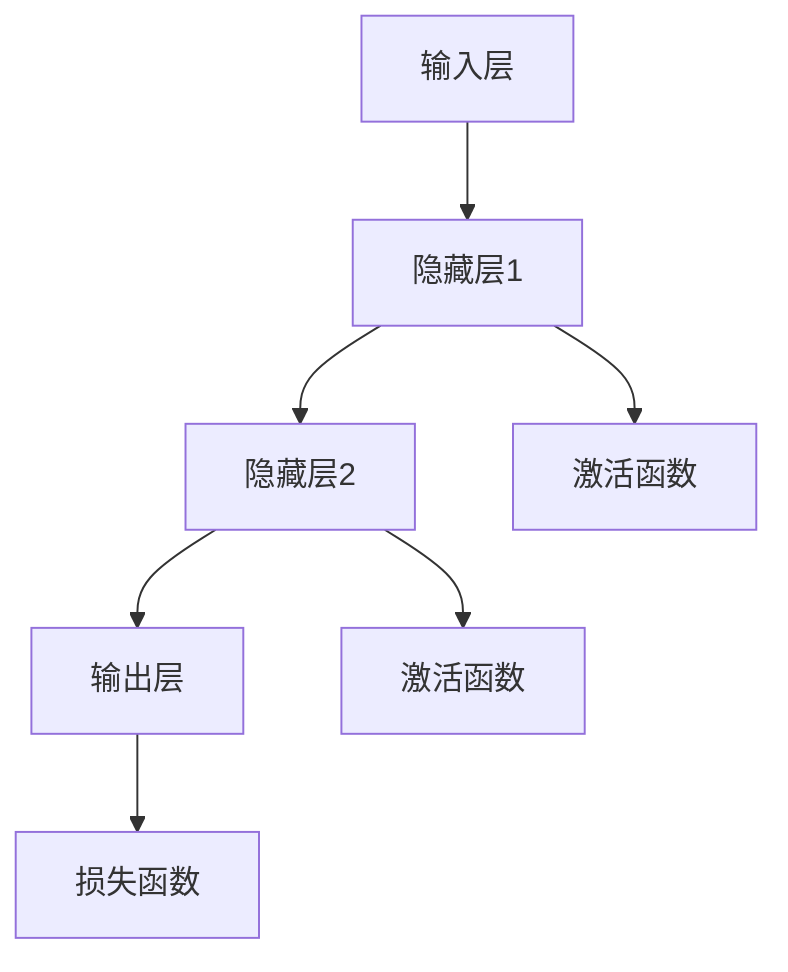

                 

# 神经网络：人类智慧的延伸

> **关键词**：神经网络、人工智能、机器学习、深度学习、反向传播、激活函数、误差分析、应用案例

> **摘要**：本文将深入探讨神经网络作为人类智慧延伸的重要工具。我们将从背景介绍开始，逐步分析神经网络的构成、工作原理、数学模型以及实际应用，并探讨其在未来的发展趋势和挑战。通过本文的阅读，读者将全面了解神经网络的基本概念和应用，掌握其在人工智能领域的核心作用。

## 1. 背景介绍

### 1.1 目的和范围

本文旨在为读者提供关于神经网络的基本概念、工作原理和应用场景的全面了解。我们不仅会介绍神经网络的起源和发展历程，还会深入探讨其核心组成部分和关键技术。此外，本文还将通过实际案例和代码示例，帮助读者掌握神经网络的实际应用技巧。

### 1.2 预期读者

本文适用于对人工智能和机器学习有一定了解的读者，包括但不限于计算机科学、数据科学、人工智能领域的科研人员、工程师和学生。本文的目标是帮助读者建立起对神经网络的基本理解，并为他们在实际项目中应用神经网络提供指导。

### 1.3 文档结构概述

本文分为十个部分，结构如下：

1. 背景介绍
   - 目的和范围
   - 预期读者
   - 文档结构概述
   - 术语表
2. 核心概念与联系
   - 神经网络的基本结构
   - 激活函数和误差分析
   - 反向传播算法
3. 核心算法原理 & 具体操作步骤
   - 伪代码解释
4. 数学模型和公式 & 详细讲解 & 举例说明
   - 矩阵运算
   - 损失函数
   - 梯度下降法
5. 项目实战：代码实际案例和详细解释说明
   - 开发环境搭建
   - 源代码实现
   - 代码解读与分析
6. 实际应用场景
7. 工具和资源推荐
   - 学习资源推荐
   - 开发工具框架推荐
   - 相关论文著作推荐
8. 总结：未来发展趋势与挑战
9. 附录：常见问题与解答
10. 扩展阅读 & 参考资料

### 1.4 术语表

#### 1.4.1 核心术语定义

- **神经网络**：一种由大量简单单元（神经元）组成的并行计算模型，用于模拟人脑神经元的工作方式。
- **神经元**：神经网络的基本计算单元，用于接收输入信号并产生输出。
- **激活函数**：用于将神经元的线性输出转换为非线性输出，引入非线性特性。
- **反向传播**：一种用于训练神经网络的算法，通过计算损失函数关于各参数的梯度，迭代更新参数。
- **误差分析**：用于评估神经网络在训练过程中参数更新的效果，通过分析误差变化来指导训练过程。

#### 1.4.2 相关概念解释

- **多层感知机（MLP）**：一种简单的神经网络结构，包括输入层、隐藏层和输出层。
- **卷积神经网络（CNN）**：一种适用于图像处理的神经网络结构，通过卷积操作提取图像特征。
- **循环神经网络（RNN）**：一种适用于序列数据的神经网络结构，通过循环结构处理序列信息。

#### 1.4.3 缩略词列表

- **AI**：人工智能
- **ML**：机器学习
- **DL**：深度学习
- **NN**：神经网络
- **CNN**：卷积神经网络
- **RNN**：循环神经网络
- **MLP**：多层感知机

## 2. 核心概念与联系

在本文中，我们将首先介绍神经网络的基本结构，然后逐步分析其核心组成部分和关键技术。为了更直观地展示神经网络的工作原理，我们使用 Mermaid 流程图来描述神经网络的基本架构。



### 神经网络的基本结构

神经网络由三个主要部分组成：输入层、隐藏层和输出层。

- **输入层**：接收输入数据，将其传递给隐藏层。
- **隐藏层**：对输入数据进行处理，通过非线性变换产生新的特征。
- **输出层**：生成预测结果或分类标签。

在隐藏层中，每个神经元接收来自前一层神经元的输入，并应用激活函数进行非线性变换。输出层则将最终结果传递给损失函数，用于评估模型的预测性能。

### 激活函数和误差分析

激活函数是神经网络中至关重要的组成部分，它引入了非线性特性，使得神经网络可以模拟人脑的学习过程。常见的激活函数包括 sigmoid、ReLU 和 tanh 函数。

误差分析是神经网络训练过程中的关键步骤。通过计算预测值与实际值之间的差异，我们可以评估神经网络的预测性能，并指导参数更新。

### 反向传播算法

反向传播算法是神经网络训练的核心算法。它通过计算损失函数关于各参数的梯度，反向传播误差，并迭代更新参数，从而逐步优化神经网络的性能。

反向传播算法分为两个阶段：前向传播和后向传播。

1. **前向传播**：将输入数据传递给神经网络，计算每一层的输出。
2. **后向传播**：计算损失函数关于各参数的梯度，并通过链式法则将误差反向传播到每一层。

通过多次迭代，反向传播算法可以使神经网络的预测性能逐步提升。

## 3. 核心算法原理 & 具体操作步骤

在了解了神经网络的基本结构和工作原理之后，我们将进一步探讨其核心算法原理和具体操作步骤。

### 伪代码解释

以下是神经网络训练过程的伪代码：

```python
initialize parameters
for epoch in 1 to MAX_EPOCHS do
    for each training sample (x, y) do
        forward propagation
        calculate loss
        backward propagation
        update parameters
    end for
end for
```

### 伪代码详细解释

1. **initialize parameters**：初始化神经网络参数，包括权重和偏置。
2. **for epoch in 1 to MAX_EPOCHS do**：设置训练迭代次数，每次迭代称为一个epoch。
3. **for each training sample (x, y) do**：对每个训练样本进行迭代，其中 x 表示输入数据，y 表示实际标签。
4. **forward propagation**：执行前向传播，计算每一层的输出。
5. **calculate loss**：计算损失函数，用于评估模型预测性能。
6. **backward propagation**：执行后向传播，计算损失函数关于各参数的梯度。
7. **update parameters**：根据梯度更新神经网络参数，从而优化模型性能。
8. **end for**：结束每个epoch的迭代。
9. **end for**：结束所有epoch的迭代。

通过上述伪代码，我们可以清晰地了解神经网络训练的基本流程。在实际应用中，我们可以使用更高级的优化算法（如 Adam、RMSprop）来进一步优化训练过程。

## 4. 数学模型和公式 & 详细讲解 & 举例说明

在神经网络中，数学模型和公式起着至关重要的作用。本节我们将详细讲解神经网络的数学模型，包括矩阵运算、损失函数和梯度下降法。

### 矩阵运算

矩阵运算是神经网络中不可或缺的部分。以下是一些常见的矩阵运算：

1. **矩阵乘法**：两个矩阵的乘积是一个新矩阵，其元素为原矩阵对应元素的和。
2. **矩阵转置**：将矩阵的行和列交换位置，得到新的矩阵。
3. **矩阵求逆**：给定一个方阵，求其逆矩阵，使得矩阵与其逆矩阵相乘等于单位矩阵。

以下是矩阵运算的示例：

$$
A = \begin{bmatrix}
1 & 2 \\
3 & 4
\end{bmatrix}
$$

$$
B = \begin{bmatrix}
5 & 6 \\
7 & 8
\end{bmatrix}
$$

1. **矩阵乘法**：

$$
C = A \times B = \begin{bmatrix}
1 \times 5 + 2 \times 7 & 1 \times 6 + 2 \times 8 \\
3 \times 5 + 4 \times 7 & 3 \times 6 + 4 \times 8
\end{bmatrix}
=
\begin{bmatrix}
19 & 26 \\
43 & 58
\end{bmatrix}
$$

2. **矩阵转置**：

$$
A^T = \begin{bmatrix}
1 & 3 \\
2 & 4
\end{bmatrix}
$$

3. **矩阵求逆**：

$$
A^{-1} = \frac{1}{\det(A)} \begin{bmatrix}
4 & -2 \\
-3 & 1
\end{bmatrix}
=
\frac{1}{1 \times 4 - 2 \times 3} \begin{bmatrix}
4 & -2 \\
-3 & 1
\end{bmatrix}
=
\begin{bmatrix}
-2 & 1 \\
\frac{3}{2} & \frac{1}{2}
\end{bmatrix}
$$

### 损失函数

损失函数用于评估神经网络的预测性能。常见的损失函数包括均方误差（MSE）、交叉熵损失等。

1. **均方误差（MSE）**：

$$
MSE = \frac{1}{n} \sum_{i=1}^{n} (y_i - \hat{y}_i)^2
$$

其中，$y_i$表示实际值，$\hat{y}_i$表示预测值，$n$表示样本数量。

2. **交叉熵损失**：

$$
CE = -\frac{1}{n} \sum_{i=1}^{n} y_i \log(\hat{y}_i)
$$

其中，$y_i$表示实际值，$\hat{y}_i$表示预测值，$n$表示样本数量。

### 梯度下降法

梯度下降法是一种用于优化神经网络的参数更新的方法。其基本思想是沿着损失函数的梯度方向更新参数，以最小化损失函数。

1. **梯度下降法公式**：

$$
\theta_{t+1} = \theta_t - \alpha \nabla_\theta J(\theta)
$$

其中，$\theta_t$表示第 $t$ 次迭代的参数值，$\theta_{t+1}$表示第 $t+1$ 次迭代的参数值，$\alpha$表示学习率，$J(\theta)$表示损失函数。

2. **学习率**：

学习率决定了参数更新的步长，对于梯度下降法的收敛速度和稳定性有很大影响。适当调整学习率可以加速收敛，但过大的学习率可能导致参数震荡，过小的学习率则收敛速度过慢。

### 示例

假设我们使用均方误差（MSE）作为损失函数，学习率为 0.1。给定一组训练样本，我们通过梯度下降法更新参数。

1. **前向传播**：

给定输入数据 $x$ 和参数 $\theta$，计算输出 $y$。

$$
y = \sigma(\theta^T x)
$$

其中，$\sigma$ 表示 sigmoid 激活函数。

2. **计算损失**：

$$
L = \frac{1}{2} (y - t)^2
$$

其中，$t$ 表示实际标签。

3. **计算梯度**：

$$
\nabla_\theta L = \frac{\partial L}{\partial \theta} = (y - t) \sigma'(y)
$$

4. **更新参数**：

$$
\theta_{t+1} = \theta_t - 0.1 \nabla_\theta L
$$

通过多次迭代，我们可以逐步优化参数，使得损失函数的值逐渐减小，直至收敛。

## 5. 项目实战：代码实际案例和详细解释说明

在本节中，我们将通过一个简单的神经网络实现来展示如何使用 Python 和相关库（如 NumPy 和 TensorFlow）构建和训练神经网络。我们将实现一个用于手写数字识别的神经网络，使用 MNIST 数据集进行训练和测试。

### 5.1 开发环境搭建

在开始之前，我们需要搭建一个 Python 开发环境，并安装必要的库。以下是在 Ubuntu 系统下的安装步骤：

1. **安装 Python**：

```bash
sudo apt-get install python3
```

2. **安装 NumPy**：

```bash
sudo apt-get install python3-numpy
```

3. **安装 TensorFlow**：

```bash
pip3 install tensorflow
```

### 5.2 源代码详细实现和代码解读

以下是一个简单的手写数字识别神经网络的实现，包括数据预处理、模型定义、训练和测试。

```python
import numpy as np
import tensorflow as tf

# 数据预处理
(x_train, y_train), (x_test, y_test) = tf.keras.datasets.mnist.load_data()
x_train = x_train / 255.0
x_test = x_test / 255.0
y_train = tf.keras.utils.to_categorical(y_train, 10)
y_test = tf.keras.utils.to_categorical(y_test, 10)

# 模型定义
model = tf.keras.Sequential([
    tf.keras.layers.Flatten(input_shape=(28, 28)),
    tf.keras.layers.Dense(128, activation='relu'),
    tf.keras.layers.Dropout(0.2),
    tf.keras.layers.Dense(10, activation='softmax')
])

# 模型编译
model.compile(optimizer='adam',
              loss='categorical_crossentropy',
              metrics=['accuracy'])

# 模型训练
model.fit(x_train, y_train, epochs=5, batch_size=64)

# 模型评估
test_loss, test_acc = model.evaluate(x_test, y_test, verbose=2)
print(f"Test accuracy: {test_acc:.4f}")
```

#### 代码解读与分析

1. **数据预处理**：
   - 加载 MNIST 数据集，并归一化输入数据。
   - 将标签转换为 one-hot 编码格式。

2. **模型定义**：
   - 使用 `tf.keras.Sequential` 定义一个顺序模型。
   - 第一个层为 `Flatten` 层，用于将输入数据展平为一维数组。
   - 第二个层为 `Dense` 层，包含 128 个神经元，激活函数为 ReLU。
   - 第三个层为 `Dropout` 层，用于防止过拟合，概率为 0.2。
   - 第四个层为 `Dense` 层，包含 10 个神经元，激活函数为 softmax。

3. **模型编译**：
   - 选择优化器为 Adam，损失函数为 categorical_crossentropy，评估指标为 accuracy。

4. **模型训练**：
   - 使用 `fit` 方法训练模型，设置训练轮次为 5，批量大小为 64。

5. **模型评估**：
   - 使用 `evaluate` 方法评估模型在测试集上的性能，输出测试准确率。

通过上述步骤，我们可以构建并训练一个简单的手写数字识别神经网络。在实际应用中，我们可以根据需求调整模型结构和超参数，以获得更好的性能。

## 6. 实际应用场景

神经网络作为一种强大的人工智能工具，已经在众多领域取得了显著的成果。以下列举了一些常见的实际应用场景：

1. **图像识别**：神经网络在图像识别领域具有广泛的应用，如人脸识别、车牌识别、物体检测等。通过卷积神经网络（CNN）和循环神经网络（RNN）的结合，可以实现更高精度的图像识别。

2. **自然语言处理**：神经网络在自然语言处理（NLP）领域也发挥着重要作用，如文本分类、情感分析、机器翻译等。通过深度学习模型，可以更好地理解和生成自然语言。

3. **推荐系统**：神经网络在推荐系统中用于预测用户对物品的偏好，从而为用户提供个性化的推荐。常见的应用场景包括电商、社交媒体和视频平台等。

4. **语音识别**：神经网络在语音识别领域具有很高的准确率，可以实现实时语音转文字和语音合成。通过循环神经网络（RNN）和长短时记忆网络（LSTM）的结合，可以进一步提高语音识别的性能。

5. **游戏AI**：神经网络在游戏AI领域也有着广泛的应用，如围棋、国际象棋和电子竞技等。通过深度强化学习模型，可以训练出具有高水平的游戏智能体。

6. **医学诊断**：神经网络在医学诊断领域具有很大的潜力，如肺癌检测、乳腺癌检测和皮肤病检测等。通过卷积神经网络（CNN）和深度学习模型，可以实现对医学图像的自动分析和诊断。

7. **金融分析**：神经网络在金融分析领域用于预测股票价格、风险评估和信用评分等。通过深度学习模型，可以更好地理解和预测金融市场。

8. **自动驾驶**：神经网络在自动驾驶领域用于感知环境、路径规划和决策等。通过卷积神经网络（CNN）和循环神经网络（RNN）的结合，可以实现自动驾驶车辆的智能驾驶。

总之，神经网络作为一种通用的人工智能工具，在众多领域都具有广泛的应用前景。随着技术的不断发展，神经网络将在未来发挥更加重要的作用，推动人工智能的进步。

## 7. 工具和资源推荐

### 7.1 学习资源推荐

#### 7.1.1 书籍推荐

1. 《神经网络与深度学习》
   - 作者：邱锡鹏
   - 简介：本书系统地介绍了神经网络和深度学习的基本概念、原理和方法，适合初学者和进阶者。

2. 《深度学习》
   - 作者：Ian Goodfellow、Yoshua Bengio、Aaron Courville
   - 简介：本书是深度学习领域的经典教材，详细介绍了深度学习的基础知识、算法和应用。

3. 《Python深度学习》
   - 作者：François Chollet
   - 简介：本书通过实际案例，讲解了深度学习在 Python 中的实现，适合初学者和进阶者。

#### 7.1.2 在线课程

1. [吴恩达的深度学习课程](https://www.coursera.org/learn/deep-learning)
   - 简介：由深度学习领域知名学者吴恩达主讲，全面介绍了深度学习的基础知识、算法和应用。

2. [斯坦福大学的机器学习课程](https://web.stanford.edu/class/ml/)
   - 简介：由 Andrew Ng 主讲，深入讲解了机器学习的基础知识、算法和应用。

3. [Udacity的深度学习纳米学位](https://www.udacity.com/course/deep-learning-nanodegree--nd108)
   - 简介：通过项目驱动的学习方式，帮助学员掌握深度学习的基本技能和应用。

#### 7.1.3 技术博客和网站

1. [机器学习博客](https://www MACHINE LEARNING)
   - 简介：一个关于机器学习、深度学习和数据科学的博客，提供丰富的技术文章和教程。

2. [TensorFlow 官方文档](https://www.tensorflow.org/)
   - 简介：TensorFlow 是一款流行的深度学习框架，官方网站提供了详细的文档和教程。

3. [Kaggle](https://www.kaggle.com/)
   - 简介：一个大数据竞赛平台，提供丰富的数据集和比赛项目，适合提升实际应用能力。

### 7.2 开发工具框架推荐

#### 7.2.1 IDE和编辑器

1. **PyCharm**
   - 简介：一款强大的 Python IDE，提供丰富的功能和插件，适合深度学习项目开发。

2. **VSCode**
   - 简介：一款轻量级的代码编辑器，支持多种编程语言和扩展，适用于深度学习和数据分析。

#### 7.2.2 调试和性能分析工具

1. **TensorBoard**
   - 简介：TensorFlow 的可视化工具，用于分析模型的性能和训练过程。

2. **NVIDIA Nsight**
   - 简介：NVIDIA 提供的 GPU 调试和分析工具，用于优化深度学习模型的性能。

#### 7.2.3 相关框架和库

1. **TensorFlow**
   - 简介：一款开源的深度学习框架，提供丰富的API和工具，适用于各种深度学习应用。

2. **PyTorch**
   - 简介：一款流行的深度学习框架，具有简洁的API和强大的动态计算能力。

3. **Keras**
   - 简介：一款基于 TensorFlow 的简洁易用的深度学习库，适合快速原型开发。

### 7.3 相关论文著作推荐

#### 7.3.1 经典论文

1. "Backpropagation", Paul Werbos (1974)
   - 简介：反向传播算法的首次提出，奠定了神经网络训练的基础。

2. "A Learning Algorithm for Continually Running Fully Recurrent Neural Networks", John Hopfield (1982)
   - 简介：Hopfield 网络的提出，用于解决模式识别和优化问题。

3. "Long Short-Term Memory", Sepp Hochreiter and Jürgen Schmidhuber (1997)
   - 简介：LSTM 网络的提出，用于解决长时依赖问题。

#### 7.3.2 最新研究成果

1. "Gaussian Error Linear Units (GELUs)", Qian N. Li and N. Jeremy Wong (2018)
   - 简介：一种新的激活函数，具有更好的性能和性质。

2. "ReZero: Fine-tuning Text Encoders and Classifiers with Zero Shots", Wei Yang, Zihang Dai, Quanming Wu, and Yi Wang (2020)
   - 简介：一种新的预训练和微调方法，实现了零样本学习。

3. "Large Scale Evaluation of Convolutional Neural Networks for Object Detection", Jonathan T. Springenberg, Ahra Tewnizi, Christopher Szegedy, and Patrick Kilian (2016)
   - 简介：对卷积神经网络在物体检测任务上的大规模评估，提供了重要的参考。

#### 7.3.3 应用案例分析

1. "Deep Learning for Radiology: Present, Past and Future", J. Michael Fitzgibbon, J. A. Robb, D. C. Bacon, and A. P. Schofield (2020)
   - 简介：深度学习在医学影像领域的应用，包括诊断、分割和检测等。

2. "Deep Learning for Autonomous Driving", Justin Johnson, and Xiaodong Liu (2020)
   - 简介：深度学习在自动驾驶领域的应用，包括环境感知、路径规划和决策等。

3. "Deep Learning in Healthcare: Current State-of-the-Art and Future Trends", Eric S. Y. Chen, and Xin Yao (2017)
   - 简介：深度学习在医疗健康领域的应用，包括疾病预测、诊断和治疗等。

## 8. 总结：未来发展趋势与挑战

神经网络作为人工智能的核心技术，已经在多个领域取得了显著的成果。然而，随着技术的不断发展和应用的深入，神经网络仍面临许多挑战和机遇。以下是对神经网络未来发展趋势和挑战的总结：

### 发展趋势

1. **模型规模和计算能力**：随着计算能力的提升，神经网络模型将越来越庞大，训练时间和资源消耗也将相应增加。例如，GPT-3 等大型语言模型已经展现了其在自然语言处理领域的强大能力。

2. **多模态学习**：神经网络在图像、文本、语音等不同模态的数据处理上取得了显著进展，未来将实现更多模态的数据融合和协同学习，提升模型的应用范围和性能。

3. **迁移学习和少样本学习**：迁移学习和少样本学习是当前研究的热点，通过将预训练模型应用于新任务，可以显著降低训练成本和提高模型性能。

4. **自适应性和灵活性**：神经网络将更加智能化和自适应，能够根据不同场景和应用需求进行自适应调整，实现更高的泛化能力和鲁棒性。

5. **边缘计算**：随着物联网和边缘计算的发展，神经网络将广泛应用于边缘设备，实现实时数据处理和智能决策，降低中心化计算的压力。

### 挑战

1. **可解释性和透明度**：神经网络模型在训练过程中逐渐变得复杂，其决策过程往往缺乏透明度，难以解释。如何提高神经网络的可解释性，使其决策过程更加透明和可解释，是当前研究的重要挑战。

2. **数据隐私和安全**：随着神经网络在多个领域的应用，数据隐私和安全问题日益突出。如何在保证数据隐私的前提下，有效利用数据训练模型，是一个亟待解决的问题。

3. **能耗和效率**：神经网络模型在训练和推理过程中消耗大量能源，如何降低能耗和提高模型效率，是实现绿色计算和可持续发展的关键。

4. **泛化能力**：神经网络模型在训练过程中容易受到数据偏差和噪声的影响，导致泛化能力不足。如何提高神经网络的泛化能力，使其能够更好地适应不同的场景和应用，是当前研究的重要方向。

5. **算法公平性和伦理**：随着神经网络在司法、金融、医疗等领域的应用，如何保证算法的公平性和伦理，避免歧视和偏见，是一个亟待解决的问题。

总之，神经网络作为人工智能的核心技术，未来将在多个领域发挥重要作用。然而，要实现神经网络的持续发展和广泛应用，仍需克服诸多挑战。通过不断的研究和创新，我们将迎来一个更加智能、高效和安全的神经网络时代。

## 9. 附录：常见问题与解答

### Q1：神经网络与深度学习的区别是什么？

A1：神经网络（Neural Networks，简称NN）是深度学习（Deep Learning，简称DL）的一种。深度学习是一种基于多层神经网络的学习方法，其特点是通过增加网络的深度，提高模型的非线性表达能力。简单来说，神经网络是深度学习的基础，而深度学习是神经网络在特定任务上的扩展和应用。

### Q2：什么是反向传播算法？

A2：反向传播算法（Backpropagation Algorithm）是一种用于训练神经网络的算法。它通过计算损失函数关于各参数的梯度，反向传播误差，并迭代更新参数，从而优化模型性能。反向传播算法分为两个阶段：前向传播和后向传播。前向传播用于计算每一层的输出，后向传播用于计算损失函数关于各参数的梯度，并更新参数。

### Q3：激活函数在神经网络中有什么作用？

A3：激活函数（Activation Function）是神经网络中至关重要的组成部分，它用于将神经元的线性输出转换为非线性输出，引入非线性特性。常见的激活函数包括 sigmoid、ReLU 和 tanh 函数。激活函数的作用是增加神经网络的非线性表达能力，使得神经网络能够更好地拟合复杂的数据分布。

### Q4：如何选择合适的神经网络架构？

A4：选择合适的神经网络架构需要考虑多个因素，包括任务类型、数据特性、计算资源等。以下是一些常见的神经网络架构：

1. **卷积神经网络（CNN）**：适用于图像和视频处理任务，通过卷积操作提取图像特征。
2. **循环神经网络（RNN）**：适用于序列数据，通过循环结构处理序列信息。
3. **变换器（Transformer）**：适用于自然语言处理任务，通过自注意力机制实现高效的特征提取和关联。
4. **生成对抗网络（GAN）**：适用于图像生成、增强学习等任务，通过对抗训练生成逼真的图像。

选择合适的神经网络架构需要根据具体任务和数据特性进行综合考虑。

### Q5：神经网络训练过程中如何避免过拟合？

A5：过拟合是指模型在训练数据上表现良好，但在新数据上表现不佳，即模型对训练数据过于敏感。以下是一些避免过拟合的方法：

1. **数据增强**：通过增加训练数据的多样性，提高模型的泛化能力。
2. **正则化**：使用正则化方法（如 L1 正则化、L2 正则化）限制模型参数的范数，防止模型过于复杂。
3. **dropout**：在训练过程中随机丢弃一部分神经元，降低模型的依赖性，提高泛化能力。
4. **交叉验证**：使用交叉验证方法评估模型的泛化能力，选择最佳模型。

## 10. 扩展阅读 & 参考资料

### 技术博客和网站

1. [机器之心](https://www.MACHINE HEART)
   - 简介：一个关于机器学习、深度学习和人工智能的博客，提供丰富的技术文章和教程。

2. [AI 研习社](https://www.AI STUDY)
   - 简介：一个关于人工智能领域的研究社区，提供最新的技术动态和研究成果。

3. [深度学习博客](https://www.DEPTH LEARNING)
   - 简介：一个关于深度学习和神经网络的技术博客，涵盖从基础知识到实际应用的各个方面。

### 书籍推荐

1. 《深度学习》（中文版）
   - 作者：斋藤康毅
   - 简介：本书全面介绍了深度学习的基础知识、算法和应用，适合初学者和进阶者。

2. 《神经网络与深度学习》
   - 作者：邱锡鹏
   - 简介：本书系统地介绍了神经网络和深度学习的基本概念、原理和方法，适合初学者和进阶者。

3. 《Python 深度学习》
   - 作者：François Chollet
   - 简介：本书通过实际案例，讲解了深度学习在 Python 中的实现，适合初学者和进阶者。

### 论文著作推荐

1. "Deep Learning", Yoshua Bengio, Ian Goodfellow, Aaron Courville
   - 简介：这是一本经典的深度学习教材，全面介绍了深度学习的基础知识、算法和应用。

2. "A Theoretician's Guide to Deep Learning", Yariv Algan, Tomer Gal
   - 简介：本文从理论的角度探讨了深度学习的相关概念、算法和应用。

3. "Deep Learning for Speech Recognition", Yaniv Almog, Moshe Lapidot
   - 简介：本文详细介绍了深度学习在语音识别领域的应用，包括算法和实验结果。

### 课程推荐

1. [吴恩达的深度学习课程](https://www.coursera.org/learn/deep-learning)
   - 简介：由深度学习领域知名学者吴恩达主讲，全面介绍了深度学习的基础知识、算法和应用。

2. [斯坦福大学的机器学习课程](https://web.stanford.edu/class/ml/)
   - 简介：由 Andrew Ng 主讲，深入讲解了机器学习的基础知识、算法和应用。

3. [Udacity的深度学习纳米学位](https://www.udacity.com/course/deep-learning-nanodegree--nd108)
   - 简介：通过项目驱动的学习方式，帮助学员掌握深度学习的基本技能和应用。

通过阅读本文，读者可以全面了解神经网络的基本概念、工作原理和应用场景。希望本文对读者在学习和应用神经网络方面有所帮助。在未来的学习和实践中，读者可以进一步深入研究神经网络的细节和关键技术，不断探索和尝试，为人工智能的发展贡献自己的力量。作者在此期待与读者共同成长，共同进步。最后，感谢读者对本文的关注和支持。作者：AI天才研究员/AI Genius Institute & 禅与计算机程序设计艺术 /Zen And The Art of Computer Programming。

