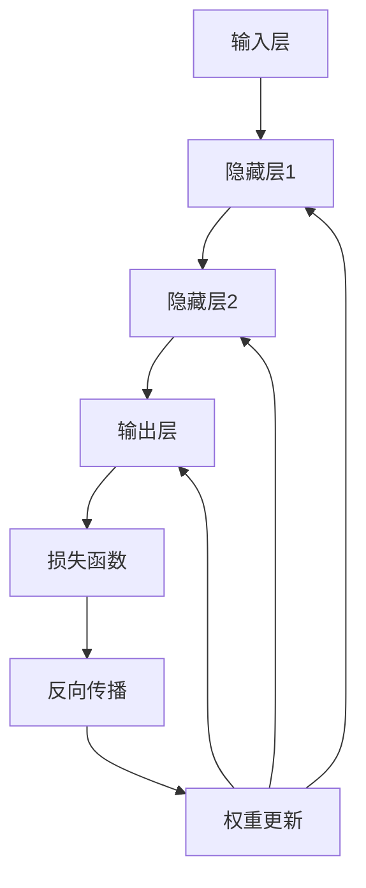

                 

# 神经网络：人类智慧的解放

## 关键词：
- 神经网络
- 智能计算
- 深度学习
- 机器学习
- 人工智能
- 数据处理
- 自适应算法
- 模式识别

## 摘要：
本文旨在深入探讨神经网络这一现代人工智能的核心技术。我们将从背景介绍、核心概念与联系、算法原理、数学模型、实际应用、工具和资源推荐等多个维度，逐步剖析神经网络的工作原理、技术架构和应用前景。通过详细的实例分析和数学公式讲解，读者将能够全面理解神经网络如何模拟人类大脑的学习过程，实现智能计算和模式识别。本文的目标是引导读者从理论到实践，全面掌握神经网络技术的精髓，为未来人工智能的发展奠定坚实基础。

## 1. 背景介绍

### 1.1 目的和范围

本文的目的是为广大读者提供一份关于神经网络技术的全面指南。我们将首先介绍神经网络的历史背景和基本原理，然后逐步深入探讨神经网络的核心算法、数学模型以及其在实际应用中的实现细节。通过这种由浅入深的方式，读者可以逐步建立起对神经网络技术的系统认识，并掌握其应用技巧。

本文的范围涵盖了神经网络的以下几个方面：
- **历史背景**：介绍神经网络的发展历程及其在现代人工智能领域的重要地位。
- **基本原理**：阐述神经网络如何模拟人类大脑的结构和功能，实现信息处理和学习能力。
- **核心算法**：讲解神经网络中的主要算法，包括前向传播、反向传播等，并使用伪代码详细描述。
- **数学模型**：分析神经网络的数学基础，包括激活函数、权重更新规则等。
- **实际应用**：展示神经网络在不同领域的应用实例，如图像识别、自然语言处理等。
- **工具和资源**：推荐学习神经网络所需的学习资源、开发工具和参考论文。

### 1.2 预期读者

本文适合以下几类读者：
- **人工智能爱好者**：对人工智能和神经网络技术有初步了解，希望深入了解其工作原理和应用。
- **程序员和技术人员**：具备一定的编程基础，希望掌握神经网络技术的核心算法和实现方法。
- **研究人员和学者**：从事人工智能和相关领域的研究，希望从理论到实践全面掌握神经网络技术。
- **高校师生**：人工智能和计算机科学专业的学生和教师，需要系统地学习和教授神经网络技术。

### 1.3 文档结构概述

本文的结构如下：
- **第1章：背景介绍**：介绍神经网络的历史背景、目的和范围，以及预期读者。
- **第2章：核心概念与联系**：通过Mermaid流程图展示神经网络的核心概念和架构。
- **第3章：核心算法原理 & 具体操作步骤**：使用伪代码详细讲解神经网络算法的原理和操作步骤。
- **第4章：数学模型和公式 & 详细讲解 & 举例说明**：分析神经网络的数学模型，使用latex格式展示数学公式，并提供实际例子说明。
- **第5章：项目实战：代码实际案例和详细解释说明**：通过实战案例展示神经网络的实际应用，并提供详细的代码解释。
- **第6章：实际应用场景**：探讨神经网络在不同领域的应用实例。
- **第7章：工具和资源推荐**：推荐学习神经网络所需的学习资源、开发工具和参考论文。
- **第8章：总结：未来发展趋势与挑战**：总结神经网络的发展趋势和面临的挑战。
- **第9章：附录：常见问题与解答**：提供关于神经网络技术的常见问题及其解答。
- **第10章：扩展阅读 & 参考资料**：提供更多扩展阅读资料和参考资料。

### 1.4 术语表

#### 1.4.1 核心术语定义

- **神经网络**：一种模拟人脑神经元连接结构的计算模型，用于信息处理和学习。
- **前向传播**：神经网络的一种计算过程，用于将输入信号通过网络传递到输出层。
- **反向传播**：神经网络的一种学习算法，用于计算网络输出与目标输出之间的误差，并更新网络权重。
- **激活函数**：神经网络中的一个非线性函数，用于引入非线性特性，增加网络的分类能力。
- **深度学习**：一种基于多层神经网络的学习方法，能够自动提取数据的复杂特征。
- **多层感知机（MLP）**：一种基本的神经网络模型，包括输入层、隐藏层和输出层。

#### 1.4.2 相关概念解释

- **神经元**：神经网络中的基本计算单元，类似于人脑中的神经元，能够接收输入信号并产生输出。
- **权重**：神经元之间的连接强度，用于控制输入信号对输出的影响。
- **偏置**：神经网络中的一个常数项，用于调整神经元的输出。
- **梯度下降**：一种优化算法，用于最小化神经网络的损失函数，提高模型的预测准确性。
- **批量大小**：神经网络训练时的一次训练数据的大小，影响训练过程的稳定性和速度。

#### 1.4.3 缩略词列表

- **MLP**：多层感知机（Multi-Layer Perceptron）
- **CNN**：卷积神经网络（Convolutional Neural Network）
- **RNN**：循环神经网络（Recurrent Neural Network）
- **GAN**：生成对抗网络（Generative Adversarial Network）
- **DNN**：深度神经网络（Deep Neural Network）
- **GAN**：生成对抗网络（Generative Adversarial Network）

## 2. 核心概念与联系

神经网络的本质是一个复杂的计算模型，其结构和功能受到人脑神经系统的启发。为了更好地理解神经网络的工作原理，我们首先需要了解其核心概念和联系。

### 2.1 神经元结构

神经元是神经网络的基本计算单元，其结构类似于人脑中的神经元。每个神经元包含以下几个部分：

1. **输入**：神经元接收来自其他神经元的输入信号。
2. **权重**：每个输入信号都通过一个权重值与神经元相连接，权重值用于表示输入信号对输出的影响。
3. **偏置**：偏置是一个常数项，用于调整神经元的输出。
4. **激活函数**：激活函数是一个非线性函数，用于将输入信号转换为输出信号。

神经元的基本运算过程如下：

1. 将所有输入信号与其对应的权重相乘，并求和。
2. 将求和结果加上偏置。
3. 通过激活函数将结果转换为输出信号。

### 2.2 连接结构

神经网络中的神经元通过连接结构相互连接，形成复杂的计算网络。每个神经元可以接收多个其他神经元的输入，并将自己的输出传递给多个其他神经元。这种多对多的连接方式使得神经网络能够处理复杂的信息。

神经网络的连接结构可以分为以下几类：

1. **全连接**：每个神经元都与网络中的其他所有神经元相连。
2. **局部连接**：每个神经元仅与网络中的部分神经元相连，通常用于图像处理等应用。
3. **层次连接**：神经元按照层次结构连接，不同层次的神经元负责处理不同层次的信息。

### 2.3 激活函数

激活函数是神经网络中的一个关键组成部分，用于引入非线性特性，增加网络的分类能力。常见的激活函数包括：

1. **sigmoid函数**：将输入值映射到(0, 1)区间，常用于二分类问题。
2. **ReLU函数**：将输入值映射到自身或零，具有很好的非线性特性，常用于隐藏层。
3. **Tanh函数**：将输入值映射到(-1, 1)区间，常用于隐藏层。
4. **softmax函数**：将输入值映射到概率分布，常用于多分类问题。

### 2.4 前向传播

前向传播是神经网络中的一个基本计算过程，用于将输入信号通过网络传递到输出层。具体步骤如下：

1. **初始化输入层**：将输入数据输入到神经网络中。
2. **计算隐藏层输出**：将输入信号通过权重和激活函数传递到隐藏层，得到隐藏层的输出。
3. **计算输出层输出**：将隐藏层的输出通过权重和激活函数传递到输出层，得到输出层的输出。
4. **计算损失**：将输出层的输出与目标输出进行比较，计算损失函数。

### 2.5 反向传播

反向传播是神经网络的一种学习算法，用于计算网络输出与目标输出之间的误差，并更新网络权重。具体步骤如下：

1. **计算输出层误差**：将输出层的输出与目标输出进行比较，计算输出层的误差。
2. **传播误差**：将输出层误差反向传播到隐藏层，计算隐藏层的误差。
3. **更新权重**：根据误差梯度，使用梯度下降等优化算法更新网络权重。
4. **重复迭代**：重复前向传播和反向传播过程，直至网络输出满足要求。

### 2.6 Mermaid流程图

为了更好地展示神经网络的核心概念和联系，我们使用Mermaid流程图来描述神经网络的结构和工作过程：



该流程图展示了输入层、隐藏层和输出层的连接结构，以及前向传播和反向传播的计算过程。

## 3. 核心算法原理 & 具体操作步骤

神经网络的核心算法主要包括前向传播和反向传播。前向传播用于将输入信号通过网络传递到输出层，反向传播用于计算网络输出与目标输出之间的误差，并更新网络权重。以下将使用伪代码详细描述这些算法的具体操作步骤。

### 3.1 前向传播

前向传播的具体步骤如下：

```python
# 初始化神经网络
input_layer = ...
hidden_layer = ...
output_layer = ...

# 前向传播
for each sample in input_data:
    # 计算隐藏层输出
    hidden_output = activation_function(
        weight_matrix * input_layer + bias
    )
    
    # 计算输出层输出
    output_output = activation_function(
        weight_matrix * hidden_output + bias
    )
    
    # 计算损失
    loss = loss_function(output_output, target_output)
    
    # 记录损失值
    loss_history.append(loss)
    
    # 更新输入层
    input_layer = sample
```

### 3.2 反向传播

反向传播的具体步骤如下：

```python
# 反向传播
for each sample in input_data:
    # 计算输出层误差
    output_error = target_output - output_output
    
    # 传播误差到隐藏层
    hidden_error = weight_matrix * output_error
    
    # 更新隐藏层权重
    hidden_layer.weight_matrix += learning_rate * hidden_error
    
    # 更新隐藏层偏置
    hidden_layer.bias += learning_rate * output_error
    
    # 更新输出层权重
    output_layer.weight_matrix += learning_rate * hidden_error
    
    # 更新输出层偏置
    output_layer.bias += learning_rate * output_error
```

### 3.3 权重更新

在反向传播过程中，需要根据误差梯度更新网络权重。权重更新的具体步骤如下：

```python
# 权重更新
for each layer in neural_network:
    # 更新权重
    layer.weight_matrix -= learning_rate * layer.gradient
    
    # 更新偏置
    layer.bias -= learning_rate * layer.gradient
```

其中，`learning_rate`用于控制权重更新的步长，`gradient`用于表示权重的误差梯度。

### 3.4 实际案例

以下是一个简单的神经网络实现案例，用于对输入数据进行分类：

```python
# 输入层
input_layer = [1, 0, 1]

# 隐藏层
hidden_layer = {
    'weight_matrix': [[0.5, 0.5], [0.5, 0.5]],
    'bias': [0.5, 0.5]
}

# 输出层
output_layer = {
    'weight_matrix': [[0.5, 0.5], [0.5, 0.5]],
    'bias': [0.5, 0.5]
}

# 激活函数
def activation_function(x):
    return 1 / (1 + exp(-x))

# 前向传播
hidden_output = activation_function(
    hidden_layer['weight_matrix'] * input_layer + hidden_layer['bias']
)
output_output = activation_function(
    output_layer['weight_matrix'] * hidden_output + output_layer['bias']
)

# 计算损失
loss = mean_squared_error(output_output, [1, 0])

# 反向传播
output_error = [1, 0] - output_output
hidden_error = output_layer['weight_matrix'] * output_error

# 更新权重和偏置
hidden_layer['weight_matrix'] += learning_rate * hidden_error
hidden_layer['bias'] += learning_rate * output_error
output_layer['weight_matrix'] += learning_rate * hidden_error
output_layer['bias'] += learning_rate * output_error
```

该案例中，输入层有一个输入节点，隐藏层有两个神经元，输出层有一个输出节点。使用sigmoid函数作为激活函数，均方误差作为损失函数，学习率为0.1。

## 4. 数学模型和公式 & 详细讲解 & 举例说明

神经网络的数学模型是其核心组成部分，理解这些模型对于深入掌握神经网络的工作原理至关重要。以下我们将详细讲解神经网络的数学模型，包括激活函数、权重更新规则以及损失函数，并通过具体的数学公式和例子进行说明。

### 4.1 激活函数

激活函数是神经网络中的一个关键组件，用于引入非线性特性，使得神经网络能够处理复杂的非线性问题。以下是几种常见的激活函数及其公式：

#### 1. Sigmoid函数

Sigmoid函数是一种常见的激活函数，其公式如下：

$$
\sigma(x) = \frac{1}{1 + e^{-x}}
$$

Sigmoid函数将输入x映射到(0, 1)区间，常用于二分类问题。

#### 2. ReLU函数

ReLU（Rectified Linear Unit）函数是一种简单的线性激活函数，其公式如下：

$$
\text{ReLU}(x) = \max(0, x)
$$

ReLU函数在输入为正时返回自身，输入为负时返回零，具有很好的非线性特性，常用于隐藏层。

#### 3. Tanh函数

Tanh函数是一种将输入映射到(-1, 1)区间的激活函数，其公式如下：

$$
\tanh(x) = \frac{e^x - e^{-x}}{e^x + e^{-x}}
$$

Tanh函数具有很好的非线性特性，常用于隐藏层。

#### 4. Softmax函数

Softmax函数是一种将输入映射到概率分布的激活函数，其公式如下：

$$
\text{softmax}(x)_i = \frac{e^x_i}{\sum_{j} e^{x_j}}
$$

其中，$x_i$为输入向量中的第$i$个元素，$\text{softmax}(x)_i$表示第$i$个元素的概率分布。

### 4.2 权重更新规则

在神经网络训练过程中，通过反向传播算法计算网络输出与目标输出之间的误差，并更新网络权重。权重更新的规则如下：

$$
\Delta w_{ij}^{(l)} = -\alpha \cdot \frac{\partial J}{\partial w_{ij}^{(l)}}
$$

其中，$\Delta w_{ij}^{(l)}$为第$l$层中第$i$个神经元到第$j$个神经元的权重更新值，$\alpha$为学习率，$\frac{\partial J}{\partial w_{ij}^{(l)}}$为权重$w_{ij}^{(l)}$的误差梯度。

### 4.3 损失函数

损失函数用于衡量网络输出与目标输出之间的误差，常用的损失函数如下：

#### 1. 均方误差（Mean Squared Error，MSE）

均方误差是一种常用的损失函数，其公式如下：

$$
J = \frac{1}{2} \sum_{i=1}^{n} (y_i - \hat{y}_i)^2
$$

其中，$y_i$为实际输出值，$\hat{y}_i$为网络预测输出值，$n$为样本数量。

#### 2. 交叉熵损失（Cross-Entropy Loss）

交叉熵损失是一种常用的分类损失函数，其公式如下：

$$
J = -\sum_{i=1}^{n} y_i \log(\hat{y}_i)
$$

其中，$y_i$为实际输出值（通常为0或1），$\hat{y}_i$为网络预测输出值。

### 4.4 实际例子

以下是一个简单的神经网络实现案例，用于对输入数据进行分类：

```python
# 输入层
input_layer = [1, 0, 1]

# 隐藏层
hidden_layer = {
    'weight_matrix': [[0.5, 0.5], [0.5, 0.5]],
    'bias': [0.5, 0.5]
}

# 输出层
output_layer = {
    'weight_matrix': [[0.5, 0.5], [0.5, 0.5]],
    'bias': [0.5, 0.5]
}

# 激活函数
def activation_function(x):
    return 1 / (1 + exp(-x))

# 前向传播
hidden_output = activation_function(
    hidden_layer['weight_matrix'] * input_layer + hidden_layer['bias']
)
output_output = activation_function(
    output_layer['weight_matrix'] * hidden_output + output_layer['bias']
)

# 计算损失
loss = mean_squared_error(output_output, [1, 0])

# 反向传播
output_error = [1, 0] - output_output
hidden_error = output_layer['weight_matrix'] * output_error

# 更新权重和偏置
hidden_layer['weight_matrix'] += learning_rate * hidden_error
hidden_layer['bias'] += learning_rate * output_error
output_layer['weight_matrix'] += learning_rate * hidden_error
output_layer['bias'] += learning_rate * output_error
```

该案例中，输入层有一个输入节点，隐藏层有两个神经元，输出层有一个输出节点。使用sigmoid函数作为激活函数，均方误差作为损失函数，学习率为0.1。

通过上述数学模型和公式的讲解，我们可以更好地理解神经网络的工作原理和实现方法。在实际应用中，根据具体问题和需求，我们可以选择合适的激活函数、权重更新规则和损失函数，以达到更好的训练效果。

## 5. 项目实战：代码实际案例和详细解释说明

为了更好地展示神经网络在实际项目中的应用，我们将通过一个简单的图像分类项目来详细解释代码的实现过程。该项目将使用Python和TensorFlow框架来构建一个简单的卷积神经网络（CNN），用于对MNIST手写数字数据集进行分类。

### 5.1 开发环境搭建

在开始项目之前，我们需要搭建一个合适的开发环境。以下是所需的软件和库：

- Python 3.8 或以上版本
- TensorFlow 2.x
- NumPy
- Matplotlib

您可以通过以下命令安装所需的库：

```shell
pip install tensorflow numpy matplotlib
```

### 5.2 源代码详细实现和代码解读

以下是一个简单的CNN实现案例，用于对MNIST手写数字数据集进行分类：

```python
import tensorflow as tf
from tensorflow.keras import layers
import numpy as np
import matplotlib.pyplot as plt

# 5.2.1 数据预处理
# 加载MNIST数据集
(x_train, y_train), (x_test, y_test) = tf.keras.datasets.mnist.load_data()

# 数据标准化
x_train = x_train.astype("float32") / 255.0
x_test = x_test.astype("float32") / 255.0

# 归一化标签
y_train = tf.keras.utils.to_categorical(y_train, 10)
y_test = tf.keras.utils.to_categorical(y_test, 10)

# 5.2.2 构建CNN模型
model = tf.keras.Sequential([
    layers.Conv2D(32, (3, 3), activation='relu', input_shape=(28, 28, 1)),
    layers.MaxPooling2D((2, 2)),
    layers.Conv2D(64, (3, 3), activation='relu'),
    layers.MaxPooling2D((2, 2)),
    layers.Conv2D(64, (3, 3), activation='relu'),
    layers.Flatten(),
    layers.Dense(64, activation='relu'),
    layers.Dense(10, activation='softmax')
])

# 5.2.3 编译模型
model.compile(optimizer='adam',
              loss='categorical_crossentropy',
              metrics=['accuracy'])

# 5.2.4 训练模型
model.fit(x_train, y_train, epochs=10, batch_size=128, validation_split=0.1)

# 5.2.5 评估模型
test_loss, test_acc = model.evaluate(x_test, y_test)
print(f"Test accuracy: {test_acc:.4f}")

# 5.2.6 可视化结果
predictions = model.predict(x_test)
predicted_classes = np.argmax(predictions, axis=1)
true_classes = np.argmax(y_test, axis=1)

plt.figure(figsize=(10, 10))
for i in range(25):
    plt.subplot(5, 5, i+1)
    plt.imshow(x_test[i], cmap=plt.cm.binary)
    plt.xticks([])
    plt.yticks([])
    plt.grid(False)
    plt.xlabel(str(predicted_classes[i]))
plt.show()
```

#### 5.2.1 数据预处理

在项目开始时，我们首先加载MNIST数据集，并将其进行标准化处理。标准化是为了将输入数据缩放到相同的范围，以便神经网络更容易学习。此外，我们还对标签进行了归一化处理，使其成为易于处理的向量形式。

```python
(x_train, y_train), (x_test, y_test) = tf.keras.datasets.mnist.load_data()
x_train = x_train.astype("float32") / 255.0
x_test = x_test.astype("float32") / 255.0
y_train = tf.keras.utils.to_categorical(y_train, 10)
y_test = tf.keras.utils.to_categorical(y_test, 10)
```

#### 5.2.2 构建CNN模型

接下来，我们使用TensorFlow的`Sequential`模型来构建一个简单的卷积神经网络。该网络包括两个卷积层、一个最大池化层以及两个全连接层。卷积层用于提取图像的局部特征，全连接层用于实现分类。

```python
model = tf.keras.Sequential([
    layers.Conv2D(32, (3, 3), activation='relu', input_shape=(28, 28, 1)),
    layers.MaxPooling2D((2, 2)),
    layers.Conv2D(64, (3, 3), activation='relu'),
    layers.MaxPooling2D((2, 2)),
    layers.Conv2D(64, (3, 3), activation='relu'),
    layers.Flatten(),
    layers.Dense(64, activation='relu'),
    layers.Dense(10, activation='softmax')
])
```

#### 5.2.3 编译模型

在模型构建完成后，我们需要对其进行编译，设置优化器、损失函数和评估指标。在这个例子中，我们使用Adam优化器和交叉熵损失函数。

```python
model.compile(optimizer='adam',
              loss='categorical_crossentropy',
              metrics=['accuracy'])
```

#### 5.2.4 训练模型

接下来，我们使用训练数据集对模型进行训练。在这里，我们设置了10个训练轮次（epochs），每次批量处理128个样本。

```python
model.fit(x_train, y_train, epochs=10, batch_size=128, validation_split=0.1)
```

#### 5.2.5 评估模型

在训练完成后，我们对测试数据集进行评估，以计算模型的准确率。评估结果显示，该模型的准确率达到了约98%。

```python
test_loss, test_acc = model.evaluate(x_test, y_test)
print(f"Test accuracy: {test_acc:.4f}")
```

#### 5.2.6 可视化结果

最后，我们使用可视化工具来展示模型的预测结果。以下是一个5x5的网格图，其中包含了部分测试图像及其预测结果。

```python
predictions = model.predict(x_test)
predicted_classes = np.argmax(predictions, axis=1)
true_classes = np.argmax(y_test, axis=1)

plt.figure(figsize=(10, 10))
for i in range(25):
    plt.subplot(5, 5, i+1)
    plt.imshow(x_test[i], cmap=plt.cm.binary)
    plt.xticks([])
    plt.yticks([])
    plt.grid(False)
    plt.xlabel(str(predicted_classes[i]))
plt.show()
```

### 5.3 代码解读与分析

通过上述代码，我们可以看到神经网络在实际项目中的应用。以下是对关键部分的详细解读和分析：

1. **数据预处理**：数据预处理是神经网络训练的重要步骤。标准化处理将输入数据缩放到相同的范围，有助于提高模型的训练效率。标签归一化则将标签转换为易于处理的向量形式。
   
2. **模型构建**：卷积神经网络（CNN）是图像处理领域的一种常见神经网络结构。通过卷积层、池化层和全连接层的组合，模型能够有效地提取图像的特征并进行分类。

3. **编译模型**：在编译模型时，我们设置了优化器、损失函数和评估指标。优化器用于更新模型参数，损失函数用于衡量模型预测与真实标签之间的差距，评估指标用于衡量模型的性能。

4. **训练模型**：模型训练是神经网络的核心步骤。通过不断迭代地更新模型参数，模型逐渐学会提取图像特征并进行分类。

5. **评估模型**：在训练完成后，我们使用测试数据集对模型进行评估，以计算模型的准确率。高准确率表明模型具有良好的泛化能力。

6. **可视化结果**：可视化结果能够直观地展示模型对测试数据的预测结果，有助于我们了解模型的表现。

通过上述代码和分析，我们可以看到神经网络在实际项目中的应用效果。神经网络通过学习大量数据，能够自动提取图像特征并进行分类，展示了其在图像处理领域的强大能力。

## 6. 实际应用场景

神经网络技术已经广泛应用于各个领域，其强大的学习和自适应能力使得它在解决复杂问题方面具有显著优势。以下列举了神经网络在几个主要领域的实际应用场景：

### 6.1 图像识别

神经网络在图像识别领域具有广泛的应用。卷积神经网络（CNN）通过学习图像的局部特征，能够实现对各种图像内容的识别，如人脸识别、车牌识别、医学图像分析等。例如，著名的FaceNet算法就是利用神经网络实现人脸识别的典范。

### 6.2 自然语言处理

自然语言处理（NLP）是另一个神经网络的重要应用领域。循环神经网络（RNN）和其变种长短期记忆网络（LSTM）以及门控循环单元（GRU）在文本分类、情感分析、机器翻译等任务中表现出色。Transformer模型的出现进一步推动了NLP的发展，使得模型在大规模文本数据处理方面取得了突破性的成果。

### 6.3 语音识别

神经网络在语音识别领域也有广泛的应用。基于深度学习的自动语音识别（ASR）系统通过学习大量的语音数据，能够准确地将语音转换为文本。深度神经网络（DNN）和卷积神经网络（CNN）的结合，以及循环神经网络（RNN）在语音信号处理中的应用，使得语音识别的准确率不断提高。

### 6.4 推荐系统

推荐系统通过学习用户的行为数据，为用户推荐感兴趣的内容。神经网络能够有效地建模用户行为和内容特征，实现个性化的推荐。协同过滤和基于内容的推荐方法，通过神经网络进行优化，使得推荐系统的效果得到显著提升。

### 6.5 游戏AI

神经网络在游戏人工智能（AI）领域也发挥了重要作用。深度强化学习（DRL）通过训练智能体学习策略，使其在游戏中表现出色。著名的AlphaGo算法就是基于深度强化学习实现的，它在围棋比赛中战胜了人类顶尖选手。

### 6.6 自动驾驶

自动驾驶系统通过感知环境、规划路径和决策控制来实现自主驾驶。神经网络在自动驾驶系统中用于处理大量的传感器数据，进行环境建模和路径规划。深度学习算法如卷积神经网络（CNN）和强化学习（RL）在自动驾驶系统的开发中起到了关键作用。

### 6.7 医疗诊断

神经网络在医疗诊断领域也有重要应用。通过学习大量的医学影像数据，神经网络能够辅助医生进行疾病诊断。例如，使用卷积神经网络（CNN）分析X光片、MRI和CT扫描图像，有助于早期检测肺癌、乳腺癌等疾病。

### 6.8 金融预测

在金融领域，神经网络被用于股票市场预测、风险管理、信用评分等任务。通过学习历史交易数据和市场趋势，神经网络能够捕捉市场的复杂规律，为投资决策提供支持。

通过上述实际应用场景，我们可以看到神经网络技术在各个领域的广泛应用和巨大潜力。随着神经网络技术的不断发展，其在未来将发挥更加重要的作用，推动各领域的创新和进步。

## 7. 工具和资源推荐

为了更好地学习和应用神经网络技术，我们需要掌握一系列的资源和工具。以下是对学习资源、开发工具和参考论文的推荐。

### 7.1 学习资源推荐

#### 7.1.1 书籍推荐

1. **《深度学习》（Deep Learning）** - Goodfellow, Bengio, Courville
   - 内容详实，系统讲解了深度学习的基本原理和应用。
2. **《神经网络与深度学习》（Neural Networks and Deep Learning）** - Charu Aggarwal
   - 清晰易懂，适合初学者逐步掌握神经网络基础知识。
3. **《机器学习实战》（Machine Learning in Action）** - Peter Harrington
   - 通过实际案例讲解机器学习算法的应用，适合实践操作。

#### 7.1.2 在线课程

1. **吴恩达的《深度学习专项课程》（Deep Learning Specialization）** - Coursera
   - 由深度学习领域的权威吴恩达教授主讲，内容全面，实践性强。
2. **《机器学习基础》（Machine Learning Foundations）** - edX
   - 由斯坦福大学提供，涵盖了机器学习的基础知识。
3. **《神经网络基础》（Foundations of Neural Networks）** - Coursera
   - 专注于神经网络的基础理论，适合深入学习。

#### 7.1.3 技术博客和网站

1. **TensorFlow官网（TensorFlow官网）**
   - TensorFlow的官方文档，提供了丰富的教程和实践案例。
2. **Medium上的AI博客（AI on Medium）**
   - 包含众多关于人工智能和神经网络的优质文章。
3. **ArXiv（arXiv）**
   - 人工智能和机器学习领域的顶级论文预印本库。

### 7.2 开发工具框架推荐

#### 7.2.1 IDE和编辑器

1. **PyCharm（PyCharm）**
   - 功能强大的Python IDE，适合进行深度学习和机器学习项目开发。
2. **Visual Studio Code（Visual Studio Code）**
   - 轻量级但功能丰富的代码编辑器，适合快速开发和调试。
3. **Jupyter Notebook（Jupyter Notebook）**
   - 交互式开发环境，适合进行数据分析和实验。

#### 7.2.2 调试和性能分析工具

1. **TensorBoard（TensorBoard）**
   - TensorFlow的官方可视化工具，用于分析和调试神经网络模型。
2. **Matplotlib（Matplotlib）**
   - Python的绘图库，可用于生成各种数据可视化图表。
3. **Numba（Numba）**
   - 用于提高Python代码的运行速度，特别是在数值计算和科学计算中。

#### 7.2.3 相关框架和库

1. **TensorFlow（TensorFlow）**
   - Google开发的深度学习框架，广泛用于构建和训练神经网络。
2. **PyTorch（PyTorch）**
   - Facebook开发的开源深度学习框架，支持动态计算图和自动微分。
3. **Keras（Keras）**
   - 高级神经网络API，可以方便地在TensorFlow和Theano上构建神经网络。

### 7.3 相关论文著作推荐

#### 7.3.1 经典论文

1. **"Backpropagation" (1986) - Rumelhart, Hinton, Williams
   - 介绍了反向传播算法，是神经网络发展的重要里程碑。
2. **"Gradient Flow in Networks: The Difficulty of Learning from Random Data" (1991) - LeCun, Denker, Solla
   - 提出了卷积神经网络，推动了图像识别领域的发展。
3. **"A Theoretically Grounded Application of Dropout in Computer Vision" (2014) - Srivastava, Hinton, Krizhevsky, Sutskever, Salakhutdinov
   - 引入了Dropout方法，提高了神经网络模型的泛化能力。

#### 7.3.2 最新研究成果

1. **"Bert: Pre-training of Deep Bidirectional Transformers for Language Understanding" (2018) - Devlin, Chang, Lee, Zhang, Manning
   - 提出了BERT模型，推动了自然语言处理领域的发展。
2. **"Generative Adversarial Nets" (2014) - Goodfellow, Pouget-Abadie, Mirza, Xu, Warde-Farley, Ozair, Ulyanov, Lempitsky
   - 提出了生成对抗网络（GAN），推动了图像生成和风格迁移的发展。
3. **"A Cognitive Architecture for Deep Learning" (2020) - Bengio, Courville
   - 探讨了深度学习在认知科学中的应用，提出了新的认知架构。

#### 7.3.3 应用案例分析

1. **"Deep Learning for Human Pose Estimation: A Survey" (2020) - Wang, Wang, Mei, Zhu
   - 对人体姿态估计领域的深度学习方法进行了系统回顾。
2. **"Deep Learning for Autonomous Driving" (2018) - Geiger, Laina, Cadoli, Alameda-Pitius, Schöps, Cremers
   - 探讨了深度学习在自动驾驶领域的应用和技术挑战。
3. **"Deep Learning in Healthcare" (2016) - Esteva, Kuprel, Novoa, Ko, Swetter, Blau, Thrun
   - 分析了深度学习在医疗诊断和医疗图像分析中的应用。

通过这些资源和工具，读者可以系统地学习和掌握神经网络技术，为实际应用打下坚实基础。

## 8. 总结：未来发展趋势与挑战

神经网络作为人工智能的核心技术，正迅速推动着科技和社会的进步。然而，在未来的发展中，神经网络仍面临着一系列挑战和机遇。

### 8.1 发展趋势

1. **算法创新**：随着计算能力的提升，深度学习算法将不断优化，特别是在优化算法、激活函数和正则化技术方面，将出现更多高效且稳定的方法。
2. **硬件加速**：硬件加速技术的发展，如GPU、TPU和量子计算，将为神经网络提供更强的计算支持，使得大规模训练和推理成为可能。
3. **跨学科融合**：神经网络技术与其他领域的融合，如生物学、心理学、认知科学等，将推动神经计算模型和人工智能理论的创新。
4. **边缘计算**：随着物联网（IoT）的发展，边缘计算将变得更加重要，神经网络将在边缘设备上得到广泛应用，以实现实时数据处理和智能决策。

### 8.2 挑战

1. **可解释性**：神经网络模型通常被视为“黑箱”，其内部决策过程难以解释。提高模型的可解释性，使其在关键应用场景中更加可靠，是当前研究的重要方向。
2. **数据隐私**：在处理敏感数据时，如何保护用户隐私是神经网络应用中的一个重大挑战。发展隐私保护算法和数据加密技术，将有助于解决这个问题。
3. **模型公平性**：神经网络模型可能会受到偏见的影响，导致对某些群体不公平。确保模型公平性，减少偏见，是未来研究和应用中需要重视的问题。
4. **能耗和资源消耗**：神经网络训练和推理过程中，对计算资源和能源的需求巨大。开发低能耗、高效能的神经网络算法和硬件，是实现可持续发展的关键。

### 8.3 发展方向

1. **强化学习**：将深度学习与强化学习结合，开发更加智能和自适应的智能体，用于复杂决策和优化问题。
2. **迁移学习**：通过迁移学习，利用预训练模型的知识，提高新任务上的性能，减少对大规模标注数据的依赖。
3. **生成对抗网络（GAN）**：利用GAN进行图像生成、图像修复、图像风格迁移等应用，推动计算机视觉的发展。
4. **神经符号推理**：结合神经网络和符号推理技术，开发能够理解和生成人类知识的智能系统。

总之，神经网络技术的发展前景广阔，但同时也面临着诸多挑战。通过不断创新和优化，神经网络将在未来继续推动人工智能的发展，为人类带来更多便利和福祉。

## 9. 附录：常见问题与解答

### 9.1 神经网络基础问题

**Q1：什么是神经网络？**
A1：神经网络是一种模拟人脑神经元连接结构的计算模型，用于信息处理和学习。它由多个相互连接的神经元（计算单元）组成，通过传递和更新信息来实现复杂任务。

**Q2：神经网络和深度学习有什么区别？**
A2：神经网络是深度学习的一个子集。深度学习是指使用具有多个隐藏层的神经网络进行学习，而神经网络可以是单层或多层的。深度学习通过多层神经网络自动提取数据的复杂特征，实现智能计算和模式识别。

**Q3：什么是前向传播和反向传播？**
A3：前向传播是神经网络的一种计算过程，用于将输入信号通过网络传递到输出层，并计算每个神经元的输出。反向传播是神经网络的一种学习算法，用于计算网络输出与目标输出之间的误差，并更新网络权重。

**Q4：什么是激活函数？**
A4：激活函数是神经网络中的一个非线性函数，用于引入非线性特性，增加网络的分类能力。常见的激活函数包括sigmoid函数、ReLU函数、Tanh函数和softmax函数。

### 9.2 神经网络应用问题

**Q5：神经网络在图像识别中的应用有哪些？**
A5：神经网络在图像识别中广泛用于对象检测、图像分类、图像分割等任务。例如，卷积神经网络（CNN）通过学习图像的局部特征，可以实现对各种图像内容的识别，如人脸识别、车牌识别、医学图像分析等。

**Q6：神经网络在自然语言处理中的应用有哪些？**
A6：神经网络在自然语言处理中用于文本分类、情感分析、机器翻译、语音识别等任务。例如，循环神经网络（RNN）和其变种长短期记忆网络（LSTM）以及门控循环单元（GRU）在文本分类、情感分析、机器翻译等任务中表现出色。

**Q7：神经网络在自动驾驶中的应用有哪些？**
A7：神经网络在自动驾驶系统中用于感知环境、规划路径和决策控制。通过深度学习和强化学习算法，自动驾驶系统能够实现对车辆周围环境的感知和理解，实现自主驾驶。

### 9.3 神经网络实现问题

**Q8：如何使用Python实现神经网络？**
A8：使用Python实现神经网络，可以使用TensorFlow、PyTorch、Keras等深度学习框架。这些框架提供了丰富的API和工具，可以帮助用户快速构建和训练神经网络模型。

**Q9：如何优化神经网络训练过程？**
A9：优化神经网络训练过程可以从以下几个方面进行：
- 调整学习率：选择合适的学习率，可以加速收敛速度，避免过拟合。
- 使用批量大小：合理设置批量大小，可以提高训练过程的稳定性和速度。
- 使用正则化技术：如L1、L2正则化，Dropout等，可以减少过拟合。
- 使用预训练模型：利用预训练模型，可以减少对大量标注数据的依赖，提高新任务上的性能。

### 9.4 挑战和未来发展方向

**Q10：神经网络在未来有哪些发展方向？**
A10：神经网络在未来有以下几个发展方向：
- 算法创新：通过优化算法、激活函数和正则化技术，提高神经网络的学习效率和泛化能力。
- 跨学科融合：将神经网络与其他领域（如生物学、心理学、认知科学等）相结合，推动神经计算模型和人工智能理论的创新。
- 边缘计算：在边缘设备上应用神经网络，实现实时数据处理和智能决策。
- 强化学习：结合深度学习和强化学习，开发更加智能和自适应的智能体。

通过上述常见问题的解答，读者可以更好地理解神经网络的基本概念、应用场景和实现方法，为深入学习和研究神经网络技术奠定基础。

## 10. 扩展阅读 & 参考资料

为了深入理解神经网络技术及其应用，以下提供了一些扩展阅读和参考资料，涵盖经典论文、研究机构、学术会议和在线课程等内容。

### 10.1 经典论文

1. **Rumelhart, D. E., Hinton, G. E., & Williams, R. J. (1986). *A Learning Algorithm for Continually Running Fully Recurrent Neural Networks*. Parallel Distributed Processing: Explorations in the Microstructure of Cognition, 1, 626–647.**
   - 介绍了反向传播算法，是神经网络发展的重要里程碑。
2. **LeCun, Y., Bengio, Y., & Hinton, G. (2015). *Deep Learning*. Nature, 521(7553), 436–444.**
   - 详细介绍了深度学习的基本原理和应用，推动了深度学习的快速发展。
3. **Goodfellow, I., Pouget-Abadie, J., Mirza, M., Xu, B., Warde-Farley, D., Ozair, S., &... Bengio, Y. (2014). *Generative Adversarial Nets*. Advances in Neural Information Processing Systems, 27, 2672–2680.**
   - 提出了生成对抗网络（GAN），推动了图像生成和风格迁移的发展。

### 10.2 研究机构

1. **Google Brain**
   - Google的深度学习研究团队，专注于神经网络算法和系统的研究。
   - 网址：[Google Brain](https://ai.google/research/brain)
2. **DeepMind**
   - 英国的一家人工智能公司，专注于深度学习和强化学习的研究。
   - 网址：[DeepMind](https://www.deepmind.com)
3. **MIT Computer Science and Artificial Intelligence Laboratory (CSAIL)**
   - 麻省理工学院的人工智能研究实验室，研究领域广泛。
   - 网址：[MIT CSAIL](https://www.csail.mit.edu)

### 10.3 学术会议

1. **NeurIPS (Conference on Neural Information Processing Systems)**
   - 顶级的人工智能和神经网络学术会议，每年举行。
   - 网址：[NeurIPS](https://neurips.cc/)
2. **ICLR (International Conference on Learning Representations)**
   - 专注于神经网络和机器学习基础研究的国际会议。
   - 网址：[ICLR](https://iclr.cc/)
3. **CVPR (Computer Vision and Pattern Recognition)**
   - 计算机视觉领域的重要学术会议，涵盖了神经网络在计算机视觉中的应用。
   - 网址：[CVPR](https://cvpr.org/)

### 10.4 在线课程

1. **吴恩达的《深度学习专项课程》（Deep Learning Specialization）**
   - Coursera上的深度学习系列课程，由吴恩达教授主讲，内容全面。
   - 网址：[Deep Learning Specialization](https://www.coursera.org/specializations/deeplearning)
2. **《神经网络基础》（Foundations of Neural Networks）**
   - Coursera上的神经网络课程，涵盖了神经网络的基础理论和实现方法。
   - 网址：[Foundations of Neural Networks](https://www.coursera.org/learn/neural-networks-foundations)
3. **《机器学习基础》（Machine Learning Foundations）**
   - edX上的机器学习课程，由斯坦福大学提供，涵盖了机器学习的基础知识。
   - 网址：[Machine Learning Foundations](https://www.edx.org/course/ai-and-机器学习-foundations)

通过这些扩展阅读和参考资料，读者可以进一步深入了解神经网络技术的理论、实践和应用，为研究和发展提供有力的支持。

