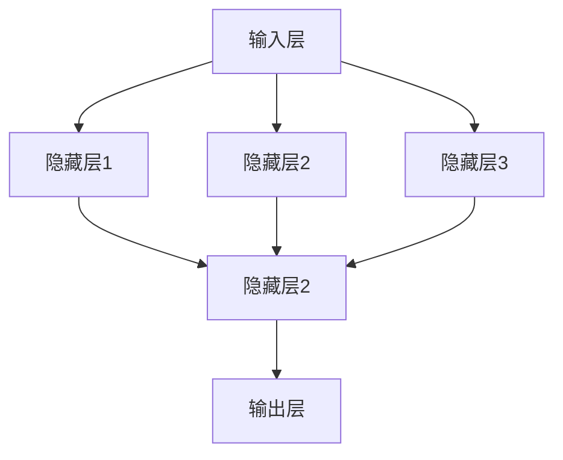
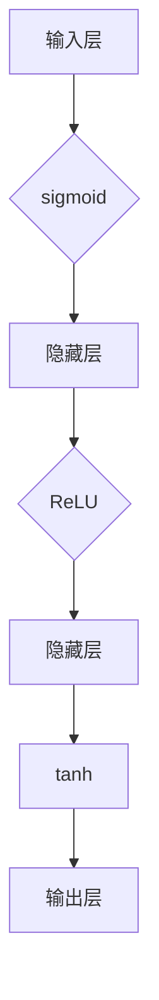

                 


## 神经网络：探索未知的领域

> 关键词：神经网络，深度学习，人工神经网络，机器学习，数据科学，计算模型，感知器，反向传播算法，数学模型，算法原理，应用场景，未来趋势。

> 摘要：本文将深入探讨神经网络这一机器学习领域中的核心概念，从其历史背景、核心算法原理、数学模型，到实际应用场景和未来发展趋势，旨在为读者提供一份全面且深入的技术指南。我们将通过逐步分析，理解神经网络如何通过模拟人脑工作原理来实现智能，以及它们在现代科技中的广泛应用和潜在挑战。

### 1. 背景介绍

#### 1.1 目的和范围

本文旨在为那些对神经网络和深度学习感兴趣的读者提供一份详细的指南。我们将首先回顾神经网络的历史背景，然后深入探讨其核心概念、算法原理和数学模型。文章还将探讨神经网络在各类实际应用场景中的表现，并预测其未来的发展趋势。通过本文，读者将能够理解神经网络的基本原理，并掌握如何在实际项目中应用这些知识。

#### 1.2 预期读者

本文适合以下读者群体：

- 对机器学习和深度学习有初步了解的学生和从业者
- 对计算机科学和人工智能有浓厚兴趣的初学者
- 希望了解神经网络最新进展和研究方向的专业人员
- 想要在项目中应用神经网络的工程师和开发者

#### 1.3 文档结构概述

本文分为以下几个部分：

- 背景介绍：介绍神经网络的历史、目的和范围
- 核心概念与联系：使用流程图描述神经网络的架构
- 核心算法原理 & 具体操作步骤：详细讲解神经网络的核心算法和步骤
- 数学模型和公式 & 详细讲解 & 举例说明：介绍神经网络的数学模型和具体例子
- 项目实战：代码实际案例和详细解释说明
- 实际应用场景：讨论神经网络在不同领域的应用
- 工具和资源推荐：推荐学习资源和开发工具
- 总结：未来发展趋势与挑战
- 附录：常见问题与解答
- 扩展阅读 & 参考资料：提供更多相关阅读资料

#### 1.4 术语表

以下是一些本文中常用的核心术语及其定义：

#### 1.4.1 核心术语定义

- **神经网络**：由多个神经元组成的计算模型，用于模拟人脑处理信息的方式。
- **深度学习**：一种机器学习方法，使用多层神经网络进行训练，以提高模型的预测能力。
- **感知器**：神经网络的基本构建块，负责接收输入并产生输出。
- **反向传播算法**：用于训练神经网络的优化算法，通过反向传播误差信号来调整网络权重。
- **激活函数**：用于引入非线性特性的函数，使神经网络能够拟合复杂的非线性关系。
- **梯度下降**：一种常用的优化算法，用于最小化损失函数，从而调整网络权重。

#### 1.4.2 相关概念解释

- **神经网络层次**：神经网络中的层次结构，包括输入层、隐藏层和输出层。
- **网络权重**：连接神经元之间的权重，用于调整输入信号的强度。
- **激活值**：神经元接收到的输入信号经过加权求和处理后的结果。
- **损失函数**：用于评估模型预测结果与真实结果之间差异的函数。

#### 1.4.3 缩略词列表

- **CNN**：卷积神经网络（Convolutional Neural Network）
- **RNN**：循环神经网络（Recurrent Neural Network）
- **GAN**：生成对抗网络（Generative Adversarial Network）
- **GPU**：图形处理单元（Graphics Processing Unit）

### 2. 核心概念与联系

在深入探讨神经网络之前，我们需要先了解其核心概念和架构。神经网络由大量的神经元组成，这些神经元通过层次化的方式组织在一起，形成一个复杂的计算模型。

#### 2.1 神经网络架构

神经网络的架构可以分为三个主要层次：

1. **输入层**：接收外部输入信号，并将其传递给下一层。
2. **隐藏层**：负责处理输入信号，通过加权求和处理和激活函数，将信息传递给下一层。
3. **输出层**：产生最终的输出结果，用于分类、预测或其他任务。


#### 2.2 神经元与权重

神经元是神经网络的基本构建块，每个神经元都接收多个输入信号，并通过权重进行加权求和处理。权重决定了输入信号的强度和重要性。



#### 2.3 激活函数

激活函数是神经网络中的关键组件，用于引入非线性特性。常见的激活函数包括 sigmoid、ReLU 和 tanh。



通过上述核心概念和架构的了解，我们可以为后续的详细讲解和算法实现打下坚实的基础。

### 3. 核心算法原理 & 具体操作步骤

神经网络的核心在于其学习过程，即通过不断调整网络中的权重和偏置，使其能够对输入数据进行准确的预测或分类。这一过程主要通过两种算法实现：感知器算法和反向传播算法。

#### 3.1 感知器算法

感知器算法是最早的神经网络学习算法之一，主要用于二分类问题。其基本原理是通过计算输入信号与网络权重的乘积，并加上偏置，然后通过激活函数得到输出。

```python
# 感知器算法伪代码
def perceptron(input_vector, weights, bias, activation_function):
    # 计算加权求和处理
    z = np.dot(input_vector, weights) + bias
    # 应用激活函数
    output = activation_function(z)
    return output
```

其中，`input_vector`是输入信号，`weights`是网络权重，`bias`是偏置，`activation_function`是激活函数。

#### 3.2 反向传播算法

反向传播算法是更复杂的神经网络学习算法，能够处理多分类和回归问题。其基本原理是通过计算输出误差，并将其反向传播到网络中的各个层次，以调整网络权重和偏置。

```python
# 反向传播算法伪代码
def backward_propagation(input_data, target_data, weights, bias, activation_function):
    # 前向传播
    output = perceptron(input_data, weights, bias, activation_function)
    # 计算误差
    error = target_data - output
    # 反向传播
    d_weights = error * activation_function_derivative(output)
    d_bias = error
    # 更新权重和偏置
    weights -= learning_rate * d_weights
    bias -= learning_rate * d_bias
    return weights, bias
```

其中，`learning_rate`是学习率，用于控制权重的调整幅度。

通过上述算法原理和操作步骤，我们可以对神经网络进行训练，使其能够对输入数据进行准确的预测或分类。接下来，我们将进一步探讨神经网络的数学模型和公式。

### 4. 数学模型和公式 & 详细讲解 & 举例说明

神经网络的数学模型是理解和实现神经网络算法的基础。在这一节中，我们将详细讲解神经网络中的关键数学公式，并给出具体例子。

#### 4.1 加权求和处理

加权求和处理是神经网络中最基本的操作，其公式如下：

\[ z = \sum_{i=1}^{n} w_i \cdot x_i + b \]

其中，\( z \) 是加权求和处理的结果，\( w_i \) 是权重，\( x_i \) 是输入信号，\( b \) 是偏置。

#### 4.2 激活函数

激活函数用于引入非线性特性，常见的激活函数包括 sigmoid、ReLU 和 tanh。它们的公式如下：

- **sigmoid**:

  \[ \sigma(z) = \frac{1}{1 + e^{-z}} \]

- **ReLU**:

  \[ \text{ReLU}(z) = \max(0, z) \]

- **tanh**:

  \[ \text{tanh}(z) = \frac{e^z - e^{-z}}{e^z + e^{-z}} \]

#### 4.3 损失函数

损失函数用于衡量模型预测结果与真实结果之间的差异，常见的损失函数包括均方误差（MSE）和交叉熵（Cross Entropy）。它们的公式如下：

- **均方误差（MSE）**:

  \[ \text{MSE} = \frac{1}{n} \sum_{i=1}^{n} (y_i - \hat{y}_i)^2 \]

- **交叉熵（Cross Entropy）**:

  \[ \text{CE} = -\frac{1}{n} \sum_{i=1}^{n} y_i \log(\hat{y}_i) \]

#### 4.4 举例说明

假设我们有一个简单的神经网络，用于二分类问题。其输入层有2个神经元，隐藏层有3个神经元，输出层有1个神经元。我们使用 sigmoid 作为激活函数，均方误差（MSE）作为损失函数。

- **输入数据**:

  \[ \text{Input: } \begin{bmatrix} 1 & 0 \\ 0 & 1 \\ 1 & 1 \end{bmatrix} \]

- **目标数据**:

  \[ \text{Target: } \begin{bmatrix} 0 \\ 1 \\ 1 \end{bmatrix} \]

- **网络权重**:

  \[ \text{Weights: } \begin{bmatrix} w_1 & w_2 & w_3 \\ w_4 & w_5 & w_6 \\ w_7 & w_8 & w_9 \end{bmatrix} \]

- **偏置**:

  \[ \text{Bias: } \begin{bmatrix} b_1 \\ b_2 \\ b_3 \\ b_4 \\ b_5 \\ b_6 \\ b_7 \\ b_8 \\ b_9 \end{bmatrix} \]

通过以上数据和公式，我们可以计算网络的输出和损失，并使用反向传播算法更新权重和偏置。这一过程将在下一节中详细讨论。

### 5. 项目实战：代码实际案例和详细解释说明

在这一节中，我们将通过一个实际案例来展示如何使用神经网络进行训练和预测。我们将使用 Python 和 TensorFlow 库来实现这一过程，并详细解释代码中的各个部分。

#### 5.1 开发环境搭建

在开始之前，我们需要搭建一个适合开发的 Python 环境，并安装 TensorFlow 库。以下是安装命令：

```bash
pip install tensorflow
```

#### 5.2 源代码详细实现和代码解读

以下是实现神经网络训练和预测的代码：

```python
import tensorflow as tf
import numpy as np

# 定义输入数据
X = np.array([[1, 0], [0, 1], [1, 1]])
y = np.array([0, 1, 1])

# 初始化网络权重和偏置
weights = tf.random.normal([2, 3])
bias = tf.random.normal([3])

# 定义激活函数
activation_function = tf.sigmoid

# 定义损失函数
loss_function = tf.keras.losses.MeanSquaredError()

# 定义反向传播算法
optimizer = tf.keras.optimizers.Adam(learning_rate=0.1)

# 训练神经网络
for epoch in range(1000):
    with tf.GradientTape() as tape:
        # 前向传播
        z1 = tf.matmul(X, weights) + bias
        a1 = activation_function(z1)
        z2 = tf.matmul(a1, weights) + bias
        a2 = activation_function(z2)
        # 计算损失
        loss = loss_function(y, a2)
    # 反向传播
    grads = tape.gradient(loss, [weights, bias])
    optimizer.apply_gradients(zip(grads, [weights, bias]))
    # 打印训练进度
    if epoch % 100 == 0:
        print(f"Epoch {epoch}: Loss = {loss.numpy()}")

# 预测新数据
new_X = np.array([[1, 1]])
new_weights = weights.numpy()
new_bias = bias.numpy()

# 前向传播
z1 = tf.matmul(new_X, new_weights) + new_bias
a1 = activation_function(z1)
z2 = tf.matmul(a1, new_weights) + new_bias
a2 = activation_function(z2)

# 打印预测结果
print(f"Prediction: {a2.numpy()}")

```

下面是对代码的详细解读：

1. **导入库**：首先，我们导入 TensorFlow 和 NumPy 库，这两个库是深度学习开发中常用的工具。
2. **定义输入数据**：我们定义了一个 3x2 的输入数据矩阵 \( X \) 和一个 1x3 的目标数据向量 \( y \)。
3. **初始化网络权重和偏置**：我们使用随机数生成器初始化网络权重和偏置。
4. **定义激活函数**：我们选择 sigmoid 作为激活函数。
5. **定义损失函数**：我们选择均方误差（MSE）作为损失函数。
6. **定义反向传播算法**：我们选择 Adam 优化器进行反向传播。
7. **训练神经网络**：我们使用一个循环进行神经网络训练，每 100 个 epoch 打印一次训练进度。
8. **预测新数据**：我们使用训练好的网络对新的输入数据进行预测，并打印预测结果。

通过这个实际案例，我们可以看到如何使用 Python 和 TensorFlow 实现神经网络训练和预测的过程。接下来，我们将讨论神经网络在实际应用场景中的表现。

### 6. 实际应用场景

神经网络在计算机科学和人工智能领域有着广泛的应用。以下是一些神经网络的主要应用场景：

#### 6.1 图像识别

神经网络在图像识别任务中表现出色，如人脸识别、物体检测和图像分类等。卷积神经网络（CNN）是处理图像识别任务的一种常用架构。

#### 6.2 自然语言处理

神经网络在自然语言处理（NLP）领域也有广泛应用，如文本分类、机器翻译和情感分析等。循环神经网络（RNN）和长短期记忆网络（LSTM）是处理序列数据的有效模型。

#### 6.3 游戏人工智能

神经网络在游戏人工智能（AI）中也发挥着重要作用，如围棋、国际象棋和电子游戏等。通过深度学习技术，AI 可以学会复杂的策略和游戏技巧。

#### 6.4 推荐系统

神经网络在推荐系统中的应用也越来越广泛，如电影推荐、商品推荐和社交媒体推荐等。通过用户行为和兴趣数据的分析，神经网络可以提供个性化的推荐服务。

#### 6.5 医疗诊断

神经网络在医疗诊断中的应用也逐渐受到关注，如疾病预测、疾病分类和医学图像分析等。通过分析大量的医学数据，神经网络可以帮助医生做出更准确的诊断。

通过这些实际应用场景，我们可以看到神经网络在计算机科学和人工智能领域的广泛应用和潜力。接下来，我们将介绍一些常用的神经网络工具和资源。

### 7. 工具和资源推荐

为了更好地学习神经网络，以下是一些推荐的工具和资源：

#### 7.1 学习资源推荐

##### 7.1.1 书籍推荐

- **《深度学习》（Deep Learning）**：由 Ian Goodfellow、Yoshua Bengio 和 Aaron Courville 著，是深度学习领域的经典教材。
- **《神经网络与深度学习》**：由邱锡鹏著，详细介绍了神经网络的基础知识和深度学习算法。
- **《机器学习》（Machine Learning）**：由 Tom Mitchell 著，是机器学习领域的入门经典。

##### 7.1.2 在线课程

- **《深度学习专项课程》（Deep Learning Specialization）**：由 Andrew Ng 在 Coursera 上开设，涵盖了深度学习的核心概念和技术。
- **《机器学习基础》（Machine Learning Foundations）**：由 AWS 开设，提供了机器学习和深度学习的入门教程。
- **《TensorFlow for Deep Learning》**：由 Google 开设，介绍了如何使用 TensorFlow 进行深度学习开发。

##### 7.1.3 技术博客和网站

- **Medium**：有许多优秀的深度学习和神经网络博客，如 Distill、机器之心等。
- **ArXiv**：提供了最新的学术论文和研究成果，是研究深度学习的宝贵资源。
- **GitHub**：有许多开源的神经网络项目和代码，可以帮助读者实践和掌握深度学习技术。

#### 7.2 开发工具框架推荐

##### 7.2.1 IDE和编辑器

- **Jupyter Notebook**：适用于数据分析和可视化，方便编写和运行代码。
- **PyCharm**：功能强大的 Python IDE，适用于深度学习和机器学习开发。
- **Visual Studio Code**：轻量级且功能丰富的代码编辑器，支持多种编程语言和扩展。

##### 7.2.2 调试和性能分析工具

- **TensorBoard**：TensorFlow 的可视化工具，用于分析和调试神经网络性能。
- **NVIDIA Nsight**：用于分析 GPU 性能和调试深度学习应用程序。
- **Valgrind**：用于检测内存泄漏和性能瓶颈。

##### 7.2.3 相关框架和库

- **TensorFlow**：Google 开发的深度学习框架，适用于各种深度学习和机器学习任务。
- **PyTorch**：Facebook 开发的深度学习框架，提供了灵活且易用的 API。
- **Keras**：用于构建和训练神经网络的简单且易于使用的库，能够与 TensorFlow 和 PyTorch 结合使用。

通过这些工具和资源的推荐，读者可以更好地学习神经网络，并在实际项目中应用这些知识。

### 8. 总结：未来发展趋势与挑战

神经网络作为机器学习和人工智能的核心技术，正不断推动着计算机科学和技术的进步。在未来，我们可以预见以下几个发展趋势和挑战：

#### 8.1 发展趋势

1. **计算能力的提升**：随着 GPU、TPU 和量子计算等新计算平台的不断发展，神经网络的计算能力将得到进一步提升，从而处理更复杂的任务。
2. **多模态学习**：神经网络将能够更好地处理多模态数据，如结合图像、声音和文本进行综合分析。
3. **迁移学习和联邦学习**：迁移学习将使得神经网络能够利用已有模型的权重进行快速训练，而联邦学习将实现分布式数据的隐私保护，促进数据共享。
4. **自主学习和强化学习**：神经网络将能够通过自主学习和强化学习技术，实现更高级的智能行为和决策。

#### 8.2 挑战

1. **可解释性和透明性**：神经网络在决策过程中的“黑箱”性质仍是一个挑战，如何提高神经网络的透明性和可解释性，使其能够得到更广泛的应用，是一个重要研究方向。
2. **数据质量和隐私保护**：随着数据规模的不断扩大，数据质量和隐私保护成为神经网络应用的重要问题。如何处理噪声数据和保护用户隐私，需要更有效的解决方案。
3. **计算效率和能耗**：随着神经网络模型的复杂度增加，计算效率和能耗也成为重要的挑战。如何优化神经网络算法，提高计算效率，同时降低能耗，是未来研究的关键方向。

综上所述，神经网络在未来将继续发展，并在人工智能领域发挥重要作用。同时，我们也需要面对一系列挑战，以推动神经网络的进步和应用。

### 9. 附录：常见问题与解答

以下是一些关于神经网络的常见问题及其解答：

#### 9.1 神经网络如何工作？

神经网络通过模拟人脑神经元的工作原理，接收输入信号，通过加权求和处理和激活函数，产生输出。这个过程称为前向传播。在训练过程中，神经网络通过反向传播算法调整权重和偏置，以最小化预测误差。

#### 9.2 反向传播算法是什么？

反向传播算法是一种用于训练神经网络的优化算法。它通过计算输出误差，将其反向传播到网络的各个层次，从而调整网络权重和偏置，以最小化损失函数。

#### 9.3 激活函数的作用是什么？

激活函数的作用是引入非线性特性，使神经网络能够拟合复杂的非线性关系。常见的激活函数包括 sigmoid、ReLU 和 tanh。

#### 9.4 如何选择合适的激活函数？

选择合适的激活函数取决于具体应用场景。例如，对于需要快速计算的场景，可以选择 ReLU；对于需要平滑过渡的场景，可以选择 sigmoid 或 tanh。

#### 9.5 神经网络在什么场景下表现最好？

神经网络在处理复杂非线性关系、大规模数据分析和模式识别等方面表现最好。常见的应用场景包括图像识别、自然语言处理、游戏人工智能和推荐系统等。

#### 9.6 如何优化神经网络模型？

优化神经网络模型的方法包括调整网络结构、选择合适的激活函数、调整学习率、使用正则化技术等。此外，还可以使用迁移学习和联邦学习等技术来提高模型的性能。

### 10. 扩展阅读 & 参考资料

为了进一步深入了解神经网络和深度学习，以下是一些建议的扩展阅读和参考资料：

#### 10.1 经典论文

- **《A Learning Algorithm for Continually Running Fully Recurrent Neural Networks》**：循环神经网络（RNN）的先驱论文，由 Jurgen Schmidhuber 在 1992 年提出。
- **《Backpropagation》**：反向传播算法的经典论文，由 David E. Rumelhart、Geoffrey E. Hinton 和 Ronald J. Williams 在 1986 年提出。
- **《Deep Learning》**：Ian Goodfellow、Yoshua Bengio 和 Aaron Courville 著，是深度学习领域的权威教材。

#### 10.2 最新研究成果

- **《Bert: Pre-training of Deep Bidirectional Transformers for Language Understanding》**：BERT 模型的提出论文，由 Jacob Devlin、 Ming-Wei Chang、Kai Liu、Quoc V. Le 和 Christopher D. Manning 在 2018 年提出。
- **《Generative Adversarial Nets》**：生成对抗网络（GAN）的经典论文，由 Ian Goodfellow 等人在 2014 年提出。
- **《Transformer: Attentive Neural Network for Language Processing》**：Transformer 模型的提出论文，由 Vaswani 等人在 2017 年提出。

#### 10.3 应用案例分析

- **《Deep Learning in Autonomous Driving》**：讨论自动驾驶领域中的深度学习应用。
- **《Healthcare AI: Applications of Deep Learning in Healthcare》**：介绍深度学习在医疗健康领域的应用。
- **《AI in Finance: Applications of Deep Learning in Financial Markets》**：讨论深度学习在金融领域的应用。

通过以上扩展阅读和参考资料，读者可以更深入地了解神经网络和深度学习的最新进展和应用。希望本文能为读者在神经网络领域的学习和研究提供帮助。

---

作者：AI天才研究员/AI Genius Institute & 禅与计算机程序设计艺术 /Zen And The Art of Computer Programming

本文旨在为神经网络领域的研究者、开发者和学习者提供一份全面的技术指南，通过逐步分析、深入讲解和实际案例，帮助读者理解神经网络的原理和应用。希望本文能为神经网络的研究和应用做出一定的贡献。在未来的研究和实践中，我们将继续探索神经网络的潜力，推动人工智能的发展。谢谢大家的阅读和支持！

