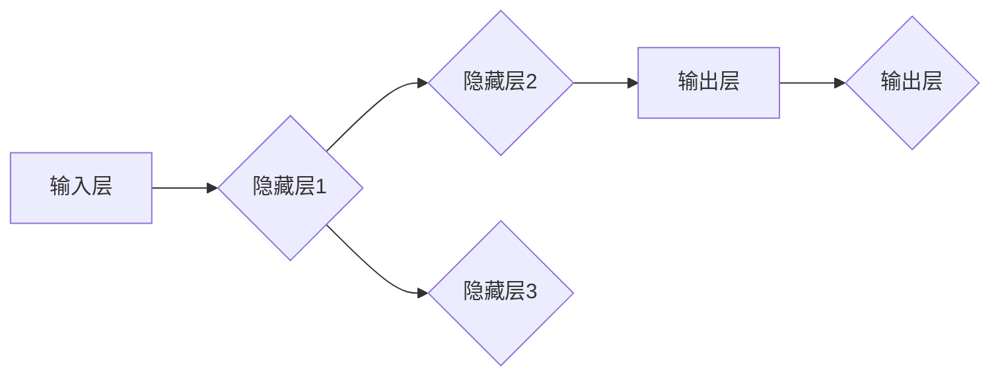
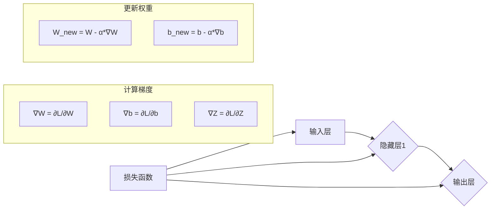
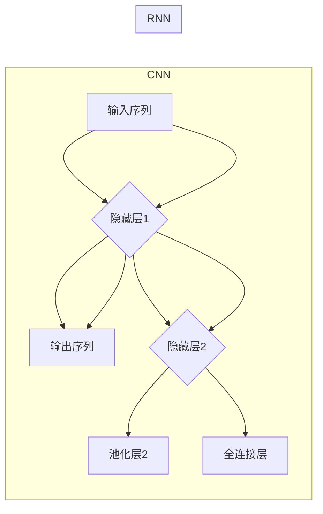

                 

# 神经网络：推动社会进步的力量

## 关键词
- 神经网络
- 人工智能
- 深度学习
- 社会进步
- 应用场景

> **摘要**：本文将深入探讨神经网络这一人工智能领域的重要技术，分析其核心概念、算法原理、数学模型，并通过实际案例展现其在各行业中的应用。本文旨在揭示神经网络如何作为推动社会进步的关键力量，并展望其未来的发展趋势与挑战。

## 1. 背景介绍

### 1.1 目的和范围

本文旨在为读者提供一个全面而深入的神经网络技术介绍，通过剖析其核心概念和算法原理，展示神经网络在当今社会各个领域的广泛应用。我们将从以下几个方面展开讨论：

1. **神经网络的历史与发展**：简要回顾神经网络的发展历程及其对人工智能领域的贡献。
2. **神经网络的核心概念与架构**：详细解析神经网络的基本组成和运作机制。
3. **核心算法原理与操作步骤**：深入探讨神经网络的主要算法，如反向传播算法。
4. **数学模型和公式**：介绍神经网络中的关键数学模型，并通过具体例子进行说明。
5. **实际应用场景**：分析神经网络在不同领域的具体应用。
6. **工具和资源推荐**：推荐相关学习资源和开发工具。
7. **未来发展趋势与挑战**：探讨神经网络技术的发展趋势及面临的挑战。

### 1.2 预期读者

本文面向对人工智能和神经网络有一定了解的读者，包括但不限于程序员、数据科学家、机器学习工程师、AI研究人员以及所有对神经网络技术感兴趣的技术爱好者。无论您是初学者还是专家，本文都希望能为您提供有价值的见解和启示。

### 1.3 文档结构概述

本文结构如下：

1. **引言**：介绍神经网络的重要性和本文目的。
2. **背景介绍**：回顾神经网络的历史与发展，明确本文讨论的范围和目标读者。
3. **核心概念与联系**：通过流程图展示神经网络的基本架构。
4. **核心算法原理 & 具体操作步骤**：详细讲解神经网络的核心算法和操作步骤。
5. **数学模型和公式**：介绍神经网络中的关键数学模型，并通过实例进行说明。
6. **项目实战：代码实际案例和详细解释说明**：通过实际案例展示神经网络的应用。
7. **实际应用场景**：分析神经网络在不同领域的应用。
8. **工具和资源推荐**：推荐学习资源和开发工具。
9. **总结：未来发展趋势与挑战**：展望神经网络技术的未来。
10. **附录：常见问题与解答**：回答读者可能遇到的问题。
11. **扩展阅读 & 参考资料**：提供进一步阅读的材料。

### 1.4 术语表

#### 1.4.1 核心术语定义

- **神经网络**：一种模仿生物神经系统的计算模型，通过多层神经元进行数据处理和特征提取。
- **深度学习**：一种基于神经网络的机器学习方法，通过深度神经网络（DNN）进行复杂模式识别和学习。
- **反向传播算法**：一种用于训练神经网络的算法，通过反向传播误差来调整网络权重。
- **激活函数**：一种用于引入非线性特性的函数，常用于神经网络中。
- **卷积神经网络（CNN）**：一种特别适用于图像处理任务的神经网络，通过卷积层提取图像特征。
- **递归神经网络（RNN）**：一种适用于序列数据处理任务的神经网络，通过递归结构对序列信息进行建模。

#### 1.4.2 相关概念解释

- **多层感知机（MLP）**：一种简单的神经网络结构，通常用于前向传播和反向传播算法。
- **梯度下降**：一种优化算法，用于调整神经网络中的权重和偏置，以最小化损失函数。
- **正则化**：一种防止神经网络过拟合的技术，通过引入惩罚项来限制模型复杂度。
- **数据增强**：一种提高模型泛化能力的技术，通过生成更多的训练样本。

#### 1.4.3 缩略词列表

- **AI**：人工智能
- **ML**：机器学习
- **DL**：深度学习
- **CNN**：卷积神经网络
- **RNN**：递归神经网络
- **DNN**：深度神经网络

## 2. 核心概念与联系

神经网络作为人工智能的核心技术，其基本概念和架构至关重要。以下是神经网络的核心概念及其相互联系。

### 2.1 神经网络的基本架构

神经网络由多个层次组成，包括输入层、隐藏层和输出层。每个层次包含多个神经元，神经元之间通过权重连接。以下是神经网络的基本架构：



### 2.2 神经网络的激活函数

激活函数是神经网络中引入非线性特性的关键，常见的激活函数包括 sigmoid、ReLU 和 tanh。以下是一个激活函数的示例：

```mermaid
graph LR
    A[输入 x] --> B{激活函数}
    B --> C[输出 y]
    subgraph Sigmoid
        D[0.5]
        E[1 / (1 + e^(-x))]
        D --> E
    end
```

### 2.3 反向传播算法

反向传播算法是训练神经网络的核心理算法，通过计算梯度来更新网络权重。以下是反向传播算法的基本步骤：



### 2.4 卷积神经网络（CNN）和递归神经网络（RNN）

卷积神经网络（CNN）特别适用于图像处理任务，通过卷积层和池化层提取图像特征。递归神经网络（RNN）适用于序列数据处理任务，通过递归结构对序列信息进行建模。以下是它们的架构示意图：



通过上述核心概念和架构的介绍，我们能够更好地理解神经网络的基本原理及其应用。

## 3. 核心算法原理 & 具体操作步骤

神经网络的训练过程是人工智能技术的核心，其中反向传播算法（Backpropagation Algorithm）尤为关键。以下将详细讲解反向传播算法的原理和具体操作步骤。

### 3.1 反向传播算法原理

反向传播算法是一种用于训练神经网络的优化算法，其基本思想是计算网络的损失函数对每个权重的梯度，并使用梯度来更新权重，以最小化损失函数。以下是反向传播算法的核心步骤：

1. **前向传播（Forward Propagation）**：给定输入数据，将数据从输入层传递到输出层，计算输出值和损失。
2. **计算损失（Compute Loss）**：使用损失函数（如均方误差（MSE）或交叉熵（Cross Entropy））计算输出值与真实值之间的差异。
3. **反向传播（Backward Propagation）**：从输出层开始，计算损失函数对每个权重的梯度。
4. **权重更新（Update Weights）**：使用梯度下降（Gradient Descent）或其他优化算法更新权重和偏置。
5. **迭代（Iteration）**：重复前向传播和反向传播过程，直到达到预设的收敛条件。

### 3.2 具体操作步骤

以下是基于反向传播算法的神经网络训练过程的具体操作步骤：

#### 步骤 1：初始化参数

- 初始化网络参数，包括权重（W）和偏置（b）。
- 设置学习率（α）和其他超参数。

```python
# 初始化权重和偏置
W = np.random.randn(m, n)
b = np.random.randn(n)

# 设置学习率
alpha = 0.01
```

#### 步骤 2：前向传播

- 计算每个神经元的输入和输出。
- 应用激活函数引入非线性特性。

```python
# 定义激活函数
def sigmoid(x):
    return 1 / (1 + np.exp(-x))

# 前向传播
Z = X.dot(W) + b
A = sigmoid(Z)
```

#### 步骤 3：计算损失

- 使用损失函数计算输出值与真实值之间的差异。

```python
# 定义损失函数
def mse(y_pred, y_true):
    return ((y_pred - y_true) ** 2).mean()

# 计算损失
loss = mse(A, y)
```

#### 步骤 4：反向传播

- 计算输出层误差。
- 计算隐藏层误差。

```python
# 计算输出层误差
dA = A - y

# 计算隐藏层误差
dZ = dA * (1 - A)
dW = Z.T.dot(dA)
db = dZ.sum(axis=0)
```

#### 步骤 5：权重更新

- 使用梯度下降更新权重和偏置。

```python
# 更新权重和偏置
W -= alpha * dW
b -= alpha * db
```

#### 步骤 6：迭代

- 重复前向传播和反向传播过程，直到达到预设的迭代次数或损失阈值。

```python
# 迭代训练
for i in range(num_iterations):
    Z = X.dot(W) + b
    A = sigmoid(Z)
    loss = mse(A, y)
    dA = A - y
    dZ = dA * (1 - A)
    dW = Z.T.dot(dA)
    db = dZ.sum(axis=0)
    W -= alpha * dW
    b -= alpha * db
```

通过上述步骤，我们可以实现神经网络的训练过程。反向传播算法在训练过程中不断迭代，通过调整权重和偏置来最小化损失函数，从而提高网络的预测能力。

### 3.3 反向传播算法的应用

反向传播算法广泛应用于各种神经网络结构，包括多层感知机（MLP）、卷积神经网络（CNN）和递归神经网络（RNN）。以下是不同类型神经网络的反向传播算法应用：

#### 3.3.1 多层感知机（MLP）

多层感知机是一种简单的神经网络结构，用于分类和回归任务。其反向传播算法如下：

```python
# 前向传播
Z = X.dot(W) + b
A = sigmoid(Z)

# 计算损失
loss = mse(A, y)

# 反向传播
dA = A - y
dZ = dA * (1 - A)
dW = Z.T.dot(dA)
db = dZ.sum(axis=0)

# 更新权重和偏置
W -= alpha * dW
b -= alpha * db
```

#### 3.3.2 卷积神经网络（CNN）

卷积神经网络用于图像处理任务，其反向传播算法在卷积层和池化层有所不同。以下是CNN的反向传播算法：

```python
# 前向传播
convolve(X, W) # 计算卷积操作
pool(A)        # 计算池化操作
Z = A.dot(W) + b
A = sigmoid(Z)

# 计算损失
loss = mse(A, y)

# 反向传播
dA = A - y
dZ = dA * (1 - A)
dW = Z.T.dot(dA)
db = dZ.sum(axis=0)

# 反向传播卷积层
dX = convolve(dZ, W.T)
dW = X.T.dot(dZ)

# 更新权重和偏置
W -= alpha * dW
b -= alpha * db
```

#### 3.3.3 递归神经网络（RNN）

递归神经网络用于序列数据处理任务，其反向传播算法涉及递归步骤。以下是RNN的反向传播算法：

```python
# 前向传播
H = sigmoid(X.dot(W) + b)

# 计算损失
loss = mse(H, y)

# 反向传播
dH = H - y
dZ = dH * (1 - H)
dW = Z.T.dot(dH)
db = dZ.sum(axis=0)

# 递归反向传播
dX = Z.T.dot(dH)
dH = X.T.dot(dZ)

# 更新权重和偏置
W -= alpha * dW
b -= alpha * db
```

通过上述不同类型神经网络的反向传播算法应用，我们可以看到反向传播算法在神经网络训练中的关键作用，无论是在多层感知机、卷积神经网络还是递归神经网络中，反向传播算法都发挥着至关重要的作用。

## 4. 数学模型和公式 & 详细讲解 & 举例说明

### 4.1 激活函数

激活函数是神经网络中引入非线性特性的关键，常见的激活函数包括 sigmoid、ReLU 和 tanh。以下是这些激活函数的公式及详细讲解。

#### 4.1.1 Sigmoid 激活函数

公式：\[ f(x) = \frac{1}{1 + e^{-x}} \]

**讲解**：Sigmoid 函数将输入 \( x \) 映射到 \([0, 1]\) 区间，常用于二分类问题。其导数为 \( f'(x) = f(x)(1 - f(x)) \)，用于反向传播算法。

**示例**：给定输入 \( x = 2 \)，计算 sigmoid 函数的输出：

\[ f(2) = \frac{1}{1 + e^{-2}} \approx 0.869 \]

#### 4.1.2 ReLU 激活函数

公式：\[ f(x) = \max(0, x) \]

**讲解**：ReLU 函数将输入 \( x \) 映射到非负数，常用于深层网络以加速训练。其导数为 \( f'(x) = \begin{cases} 
0, & \text{if } x < 0 \\
1, & \text{if } x \geq 0 
\end{cases} \)。

**示例**：给定输入 \( x = -2 \)，计算 ReLU 函数的输出：

\[ f(-2) = \max(0, -2) = 0 \]

#### 4.1.3 Tanh 激活函数

公式：\[ f(x) = \frac{e^x - e^{-x}}{e^x + e^{-x}} \]

**讲解**：Tanh 函数将输入 \( x \) 映射到 \([-1, 1]\) 区间，类似于 sigmoid 函数，但具有更好的均方误差性能。其导数为 \( f'(x) = 1 - f(x)^2 \)。

**示例**：给定输入 \( x = 2 \)，计算 tanh 函数的输出：

\[ f(2) = \frac{e^2 - e^{-2}}{e^2 + e^{-2}} \approx 0.96 \]

### 4.2 损失函数

损失函数用于衡量预测值与真实值之间的差异，常见的损失函数包括均方误差（MSE）和交叉熵（Cross Entropy）。以下是这些损失函数的公式及详细讲解。

#### 4.2.1 均方误差（MSE）

公式：\[ \text{MSE} = \frac{1}{m} \sum_{i=1}^{m} (y_i - \hat{y}_i)^2 \]

**讲解**：MSE 函数用于回归任务，计算预测值 \( \hat{y}_i \) 与真实值 \( y_i \) 之间平方差的平均值。其导数为 \( \frac{\partial \text{MSE}}{\partial \hat{y}_i} = 2(y_i - \hat{y}_i) \)。

**示例**：给定真实值 \( y = [1, 2, 3] \) 和预测值 \( \hat{y} = [1.1, 2.1, 2.9] \)，计算 MSE：

\[ \text{MSE} = \frac{1}{3} \sum_{i=1}^{3} (y_i - \hat{y}_i)^2 = \frac{1}{3} \sum_{i=1}^{3} (1_i - 1.1_i)^2 + (2_i - 2.1_i)^2 + (3_i - 2.9_i)^2 \approx 0.0333 \]

#### 4.2.2 交叉熵（Cross Entropy）

公式：\[ \text{CE} = -\frac{1}{m} \sum_{i=1}^{m} y_i \log(\hat{y}_i) \]

**讲解**：CE 函数用于分类任务，计算预测概率与真实概率之间的差异。其导数为 \( \frac{\partial \text{CE}}{\partial \hat{y}_i} = y_i - \hat{y}_i \)。

**示例**：给定真实值 \( y = [1, 0, 1] \) 和预测概率 \( \hat{y} = [0.7, 0.2, 0.1] \)，计算 CE：

\[ \text{CE} = -\frac{1}{3} \sum_{i=1}^{3} y_i \log(\hat{y}_i) = -\frac{1}{3} \sum_{i=1}^{3} 1_i \log(0.7) + 0_i \log(0.2) + 1_i \log(0.1) \approx 0.405 \]

通过上述数学模型和公式的详细讲解，我们可以更好地理解神经网络中激活函数和损失函数的作用，为神经网络的设计和应用提供理论支持。

## 5. 项目实战：代码实际案例和详细解释说明

在本节中，我们将通过一个实际的神经网络项目案例，详细讲解代码实现和解析，以帮助读者更好地理解神经网络的应用。

### 5.1 开发环境搭建

在开始项目实战之前，我们需要搭建一个合适的开发环境。以下是一个简单的步骤指南：

1. **安装 Python**：确保已经安装了 Python 3.6 或更高版本。
2. **安装深度学习库**：安装 TensorFlow 或 PyTorch，这两个库是深度学习中最常用的框架。
   ```bash
   pip install tensorflow  # 或者
   pip install torch torchvision
   ```
3. **创建虚拟环境**：为了更好地管理和隔离项目依赖，我们可以创建一个虚拟环境。
   ```bash
   python -m venv myenv
   source myenv/bin/activate  # Windows: myenv\Scripts\activate
   ```

### 5.2 源代码详细实现和代码解读

以下是一个使用 TensorFlow 框架实现的简单神经网络模型，用于对手写数字进行分类。

```python
import tensorflow as tf
from tensorflow.keras import layers
import numpy as np

# 加载数据集
mnist = tf.keras.datasets.mnist
(x_train, y_train), (x_test, y_test) = mnist.load_data()
x_train, x_test = x_train / 255.0, x_test / 255.0

# 数据预处理
x_train = x_train.reshape((-1, 28, 28, 1))
x_test = x_test.reshape((-1, 28, 28, 1))
y_train = tf.keras.utils.to_categorical(y_train, 10)
y_test = tf.keras.utils.to_categorical(y_test, 10)

# 构建模型
model = tf.keras.Sequential([
    layers.Conv2D(32, (3, 3), activation='relu', input_shape=(28, 28, 1)),
    layers.MaxPooling2D((2, 2)),
    layers.Flatten(),
    layers.Dense(64, activation='relu'),
    layers.Dense(10, activation='softmax')
])

# 编译模型
model.compile(optimizer='adam',
              loss='categorical_crossentropy',
              metrics=['accuracy'])

# 训练模型
model.fit(x_train, y_train, epochs=5, batch_size=32, validation_split=0.1)

# 评估模型
test_loss, test_acc = model.evaluate(x_test, y_test, verbose=2)
print(f"Test accuracy: {test_acc:.4f}")
```

#### 5.2.1 代码解读

1. **数据加载和预处理**：
   ```python
   mnist = tf.keras.datasets.mnist
   (x_train, y_train), (x_test, y_test) = mnist.load_data()
   x_train, x_test = x_train / 255.0, x_test / 255.0
   ```
   加载 MNIST 数据集，并归一化图像像素值。

2. **模型构建**：
   ```python
   model = tf.keras.Sequential([
       layers.Conv2D(32, (3, 3), activation='relu', input_shape=(28, 28, 1)),
       layers.MaxPooling2D((2, 2)),
       layers.Flatten(),
       layers.Dense(64, activation='relu'),
       layers.Dense(10, activation='softmax')
   ])
   ```
   使用 `Sequential` 模型构建一个简单的卷积神经网络（CNN）。模型包括一个卷积层（`Conv2D`），一个池化层（`MaxPooling2D`），一个全连接层（`Dense`）和一个 softmax 层（`softmax`）。

3. **模型编译**：
   ```python
   model.compile(optimizer='adam',
                 loss='categorical_crossentropy',
                 metrics=['accuracy'])
   ```
   编译模型，选择 Adam 优化器和 categorical_crossentropy 损失函数。

4. **模型训练**：
   ```python
   model.fit(x_train, y_train, epochs=5, batch_size=32, validation_split=0.1)
   ```
   使用训练数据训练模型，设置训练轮次（epochs）、批量大小（batch_size）和验证数据比例。

5. **模型评估**：
   ```python
   test_loss, test_acc = model.evaluate(x_test, y_test, verbose=2)
   print(f"Test accuracy: {test_acc:.4f}")
   ```
   使用测试数据评估模型，输出测试准确率。

通过这个简单的案例，我们展示了如何使用 TensorFlow 框架实现一个基本的卷积神经网络，用于手写数字分类任务。这个过程包括数据加载、模型构建、模型编译、模型训练和模型评估，为神经网络的应用提供了实际操作的基础。

### 5.3 代码解读与分析

在本节中，我们将对上述代码进行更详细的分析，解释每部分的作用和实现细节。

#### 5.3.1 数据加载和预处理

```python
mnist = tf.keras.datasets.mnist
(x_train, y_train), (x_test, y_test) = mnist.load_data()
x_train, x_test = x_train / 255.0, x_test / 255.0
```

- **数据集加载**：使用 TensorFlow 的 `keras.datasets.mnist` 加载 MNIST 数据集。MNIST 是一个广泛使用的手写数字数据集，包含 60,000 个训练样本和 10,000 个测试样本。
- **数据归一化**：将图像像素值从 [0, 255] 归一化到 [0, 1]，以减少数值范围，提高训练效果。

#### 5.3.2 模型构建

```python
model = tf.keras.Sequential([
    layers.Conv2D(32, (3, 3), activation='relu', input_shape=(28, 28, 1)),
    layers.MaxPooling2D((2, 2)),
    layers.Flatten(),
    layers.Dense(64, activation='relu'),
    layers.Dense(10, activation='softmax')
])
```

- **卷积层（Conv2D）**：添加一个卷积层，包含 32 个 3x3 的卷积核，使用 ReLU 激活函数。
  - **参数解释**：
    - `32`：卷积核数量。
    - `(3, 3)`：卷积核大小。
    - `activation='relu'`：激活函数为 ReLU。
    - `input_shape=(28, 28, 1)`：输入图像的形状。
- **池化层（MaxPooling2D）**：添加一个最大池化层，使用 2x2 的窗口大小进行池化。
  - **参数解释**：
    - `(2, 2)`：窗口大小。
- **展平层（Flatten）**：将卷积层的输出展平为一维向量，用于全连接层。
- **全连接层（Dense）**：添加一个全连接层，包含 64 个神经元，使用 ReLU 激活函数。
  - **参数解释**：
    - `64`：神经元数量。
    - `activation='relu'`：激活函数为 ReLU。
- **softmax 层（Dense）**：添加一个输出层，包含 10 个神经元，用于分类，使用 softmax 激活函数。
  - **参数解释**：
    - `10`：神经元数量。
    - `activation='softmax'`：激活函数为 softmax。

#### 5.3.3 模型编译

```python
model.compile(optimizer='adam',
              loss='categorical_crossentropy',
              metrics=['accuracy'])
```

- **编译模型**：配置模型的优化器、损失函数和评估指标。
  - **优化器**：使用 Adam 优化器，它是一种自适应的优化算法，适用于大规模机器学习问题。
  - **损失函数**：使用 categorical_crossentropy 损失函数，适用于多分类问题。
  - **评估指标**：监控训练过程中的准确率。

#### 5.3.4 模型训练

```python
model.fit(x_train, y_train, epochs=5, batch_size=32, validation_split=0.1)
```

- **训练模型**：使用训练数据训练模型，设置训练轮次（epochs）、批量大小（batch_size）和验证数据比例。
  - **训练轮次**：完成整个训练数据集的训练过程。
  - **批量大小**：每次训练的样本数量。
  - **验证数据比例**：从训练数据中划分 10% 的数据用于验证。

#### 5.3.5 模型评估

```python
test_loss, test_acc = model.evaluate(x_test, y_test, verbose=2)
print(f"Test accuracy: {test_acc:.4f}")
```

- **评估模型**：使用测试数据评估模型的性能，输出测试准确率。

通过上述代码解析，我们详细了解了如何使用 TensorFlow 框架实现一个简单的卷积神经网络，并对其进行了训练和评估。这个案例展示了神经网络在图像分类任务中的应用，为后续更复杂的神经网络设计和应用提供了基础。

## 6. 实际应用场景

神经网络技术在各个领域取得了显著的应用成果，其强大的学习能力和泛化能力使其在许多实际场景中发挥着关键作用。以下是一些主要的实际应用场景：

### 6.1 人工智能助手

随着人工智能技术的不断发展，神经网络被广泛应用于人工智能助手的设计与实现中。例如，智能客服系统使用神经网络来理解和处理用户查询，提高客户满意度和服务效率。通过训练，神经网络可以学会识别自然语言、提取关键词并生成适当的回复。此外，语音识别系统利用神经网络实现语音到文本的转换，使得人机交互更加自然。

### 6.2 无人驾驶

无人驾驶汽车是神经网络技术的典型应用场景之一。神经网络被用于车辆感知、环境建模和路径规划。通过卷积神经网络（CNN）和递归神经网络（RNN）的结合，无人驾驶系统能够实时处理大量的视觉和传感器数据，识别道路标志、行人、车辆等动态目标，并作出相应的驾驶决策。这极大地提高了行驶的安全性和可靠性。

### 6.3 医疗诊断

神经网络在医疗诊断领域也展现了巨大的潜力。通过训练，神经网络可以学会识别医疗图像中的异常区域，如癌症细胞、脑肿瘤等。这些图像识别技术有助于提高疾病检测的准确性和效率。此外，神经网络还可以用于预测疾病风险、个性化治疗方案的制定等，为临床决策提供有力支持。

### 6.4 金融风险管理

神经网络技术在金融领域有着广泛的应用，特别是在风险管理和预测市场趋势方面。神经网络可以处理大量的历史交易数据，通过学习市场价格、交易量、新闻文本等信息，预测未来的市场走势。这些预测模型有助于金融机构进行投资决策、风险管理以及市场分析。

### 6.5 自然语言处理

自然语言处理（NLP）是神经网络技术的另一个重要应用领域。通过训练，神经网络可以理解和生成人类语言。这使得机器翻译、情感分析、文本摘要、问答系统等应用成为可能。例如，谷歌翻译和亚马逊的 Alexa 都使用了深度神经网络技术，为用户提供高质量的语言服务。

### 6.6 图像识别

图像识别是神经网络技术的重要应用之一。通过卷积神经网络，神经网络可以自动学习图像的特征，从而实现对图像内容的分类、检测和分割。这一技术在人脸识别、图像搜索、自动驾驶等场景中得到了广泛应用。例如，人脸识别技术广泛应用于安全系统、移动设备解锁等，极大地提高了用户体验。

### 6.7 语音识别

语音识别是神经网络技术的重要应用之一。通过递归神经网络（RNN）和卷积神经网络（CNN）的结合，神经网络可以实现对语音信号的准确识别和理解。语音识别技术广泛应用于语音助手、语音翻译、语音控制等领域，为人们的日常生活和工作带来了极大便利。

通过以上实际应用场景，我们可以看到神经网络技术在各个领域取得了显著的成果，并在不断推动社会进步。未来，随着技术的进一步发展，神经网络技术将在更多领域发挥重要作用，为人类社会带来更多创新和变革。

## 7. 工具和资源推荐

为了更好地学习和应用神经网络技术，以下是一些建议的学习资源、开发工具和相关论文著作。

### 7.1 学习资源推荐

#### 7.1.1 书籍推荐

1. **《深度学习》（Goodfellow, I., Bengio, Y., & Courville, A.）**：这是一本全面的深度学习教材，适合初学者和进阶者。
2. **《神经网络与深度学习》（邱锡鹏）**：这本书详细介绍了神经网络的基本原理和应用，非常适合中文读者。
3. **《Python深度学习》（François Chollet）**：通过大量示例代码，展示了如何使用 TensorFlow 进行深度学习。

#### 7.1.2 在线课程

1. **斯坦福大学深度学习课程（Andrew Ng）**：这是一门全球知名的深度学习课程，涵盖了从基础到高级的内容。
2. **吴恩达的机器学习课程（Andrew Ng）**：该课程是机器学习领域的经典课程，其中也包括深度学习的内容。
3. **Udacity的深度学习纳米学位**：通过项目驱动的学习方式，帮助学习者掌握深度学习的核心技能。

#### 7.1.3 技术博客和网站

1. **Medium**：许多专家和公司都在 Medium 上分享深度学习和神经网络的最新研究和应用。
2. **arXiv**：这是一个开源的预印本论文库，涵盖了最新的深度学习研究成果。
3. **GitHub**：许多优秀的深度学习项目和代码库都托管在 GitHub 上，便于学习和借鉴。

### 7.2 开发工具框架推荐

1. **TensorFlow**：由谷歌开发的开源深度学习框架，适用于各种深度学习任务。
2. **PyTorch**：由 Facebook AI 研究团队开发的深度学习框架，以其灵活的动态计算图和易于理解的接口而受到广泛关注。
3. **Keras**：一个高级神经网络API，可以轻松地在 TensorFlow 和 Theano 后端上构建和训练深度学习模型。

#### 7.2.2 调试和性能分析工具

1. **TensorBoard**：TensorFlow 提供的用于可视化训练过程和性能分析的工具。
2. **PyTorch Profiler**：用于分析 PyTorch 模型的性能和资源消耗。
3. **Intel Vtune Amplifier**：用于优化和调试深度学习模型，特别是在英特尔硬件上。

#### 7.2.3 相关框架和库

1. **TensorFlow Hub**：一个用于分享和复用预训练模型和模块的平台。
2. **Hugging Face Transformers**：一个用于使用预训练 Transformer 模型的库，包括 BERT、GPT 和 T5 等。
3. **NumPy**：用于科学计算的基础库，与深度学习框架紧密集成。

### 7.3 相关论文著作推荐

1. **“A Tutorial on Deep Learning” by Y. LeCun, Y. Bengio, and G. Hinton**：这是一篇经典的深度学习教程，详细介绍了神经网络的基本原理和应用。
2. **“Deep Learning” by Ian Goodfellow, Yoshua Bengio, and Aaron Courville**：这本书是深度学习的经典教材，涵盖了从基础到高级的内容。
3. **“Convolutional Networks and Applications in Vision” by Y. LeCun and L. Bottou**：这篇论文介绍了卷积神经网络的基本原理和应用，对理解深度学习有重要参考价值。

通过以上工具和资源的推荐，读者可以更加系统地学习和应用神经网络技术，为深入研究和技术创新奠定坚实基础。

## 8. 总结：未来发展趋势与挑战

### 8.1 发展趋势

1. **计算能力提升**：随着硬件技术的进步，计算能力不断增强，使得更复杂的神经网络模型得以训练和部署，推动了深度学习技术的快速发展。
2. **应用领域扩展**：神经网络技术已经在各个领域取得了显著的应用成果，未来将在更多领域如生物医学、环境科学、金融科技等继续扩展。
3. **自主学习能力提升**：通过强化学习和迁移学习等技术，神经网络的自适应能力和泛化能力不断提升，使其能够更好地应对复杂和多变的环境。
4. **硬件优化**：针对深度学习任务优化的专用硬件（如TPU、GPU等）不断推出，提高了训练和推理的效率，降低了计算成本。
5. **模型压缩与量化**：模型压缩和量化技术不断发展，使得大规模神经网络模型能够在资源受限的设备上运行，提高了实际应用的可行性。

### 8.2 挑战

1. **数据隐私与安全**：随着神经网络应用范围的扩大，数据隐私和安全问题日益突出。如何保护用户数据不被泄露和滥用，是未来面临的重大挑战。
2. **可解释性和透明度**：神经网络尤其是深度神经网络具有“黑箱”特性，模型决策过程不透明，如何提高模型的可解释性和透明度，使其更易于理解和接受，是亟待解决的问题。
3. **伦理和社会影响**：人工智能和神经网络技术的广泛应用引发了一系列伦理和社会问题，如就业替代、隐私侵犯、算法偏见等，需要社会各界共同探讨和解决。
4. **能耗与环保**：训练大型神经网络模型需要大量的计算资源，导致能源消耗巨大。如何在保证性能的同时，降低能耗和碳排放，是未来发展的重要方向。
5. **模型崩溃和安全性**：神经网络模型在某些情况下可能会出现“模型崩溃”现象，即输入微小变化导致输出剧烈变化。如何提高模型的鲁棒性和安全性，是亟待解决的技术难题。

通过上述分析，我们可以看到神经网络技术在未来的发展趋势中充满机遇，同时也面临着诸多挑战。只有在解决这些挑战的过程中，神经网络技术才能真正发挥其潜力，推动社会进步和科技创新。

## 9. 附录：常见问题与解答

### 9.1 什么是神经网络？

神经网络是一种模拟生物神经系统的计算模型，通过多层神经元进行数据处理和特征提取。它由输入层、隐藏层和输出层组成，每个神经元之间通过权重连接。神经网络能够通过学习输入和输出数据之间的关系，对新的数据进行分类、回归或其他任务。

### 9.2 神经网络有哪些类型？

神经网络有多种类型，包括但不限于：

- **前馈神经网络（FFN）**：数据从输入层传递到输出层，没有循环结构。
- **卷积神经网络（CNN）**：适用于图像处理任务，通过卷积层和池化层提取图像特征。
- **递归神经网络（RNN）**：适用于序列数据处理任务，通过递归结构对序列信息进行建模。
- **长短期记忆网络（LSTM）**：一种特殊的 RNN，能够学习长期依赖关系。
- **生成对抗网络（GAN）**：用于生成数据，通过竞争学习生成逼真的图像、音频等。

### 9.3 什么是反向传播算法？

反向传播算法是一种用于训练神经网络的优化算法。它通过计算输出值与真实值之间的误差，从输出层开始反向传播误差到输入层，计算每个权重和偏置的梯度，并使用梯度下降或其他优化算法更新网络参数，以最小化损失函数。

### 9.4 神经网络如何处理非线性问题？

神经网络通过引入激活函数（如 sigmoid、ReLU、tanh）来引入非线性特性。这些函数将线性变换转换为非线性变换，使得神经网络能够处理复杂的关系和模式。此外，深度神经网络通过层层叠加非线性变换，增强了模型的表达能力。

### 9.5 神经网络训练中的常见问题有哪些？

神经网络训练中常见的包括：

- **过拟合**：模型在训练数据上表现良好，但在未见过的数据上表现不佳。
- **欠拟合**：模型无法很好地捕捉训练数据的复杂关系。
- **梯度消失和梯度爆炸**：在训练过程中，梯度可能变得非常小或非常大，导致模型无法有效更新。
- **收敛速度慢**：训练时间过长，可能因为模型过于复杂或数据分布不均。

针对这些问题，可以采取正则化、数据增强、调整网络结构、优化学习率等方法来改进模型性能。

### 9.6 如何提高神经网络的可解释性？

提高神经网络的可解释性是一个重要研究方向，以下是一些方法：

- **模型解释工具**：使用可视化工具（如 TensorBoard）和解释库（如 LIME、SHAP）来分析模型决策。
- **模块化设计**：将神经网络分解为模块，使得每个模块的功能和贡献更加明确。
- **注意力机制**：引入注意力机制，使模型能够显式关注重要的特征。
- **规则提取**：从训练好的神经网络中提取规则或决策边界，使其更加易于理解。

通过上述方法，可以增强神经网络的可解释性，提高其在实际应用中的可信度和接受度。

## 10. 扩展阅读 & 参考资料

为了更深入地了解神经网络技术，以下是一些推荐的研究方向和参考资料：

### 10.1 研究方向

1. **深度学习模型的优化**：研究如何提高神经网络训练的效率，包括模型压缩、量化、分布式训练等。
2. **神经网络的泛化能力**：探讨如何增强神经网络在未知数据上的表现，减少过拟合和欠拟合现象。
3. **神经网络的生物学基础**：研究神经网络的设计如何受到生物神经系统的启发，以及如何借鉴生物学原理优化神经网络。
4. **神经网络的伦理和社会影响**：探讨神经网络技术在伦理和社会层面的影响，以及如何确保其公平和透明。
5. **多模态学习和融合**：研究如何将不同类型的数据（如文本、图像、声音）进行有效融合，以提高模型的表现。

### 10.2 参考资料

1. **《深度学习》（Goodfellow, I., Bengio, Y., & Courville, A.）**：这是一本全面的深度学习教材，适合进阶学习。
2. **《神经网络与深度学习》（邱锡鹏）**：详细介绍神经网络的基本原理和应用，适合中文读者。
3. **《深度学习实践指南》（James D. McCaffrey）**：通过大量实例，展示如何使用深度学习解决实际问题。
4. **《神经网络与机器学习》（张钹、王斌）**：全面介绍神经网络的理论基础和应用实践。
5. **《TensorFlow深度学习》（François Chollet）**：通过详细实例，展示如何使用 TensorFlow 进行深度学习。
6. **《PyTorch深度学习》（Adam Geitgey）**：介绍 PyTorch 框架，并展示如何使用 PyTorch 进行深度学习项目。

通过这些扩展阅读和参考资料，读者可以进一步探索神经网络技术的深度和广度，为深入研究和技术创新提供支持。

