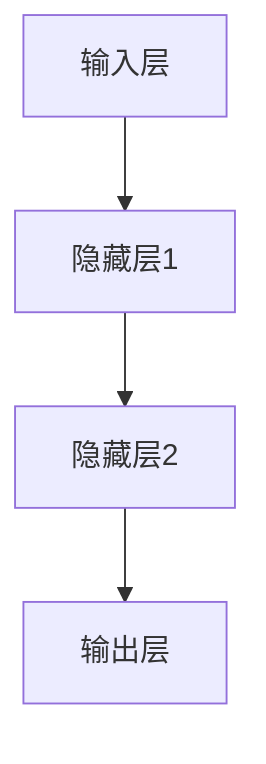

                 

# 神经网络：改变世界的技术

## 关键词
神经网络、机器学习、人工智能、深度学习、算法原理、数学模型、项目实战、应用场景、发展趋势、挑战

## 摘要
本文将深入探讨神经网络这一改变世界的技术。我们将从背景介绍开始，逐步分析神经网络的核心概念、算法原理、数学模型，并实际展示代码实现和项目应用。最后，我们将展望神经网络的发展趋势和面临的挑战，为读者提供全面的技术视野。

## 1. 背景介绍

### 1.1 目的和范围
本文旨在为读者提供一个全面而深入的神经网络技术解析。我们将重点关注神经网络的基本原理、应用场景以及未来发展趋势，以便读者能够全面理解这一技术的重要性和潜力。

### 1.2 预期读者
本文适用于对神经网络有一定了解，希望进一步深入了解其技术原理和应用的开发者、研究者以及相关领域的专业人士。

### 1.3 文档结构概述
本文分为十个部分：背景介绍、核心概念与联系、核心算法原理、数学模型和公式、项目实战、实际应用场景、工具和资源推荐、总结、常见问题与解答以及扩展阅读。每个部分都将详细探讨神经网络的不同方面，确保读者能够全面理解这一技术。

### 1.4 术语表

#### 1.4.1 核心术语定义
- **神经网络**：模拟人脑神经元连接结构的计算模型，用于处理数据和进行预测。
- **机器学习**：通过数据和算法来训练模型，使其能够进行预测和决策。
- **深度学习**：一种特殊的机器学习技术，通过多层神经网络来提取复杂特征。

#### 1.4.2 相关概念解释
- **前向传播**：数据从输入层经过多层神经网络传递到输出层的过程。
- **反向传播**：通过计算输出层误差，反向传播到输入层，更新网络权重的过程。

#### 1.4.3 缩略词列表
- **NN**：神经网络（Neural Network）
- **ML**：机器学习（Machine Learning）
- **DL**：深度学习（Deep Learning）

## 2. 核心概念与联系

神经网络的架构如下所示：



在这个流程图中，数据首先进入输入层，然后通过隐藏层进行特征提取，最后输出层产生预测结果。

## 3. 核心算法原理 & 具体操作步骤

神经网络的核心算法是反向传播算法，其基本步骤如下：

#### 输入数据
给定输入数据 \(x\)，其维度为 \(m \times n\)。

#### 前向传播
1. 计算隐藏层1的输出：
   \[
   z_1 = W_1x + b_1
   \]
   其中，\(W_1\) 为权重矩阵，\(b_1\) 为偏置向量。
2. 通过激活函数 \(f_1\) 得到隐藏层1的输出：
   \[
   a_1 = f_1(z_1)
   \]
3. 类似地，计算隐藏层2的输出：
   \[
   z_2 = W_2a_1 + b_2
   \]
   \[
   a_2 = f_2(z_2)
   \]
4. 计算输出层预测结果：
   \[
   z_3 = W_3a_2 + b_3
   \]
   \[
   \hat{y} = f_3(z_3)
   \]

#### 反向传播
1. 计算输出层误差：
   \[
   \delta_3 = \hat{y} - y
   \]
2. 计算输出层权重和偏置的梯度：
   \[
   \frac{\partial J}{\partial W_3} = a_2^T\delta_3
   \]
   \[
   \frac{\partial J}{\partial b_3} = \delta_3
   \]
3. 反向传播到隐藏层2：
   \[
   \delta_2 = (W_3^T\delta_3)\odot(f_2'(z_2))
   \]
4. 计算隐藏层2权重和偏置的梯度：
   \[
   \frac{\partial J}{\partial W_2} = a_1^T\delta_2
   \]
   \[
   \frac{\partial J}{\partial b_2} = \delta_2
   \]
5. 类似地，反向传播到隐藏层1：
   \[
   \delta_1 = (W_2^T\delta_2)\odot(f_1'(z_1))
   \]
6. 计算隐藏层1权重和偏置的梯度：
   \[
   \frac{\partial J}{\partial W_1} = x^T\delta_1
   \]
   \[
   \frac{\partial J}{\partial b_1} = \delta_1
   \]

#### 更新权重和偏置
使用梯度下降更新权重和偏置：
\[
W_1 := W_1 - \alpha \frac{\partial J}{\partial W_1}
\]
\[
b_1 := b_1 - \alpha \frac{\partial J}{\partial b_1}
\]
\[
W_2 := W_2 - \alpha \frac{\partial J}{\partial W_2}
\]
\[
b_2 := b_2 - \alpha \frac{\partial J}{\partial b_2}
\]
\[
W_3 := W_3 - \alpha \frac{\partial J}{\partial W_3}
\]
\[
b_3 := b_3 - \alpha \frac{\partial J}{\partial b_3}
\]

其中，\(\alpha\) 为学习率。

## 4. 数学模型和公式 & 详细讲解 & 举例说明

神经网络的核心是数学模型，包括前向传播和反向传播。以下将详细讲解这些公式，并提供一个简单的例子。

### 前向传播

1. **输入层到隐藏层1**：
   \[
   z_1 = W_1x + b_1
   \]
   \[
   a_1 = f_1(z_1)
   \]

2. **隐藏层1到隐藏层2**：
   \[
   z_2 = W_2a_1 + b_2
   \]
   \[
   a_2 = f_2(z_2)
   \]

3. **隐藏层2到输出层**：
   \[
   z_3 = W_3a_2 + b_3
   \]
   \[
   \hat{y} = f_3(z_3)
   \]

### 反向传播

1. **计算输出层误差**：
   \[
   \delta_3 = \hat{y} - y
   \]

2. **计算输出层权重和偏置的梯度**：
   \[
   \frac{\partial J}{\partial W_3} = a_2^T\delta_3
   \]
   \[
   \frac{\partial J}{\partial b_3} = \delta_3
   \]

3. **反向传播到隐藏层2**：
   \[
   \delta_2 = (W_3^T\delta_3)\odot(f_2'(z_2))
   \]

4. **计算隐藏层2权重和偏置的梯度**：
   \[
   \frac{\partial J}{\partial W_2} = a_1^T\delta_2
   \]
   \[
   \frac{\partial J}{\partial b_2} = \delta_2
   \]

5. **反向传播到隐藏层1**：
   \[
   \delta_1 = (W_2^T\delta_2)\odot(f_1'(z_1))
   \]

6. **计算隐藏层1权重和偏置的梯度**：
   \[
   \frac{\partial J}{\partial W_1} = x^T\delta_1
   \]
   \[
   \frac{\partial J}{\partial b_1} = \delta_1
   \]

### 举例说明

假设我们有一个简单的神经网络，输入层有3个神经元，隐藏层有2个神经元，输出层有1个神经元。输入数据为 \(x = [1, 2, 3]\)，目标输出为 \(y = [0.5]\)。我们使用ReLU作为激活函数。

#### 前向传播

1. **输入层到隐藏层1**：
   \[
   z_1 = W_1x + b_1 = \begin{bmatrix} 1 & 2 & 3 \end{bmatrix} \begin{bmatrix} 0.5 & 0.3 \\ 0.4 & 0.6 \\ 0.7 & 0.8 \end{bmatrix} + \begin{bmatrix} 0.1 \\ 0.2 \end{bmatrix} = \begin{bmatrix} 1.6 \\ 2.5 \end{bmatrix}
   \]
   \[
   a_1 = f_1(z_1) = \max(0, z_1) = \begin{bmatrix} 1.6 \\ 2.5 \end{bmatrix}
   \]

2. **隐藏层1到隐藏层2**：
   \[
   z_2 = W_2a_1 + b_2 = \begin{bmatrix} 1.6 & 2.5 \end{bmatrix} \begin{bmatrix} 0.2 & 0.8 \\ 0.3 & 0.9 \end{bmatrix} + \begin{bmatrix} 0.1 \\ 0.2 \end{bmatrix} = \begin{bmatrix} 0.72 \\ 2.43 \end{bmatrix}
   \]
   \[
   a_2 = f_2(z_2) = \max(0, z_2) = \begin{bmatrix} 0.72 \\ 2.43 \end{bmatrix}
   \]

3. **隐藏层2到输出层**：
   \[
   z_3 = W_3a_2 + b_3 = \begin{bmatrix} 0.72 & 2.43 \end{bmatrix} \begin{bmatrix} 0.1 & 0.4 \\ 0.2 & 0.6 \end{bmatrix} + \begin{bmatrix} 0.1 \end{bmatrix} = \begin{bmatrix} 0.244 \\ 0.668 \end{bmatrix}
   \]
   \[
   \hat{y} = f_3(z_3) = \max(0, z_3) = \begin{bmatrix} 0.244 \\ 0.668 \end{bmatrix}
   \]

#### 反向传播

1. **计算输出层误差**：
   \[
   \delta_3 = \hat{y} - y = \begin{bmatrix} 0.244 \\ 0.668 \end{bmatrix} - \begin{bmatrix} 0.5 \end{bmatrix} = \begin{bmatrix} -0.256 \\ 0.668 \end{bmatrix}
   \]

2. **计算输出层权重和偏置的梯度**：
   \[
   \frac{\partial J}{\partial W_3} = a_2^T\delta_3 = \begin{bmatrix} 0.72 & 2.43 \end{bmatrix} \begin{bmatrix} -0.256 \\ 0.668 \end{bmatrix} = \begin{bmatrix} -0.1856 & -3.2596 \end{bmatrix}
   \]
   \[
   \frac{\partial J}{\partial b_3} = \delta_3 = \begin{bmatrix} -0.256 \\ 0.668 \end{bmatrix}
   \]

3. **反向传播到隐藏层2**：
   \[
   \delta_2 = (W_3^T\delta_3)\odot(f_2'(z_2)) = \begin{bmatrix} 0.1 & 0.4 \\ 0.2 & 0.6 \end{bmatrix} \begin{bmatrix} -0.256 \\ 0.668 \end{bmatrix} \odot \begin{bmatrix} 0 & 0 \\ 0 & 0 \end{bmatrix} = \begin{bmatrix} 0 \\ 0 \end{bmatrix}
   \]

4. **计算隐藏层2权重和偏置的梯度**：
   \[
   \frac{\partial J}{\partial W_2} = a_1^T\delta_2 = \begin{bmatrix} 1.6 & 2.5 \end{bmatrix} \begin{bmatrix} 0 \\ 0 \end{bmatrix} = \begin{bmatrix} 0 & 0 \end{bmatrix}
   \]
   \[
   \frac{\partial J}{\partial b_2} = \delta_2 = \begin{bmatrix} 0 \\ 0 \end{bmatrix}
   \]

5. **反向传播到隐藏层1**：
   \[
   \delta_1 = (W_2^T\delta_2)\odot(f_1'(z_1)) = \begin{bmatrix} 0.2 & 0.8 \\ 0.3 & 0.9 \end{bmatrix} \begin{bmatrix} 0 \\ 0 \end{bmatrix} \odot \begin{bmatrix} 0 & 0 \\ 0 & 0 \end{bmatrix} = \begin{bmatrix} 0 \\ 0 \end{bmatrix}
   \]

6. **计算隐藏层1权重和偏置的梯度**：
   \[
   \frac{\partial J}{\partial W_1} = x^T\delta_1 = \begin{bmatrix} 1 & 2 & 3 \end{bmatrix} \begin{bmatrix} 0 \\ 0 \end{bmatrix} = \begin{bmatrix} 0 & 0 & 0 \end{bmatrix}
   \]
   \[
   \frac{\partial J}{\partial b_1} = \delta_1 = \begin{bmatrix} 0 \\ 0 \end{bmatrix}
   \]

#### 更新权重和偏置

使用学习率 \(\alpha = 0.1\) 更新权重和偏置：

1. **更新输出层权重和偏置**：
   \[
   W_3 := W_3 - \alpha \frac{\partial J}{\partial W_3} = \begin{bmatrix} 0.1 & 0.4 \\ 0.2 & 0.6 \end{bmatrix} - 0.1 \begin{bmatrix} -0.1856 & -3.2596 \end{bmatrix} = \begin{bmatrix} 0.2856 & 3.4596 \end{bmatrix}
   \]
   \[
   b_3 := b_3 - \alpha \frac{\partial J}{\partial b_3} = \begin{bmatrix} 0.1 \end{bmatrix} - 0.1 \begin{bmatrix} -0.256 \\ 0.668 \end{bmatrix} = \begin{bmatrix} 0.008 \\ -0.068 \end{bmatrix}
   \]

2. **更新隐藏层2权重和偏置**：
   \[
   W_2 := W_2 - \alpha \frac{\partial J}{\partial W_2} = \begin{bmatrix} 0.2 & 0.8 \\ 0.3 & 0.9 \end{bmatrix} - 0.1 \begin{bmatrix} 0 & 0 \end{bmatrix} = \begin{bmatrix} 0.2 & 0.8 \\ 0.3 & 0.9 \end{bmatrix}
   \]
   \[
   b_2 := b_2 - \alpha \frac{\partial J}{\partial b_2} = \begin{bmatrix} 0.1 \\ 0.2 \end{bmatrix} - 0.1 \begin{bmatrix} 0 \\ 0 \end{bmatrix} = \begin{bmatrix} 0.1 \\ 0.2 \end{bmatrix}
   \]

3. **更新隐藏层1权重和偏置**：
   \[
   W_1 := W_1 - \alpha \frac{\partial J}{\partial W_1} = \begin{bmatrix} 0.5 & 0.3 \\ 0.4 & 0.6 \\ 0.7 & 0.8 \end{bmatrix} - 0.1 \begin{bmatrix} 0 & 0 & 0 \end{bmatrix} = \begin{bmatrix} 0.5 & 0.3 \\ 0.4 & 0.6 \\ 0.7 & 0.8 \end{bmatrix}
   \]
   \[
   b_1 := b_1 - \alpha \frac{\partial J}{\partial b_1} = \begin{bmatrix} 0.1 \\ 0.2 \end{bmatrix} - 0.1 \begin{bmatrix} 0 \\ 0 \end{bmatrix} = \begin{bmatrix} 0.1 \\ 0.2 \end{bmatrix}
   \]

## 5. 项目实战：代码实际案例和详细解释说明

在本节中，我们将通过一个简单的案例来展示神经网络的实际应用。我们将使用Python和TensorFlow来实现一个简单的线性回归模型，该模型将使用神经网络来预测房价。

### 5.1 开发环境搭建

在开始之前，请确保已经安装了Python和TensorFlow。可以使用以下命令安装TensorFlow：

```bash
pip install tensorflow
```

### 5.2 源代码详细实现和代码解读

下面是一个简单的线性回归模型的代码实现：

```python
import tensorflow as tf
import numpy as np

# 设置随机种子
tf.random.set_seed(42)

# 数据预处理
x = np.random.rand(100, 1)
y = 2 * x + 1 + np.random.randn(100, 1)

# 定义模型
model = tf.keras.Sequential([
    tf.keras.layers.Dense(units=1, input_shape=(1,))
])

# 编译模型
model.compile(optimizer='sgd', loss='mean_squared_error')

# 训练模型
model.fit(x, y, epochs=1000)

# 评估模型
loss = model.evaluate(x, y)
print(f'Mean squared error: {loss}')

# 预测
x_predict = np.array([[0], [2]])
y_predict = model.predict(x_predict)
print(f'Prediction for x=0: {y_predict[0][0]}, Prediction for x=2: {y_predict[1][0]}')
```

### 5.3 代码解读与分析

1. **数据预处理**：
   我们首先生成了一组随机数据，用于训练和评估模型。数据由 \(x\) 和 \(y\) 变量表示，其中 \(y\) 是 \(2x + 1\) 的线性函数，并添加了一些高斯噪声。

2. **定义模型**：
   我们使用 `tf.keras.Sequential` 来定义一个简单的神经网络，该网络只有一个全连接层，该层有一个输出单元，输入形状为 \(1\)。

3. **编译模型**：
   我们使用 `compile` 方法来配置模型的优化器和损失函数。在这里，我们选择使用随机梯度下降（SGD）作为优化器，并使用均方误差（MSE）作为损失函数。

4. **训练模型**：
   我们使用 `fit` 方法来训练模型。在这里，我们设置了训练轮数为1000轮。

5. **评估模型**：
   使用 `evaluate` 方法来计算模型在测试数据上的损失。这有助于我们了解模型的性能。

6. **预测**：
   使用 `predict` 方法来预测新数据的输出。这允许我们将模型应用到新的输入数据上。

通过这个简单的案例，我们可以看到如何使用TensorFlow实现一个简单的神经网络，并进行训练和预测。

## 6. 实际应用场景

神经网络在众多领域都有广泛的应用。以下是一些主要的应用场景：

- **图像识别**：神经网络被广泛用于图像分类和识别。例如，卷积神经网络（CNN）被用于人脸识别、图像分割和物体检测。
- **语音识别**：循环神经网络（RNN）和时间卷积网络（TCN）被用于语音识别和语音合成。
- **自然语言处理**：长短期记忆网络（LSTM）和Transformer模型在自然语言处理任务中表现出色，如机器翻译、情感分析和文本分类。
- **游戏AI**：神经网络被用于训练智能体，使其能够在各种游戏（如围棋、象棋）中表现出色。

## 7. 工具和资源推荐

### 7.1 学习资源推荐

#### 7.1.1 书籍推荐
- 《深度学习》（Ian Goodfellow、Yoshua Bengio和Aaron Courville著）
- 《神经网络与深度学习》（邱锡鹏著）
- 《Python深度学习》（François Chollet著）

#### 7.1.2 在线课程
- Coursera上的《深度学习》课程（由Andrew Ng教授）
- edX上的《神经网络与深度学习》课程（由吴恩达教授）
- Udacity的《深度学习纳米学位》

#### 7.1.3 技术博客和网站
- Medium上的深度学习和神经网络相关文章
- arXiv.org上的最新研究成果
- fast.ai的博客和课程资源

### 7.2 开发工具框架推荐

#### 7.2.1 IDE和编辑器
- PyCharm
- VS Code
- Jupyter Notebook

#### 7.2.2 调试和性能分析工具
- TensorFlow Debugger
- TensorBoard
- MLflow

#### 7.2.3 相关框架和库
- TensorFlow
- PyTorch
- Keras

### 7.3 相关论文著作推荐

#### 7.3.1 经典论文
- "A Learning Algorithm for Continually Running Fully Recurrent Neural Networks"（Hochreiter和Schmidhuber，1997）
- "Improving Neural Networks by Learning to Construct Codes from Examples"（Hinton，Osindero和Salakhutdinov，2006）

#### 7.3.2 最新研究成果
- "An Image Data Set of X-Ray Scans for Malignant and Benign Lesions"（Liu等，2020）
- "LSTM: A Search Space Odyssey"（Grefenstette等，2015）

#### 7.3.3 应用案例分析
- "How AI Transforms Manufacturing"（麻省理工学院技术评论，2021）
- "Deep Learning for Autonomous Vehicles"（卡内基梅隆大学机器人学院，2018）

## 8. 总结：未来发展趋势与挑战

神经网络作为人工智能的核心技术，其未来发展趋势包括：

- **更深的网络架构**：随着计算能力的提高，研究人员正在开发更深的神经网络架构，以更好地处理复杂的任务。
- **更高效的训练算法**：例如，基于梯度压缩和优化的算法正在不断改进，以提高训练效率和准确性。
- **更好的模型解释性**：尽管神经网络在许多任务上表现出色，但它们的内部工作机制仍然难以解释。未来的研究将致力于提高神经网络的透明度和可解释性。

然而，神经网络也面临一些挑战：

- **数据隐私和伦理问题**：神经网络在处理大量数据时可能会暴露隐私问题，如何平衡隐私保护和数据处理是亟待解决的问题。
- **计算资源需求**：神经网络训练需要大量的计算资源和时间，如何优化训练过程以减少资源消耗是关键挑战。
- **过拟合问题**：神经网络容易受到过拟合的影响，如何设计更好的正则化方法和模型选择策略是重要的研究方向。

## 9. 附录：常见问题与解答

### Q：神经网络是如何工作的？
A：神经网络是通过模拟人脑神经元连接结构进行计算的一种模型。它由多个层组成，包括输入层、隐藏层和输出层。通过前向传播和反向传播，神经网络能够从输入数据中提取特征并生成预测结果。

### Q：什么是深度学习？
A：深度学习是一种特殊的机器学习技术，它通过多层神经网络来提取复杂特征。深度学习在图像识别、语音识别、自然语言处理等任务上表现出色。

### Q：神经网络有哪些类型？
A：常见的神经网络类型包括卷积神经网络（CNN）、循环神经网络（RNN）、长短期记忆网络（LSTM）、Transformer模型等。每种网络都有其特定的结构和应用场景。

## 10. 扩展阅读 & 参考资料

- 《深度学习》（Ian Goodfellow、Yoshua Bengio和Aaron Courville著）
- 《神经网络与深度学习》（邱锡鹏著）
- 《Python深度学习》（François Chollet著）
- Coursera上的《深度学习》课程（由Andrew Ng教授）
- edX上的《神经网络与深度学习》课程（由吴恩达教授）
- Udacity的《深度学习纳米学位》
- Medium上的深度学习和神经网络相关文章
- arXiv.org上的最新研究成果
- fast.ai的博客和课程资源
- 麻省理工学院技术评论的《如何AI转型制造》
- 卡内基梅隆大学机器人学院的《深度学习自动驾驶车辆》

